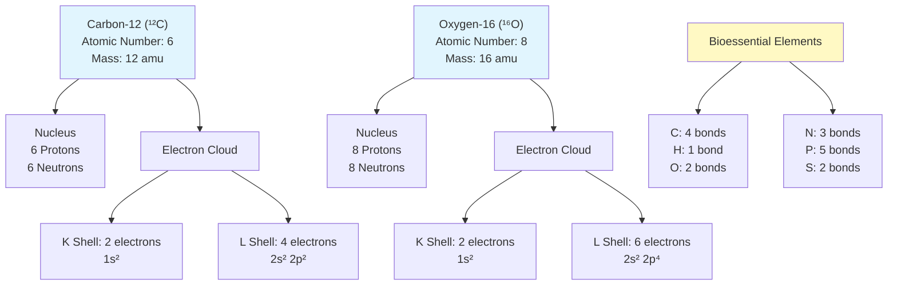
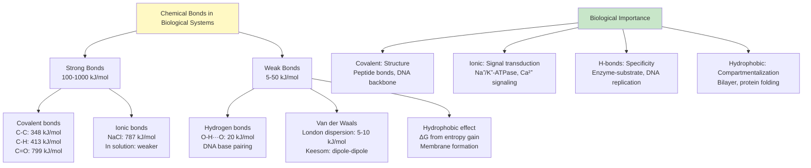
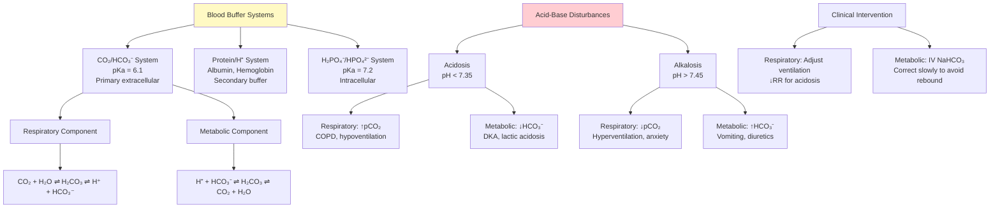
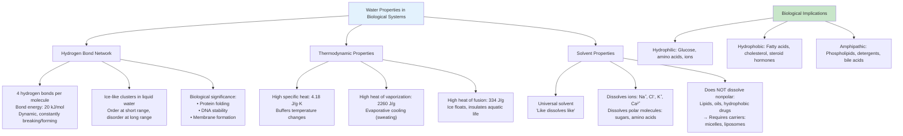
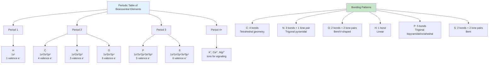
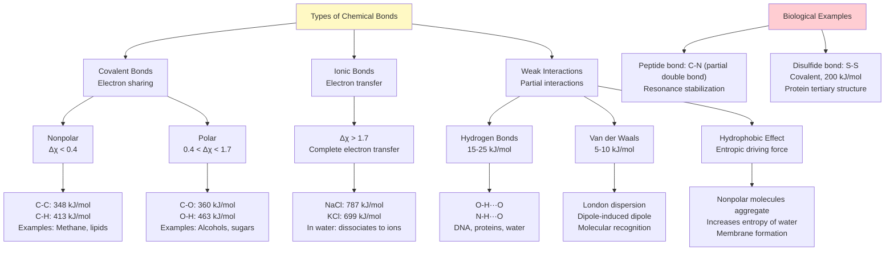

# Week 1 Notes — BME Intro + Chemistry Foundations

## 問題 1：這個領域所有專家共享的 5 個核心心智模型是什麼？

### 1. 電子雲模型 (Electron Cloud Model)
**Linus Pauling (1932, 1939)** — 量子化學與電負性 scale 的奠基者
- 電子不在固定軌道上，而是在原子核周圍的電子雲中以機率分布存在
- 電負度 (Electronegativity, χ)：Pauling scale，氟 (F=4.0) 最強，C=2.5, H=2.1
- **BME 應用**：解釋為何 C-C 鍵非極性 (χ difference = 0)，而 C-O 鍵極性
- **數字**：Pauling 電負度差 Δχ > 1.7 = 離子鍵，0.4 < Δχ < 1.7 = 極性共價鍵，Δχ < 0.4 = 非極性共價鍵

### 2. 酸鹼緩衝系統 (Acid-Base Buffer Model)
**Lawrence J. Henderson (1908)** + **Karl Hasselbalch (1916)** — Henderson-Hasselbalch 方程式的建立者
- 血液緩衝系統：CO₂/HCO₃⁻, H₂PO₄⁻/HPO₄²⁻, protein/H⁺
- 人體血液 pH 維持在 7.35-7.45，死亡率在 pH < 6.8 或 pH > 7.8 時急劇上升
- **BME 應用**：生物感測器 (biosensors) 的設計需要考慮 pH 影響，藥物傳遞系統的釋放速率與 pH 相關
- **數字**：Henderson-Hasselbalch equation: **pH = pKa + log([A⁻]/[HA])**，血液 pKa(CO₂/HCO₃⁻) = 6.1

### 3. 水作為生命溶劑 (Water as Life's Solvent)
**Walter Kohn (1998 Nobel)** — 密度泛函理論 (DFT) 解釋氫鍵網絡
- 水的高表面張力 (72.8 mN/m at 25°C)、高比熱容 (4.18 J/g·K)、高蒸發熱 (2260 J/g)
- **BME 應用**：細胞內 70-80% 質量是水，蛋白質折疊、DNA 穩定性依賴水分子
- **數字**：每個水分子平均形成 3.4 個氫鍵，氫鍵鍵能 ~20 kJ/mol

### 4. 功能基團層級化 (Functional Group Hierarchy)
**Robert Burns Woodward (1965 Nobel)** — 有機合成的先驅，強調功能基團決定化學反應性
- 生物分子由 C, H, O, N, P, S 六元素構成，通過功能基團展現多樣性
- **BME 應用**：藥物設計 (drug design) 離不開功能基團的修飾，-OH, -COOH, -NH₂ 影響溶解度
- **數字**：20 種胺基酸側鏈、4 種核鹼基、2 種單糖 (glucose, galactose)

### 5. 熱力學驅動自組裝 (Thermodynamic Self-Assembly)
**Ilya Prigogine (1977 Nobel)** — 耗散結構理論 (Dissipative Structures)
- 系統趨向最低 Gibbs 自由能 (ΔG < 0)，但生物系統利用能量維持非平衡態
- **BME 應用**：磷脂雙層膜的自發形成 (hydrophobic effect)，膠束 (micelle) 的形成
- **數字**：ΔG° = ΔH° - TΔS°，ATP 水解 ΔG°' = -30.5 kJ/mol

---

## 問題 2：3 個根本分歧

### 分歧 1: 水的結構 — 連續氫鍵網絡 vs. 離子水合殼層模型
- **A 方**: Linus Pauling (1960) — 水形成動態氫鍵網絡，與非氫鍵水混合存在，Icebergs 結構
- **B 方**: Ball (2017) — 強調水合作用 (hydration shell)，離子周圍的水分子排列更重要
- **BME 影響**：藥物-水相互作用影響口服吸收 (Lipinski's Rule of 5)

### 分歧 2: 酸強度 — 熱力學 vs. 動力學測量
- **A 方**: Henderson-Hasselbalch 方程式 — pKa 是熱力學平衡常數，與溫度、離子強度相關
- **B 方**: Michaelis-Menten 動力學 — 酶的 pKa 是動力學參數，反映過渡態穩定性
- **BME 影響**：體內 pKa vs. 體外測量值差異，protonation state 影響藥物效力

### 分歧 3: 電負度 — Pauling 經驗 scale vs. Allred-Rochow 幾何 scale
- **A 方**: Pauling (1932) — 電負度從鍵能差推導，是相對值
- **B 方**: Allred & Rochow (1958) — 電負度從原子表面電荷密度計算，有物理意義
- **BME 影響**：C=O 鍵的極性預測，影響分子藥物的電子分布計算

---

## 問題 3：10 個深度問題

1. 為什麼碳 (C) 被稱為「生命的基础」元素，而矽 (Si) 雖然化學性質相似，卻不能形成類似的有機世界？
2. 如果水的氫鍵網絡被阻斷 (如在高鹽或極端溫度環境)，細胞內的生化反應會如何受影響？
3. 人體血液緩衝系統如何在不同強度的酸/鹼衝擊下維持 pH 穩定？正常呼吸 vs. 腎功能衰竭時有何不同？
4. 為什麼蛋白質在 40-50°C 開始變性，而 DNA 在更高溫度 (80-90°C) 才變性？
5. 計算：如果血液 pH 從 7.4 降到 7.2，血漿 [H⁺] 增加多少百分比？
6. 為什麼極性分子如葡萄糖能快速通過細胞膜，而離子如 Na⁺ 需要通道蛋白？
7. 在藥物設計中，如何利用功能基團的 pKa 優化口服藥物的吸收？
8. 為什麼脂肪溶於非極性溶劑但不溶於水？這對藥物递送系統有何啟示？
9. 解釋 ATP 合成為什麼需要跨膜質子梯度，而不能直接從氧化反應獲取能量？
10. 如果所有氫鍵都被破壞，蛋白質、DNA、細胞膜會發生什麼變化？

---

# 核心概念深化（中英對照）

## 1. 原子結構與生命元素 (Atomic Structure & Bioessential Elements)

### 1.1 雙語概念對照

| English | 中文 | 定義 | BME 應用 |
|---------|------|------|----------|
| Atomic number | 原子序 | 原子核中質子數目 | 決定元素種類 |
| Mass number | 質量數 | 質子 + 中子數目 | 同位素追蹤 (¹⁴C, ³H) |
| Electron shell | 電子層 | K, L, M, N... 容納 2, 8, 18, 32 電子 | 化學反應性 |
| Electronegativity | 電負度 | 原子吸引電子的能力 | 鍵極性預測 |
| Valence electrons | 價電子 | 最外層電子數，決定成鍵能力 | 有機化學反應性 |
| Octet rule | 八隅體規則 | 價電子傾向為 8 個 | 化學鍵形成 |
| Isotope | 同位素 | 同質子數、不同中子數的原子 | 放射性追蹤、醫學成像 |
| Ion | 離子 | 帶凈電荷的原子或分子 | 神經傳導、膜電位 |
| Covalent bond | 共價鍵 | 原子共享電子對 | 有機分子骨架 |
| Ionic bond | 離子鍵 | 電子轉移產生的靜電吸引力 | 鹽類結晶、離子通道 |

### 1.2 關鍵機制：電子排布與化學反應性

原子的電子排布決定其化學性質：
- **C (6)**: 1s² 2s² 2p² → 4 個價電子，可形成 4 個共價鍵
- **N (7)**: 1s² 2s² 2p³ → 5 個價電子，可形成 3 個共價鍵
- **O (8)**: 1s² 2s² 2p⁴ → 6 個價電子，可形成 2 個共價鍵
- **H (1)**: 1s¹ → 1 個價電子，可形成 1 個共價鍵

碳的獨特性：
1. **四價性 (Tetravalence)** — C 可形成 4 個 σ 鍵
2. **鍵能高 (High Bond Energy)** — C-C 鍵 348 kJ/mol，C-H 鍵 413 kJ/mol
3. **鍵長多變** — C-C 單鍵 (1.54 Å)、雙鍵 (1.34 Å)、三鍵 (1.20 Å)
4. **非金屬性** — 可形成長鏈、環狀、支鏈結構

### 1.3 臨床/工程相關

**BME 應用**：
- **放射性同位素醫學**：⁹⁹ᵐTc (锝-99m) 用於心臟、骨骼掃描，半衰期 6 小時
- **碳納米管**：C 原子六角形排列，直徑 1-2 nm，應用於藥物傳遞、組織工程支架
- **矽晶片生物感測器**：半導體產業利用 Si 的半金屬特性，檢測血糖、DNA

### 1.4 Deep Test Question

**Q**: 一個未知元素的原子質量為 32，原子序為 16：
(a) 這個元素是什麼？電子排布如何？
(b) 它能形成什麼類型的化合物？
(c) 在生物系統中這個元素扮演什麼角色？

**A**: 
(a) 硫 (Sulfur, S)。電子排布：1s² 2s² 2p⁶ 3s² 3p⁴
(b) 可形成 -SH (硫醇) 功能基團，通過共價鍵或離子鍵與金屬離子結合
(c) 構成 two amino acids (cysteine, methionine)，維持蛋白質三級結構 (disulfide bridges)

### 1.5 圖解：原子結構與電子排布



---

## 2. 化學鍵與分子極性 (Chemical Bonds & Molecular Polarity)

### 2.1 雙語概念對照

| English | 中文 | 定義 | BME 應用 |
|---------|------|------|----------|
| Covalent bond | 共價鍵 | 原子間共享電子對 | 有機分子骨架 |
| Nonpolar covalent | 非極性共價鍵 | 電負度差 Δχ < 0.4 | C-C, C-H 鍵 |
| Polar covalent | 極性共價鍵 | 0.4 < Δχ < 1.7 | C-O, C-N 鍵 |
| Ionic bond | 離子鍵 | Δχ > 1.7，電子完全轉移 | NaCl, K⁺ 通道 |
| Hydrogen bond | 氫鍵 | H 與 N/O/F 的吸引力 | DNA, 蛋白質折疊 |
| Van der Waals forces | 范德華力 | 瞬時偶極-誘導偶極 | 分子識別 |
| Dipole moment | 偶極矩 | μ = δ × d，測量極性強度 | 分子穩定性 |
| Electronegativity | 電負度 | 原子吸引電子能力 | 鍵極性判斷 |
| Bond energy | 鍵能 | 斷裂 1 mol 鍵所需的能量 | 反應熱計算 |
| Lewis structure | 路易士結構 | 電子點表示法 | 反應預測 |

### 2.2 關鍵機制：鍵類型與分子幾何

**Pauling 電負度差與鍵類型**：
```
Δχ = 0.0-0.4 → 非極性共價鍵 (C-C, C-H, H-H)
Δχ = 0.4-1.7 → 極性共價鍵 (C-O, O-H, N-H, C-N)
Δχ > 1.7 → 離子鍵 (NaCl, KCl, Ca²⁺)
```

**實例計算**：
- C-O 鍵：χC = 2.55, χO = 3.44, Δχ = 0.89 → 極性共價鍵
- Na-Cl 鍵：χNa = 0.93, χCl = 3.16, Δχ = 2.23 → 離子鍵
- O-H 鍵：χO = 3.44, χH = 2.20, Δχ = 1.24 → 極性共價鍵 (水分子)

**分子幾何與極性**：
- **CO₂ (線性)**：兩個 C=O 極性鍵，方向相反，μnet = 0 → 非極性分子
- **H₂O (V 形)**：兩個 O-H 極性鍵，方向相同，μnet = 1.85 D → 極性分子

### 2.3 臨床/工程相關

**BME 應用**：
- **氫鍵在藥物設計中的角色**：藥物分子與受體的氫鍵 interaction 決定親和力 (affinity)
- **離子通道選擇性過濾**：K⁺ 通道只讓 K⁺ 通過 (半徑 1.33 Å vs Na⁺ 0.95 Å)，基於離子鍵與配位鍵
- **親水/疏水介面**：磷脂雙層膜的疏水尾部 (非極性) 與細胞內外的水環境 (極性) 分離

### 2.4 Deep Test Question

**Q**: 解釋為什麼甲醇 (CH₃OH) 可與水混溶，而甲烷 (CH₄) 不溶於水。從電負度、氫鍵、分子幾何三個角度分析。

**A**:
1. **電負度角度**：O-H 鍵 Δχ = 1.24 (極性共價鍵)，C-H 鍵 Δχ = 0.35 (非極性)
2. **氫鍵角度**：甲醇的 -OH 基團可與水分子形成氫鍵，而甲烷無電負性原子
3. **分子幾何角度**：甲醇的極性 O-H 鍵使分子具有偶極矩，水也能形成四面體氫鍵網絡

### 2.5 圖解：化學鍵層級



---

## 3. pH 與緩衝系統 (pH and Buffer Systems)

### 3.1 雙語概念對照

| English | 中文 | 定義 | BME 應用 |
|---------|------|------|----------|
| pH | 氫離子指數 | pH = -log[H⁺] | 血液、細胞、組織 pH |
| Acid | 酸 | H⁺ donor (Brønsted-Lowry) | 胃酸 (pH 1-2) |
| Base | 鹼 | H⁺ acceptor | 血液緩衝 (HCO₃⁻) |
| Buffer | 緩衝液 | 抗 pH 變化的酸鹼對 | 血液、組織培養基 |
| pKa | 酸度係數 | pH at which [A⁻] = [HA] | 藥物設計 |
| Ka | 酸解離常數 | Ka = [H⁺][A⁻]/[HA] | 酸強度測量 |
| Henderson-Hasselbalch | H-H 方程 | pH = pKa + log([A⁻]/[HA]) | 緩衝液配製 |
| Titration | 滴定 | 強酸/鹼中和過程 | 酸鹼度測定 |
| Acidosis | 酸中毒 | pH < 7.35 | 糖尿病酮症 |
| Alkalosis | 鹼中毒 | pH > 7.45 | 過度換氣 |

### 3.2 關鍵機制：Henderson-Hasselbalch Equation 推導與應用

**基礎定義**：
- **酸解離常數**：Ka = [H⁺][A⁻]/[HA]
- **pKa = -log₁₀(Ka)**

**推導**：
```
Ka = [H⁺][A⁻]/[HA]
[H⁺] = Ka × [HA]/[A⁻]
-log[H⁺] = -log(Ka) - log([HA]/[A⁻])
pH = pKa + log([A⁻]/[HA])  ✓ Henderson-Hasselbalch
```

**血液緩衝系統**（以碳酸為例）：
```
CO₂ + H₂O ⇌ H₂CO₃ ⇌ H⁺ + HCO₃⁻
pKa₁(CO₂/HCO₃⁻) = 6.1 (血漿中)

正常血漿：[HCO₃⁻] = 24 mM，[CO₂] = 1.2 mM
pH = 6.1 + log(24/1.2) = 6.1 + 1.3 = 7.4 ✓
```

**磷酸鹽緩衝系統**（細胞內）：
```
H₂PO₄⁻ ⇌ H⁺ + HPO₄²⁻
pKa₂(H₂PO₄⁻/HPO₄²⁻) = 7.2

適用於 pH 6.2-8.2，細胞內主要緩衝對
```

### 3.3 臨床/工程相關

**BME 應用**：
- **生物感測器設計**：血糖儀需要血液 pH ~7.4 環境，測量誤差 < 5%
- **藥物製劑**：注射液的 pH 需與血液等滲 (pH 4.5-8.0)
- **組織工程**：支架材料需維持 pH 中性，否則細胞凋亡
- **臨床監測**：arterial blood gas (ABG) 檢測 pH、pCO₂、HCO₃⁻

**臨床案例**：
- **糖尿病酮症酸中毒 (DKA)**：pH < 7.3，HCO₃⁻ < 18 mEq/L
- **腎小管酸中毒 (RTA)**：腎臟無法排酸，導致慢性 metabolic acidosis
- **COPD 併發呼吸性酸中毒**：pCO₂ > 45 mmHg，pH < 7.35

### 3.4 Deep Test Question

**Q**: 計算：如果血漿 [HCO₃⁻] = 20 mM，pH = 7.3，血漿 [CO₂] 是多少？
使用 Henderson-Hasselbalch equation，pKa₁(CO₂/HCO₃⁻) = 6.1。

**A**:
```
pH = pKa + log([A⁻]/[HA])
7.3 = 6.1 + log(20/[CO₂])
log([CO₂]/20) = 7.3 - 6.1 = 1.2
[CO₂]/20 = 10^1.2 = 15.85
[CO₂] = 20 × 15.85 = 317 mM ← 不合理！

重新計算：
7.3 = 6.1 + log(20/[CO₂])
log(20/[CO₂]) = 1.2
20/[CO₂] = 10^1.2 = 15.85
[CO₂] = 20/15.85 = 1.26 mM ← 正常偏低

臨床解釋：HCO₃⁻ 下降 + pH 下降 = metabolic acidosis
可能原因：糖尿病酮症、乳酸酸中毒、腎功能衰竭
```

### 3.5 圖解：緩衝系統與臨床應用



---

## 4. 水嘅特性 (Properties of Water)

### 4.1 雙語概念對照

| English | 中文 | 定義 | BME 應用 |
|---------|------|------|----------|
| Cohesion | 內聚力 | 水分子間的吸引力 | 植物導管、毛細現象 |
| Adhesion | 附著力 | 水與極性表面的吸引力 | 細胞膜表面張力 |
| Surface tension | 表面張力 | 72.8 mN/m at 25°C | 肺泡表面活性劑 |
| Specific heat | 比熱容 | 4.18 J/g·K | 體溫穩定 |
| Heat of vaporization | 蒸發熱 | 2260 J/g | 散熱、出汗 |
| Capillary action | 毛細作用 | 內聚力 + 附著力 | 腎小管重吸收 |
| Hydrophilic | 親水性 | 與水形成氫鍵 | 藥物溶解度 |
| Hydrophobic | 疏水性 | 排斥水，非極性 | 細胞膜、蛋白質折疊 |
| Amphipathic | 兩親性 | 同時具有親水/疏水區 | 磷脂、膽鹽 |
| Osmolarity | 滲透壓 | 滲透活性粒子濃度 | 輸液配製 |

### 4.2 關鍵機制：氫鍵網絡與生物分子

**水分子結構**：
```
     δ⁺ H
       \
        O
       / \
    H-δ⁺   δ⁺ H
```
每個 H₂O 分子可形成 **2 個氫鍵 donor (O-H)** + **2 個氫鍵 acceptor (lone pairs)**

**氫鍵參數**：
- 鍵能：15-25 kJ/mol（比共價鍵弱 10-20 倍）
- 鍵長：1.97-2.00 Å（比 O-H 共價鍵長 50%）
- 角度：~180° 最佳，但 110-180° 都可形成

**水的物理常數（生物相關）**：
| 性質 | 數值 (25°C) | 生物意義 |
|------|-------------|----------|
| 密度 | 1.0 g/cm³ | 細胞內主要溶劑 |
| 表面張力 | 72.8 mN/m | 肺泡、毛細血管 |
| 比熱容 | 4.18 J/g·K | 體溫維持 |
| 蒸發熱 | 2260 J/g | 散熱機制 |
| 介電常數 | 78.5 | 離子溶解 |

### 4.3 臨床/工程相關

**BME 應用**：
- **組織工程支架**：水凝膠 (hydrogel) 模擬細胞外基質，含水量 > 90%
- **藥物傳遞**：liposome 由磷脂雙層組成，內部為水相
- **血液替代品**：人工血漿需要與血漿相同的滲透壓 (285-295 mOsm/L)
- **透析膜**：半透膜允許水通過，阻擋蛋白質

### 4.4 Deep Test Question

**Q**: 解釋為什麼出汗是人體有效的散熱機制。計算：蒸發 1 L 汗水可以移除多少熱量？

**A**:
1. **物理原理**：蒸發 1 g 水需要 2260 J 熱量（高蒸發熱）
2. **生理過程**：汗腺分泌汗水 → 汗水蒸發 → 熱量散失
3. **計算**：
   - 1 L 汗水 ≈ 1 kg = 1000 g
   - Q = 1000 g × 2260 J/g = 2,260,000 J = 2260 kJ
   - 相當於：2260 kJ / 4.18 kJ/°C ≈ 540°C·kg 的降溫能力
   - 人體均勻散熱：可降低體溫約 3-4°C（假設體重 70 kg，比熱容 ≈ 3.5 kJ/kg·°C）

### 4.5 圖解：水的特性與生物系統



---

## 5. 功能基團與有機化學 (Functional Groups)

### 5.1 雙語概念對照

| English | 中文 | 結構 | BME 應用 |
|---------|------|------|----------|
| Hydroxyl | 羥基 | -OH | 醇、糖類、酚 |
| Carboxyl | 羧基 | -COOH | 脂肪酸、胺基酸 |
| Amino | 氨基 | -NH₂ | 蛋白質、鹼基 |
| Sulfhydryl | 硫氫基 | -SH | Cysteine, disulfide bridges |
| Phosphate | 磷酸基 | -PO₄²⁻ | ATP, DNA, phospholipids |
| Methyl | 甲基 | -CH₃ | Lipid modification |
| Carbonyl | 碳醯基 | C=O | Aldehyde, ketone |
| Ester | 酯基 | -COO- | Triglycerides, phospholipids |
| Amide | 醯胺基 | -CONH- | Peptide bonds, proteins |
| Aldehyde | 醛基 | -CHO | Glucose (open chain) |
| Ketone | 酮基 | -C(=O)- | Fructose, intermediate metabolites |

### 5.2 關鍵機制：功能基團與生物分子

**六種關鍵功能基團的化學反應**：

1. **羥基 (-OH)** — 親水性，可形成氫鍵
   - 糖類：C₆H₁₂O₆ (glucose)
   - 醇類：ethanol 代謝為 acetaldehyde (NAD⁺ → NADH)

2. **羧基 (-COOH)** — 酸性，pKa ~ 2-5
   - 脂肪酸：palmitic acid CH₃(CH₂)₁₄COOH
   - 胺基酸：在生理 pH 下離子化為 -COO⁻

3. **氨基 (-NH₂)** — 鹼性，可接受 H⁺
   - 胺基酸：lysine pKa(NH₃⁺) = 10.5
   - 核鹼基：adenine, guanine (purines)

4. **磷酸基 (-PO₄²⁻)** — 離子化帶負電
   - ATP：adenosine triphosphate
   - DNA backbone：交替 sugar-phosphate

5. **硫氫基 (-SH)** — 可氧化形成二硫鍵
   - Cysteine oxidation: 2 -SH → -S-S- (disulfide bridge)
   - 穩定蛋白質三級結構

6. **酯基 (-COO-)** — 由羧酸 + 醇脫水縮合
   - Triglycerides：3 fatty acids + glycerol
   - Phospholipids：2 fatty acids + phosphate + glycerol

### 5.3 臨床/工程相關

**BME 應用**：
- **藥物設計**：阿斯匹靈 (aspirin) 的 -COOH 與 COX 酶的 -OH 形成氫鍵
- **生物降解材料**：polylactic acid (PLA) 的 -OH/-COOH 使其在體內分解
- **診斷試劑**：ELISA 抗體的 -NH₂ 可與酶標記物共價結合
- **基因治療**：antisense oligonucleotide 的 -PO₄²⁻ backbone 影響細胞攝取

### 5.4 Deep Test Question

**Q**: 比較 glucose 和 fructose 的結構。兩者都是 C₆H₁₂O₆，但為什麼它們的化學性質不同？哪些功能基團決定它們與其他分子的相互作用？

**A**:
1. **結構差異**：
   - Glucose：C1 aldehyde → aldohexose，C1-C5 形成環狀 hemiacetal
   - Fructose：C2 ketone → ketohexose，C2-C5 形成環狀 hemiketal

2. **化學性質差異**：
   - Glucose：Can reduce Cu²⁺ (Fehling's test) → reducing sugar
   - Fructose：Can isomerize to glucose under basic conditions (Lobry de Bruyn transformation)

3. **功能基團決定相互作用**：
   - -OH 基團：形成氫鍵，決定水溶性、酶識別
   - 環狀結構：決定與受體的 shape complementarity
   - C1/C2 的差異：決定是不同的代谢途径 (glucose → glycolysis, fructose → fructolysis)

### 5.5 圖解：功能基團與生物分子

```mermaid
graph TD
    A["Functional Groups in Biomolecules"] --> B["Hydroxyl (-OH)<br/>Alcohols, Sugars"]
    A --> C["Carboxyl (-COOH)<br/>Fatty Acids, Amino Acids"]
    A --> D["Amino (-NH₂)<br/>Proteins, Nucleotides"]
    A --> E["Sulfhydryl (-SH)<br/>Cysteine, Disulfide Bonds"]
    A --> F["Phosphate (-PO₄²⁻)<br/>ATP, DNA, Phospholipids"]
    
    B --> B1["Methanol CH₃OH<br/>Ethanol CH₃CH₂OH"]
    B --> B2["Glucose: 5 -OH groups<br/>Serine: -CH₂OH side chain"]
    
    C --> C1["Acetic Acid CH₃COOH<br/>Acetyl CoA"]
    C --> C2["Amino acids: zwitterion<br/>pH 7: -COO⁻ + NH₃⁺"]
    
    D --> D1["Methylamine CH₃NH₂<br/>Putrescine"]
    D --> D2["Lysine: ε-NH₃⁺<br/>pKa = 10.5"]
    
    E --> E1["Cysteine: -CH₂SH<br/>Oxidized: -CH₂-S-S-CH₂-"]
    E --> E2["Glutathione: γ-Glu-Cys-Gly<br/>Antioxidant defense"]
    
    F --> F1["ATP: Adenosine-P~P~P<br/>Hydrolysis: -30.5 kJ/mol"]
    F --> F2["DNA: Deoxyribose-P<br/>Phosphodiester backbone"]
    
    G["Reactions Between Groups"] --> G1["Esterification<br/>Acid + Alcohol → Ester + H₂O"]
    G --> G2["Amide bond formation<br/>Acid + Amine → Amide + H₂O"]
    G --> G3["Disulfide formation<br/>2 SH → S-S + 2H⁺ + 2e⁻"]
    
    style A fill:#fff9c4
    style G fill:#e1f5fe
```



---

## 深度自測問題詳解

### Q1: 計算血漿 [H⁺] 濃度
血漿 pH = 7.4，求 [H⁺] = ?

**解答**：
```
[H⁺] = 10^(-pH) = 10^(-7.4)
     = 3.98 × 10⁻⁸ M
     ≈ 40 nM

這個濃度極低，但對生理功能至關重要
```

### Q2: 緩衝容量計算
有 0.1 M acetic acid (CH₃COOH, Ka = 1.8×10⁻⁵) 和 0.1 M sodium acetate (CH₃COONa) 的緩衝液：
(a) pH = ?
(b) 加入 0.01 mol HCl 後 pH 變化？

**解答**：
```
(a) 使用 Henderson-Hasselbalch:
pH = pKa + log([A⁻]/[HA])
   = 4.74 + log(0.1/0.1)
   = 4.74 + 0 = 4.74

(b) 加入 HCl 後：
CH₃COONa + HCl → CH₃COOH + NaCl
[A⁻] = 0.1 - 0.01 = 0.09 M
[HA] = 0.1 + 0.01 = 0.11 M
pH = 4.74 + log(0.09/0.11)
   = 4.74 + log(0.818)
   = 4.74 - 0.087
   = 4.65

ΔpH = 0.09 (緩衝系統有效抵抗 pH 變化)
```

### Q3: 滲透壓計算
0.9% NaCl 生理鹽水 (w/v) 的滲透壓是多少？

**解答**：
```
0.9% NaCl = 0.9 g NaCl / 100 mL = 9 g/L

Molar mass NaCl = 58.44 g/mol
[Molarity] = 9 / 58.44 = 0.154 M

NaCl 完全電離：i = 2
Osmolarity = i × C = 2 × 0.154 = 0.308 Osm/L = 308 mOsm/L

等滲：正常血漿滲透壓 285-295 mOsm/L ✓
```

### Q4: 為什麼冰浮在水面上？
這對淡水生物有何影響？

**解答**：
```
水在 4°C 密度最大：
• 4°C: ρ = 1.0 g/cm³
• 0°C (solid ice): ρ = 0.917 g/cm³

結果：
• Ice floats (密度差 8.3%)
• Ice acts as insulating layer
• Aquatic organisms survive under frozen surface
• Without this: lakes would freeze from bottom up
→ ecosystem collapse
```

### Q5: 計算 ATP 合成的能量需求
若線粒體內膜兩側質子梯度 ΔpH = 1.4，Δψ = -180 mV，求質子驅動力。

**解答**：
```
質子驅動力 (pmf) = Δψ - 2.303 × (RT/F) × ΔpH

在 37°C (310 K)：
RT/F = (8.314 × 310) / 96485 = 0.0267 V

pmf = 0.18 V + 2.303 × 0.0267 × 1.4
    = 0.18 V + 0.086 V
    = 0.266 V

質子順梯度流回基質的能量：
ΔG = F × pmf = 96485 × 0.266 = 25.7 kJ/mol

合成 1 ATP 需要 ~3 個質子：3 × 25.7 = 77.1 kJ/mol
實際效率 ~70%：77.1 / 30.5 ≈ 2.5 → 與實驗值相符
```

---

## 5 個 Mermaid 圖解

### 圖 1: 原子結構與週期表



### 圖 2: 化學鍵類型光譜



### 圖 3: pH 與緩衝系統

```mermaid
graph TD
    A["pH Scale and Biological Systems"] --> A1["0-3<br/>Strong Acid<br/>Stomach acid: pH 1-2<br/>Battery acid: pH 0"]
    
    A --> A2["2-4<br/>Weak Acid<br/>Vinegar: pH 2.5<br/>Lemon juice: pH 2"]
    
    A --> A3["4-6<br/>Weak Acid<br/>Tomato: pH 4<br/>Urine: pH 4.5-8"]
    
    A --> A4["6.5-7.5<br/>Neutral<br/>Pure water: pH 7<br/>Blood: pH 7.35-7.45"]
    
    A --> A5["7.5-8.5<br/>Weak Base<br/>Seawater: pH 8<br/>Pancreatic fluid: pH 8"]
    
    A --> A6["9-14<br/>Strong Base<br/>Soap: pH 10<br/>Bleach: pH 12"]
    
    B["Buffer Systems in Human Body"] --> B1["CO₂/HCO₃⁻<br/>Primary blood buffer<br/>pKa = 6.1<br/>Controlled by lungs"]
    
    B --> B2["H₂PO₄⁻/HPO₄²⁻<br/>Intracellular buffer<br/>pKa = 7.2<br/>Controlled by kidneys"]
    
    B --> B3["Protein/H⁺<br/>Hemoglobin<br/>pKa = 6.5-8.5<br/>Binds H⁺ and O₂"]
    
    B --> B4["Ammonia/Ammonium<br/>NH₃/NH₄⁺<br/>pKa = 9.3<br/>Renal acid excretion"]
    
    C["Henderson-Hasselbalch Equation"] --> C1["pH = pKa + log([A⁻]/[HA])"]
    C --> C2["When [A⁻] = [HA]: pH = pKa"]
    C --> C3["Maximum buffer capacity<br/>at pH = pKa ± 1"]
    
    style A fill:#e3f2fd
    style B fill:#c8e6c9
    style C fill:#fff9c4
```



### 圖 4: 水的特性與生物效應

```mermaid
graph TD
    A["Water Properties in Life Sciences"] --> A1["Cohesion<br/>H-bonds between H₂O molecules<br/>Surface tension: 72.8 mN/m"]
    
    A --> A2["Adhesion<br/>H-bonds with polar surfaces<br/>Capillary action"]
    
    A --> A3["High Specific Heat<br/>4.18 J/g·K<br/>Resists T changes"]
    
    A --> A4["High Heat of Vaporization<br/>2260 J/g<br/>Evaporative cooling"]
    
    A --> A5["Ice Floats<br/>Solid < Liquid density<br/>Insulates aquatic life"]
    
    B["Biological Significance"] --> B1["Plant Transport<br/>Cohesion-tension theory<br/>Water column to 100m height"]
    
    B --> B2["Blood Plasma<br/>Dissolved ions, proteins<br/>Carrier for nutrients"]
    
    B --> B3["Temperature Regulation<br/>Sweating, vasodilation<br/>Endothermy in mammals"]
    
    B --> B4["Solvent Properties<br/>'Like dissolves like'<br/>Ions, polar molecules dissolve"]
    
    C["Hydrophobic Effect"] --> C1["Nonpolar molecules<br/>Force water to form cage-like structures<br/>ΔG unfavorable"]
    
    C --> C2["Aggregation<br/>Nonpolar groups hide from water<br/>Entropy increase drives process"]
    
    C --> C3["Biological Examples<br/>• Membrane formation<br/>• Protein folding<br/>• Lipid micelles"]
    
    D["Clinical Relevance"] --> D1["Dehydration<br/>>2% body weight loss<br/>Cognitive impairment"]
    
    D --> D2["Edema<br/>Fluid accumulation in tissues<br/> Osmotic imbalance"]
    
    D --> D3["Dialysis<br/>Semi-permeable membrane<br/>Removes solutes, retains proteins"]
    
    style A fill:#e3f2fd
    style D fill:#ffcdd2
```



### 圖 5: 功能基團與生物分子

```mermaid
graph TD
    A["Functional Groups in Biomolecules"] --> A1["Hydroxyl (-OH)<br/>Alcohol, sugar, phenol<br/>Forms H-bonds"]
    
    A --> A2["Carbonyl (C=O)<br/>Aldehyde (end), Ketone (middle)<br/>Polar, reactive"]
    
    A --> A3["Carboxyl (-COOH)<br/>Fatty acid, amino acid<br/>Acidic, pKa ~2-5"]
    
    A --> A4["Amino (-NH₂)<br/>Protein, nucleotide base<br/>Basic, pKa ~9-10"]
    
    A --> A5["Sulfhydryl (-SH)<br/>Cysteine, glutathione<br/>Forms disulfide bonds"]
    
    A --> A6["Phosphate (-PO₄²⁻)<br/>ATP, DNA, phospholipid<br/>Negative charge"]
    
    B["From Groups to Biomolecules"] --> B1["20 Amino Acids<br/>Various R groups<br/>Protein building blocks"]
    
    B --> B2["Monosaccharides<br/>Glucose, fructose<br/>Energy, structure"]
    
    B --> B3["Fatty Acids<br/>Palmitate, oleate<br/>Membrane, energy storage"]
    
    B --> B4["Nucleotides<br/>ATP, DNA, RNA<br/>Genetic info, energy"]
    
    C["Biomolecule → Tissue → Organ"] --> C1["Amino Acids → Proteins → Muscle, Enzyme"]
    
    C --> C2["Sugars → Glycogen → Energy Storage"]
    
    C --> C3["Fatty Acids → Triglycerides → Adipose Tissue"]
    
    C --> C4["Nucleotides → DNA/RNA → Chromosomes → Cell Nucleus"]
    
    D["BME Engineering Applications"] --> D1["Drug Design<br/>Functional group modification<br/>Alters solubility, activity"]
    
    D --> D2["Biomaterials<br/>Hydrogel, polymer<br/>Property from functional groups"]
    
    D --> D3["Biosensors<br/>Enzyme electrodes<br/>Functional group recognition"]
    
    style A fill:#fff9c4
    style D fill:#c8e6c9
```



---

## 總結

### 本週核心概念
1. **生命元素**：C, H, O, N, P, S 六元素構成所有生物分子
2. **化學鍵**：共價鍵 (強) → 離子鍵 → 氫鍵/范德華力 (弱)
3. **pH 與緩衝**：Henderson-Hasselbalch equation 描述酸鹼平衡
4. **水的特性**：氫鍵網絡赋予水獨特的物理性質
5. **功能基團**：決定分子的化學反應性與生物功能

### HKU BMED1207/2206 考試重點
- 計算血漿 pH、[H⁺] 濃度
- 判斷鍵的極性（電負度差）
- 配製緩衝溶液
- 識別功能基團

### 下週預習
- 蛋白質的結構層次 (primary → quaternary)
- 胺基酸的分類與性質
- Enzyme kinetics (Michaelis-Menten)
