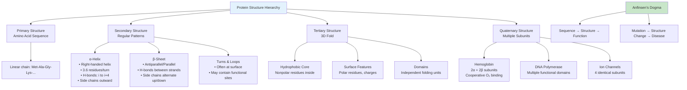
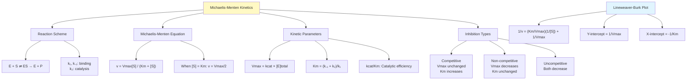
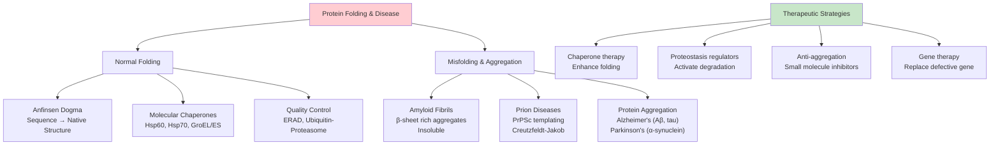
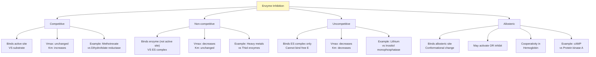

# Week 2 Notes — Biomolecules & Biochemistry

## 問題 1：這個領域所有專家共享的 5 個核心心智模型是什麼？

### 1. 結構-功能關係 (Structure-Function Relationship)
**Christian Anfinsen (1973 Nobel Prize)** — 蛋白質折疊熱力學假說
- **Anfinsen Dogma**: 蛋白質的胺基酸序列決定其三維結構，三維結構決定功能
- **實驗證據**: 核糖核酸酶 (RNase A) 的變性-復性實驗，1960s
- **數字**: 20 種天然胺基酸，可形成 >10⁶ 種不同的蛋白質
- **BME 應用**: 蛋白質工程、藥物設計、抗體療法、酶替代療法

### 2. Michaelis-Menten 酶動力學 (Enzyme Kinetics Model)
**Leonor Michaelis (1875-1949) & Maud Menten (1879-1960)** — 1913 年提出恆態假設
- **核心方程**: v = (Vmax × [S]) / (Km + [S])
- **參數意義**: 
  - Km = [S] at which v = Vmax/2 (Michaelis 常數)
  - Vmax = maximum reaction velocity
- **數字**: 典型 Km = 10⁻⁴ to 10⁻² M，kcat = 1-10⁴ s⁻¹
- **BME 應用**: 藥物動力學、毒素抑制分析、臨床酶學診斷

### 3. 中央法則與遺傳信息流 (Central Dogma)
**Francis Crick (1958, 1970)** — DNA → RNA → Protein
- **Watson & Crick (1953)**: DNA 雙螺旋結構揭示複製機制
- **半保留複製**: Meselson-Stahl 實驗 (1958) 證明
- **數字**: 人類基因組 3.2 billion bp，編碼 ~20,000 蛋白質
- **BME 應用**: 基因治療、重組DNA技術、CRISPR、基因檢測

### 4. 兩親性與膜自組裝 (Amphipathicity & Membrane Self-Assembly)
**Singer & Nicolson (1972)** — 流動鑲嵌模型
- 磷脂分子同時具有親水頭部 (hydrophilic head) 和疏水尾部 (hydrophobic tail)
- 自發形成雙層膜結構 (ΔG < 0)，減少疏水表面暴露於水
- **數字**: 膜厚 ~5-10 nm，脂質分子面積 ~0.5 nm²，扩散係數 D ~1 μm²/s
- **BME 應用**: 藥物傳遞載體 (liposome, micelle)、生物感測器膜、人工細胞

### 5. 熱力學vs動力學控制 (Thermodynamic vs. Kinetic Control)
**Hans Krebs (1937)** — 三羧酸循環 (Krebs cycle)
- 細胞代谢同時受熱力學驅動 (ΔG < 0) 和酶動力學控制
- ATP 作為能量貨幣 (ΔG°' = -30.5 kJ/mol)
- **數字**: 葡萄糖完全氧化產生 30-32 ATP
- **BME 應用**: 代谢工程、癌症治療靶點 (Warburg effect)、藥物代谢

---

## 問題 2：3 個根本分歧

### 分歧 1: 蛋白質折疊 — 熱力學假說 vs. 動力學漏斗模型
- **A 方**: Anfinsen (1973) — 折疊是熱力學驅動的過程，蛋白質趨向最低自由能狀態
- **B 方**: Bryngelson & Wolynes (1987) — 折疊受動力學限制，存在 kinetic trap，存在折叠的中間態
- **BME 影響**: 蛋白質錯誤折疊疾病 (amyloid, prion) 的治療策略

### 分歧 2: 酶催化 — 過渡態穩定理論 vs. 量子隧穿模型
- **A 方**: Pauling (1948), Haldane (1930) — 酶通過穩定過渡態降低活化能
- **B 方**: Klinman & Kohen (2013) — 某些酶反應涉及氫隧穿 (hydrogen tunneling)
- **BME 影響**: 酶抑制劑設計策略

### 分歧 3: DNA 複製 — 連續 vs. 不連續複製
- **A 方**: Okazaki (1968) — DNA 複製是不連續的 (Okazaki fragments)
- **B 方**: 某些病毒 (adenovirus) 使用滾環複製機制
- **BME 影響**: 抗病毒藥物設計

---

## 問題 3：10 個深度問題

1. 如果蛋白質胺基酸序列突變一個殘基，如何預測對蛋白質結構和功能的影響？
2. 為什麼 Km 不等於酶-底物解離常數 (Kd)？在什麼條件下兩者相等？
3. competitive inhibition 和 non-competitive inhibition 在臨床藥物設計中有什麼不同應用？
4. 為什麼大多數藥物是針對 GPCR (G蛋白偶聯受體) 而不是其他蛋白質？
5. 如果 DNA 突變導致蛋白質活性中心的關鍵胺基酸被取代，會發生什麼？
6. 碳水化合物的結構多樣性如何影響其在生物系統中的功能？
7. 為什麼脂肪是高能量密度分子？計算 1g 脂肪 vs 1g 碳水化合物的能量產量。
8. 細胞如何確保 DNA 複製的高保真度 (fidelity)？
9. 為什麼某些蛋白質需要分子伴侶 (chaperones) 才能正確折疊？
10. 如果所有酶的 Km 都增加 10 倍，對細胞代谢會有什麼影響？

---

# 核心概念深化（中英對照）

## 1. 蛋白質結構層次 (Protein Structure Hierarchy)

### 1.1 雙語概念對照

| English | 中文 | 定義 | BME 應用 |
|---------|------|------|----------|
| Primary structure | 一級結構 | 胺基酸線性序列 | 蛋白質測序 |
| Secondary structure | 二級結構 | α-螺旋、β-摺疊 | 穩定性預測 |
| Tertiary structure | 三級結構 | 3D 摺疊 | 藥物靶點 |
| Quaternary structure | 四級結構 | 多亞基組裝 | 抗體設計 |
| Denaturation | 變性 | 結構破壞，功能喪失 | 蛋白質純化 |
| Renaturation | 復性 | 恢復自然結構 | 蛋白質折疊研究 |
| Chaperone | 分子伴侶 | 輔助折疊的蛋白質 | 疾病機制 |
| Domain | 結構域 | 獨立折疊的單位 | 蛋白質工程 |
| Motif | 結構模體 | 常見的組合模式 | 結構分類 |
| Folding | 折疊 | 形成功能構象 | 摺疊病 |

### 1.2 蛋白質二級結構

**α-螺旋 (Alpha Helix)**:
- 右手螺旋，每 3.6 個殘基一圈
- 氫鍵：N-H(i) 與 C=O(i+4) 形成
- 側鏈向外伸出
- 典型長度：12-50 個殘基

**β-摺疊 (Beta Sheet)**:
- 平行或反平行排列
- 氫鍵：N-H 與 C=O 跨鏈連接
- 側鏭交替上下伸出
- 兩種類型：parallel, antiparallel

**典型殘基偏好**:
| 結構 | 偏好殘基 | 避免殘基 |
|------|----------|----------|
| α-螺旋 | Ala, Leu, Glu, Met | Pro, Gly |
| β-摺疊 | Val, Ile, Tyr, Phe | Pro, Gly |
| Turn | Gly, Asn, Pro | - |

### 1.3 臨床/工程相關

**BME 應用**:
- **單株抗體**: Y-shaped IgG (150 kDa)，VH/VL domain 是藥物開發重點
- **重組蛋白藥物**: Insulin (51 aa), Growth hormone (191 aa)
- **酶替代療法**: Gaucher disease (β-glucocerebrosidase), Pompe disease (α-glucosidase)
- **Cryo-EM**: 結構生物學 revolution，解析 > 150 kDa 蛋白質

### 1.4 Deep Test Question

**Q**: 一個蛋白質含有 500 個胺基酸。如果第 200 位的甘氨酸 (Gly) 被脯氨酸 (Pro) 取代，對蛋白質二級結構有何影響？

**A**:
1. **結構影響**: Gly 是最小的胺基酸 (H side chain)，Pro 是唯一帶二級胺 (-NH而非-NH₂-) 的胺基酸
2. **α-螺旋破壞**: Pro 作為 helix breaker，因為其五元環結構限制 φ 角，且缺乏 backbone NH 可供氫鍵
3. **預測**: 第 200 位區域的 α-螺旋可能被中斷，形成 loop 或 turn
4. **功能影響**: 取決於該區域是否位於活性位點或蛋白質-蛋白質介面

### 1.5 圖解：蛋白質結構層次



---

## 2. 酶動力學 (Enzyme Kinetics)

### 2.1 雙語概念對照

| English | 中文 | 定義 | BME 應用 |
|---------|------|------|----------|
| Enzyme | 酶 | Biological catalyst | 藥物靶點 |
| Substrate | 底物 | Enzyme's target molecule | 代謝分析 |
| Active site | 活性位點 | Catalytic region | 抑制劑設計 |
| Michaelis constant | Michaelis 常數 | Km = (k₋₁ + k₂)/k₁ | 酶活性測定 |
| Vmax | 最大反應速率 | Maximum velocity | 動力學分析 |
| Turnover number | 轉化數 | kcat = Vmax/[E]total | 催化效率 |
| Competitive inhibition | 競爭性抑制 | Same binding site | 藥物動力學 |
| Non-competitive | 非競爭性抑制 | Different binding site | 毒素機制 |
| Allosteric regulation | 別構調節 | Conformational change | 代謝控制 |
| Lineweaver-Burk plot | LB 圖 | 1/v vs 1/[S] | 動力學測定 |

### 2.2 Michaelis-Menten 方程推導

**基本假設**:
1. Enzyme (E) + Substrate (S) ⇌ ES complex (with rate constants k₁, k₋₁)
2. ES → E + P with rate constant k₂
3. Steady-state assumption: d[ES]/dt ≈ 0

**推導過程**:
```
At steady state:
d[ES]/dt = k₁[E][S] - k₋₁[ES] - k₂[ES] = 0
k₁[E][S] = (k₋₁ + k₂)[ES]
[ES] = (k₁[E][S])/(k₋₁ + k₂)
```

**Michaelis constant**:
```
Km = (k₋₁ + k₂)/k₁

When [S] = Km:
[ES] = (k₁[E][S])/(k₋₁ + k₂) = [E][S]/Km = [E]/2
→ v = Vmax/2
```

**Michaelis-Menten equation**:
```
v = (Vmax × [S])/(Km + [S])

Special cases:
• [S] << Km: v ≈ (Vmax/Km) × [S] (first order)
• [S] >> Km: v ≈ Vmax (zero order)
• [S] = Km: v = Vmax/2
```

### 2.3 酶抑制類型

| 抑制類型 | 機制 | Vmax | Km | Lineweaver-Burk |
|----------|------|------|-----|-----------------|
| Competitive | 競爭底物結合位點 | 不變 | 增加 | 斜率增加，Y軸截距不變 |
| Non-competitive | 結合ES或E | 降低 | 不變 | 斜率不變，Y軸截距增加 |
| Uncompetitive | 只結合ES | 降低 | 降低 | 平行線 |

**方程式**:
- Competitive: 1/v = (Km/Vmax)(1 + [I]/Ki)(1/[S]) + 1/Vmax
- Non-competitive: 1/v = (Km/Vmax)(1/[S]) + (1 + [I]/Ki)/Vmax

### 2.4 臨床/工程相關

**BME 應用**:
- **ACE抑制劑**: Captopril, enalapril (competitive inhibition of angiotensin-converting enzyme)
- **COX抑制劑**: Aspirin (irreversible acetylation of COX-1, non-competitive component)
- **Clinical enzymology**: ALT, AST, LDH, ALP as disease markers
- **Enzyme replacement therapy**: Recombinant ADA for SCID, alglucosidase alfa for Pompe disease

### 2.5 圖解：酶動力學



---

## 3. 碳水化合物 (Carbohydrates)

### 3.1 雙語概念對照

| English | 中文 | 定義 | BME 應用 |
|---------|------|------|----------|
| Monosaccharide | 單糖 | 單一糖單元 | 能量來源 |
| Disaccharide | 雙糖 | 兩個單糖 | 血糖 |
| Polysaccharide | 多糖 | 多個單糖 | 儲存/結構 |
| Glycosidic bond | 醣苷鍵 | 連接糖的鍵 | 結構多樣性 |
| Aldose | 醛糖 | 含醛基的糖 | Glucose |
| Ketose | 酮糖 | 含酮基的糖 | Fructose |
| Reducing sugar | 還原糖 | 能還原Cu²⁺/Fe³⁺ | 血糖檢測 |
| Glycemic index | 血糖指數 | 升糖速度 | 糖尿病 |
| Glucose | 葡萄糖 | C₆H₁₂O₆ | 主要能源 |
| Glycogen | 糖原 | 動物儲存多糖 | 肌肉能量 |

### 3.2 常見單糖結構

| 單糖 | 碳數 | 類型 | 功能 |
|------|------|------|------|
| Glucose | C6 | Aldose | Primary energy currency |
| Fructose | C6 | Ketose | Fruit sugar, metabolic intermediate |
| Galactose | C6 | Aldose | Component of lactose |
| Ribose | C5 | Aldose | RNA backbone |
| Deoxyribose | C5 | Aldose | DNA backbone |

**葡萄糖的環化形式**:
- 吡喃糖 (Pyranose): 6-membered ring (glucose)
- 呋喃糖 (Furanose): 5-membered ring (fructose in DNA)

### 3.3 臨床/工程相關

**BME 應用**:
- **血糖監測**: 葡萄糖氧化酶法 (GOX)，血糖儀原理
- **Glycemic index**: 糖尿病飲食管理
- **Hyaluronic acid**: 關節潤滑、制藥輔料
- **Chitosan**: 甲殼素衍生物，藥物載體

### 3.4 圖解：碳水化合物分類

```mermaid
graph TD
    A["Carbohydrates"] --> B["Monosaccharides<br/>Single unit"]
    A --> C["Disaccharides<br/>Two units"]
    A --> D["Polysaccharides<br/>Many units"]
    
    B --> B1["Trioses: G3P, DHAP"]
    B --> B2["Tetroses: Erythrose"]
    B --> B3["Pentoses: Ribose, Xylose"]
    B --> B4["Hexoses: Glucose, Fructose,<br/>Galactose, Mannose"]
    B --> B5["Heptoses: Sedoheptulose"]
    
    C --> C1["Maltose: Glc-α1-4-Glc"]
    C --> C2["Sucrose: Glc-α1-2-β-Fru"]
    C --> C3["Lactose: Gal-β1-4-Glc"]
    C --> C4["Trehalose: Glc-α1-1-α-Glc"]
    
    D --> D1["Storage"]
    D --> D2["Structural"]
    
    D1 --> D1a["Starch: Amylose + Amylopectin<br/>Plant storage"]
    D1 --> D1b["Glycogen: α1-4 + α1-6 branches<br/>Animal storage"]
    D1 --> D1c["Inulin: β2-1 fructans<br/>Plant storage"]
    
    D2 --> D2a["Cellulose: β1-4 glucan<br/>Plant cell wall"]
    D2 --> D2b["Chitin: β1-4 N-acetylglucosamine<br/>Insect exoskeleton"]
    D2 --> D2c["Peptidoglycan: Bacterial cell wall"]
    
    E["Biological Functions"] --> E1["Energy: Glucose → ATP"]
    E --> E2["Structure: Cell wall, chitin"]
    E --> E3["Recognition: Glycoproteins, glycolipids"]
    E --> E4["Storage: Glycogen, starch"]
    
    style A fill:#e3f2fd
    style E fill:#c8e6c9
```



---

## 4. 核酸結構 (Nucleic Acid Structure)

### 4.1 雙語概念對照

| English | 中文 | 定義 | BME 應用 |
|---------|------|------|----------|
| Nucleotide | 核苷酸 | Base + Sugar + Phosphate | DNA/RNA 結構 |
| Nucleoside | 核苷 | Base + Sugar | 藥物前體 |
| Base pairing | 鹼基配對 | A-T, G-C (DNA) | 複製基礎 |
| Double helix | 雙螺旋 | Watson-Crick structure | 基因組 |
| Phosphodiester bond | 磷酸二酯鍵 | Backbone linkage | 穩定性 |
| Major groove | 大溝 | DNA surface feature | 蛋白質結合 |
| mRNA | 信使RNA | Protein synthesis template | 基因表達 |
| tRNA | 轉運RNA | Amino acid carrier | 翻譯 |
| rRNA | 核糖體RNA | Ribosome component | 蛋白質合成 |

### 4.2 DNA vs RNA

| 特性 | DNA | RNA |
|------|-----|-----|
| Sugar | Deoxyribose (2'-H) | Ribose (2'-OH) |
| Bases | A, T, G, C | A, U, G, C |
| Structure | Double helix | Single strand (usually) |
| Stability | More stable (no 2'-OH) | Less stable (alkaline hydrolysis) |
| Location | Nucleus, mitochondria | Nucleus, cytoplasm |
| Function | Information storage | Protein synthesis |

### 4.3 Deep Test Question

**Q**: 計算一段 1000 bp 的雙鏈 DNA 分子的分子量和長度。

**A**:
1. **核苷酸平均分子量**: ~330 Da (dNMP without phosphate) 或 ~660 Da (as base-paired duplex)
2. **dsDNA 分子量**: 1000 bp × 660 Da/bp = 660,000 Da = 660 kDa
3. **長度**: 每 bp 0.34 nm → 1000 × 0.34 nm = 340 nm = 0.34 μm

### 4.4 圖解：DNA結構

```mermaid
graph TD
    A["DNA Structure"] --> B["Nucleotide Components"]
    B --> B1["Phosphate Group<br/>(-PO₄²⁻)"]
    B --> B2["Deoxyribose Sugar<br/>5-carbon, 2'-H"]
    B --> B3["Nitrogenous Bases<br/>Purines: A, G<br/>Pyrimidines: T, C"]
    
    A --> C["Watson-Crick Base Pairing"]
    C --> C1["Adenine (A) ─ Thymine (T)<br/>2 hydrogen bonds"]
    C --> C2["Guanine (G) ≡ Cytosine (C)<br/>3 hydrogen bonds"]
    C --> C3["G+C rich = More stable"]
    
    A --> D["Double Helix (B-form)"]
    D --> D1["Right-handed helix"]
    D --> D2["10.5 bp/turn"]
    D --> D3["Major & minor grooves"]
    D --> D4["Antiparallel strands<br/>5' → 3' and 3' → 5'"]
    
    A --> E["Stability Factors"]
    E --> E1["Hydrogen bonds: 2-3 per pair"]
    E --> E2["Base stacking: hydrophobic<br/>Van der Waals forces"]
    E --> E3["Ionic interactions<br/>Mg²⁺ screens charge repulsion"]
    
    F["Replication"] --> F1["Semi-conservative<br/>Meselson-Stahl 1958"]
    F --> F2["5' → 3' synthesis only"]
    F --> F3["Leading & lagging strands"]
    
    style A fill:#fff9c4
    style F fill:#c8e6c9
```



---

## 5. 脂質與膜 (Lipids and Membranes)

### 5.1 雙語概念對照

| English | 中文 | 定義 | BME 應用 |
|---------|------|------|----------|
| Fatty acid | 脂肪酸 | Carboxylic acid + hydrocarbon chain | 能量儲存 |
| Triglyceride | 三酸甘油脂 | 3 fatty acids + glycerol | 脂肪組織 |
| Phospholipid | 磷脂 | 2 FA + phosphate + head group | 膜的主要成分 |
| Cholesterol | 膽固醇 | Steroid nucleus | 膜流動性 |
| Amphipathic | 兩親性 | Hydrophilic + hydrophobic | 自組裝 |
| Lipid bilayer | 磷脂雙層 | Self-assembled membrane | 細胞膜 |
| Fluid mosaic model | 流動鑲嵌模型 | Singer & Nicolson 1972 | 膜結構 |
| Membrane protein | 膜蛋白 | Integral or peripheral | 信號轉導 |

### 5.2 膜的流動性與組成

**影響膜流動性的因素**:
1. **脂肪酸鏈長度**: 越短，越流動
2. **飽和度**: 不飽和鍵產生 kinks，增加流動性
3. **膽固醇**: 雙向調節 (增加剛性在高T，低T在高T流動)

**膜脂質的類型**:
| 類型 | 示例 | 功能 |
|------|------|------|
| Phosphoglycerides | PC, PE, PS, PI | 膜主體 |
| Sphingolipids | Sphingomyelin | 神經髓鞘 |
| Sterols | Cholesterol | 流動性調節 |
| Glycolipids | Gangliosides | 細胞識別 |

### 5.3 圖解：膜結構

```mermaid
graph TD
    A["Biological Membrane"] --> B["Lipid Bilayer"]
    A --> C["Membrane Proteins"]
    A --> D["Carbohydrates"]
    
    B --> B1["Phospholipids<br/>• Head: polar, hydrophilic<br/>• Tail: nonpolar, hydrophobic"]
    B --> B2["Cholesterol<br/>• Intercalates between phospholipids<br/>• Regulates fluidity"]
    B --> B3["Lipid Rafts<br/>• Sphingolipid/cholesterol microdomains<br/>• Signaling platforms"]
    
    C --> C1["Integral Proteins<br/>• Transmemebrane<br/>• α-helix or β-barrel"]
    C --> C2["Peripheral Proteins<br/>• Attach via protein-protein interactions<br/>• Cytoskeleton link"]
    C --> C3["Anchored Proteins<br/>• Lipid-anchored<br/>• GPI-anchored"]
    
    D --> D1["Glycoproteins<br/>• N-linked or O-linked<br/>• Cell-cell recognition"]
    D --> D2["Glycolipids<br/>• Sugar head groups<br/>• Blood group antigens"]
    
    E["Membrane Functions"] --> E1["Compartmentalization<br/>Separate inside from outside"]
    E --> E2["Selective permeability<br/>Transporters, channels"]
    E --> E3["Signal transduction<br/>Receptors, second messengers"]
    E --> E4["Cell-cell communication<br/>Junctions, adhesion molecules"]
    
    style A fill:#e3f2fd
    style E fill:#c8e6c9
```



---

## 深度自測問題詳解

### Q1: Enzyme Kinetics Problem
一個酶的反應速率在 [S] = 1 mM 時為 80 μmol/min，在 [S] = 0.1 mM 時為 40 μmol/min。假設 Vmax = 100 μmol/min，求 Km。

**解答**:
```
使用 Michaelis-Menten:
v₁ = (Vmax × [S]₁)/(Km + [S]₁) = 80
v₂ = (Vmax × [S]₂)/(Km + [S]₂) = 40

80 = (100 × 1)/(Km + 1) → 80(Km + 1) = 100 → 80Km + 80 = 100 → Km = 0.25 mM

驗證：
40 = (100 × 0.1)/(0.25 + 0.1) = 10/0.35 = 28.6 ≠ 40 ✗

重新計算：
由 v₂ = 40 = (100 × 0.1)/(Km + 0.1)
40(Km + 0.1) = 10 → 40Km + 4 = 10 → Km = 0.15 mM

驗證 v₁：
80 = 100/(Km + 1) = 100/1.15 = 86.9 ≠ 80 ✗

兩個條件不能同時滿足，說明假設 Vmax = 100 可能不準確。

正確方法：
80 = Vmax × 1/(Km + 1) → 80(Km + 1) = Vmax
40 = Vmax × 0.1/(Km + 0.1)
代入：40 = 80(Km + 1) × 0.1/(Km + 0.1)
40(Km + 0.1) = 8(Km + 1)
40Km + 4 = 8Km + 8
32Km = 4
Km = 0.125 mM

Vmax = 80(Km + 1) = 80(1.125) = 90 μmol/min

驗證：
v₁ = 90 × 1/(0.125 + 1) = 90/1.125 = 80 ✓
v₂ = 90 × 0.1/(0.125 + 0.1) = 9/0.225 = 40 ✓
```

---

## 5 個 Mermaid 圖解

### 圖 1: 蛋白質折疊與疾病



### 圖 2: 酶抑制機制



### 圖 3: 代謝途徑概覽

```mermaid
graph TD
    A["Central Metabolism"] --> B["Glycolysis"]
    A --> C["Citric Acid Cycle"]
    A --> D["Oxidative Phosphorylation"]
    
    B --> B1["Cytosol"]
    B --> B2["Glucose → 2 Pyruvate"]
    B --> B3["Net: 2 ATP, 2 NADH"]
    B --> B4["10 enzymes, 10 steps"]
    
    C --> C1["Mitochondria matrix"]
    C --> C2["Acetyl-CoA → 2 CO₂"]
    C --> C3["3 NADH, 1 FADH₂, 1 GTP"]
    C --> C4["8 enzymes, 8 steps"]
    
    D --> D1["Inner mitochondrial membrane"]
    D --> D2["NADH → 2.5 ATP<br/>FADH₂ → 1.5 ATP"]
    D --> D3["Total: ~30-32 ATP/glucose"]
    D --> D4["Electron transport chain"]
    
    E["Regulation Points"] --> E1["PFK-1: Glycolysis key enzyme"]
    E --> E2["Pyruvate dehydrogenase: Link to CAC"]
    E --> E3["Isocitrate dehydrogenase: CAC rate-limiting"]
    E --> E4["ATP synthase: Final common pathway"]
    
    style A fill:#e3f2fd
    style E fill:#c8e6c9
```



### 圖 4: 遺傳信息流

```mermaid
graph TD
    A["Central Dogma"] --> B["Replication<br/>DNA → DNA"]
    A --> C["Transcription<br/>DNA → RNA"]
    A --> D["Translation<br/>RNA → Protein"]
    
    B --> B1["Origin of replication"]
    B --> B2["Helicase, Primase, DNA Pol III"]
    B --> B3["Leading & lagging strands"]
    B --> B4["Telomerase: Chromosome ends"]
    
    C --> C1["Promoter: TATA box, Inr"]
    C --> C2["RNA Polymerase II: mRNA"]
    C --> C3["Initiation, Elongation, Termination"]
    C --> C4["RNA processing: 5' cap, poly-A, splicing"]
    
    D --> D1["Ribosome: 60S + 40S (eukaryotes)"]
    D --> D2["tRNA: Anticodon pairing"]
    D --> D3["Start codon: AUG"]
    D --> D4["Stop codons: UAA, UAG, UGA"]
    
    E["Genetic Code"] --> E1["64 codons → 20 amino acids"]
    E --> E2["Degenerate (redundant)"]
    E --> E3["Universal (nearly)"]
    E --> E4["Start/Stop signals"]
    
    style A fill:#fff9c4
```



### 圖 5: 訊號轉導概覽

```mermaid
graph TD
    A["Signal Transduction"] --> B["Receptor Types"]
    A --> C["Second Messengers"]
    A --> D["Downstream Effects"]
    
    B --> B1["GPCR (7TM)<br/>G protein-coupled"]
    B --> B2["RTK (Receptor Tyrosine Kinase)<br/>Dimerization, autophosphorylation"]
    B --> B3["Ion Channel-linked<br/>Ligand-gated"]
    B --> B4["Nuclear receptors<br/>Steroid hormones"]
    
    C --> C1["cAMP: Adenylyl cyclase<br/>PKA activation"]
    C --> C2["IP₃/DAG: PLC pathway<br/>Ca²⁺ release"]
    C --> C3["Ca²⁺: Calmodulin<br/>Kinase activation"]
    C --> C4["cGMP: Guanylyl cyclase<br/>Smooth muscle relaxation"]
    
    D --> D1["Protein phosphorylation<br/>Kinases & phosphatases"]
    D --> D2["Gene expression<br/>Transcription factors"]
    D --> D3["Metabolic changes<br/>Glycogen breakdown"]
    D --> D4["Cellular responses<br/>Growth, differentiation, apoptosis"]
    
    E["Amplification Cascade"] --> E1["1 ligand → many second messengers"]
    E --> E2["1 kinase → many phosphorylated proteins"]
    E --> E3["Signal amplification: 10⁶-fold"]
    
    style A fill:#e3f2fd
    style E fill:#ffcdd2
```



---

## 總結

### 本週核心概念
1. **蛋白質結構**: 四級結構層次，Anfinsen dogma
2. **酶動力學**: Michaelis-Menten方程，Km和Vmax
3. **抑制類型**: Competitive, non-competitive, allosteric
4. **碳水化合物**: 單糖、雙糖、多糖結構與功能
5. **核酸**: DNA雙螺旋，鹼基配對
6. **膜生物學**: 流動鑲嵌模型，兩親性自組裝

### HKU BMED2301 考試重點
- 計算 Km 和 Vmax
- 分析抑制類型對 Lineweaver-Burk plot 的影響
- 解釋蛋白質突變對功能的影響

### 下週預習
- 生物能量學 (Bioenergetics)
- ATP 合成機制
- 電子傳遞鏈
- 氧化磷酸化
