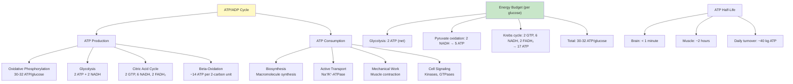

# Week 3 Notes — Bioenergetics, Enzymes & Metabolism

## 問題 1：這個領域所有專家共享的 5 個核心心智模型是什麼？

### 1. ATP 作為能量貨幣 (ATP as Energy Currency)
**Karl Lohmann (1929)** 首次分離 ATP，**Paul Boyer (1997 Nobel)** 闡明 ATP 合酶機制
- ATP: Adenosine triphosphate，ΔG°' = -30.5 kJ/mol (水解)
- ATP/ADP 比值維持細胞的能量狀態
- 每日人類消耗 ~40 kg ATP，但體內只有 ~250 g ATP
- **數字**: ATP → ADP + Pi 釋放 30.5 kJ/mol，約 7.3 kcal/mol

### 2. 化學滲透假說 (Chemiosmotic Hypothesis)
**Peter Mitchell (1961, Nobel 1978)** — 提出質子梯度假說
- 電子傳遞鏈泵送質子跨線粒體內膜
- 質子梯度储存能量 (Δp)
- ATP 合酶利用質子流驅動 ATP 合成
- **數字**: 質子梯度 Δp ≈ 200-220 mV，每個質子約 20 kJ/mol

### 3. 糖酵解十步驟 (Glycolysis - 10 Steps)
**Embden, Meyerhof, Parnas (1940)** — 糖酵解途徑的闡明
- 分兩個階段：準備階段 (investment) 和還款階段 (payoff)
- 净產出：2 ATP, 2 NADH, 2 pyruvate
- **數字**: 葡萄糖 → 2 pyruvate，ΔG°' = -85 kJ/mol

### 4. 克氏循環 (Krebs Cycle / Citric Acid Cycle)
**Hans Krebs (1937, Nobel 1953)** — 揭示檸檬酸循環
- 8 步反應，產生 3 NADH, 1 FADH₂, 1 GTP (ATP)
- CO₂ 釋放 (2 per acetyl-CoA)
- **數字**: 每輪產生 12.5 ATP 當量

### 5. 電子傳遞鏈 (Electron Transport Chain)
**Peter Mitchell (1961)**, **Boyer (1997)** — ETC 複合體 I-IV
- Complex I: NADH → CoQ (3 proton pumps)
- Complex II: Succinate → CoQ (no protons)
- Complex III: CoQ → Cyt c (Q cycle, 4 protons)
- Complex IV: Cyt c → O₂ (2 protons)
- **數字**: 每 NADH ≈ 2.5 ATP，每 FADH₂ ≈ 1.5 ATP

---

## 問題 2：3 個根本分歧

### 分歧 1: ATP 合成機制 — 化學滲透 vs. 底物水平磷酸化
- **A 方**: Mitchell (1961) — 質子梯度驅動 ATP 合酶
- **B 方**: Paul Boyer — 結合變化機制 (binding change mechanism)
- **現在共識**: 兩者共同作用，質子梯度提供能量，ATP 合酶旋轉催化

### 分歧 2: 氧化磷酸化效率 — 30 ATP vs 32 ATP
- **A 方**: 傳統計算 36-38 ATP/glucose (現在認為過時)
- **B 方**: 現代測量 30-32 ATP/glucose
- **原因**: P/O ratio 重新校正，每 NADH ≈ 2.5 ATP，每 FADH₂ ≈ 1.5 ATP

### 分歧 3: Warburg Effect — 癌症代谢
- **A 方**: 癌細胞偏好有氧糖酵解 (Warburg 1956)
- **B 方**: 選擇性線粒體功能障礙 vs. 適應性優勢
- **臨床**: 化療靶點，FDG-PET 成像原理

---

## 問題 3：10 個深度問題

1. 如果抑制 ATP 合酶，電子傳遞鏈會停止嗎？解釋你的答案。
2. 計算 1 分子葡萄糖完全氧化的總 ATP 產量，列出每個步驟。
3. 為什麼丙酮酸脫氫酶複合體是代谢調節的關鍵位點？
4. 如果 NAD⁺/NADH 比值降低，會發生什麼？
5. 解釋為什麼氟化物 (cyanide) 是致命的毒素。
6. 為什麼脂肪產生的 ATP 比葡萄糖多？
7. 計算：氧化 1 分子棕櫚酸 (C16:0) 能產生多少 ATP？
8. 解釋 P/O ratio 的概念及其臨床意義。
9. 為什麼甲狀腺機能亢進患者基礎代謝率升高？
10. 解釋褐色脂肪組織如何產生熱量。

---

# 核心概念深化（中英對照）

## 1. 生物能量學原理 (Bioenergetics Principles)

### 1.1 雙語概念對照

| English | 中文 | 定義 | BME 應用 |
|---------|------|------|----------|
| Free energy | 自由能 | 可做有用功的能量 | 代謝驅動力 |
| Enthalpy | 焓 | 系統總熱含量 | 反應熱測量 |
| Entropy | 熵 | 系統無序度 | 自發性判斷 |
| ΔG | 吉布斯自由能變化 | 自發性判斷標準 | 代謝方向 |
| ATP hydrolysis | ATP 水解 | 能量釋放 | 細胞能量 |
| Coupled reactions | 偶聯反應 | 能量轉移 | 合成反應 |
| Redox potential | 氧化還原電位 | 電子轉移傾向 | ETC 驅動 |
| Chemiosmosis | 化學滲透 | 質子梯度利用 | ATP 合成 |

### 1.2 熱力學基本方程

**吉布斯自由能**:
```
ΔG = ΔG°' + RT ln([products]/[reactants])

自發反應條件: ΔG < 0
平衡狀態: ΔG = 0
非自發反應: ΔG > 0
```

**ATP 水解熱力學**:
```
ATP → ADP + Pi
ΔG°' = -30.5 kJ/mol

在細胞條件下:
ΔG = ΔG°' + RT ln([ADP][Pi]/[ATP])
ΔGcell ≈ -50 to -60 kJ/mol (遠離平衡)

細胞內 ATP/ADP 比值約 10:1
```

### 1.3 氧化還原電位

**標準氧化還原電位**:
| 電對 | E°' (V) | 比較 |
|------|---------|------|
| O₂/H₂O | +0.82 | 最強氧化劑 |
| NO₃⁻/N₂ | +0.42 | - |
| Cytochrome c (Fe³⁺/Fe²⁺) | +0.22 | - |
| CoQ/CoQH₂ | +0.04 | - |
| FAD/FADH₂ | -0.22 | - |
| NAD⁺/NADH | -0.32 | 最強還原劑 |
| S/H₂S | -0.27 | - |

**電位差與自由能**:
```
ΔE°' = E°'(acceptor) - E°'(donor)
ΔG°' = -nF ΔE°'

n = 電子數，F = 96,485 C/mol

例如 NADH → CoQ:
ΔE°' = 0.04 - (-0.32) = 0.36 V
ΔG°' = -2 × 96,485 × 0.36 = -69.5 kJ/mol
```

### 1.4 圖解：能量貨幣循環



---

## 2. 糖酵解途徑 (Glycolysis Pathway)

### 2.1 雙語概念對照

| English | 中文 | 定義 | BME 應用 |
|---------|------|------|----------|
| Glycolysis | 糖酵解 | 葡萄糖 → 丙酮酸 | 能量提取 |
| Hexokinase | 己糖激酶 | 第一個酶，磷酸化葡萄糖 | 調節位點 |
| Phosphofructokinase | 磷酸果糖激酶 | 最關鍵調節酶 | 速率決定步驟 |
| Pyruvate kinase | 丙酮酸激酶 | 最後一個酶 | 調節位點 |
| Substrate-level phosphorylation | 底物水平磷酸化 | 直接ATP合成 | 糖酵解 |
| Fermentation | 發酵 | 無氧條件下 NAD⁺ 再生 | 肌肉缺氧 |
| Pasteur effect | 巴斯德效應 | 氧抑制糖酵解 | 代謝調節 |

### 2.2 十步驟詳細分析

**階段一：能量投資 (ATP-consuming)**
1. Glucose → Glucose-6-phosphate (Hexokinase)
   - ΔG°' = -16.7 kJ/mol, ΔG ≈ -33 kJ/mol ( irreversible)
   - Inhibited by G6P, product feedback

2. G6P → Fructose-6-phosphate (Phosphoglucose isomerase)
   - Isomerization, ΔG°' = +1.7 kJ/mol

3. F6P → Fructose-1,6-bisphosphate (PFK-1)
   - **Rate-limiting step**, ΔG°' = -14.2 kJ/mol, ΔG ≈ -22 kJ/mol
   - **Activated by**: AMP, ADP, F2,6BP
   - **Inhibited by**: ATP, citrate

4. F1,6BP → DHAP + G3P (Aldolase)
   - Cleavage reaction, ΔG°' = +23.8 kJ/mol

5. DHAP ↔ G3P (Triosephosphate isomerase)
   - Equilibrium, ΔG°' = +7.5 kJ/mol
   - G3P continues; DHAP can be recycled

**階段二：能量還款 (ATP-producing)**
6. G3P → 1,3-BPG (G3P dehydrogenase)
   - NAD⁺ → NADH, ΔG°' = +6.3 kJ/mol
   - **First oxidative step**

7. 1,3-BPG → 3-PG (Phosphoglycerate kinase)
   - **First ATP generation** (substrate-level)
   - ΔG°' = -18.5 kJ/mol

8. 3-PG → 2-PG (Phosphoglycerate mutase)

9. 2-PG → PEP (Enolase)
   - ΔG°' = +3.4 kJ/mol

10. PEP → Pyruvate (Pyruvate kinase)
    - **Second ATP generation** (substrate-level)
    - ΔG°' = -31.4 kJ/mol, ΔG ≈ -16 kJ/mol

### 2.3 調節機制

**主要調節位點**:
1. **Hexokinase**: Product inhibition by G6P
2. **PFK-1**: Allosteric regulation
   - AMP (+), ADP (+), F2,6BP (++)
   - ATP (-), citrate (-)
3. **Pyruvate kinase**: Allosteric inhibition
   - ATP (-), acetyl-CoA (-)
   - Fructose-1,6-bisphosphate (+) (feed-forward)

**F2,6BP 的作用**:
- Most potent allosteric activator of PFK-1
- Synthesized by PFK-2, degraded by fructose bisphosphate phosphatase
- Regulated by hormonal signals (insulin/glucagon)

### 2.4 圖解：糖酵解途徑

```mermaid
graph TD
    A["Glycolysis Overview"] --> B["Phase 1: Energy Investment<br/>2 ATP consumed"]
    A --> C["Phase 2: Energy Payoff<br/>4 ATP, 2 NADH produced"]
    
    B --> B1["① Glucose + ATP → G6P + ADP<br/>Hexokinase (irreversible)"]
    B --> B2["② G6P ↔ F6P<br/>Phosphoglucose isomerase"]
    B --> B3["③ F6P + ATP → F1,6BP + ADP<br/>PFK-1 (rate-limiting)"]
    B --> B4["④ F1,6BP → DHAP + G3P<br/>Aldolase"]
    B --> B5["⑤ DHAP ↔ G3P<br/>Triosephosphate isomerase"]
    
    C --> C1["⑥ G3P + NAD⁺ + Pi → 1,3-BPG + NADH + H⁺"]
    C --> C2["⑦ 1,3-BPG + ADP → 3-PG + ATP<br/>Phosphoglycerate kinase"]
    C --> C3["⑧ 3-PG ↔ 2-PG<br/>Phosphoglycerate mutase"]
    C --> C4["⑨ 2-PG ↔ PEP<br/>Enolase"]
    C --> C5["⑩ PEP + ADP → Pyruvate + ATP<br/>Pyruvate kinase"]
    
    D["Regulation Points"] --> D1["Hexokinase: G6P inhibits"]
    D --> D2["PFK-1: AMP activates, ATP inhibits"]
    D --> D3["Pyruvate kinase: Feed-forward activation"]
    
    E["Fate of Pyruvate"] --> E1["Aerobic: → Acetyl-CoA → CAC"]
    E --> E2["Anaerobic: → Lactate (lactate dehydrogenase)"]
    E --> E3["Fermentation: → Ethanol (yeast)"]
    
    style A fill:#e3f2fd
    style D fill:#ffcdd2
```



---

## 3. 檸檬酸循環 (Citric Acid Cycle / Krebs Cycle)

### 3.1 雙語概念對照

| English | 中文 | 定義 | BME 應用 |
|---------|------|------|----------|
| Acetyl-CoA | 乙醯輔酶A | 進入循環的碳源 | 代謝樞紐 |
| Citrate | 檸檬酸 | 第一個中間物 | 循環起點 |
| Isocitrate | 異檸檬酸 | 氧化脫羧位點 | 速率決定 |
| α-Ketoglutarate | α-酮戊二酸 | 第二個脫羧 | 神經傳導 |
| Succinyl-CoA | 琥珀醯輔酶A | 高能硫酯鍵 | 能量產生 |
| GTP | 鳥苷三磷酸 | 相當於ATP | 底物水平 |
| Substrate-level phosphorylation | 底物水平磷酸化 | 直接能量轉移 | ATP 合成 |
| Anaplerosis | 補缺反應 | 補充中間物 | 代谢平衡 |

### 3.2 八步驟反應

**Step 1: Citrate synthase** — Acetyl-CoA + Oxaloacetate → Citrate
- ΔG°' = -31.5 kJ/mol (irreversible)
- **Key regulation point**

**Step 2: Aconitase** — Citrate → Isocitrate
- ΔG°' = +13.3 kJ/mol
- Fe-S cluster enzyme

**Step 3: Isocitrate dehydrogenase** — Isocitrate → α-KG + CO₂ + NADH
- ΔG°' = -8.4 kJ/mol
- **First oxidative decarboxylation**
- **Rate-limiting step**
- Regulated by: ADP (+), Ca²⁺ (+), ATP (-), NADH (-)

**Step 4: α-Ketoglutarate dehydrogenase** — α-KG + NAD⁺ → Succinyl-CoA + CO₂ + NADH
- ΔG°' = -30.1 kJ/mol
- **Second oxidative decarboxylation**
- Similar mechanism to pyruvate dehydrogenase
- Requires: TPP, lipoic acid, CoA-SH, FAD, NAD⁺

**Step 5: Succinyl-CoA synthetase** — Succinyl-CoA + GDP + Pi → Succinate + GTP
- ΔG°' = -3.4 kJ/mol
- **Substrate-level phosphorylation**
- GTP = ATP (nucleoside diphosphate kinase)

**Step 6: Succinate dehydrogenase** — Succinate → Fumarate + FADH₂
- ΔG°' = 0 kJ/mol
- **Complex II of ETC** (membrane-bound)
- FAD → FADH₂ (not NADH)

**Step 7: Fumarase** — Fumarate → Malate
- ΔG°' = -3.8 kJ/mol

**Step 8: Malate dehydrogenase** — Malate → Oxaloacetate + NADH
- ΔG°' = +29.7 kJ/mol (highly unfavorable)
- Pulled forward by Step 1 ( citrate synthase)

### 3.3 產物計算

**每輪檸檬酸循環**:
| 產物 | 數量 |
|------|------|
| NADH | 3 |
| FADH₂ | 1 |
| GTP (ATP) | 1 |
| CO₂ | 2 |

**ATP 當量**:
- 3 NADH × 2.5 ATP/NADH = 7.5 ATP
- 1 FADH₂ × 1.5 ATP/FADH₂ = 1.5 ATP
- 1 GTP = 1 ATP
- **Total per acetyl-CoA: 10 ATP**

**每分子葡萄糖 (2 acetyl-CoA)**:
- 2 cycles × 10 ATP = 20 ATP
- 加糖酵解和丙酮酸脫氫酶的產物

### 3.4 圖解：檸檬酸循環

```mermaid
graph TD
    A["Citric Acid Cycle (Krebs Cycle)"] --> A1["2 acetyl-CoA enter<br/>2 CO₂ released<br/>per glucose"]
    
    A --> B1["① Acetyl-CoA + OAA → Citrate<br/>Citrate synthase"]
    A --> B2["② Citrate → Isocitrate<br/>Aconitase"]
    A --> B3["③ Isocitrate → α-KG + CO₂ + NADH<br/>Isocitrate dehydrogenase<br/>[First decarboxylation]"]
    A --> B4["④ α-KG → Succinyl-CoA + CO₂ + NADH<br/>α-KG dehydrogenase<br/>[Second decarboxylation]"]
    A --> B5["⑤ Succinyl-CoA → Succinate + GTP<br/>Succinyl-CoA synthetase<br/>[Substrate-level phosphorylation]"]
    A --> B6["⑥ Succinate → Fumarate + FADH₂<br/>Succinate dehydrogenase<br/>[Complex II of ETC]"]
    A --> B7["⑦ Fumarate → Malate<br/>Fumarase"]
    A --> B8["⑧ Malate → OAA + NADH<br/>Malate dehydrogenase"]
    
    C["Energy Output (per acetyl-CoA)"] --> C1["NADH: 3 × 2.5 = 7.5 ATP"]
    C --> C2["FADH₂: 1 × 1.5 = 1.5 ATP"]
    C --> C3["GTP: 1 ATP"]
    C --> C4["TOTAL: 10 ATP"]
    
    D["Regulation"] --> D1["Citrate synthase: ATP, NADH inhibit"]
    D --> D2["Isocitrate dehydrogenase: ATP, NADH inhibit<br/>ADP, Ca²⁺ activate"]
    D --> D3["α-KG dehydrogenase: NADH, ATP inhibit<br/>Ca²⁺ activate"]
    
    E["Anaplerotic Reactions"] --> E1["Pyruvate carboxylase: Pyruvate → OAA<br/>Acetyl-CoA activates"]
    E --> E2["Glutamate dehydrogenase: Glu → α-KG"]
    E --> E3["Branched-chain AA transamination"]
    
    style A fill:#e3f2fd
    style C fill:#c8e6c9
```



---

## 4. 氧化磷酸化 (Oxidative Phosphorylation)

### 4.1 雙語概念對照

| English | 中文 | 定義 | BME 應用 |
|---------|------|------|----------|
| Electron transport chain | 電子傳遞鏈 | 複合體 I-IV | ATP 合成 |
| Chemiosmosis | 化學滲透 | 質子梯度利用 | Mitchell 假說 |
| Protonmotive force | 質子驅動力 | Δp = Δψ - 2.3(RT/F)ΔpH | 能量储存 |
| ATP synthase | ATP 合酶 | F₁F₀ 複合體 | 能量轉換 |
| Uncoupling protein | 解偶聯蛋白 | 質子泄漏 | 產熱 |
| P/O ratio | P/O 比 | ATP/O atom ratio | 效率測量 |

### 4.2 電子傳遞複合體

**Complex I (NADH: ubiquinone oxidoreductase)**:
- 風扇形結構，45 個亞基
- NADH → CoQ，泵送 4 H⁺
- Fe-S clusters 傳遞電子
- Rotenone 抑制

**Complex II (Succinate: ubiquinone oxidoreductase)**:
- TCA 循環的一部分
- Succinate → Fumarate
- 不泵送質子
- FAD → FADH₂ → CoQ

**Complex III (Cytochrome bc₁ complex)**:
- Q cycle: 2QH₂ → Q + QH₂
- 泵送 4 H⁺ per Q cycle
- Antimycin A 抑制
- Cytochrome c 受體

**Complex IV (Cytochrome c oxidase)**:
- Cytochrome c → O₂
- 泵送 2 H⁺ per electron pair
- Cyanide, CO 抑制
- 4 electrons reduce O₂ → 2H₂O

**Complex V (ATP Synthase / F₁F₀)**:
- F₁: 催化 ATP 合成 (head)
- F₀: 質子通道 (membrane)
- 旋轉機制 (Boyer, 1997)
- 每 3 H⁺ = 1 ATP

### 4.3 質子驅動力計算

**質子驅動力 (Δp)**:
```
Δp = Δψ - (2.303 RT/F) × ΔpH

在 37°C:
2.303RT/F = 59 mV per pH unit

Example:
Δψ = 150 mV
ΔpH = 1.4 (matrix pH ~7.8, IMS pH ~6.4)

Δp = 150 - 59 × 1.4 = 150 - 83 = 67 mV
```

**ATP 合成能量需求**:
```
ΔG = n × F × Δp
   = 3 × 96,485 × 0.067
   = 19.4 kJ/mol per ATP

加上 ATP/ADP 逆向運輸:
Total ~30-32 kJ/mol per ATP
```

### 4.4 圖解：電子傳遞與ATP合成

```mermaid
graph TD
    A["Oxidative Phosphorylation"] --> B["Electron Transport Chain"]
    A --> C["Chemiosmotic Coupling"]
    A --> D["ATP Synthesis"]
    
    B --> B1["Complex I: NADH → CoQ<br/>4 H⁺ pumped"]
    B --> B2["Complex II: Succinate → CoQ<br/>No H⁺ pumped"]
    B --> B3["Complex III: CoQ → Cyt c<br/>4 H⁺ pumped (Q cycle)"]
    B --> B4["Complex IV: Cyt c → O₂<br/>2 H⁺ pumped"]
    
    B1 --> B1a["Fe-S clusters"]
    B1 --> B1b["FMN"]
    B3 --> B3a["Cytochrome b, c₁"]
    B4 --> B4a["Cytochrome a, a₃"]
    B4 --> B4b["Copper centers"]
    
    C --> C1["Proton gradient<br/>Matrix: alkaline<br/>Intermembrane: acidic"]
    C --> C2["ΔpH ≈ 1.4 units"]
    C --> C3["Δψ ≈ 150-180 mV"]
    C --> C4["Δp ≈ 200-220 mV"]
    
    D --> D1["ATP Synthase (F₁F₀)"]
    D1 --> D1a["F₀: H⁺ channel (membrane)"]
    D1 --> D1b["F₁: Catalytic site (matrix)"]
    D1 --> D1c["γ subunit rotates"]
    D1 --> D1d["3 H⁺ per ATP"]
    
    E["Inhibitors"] --> E1["Rotenone: Complex I"]
    E --> E2["Antimycin A: Complex III"]
    E --> E3["Cyanide: Complex IV"]
    E --> E4["Oligomycin: ATP synthase"]
    
    F["Uncouplers"] --> F1["DNP: H⁺ carrier<br/>Increases metabolism"]
    F --> F2["Thermogenin (UCP1):<br/>Brown fat heat production"]
    
    style A fill:#fff9c4
    style F fill:#ffcdd2
```



---

## 5. 脂肪酸β-氧化 (Beta-Oxidation)

### 5.1 雙語概念對照

| English | 中文 | 定義 | BME 應用 |
|---------|------|------|----------|
| β-Oxidation | β-氧化 | 脂肪酸分解 | 能量產生 |
| Acyl-CoA dehydrogenase | 醯基輔酶A脫氫酶 | 第一步氧化 | 第一個酶 |
| Carnitine shuttle | 肉鹼穿梭 | 進入線粒體 | 調節機制 |
| Acetyl-CoA | 乙醯輔酶A | 產物 | 進入CAC |
| HMG-CoA | 羥甲基戊二醯輔酶A | 酮體合成 | 飢餓適應 |
| Ketone bodies | 酮體 | 替代燃料 | 糖尿病 |
| ATP yield | ATP 產量 | 每碳原子能量 | 計算 |

### 5.2 β-氧化步驟

**每輪 β-氧化循環**:
1. **Acyl-CoA dehydrogenase**: FADH₂ 生成
2. **Enoyl-CoA hydratase**: 水合
3. **Hydroxyacyl-CoA dehydrogenase**: NADH 生成
4. **Thiolase**: 乙醯輔酶A 釋放

**產物**: 1 NADH, 1 FADH₂, 1 Acetyl-CoA

### 5.3 棕櫚酸鹽計算

**Palmitoyl-CoA (C16:0)**:
- 8 rounds of β-oxidation
- 8 FADH₂ × 1.5 = 12 ATP
- 8 NADH × 2.5 = 20 ATP
- 8 Acetyl-CoA → 8 × 10 = 80 ATP (via TCA)
- **Total: 112 ATP**

**對比葡萄糖**:
- Glucose: 30-32 ATP
- Palmitate: 106-112 ATP
- Per carbon: 7 ATP vs 4 ATP

### 5.4 圖解：β-氧化

```mermaid
graph TD
    A["Beta-Oxidation of Fatty Acids"] --> B["Activation"]
    A --> C["Carnitine Shuttle"]
    A --> D["Beta-Oxidation Cycle"]
    A --> E["Ketone Body Formation"]
    
    B --> B1["Fatty acid + CoA + ATP → Acyl-CoA + AMP + PPi<br/>Occurs at cytosolic side"]
    
    C --> C1["Carnitine palmitoyltransferase I (CPT I)<br/>Acyl-CoA → Acyl-carnitine"]
    C --> C2["Transport across outer membrane"]
    C --> C3["Carnitine-acylcarnitine translocase"]
    C --> C4["CPT II<br/>Acyl-carnitine → Acyl-CoA (matrix)"]
    
    D --> D1["Step 1: Dehydrogenation<br/>Acyl-CoA → Enoyl-CoA + FADH₂"]
    D --> D2["Step 2: Hydration<br/>Enoyl-CoA → L-3-hydroxyacyl-CoA"]
    D --> D3["Step 3: Dehydrogenation<br/>L-3-hydroxyacyl-CoA → 3-ketoacyl-CoA + NADH"]
    D --> D4["Step 4: Thiolysis<br/>3-ketoacyl-CoA + CoA → Acetyl-CoA + Acyl-CoA<br/>(shortened by 2 carbons)"]
    
    E --> E1["In liver during fasting/starvation"]
    E --> E2["Acetoacetate, β-hydroxybutyrate, acetone"]
    E --> E3["Brain can use ketone bodies<br/>Spares glucose"]
    
    F["Energy Yield (Palmitate, C16:0)"] --> F1["7 cycles × (FADH₂ + NADH) = 14 ATP"]
    F --> F2["8 Acetyl-CoA → 80 ATP"]
    F --> F3["Activation cost: -2 ATP"]
    F --> F4["Net: 92 ATP"]
    
    style A fill:#e3f2fd
    style F fill:#c8e6c9
```



---

## 深度自測問題詳解

### Q1: 計算葡萄糖氧化的總ATP產量

**解答**:
```
GLYCOLYSIS (per glucose):
- Investment phase: -2 ATP
- Payoff phase: +4 ATP
- Net: +2 ATP

丙酮酸氧化 (per glucose, 2 pyruvate):
- Pyruvate → Acetyl-CoA: 2 NADH × 2.5 = 5 ATP

CITRIC ACID CYCLE (per glucose, 2 acetyl-CoA):
- Isocitrate → α-KG: 2 NADH × 2.5 = 5 ATP
- α-KG → Succinyl-CoA: 2 NADH × 2.5 = 5 ATP
- Succinyl-CoA → Succinate: 2 GTP = 2 ATP
- Succinate → Fumarate: 2 FADH₂ × 1.5 = 3 ATP
- Malate → OAA: 2 NADH × 2.5 = 5 ATP

SUBTOTAL (TCA): 20 ATP

TOTAL PER GLUCOSE:
Glycolysis: 2 ATP (net)
Pyruvate dehydrogenase: 5 ATP
Citric acid cycle: 20 ATP
─────────────────────────
TOTAL: 30-32 ATP (typically cited as ~30)

Note: Cytosolic NADH from glycolysis requires shuttle:
- Glycerol-3-phosphate shuttle: 2 ATP (2 NADH × 1 ATP)
- Malate-aspartate shuttle: 5 ATP (2 NADH × 2.5 ATP)
```

---

## 5 個 Mermaid 圖解

### 圖 1: 完整葡萄糖氧化代謝圖

```mermaid
graph TD
    A["Glucose Metabolism Overview"] --> B["Glycolysis<br/>Cytosol"]
    A --> C["Pyruvate Oxidation<br/>Mitochondrial Matrix"]
    A --> D["Citric Acid Cycle<br/>Mitochondrial Matrix"]
    A --> E["Oxidative Phosphorylation<br/>Inner Membrane"]
    
    B --> B1["Glucose → 2 Pyruvate"]
    B --> B2["Net: 2 ATP, 2 NADH"]
    B --> B3["10 enzymatic reactions"]
    
    C --> C1["2 Pyruvate → 2 Acetyl-CoA"]
    C --> C2["2 CO₂ released"]
    C --> C3["2 NADH → 5 ATP"]
    
    D --> D1["2 Acetyl-CoA → 4 CO₂"]
    D --> D2["6 NADH → 15 ATP"]
    D --> D3["2 FADH₂ → 3 ATP"]
    D --> D4["2 GTP → 2 ATP"]
    
    E --> E1["ETC: NADH, FADH₂ → H⁺ gradient"]
    E --> E2["ATP Synthase: H⁺ → ATP"]
    E --> E3["O₂ → H₂O (terminal e⁻ acceptor)"]
    
    F["Total ATP from One Glucose"] --> F1["Glycolysis: 2-5 ATP"]
    F --> F2["Pyruvate dehydrogenase: 5 ATP"]
    F --> F3["Krebs cycle: 20 ATP"]
    F --> F4["TOTAL: 30-32 ATP"]
    
    G["Regulatory Enzymes"] --> G1["Hexokinase (irreversible)"]
    G --> G2["PFK-1 (rate-limiting)"]
    G --> G3["Pyruvate kinase"]
    G --> G4["Citrate synthase"]
    G --> G5["Isocitrate dehydrogenase"]
    
    style A fill:#fff9c4
    style G fill:#ffcdd2
```



### 圖 2: 質子泵送機制

```mermaid
graph TD
    A["Proton Pumping Mechanism"] --> B["Complex I (NADH Dehydrogenase)"]
    A --> C["Complex III (Cytochrome bc₁)"]
    A --> D["Complex IV (Cytochrome c Oxidase)"]
    
    B --> B1["NADH oxidation:<br/>NADH → FMN → Fe-S → CoQ"]
    B --> B2["4 protons pumped<br/>from matrix → intermembrane space"]
    B --> B3["Conformational changes<br/>drive proton translocation"]
    
    C --> C1["Q cycle mechanism"]
    C --> C2["2 electrons from QH₂<br/>split to 2 pathways"]
    C --> C3["4 protons pumped<br/>per Q cycle"]
    C --> C4["Cytochrome c regenerated"]
    
    D --> D1["4 electrons from 4 Cyt c<br/>reduce O₂ to 2H₂O"]
    D --> D2["2 protons pumped<br/>per electron pair"]
    D --> D3["4H⁺ consumed from matrix"]
    
    E["Proton Motive Force"] --> E1["Δψ = 150-180 mV (membrane potential)"]
    E --> E2["ΔpH = 0.5-1.4 (pH gradient)"]
    E --> E3["Δp = 200-220 mV"]
    E --> E4["Energy stored in gradient"]
    
    F["ATP Synthesis"] --> F1["3 H⁺ through F₀"]
    F --> F2["γ subunit rotates"]
    F --> F3["β subunits undergo conformational changes"]
    F --> F4["ATP synthesized from ADP + Pi"]
    
    style A fill:#e3f2fd
    style F fill:#c8e6c9
```



### 圖 3: 代谢調控樞紐

```mermaid
graph TD
    A["Metabolic Integration"] --> B["Glycolysis"]
    A --> C["Citric Acid Cycle"]
    A --> D["Fatty Acid Metabolism"]
    A --> E["Amino Acid Metabolism"]
    
    B --> B1["Glucose → Pyruvate"]
    B --> B2["PFK-1: Master regulator"]
    B --> B3["Activators: AMP, F2,6BP"]
    B --> B4["Inhibitors: ATP, citrate"]
    
    C --> C1["Pyruvate → Acetyl-CoA"]
    C --> C2["Isocitrate DH: Key regulation"]
    C --> C3["Energy status signals"]
    C --> C4["Ca²⁺ activates during exercise"]
    
    D --> D1["β-Oxidation ↔ Synthesis"]
    D --> D2["Malonyl-CoA inhibits CPT I"]
    D --> D3["AMP-activated protein kinase (AMPK)"]
    
    E --> E1["Glucose → Alanine (muscle)"]
    E --> E2["α-KG → Glutamate"]
    E --> E3["Transamination/deamination"]
    
    F["Energy Sensing"] --> F1["AMP/ATP ratio: AMPK activation"]
    F --> F2["NAD⁺/NADH ratio: Sirtuin activation"]
    F --> F3["Acetyl-CoA: Lipid synthesis signal"]
    
    G["Hormonal Regulation"] --> G1["Insulin: Anabolic state<br/>Promotes glucose uptake, lipogenesis"]
    G --> G2["Glucagon: Catabolic state<br/>Stimulates glycogenolysis, lipolysis"]
    G --> G3["Epinephrine: Stress response<br/>cAMP → PKA → glycogen breakdown"]
    
    style A fill:#fff9c4
    style G fill:#ffcdd2
```



### 圖 4: 飢餓時的代谢適應

```mermaid
graph TD
    A["Metabolic Adaptation to Starvation"] --> B["Early Starvation (0-3 days)"]
    A --> C["Medium Starvation (3-7 days)"]
    A --> D["Long-term Starvation (weeks)"]
    
    B --> B1["Glycogen depletion<br/>Muscle glycogen → Glucose"]
    B --> B2["Increased lipolysis<br/>Adipose → Fatty acids"]
    B --> B3["Gluconeogenesis activation<br/>Lactate, amino acids → Glucose"]
    B --> B4["Ketone body production begins"]
    
    C --> C1["Hepatic ketogenesis increases"]
    C --> C2["Muscle switches to fatty acids"]
    C --> C3["Brain begins using ketones<br/>(up to 30-40%)"]
    C --> C4["Protein sparing effect"]
    
    D --> D1["Ketones become major fuel<br/>(up to 60-70% for brain)"]
    D --> D2["Muscle protein breakdown<br/>Gluconeogenic substrates"]
    D --> D3["Acidosis risk<br/>(β-hydroxybutyrate accumulation)"]
    
    E["Key Metabolic Pathways"] --> E1["Gluconeogenesis: Liver, kidneys"]
    E --> E2["Ketogenesis: Liver mitochondria"]
    E --> E3["Glycogenolysis: Liver, muscle"]
    E --> E4["Lipolysis: Adipose tissue"]
    
    F["Clinical Correlation"] --> F1["Diabetic ketoacidosis (DKA)<br/>Insulin deficiency → ketones accumulation"]
    F --> F2["Starvation ketoacidosis<br/>Prolonged fasting"]
    F --> F3["Alcoholic ketoacidosis<br/>Ethanol metabolism → NADH ↑ → gluconeogenesis ↓"]
    
    style A fill:#e3f2fd
    style F fill:#ffcdd2
```



### 圖 5: 臨床酶抑制劑與毒素

```mermaid
graph TD
    A["Clinical Toxin/Inhibitors in Metabolism"] --> B["Glycolysis Inhibitors"]
    A --> C["Pyruvate Dehydrogenase Inhibitors"]
    A --> D["Citric Acid Cycle Inhibitors"]
    A --> E["Oxidative Phosphorylation Inhibitors"]
    
    B --> B1["Iodoacetate: Glyceraldehyde-3-P DH inhibitor"]
    B --> B2["Fluoride: Enolase inhibitor"]
    B --> B3["2-deoxyglucose: Hexokinase substrate inhibitor"]
    
    C --> C1["Arsenite: Lipoic acid binder"]
    C --> C2["Pyruvate dehydrogenase deficiency<br/>Lactic acidosis"]
    
    D --> D1["Fluoracetate: Blocks aconitase<br/>Used as rodenticide"]
    D --> D2["Malonate: Succinate dehydrogenase competitive inhibitor"]
    
    E --> E1["Rotenone: Complex I inhibitor"]
    E --> E2["Amytal: Complex I inhibitor"]
    E --> E3["Antimycin A: Complex III inhibitor"]
    E --> E4["Cyanide: Complex IV inhibitor<br/>Blocks O₂ utilization → rapid death"]
    E --> E5["CO: Binds cytochrome a₃<br/>Same mechanism as cyanide"]
    E --> E6["Oligomycin: ATP synthase inhibitor"]
    E --> E7["DNP, FCCP: Uncouplers<br/>H⁺ ionophores, hyperthermia"]
    
    F["Therapeutic Applications"] --> F1["Metformin: Complex I inhibitor<br/>AMP-kinase activation → diabetes"]
    F --> F2["ASV drugs: Target viral enzymes<br/>Different metabolism from human"]
    
    style A fill:#fff9c4
    style F fill:#c8e6c9
```



---

## 總結

### 本週核心概念
1. **ATP作為能量貨幣**: ΔG°' = -30.5 kJ/mol
2. **化學滲透假說**: Mitchell (1961)，質子梯度驅動ATP合成
3. **糖酵解**: 10步，2 ATP净產出
4. **檸檬酸循環**: 8步，10 ATP/ acetyl-CoA
5. **電子傳遞鏈**: Complex I-IV，P/O比值
6. **β-氧化**: 脂肪酸分解

### HKU BMED2301 考試重點
- 計算ATP產量
- 分析抑制劑對ETC的影響
- 理解代谢調控機制

### 下週預習
- 細胞生物學
- 細胞膜結構
- 細胞器功能
- 膜運輸
