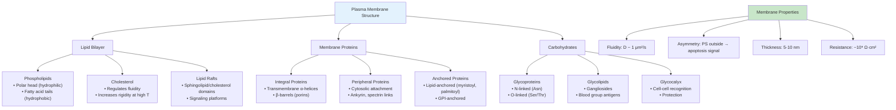
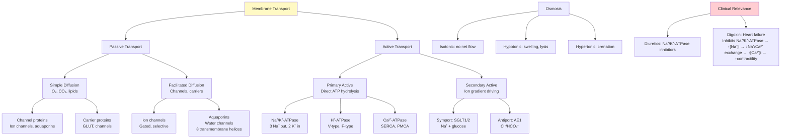
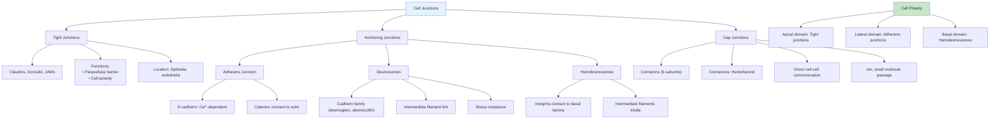
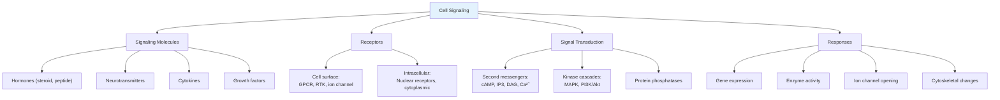
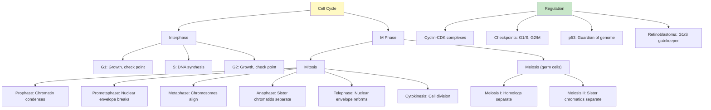
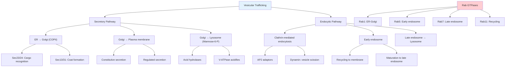
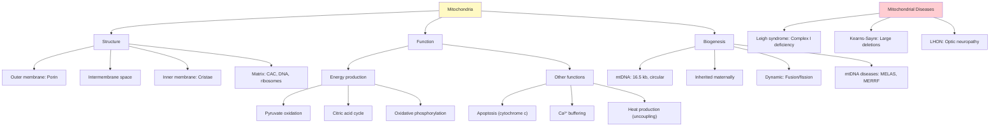

# Week 4 Notes — Cell Biology & Tissue Structure

## 問題 1：這個領域所有專家共享的 5 個核心心智模型是什麼？

### 1. 流動鑲嵌模型 (Fluid Mosaic Model)
**Singer & Nicolson (1972)** — 細胞膜結構
- 磷脂雙層為流體，蛋白質如「島嶼」鑲嵌其中
- 膜蛋白可横向擴散
- 膽固醇調節膜流動性
- **數字**: 膜厚 ~7-10 nm，擴散係數 D ~1 μm²/s

### 2. 內膜系統 (Endomembrane System)
**Palade (1975 Nobel)** — 分泌途徑的闡明
- 內質網 → 高爾基體 → 分泌小泡 → 細胞膜
- 蛋白質糖基化、折疊、分揀
- **數字**: ER 摩爾摺疊 10-20 μm²/細胞

### 3. 細胞骨架 (Cytoskeleton)
**細胞骨架三系統: 微管、微絲、中間絲
- 微管: α/β-tubulin 二聚體，中心粒組織
- 微絲: F-actin，運動和形狀
- 中間絲: vimentin, keratin，結構支持

### 4. 質膜轉運 (Membrane Transport)
**Carrier proteins, channels, pumps
- 被動轉運: 濃度梯度驅動
- 主動轉運: ATP 驅動
- 滲透壓: 維持細胞容積

### 5. 細胞信號 (Cell Signaling)
**受體類型: GPCR, RTK, Nuclear receptors
- 第一信使: hormone, cytokine
- 第二信使: cAMP, IP3, Ca²⁺

---

## 問題 2：3 個根本分歧

### 分歧 1: 膜蛋白的運動性
- 流動鑲嵌 vs. 蛋白質周圍的「停泊」
- 實驗: FRAP (fluorescence recovery after photobleaching)

### 分歧 2: 胞吞機制
- 吞噬作用 vs. 受體介導內吞
- Clathrin-coated pits 的爭議

### 分歧 3: 細胞週期控制
- Cyclin-CDK 驅動 vs. 檢查點模型

---

## 問題 3：10 個深度問題

1. 為什麼紅血球沒有細胞核但仍能執行功能？
2. 解釋離子通道的選擇性過濾機制。
3. 為什麼高爾基體是細胞的「交通警察」？
4. 微管如何參與有絲分裂？
5. 解釋受體介導內吞的分子機制。
6. 什麼是上皮細胞的極性？如何維持？
7. 為什麼線粒體被稱為細胞的「發電廠」？
8. 細胞如何響應滲透壓變化？
9. 什麼是細胞連接？列舉三種主要類型。
10. 解釋細胞自噬的過程和意義。

---

# 核心概念深化（中英對照）

## 1. 細胞膜結構與功能 (Cell Membrane Structure)

### 1.1 雙語概念對照

| English | 中文 | 定義 | BME 應用 |
|---------|------|------|----------|
| Phospholipid bilayer | 磷脂雙層 | 基本膜結構 | 自組裝 |
| Membrane protein | 膜蛋白 | 整合或周邊 | 藥物靶點 |
| Glycocalyx | 糖萼 | 細胞表面糖鏈 | 細胞識別 |
| Fluid mosaic model | 流動鑲嵌模型 | Singer & Nicolson 1972 | 膜結構 |
| Lipid raft | 脂筏 | 微結構域 | 信號轉導 |
| Integral protein | 整合膜蛋白 | 跨膜α-螺旋 | 受體 |
| Peripheral protein | 周邊膜蛋白 | 胞質面結合 | 訊號蛋白 |
| Membrane fluidity | 膜流動性 | 磷脂擴散 | 溫度適應 |

### 1.2 膜結構特點

**磷脂組成**:
| 細胞器 | 主要磷脂 | 特點 |
|--------|----------|------|
| 漿膜 | PC, PE, PS, cholesterol | 對稱性調控 |
| 內質網 | PC, PE | 更多的PC |
| 線粒體內膜 | Cardiolipin | 高度不飽和 |

**膜蛋白類型**:
- **Type I**: N-末端在細胞外，C-末端在細胞內
- **Type II**: N-末端在細胞內，C-末端在細胞外
- **Multi-pass**: 多次跨膜
- **Lipid-anchored**: 脂肪酸或 GPI 錨定

### 1.3 圖解：細胞膜結構

---

## 2. 膜轉運機制 (Membrane Transport)

### 2.1 雙語概念對照

| English | 中文 | 定義 | BME 應用 |
|---------|------|------|----------|
| Passive transport | 被動轉運 | 順濃度梯度 | 藥物吸收 |
| Active transport | 主動轉運 | 逆濃度梯度 | 藥物轉運 |
| Osmosis | 滲透 | 水通道 | 腎臟 |
| Diffusion | 擴散 | 分子熱運動 | 氣體交換 |
| Facilitated diffusion | 易化擴散 | 載體/通道 | 離子通道 |
| Primary active | 原發性主動轉運 | 直接用ATP | Na⁺/K⁺-ATPase |
| Secondary active | 繼發性主動轉運 | 離子梯度 | SGLT |
| Symport | 同向轉運 | 同方向 | SGLT |
| Antiport | 反向轉運 | 反方向 | Cl⁻/HCO₃⁻ |

### 2.2 主要轉運蛋白

**Na⁺/K⁺-ATPase**:
- 每循環: 3 Na⁺ 出 + 2 K⁺ 入
- ATP hydrolysis: ΔG = -50 kJ/mol
- 維持: [Na⁺]i ~10 mM, [K⁺]i ~140 mM
- 維持膜電位: -70 mV

**GLUT transporters**:
| Transporter | 位置 | Km (mM) | 功能 |
|-------------|------|---------|------|
| GLUT1 | RBC, BBB | 5 | 基礎葡萄糖攝取 |
| GLUT2 | Liver, β-cell | 15 | 高 Km，低親和 |
| GLUT3 | Neuron | 1.5 | 高親和 |
| GLUT4 | Muscle, adipose | - | 胰島素依賴 |

### 2.3 圖解：膜轉運類型

---

## 3. 細胞骨架 (Cytoskeleton)

### 3.1 雙語概念對照

| English | 中文 | 定義 | BME 應用 |
|---------|------|------|----------|
| Microtubules | 微管 | α/β-tubulin | 有絲分裂 |
| Microfilaments | 微絲 | F-actin | 運動 |
| Intermediate filaments | 中間絲 | 多種蛋白 | 結構 |
| Kinesin | 驅動蛋白 | 正端運動 | 軸突運輸 |
| Dynein | 動力蛋白 | 負端運動 | 鞭毛運動 |
| Myosin | 肌球蛋白 | 肌肉收縮 | 肌肉 |
| Centrosome | 中心體 | 微管組織中心 | 細胞分裂 |
| Spindle | 紡錘體 | 有絲分裂裝置 | 分離染色體 |

### 3.2 微管結構與功能

**結構**:
- αβ-tubulin 異二聚體
- 13 protofilaments 形成管壁
- GTP 結合唱話 (β-tubulin)
- 動態不穩定性 (dynamic instability)

**馬達蛋白**:
| 馬達 |  Cargo | Direction | Speed |
|------|--------|------------|-------|
| Kinesin-1 | Vesicles | Anterograde (+) | 1 μm/s |
| Kinesin-2 | Cilia | Anterograde | 1.5 μm/s |
| Cytoplasmic dynein | Organelles | Retrograde (-) | 1 μm/s |
| Myosin V | Vesicles | Along actin | 0.5 μm/s |

### 3.3 圖解：細胞骨架

```mermaid
graph TD
    A["Cytoskeleton"] --> B["Microtubules"]
    A --> C["Actin Filaments"]
    A --> D["Intermediate Filaments"]
    
    B --> B1["α/β-Tubulin dimers"]
    B --> B2["13 protofilaments"]
    B --> B3["Dynamic instability<br/>GTP cap"]
    B --> B4["Centrosome organizing center"]
    
    C --> C1["G-actin monomers"]
    C --> C2["Double helix (F-actin)"]
    C --> C3["ATP → ADP turnover"]
    C --> C4["Cell motility, cytokinesis"]
    
    D --> D1["Keratins (epithelial)"]
    D --> D2["Vimentin (mesenchymal)"]
    D --> D3["Neurofilaments (neurons)"]
    D --> D4["Lamins (nuclear)"]
    
    E["Motor Proteins"] --> E1["Kinesin: (+) end movement"]
    E --> E2["Dynein: (-) end movement"]
    E --> E3["Myosin: Actin-based"]
    
    F["Functions"] --> F1["Structure, shape, mechanical support"]
    F --> F2["Cell division (spindle, contractile ring)"]
    F --> F3["Intracellular transport"]
    F --> F4["Cell motility"]
    
    style A fill:#e3f2fd
    style F fill:#c8e6c9
```

---

## 4. 內膜系統 (Endomembrane System)

### 4.1 雙語概念對照

| English | 中文 | 定義 | BME 應用 |
|---------|------|------|----------|
| Endoplasmic reticulum | 內質網 | 蛋白質/脂質合成 | 藥物代謝 |
| Rough ER | 粗糙內質網 | 核糖體附著 | 分泌蛋白 |
| Smooth ER | 光滑內質網 | 脂質合成 | 類固醇 |
| Golgi apparatus | 高爾基體 | 糖基化,分揀 | 蛋白質加工 |
| Vesicles | 小泡 | 轉運載體 | 分泌 |
| Lysosome | 溶酶體 | 降解 | 吞噬 |
| Endosome | 內體 | 分揀站 | 內吞 |
| Peroxisome | 過氧化物酶體 | 脂肪酸氧化 | 抗氧化 |

### 4.2 蛋白質分泌途徑

**分泌蛋白合成**:
1. mRNA → 粗糙內質網 (信號肽識別)
2. 翻譯同時轉位 (co-translational translocation)
3. 新生多肽進入 ER 腔
4. N-連接糖基化起始
5. 二硫鍵形成，折疊
6. QC (quality control) 檢查
7. 包裝進 COPII 小泡
8. 轉運到高爾基體

**高爾基體加工**:
- Cis: 接收 ER 來源小泡
- Medial: 寡糖修剪
- Trans: 進一步加工，分揀
- TGN: 包裝進分泌小泡

### 4.3 圖解：內膜系統

```mermaid
graph TD
    A["Endomembrane System"] --> B["Nucleus"]
    A --> C["Endoplasmic Reticulum"]
    A --> D["Golgi Apparatus"]
    A --> E["Endosomes & Lysosomes"]
    
    B --> B1["Nuclear envelope<br/>Double membrane"]
    B --> B2["Nuclear pores<br/>NPC transport"]
    B --> B3["Chromatin, nucleolus"]
    
    C --> C1["Rough ER<br/>Ribosomes, protein synthesis"]
    C --> C2["Smooth ER<br/>Lipid synthesis, Ca²⁺ storage"]
    C --> C3["ER chaperones<br/>BiP, PDI"]
    
    D --> D1["Cis Golgi Network<br/>Receives vesicles"]
    D --> D2["Medial Golgi<br/>Glycan processing"]
    D --> D3["Trans Golgi Network<br/>Sorting, packaging"]
    
    E --> E1["Early endosome<br/>Sorting station"]
    E --> E2["Late endosome<br/>Maturation"]
    E --> E3["Lysosome<br/>Acid hydrolases<br/>pH 4.5-5"]
    
    F["Vesicle Trafficking"] --> F1["COPII: ER → Golgi"]
    F --> F2["COPI: Golgi → ER"]
    F --> F3["Clathrin: Endocytosis"]
    
    G["Protein Quality Control"] --> G1["ERAD: ER-associated degradation"]
    G --> G2["Unfolded protein response (UPR)"]
    G --> G3["Autophagy: Lysosomal degradation"]
    
    style A fill:#fff9c4
    style G fill:#ffcdd2
```

---

## 5. 細胞連接與極性 (Cell Junctions & Polarity)

### 5.1 雙語概念對照

| English | 中文 | 定義 | BME 應用 |
|---------|------|------|----------|
| Tight junction | 緊密連接 | 封閉細胞間隙 | 血腦屏障 |
| Adherens junction | 黏著連接 | E-cadherin | 細胞粘附 |
| Desmosome | 橋粒 | 機械連接 | 皮膚 |
| Gap junction | 縫隙連接 | 離子通道 | 心臟 |
| Hemidesmosome | 半橋粒 | 細胞-基質 | 基底膜 |
| Basal lamina | 基底膜 | 細胞外基質 | 組織結構 |

### 5.2 緊密連接功能

**結構**:
- Claudin, occludin, JAM 蛋白
- 跨膜蛋白與相鄰細胞形成「拉鍊」
- 細胞質面: ZO proteins (ZO-1, ZO-2, ZO-3)

**功能**:
1. **封閉作用**: 防止溶質從細胞間通過 (paracellular)
2. **極性建立**: 分離頂側和基底側膜蛋白
3. **信號轉導**: 激活細胞內信號通路

**臨床**:
- Claudin mutations → 遺傳性聽力損失
- Tight junction dysfunction → 腸道滲漏

### 5.3 圖解：細胞連接

---

## 深度自測問題

### Q1: 計算紅血球細胞容積變化

**問題**: 將紅血球置於 0.3% NaCl 溶液中，會發生什麼？
（正常血漿滲透壓 ~300 mOsm/L）

**解答**:
- 0.3% NaCl ≈ 0.3 g/100 mL = 3 g/L
- NaCl 摩爾質量 = 58.44 g/mol
- [NaCl] = 3/58.44 = 0.051 M
- 離子數 = 2 × 0.051 = 0.102 M = 102 mOsm/L

這是**低滲溶液** (< 300 mOsm/L)
- 水會進入細胞
- 紅血球膨脹
- 可能發生溶血 (lysis)

---

## 5 個 Mermaid 圖解

### 圖 1: 細胞結構全景圖

```mermaid
graph TD
    A["Eukaryotic Cell Structure"] --> B["Nucleus"]
    A --> C["Cytoplasm"]
    A --> D["Organelles"]
    A --> E["Cytoskeleton"]
    A --> F["Cell Membrane"]
    
    B --> B1["Nuclear envelope (double membrane)"]
    B --> B2["Chromatin (DNA + histones)"]
    B --> B3["Nucleolus (rRNA synthesis)"]
    B --> B4["Nuclear pores (NPC)"]
    
    C --> C1["Cytosol (aqueous gel)"]
    C --> C2["Ribosomes (free/poly)"]
    C --> C3["Proteasome (degradation)"]
    
    D --> D1["Mitochondria (energy)"]
    D --> D2["ER: Rough + Smooth"]
    D --> D3["Golgi apparatus"]
    D --> D4["Lysosome, Peroxisome"]
    D --> D5["Endosomes"]
    
    E --> E1["Microtubules (MTOCs)"]
    E --> E2["Actin filaments"]
    E --> E3["Intermediate filaments"]
    
    F --> F1["Phospholipid bilayer"]
    F --> F2["Membrane proteins"]
    F --> F3["Glycocalyx"]
    
    style A fill:#fff9c4
```

### 圖 2: 信號轉導概述

### 圖 3: 細胞週期

### 圖 4: 囊泡運輸

### 圖 5: 線粒體結構與功能

---

## 總結

### 本週核心概念
1. **流動鑲嵌模型**: 膜結構基礎
2. **膜轉運**: 被動/主動轉運機制
3. **細胞骨架**: 微管、微絲、中間絲
4. **內膜系統**: ER、高爾基、溶酶體
5. **細胞連接**: 緊密、黏著、縫隙連接
6. **細胞週期**: G1/S/G2/M 調控

### HKU BMED2302 考試重點
- 膜結構與流動性
- 轉運蛋白機制
- 信號轉導通路

### 下週預習
- 穩態與興奮組織
- 神經生理學
- 肌肉生理學
