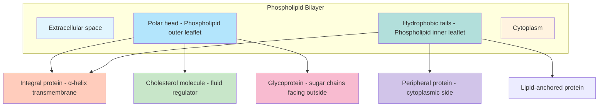
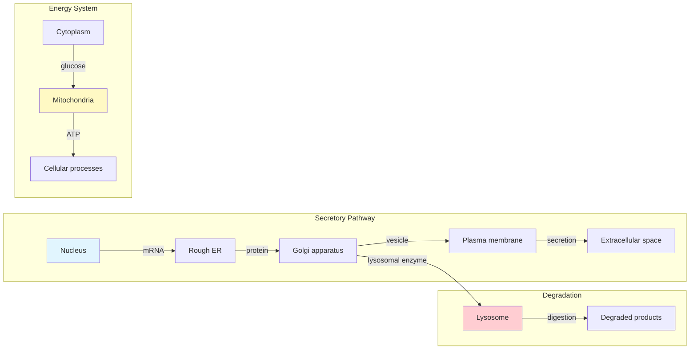
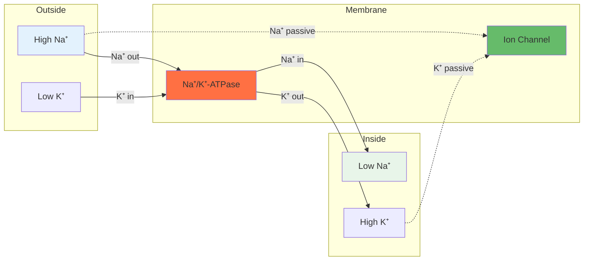
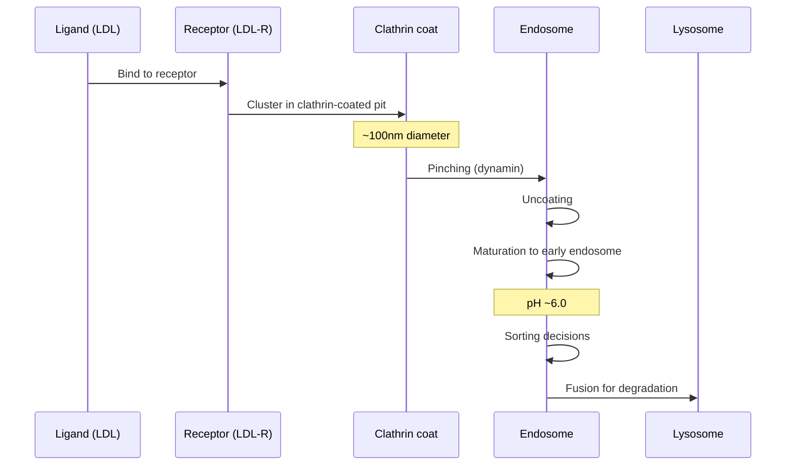
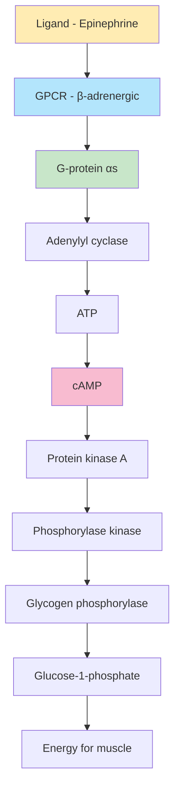
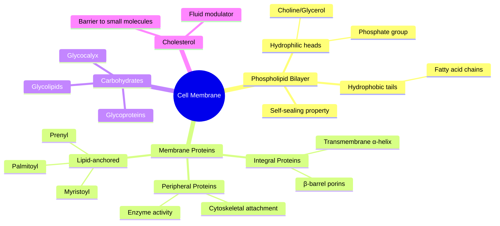
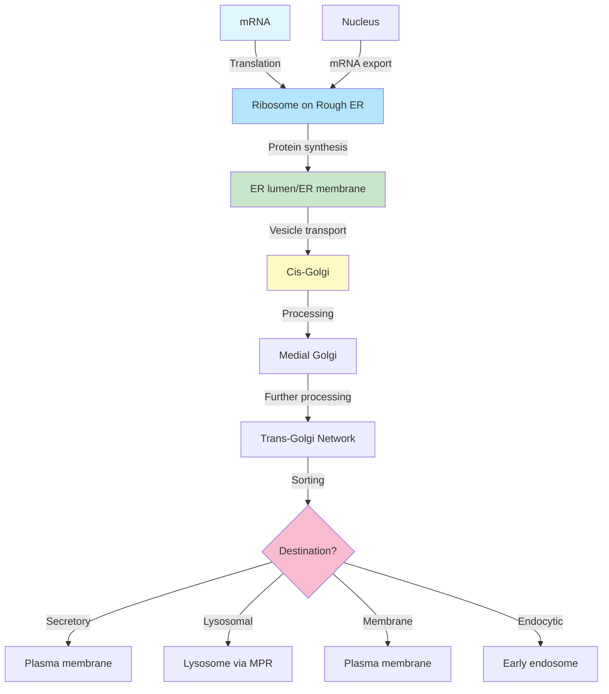
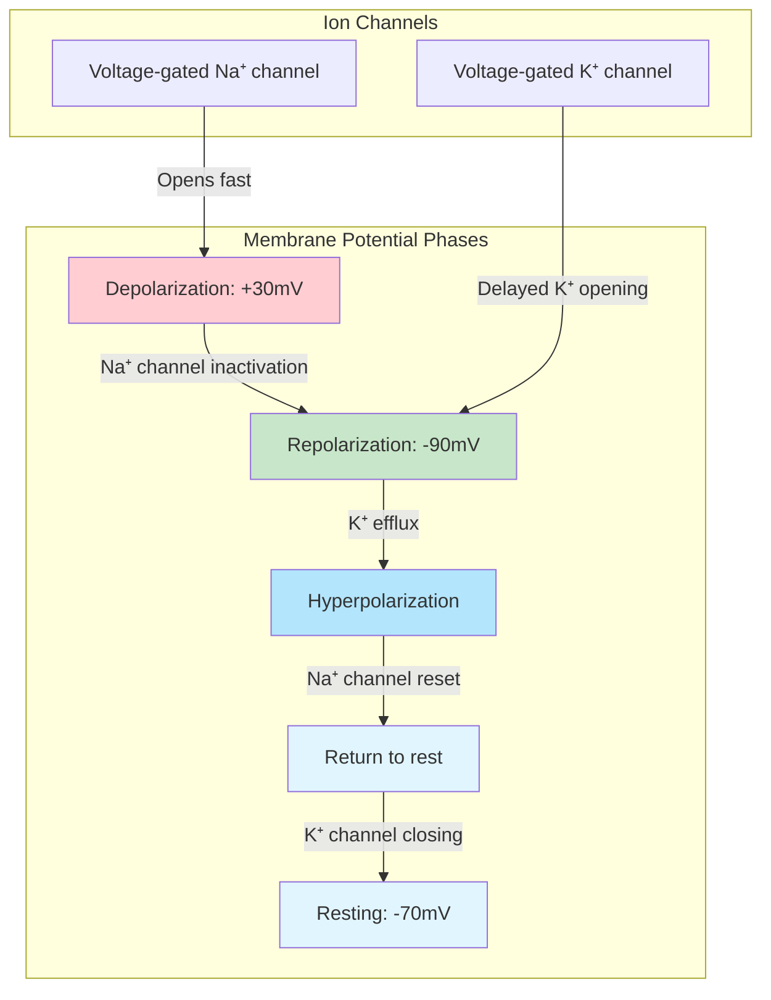
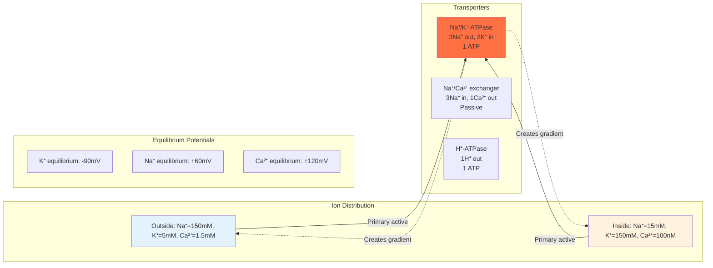

# Week 4 Notes — Cell Biology & Tissue Structure (BMED2302)

## 問題 1：這個領域所有專家共享的 5 個核心心智模型是什麼？

### 1. Singer-Nicolson 流動鑲嵌模型 (Fluid Mosaic Model)
**Singer & Nicolson (1972)** — 細胞膜結構的里程碑論文

- **核心概念**: 細胞膜是二維液體，蛋白質如「島嶼」漂浮在磷脂雙層的「海洋」中
- **數字**:
  - 膜厚 ~7-10 nm
  - 磷脂分子面積 ~0.5 nm²
  - 蛋白質佔膜重量 40-50%
  - 擴散係數 D ~1 μm²/s (lateral diffusion)
- **結構組件**:
  - 磷脂雙層 (phospholipid bilayer) — 疏水尾部相對
  - 膽固醇 (cholesterol) — 調節膜流動性
  - 膜蛋白 — 整合蛋白 (integral) vs 周邊蛋白 (peripheral)
  - 糖萼 (glycocalyx) — 細胞表面碳水化合物
- **BME 應用**: 藥物傳遞載體設計、膜蛋白藥物靶點、生物感測器膜

### 2. 區室化原理 (Compartmentalization)
**Laplane (1970s)** — 細胞內膜系統

- **核心概念**: 細胞通過膜包圍的區室執行不同功能
- **主要細胞器**:
  - 細胞核 (nucleus) — DNA儲存、轉錄
  - 粒線體 (mitochondria) — ATP產生
  - 內質網 (ER) — 蛋白質折疊/合成
  - 高爾基體 (Golgi) — 蛋白質加工/分揀
  - 溶酶體 (lysosome) — 細胞消化
  - 過氧化物酶體 (peroxisome) — 脂肪酸氧化
- **膜結構差異**:
  - 粒線體內膜: 蛋白質含量 80%，皺褶結構 (cristae)
  - ER膜: 粗糙ER vs 光滑ER
  - 核膜: 雙層膜，核孔複合體 (NPC)
- **BME 應用**: 藥物靶向特定細胞器、線粒體疾病治療

### 3. 細胞骨架系統 (Cytoskeleton)
**Schliwa (1980s)** — 動力學基礎設施

- **三種纖維**:
  1. **微管 (Microtubules)**:
     - 直徑 25 nm，中空管狀
     - 由 α/β-tubulin 二聚體組裝
     - 馬達蛋白: kinesin (+端移動), dynein (-端移動)
     - 數字: 聚合速度 ~1 μm/min
  2. **微絲 (Actin filaments)**:
     - 直徑 7 nm，雙螺旋結構
     - 由 G-actin 單體組裝
     - 馬達蛋白: myosin
     - 數字: 聚合速度 ~0.5 μm/min
  3. **中間纖維 (Intermediate filaments)**:
     - 直徑 10 nm，非極性
     - 類型: vimentin, keratin, lamin, neurofilament
- **功能**: 細胞形狀、極性、遷移、分裂
- **BME 應用**: 細胞力學、組織工程、癌細胞轉移抑制

### 4. 膜轉運機制 (Membrane Transport)
**Hodgkin & Huxley (1939)** — 神經傳導基礎

- **被動轉運 (Passive)**:
  - 簡單擴散: O₂, CO₂, N₂, 脂溶性分子
  - 易化擴散: 離子通道 (ion channels)、載體蛋白 (carriers)
  - 滲透 (osmosis): 水通道蛋白 (aquaporins)
  - **Fick's Law**: J = -D × (dC/dx)
- **主動轉運 (Active)**:
  - 原發性主動轉運: Na⁺/K⁺-ATPase (每循環 3 Na⁺ out, 2 K⁺ in)
  - 次發性主動轉運: 協同轉運 (symport), 反向轉運 (antiport)
- **囊泡轉運**:
  - 胞吐作用 (exocytosis): 分泌蛋白、神經遞質
  - 胞吞作用 (endocytosis): receptor-mediated (clathrin-coated pits)
- **數字**:
  - 離子通道傳導率: 10⁶-10⁸ ions/s
  - Na⁺/K⁺-ATPase: 每秒 100-200 循環
- **BME 應用**: 離子通道藥物、血腦屏障轉運、基因治療載體

### 5. 細胞信號傳導 (Cell Signaling)
**Sutherland (1960s)** — 第二信使系統

- **信號類型**:
  - 內分泌 (endocrine): 激素 (insulin, cortisol)
  - 旁分泌 (paracrine): 局部因子 (growth factors)
  - 自分泌 (autocrine): 自分泌信號
  - 突觸 (synaptic): 神經遞質
- **受體類型**:
  1. **離子通道偶聯受體** (ligand-gated ion channels)
  2. **G蛋白偶聯受體 (GPCR)** — 最大家族 (~800 human genes)
  3. **酶聯受體** (receptor tyrosine kinases)
- **第二信使**:
  - cAMP, cGMP, IP₃, DAG, Ca²⁺
  - 訊號放大: 1 receptor → 100+ effectors
- **BME 應用**: GPCR藥物設計 (~34% FDA批准藥物靶點)、酪氨酸激酶抑制劑 (imatinib)

---

## 問題 2：3 個根本分歧

### 分歧 1: 膜蛋白側向擴散 — 受限 vs 自由
- **A 方**: Singer-Nicolson (1972) — 膜蛋白在磷脂雙層中自由側向擴散
- **B 方**: Edidin (1990s) — 膜蛋白受細胞骨架約束，存在「島嶼式」(picket-fence) 組織
- **實驗證據**: FRAP (Fluorescence Recovery After Photobleaching) vs single-particle tracking
- **BME 影響**: 膜蛋白藥物靶點的給藥策略

### 分歧 2: 胞吞機制 — clathrin-coated pits vs caveolae
- **A 方**: Pearse (1975) — clathrin介導的胞吞是主要途徑
- **B 方**: Rothberg et al. (1992) — caveolae (小窩)是另一重要途徑
- **BME 影響**: 藥物載體的細胞攝取途徑

### 分歧 3: 粒線體起源 — 內共生假說 vs 其他理論
- **A 方**: Margulis (1967) — 粒線體起源於內共生的α-變形菌
- **B 方**: 某些研究認為內膜來自內吞作用
- **證據**: 雙層膜、獨立的環形DNA、核糖體70S類似細菌
- **BME 影響**: 粒線體疾病的治療策略

---

## 問題 3：10 個深度問題

1. 為什麼細胞膜的流動性對細胞功能至關重要？膜流動性改變會如何影響細胞信號和物質轉運？

2. 計算：如果一個分子在半徑 r = 10 μm 的細胞內從一側擴散到另一側需要 1 秒，問相同分子在 r = 20 μm 的細胞中需要多少時間？(提示: t ∝ r²)

3. Na⁺/K⁺-ATPase 每消耗 1 個 ATP 分子，細胞淨輸出 1 個正電荷。解釋這如何建立靜息膜電位。

4. 比較 receptor-mediated endocytosis 和 phagocytosis 的機制差異。為什麼前者更有效率？

5. 解釋為什麼大多數藥物是脂溶性的（能穿過細胞膜）而非水溶性的。

6. 如果一個組織的滲透壓升高，會發生什麼？細胞如何應對高滲透壓環境？

7. 比較微管和微絲的組裝動力學差異。為什麼微管有 + 端和 - 端的極性而微絲沒有明顯的極性差異？

8. 描述蛋白質從核糖體到溶酶體的整個分揀途徑 (sorting pathway)。

9. 解釋第二信使 cAMP 的合成和降解途徑，以及它如何放大細胞信號。

10. 設計一個實驗來測量紅血球的膜流動性 (membrane fluidity)。

---

# 核心概念深化（中英對照）

## 1. 流動鑲嵌模型示意圖 (Fluid Mosaic Model Diagram)



## 2. 細胞內膜系統示意圖



## 3. 主動轉運 vs 被動轉運示意圖



---

## 4. 深度 Dive 1: Na⁺/K⁺-ATPase — 細胞的「離子泵」

### 4.1 基本概念
**Jens Skou (1957)** — 首次發現Na⁺/K⁺-ATPase，1997年諾貝爾化學獎

- **化學方程式**:
  ATP + 3 Na⁺(inside) + 2 K⁺(outside) → ADP + Pi + 3 Na⁺(outside) + 2 K⁺(inside)
- **能量**: ΔG ≈ -50 kJ/mol (每循環)
- **馬達效率**: ~100% (將化學能轉化為離子梯度)

### 4.2 結構
- **α-subunit**: 催化亞基，含有ATP結合位點和離子結合位點
- **β-subunit**: 調節折疊和膜定位
- **γ-subunit**: FXYD蛋白，調節活性
- **結構數字**: ~1000氨基酸，10個跨膜α螺旋

### 4.3 臨床相關
- **心臟衰竭**: Digoxin抑制Na⁺/K⁺-ATPase，增加胞內Na⁺，間接增加心肌細胞Ca²⁺
- **神經系統**: Ouabain作為神經毒素
- **癌症**: 某些腫瘤細胞高表達Na⁺/K⁺-ATPase

### 4.4 BME應用
- **生物燃料電池**: 利用離子梯度發電
- **藥物設計**: 心臟糖苷類藥物
- **生物感測器**: 離子選擇性 electrodes

---

## 5. 深度 Dive 2: 細胞骨架 — 動力學引擎

### 5.1 微管 (Microtubules)

**Shelanski & Taylor (1967)** — 發現tubulin

- **結構**: α/β-tubulin異二聚體，13根原纖維圍繞空洞中心
- **GTP動力學**:
  - β-tubulin結合的GTP在聚合後水解為GDP
  - GTP帽 (GTP cap) 穩定生長端
- **藥物靶點**:
  - 紫杉醇 (Taxol): 穩定微管，抑制解聚 → 抗癌藥
  - 秋水仙素 (Colchicine): 抑制聚合 → 抗痛風

### 5.2 微絲 (Actin Filaments)

**Huxley (1954)** — 肌肉收縮的滑動絲模型

- **結構**: G-actin單體，雙螺旋
- **調控**:
  - Arp2/3複合體: 分支形成
  - Formin: 直線聚合
  - Thymosin-β4: 單體隔離
  - Profilin: 單體回收
- **馬達蛋白**: Myosin II (肌肉收縮)
- **臨床應用**: Cytochalasin D (抑制聚合)，Blebbistatin (抑制myosin)

### 5.3 中間纖維

**Lazarides & Hubbard (1976)** — 細胞機械穩定性

- **類型與組織特異性**:
  | 類型 | 組織 |
  |------|------|
  | Keratin | 上皮細胞 |
  | Vimentin | 間質細胞、成纖維細胞 |
  | Desmin | 肌肉細胞 |
  | Neurofilament | 神經元 |
  | Lamin | 細胞核膜 |

### 5.4 BME應用
- **組織工程**: 支架材料引導細胞骨架形成
- **細胞力學**: Atomic Force Microscopy測量剛度
- **藥物篩選**: 抗有絲分裂藥物 (微管抑制劑)

---

## 6. 深度 Dive 3: 受體介導胞吞作用 (Receptor-Mediated Endocytosis)

### 6.1 機制步驟



### 6.2 關鍵數字
- **Clathrin-coated pits**: 直徑 ~100-200 nm
- **Vesicle formation**: ~1 vesicle/second per clathrin-coated pit
- **Endosome pH**: early ~6.0, late ~5.0
- **Internalization rate**: ~100-200 molecules/pit/second

### 6.3 生理功能
- **LDL uptake**: 膽固醇攝取 (LDL receptor mutation → familial hypercholesterolemia)
- **Transferrin receptor**: 鐵攝取
- **Epidermal growth factor (EGF)**: 細胞增殖信號
- **Insulin receptor**: 葡萄糖攝取

### 6.4 BME應用
- **藥物載體**: 修飾納米顆粒表面提高細胞攝取
- **基因治療**: AAV vectors利用receptor-mediated endocytosis
- **疫苗設計**: 納米顆粒模擬病原體尺寸

---

## 7. 深度 Dive 4: 細胞膜的跨膜電位 (Transmembrane Potential)

### 7.1 靜息膜電位 (Resting Membrane Potential)

**Hodgkin & Huxley (1939)** — Nobel Prize 1963

- **典型值**: 
  - 哺乳動物神經元: -70 mV
  - 骨骼肌: -90 mV
  - 紅血球: -10 mV
- ** Goldman Equation**:
  ```
  Vm = (RT/F) × ln[(PK⁺[K⁺]out + PNa⁺[Na⁺]out + PCl⁻[Cl⁻]in) / 
              (PK⁺[K⁺]in + PNa⁺[Na⁺]in + PCl⁻[Cl⁻]out)]
  ```
- **離子電導**:
  - PK⁺/PNa⁺ ≈ 30:1 (對K⁺高度選擇)
  - K⁺平衡電位: -90 mV (最接近Vm)
  - Na⁺平衡電位: +60 mV

### 7.2 維持機制
- **被動分布**: K⁺濃度細胞內高 (150 mM)，細胞外低 (5 mM)
- **主動維持**: Na⁺/K⁺-ATPase維持離子梯度
- **能量消耗**: 佔細胞ATP預算 ~25-30%

### 7.3 BME應用
- **神經假肢**: 閾值刺激 ~-55 mV
- **心電圖 (ECG)**: 心肌細胞去極化同步化
- **膜片鉗技術 (Patch clamp)**: 離子通道動力學研究

---

## 8. 深度 Dive 5: 訊號傳導級聯 (Signal Transduction Cascade)

### 8.1 GPCR信號途徑



### 8.2 信號放大
- **1 epinephrine** → **100 GPCR激活**
- **100 GPCR** → **1000 G-protein激活**
- **1000 G-protein** → **10,000 adenylyl cyclase激活**
- **10,000 AC** → **1,000,000 cAMP分子**
- **1,000,000 cAMP** → **10,000,000 PKA激活**
- **放大倍數**: ~10⁷-10⁸

### 8.3 信號終止
- **GPCR磷酸化**: GRKs (GPCR kinases)
- **β-arrestin招募**: 受體內吞/脫敏
- **磷酸二酯酶 (PDE)**: cAMP → AMP

### 8.4 BME應用
- **β-blockers**: 心臟病藥物
- **抗組織胺**: 抗過敏
- **類鴉片藥物**: 鎮痛

---

## 9. 10 個 Solution 解釋

### Solution 1: Fick's Law 計算
**問題**: 計算O₂在血漿中的擴散速率。血漿層厚 0.5 mm，O₂分壓差 60 mmHg，D = 1.5 × 10⁻⁵ cm²/s。

**解答**:
```
J = -D × (dC/dx)

Step 1: 轉換單位
d = 0.5 mm = 0.05 cm
ΔP = 60 mmHg
D = 1.5 × 10⁻⁵ cm²/s

Step 2: 應用 Henry's Law
C = α × P, where α (O₂ solubility) = 0.031 ml O₂/100ml blood/mmHg

ΔC = 60 mmHg × 0.031 ml/100ml/mmHg = 0.186 ml O₂/100ml

Step 3: 計算通量
J = -D × (ΔC/Δx)
J = -1.5 × 10⁻⁵ cm²/s × (0.186 ml/100ml) / 0.05 cm
J ≈ 5.6 × 10⁻⁶ ml O₂/cm²/s
```

### Solution 2: 滲透壓計算 (Van't Hoff)
**問題**: 計算 0.9% NaCl 溶液的滲透壓。

**解答**:
```
0.9% NaCl = 9 g NaCl / 1000 g H₂O

Step 1: 計算摩爾濃度
M(NaCl) = 58.5 g/mol
Moles = 9 g / 58.5 g/mol = 0.154 mol

Step 2: NaCl 解離 (van't Hoff factor i = 2)
i × M = 2 × 0.154 = 0.308 osmol/L = 308 mOsm/L

Step 3: 計算滲透壓
π = i × M × R × T
π = 0.308 osmol/L × 0.0821 L·atm/(mol·K) × 310 K
π ≈ 7.84 atm ≈ 5500 mmHg ≈ 7.5 atm (≈ 580 mmHg)
≈ 300 mOsm =  isotonic with plasma
```

### Solution 3: 膜電位計算 (Goldman Equation)
**問題**: 計算細胞的靜息膜電位，假設 PK⁺ = 1, PNa⁺ = 0.04, PCl⁻ = 0.45。

**解答**:
```
Given: [K⁺]in = 150 mM, [K⁺]out = 5 mM
       [Na⁺]in = 15 mM, [Na⁺]out = 150 mM
       [Cl⁻]in = 10 mM, [Cl⁻]out = 120 mM
       T = 37°C = 310 K

Vm = (RT/F) × ln(numerator/denominator)

RT/F = (8.314 × 310) / 96485 = 0.0267 V = 26.7 mV

Numerator = PK⁺[K⁺]out + PNa⁺[Na⁺]out + PCl⁻[Cl⁻]in
          = 1×5 + 0.04×150 + 0.45×10
          = 5 + 6 + 4.5 = 15.5

Denominator = PK⁺[K⁺]in + PNa⁺[Na⁺]in + PCl⁻[Cl⁻]out
            = 1×150 + 0.04×15 + 0.45×120
            = 150 + 0.6 + 54 = 204.6

Vm = 26.7 × ln(15.5/204.6) = 26.7 × ln(0.076)
Vm = 26.7 × (-2.58) = -68.9 mV ≈ -70 mV
```

### Solution 4: Michaelis-Menten 動力學與轉運
**問題**: 某離子通道的 Km = 2 mM，當底物濃度為 1 mM 時，轉運速率為多少（相對於Vmax）？

**解答**:
```
v = Vmax × [S] / (Km + [S])
v/Vmax = [S] / (Km + [S])
       = 1 mM / (2 mM + 1 mM)
       = 1/3 = 33.3%
```

### Solution 5: 滲透脆性與細胞溶血
**問題**: 解釋為什麼紅血球在蒸餾水中會溶血而在 0.9% NaCl 中不會。

**解答**:
```
蒸餾水: 
- 外部 [NaCl] = 0 mOsm/L
- 內部 [NaCl] ≈ 300 mOsm/L
- 滲透壓差驅動水進入細胞
- 細胞膨脹 → 膜破裂 → 溶血

0.9% NaCl (生理鹽水):
- 外部 [NaCl] ≈ 308 mOsm/L
- 內部 [NaCl] ≈ 300 mOsm/L
- 滲透壓基本平衡
- 細胞形態維持穩定
```

### Solution 6: 協同轉運能量計算
**問題**: 計算葡萄糖-鈉協同轉運 (SGLT1) 的能量需求。

**解答**:
```
SGLT1: 2 Na⁺ + 1 glucose → cell

ΔG總 = ΔGNa⁺ + ΔGglucose

ΔGNa⁺ = RT × ln([Na⁺]in/[Na⁺]out) + F × Vm
       = 8.314 × 310 × ln(15/150) + 96485 × (-0.07)
       = 2577 × (-2.30) - 6754
       = -5937 + (-6754) = -12.7 kJ/mol (favorable)

ΔGglucose = RT × ln([glucose]in/[glucose]out)
          ≈ 8.314 × 310 × ln(5/5) = 0 (假設濃度平衡)

Net ΔG = -12.7 + 0 = -12.7 kJ/mol (spontaneous)

結論: Na⁺梯度驅動葡萄糖逆濃度轉運
```

### Solution 7: 囊泡轉運速率
**問題**: 計算神經元突觸囊泡釋放的神經遞質分子數量。

**解答**:
```
典型突觸囊泡:
- 直徑: 40 nm
- 體積: (4/3)πr³ = (4/3)π × (20 nm)³ = 33,500 nm³ = 3.35 × 10⁻¹⁷ L
- 神經遞質濃度 (e.g., glutamate): ~100 mM

分子數量:
N = C × V × NA
  = 0.1 mol/L × 3.35 × 10⁻¹⁷ L × 6.02 × 10²³ molecules/mol
  = 2.02 × 10⁶ molecules per vesicle

每次動作電位釋放 10-30 個囊泡:
≈ 2 × 10⁷ - 6 × 10⁷ 分子
```

### Solution 8: 受體佔據率
**問題**: 受體Kd = 10 nM，當配體濃度為 5 nM 時，佔據率是多少？

**解答**:
```
佔據率 = [L] / ([L] + Kd)
       = 5 nM / (5 nM + 10 nM)
       = 5/15 = 33.3%
```

### Solution 9: 藥物滲透性計算
**問題**: 某藥物的油/水分配係數 (log P) = 3，估算其細胞膜滲透性。

**解答**:
```
藥物滲透性與 log P 的關係:
- log P < 0: 親水性，難以穿透膜
- log P = 1-3: 最佳平衡 (Lieb & Stein, 1969)
- log P > 5: 過於親脂，留在膜中不解離

估算滲透係數 Pc:
log Pc ≈ a × log P + b (經驗公式)

假設 a = 0.5, b = -3
log Pc ≈ 0.5 × 3 - 3 = -1.5
Pc ≈ 0.03 cm/s

結論: log P = 3 表示藥物有良好的膜滲透性
```

### Solution 10: 信號放大計算
**問題**: 如果一個生長因子受體激活後產生 100 個第二信使分子，每個第二信使激活 1000 個效應蛋白，計算總放大倍數。

**解答**:
```
總放大倍數 = 受體 × 第二信使 × 效應蛋白
           = 1 × 100 × 1000
           = 100,000 倍

這意味著 1 個生長因子分子最終導致 10⁵ 個蛋白質被磷酸化
```

---

## 10. 5 個 Mermaid 示意圖

### Diagram 1: 細胞膜結構總覽



### Diagram 2: 蛋白質分揀途徑



### Diagram 3: 動作電位與離子通道



### Diagram 4: 細胞周期與細胞分裂

```mermaid
gantt
    title Cell Cycle
    dateFormat  X
    axisFormat  %s h
    
    section G1
    Cell growth           :g1, 0, 10h
    section S
    DNA replication       :s, 10, 16h
    section G2
    Preparation for mitosis :g2, 16, 22h
    section M
    Mitosis              :m, 22, 24h
    Cytokinesis          :c, 23, 24h
```



### Diagram 5: 離子泵與膜電位維持



---

## 附錄: 關鍵術語表 (Bilingual Glossary)

| English | 中文 | 定義 |
|---------|------|------|
| Fluid Mosaic Model | 流動鑲嵌模型 | 膜結構模型，蛋白質如島嶼漂浮在磷脂雙層中 |
| Phospholipid bilayer | 磷脂雙層 | 細胞膜的基礎結構 |
| Amphipathic | 兩親性 | 同時具有親水和疏水區域 |
| Integral membrane protein | 整合膜蛋白 | 跨越磷脂雙層的蛋白質 |
| Peripheral membrane protein | 周邊膜蛋白 | 附著於膜表面的蛋白質 |
| Glycocalyx | 糖萼 | 細胞表面的糖類覆蓋層 |
| Cytoskeleton | 細胞骨架 | 細胞內的蛋白質纖維網絡 |
| Microtubule | 微管 | 由tubulin組成的空心管狀結構 |
| Actin filament | 微絲 | 由actin組成的螺旋狀結構 |
| Motor protein | 馬達蛋白 | 利用ATP水解沿細胞骨架移動的蛋白質 |
| Passive transport | 被動轉運 | 不消耗能量的跨膜物質移動 |
| Active transport | 主動轉運 | 消耗能量的跨膜物質移動 |
| Osmosis | 滲透 | 水分子通過半透膜的擴散 |
| Endocytosis | 胞吞作用 | 細胞攝取外界物質的過程 |
| Exocytosis | 胞吐作用 | 細胞分泌物質的過程 |
| Receptor | 受體 | 識別特定信號分子的蛋白質 |
| Second messenger | 第二信使 | 細胞內傳遞信號的小分子 |
| Resting membrane potential | 靜息膜電位 | 未興奮細胞的跨膜電位差 |
| Depolarization | 去極化 | 膜電位向正值變化 |
| Repolarization | 復極化 | 膜電位恢復到靜息水平 |
