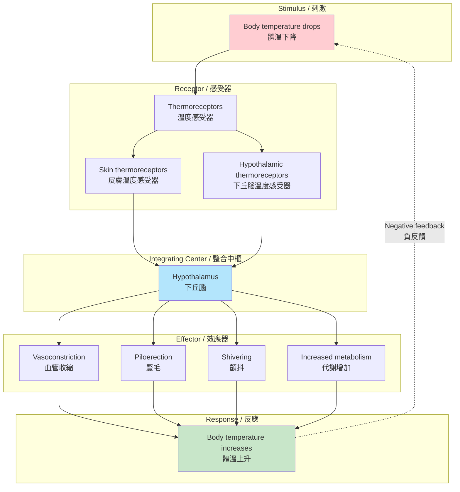
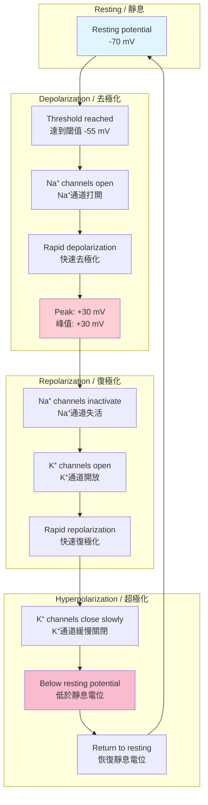
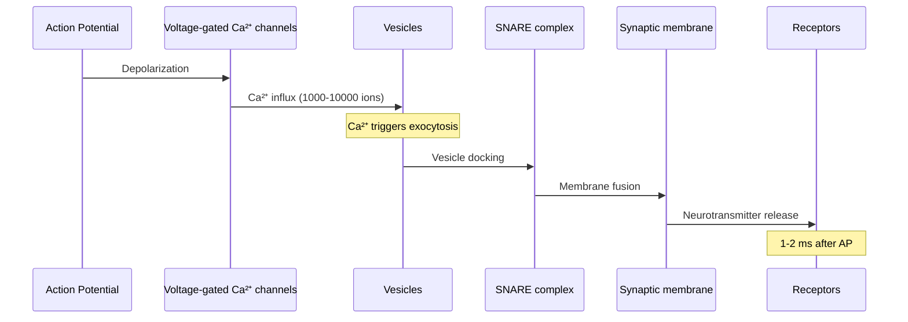
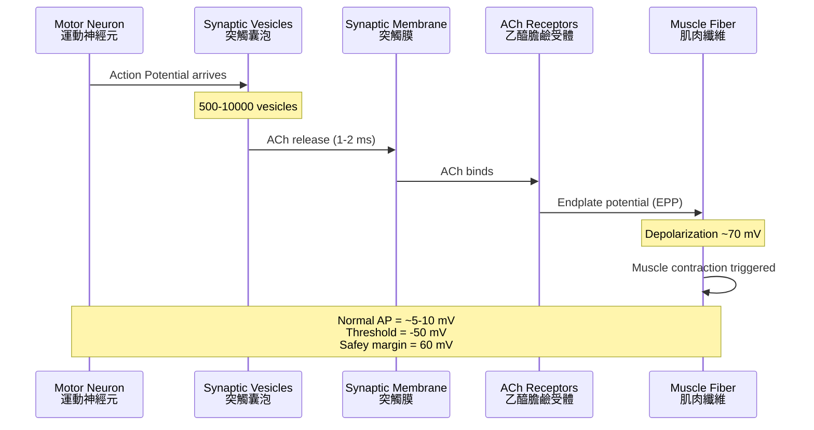
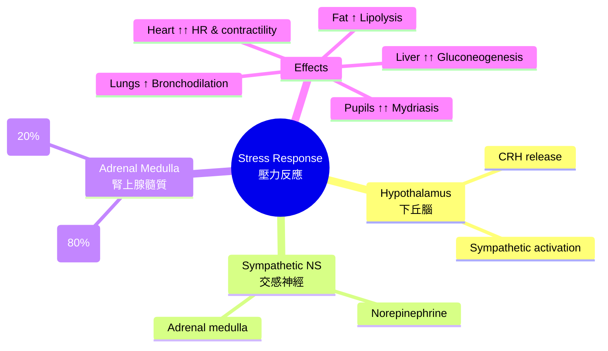
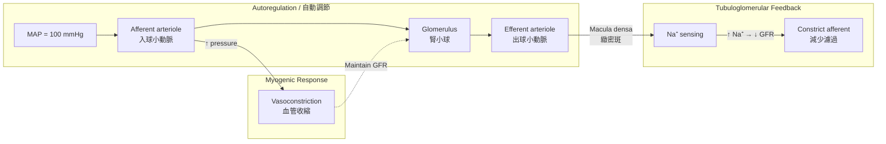

# Week 5 Notes — Homeostasis & Excitable Tissues (BMED2302)

## 問題 1：這個領域所有專家共享的 5 個核心心智模型是什麼？

### 1. 負反饋系統 (Negative Feedback Loops)
**Walter Cannon (1932)** — "The Wisdom of the Body"

- **核心概念**: 生理系統通過檢測偏差並自動糾正來維持穩態
- **三大組成**:
  1. **感測器 (Sensor)**: 檢測實際值與設定點的偏差
  2. **控制中心 (Integrating center)**: 比較設定點與實際值，決定響應
  3. **效應器 (Effector)**: 產生反應以糾正偏差
- **範例**: 體溫調節
  - 設定點: 37°C
  - 感測器: 體溫受體 (thermoreceptors)
  - 整合中樞: 下丘腦 (hypothalamus)
  - 效應器: 血管 (vasodilation/vasoconstriction), 汗腺, 顫抖
- **數字**:
  - 正常體溫範圍: 36.5-37.5°C
  - 發燒閾值: 37.5°C (100.4°F)
  - 極限溫度: 42°C (神經元损伤阈值)
- **BME 應用**: 體溫調節義肢、反饋控制的藥物輸注系統、生物反馈治疗

### 2. 設定點與動態平衡 (Set Point & Dynamic Equilibrium)
**Bernard (1878)** — "Milieu intérieur"

- **核心概念**: 細胞生活在一個受控制的內環境中 (internal environment)
- **設定點特性**:
  - 不是固定值，而是動態範圍
  - 可根據生理狀態調整 (晝夜節律, 運動, 疾病)
  - 設定點偏移 (set point shift) 發生在發燒時
- **重要參數及設定點**:
  | 參數 | 設定點 | 正常範圍 |
  |------|--------|----------|
  | 體溫 | 37°C | 36.5-37.5°C |
  | 血漿pH | 7.40 | 7.35-7.45 |
  | 血糖 | 5 mM (90 mg/dL) | 4.4-6.1 mM |
  | 血壓 | 120/80 mmHg | <140/90 |
  | 血鈉 | 140 mM | 135-145 mM |
- **BME 應用**: 連續血糖監測 (CGM)、植入式血壓感測器

### 3. 動作電位機制 (Action Potential Mechanism)
**Hodgkin & Huxley (1939, 1952)** — Nobel Prize 1963

- **離子基礎**:
  - **去極化相**: 電壓門控 Na⁺ 通道打開 → Na⁺ 大量內流
  - **復極化相**: Na⁺ 通道快速失活 + K⁺ 通道延遲開放 → K⁺ 外流
- **關鍵數字**:
  - 靜息膜電位: -70 mV
  - 閾值: -55 mV
  - 峰值: +30 mV
  - 超射 (overshoot): ~100 mV 範圍
  - 時程: 1-2 ms (神經元), 200-300 ms (心肌細胞)
  - 傳導速度: 1-120 m/s (取決於軸突直徑和髓鞘)
- **Hodgkin-Huxley 方程**:
  ```
  Cm × dV/dt = -gNa × m³h × (V - ENa) - gK × n⁴ × (V - EK) - gleak × (V - Eleak)
  ```
- **BME 應用**: 心律調節器、神經修復、神經假肢

### 4. 不應期機制 (Refractory Period)
**Hodgkin & Huxley (1952)** — 動作電位的頻率編碼

- **兩種類型**:
  1. **絕對不應期 (ARP)**:
     - Na⁺ 通道完全失活
     - 無論刺激強度如何，都無法產生 AP
     - 時程: ~1 ms (神經元), ~200 ms (心肌)
  2. **相對不應期 (RRP)**:
     - Na⁺ 通道正在從失活恢復
     - 需要超閾值刺激才能產生 AP
     - K⁺ 通道仍然開放
- **意義**:
  - 防止動作電位向後傳播
  - 限制最大放電頻率
  - f_max ≈ 1 / (ARP + RRP)
  - 神經元: ~500-1000 Hz
  - 心肌: ~200-300 bpm 理論最大值
- **BME 應用**: 心律調節器設計、抗心律失常藥物

### 5. 激素調節系統 (Hormonal Regulation)
**Bayliss & Starling (1902)** — 激素發現

- **內分泌 vs 旁分泌**:
  - 內分泌: 激素進入血液，作用於遠距離靶細胞
  - 旁分泌: 作用於鄰近細胞
  -自分泌: 作用於自身
- **反饋調節**:
  - **負反饋**: 甲狀腺軸 (HPT), 血糖調節 (胰島素/胰高血糖素)
  - **正反饋**: 催產素引發分娩宮縮、排卵LH峰
- **層次結構**:
  ```
  下丘腦 → 腦下垂體 → 靶腺體 → 激素分泌
       ↓           ↓
  釋放激素    促激素
  ```
- **BME 應用**: 胰島素泵、荷爾蒙替代療法、類固醇藥物設計

---

## 問題 2：3 個根本分歧

### 分歧 1: Na⁺ vs K⁺ 通道在 AP 中的相對重要性
- **A 方**: Hodgkin-Huxley (1952) — Na⁺ 內流是去極化的主要驅動因素
- **B 方**: 後續研究 — K⁺ 通道延遲開放對復極化同樣關鍵
- **現代理解**: 兩者缺一不可
  - Na⁺ 內流決定 AP 上升速度
  - K⁺ 外流決定 AP 下降速度和時程
  - 任何一方的缺失都會導致 AP 異常

### 分歧 2: 等級反應 vs 全或無反應
- **A 方**: 神經元 — AP 是全或無的
- **B 方**: 感覺神經元 — 等級反應 (感受器電位)
- **整合觀點**:
  - 感受器: 等級反應 (幅度與刺激強度成比例)
  - 軸突: 全或無 (digital signal)
  - 突觸: 等級反應 (EPSP/IPSP 可疊加)
  - 運動神經元: 全或無

### 分歧 3: 中樞 vs 外周節律發生
- **A 方**: 心臟 —竇房結 (SA node) 是主要節律點
- **B 方**: 某些病理情況下，其他區域可成為節律點
- **現代觀點**: 
  - 正常: SA node 主導 (70 bpm)
  - 病理: AV node (40-60 bpm), Purkinje fibers (20-40 bpm)
  - 心律失常治療: 消融術消除異常節律點

---

## 問題 3：10 個深度問題

1. 為什麼發燒時設定點會升高？這對身體有什麼保護作用？

2. 解釋為什麼在心臟的相對不應期給予電刺激可能導致心律失常 (R-on-T 現象)。

3. 比較神經元、骨骼肌和心肌細胞的動作電位特徵。

4. 如果 Na⁺/K⁺-ATPase 被完全抑制，會發生什麼？考慮對膜電位、細胞體積和離子梯度的影響。

5. 解釋胰島素和胰高血糖素如何协同调节血糖水平。

6. 為什麼甲狀腺激素對基礎代謝率有如此大的影響？

7. 描述壓力反應 (fight-or-flight) 中交感神經系統如何整合腎上腺素和皮質醇的作用。

8. 設計一個實驗來測量動作電位的傳導速度。

9. 解釋為什麼局部麻醉藥 (如 lidocaine) 可以阻斷疼痛但允許本體感覺保持。

10. 比較正反饋和負反饋在生理系統中的應用，並解釋為什麼正反饋較少見。

---

# 核心概念深化（中英對照）

## 1. Homeostasis 負反饋示意圖



## 2. Action Potential 示意圖



---

## 3. 深度 Dive 1: 甲狀腺軸 (HPT Axis) — 經典的負反饋系統

### 3.1 層次結構

**下丘腦-腦下垂體-甲狀腺軸 (Hypothalamic-Pituitary-Thyroid Axis)**

```
下丘腦
   ↓ TRH (Thyrotropin-Releasing Hormone)
腦下垂體前葉
   ↓ TSH (Thyroid-Stimulating Hormone)
甲狀腺
   ↓ T3 (Triiodothyronine) + T4 (Thyroxine)
靶組織 (腦、心臟、肝臟等)
   ↓
負反饋抑制
```

### 3.2 甲狀腺激素的作用

- **T4 → T3 轉化**: 脫碘反應
- **主要功能**:
  1. 增加基礎代謝率 (BMR) ↑ 50-100%
  2. 增加產熱 (thermogenesis)
  3. 促進生長發育 (especially CNS)
  4. 增加心率與心輸出量
  5. 促進神經系統成熟

### 3.3 臨床相關

| 狀態 | TSH | T3/T4 | 症狀 |
|------|-----|-------|------|
| 正常甲狀腺 | 0.4-4.0 mIU/L | Normal | - |
| 甲狀腺機能減退 | ↑ | ↓ | 疲勞、體重增加、寒冷不耐受 |
| 甲狀腺機能亢進 | ↓ | ↑ | 體重減輕、心悸、熱不耐受 |

### 3.4 BME應用
- **TSH 檢測**: 免疫分析技術 (ELISA, chemiluminescence)
- **甲狀腺超聲**: B-mode 超聲評估甲狀腺結節
- **放射性碘治療**: 利用碘攝取機制治療甲狀腺癌

---

## 4. 深度 Dive 2: 胰島素-胰高血糖素軸 — 血糖調節

### 4.1 雙激素模型

**胰島素 (Insulin)** — 合成代謝激素
- 來源: 胰島 β 細胞
- 作用: 降低血糖
- 機制:
  - ↑ 葡萄糖攝取 (GLUT4 translocation)
  - ↑ 糖原合成 (glycogenesis)
  - ↓ 糖異生 (gluconeogenesis)
  - ↓ 糖原分解 (glycogenolysis)

**胰高血糖素 (Glucagon)** — 分解代謝激素
- 來源: 胰島 α 細胞
- 作用: 升高血糖
- 機制:
  - ↑ 糖原分解
  - ↑ 糖異生
  - ↓ 糖原合成

### 4.2 血糖設定點

| 狀態 | 血糖濃度 | 主要激素 |
|------|----------|----------|
| 餐後 | 5-7 mM (90-126 mg/dL) | 胰島素為主 |
| 禁食 | 3.9-5.5 mM (70-100 mg/dL) | 胰高血糖素為主 |
| 運動 | 4.4-6.1 mM (80-110 mg/dL) | 腎上腺素 + 胰高血糖素 |

### 4.3 糖尿病分類

| Type | 病因 | 胰島素 | 治療 |
|------|------|--------|------|
| Type 1 | 自體免疫 β 細胞破壞 | 絕對缺乏 | 胰島素注射 |
| Type 2 | 胰島素抵抗 + β 細胞衰竭 | 相對缺乏 | 口服藥物 ± 胰島素 |
| Gestational | 妊娠相關 | 相對不足 | 飲食控制 ± 胰島素 |

### 4.4 BME應用
- **胰島素泵**: 連續皮下胰島素輸注 (CSII)
- **連續血糖監測 (CGM)**: 組織間液葡萄糖感測器
- **人工胰臟**: CGM + 胰島素泵 + 控制算法

---

## 5. 深度 Dive 3: 心臟電生理學 — 動作電位的整合

### 5.1 心肌細胞 vs 神經元

| 特性 | 心肌細胞 | 神經元 |
|------|----------|--------|
| AP duration | 200-300 ms | 1-2 ms |
| Refractory period | 250-300 ms | 1-5 ms |
| Plateau phase | Yes (Ca²⁺-dependent) | No |
| Gap junctions | Yes (electrical coupling) | Limited |
| Propagation | All-or-nothing | All-or-nothing |

### 5.2 心肌動作電位時程

```mermaid
graph LR
    subgraph "Phase 0"
        D[Depolarization<br/>Na⁺ rapid influx<br/>0-5 ms]
    end
    
    subgraph "Phase 1"
        E[Early repolarization<br/>Ito (transient K⁺)<br/>5-10 ms]
    end
    
    subgraph "Phase 2 (Plateau)"
        P[Plateau<br/>L-type Ca²⁺ influx<br/>Ca²⁺-induced Ca²⁺ release<br/>10-200 ms]
    end
    
    subgraph "Phase 3"
        R[Repolarization<br/>Delayed K⁺ channels<br/>200-300 ms]
    end
    
    subgraph "Phase 4"
        S[Resting potential<br/>Na⁺/K⁺-ATPase<br/>> 300 ms]
    end
    
    style P fill:#fff9c4
    style D fill:#ffcdd2
```

### 5.3 興奮傳導系統

```
竇房結 (SA node) → 心房 → 房室結 (AV node) → His束 → Purkinje纖維 → 心室
     70 bpm               ↓            1-3 bps          ↓
                       延遲 0.1s                    快速傳導
```

### 5.4 BME應用
- **心律調節器**: 電子裝置替代 SA node 功能
- **心電圖 (ECG)**: P波 (心房去極化), QRS (心室去極化), T波 (心室復極化)
- **除顫儀**: 電擊復律終止心室顫動
- **抗心律失常藥物**: Class I (Na⁺ 通道阻斷), Class II (β受體阻斷), Class III (K⁺ 通道阻斷), Class IV (Ca²⁺ 通道阻斷)

---

## 6. 深度 Dive 4: 神經傳遞 — 突觸整合

### 6.1 突觸結構

**化學突觸組成**:
- 突觸前末梢 (presynaptic terminal)
- 突觸間隙 (synaptic cleft): ~20-40 nm
- 突觸後膜 (postsynaptic membrane)

### 6.2 神經遞質釋放過程



### 6.3 主要神經遞質

| 神經遞質 | 效應 | 臨床相關 |
|----------|------|----------|
| Glutamate | 興奮性 | 癲癇、中風損傷 |
| GABA | 抑制性 | 焦慮、鎮靜藥物靶點 |
| Dopamine | 運動、獎勵 | Parkinson's, addiction |
| Serotonin | 情緒、睡眠 | 憂鬱症藥物 |
| Acetylcholine | 神經肌肉接頭 | Myasthenia gravis |
| Norepinephrine | 應激反應 | β-blockers |

### 6.4 BME應用
- **神經修復**: 電刺激促進神經再生
- **腦深層刺激 (DBS)**: 治療帕金森病
- **神經接口**: 腦-機介面 (BCI) 技術

---

## 7. 深度 Dive 5: 壓力反應 — HPA 軸

### 7.1 下丘腦-腦下垂體-腎上腺軸 (HPA Axis)

```
壓力 → 下丘腦
   ↓ CRH (Corticotropin-Releasing Hormone)
腦下垂體前葉
   ↓ ACTH (Adrenocorticotropic Hormone)
腎上腺皮質
   ↓ Cortisol (皮質醇)
靶組織
   ↓
負反饋抑制
```

### 7.2 皮質醇的作用

- **代謝作用**:
  - ↑ 糖異生
  - ↑ 蛋白質分解
  - ↑ 脂肪動員
  - ↑ 食慾
- **抗發炎作用**:
  - 抑制磷脂酶 A2
  - 減少前列腺素合成
  - 免疫抑制
- **心血管作用**:
  - 增強兒茶酚胺敏感性
  - 維持血管緊張度

### 7.3 慢性壓力的影響

- 皮質醇持續升高
- 免疫功能抑制
- 代謝異常 (胰島素抵抗)
- 認知功能受損
- 海馬萎縮

### 7.4 BME應用
- **皮質醇檢測**: 唾液、血液、頭髮分析
- **壓力生物標誌**: cortisol, heart rate variability (HRV)
- **正念干預**: 降低 HPA 軸活性

---

## 8. 10 個 Solution 解釋

### Solution 1: 動作電位頻率編碼
**問題**: 如果神經元的絕對不應期為 1 ms，相對不應期為 2 ms，最大放電頻率是多少？

**解答**:
```
最大放電頻率 = 1 / (絕對不應期 + 相對不應期)
            = 1 / (1 ms + 2 ms)
            = 1 / 3 ms
            = 333 Hz

實際上，由於需要超閾值刺激，相對不應期需要更強刺激
通常最大頻率 ≈ 200-300 Hz for typical neurons
```

### Solution 2: Goldman Equation 計算
**問題**: 計算具有以下參數的神經元靜息膜電位：
- PK⁺ = 5×10⁻⁶ m/s, [K⁺]in = 150 mM, [K⁺]out = 5 mM
- PNa⁺ = 5×10⁻⁸ m/s, [Na⁺]in = 15 mM, [Na⁺]out = 150 mM
- PCl⁻ = 1×10⁻⁶ m/s, [Cl⁻]in = 10 mM, [Cl⁻]out = 120 mM

**解答**:
```
RT/F = 26.7 mV at 37°C

Numerator = PK⁺[K⁺]out + PNa⁺[Na⁺]out + PCl⁻[Cl⁻]in
          = 5×10⁻⁶ × 5 + 5×10⁻⁸ × 150 + 1×10⁻⁶ × 10
          = 25×10⁻⁶ + 7.5×10⁻⁶ + 10×10⁻⁶
          = 42.5×10⁻⁶

Denominator = PK⁺[K⁺]in + PNa⁺[Na⁺]in + PCl⁻[Cl⁻]out
            = 5×10⁻⁶ × 150 + 5×10⁻⁸ × 15 + 1×10⁻⁶ × 120
            = 750×10⁻⁶ + 0.75×10⁻⁶ + 120×10⁻⁶
            = 870.75×10⁻⁶

Vm = 26.7 × ln(42.5/870.75) = 26.7 × ln(0.0488)
Vm = 26.7 × (-3.02) = -80.6 mV

≈ -70 to -90 mV (typical range)
```

### Solution 3: 血糖調節計算
**問題**: 計算禁食過夜後 (12小時)，肝臟需要釋放多少葡萄糖來維持血糖在 5 mM。假設血漿 volume = 3 L。

**解答**:
```
血漿葡萄糖量 = 5 mM × 3 L = 15 mmol = 2.7 g游離葡萄糖

禁食期間腦消耗: ~120 g glucose/day
≈ 5 g/hour

12小時需要: ~60 g 葡萄糖
其中約一半由肝臟提供 (其餘來自糖異生)

肝臟糖原儲存量: ~75-100 g
動員速度: ~0.5 g/hour (維持)
最大動員: ~2 g/hour (應激)

結論: 禁食過夜主要消耗肝臟糖原儲備
```

### Solution 4: 心輸出量計算
**問題**: 計算安靜狀態下的心輸出量。心率 = 70 bpm, 每搏輸出量 = 70 mL。

**解答**:
```
心輸出量 (CO) = 心率 (HR) × 每搏輸出量 (SV)

CO = 70 beats/min × 70 mL/beat
CO = 4900 mL/min = 4.9 L/min

正常範圍: 4-8 L/min

運動時可增加至 20-25 L/min (運動員可達 35 L/min)

Fick 原理驗證:
CO = VO₂ / (CaO₂ - CvO₂)
VO₂ = 250 mL O₂/min
CaO₂ - CvO₂ ≈ 5 mL O₂/100 mL blood
CO = 250 / 5 × 100 = 5000 mL/min ≈ 5 L/min ✓
```

### Solution 5: 滲透壓調節
**問題**: 血漿滲透壓約 300 mOsm/L。計算 0.9% NaCl 是否為等滲溶液。

**解答**:
```
0.9% NaCl = 9 g NaCl / 1000 g H₂O

摩爾數 = 9 g / 58.5 g/mol = 0.154 mol

van't Hoff factor i ≈ 1.85 (部分解離)

有效滲透濃度 = i × 0.154 = 1.85 × 0.154 = 0.285 osmol/L
            = 285 mOsm/L

≈ 300 mOsm/L → 近似等滲

0.9% NaCl 被稱為"生理鹽水"
等滲於血漿
```

### Solution 6: 甲狀腺功能檢測
**問題**: 某患者 TSH = 15 mIU/L (正常 0.4-4.0), Free T4 = 0.5 ng/dL (正常 0.8-1.8)。診斷是什麼？

**解答**:
```
TSH升高 + T4降低 → 甲狀腺機能減退

常見原因:
1. Hashimoto甲狀腺炎 (橋本氏)
   - 自體免疫甲狀腺破壞
   - 最常見原因 (90%)
   - 抗甲狀腺過氧化物酶抗體 (TPOAb) +
   
2. 碘缺乏 (發展中國家)
   
3. 甲狀腺手術/放射性碘治療後

治療:
- 左旋甲狀腺素 (Levothyroxine) 替代
- 起始劑量 25-50 μg/day
- 目標 TSH 0.5-2.5 mIU/L
```

### Solution 7: 動作電位傳導速度
**問題**: 直徑 20 μm 的有髓鞘軸突的傳導速度是多少？

**解答**:
```
經驗公式 (有髓鞘):
速度 ≈ 6 × 直徑 (μm) m/s

速度 = 6 × 20 = 120 m/s

有髓鞘軸突:
- 郎飛結 (Node of Ranvier) 間距 ~1-2 mm
- 髓鞘厚度 ~1 μm (軸突直徑的 10-20%)
- 跳躍傳導 (Saltatory conduction) 大幅提高速度

無髓鞘軸突:
速度 ≈ 0.5-2 m/s (非常慢!)

BME 意義:
- 神經修復時需要考慮軸突直徑
- 多發性硬化症: 髓鞘脫失導致傳導阻滯
```

### Solution 8: 胰島素敏感性
**問題**: Type 2 DM 患者的胰島素敏感性降至正常的 30%。如果 β 細胞分泌正常量的胰島素，血糖會升高多少？

**解答**:
```
胰島素敏感性 ↓ → 需要更多胰島素來清除相同量的葡萄糖

正常:
葡萄糖清除率 = 敏感性 × [胰島素]

假設:
- 正常敏感性 = 1.0, β 細胞分泌 = 100 units/day
- 患者敏感性 = 0.3, β 細胞分泌 = 100 units/day

有效胰島素作用 = 0.3 × 100 = 30 units (相當於)
vs 正常 100 units

結果:
血糖升高 ~3.3 倍 (假設線性關係)
空腹血糖: 5 → 16.5 mM (!!!)

實際上 β 細胞會代償性增加分泌
(但最終會衰竭)
```

### Solution 9: 腎上腺素的心血管作用
**問題**: 計算注射腎上腺素後心輸出量的變化。已知心率從 70 增至 120 bpm，每搏輸出量從 70 增至 100 mL。

**解答**:
```
基礎狀態:
CO₁ = 70 × 70 = 4900 mL/min = 4.9 L/min

腎上腺素刺激後:
CO₂ = 120 × 100 = 12000 mL/min = 12 L/min

增加量:
ΔCO = 12 - 4.9 = 7.1 L/min
增幅 ≈ 145%

腎上腺素作用機制:
1. β₁ 作用於心臟:
   - ↑ HR (正性頻率作用)
   - ↑ contractility (正性肌力作用)
   - ↑ SV (↑ preload + ↑ contractility)

2. α₁ 作用於血管:
   - 皮膚/內臟血管收縮
   - 維持血壓

3. β₂ 作用於血管:
   - 骨骼肌血管舒張
   - 增加血流
```

### Solution 10: 正反饋實例 — 分娩
**問題**: 解釋分娩中的正反饋機制。

**解答**:
```
正反饋迴路:

胎兒下降 → 子宮擴張
     ↓
催產素 (Oxytocin) 釋放
     ↓
宮縮加強
     ↓
胎兒進一步下降 → 更多擴張
     ↓
更多催產素釋放...

終止信號:
胎兒娩出 → 子宮壓力消失
     ↓
催產素釋放停止
     ↓
宮縮減弱

其他正反饋實例:
1. 排卵LH峰
2. 凝血瀑布
3. 胃酸分泌 (H. pylori刺激)
4. 動作電位去極化
```

---

## 9. 5 個 Mermaid 示意圖

### Diagram 1: 血糖調節負反饋

```mermaid
flowchart TB
    subgraph "High Blood Glucose / 高血糖"
        BG1[餐後血糖升高]
    end
    
    subgraph "Pancreas / 胰臟"
        B[β 細胞]
    end
    
    subgraph "Insulin Action / 胰島素作用"
        I1[↑ 葡萄糖攝取 (肌肉/脂肪)]
        I2[↑ 糖原合成 (肝臟)]
        I3[↓ 糖異生]
    end
    
    subgraph "Result / 結果"
        BG2[血糖恢復正常]
    end
    
    BG1 --> B
    B -->|Insulin<br/>胰島素| I1
    B -->|Insulin<br/>胰島素| I2
    B -->|Insulin<br/>胰島素| I3
    I1 --> BG2
    I2 --> BG2
    I3 --> BG2
    
    BG2 -.->|負反饋| BG1
    
    style BG1 fill:#ffcdd2
    style BG2 fill:#c8e6c9
    style B fill:#fff9c4
```

### Diagram 2: 神經元-肌肉接頭 (NMJ)



### Diagram 3: 壓力反應 (Fight-or-Flight)



### Diagram 4: 腎小球濾過率 (GFR) 調節



### Diagram 5: 酸鹼平衡緩衝系統

```mermaid
flowchart TB
    subgraph "Henderson-Hasselbalch Equation"
        eq[pH = pKa + log([A⁻]/[HA])]
    end
    
    subgraph "Blood Buffers"
        B1[Bicarbonate buffer<br/>CO₂ + H₂O ⇌ H₂CO₃ ⇌ H⁺ + HCO₃⁻]
        B2[Hemoglobin buffer<br/>HbH⁺ ⇌ Hb + H⁺]
        B3[Protein buffer<br/>ProteinCOO⁻ + H⁺ ⇌ ProteinCOOH]
        B4[Phosphate buffer<br/>H₂PO₄⁻ ⇌ H⁺ + HPO₄²⁻]
    end
    
    subgraph "Respiratory Compensation"
        R1[↑ H⁺ → ↑ ventilation<br/>→ ↓ pCO₂]
        R2[↓ H⁺ → ↓ ventilation<br/>→ ↑ pCO₂]
    end
    
    subgraph "Renal Compensation"
        K1[↑ H⁺ → ↑ H⁺ secretion<br/>↑ HCO₃⁻ reabsorption]
        K2[↓ H⁺ → ↓ H⁺ secretion<br/>↓ HCO₃⁻ reabsorption]
    end
    
    eq --> B1
    B1 --> R1
    B1 --> K1
```

---

## 附錄: 關鍵術語表 (Bilingual Glossary)

| English | 中文 | 定義 |
|---------|------|------|
| Homeostasis | 穩態 | 維持內環境相對穩定的狀態 |
| Negative feedback | 負反饋 | 抑制初始變化的反饋機制 |
| Positive feedback | 正反饋 | 放大初始變化的反饋機制 |
| Set point | 設定點 | 生理參數的目標值 |
| Action potential | 動作電位 | 細胞膜電位的快速瞬變 |
| Resting membrane potential | 靜息膜電位 | 未興奮細胞的膜電位 |
| Depolarization | 去極化 | 膜電位向正值變化 |
| Repolarization | 復極化 | 膜電位恢復靜息水平 |
| Hyperpolarization | 超極化 | 膜電位變得更負 |
| Threshold | 閾值 | 觸發動作電位的臨界電位 |
| Refractory period | 不應期 | 無法產生新的動作電位的時期 |
| Nerve impulse | 神經衝動 | 沿軸突傳播的動作電位 |
| Synapse | 突觸 | 神經元之間的信號連接 |
| Neurotransmitter | 神經遞質 | 突觸傳遞的化學信使 |
| Hormone | 激素 | 血液傳遞的內分泌信使 |
| Feedback loop | 反饋迴路 | 輸出影響輸入的系統 |
| Effector | 效應器 | 產生生理反應的器官/組織 |
| Sensor | 感受器 | 檢測環境變化的結構 |
| Integrating center | 整合中樞 | 處理信息並協調反應的中樞 |
| Autonomic nervous system | 自主神經系統 | 調節內臟功能的神經系統 |
| Sympathetic | 交感神經 | "戰鬥或逃跑"反應 |
| Parasympathetic | 副交感神經 | "休息和消化"反應 |
| Basal metabolic rate | 基礎代謝率 | 安靜狀態下的能量消耗 |
| Thermoregulation | 體溫調節 | 維持體溫的過程 |
| Blood glucose regulation | 血糖調節 | 維持血糖穩態 |
