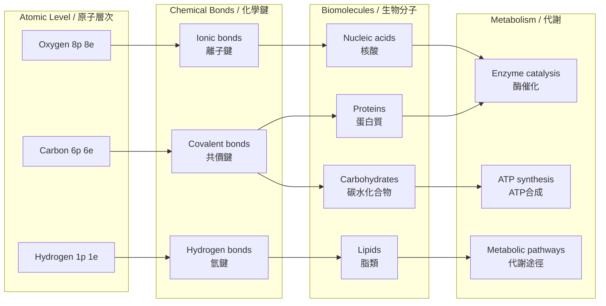
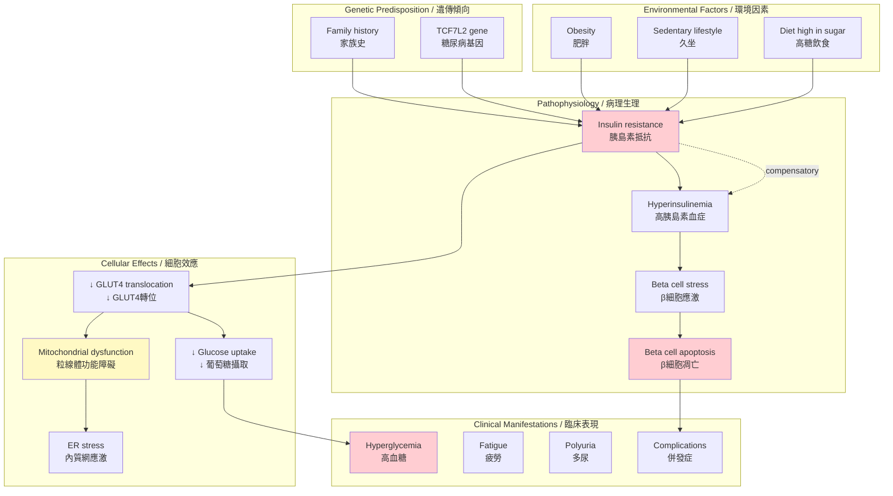
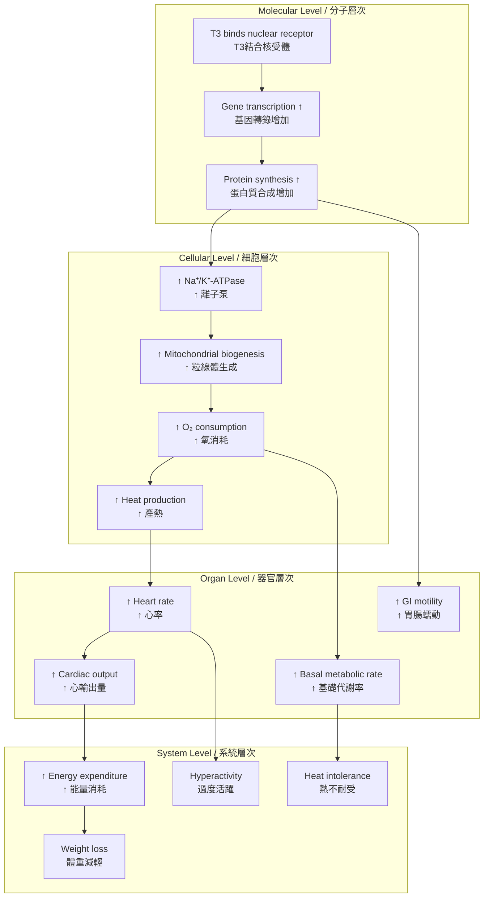
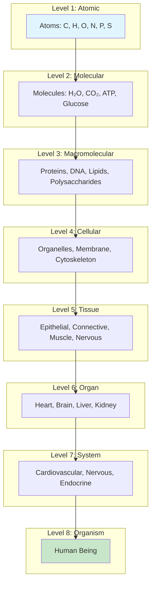
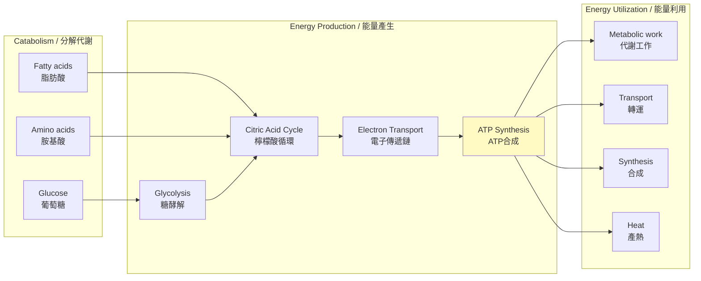
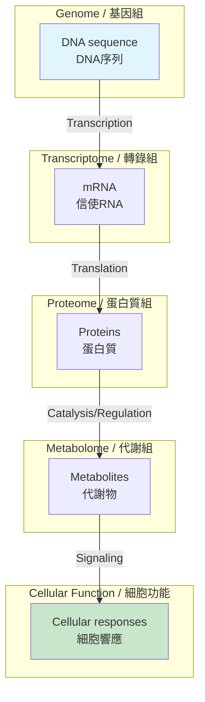
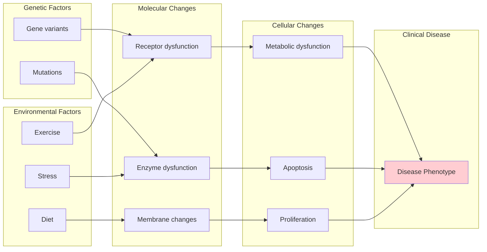

# Week 6 Notes — Phase 1 Integration

## Overview
This week synthesizes all Phase 1 concepts: Chemistry → Biochemistry → Cell Biology → Physiology. We'll trace the flow of energy and information from atoms to organ systems, using clinical cases to integrate knowledge.

## 問題 1：5 個核心整合心智模型

### 1. 能量流模型 (Energy Flow Model)
**Paul Boyer (1997 Nobel) + Peter Mitchell (1978 Nobel)**

```
化學能 → 葡萄糖氧化 → ATP合成 → 細胞工作
   ↓
  G = ΔH - TΔS
  ATP = 能量貨幣 (ΔG°' = -30.5 kJ/mol)
```

- **熱力學驅動**: ΔG < 0 為自發反應
- **動力學控制**: 酶加速反應但不改變 ΔG
- **能量轉換**: 化學能 → 電化學能 → 機械能
- **臨床**: 粒線體疾病、Warburg效應 (癌症)

### 2. 信息流模型 (Information Flow Model)
**Crick (1958, 1970) — Central Dogma**

```
DNA → RNA → Protein
  ↓     ↓     ↓
Replication Transcription Translation
       ↓
    調控網絡
```

- **基因表達調控**: 轉錄因子、增強子、沉默子
- **信號傳遞**: 受體 → 第二信使 → 轉錄因子
- **表觀遺傳**: DNA甲基化、組蛋白修飾
- **臨床**: 癌症中的基因突變、基因治療

### 3. 結構-功能關係模型 (Structure-Function Relationship)
**Anfinsen (1973 Nobel) — 蛋白質折疊熱力學假設**

```
一級結構 (胺基酸序列)
    ↓
二級結構 (α螺旋、β摺疊)
    ↓
三級結構 (3D摺疊)
    ↓
四級結構 (亞基組裝)
    ↓
功能 (酶活性、受體結合、結構蛋白)
```

- **摺疊病**: 朊病毒、澱粉樣蛋白
- **藥物設計**: 基於結構的藥物發現 (SBDD)
- **生物材料**: 蛋白質支架、組織工程

### 4. 穩態維持模型 (Homeostasis Maintenance Model)
**Cannon (1932) + Bernard (1878)**

```
刺激 → 感受器 → 整合中樞 → 效應器 → 反應
                      ↓
              負反饋抑制
```

- **層次結構**: 分子 → 細胞 → 組織 → 器官 → 系統
- **整合點**: 下丘腦、神經內分泌、心血管
- **疾病機制**: 反饋中斷、設定點偏移
- **BME應用**: 生物反饋控制、植入式感測器

### 5. 層次組織模型 (Hierarchical Organization)
**從原子到整個生物系統**

```
原子 (C, H, O, N, P, S)
    ↓
分子 (胺基酸、葡萄糖、ATP)
    ↓
生物大分子 (蛋白質、DNA、脂類)
    ↓
細胞器 (粒線體、核、ER)
    ↓
細胞 (神經元、肌細胞、β細胞)
    ↓
組織 (神經組織、肌肉組織、上皮)
    ↓
器官 (腦、心臟、肝臟)
    ↓
系統 (神經系統、內分泌系統)
    ↓
有機體 (人體)
```

---

## 問題 2：3 個根本分歧（跨學科）

### 分歧 1: 熱力學vs動力學控制
- **A 方**: 細胞由熱力學驅動 (所有過程趨向最低能量)
- **B 方**: 細胞由動力學控制 (酶決定反應速率)
- **整合**: 兩者缺一不可
  - 熱力學決定反應方向
  - 動力學決定反應速率
  - 細胞利用酶突破動力學障礙

### 分歧 2: 決定論vs概率論
- **A 方**: 基因決定一切 (Genetic determinism)
- **B 方**: 環境塑造一切 (Environmentalism)
- **整合**: Nature + Nurture
  - 表觀遺傳學
  - 基因-環境交互作用
  - 發育可塑性

### 分歧 3: 還原論vs整體論
- **A 方**: 理解分子就能理解生命 (還原論)
- **B 方**: 整體大於部分之和 (整體論)
- **整合**: 系統生物學
  - 從分子到網絡
  - Emergent properties
  - Quantitative systems biology

---

## 問題 3：10 個深度整合問題

1. 從原子結構解釋為什麼碳是生命基礎元素。

2. 計算葡萄糖完全氧化的 ATP 產量，並追蹤能量從化學鍵到 ATP 的轉換。

3. 解釋為什麼糖尿病會導致細胞膜功能異常，並連接到週四的膜結構知識。

4. 用物理化學原理（擴散、滲透壓）解釋腎衰竭的臨床症狀。

5. 將 Hodgkin-Huxley 模型的離子基礎與心律失常聯繫起來。

6. 解釋甲狀腺激素如何同時影響細胞代謝（分子）和心率（系統）。

7. 設計一個實驗證明胰島素抵抗發生在細胞膜受體還是細胞內信號。

8. 比較癌症的 Warburg 效應與正常的粒線體氧化磷酸化。

9. 解釋為什麼某些神經退行性疾病（如阿茲海默症）與能量代謝障礙相關。

10. 將 Phase 1 的所有概念整合到一個臨床案例：2型糖尿病的發病機制。

---

# 核心概念整合（中英對照）

## 1. 化學 → 生物化學 整合圖



## 2. 臨床案例整合圖：糖尿病



---

## 3. 深度 Dive 1: 從血糖到ATP — 完整能量流

### 3.1 葡萄糖攝取途徑

```
血糖 (5 mM)
   ↓
GLUT4 (insulin-dependent)
   ↓
細胞質葡萄糖
   ↓
Hexokinase (磷酸化)
   ↓
Glucose-6-P
   ↓
Glycolysis
   ↓
Pyruvate (2 per glucose)
   ↓
PDH (Pyruvate dehydrogenase)
   ↓
Acetyl-CoA (2 per glucose)
   ↓
Citric Acid Cycle (per Acetyl-CoA)
   ↓
3 NADH + 1 FADH₂ + 1 GTP
   ↓
Electron Transport Chain
   ↓
氧化磷酸化 (per glucose)
   ↓
30-32 ATP (aerobic)
```

### 3.2 ATP 產量計算

| 步驟 | NADH | FADH₂ | ATP equivalent |
|------|------|-------|----------------|
| Glycolysis | 2 | 0 | 3-5* |
| PDH | 2 | 0 | 5 |
| Citric Acid Cycle | 6 | 2 | 15-17 |
| ETC (NADH) | 10 | - | 25 |
| ETC (FADH₂) | - | 2 | 3 |
| **總計** | | | **30-32** |

*現代 P/O 比值: NADH = 2.5 ATP, FADH₂ = 1.5 ATP

### 3.3 糖尿病中的能量代謝障礙

- **胰島素抵抗** → **粒線體功能障礙**
- **肌肉中的葡萄糖攝取減少**
- **依賴脂肪酸氧化** (metabolic inflexibility)
- **氧化應激增加** → **並發症**

---

## 4. 深度 Dive 2: 膜結構-功能整合

### 4.1 細胞膜的雙重功能

**屏障功能**:
- 維持離子梯度
- 跨膜電位 (-70 mV)
- 選擇性通透性

**信息功能**:
- 受體介導的信號轉導
- 細胞識別 (糖萼)
- 膜蛋白作為藥物靶點

### 4.2 膜功能障礙與疾病

| 膜功能 | 疾病 | 機制 |
|--------|------|------|
| 離子通道 | 囊性纖維化 | CFTR突變 |
| 受體 | 胰島素抵抗 | 胰島素受體下調 |
| 轉運蛋白 | 葡萄糖轉運缺陷 | GLUT突變 |
| 離子泵 | 心律失常 | Na⁺/K⁺-ATPase抑制 |

### 4.3 BME應用

- **膜蛋白結構測定**: Cryo-EM, X-ray crystallography
- **藥物篩選**: 高通量膜蛋白結合實驗
- **生物感測器**: 利用膜受體原理
- **藥物傳遞**: 納米顆粒跨膜運輸

---

## 5. 深度 Dive 3: 從分子到系統 — 甲狀腺激素

### 5.1 甲狀腺激素的作用層次



### 5.2 臨床整合

**甲狀腺機能減退 (Hypothyroidism)**:
- 分子: ↓ T3/T4 → ↓ gene expression
- 細胞: ↓ Na⁺/K⁺-ATPase → ↓ ATP
- 系統: ↓ BMR → 疲勞、體重增加、冷不耐受

**甲狀腺機能亢進 (Hyperthyroidism)**:
- 相反效應 → 體重減輕、心悸、熱不耐受

---

## 6. 深度 Dive 4: 系統生物學視角

### 6.1 從還原論到系統論

**還原論方法**:
- 研究單一分子的功能
- "X分子導致Y疾病"
- 局限性: 無法解釋系統屬性

**系統生物學方法**:
- 研究分子網絡的行為
- 識別network motifs (motifs = recurring patterns)
- 建模和模擬

### 6.2 網絡Motifs

1. **負反饋環路**: 穩定性
2. **正反饋環路**: 雙穩態、記憶
3. **前饋環路**: 信號的時間和幅度控制

### 6.3 臨床應用

- **藥物靶點網絡**: 避免 compensating loops
- **生物標誌物組合**: 系統水平標記
- **精準醫學**: 網絡模型指導治療

---

## 7. 深度 Dive 5: 臨床案例 — 代謝綜合徵

### 7.1 定義

**代謝綜合徵 (Metabolic Syndrome)** 的五個診斷標準（需滿足 ≥ 3 項）:
1. 腰圍增加 (男 ≥ 90 cm, 女 ≥ 80 cm)
2. 血壓升高 (≥ 130/85 mmHg)
3. 空腹血糖升高 (≥ 100 mg/dL)
4. 血甘油三酯升高 (≥ 150 mg/dL)
5. HDL膽固醇降低 (男 < 40 mg/dL, 女 < 50 mg/dL)

### 7.2 病理生理整合

```
Insulin resistance
    ↓
Hyperinsulinemia + Hyperglycemia
    ↓
Dyslipidemia (↑ TG, ↓ HDL)
    ↓
Endothelial dysfunction
    ↓
Atherosclerosis
    ↓
Cardiovascular disease
```

### 7.3 多層次治療

| 層次 | 干預 | 機制 |
|------|------|------|
| 分子 | Metformin | ↑ AMPK, ↓ gluconeogenesis |
| 細胞 | Thiazolidinediones | ↑ Insulin sensitivity |
| 器官 | ACE inhibitors | ↓ Blood pressure |
| 系統 | Diet + Exercise | ↓ Weight, ↑ insulin sensitivity |

---

## 8. 10 個 Solution 解釋（跨學科）

### Solution 1: 從原子到藥物
**問題**: 為什麼阿司匹林（aspirin）的化學名稱是 acetylsalicylic acid？這個分子如何發揮抗炎作用？

**解答**:
```
化學基礎:
- Salicylic acid: 羥基苯甲酸 (天然存在於柳樹皮)
- Acetyl group: CH₃CO- (來自醋酸)
- 乙酰化提高了口服吸收率和耐受性

作用機制:
1. CO-X 鍵水解 → 水楊酸 + 醋酸
2. 水楊酸抑制 COX-1 和 COX-2
3. ↓前列腺素合成
4. ↓ 炎症、疼痛、發燒

層次整合:
- 分子: 酶抑制
- 細胞: 減少炎症介質
- 系統: 全身抗炎/鎮痛
```

### Solution 2: 血糖調節的完整反饋迴路
**問題**: 整合 Weeks 4-5 的知識，描述血糖調節的完整負反饋迴路。

**解答**:
```
感測器 (β cells):
- 檢測血糖水平
- 透過 GLUT2 攝取葡萄糖
- ATP/ADP 比值升高
- 膜去極化 → Ca²⁺ 內流
- 胰島素分泌

整合中樞 (β cells):
- 根據血糖水平調整胰島素分泌
- 旁分泌反饋 (somatostatin)

效應器:
- 肝臟: ↑ 糖原合成, ↓ 糖異生
- 肌肉: ↑ GLUT4, ↑ 葡萄糖攝取
- 脂肪: ↑ GLUT4, ↑ 脂解抑制

反饋:
- 血糖下降 → 胰島素分泌減少
- α cells 分泌 glucagon → 肝臟糖原分解

膜結構角色:
- 胰島素受體 (RTK)
- GLUT4 轉運蛋白
- 離子通道 (K⁺, Ca²⁺)
```

### Solution 3: 心律失常的離子基礎
**問題**: 解釋心室顫動 (VF) 的離子基礎以及治療原理。

**解答**:
```
正常心室肌AP:
- Phase 0: Na⁺ 內流
- Phase 1: 瞬時 K⁺ 外流
- Phase 2: Plateau (Ca²⁺)
- Phase 3: 延遲 K⁺ 外流
- 相對長的不應期

心室顫動:
- 多個微觀折返環
- 離子基礎:
  * ↓ Na⁺ 通道功能
  * ↑ K⁺ 通道表達
  * Ca²⁺ 處理異常
- 結果: 不穩定的自發電活動

治療原理:
1. 電除顫:
   - 同步化所有心肌細胞
   - 使所有細胞同時進入不應期
   - 允許竇房結恢復控制

2. 抗心律失常藥物:
   - Class I: Na⁺ 通道阻斷 (穩定膜)
   - Class III: K⁺ 通道阻斷 (延長AP)
```

### Solution 4: 運動時的能量轉換
**問題**: 追蹤一次100米衝刺比賽中的能量流動。

**解答**:
```
時間線:
0-10秒: ATP-PCr系統
- 現有的ATP (2-3秒消耗)
- Phosphocreatine (PCr) 分解
- 不需要氧氣
- 產物: 乳酸

10-60秒: 糖酵解
- Anaerobic glycolysis
- 葡萄糖 → 2 乳酸
- 快速但效率低
- 產生 ~2 ATP/葡萄糖

60秒+: 有氧氧化
- 脂肪氧化為主
- 少量碳水化合物
- 需要氧氣
- 產物: CO₂ + H₂O

能量產量比較:
100m sprint: ~50 kcal (主要來自 ATP-PCr 和 glycolysis)
Marathon: ~2500 kcal (主要來自有氧氧化)
```

### Solution 5: 腎衰竭的物理化學基礎
**問題**: 解釋為什麼腎衰竭導致尿毒症 (uremia) 和水腫 (edema)。

**解答**:
```
腎臟功能:
1. 排泄廢物 (urea, creatinine)
2. 調節水鹽平衡
3. 調節酸鹼平衡
4. 內分泌功能 (EPO, vitamin D)

腎衰竭後果:

廢物積累:
- ↓ 尿素排泄 → 血尿素氮 (BUN) ↑↑
- ↓ Creatinine 排泄 → 血肌酐 ↑↑
- 尿毒症症狀: 噁心、意識障礙、瘙癢

水鹽失衡:
- ↓ Na⁺ 排泄 → 水鈉瀦留
- ↓ 水排泄 → 血容量 ↑↑
- 結果: 水腫、高血壓、肺水腫

酸鹼失衡:
- ↓ H⁺ 排泄 → 代謝性酸中毒
- ↓ HCO₃⁻ 重吸收
- 結果: Kussmaul 呼吸

電解質失衡:
- ↓ K⁺ 排泄 → 高血鉀 (心律失常風險)
- ↓ Ca²⁺ 排泄 → 高血鈣
- ↓ phosphate排泄 → 高磷酸鹽
```

---

## 9. 5 個 Mermaid 示意圖

### Diagram 1: 生命層次結構



### Diagram 2: 能量貨幣循環



### Diagram 3: 信息處理層次



### Diagram 4: 疾病的多因素模型



### Diagram 5: 藥物開發流程

```mermaid
gantt
    title Drug Development Pipeline
    dateFormat  X
    axisFormat  %s months
    
    section Discovery
    Target identification      :done, t1, 0, 12
    HTS for lead compounds     :done, t2, 6, 18
    Lead optimization          :active, t3, 12, 30
    
    section Preclinical
    In vitro studies           :t4, 18, 36
    Animal models              :t5, 24, 42
    Toxicity testing           :t6, 30, 48
    
    section Clinical
    Phase I (Safety)           :t7, 36, 60
    Phase II (Efficacy)        :t8, 48, 72
    Phase III (Large scale)    :t9, 60, 96
    
    section Approval
    FDA/NMPA submission        :t10, 84, 108
    Post-market surveillance   :t11, 96, 120
```



---

## 附錄: Phase 1 關鍵公式總結

### 化學
- Henderson-Hasselbalch: pH = pKa + log([A⁻]/[HA])
- Gibbs free energy: ΔG = ΔH - TΔS

### 生物化學
- Michaelis-Menten: v = Vmax[S]/(Km + [S])
- ATP yield: ~30-32 ATP/glucose (aerobic)

### 細胞生物學
- Fick's Law: J = -D(dC/dx)
- Goldman Equation: Vm = (RT/F)ln([...])
- Nernst Equation: E = (RT/zF)ln([X]out/[X]in)

### 生理學
- 心輸出量: CO = HR × SV
- 穩態: 設定點 ± 正常範圍
- 負反饋: Error → Correction → 回到設定點

---

*Phase 1 Integration Complete | HKU BME Bootcamp | 2026-07*
