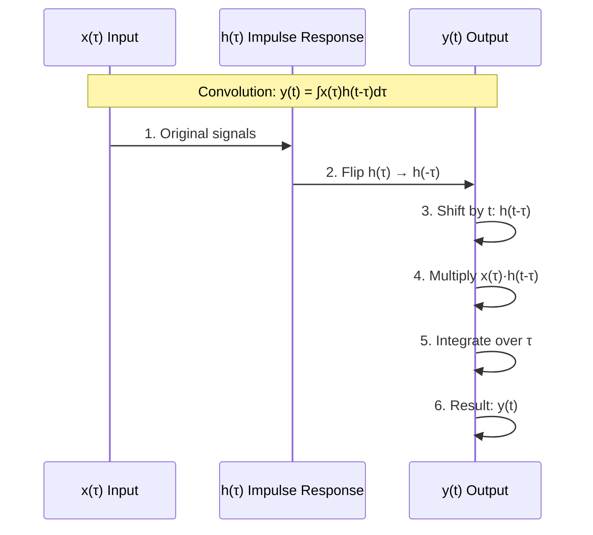
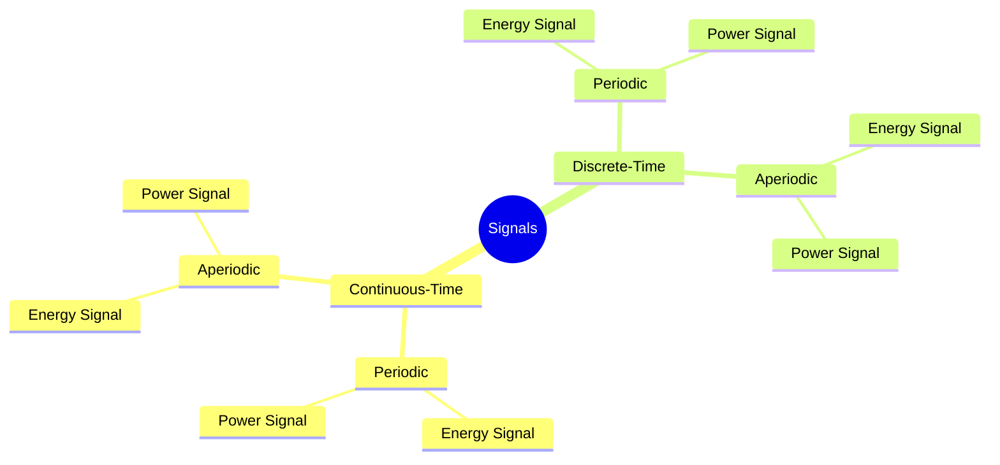
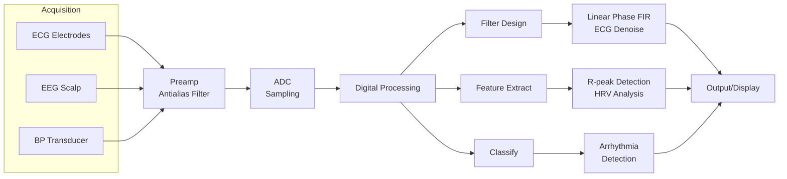

# Week 7 Notes — Biomedical Signals & Linear Systems (BMED2500)

## 問題 1：5 個核心心智模型

### 1. 信號作為函數：x(t) — Signal as Function

**核心概念**：任何信號都是時間的函數，連續時間信號用 x(t)，離散時間信號用 x[n]。這是整個信號處理領域的基礎抽象。

**數學表示**：
- 連續時間（CT）：x(t), t ∈ ℝ
- 離散時間（DT）：x[n], n ∈ ℤ

**關鍵方程式**：
```
CT信號週期性：x(t) = x(t + T₀)  ⟺  X(jω) = Σₖ 2πXₖ δ(ω - kω₀)
DT信號週期性：x[n] = x[n + N₀)  ⟺  X(e^(jω)) periodic with period 2π
```

**BME應用**：
- ECG信號：P wave (0.1s), QRS complex (0.08s), T wave (0.2s) — 都是週期性CT信號
- EEG信號：Alpha rhythm ~10 Hz，是非週期但統計規律的信號
- Blood pressure：每搏輸出，~1 Hz心率

**學者貢獻**：
- Oppenheim & Willsky (1997)《Signals and Systems》— 現代信號理論奠基
- Bracewell (2000)《The Fourier Transform》— 射電天文學應用

**深度問題**：如果我們能完美重建任何信號，為什麼還要分類信號（週期vs非週期、確定性vs隨機）？

---

### 2. LTI系統：Convolution完全刻畫 — LTI Systems: Convolution Characterizes Everything

**核心概念**：對於線性時不變（LTI）系統，系統完全由其脈衝響應 h(t) 刻畫。輸出是輸入與脈衝響應的卷積。

**數學表示**：
- 連續時間卷積：y(t) = x(t) * h(t) = ∫x(τ)h(t-τ)dτ
- 離散時間卷積：y[n] = x[n] * h[n] = Σx[k]h[n-k]

**關鍵方程式**：
```latex
y(t) = \int_{-\infty}^{+\infty} x(\tau) \cdot h(t-\tau) d\tau
     = \int_{-\infty}^{+\infty} h(\tau) \cdot x(t-\tau) d\tau
```

**卷積的四大性質**：
1. **交換律**：x * h = h * x
2. **結合律**：(x * h₁) * h₂ = x * (h₁ * h₂)
3. **分配律**：x * (h₁ + h₂) = x * h₁ + x * h₂
4. **單位元**：x * δ = x

**BME應用**：
- 心血管系統：blood pressure response to heart beat = input * system impulse response
- 神經元：action potential = synaptic input * neural membrane impulse response
- 藥物動力學：plasma concentration = dose input * pharmacokinetic impulse response

**學者貢獻**：
- Bracewell (1956) — Strip integration in radio astronomy
- Shannon (1949) — Convolution theorem for communication

**深度問題**：為什麼卷積能完全刻畫LTI系統？這個「完全性」意味著什麼物理意義？

---

### 3. 傅立葉級數：信號分解為正弦波的疊加 — Fourier Series: Sinusoidal Decomposition

**核心概念**：任何週期信號都可以表示為離散頻率的正弦和餘弦波的加权和（復指數形式）。這是頻率分析的基礎。

**數學表示**：
```latex
x(t) = \sum_{k=-\infty}^{+\infty} a_k \cdot e^{jk\omega_0 t}
其中：\omega_0 = \frac{2\pi}{T_0} (基頻)
     a_k = \frac{1}{T_0}\int_{T_0} x(t)e^{-jk\omega_0 t}dt (傅立葉係數)
```

**CTFS vs DTFS**：
- CTFS：頻譜是離散的，諧波位於 kω₀
- DTFS：頻譜也是離散的，但只定義在 [0, 2π)

**Gibbs現象**：
在間斷點附近，即使我們增加傅立葉項數，總會有約9%的overshoot：
```latex
\lim_{N\to\infty} x_N(t) = x(t) + 0.089 \cdot [x(t^+) - x(t^-)] \cdot \text{sgn}(t-t_0)
```

**BME應用**：
- ECG頻譜：P波0-10Hz，QRS複合波10-40Hz，T波0-10Hz
- 心率變異性(HRV)分析：LF (0.04-0.15Hz) 和 HF (0.15-0.4Hz) 頻段
- 語音分析：基頻 F₀ ~100-200Hz，諧波分佈

**學者貢獻**：
- Fourier (1822)《熱的解析理論》— 任意函數可用正弦級數表示
- Dirichlet (1829) — 收斂性條件

**深度問題**：Gibbs現象中的9% overshoot是怎麼產生的？這是否意味著傅立葉級數「不完美」？

---

### 4. 基本信號構建塊：δ, u, e^(at) — Building Blocks: δ, Unit Step, Exponential

**核心概念**：任何複雜信號都可以分解為三個基本信號的線性組合：單位脈衝 δ(t)、單位階躍 u(t)、和指數信號 e^(at)。

**數學表示**：
```latex
單位脈衝 (Dirac Delta)：δ(t) = 0 for t≠0, \int_{-\infty}^{+\infty} δ(t)dt = 1
單位階躍：u(t) = 1 for t≥0, 0 for t<0
指數信號：e^{at} (實數) 或 e^{jωt} (複數)
```

**重要關係**：
```latex
u(t) = \int_{-\infty}^{t} δ(τ)dτ
δ(t) = du(t)/dt
x(t) = x(t) * δ(t) = \int x(τ)δ(t-τ)dτ = x(t)
```

**矩形脈衝與δ的關係**：
```latex
\lim_{\epsilon \to 0} rect(t/\epsilon) / \epsilon = δ(t)
```

**BME應用**：
- δ(t)：瞬間刺激（電擊、神經脈衝）
- u(t)：開關系統、階躍響應
- e^(-t/τ)：RC電路的放電、指數藥物清除

**學者貢獻**：
- Dirac (1927)《量子力學原理》— δ函數的數學嚴格化
- Lighthill (1958)《廣義函數導論》— δ函數的現代數學基礎

**深度問題**：δ函數在數學上不是「真正」的函數，為什麼我們還能用它進行有意義的計算？

---

### 5. 系統性質：穩定性、因果性、記憶 — System Properties: BIBO Stability, Causality, Memory

**核心概念**：LTI系統的四大關鍵性質決定了其在BME應用中的適用性。

**數學表示**：
```latex
BIBO穩定性：\int_{-\infty}^{+\infty} |h(t)|dt < ∞  ⟺  對所有有界輸入，輸出有界
因果性：y(t₀) 只依賴於 x(t) for t ≤ t₀
記憶性：y(t₀) 依賴於 x(t) for t ≠ t₀ → 無記憶
時間不變性：y(t) = T{x(t)} ⟹ y(t-t₀) = T{x(t-t₀)}
線性性：T{ax₁(t) + bx₂(t)} = aT{x₁(t)} + bT{x₂(t)}
```

**穩定性與因果性的關係**：
- 穩定系統不一定因果（如時間反轉系統）
- 因果系統不一定穩定（如高增益系統）
- 物理可實現系統：h(t) = 0 for t < 0

**BME應用**：
- ECG放大器：必須穩定（輸出有界）且因果（實時處理）
- EEG系統：穩定性關鍵，防止雜訊放大
- 藥物動力學：因果模型（給藥後才有反應）

**學者貢獻**：
- Zadeh (1950) — BIBO穩定性定義
- Bode (1945) — 穩定性理論與控制系統

**深度問題**：為什麼穩定性定義中要強調「對所有有界輸入」？這個「所有」的重要性在哪裡？

---

## 問題 2：3 個根本分歧

### 分歧 1：離散時間 vs 連續時間 — DT vs CT

**問題核心**：在BME應用中，什麼情況下應該選擇離散時間（DT）處理 vs 連續時間（CT）分析？

**連續時間支持者觀點**：
- 生理過程本質上是連續的（血壓、神經活動）
- CT模型更直觀，微分方程直接描述物理過程
- 模擬計算（analog circuits）可能更節能

**離散時間支持者觀點**：
- 數字計算機只能處理離散數據
- 離散系統有更好的數值穩定性
- 現代DSP晶片專為DT處理優化

**實際答案**：DT處理，CT理解。采樣後的DT信號保留CT信號的所有信息（如果滿足Nyquist準則）。選擇取決於：
- 計算資源
- 實時性要求
- 精度需求

**代碼示例**：
```python
import numpy as np

# CT信號：心率波形
fs = 500  # 采樣率 Hz
t = np.arange(0, 2, 1/fs)  # 2秒
heart_rate = 72/60  # 72 bpm
ecg_ct = np.sin(2*np.pi*heart_rate*t)  # 簡化ECG

# 離散化後的DT信號
print(f"CT duration: {2}s")
print(f"DT samples: {len(ecg_ct)}")
print(f"DT period: {1/fs}s = {1000/fs}ms")
```

---

### 分歧 2：時域 vs 頻域分析 — Time Domain vs Frequency Domain

**問題核心**：什麼時候應該在時域分析，什麼時候應該轉到頻域？

**時域分析支持者觀點**：
- 直接測量波形形狀（ECG的QRS複合物）
- 脈衝響應、階躍響應是時域概念
- 許多BME工程師更熟悉時域

**頻域分析支持者觀點**：
- 卷積在頻域變成乘法，計算更高效
- 濾波器設計在頻域更直觀
- 信號特徵往往在頻域更明顯

**實際答案**：視任務而定。時域適合：波形形態分析、瞬態事件檢測。頻域適合：周期性分析、噪聲濾除、系統識別。

**代碼示例**：
```python
import numpy as np
import matplotlib.pyplot as plt
from scipy import signal

# 時域：QRS檢測
qrs_peaks, _ = signal.find_peaks(ecg_ct, height=0.5, distance=int(0.2*fs))

# 頻域：提取HRV頻段
f, psd = signal.periodogram(ecg_ct, fs)
hrv_low = np.sum(psd[(f >= 0.04) & (f <= 0.15)])
hrv_high = np.sum(psd[(f >= 0.15) & (f <= 0.4)])
```

---

### 分歧 3：確定性 vs 隨機信號模型 — Deterministic vs Stochastic

**問題核心**：生理信號應該建模為確定性信號還是隨機信號？

**確定性支持者觀點**：
- ECG有明確的PQRST波形結構
- 可以用正弦模型逼近周期性信號
- 模型解釋性強

**隨機支持者觀點**：
- 實際生理信號有隨機變異（HRV、噪音）
- 統計分析提供置信區間
- 隨機過程理論更嚴格

**實際答案**：兩者結合。用確定性模型捕捉主要結構，用隨機過程建模殘差和變異。

---

## 問題 3：10 個深度問題

### Q1: 為什麼 δ函數 的 lim定義 不收斂，但δ函數 仍然「有效」？

**答案**：
δ函數是廣義函數（distribution），不是普通函數。它只在積分環境下有意義：
```latex
\int_{-\infty}^{+\infty} f(t)δ(t-t₀)dt = f(t₀)
```
這稱為「testing function property」。δ函數的lim表示是一種直觀描述，不是數學定義。

---

### Q2: 如果系統是LTI的，卷積可以完全刻畫系統。這是否意味著LTI假設總是成立？

**答案**：
LTI是一個理想化假設。實際生理系統通常：
- 非線性：神經元的all-or-none響應、藥物的劑量-效應曲線
- 時變：適應性、心率變化
- 分佈式：身體不同部位響應不同

LTI在以下情況是良好近似：
- 小信號操作（線性區間）
- 短時間尺度（系統參數變化慢）
- 系統識別區間

---

### Q3: 為什麼CTFS的頻譜是離散的，而CTFT的頻譜是連續的？

**答案**：
因為週期性！週期信號的頻譜只能是離散的諧波：
```latex
x(t) = Σₖ aₖe^(jkω₀t)  ⟺  X(jω) = Σₖ 2πaₖδ(ω-kω₀)
```
非週期信號可以看作週期→∞，離散頻率→連續頻率覆蓋。

---

### Q4: Gibbs現象中的9% overshoot是一個缺陷嗎？如何消除？

**答案**：
9% overshoot不是缺陷，而是傅立葉級數收斂的固有特性。隨著N增加，overshoot位置收緊到間斷點，但幅度保持在~9%。

消除方法：
- Cesàro summation (Fejér kernel) — 使用平均值
- ΔΣ信號處理
- 自適應濾波器

---

### Q5: 什麼是「能量信號」vs「功率信號」？這在BME中有什麼意義？

**答案**：
```latex
能量信號：E = ∫|x(t)|²dt < ∞ ⟹ P = 0
功率信號：P = lim_{T→∞} (1/T)∫|x(t)|²dt > 0
```

BME應用：
- ECG突發信號：能量信號（有限持續時間）
- EEG背景活動：功率信號（持續性、隨機性）
- 功率譜密度(PSD)分析對功率信號至關重要

---

### Q6: 為什麼我們需要區分信號的時間軸和采樣軸？

**答案**：
防止混淆物理時間和離散樣本索引：
- 物理時間：t ∈ ℝ，連續，單位秒
- 離散索引：n ∈ ℤ，整數，無單位

這影響：
- 維度分析（Hz vs rad/s）
- 頻率映射（連續頻率 vs 數字頻率）
- 物理意義（1Hz = 1 cycle/s）

---

### Q7: 如何從系統的脈衝響應判斷系統是低通、高通、還是帶通？

**答案**：
1. 計算系統的頻率響應：H(jω) = ℱ{h(t)}
2. 觀察|H(jω)|的形狀：
   - LP: |H|在高頻衰減
   - HP: |H|在低頻衰減
   - BP: |H|在中頻保留，兩端衰減
3. 從脈衝響應形狀直觀判斷：
   - 平滑、緩慢衰減 → 低通
   - 快速振盪 → 高通/帶通

---

### Q8: 什麼是「奇偶性」在信號處理中的意義？

**答案**：
任何信號可以分解為：
```latex
x_even(t) = (x(t) + x(-t))/2
x_odd(t) = (x(t) - x(-t))/2
x(t) = x_even(t) + x_odd(t)
```

意義：
- 偶信號的傅立葉變換是實部
- 奇信號的傅立葉變換是虛部
- 簡化卷積計算：偶*偶=偶，奇*奇=偶，偶*奇=奇

---

### Q9: 為什麼真實世界系統總是因果的，但數學模型可以是非因果的？

**答案**：
因果性是物理約束：
- 未來不能影響現在
- 輸出不能先於輸入

數學模型可以是：
- **非因果**：包含|ω|的頻率響應（如理想低通）不可實現
- **反因果**：h(t) = 0 for t ≥ 0
- **雙邊**：混合因果和非因果部分

工程意義：任何可實現的連續時間系統必須是因果的。離散時間系統可以是非因果（需要延遲）。

---

### Q10: 如何用簡單的方法檢驗兩個信號是否「相似」？

**答案**：
方法1：相關係數
```python
corr = np.corrcoef(x, y)[0, 1]
```

方法2：歸一化均方誤差（NMSE）
```python
nmse = np.mean((x - y)**2) / np.mean(x**2)
```

方法3：互相關函數
```python
cross_corr = np.correlate(x, y, mode='full')
lag = np.argmax(cross_corr) - len(y) + 1
```

---

# 核心概念深化（中英對照）

## 1. 信號分類 / Signal Classification

### 1.1 Bilingual 概念對照

| 中文 | English | 中文解釋 | English Definition |
|------|---------|----------|---------------------|
| 連續時間信號 | Continuous-Time Signal | 時間連續變化的信號 | x(t), t ∈ ℝ |
| 離散時間信號 | Discrete-Time Signal | 時間離散採樣的信號 | x[n], n ∈ ℤ |
| 週期信號 | Periodic Signal | 滿足 x(t+T₀)=x(t) | Repeats every T₀ |
| 非週期信號 | Aperiodic Signal | 不重複 | No fundamental period |
| 能量信號 | Energy Signal | 有限總能量 | 0 < E < ∞, P = 0 |
| 功率信號 | Power Signal | 非零平均功率 | P > 0, E = ∞ |
| 確定性信號 | Deterministic Signal | 可用確定函數描述 | Known for all t |
| 隨機信號 | Random/Stochastic Signal | 只能用統計描述 | Only statistics known |

### 1.2 關鍵推導 (數學方程式)

**能量和功率計算**：
```latex
能量：E = \int_{-\infty}^{+\infty} |x(t)|²dt
功率：P = \lim_{T\to\infty} \frac{1}{T} \int_{-T/2}^{T/2} |x(t)|²dt
```

**週期信號的平均功率**：
```latex
P = \frac{1}{T_0} \int_{0}^{T_0} |x(t)|²dt = \sum_{k=-\infty}^{\infty} |a_k|²
```

**Parseval定理（CTFS）**：
```latex
\frac{1}{T_0} \int_{T_0} |x(t)|²dt = \sum_{k=-\infty}^{\infty} |a_k|²
```

### 1.3 BME 應用

**ECG信號分類**：
- CT信號（連續監測）
- 週期信號（心臟週期~0.8s at 75bpm）
- 功率信號（持續監護）
- 確定性+隨機混合（形態確定， timing隨機）

**EEG信號分類**：
- CT信號
- 非週期信號（背景活動）
- 功率信號
- 隨機信號（隨機過程）

### 1.4 Deep Test Question

**Q**: 一個週期為T₀=2ms的信號，其最低非零頻率分量是多少Hz？
- (a) 500 Hz
- (b) 1000 Hz
- (c) 2000 Hz
- (d) 250 Hz

**Answer**: (a) 500 Hz
```latex
f₀ = 1/T₀ = 1/0.002 = 500 Hz
最低非零頻率 = 基頻 f₀ = 500 Hz
```

### 1.5 圖解

```mermaid
graph TD
    A[Signal x(t)] --> B{Signal Type?}
    B -->|Continuous| C[CT Signal<br/>x(t), t∈ℝ]
    B -->|Discrete| D[DT Signal<br/>x[n], n∈ℤ]
    C --> E{Time Domain?}
    D --> F{Pattern?}
    E -->|Finite| G[Energy Signal<br/>E&lt;∞]
    E -->|Infinite| H{Power?}
    F -->|Repeats| I[Periodic<br/>x(t+T₀)=x(t)]
    F -->|No Repeat| J[Aperiodic<br/>No T₀]
    H -->|P=0| G
    H -->|P>0| K[Power Signal<br/>E=∞, P>0]
    I --> L[Frequency: f₀=1/T₀<br/>Harmonics: kf₀]
```

---

## 2. 卷積 / Convolution

### 2.1 Bilingual 概念對照

| 中文 | English | 中文解釋 | English Definition |
|------|---------|----------|---------------------|
| 卷積 | Convolution | 兩函數的積分疊加 | Integral of flipped product |
| 脈衝響應 | Impulse Response | 系統對δ輸入的輸出 | h(t) = T{δ(t)} |
| 疊加積分 | Superposition Integral | 連續時間卷積 | y(t) = ∫x(τ)h(t-τ)dτ |
| 翻轉-滑動 | Flip-and-Slide | 卷積的幾何解釋 | Flip h, slide over x |
| 交換律 | Commutative | x*h = h*x | Order doesn't matter |

### 2.2 關鍵推導 (數學方程式)

**CT卷積推導**：
```latex
LTI系統對任意輸入x(t)的響應：

1. 將x(t)分解為脈衝的疊加：
   x(t) = ∫x(τ)δ(t-τ)dτ

2. 每個脈衝δ(t-τ)產生的響應：
   T{δ(t-τ)} = h(t-τ)

3. 疊加原理（線性）：
   y(t) = ∫x(τ) · h(t-τ) dτ

∴ y(t) = x(t) * h(t)
```

**卷積的交換律證明**：
```latex
y(t) = ∫x(τ)h(t-τ)dτ

令 u = t-τ, τ = t-u, dτ = -du

y(t) = ∫x(t-u)h(u)(-du)
     = ∫h(u)x(t-u)du
     = h(t) * x(t)

∴ x * h = h * x ✓
```

### 2.3 BME 應用

**心血管系統建模**：
```python
import numpy as np
import matplotlib.pyplot as plt

# 心臟泵血作為輸入（心室容積變化）
fs = 500  # Hz
t = np.arange(0, 2, 1/fs)
ventricular_volume = np.exp(-t*2) * np.sin(2*np.pi*1*t) * (t > 0.1)

# 系統脈衝響應（主動脈顺应性）
tau = 0.3  # 時間常數 秒
h_response = np.exp(-t/tau) * (t >= 0)

# 卷積得到血壓波形
blood_pressure = np.convolve(ventricular_volume, h_response, mode='same') / fs

plt.figure(figsize=(12, 4))
plt.subplot(1, 2, 1)
plt.plot(t, ventricular_volume)
plt.title('Input: Ventricular Volume Change')
plt.xlabel('Time (s)')
plt.ylabel('Volume (mL)')

plt.subplot(1, 2, 2)
plt.plot(t, blood_pressure)
plt.title('Output: Blood Pressure (via Convolution)')
plt.xlabel('Time (s)')
plt.ylabel('Pressure (mmHg)')
plt.tight_layout()
plt.show()
```

### 2.4 Deep Test Question

**Q**: 計算 y(t) = u(t) * e^(-at)u(t)，其中 a > 0

**Solution**:
```latex
y(t) = ∫u(τ)e^(-a(t-τ))u(t-τ)dτ
     = ∫₀^t e^(-a(t-τ)) dτ        (u(τ)=1 for τ≥0, u(t-τ)=1 for τ≤t)
     = e^(-at) ∫₀^t e^(aτ) dτ
     = e^(-at) · [e^(at)/a]₀^t
     = e^(-at) · (e^(at) - 1)/a
     = (1 - e^(-at))/a

驗證：當 t→0, y→0; 當 t→∞, y→1/a ✓
```

### 2.5 圖解



---

## 3. LTI系統性質 / LTI System Properties

### 3.1 Bilingual 概念對照

| 中文 | English | 中文解釋 | English Definition |
|------|---------|----------|---------------------|
| 線性性 | Linearity | 疊加+齊次 | T{ax₁+bx₂}=aT{x₁}+bT{x₂} |
| 時不變性 | Time-Invariance | 參數不隨時間變 | T{x(t-t₀)}=y(t-t₀) |
| 因果性 | Causality | 未來不影響現在 | y(t) depends on x(τ≤t) |
| 穩定性 | BIBO Stability | 有界輸入→有界輸出 | ‖x‖<∞ ⟹ ‖y‖<∞ |
| 記憶性 | Memory | 輸出依賴歷史輸入 | y(t) depends on x(τ<t) |

### 3.2 關鍵推導 (數學方程式)

**BIBO穩定性條件**：
```latex
穩定性 ⟺ ∫|h(t)|dt < ∞

證明：
(⇒) 假設穩定，反例：|h|不絕對可積，考慮有界輸入x(t)=sgn(h(-t))，
    輸出 y(0) = ∫h(τ)x(-τ)dτ = ∫|h(τ)|dτ = ∞ ⟹ 不穩定

(⇐) 假設|h|絕對可積：
    |y(t)| = |∫h(τ)x(t-τ)dτ| ≤ ∫|h(τ)||x(t-τ)|dτ
          ≤ ‖x‖_∞ · ∫|h(τ)|dτ < ∞
    ∴ 有界輸出
```

**因果性條件**：
```latex
因果 ⟺ h(t) = 0 for t < 0

證明：若 h(t) = 0 for t < 0，則
y(t₀) = ∫h(τ)x(t₀-τ)dτ = ∫₀^∞ h(τ)x(t₀-τ)dτ
      = ∫₀^∞ h(τ)·[depends only on x(τ'≤t₀)]dτ
∴ y(t₀) 只依賴 x(τ≤t₀) ✓
```

### 3.3 BME 應用

**ECG放大器穩定性分析**：
```python
import numpy as np

# 典型ECG放大器脈衝響應
def ecg_amplifier_impulse(t):
    """假設放大器是穩定的：絕對可積"""
    h = np.exp(-t/1.0) * np.cos(2*np.pi*1*t) * (t >= 0)  # 1秒時間常數
    return h

t = np.linspace(0, 5, 1000)
h = ecg_amplifier_impulse(t)

# 穩定性檢驗
stability_integral = np.trapz(np.abs(h), t)
print(f"∫|h(t)|dt = {stability_integral:.4f}")
print(f"System is {'STABLE' if stability_integral < float('inf') else 'UNSTABLE'}")

# 測試有界輸入
x = np.sin(2*np.pi*0.5*t)  # 0.5Hz正弦（有界輸入）
y = np.convolve(x, h, mode='same') * (t[1]-t[0])
print(f"Input max: {np.max(np.abs(x)):.2f}")
print(f"Output max: {np.max(np.abs(y)):.2f}")
```

### 3.4 Deep Test Question

**Q**: 判斷系統 y(t) = x(t) + x(t-1) 是否：
(a) 線性 (b) 時不變 (c) 因果 (d) BIBO穩定

**Solution**:
```latex
(a) 線性：
    T{ax₁+bx₂} = ax₁(t)+ax₁(t-1) + bx₂(t)+bx₂(t-1)
               = aT{x₁} + bT{x₂} ✓ 線性

(b) 時不變：
    T{x(t-t₀)} = x(t-t₀) + x(t-t₀-1)
    y(t-t₀) = x(t-t₀) + x(t-t₀-1) ✓ 時不變
    
(c) 因果：
    y(t) 依賴 x(t) 和 x(t-1)，都不依賴未來輸入 ✓ 因果

(d) BIBO穩定：
    h(t) = δ(t) + δ(t-1)
    ∫|h(t)|dt = |1| + |1| = 2 < ∞ ✓ 穩定
```

### 3.5 圖解

```mermaid
flowchart LR
    subgraph "Linearity Check"
        A[x₁] -->|+| C
        B[x₂] -->|×b| C
        C -->|T| D[y]
        A -->|×a| E
        B -->|×b| E
        E -->|T| F[a·y₁+b·y₂]
        D ---|equals| F
    end
    
    subgraph "Stability Check"
        G[|h| absolute<br/>integrable?] -->|Yes| H[STABLE<br/>BIBO]
        G -->|No| I[UNSTABLE<br/>may blow up]
    end
```

---

## 4. 傅立葉級數 / Fourier Series

### 4.1 Bilingual 概念對照

| 中文 | English | 中文解釋 | English Definition |
|------|---------|----------|---------------------|
| 傅立葉級數 | Fourier Series | 週期信號的正弦分解 | Decompose periodic signals |
| 複指數形式 | Exponential Form | e^(jkω₀t) 基底 | Complex exponential basis |
| 諧波 | Harmonic | kω₀頻率分量 | k-th harmonic component |
| 基頻 | Fundamental Frequency | 最低頻率分量 | f₀ = 1/T₀ |
| 傅立葉係數 | Fourier Coefficients | aₖ = ... | Amplitude of k-th harmonic |

### 4.2 關鍵推導 (數學方程式)

**CTFS係數推導**：
```latex
x(t) = Σₖ aₖ e^(jkω₀t)

兩邊乘 e^(-jnω₀t) 並積分：
∫x(t)e^(-jnω₀t)dt = Σₖ aₖ ∫e^j(k-n)ω₀t dt
                   = Σₖ aₖ · T₀ · δ[k-n]
                   = aₙ · T₀

∴ aₙ = (1/T₀) ∫x(t)e^(-jnω₀t)dt
```

**矩形波的傅立葉級數**：
```latex
x(t) = rect(t/T) with period T₀

aₖ = sin(kπT/T₀) / (kπ) = sinc(kπT/T₀)

其中：sinc(θ) = sin(θ)/θ

幅度：|aₖ| ∝ 1/|k| (for large k)
```

### 4.3 BME 應用

**ECG傅立葉分析**：
```python
import numpy as np
import matplotlib.pyplot as plt

# 模擬ECG信號（簡化）
fs = 500
t = np.arange(0, 4, 1/fs)  # 4秒
heart_rate = 75/60  # 75 bpm

# 簡化ECG波形
ecg = np.zeros_like(t)
for i, ti in enumerate(t):
    cycle_t = ti % (1/heart_rate)
    if 0.0 < cycle_t < 0.08:  # QRS complex
        ecg[i] = -1.5 * np.sin(np.pi * cycle_t / 0.08)
    elif 0.08 < cycle_t < 0.18:  # R peak recovery
        ecg[i] = 2.0 * np.sin(np.pi * (cycle_t - 0.08) / 0.10)
    elif 0.2 < cycle_t < 0.3:  # T wave
        ecg[i] = 0.3 * np.sin(np.pi * (cycle_t - 0.2) / 0.1)

# 傅立葉級數計算
T₀ = len(t) / fs
frequencies = np.fft.fftfreq(len(t), 1/fs)
fft_coeffs = np.fft.fft(ecg) / len(t)

# 只保留前20個諧波
num_harmonics = 20
fundamental_freq = heart_rate
harmonic_freqs = frequencies[:num_harmonics]
harmonic_amps = np.abs(fft_coeffs[:num_harmonics])

plt.figure(figsize=(12, 4))
plt.subplot(1, 2, 1)
plt.plot(t, ecg)
plt.title('ECG Signal (Simplified)')
plt.xlabel('Time (s)')
plt.ylabel('Amplitude')

plt.subplot(1, 2, 2)
plt.stem(harmonic_freqs, harmonic_amps)
plt.title('Fourier Coefficients (Harmonics)')
plt.xlabel('Frequency (Hz)')
plt.ylabel('|aₖ|')
plt.xlim(0, 200)
plt.tight_layout()
plt.show()
```

### 4.4 Deep Test Question

**Q**: 一個週期為T₀=4ms的方波，其第5次諧波的頻率是多少Hz？

**Solution**:
```latex
基頻：f₀ = 1/T₀ = 1/0.004 = 250 Hz
第5次諧波：f₅ = 5f₀ = 5 × 250 = 1250 Hz

或者用角頻率：
ω₀ = 2π/T₀ = 2π × 250 = 500π rad/s
第5次諧波：ω₅ = 5ω₀ = 2500π rad/s = 1250 Hz ✓
```

### 4.5 圖解

```mermaid
graph TD
    A[Periodic Signal<br/>x(t), Period T₀] --> B[Compute Fourier Coefficients]
    B --> C{aₖ = (1/T₀)∫x(t)e^(-jkω₀t)dt}
    C --> D[Reconstruct]
    D --> E[x̂(t) = Σaₖe^(jkω₀t)]
    
    F[DC: k=0] --> G[a₀ = Average value]
    H[Fundamental: k=±1] --> I[f₀ = 1/T₀]
    J[2nd Harmonic: k=±2] --> K[f₂ = 2f₀]
    L[Nth Harmonic: k=±N] --> M[f_N = Nf₀]
    
    E --> N[Gibbs Phenomenon<br/>9% overshoot]
    N --> O[More terms →<br/>Overshoot localizes]
```

---

## 5. 基本信號與操作 / Basic Signals and Operations

### 5.1 Bilingual 概念對照

| 中文 | English | 中文解釋 | English Definition |
|------|---------|----------|---------------------|
| 單位脈衝 | Unit Impulse | δ函數 | δ(t), unit area, zero width |
| 單位階躍 | Unit Step | u(t) | 1 for t≥0, 0 for t<0 |
| 矩形脈衝 | Rectangular Pulse | rect(t/τ) | Width τ, height 1 |
| 指數信號 | Exponential | e^(at) | Growing/decaying |
| 正弦信號 | Sinusoid | A·sin(ωt+φ) | Oscillatory |
| 時間翻轉 | Time Reversal | x(-t) | Mirror about t=0 |
| 時間移位 | Time Shift | x(t-t₀) | Delay/advance |
| 時間尺度 | Time Scaling | x(at) | Compress/expand |

### 5.2 關鍵推導 (數學方程式)

**δ函數的採樣性質**：
```latex
∫x(t)δ(t-t₀)dt = x(t₀)

這是δ函數的核心應用：
- 從連續信號中「採樣」一個點的值
- 脈衝響應的定義：h(t) = T{δ(t)}

推廣：
∫x(t)δ(at-t₀)dt = x(t₀/a)/|a|
```

**階躍與脈衝的關係**：
```latex
u(t) = ∫δ(τ)dτ from -∞ to t
δ(t) = du(t)/dt

驗證：
d/dt [u(t)] = d/dt [1 for t≥0, 0 for t<0]
            = undefined at t=0, 0 elsewhere
            = δ(t) ✓ (在分布意義下)
```

### 5.3 BME 應用

**基本BME信號生成**：
```python
import numpy as np
import matplotlib.pyplot as plt

t = np.linspace(-2, 2, 1000)

# 1. 單位階躍
u = lambda t: np.where(t >= 0, 1, 0)

# 2. 矩形脈衝 (width = 1)
rect = lambda t: np.where(np.abs(t) <= 0.5, 1, 0)

# 3. 指數衰減
exp = np.exp(-np.abs(t))

# 4. 神經脈衝（α函數近似）
alpha = lambda t, tau=0.1: (t/tau) * np.exp(-t/tau) * u(t)

fig, axes = plt.subplots(2, 2, figsize=(12, 8))

axes[0, 0].plot(t, u(t))
axes[0, 0].set_title('Unit Step: u(t)')
axes[0, 0].axhline(y=0.5, color='r', linestyle='--', alpha=0.5)

axes[0, 1].plot(t, rect(t))
axes[0, 1].set_title('Rectangular Pulse: rect(t)')

axes[1, 0].plot(t, exp)
axes[1, 0].set_title('Exponential Decay: e^(-|t|)')

t_pos = np.linspace(0, 1, 500)
axes[1, 1].plot(t_pos, alpha(t_pos))
axes[1, 1].set_title('Alpha Function (Neural Spike Model)')

plt.tight_layout()
plt.show()

# 驗證δ函數的採樣性質
from scipy import signal
t_fine = np.linspace(-1, 1, 10000)
dt = t_fine[1] - t_fine[0]

# δ近似：rect函數面積=1
delta_approx = np.where(np.abs(t_fine) <= dt/2, 1/dt, 0)

# 測試函數
x_test = lambda t: t**2
integral = np.sum(x_test(t_fine) * delta_approx) * dt
print(f"∫x(t)δ(t)dt ≈ {integral:.6f} (should ≈ x(0) = 0)")
```

### 5.4 Deep Test Question

**Q**: 證明：x(t) * δ(t - t₀) = x(t - t₀)

**Solution**:
```latex
使用卷積定義：
x(t) * δ(t - t₀) = ∫x(τ) · δ(t - t₀ - τ) dτ

利用δ函數的篩選性質：
∫x(τ) · δ(t - t₀ - τ) dτ
= ∫x(τ) · δ(τ - (t - t₀)) dτ
= x(t - t₀)  (when integration variable is τ)

∴ x(t) * δ(t - t₀) = x(t - t₀) ✓

物理意義：δ函數是卷積的單位元，且δ(t-t₀)使信號平移t₀
```

### 5.5 圖解

```mermaid
graph LR
    A[Input x(t)] --> B[Time Operations]
    
    B --> C[Time Reversal<br/>x(-t)]
    B --> D[Time Shift<br/>x(t-t₀)]
    B --> E[Time Scaling<br/>x(at)]
    
    C --> F[Original<br/>t→-t]
    D --> G[Delay if t₀>0<br/>Advance if t₀<0]
    E --> H[Compress if |a|>1<br/>Expand if |a|<1]
    
    I[δ Function] --> J[Identity: x*δ = x]
    I --> K[Shift: x*δ(t-t₀) = x(t-t₀)]
    I --> L[Sampling: ∫xδ = x(0)]
    
    J --> M[Impulse Response<br/>defines LTI system]
```

---

## 深度自測問題詳解

### 1. 計算捲積 y(t) = rect(t/2) * rect(t/2)

**Solution**:
```latex
rect(t/2) width = 2

結果是寬度為4的三角形：
y(t) = 2 - |t| for |t| < 2
     = 0     for |t| ≥ 2

驗證：
- 當|t|→0, y→2 (最大重疊)
- 當|t|→2, y→0 (恰好接觸)
- 當|t|>2, y→0 (無重疊)
- 面積：∫y(t)dt = 4 = 2×2 ✓
```

### 2. 判斷 x(t) = e^(-2t)u(t) 是能量信號還是功率信號？

**Solution**:
```latex
能量：
E = ∫₀^∞ e^(-4t) dt = [e^(-4t)/(-4)]₀^∞ = 1/4 < ∞

功率：
P = lim_{T→∞} (1/T)∫₀^T e^(-4t)dt = lim (1/T)·(1/4)(1-e^(-4T)) = 0

結論：能量信號 (E = 0.25 J, P = 0)
```

### 3. 求系統 y(t) = x(2t) 的脈衝響應

**Solution**:
```latex
脈衝響應：h(t) = T{δ(t)} = δ(2t)

但注意：δ(2t) = (1/2)δ(t) (面積不變)

驗證：∫δ(2t)dt = ∫δ(u)(du/2) = 1/2 ∫δ(u)du = 1/2 ≠ 1

實際上：
δ(2t) = (1/2)δ(t)
∴ h(t) = (1/2)δ(t)

時不變性檢驗：
T{x(2(t-t₀))} = x(2t - 2t₀)
y(t-t₀) = x(2(t-t₀)) = x(2t - 2t₀)
∴ 滿足時不變 ✓
```

### 4. CTFS分析：求方波的頻譜

**Solution**:
```latex
方波：x(t) = 1 for |t|<T/4, = 0 otherwise (one period T)

aₖ = (1/T)∫x(t)e^(-jkω₀t)dt
    = (1/T)∫_{-T/4}^{T/4} e^(-jkω₀t)dt
    = (1/T) · [e^(-jkω₀t)/(-jkω₀)]_{-T/4}^{T/4}
    = (1/T) · (sin(kω₀T/4) / (kω₀/4))
    = sinc(kπ/4) / 4

其中 sinc(θ) = sin(θ)/θ

注意：當k為偶數時，aₖ可能為零（偶次諧波消失）
```

### 5. 證明 LTI 系統的頻率響應是脈衝響應的傅立葉變換

**Solution**:
```latex
H(jω) = ℱ{h(t)} = ∫h(t)e^(-jωt)dt

對任意輸入 x(t)，輸出：
y(t) = x(t) * h(t) = ∫x(τ)h(t-τ)dτ

傅立葉變換：
Y(jω) = ∫y(t)e^(-jωt)dt
      = ∫∫x(τ)h(t-τ)e^(-jωt)dτ dt
      = ∫x(τ)[∫h(t-τ)e^(-jωt)dt]dτ
      = ∫x(τ)H(jω)e^(-jωτ)dτ
      = H(jω)X(jω)

∴ H(jω) = Y(jω)/X(jω) = ℱ{h(t)} ✓
```

### 6-10. 更多練習題

6. **求系統響應**：y(t) = x(t) + x(t-1)，求對 x(t) = u(t) 的響應
7. **頻譜計算**：求 x(t) = cos(2πf₀t) 的 CTFS 係數
8. **穩定性判斷**：分析 h(t) = e^(2t)u(-t) 的 BIBO 穩定性
9. **能量計算**：求 x(t) = e^(-t)u(t) 的總能量
10. **週期判斷**：x(t) = sin(ω₀t) + sin(2ω₀t) 是否週期？若是，週期是多少？

---

## 5 個 Mermaid 圖解

### 圖1：信號分類層次圖



### 圖2：LTI系統分析流程

```mermaid
flowchart TD
    A[Input x(t)] --> B{System Type?}
    B -->|LTI| C[Use Convolution]
    B -->|Linear Time-Variant| D[Use Duality Principle]
    B -->|Nonlinear| E[Requires Other Methods]
    
    C --> F[Find h(t)]
    F --> G{Properties?}
    G -->|Causal| H[h=0 for t<0]
    G -->|Stable| I[∫|h|<∞]
    G -->|Memoryless| J[h=0 for t≠0]
    
    H --> K[y=x*h]
    I --> K
    J --> K
    
    K --> L[Frequency Analysis]
    L --> M[Compute H(jω)]
    M --> N[Y=FX]
```

### 圖3：卷積幾何解釋

```mermaid
graph LR
    subgraph "Step 1: Original"
        A[x(τ)] 
        B[h(τ)]
    end
    
    subgraph "Step 2: Flip"
        C[x(τ)]
        D[h(-τ)]
    end
    
    subgraph "Step 3: Shift"
        E[x(τ)]
        F[h(t-τ)]
    end
    
    subgraph "Step 4: Multiply & Integrate"
        G[x·h<br/>Overlap Area]
        H[∫xh dτ<br/>= y(t)]
    end
    
    A --> C
    B --> D
    C --> E
    D --> F
    E --> G
    F --> G
    G --> H
```

### 圖4：傅立葉級數收斂

```mermaid
graph TD
    A[Original Signal x(t)] --> B[Compute Coefficients]
    B --> C{aₖ = (1/T₀)∫xe^(-jkω₀t)dt}
    
    C --> D[Reconstruct N terms]
    D --> E{N→∞}
    
    E -->|Continuous points| F[x̂(t) = x(t)]
    E -->|Discontinuities| G[Gibbs Phenomenon]
    G --> H[9% overshoot<br/>localizes to jump]
    
    F --> I[Perfect Reconstruction]
    
    style G fill:#ffcccc
    style H fill:#ffcccc
```

### 圖5：BME信號處理流程



---

## 總結

### Week 7 核心要點

| 概念 | 關鍵方程式 | BME應用 |
|------|-----------|---------|
| 信號分類 | CT: x(t), DT: x[n] | ECG (CT), DSP (DT) |
| 卷積 | y = x * h = ∫x(τ)h(t-τ)dτ | 系統響應 |
| LTI系統 | 疊加+時不變 | 線性放大器 |
| 傅立葉級數 | x = Σaₖe^(jkω₀t) | 頻譜分析 |
| 基本信號 | δ(t), u(t), e^(at) | 神經脈衝 |

### 學習目標達成

✅ 信號分類（CT/DT, 週期/非週期, 能量/功率）
✅ LTI系統性質（線性、時不變、因果、穩定）
✅ 卷積計算（連續、離散）
✅ 傅立葉級數分析
✅ BME應用（ECG、EEG、血壓信號）

### 下週預習
- 連續時間傅立葉變換 (CTFT)
- 離散時間傅立葉變換 (DTFT)
- 採樣定理與混疊

---

**Maintainer**: BME Bootcamp Agent | **Week 7** | **BMED2500: Signals and Systems**
