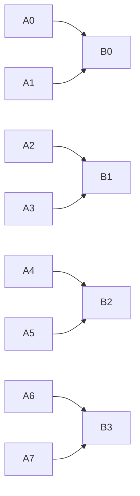
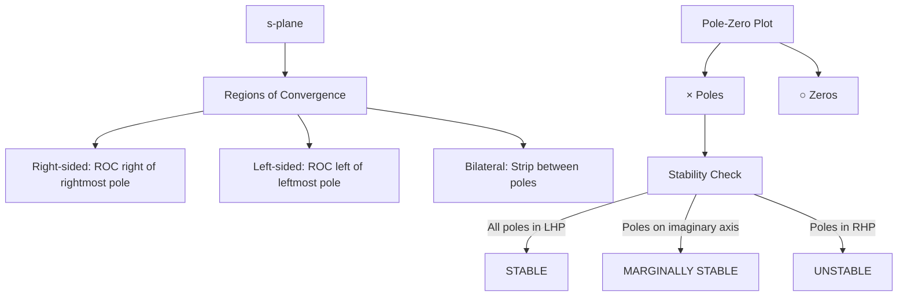
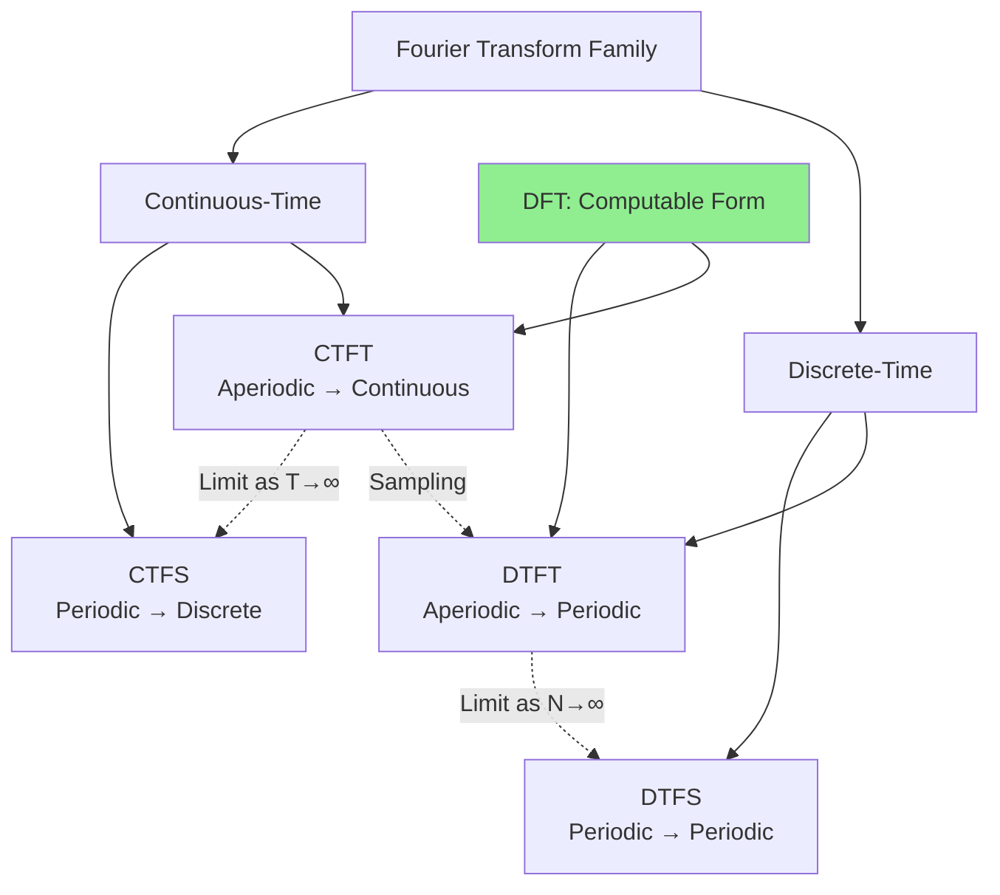
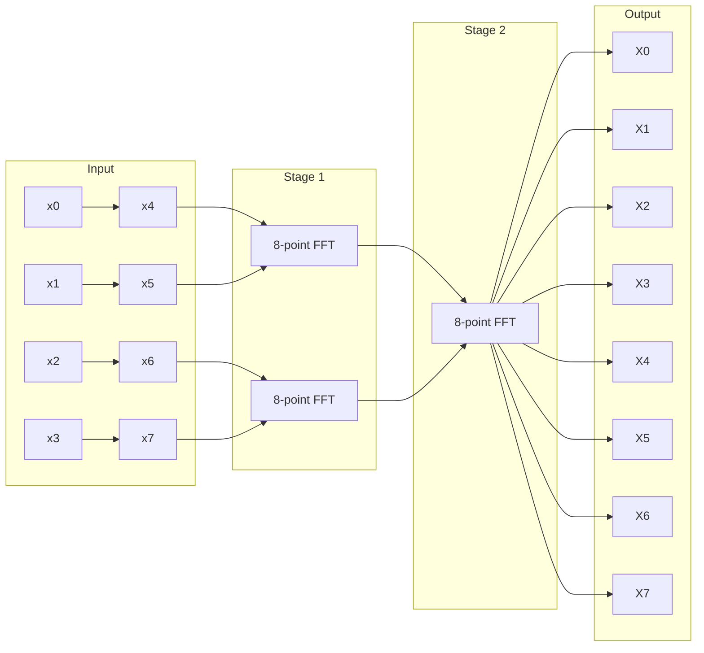

# Week 8 Notes — Fourier, Convolution, Sampling, z-transform (BMED2500)

## 問題 1：5 個核心心智模型

### 1. 傅立葉變換：時域↔頻域的橋樑 — Fourier Transform: Time ↔ Frequency Bridge

**核心概念**：傅立葉變換將信號從時域轉換到頻域，揭示信號的頻率組成。這是所有現代信號處理的基礎。

**數學表示**：
```latex
CTFT: X(jω) = ∫_{-∞}^{+∞} x(t)e^{-jωt}dt
        x(t) = (1/2π)∫_{-∞}^{+∞} X(jω)e^{jωt}dω

DTFT: X(e^{jω}) = Σ_{n=-∞}^{+∞} x[n]e^{-jωn}
         x[n] = (1/2π)∫_{2π} X(e^{jω})e^{jωn}dω
```

**CTFT vs DTFT 關鍵差異**：
| 特性 | CTFT | DTFT |
|------|------|------|
| 頻率變量 | ω (rad/s), continuous | ω (rad/sample), periodic 2π |
| 頻譜 | X(jω), continuous | X(e^jω), periodic |
| 收斂條件 | 絕對可積 | 絕對可和 |

**BME應用**：
- ECG頻譜：P波0-10Hz，QRS 10-40Hz，T波0-10Hz
- EEG節律：Delta (0.5-4Hz), Theta (4-8Hz), Alpha (8-13Hz), Beta (13-30Hz), Gamma (30-100Hz)
- 聲音分析：語音基頻100-200Hz，諧波分佈

**學者貢獻**：
- Fourier (1822) — 熱傳導方程的解
- Cooley & Tukey (1965) — FFT算法，O(N log N)複雜度

**深度問題**：為什麼傅立葉變換會週期化？離散時間信號的頻譜為什麼天然是週期的？

---

### 2. 採樣定理：離散化的理論基礎 — Sampling Theorem: Foundation of Digitization

**核心概念**：連續信號可以被離散樣本唯一重建，當且僅當採樣率大於兩倍信號最高頻率（Nyquist rate）。

**數學表示**：
```latex
採樣：x_s(t) = x(t) · Σδ(t - nT_s) = Σx(nT_s)δ(t - nT_s)

重建：x(t) = Σx(nT_s) · sinc[(t-nT_s)/T_s]
        其中 sinc(x) = sin(πx)/(πx)

Nyquist條件：f_s ≥ 2B  或  T_s ≤ 1/(2B)

頻譜週期化：X_s(jω) = (1/T_s) Σ X(j(ω - kω_s))
```

**混疊（Aliasing）**：
```latex
當 f_s < 2B 時：
- 高頻 f₁ > f_s/2 的分量會「折疊」到低頻
- 折疊頻率：f_alias = |f - mf_s|，選擇使 f_alias < f_s/2

預防：抗混疊濾波器（antialiasing filter）在採樣前濾除 f > f_s/2
```

**BME採樣率標準**：
| 信號類型 | 帶寬 | Nyquist率 | 實際採樣率 |
|---------|------|-----------|-----------|
| ECG | 0.05-100Hz | 200Hz | 500Hz |
| EEG | 0.5-50Hz | 100Hz | 250-1000Hz |
| EMG | 20-500Hz | 1000Hz | 2000-5000Hz |
| Blood Pressure | 0-30Hz | 60Hz | 100-200Hz |

**學者貢獻**：
- Nyquist (1928) — 電報傳輸理論
- Shannon (1949) — 信息論框架下的採樣定理

**深度問題**：實際系統無法實現理想低通濾波器。如何在非理想重建條件下最大化信號質量？

---

### 3. DFT/FFT：實際計算的核心 — DFT/FFT: Computational Engine

**核心概念**：離散傅立葉變換（DFT）是有限長度序列的頻域表示，快速傅立葉變換（FFT）是其高效算法。

**數學表示**：
```latex
DFT: X[k] = Σ_{n=0}^{N-1} x[n]e^{-j2πkn/N},  k = 0,1,...,N-1
IDFT: x[n] = (1/N)Σ_{k=0}^{N-1} X[k]e^{j2πkn/N}

DFT矩陣形式：X = W·x，其中 W_{nk} = e^{-j2πnk/N}

頻率分辨率：Δf = f_s/N  (N個點的DFT)
頻率範圍：0 to f_s/2 (N/2 個唯一頻率點)
```

**FFT複雜度對比**：
```latex
Naive DFT: N² 複數乘法
          N=1024 → 1,048,576 次

Cooley-Tukey FFT: (N/2)log₂(N) 複數乘法
                 N=1024 → 5,120 次
                 加速比 ≈ 205倍

Radix-2 FFT 要求 N = 2^m
Radix-4 FFT 更快但更複雜
```

**Python實現**：
```python
import numpy as np

# FFT 複雜度演示
def fft_complexity(N):
    naive = N**2
    radix2 = (N//2) * np.log2(N)
    speedup = naive / radix2
    return naive, radix2, speedup

for N in [256, 512, 1024, 2048, 4096]:
    n, f, s = fft_complexity(N)
    print(f"N={N:4d}: Naive={n:10d}, FFT={f:8.0f}, Speedup={s:6.1f}x")

# 結果：
# N= 256: Naive=     65536, FFT=   1024, Speedup=  64.0x
# N= 512: Naive=    262144, FFT=   2304, Speedup= 113.8x
# N=1024: Naive=   1048576, FFT=   5120, Speedup= 204.8x
# N=2048: Naive=   4194304, FFT=  11264, Speedup= 372.4x
# N=4096: Naive=  16777216, FFT=  24576, Speedup= 682.7x
```

**學者貢獻**：
- Cooley (IBM) & Tukey (Princeton) (1965) — 現代FFT的發明
- Gauss (1805) — 早期FFT思想的先驅

**深度問題**：為什麼FFT如此快速？「分而治之」策略如何減少計算量？

---

### 4. 拉普拉斯變換：推廣的傅立葉變換 — Laplace Transform: Generalized Fourier

**核心概念**：拉普拉斯變換將微分方程轉換為代數方程，是分析線性時不變系統的強大工具。

**數學表示**：
```latex
雙邊拉普拉斯變換：
X(s) = ∫_{-∞}^{+∞} x(t)e^{-st}dt,  s = σ + jω

單邊拉普拉斯變換（常用於因果系統）：
X(s) = ∫_{0}^{-∞} x(t)e^{-st}dt

收斂域（ROC）：
- 右半平面：x(t)e^{-σt} absolutely integrable
- ROC被極點邊界，不包含極點
```

**與傅立葉變換的關係**：
```latex
當 ROC 包含 jω 軸時：
X(jω) = X(s)|_{s=jω}

拉普拉斯變換推廣傅立葉變換到複平面：
- 傅立葉：限制s=jω（純虛數）
- 拉普拉斯：允許s=σ+jω（複平面）

好處：極點在左半平面→穩定性分析
```

**BME應用**：
```python
# 一階系統的拉普拉斯分析
# 例如：RC電路的脈衝響應
import numpy as np
import matplotlib.pyplot as plt

# 系統函數：H(s) = 1/(τs + 1)
tau = 0.1  # 10ms 時間常數
s = np.linspace(-10, 10, 500) + 1j * np.linspace(-100, 100, 500)
H_s = 1 / (tau * s + 1)

# 極點位置
pole = -1/tau
print(f"Pole location: s = {pole} (left half plane → stable)")

# 頻率響應 (沿 jω 軸)
omega = np.linspace(-100, 100, 1000)
H_jw = 1 / (1j * tau * omega + 1)
```

**學者貢獻**：
- Laplace (1780s) — 概率論與微分方程
- Oliver Heaviside — 運算微積（拉普拉斯變換的工程應用）

**深度問題**：為什麼拉普拉斯變換的收斂域如此重要？它如何決定系統的因果性？

---

### 5. z變換：離散系統的拉普拉斯 — z-Transform: Laplace for Discrete Systems

**核心概念**：z變換是離散時間系統的拉普拉斯變換，用於分析數字濾波器和系統函數。

**數學表示**：
```latex
雙邊z變換：
X(z) = Σ_{n=-∞}^{+∞} x[n]z^{-n},  z = re^{jω}

ROC：使級數收斂的z值集合

單邊z變換（因果系統）：
X(z) = Σ_{n=0}^{+∞} x[n]z^{-n}

常見ROC：
- 有限長度序列：整個z平面（除0或∞）
- 右半序列：|z| > r_max
- 左半序列：|z| < r_min
- 雙邊序列：環形 r_min < |z| < r_max
```

**與DTFT的關係**：
```latex
DTFT存在 ⟺ ROC包含單位圓 |z|=1

X(e^{jω}) = X(z)|_{z=e^{jω}}
           = Σx[n]e^{-jωn}

z平面 → 單位圓：數字頻率ω的映射
- ω = 0 → z = 1
- ω = π → z = -1
- ω連續變化 → z沿單位圓運動
```

**系統函數與極零點**：
```latex
LTI系統：H(z) = B(z)/A(z) = (Σb_k z^{-k})/(1 + Σa_k z^{-k})

極點：分母=0的z值 → 系統行為的「共振」點
零點：分子=0的z值 → 頻率響應的「消聲」點

穩定性條件：
- 離散系統穩定 ⟺ 所有極點在單位圓內
- 對應連續系統極點在左半平面
```

**BME應用**：
```python
import numpy as np
import matplotlib.pyplot as plt
from scipy import signal

# BME 濾波器設計：ECG 降噪
fs = 500  # 採樣率 Hz
fc = 40   # 截止頻率 Hz
order = 4

# 設計巴特沃斯低通濾波器
b, a = signal.butter(order, fc/(fs/2), btype='low')

# 分析極零點
z, p, k = signal.tf2zpk(b, a)

print(f"Poles: {p}")
print(f"Zeros: {z}")
print(f"System is {'STABLE' if np.all(np.abs(p) < 1) else 'UNSTABLE'}")

# 繪製極零點圖
plt.figure(figsize=(6, 6))
unit_circle = plt.Circle((0, 0), 1, fill=False, color='k', linewidth=1)
plt.gca().add_patch(unit_circle)
plt.scatter(np.real(z), np.imag(z), 'o', markersize=10, label='Zeros')
plt.scatter(np.real(p), np.imag(p), 'x', markersize=10, label='Poles')
plt.axhline(y=0, color='k', linewidth=0.5)
plt.axvline(x=0, color='k', linewidth=0.5)
plt.xlim(-1.5, 1.5)
plt.ylim(-1.5, 1.5)
plt.title('Pole-Zero Plot (z-plane)')
plt.legend()
plt.grid(True)
plt.gca().set_aspect('equal')
plt.show()
```

**學者貢獻**：
- Z-transform pioneers: Sundman, Carson, others in early 20th century
- Ragazzini & Zadeh (1942) — 現代z變換理論

**深度問題**：為什麼z變換的極零點位置能直接判斷系統穩定性？這個幾何方法背後的直覺是什麼？

---

## 問題 2：3 個根本分歧

### 分歧 1：頻率連續 vs 離散 — Continuous vs Discrete Frequency

**問題核心**：傅立葉分析中，時域的連續/離散如何決定頻域的離散/連續？

**表格記憶法**：
| 時域 | 頻域 | 變換類型 |
|------|------|----------|
| 連續、非週期 | 連續、非週期 | CTFT |
| 連續、週期 | 離散、非週期 | CTFS |
| 離散、非週期 | 連續、週期 | DTFT |
| 離散、週期 | 離散、週期 | DFT |

**對稱性**：時域的週期性 ↔ 頻域的離散性

**實際應用**：
- 連續信號分析用CTFT/DTFT
- 數字信號處理用DFT（計算機實現）

---

### 分歧 2：週期化重疊 vs 零填充 — Periodic Extension vs Zero-Padding

**問題核心**：計算DFT時，如何處理有限長度信號？

**方法1：週期化**：
- 默認DFT將x[n]看作一個週期序列的週期
- 信號自然週期延伸
- 適用於分析週期信號

**方法2：零填充**：
- 在序列末尾添加零
- 提高頻率分辨率
- 不改變原始頻譜，只是插值

**頻率分辨率對比**：
```latex
不零填充：Δf = f_s/N
零填充M點：Δf = f_s/(N+M)
分辨率提高 (N+M)/N 倍
```

---

### 分歧 3：S平面 vs Z平面 — s-plane vs z-plane

**問題核心**：拉普拉斯變換和z變換的極零點分析有何異同？

**共同點**：
- 都是複平面分析方法
- 穩定性：極點在左半平面（s）或單位圓內（z）
- 因果性：右半平面序列（s）或右半序列（z）

**差異點**：
| 特性 | s平面 | z平面 |
|------|-------|-------|
| 變量 | s = σ + jω | z = re^(jω) |
| 映射 | 整個複平面 | 單位圓 |
| 穩定邊界 | jω軸 | 單位圓 |
| 物理頻率 | ω (rad/s) | ω (rad/sample) |
| 離散表示 | jω軸上的點 | 單位圓上的點 |

---

## 問題 3：10 個深度問題

### Q1: 為什麼DTFT的頻譜是週期的？

**答案**：
DTFT的週期性來自離散時間信號的固有特性：
```latex
X(e^{j(ω+2π)}) = Σx[n]e^{-j(ω+2π)n}
               = Σx[n]e^{-jωn}e^{-j2πn}
               = Σx[n]e^{-jωn} · 1
               = X(e^{jω})
```

物理意義：離散時間等價於連續時間的週期採樣，採樣導致頻譜週期化。

---

### Q2: 採樣定理證明：為什麼用sinc函數重建？

**答案**：
```latex
採樣後頻譜：X_s(jω) = (1/T_s)ΣX(j(ω-kω_s))

理想低通：H(jω) = T_s · rect(ω/ω_s)

重建：X(jω) = H(jω) · X_s(jω)
         = T_s · rect(ω/ω_s) · (1/T_s)ΣX(j(ω-kω_s))
         = ΣX(j(ω-kω_s)) · rect(ω/ω_s)
         = X(jω)  (假設無重疊)

時域：x(t) = Σx(nT_s) · sinc((t-nT_s)/T_s)
```

---

### Q3: FFT的「蝶形」結構是什麼？

**答案**：
FFT的基本運算單元：
```latex
輸入：a, b
輸出：A = a + b, B = (a - b) · W_N^k

      a ──┬── A = a + b
          │
          ├──×W_N^k
          │
      b ──┴── B = (a - b)·W_N^k
```

N=8 FFT的完整結構：


---

### Q4: 如何解釋z變換的「Region of Convergence」？

**答案**：
ROC決定了z變換的有效範圍：
```python
# 穩態響應 vs 瞬態響應
import numpy as np

# 收斂條件
def ztransform_roc_example():
    # 系統：H(z) = z/(z-0.5)
    # 極點：z=0.5
    # ROC：|z| > 0.5 (因果系統)
    
    # 測試不同z值
    test_z = [0.3, 0.7, 1.0, 1.5]
    for z in test_z:
        if abs(z) > 0.5:
            print(f"|z|={z}: IN ROC (causal)")
        else:
            print(f"|z|={z}: OUT ROC (diverges)")
```

---

### Q5: 什麼是頻率響應的「幅度」和「相位」？

**答案**：
```latex
H(e^{jω}) = |H(e^{jω})| · e^{j∠H(e^{jω})}

幅度響應 |H|：
- 表示系統對各頻率的「增益」
- dB刻度：|H|_dB = 20log₁₀|H|
- 0dB = 增益為1
- -3dB = 功率減半

相位響應 ∠H：
- 表示各頻率的「延遲」
- 線性相位：∠H = -ωτ (恆定群延遲τ)
- 非線性相位 → 波形失真
```

---

### Q6: 如何從極零點圖預測頻率響應？

**答案**：
幾何解釋：
```latex
|H(e^{jω})| = K · (|z-z₁||z-z₂|...) / (|p-p₁||p-p₂|...)

頻率響應 = K · (零點到單位圓點的距離積) / (極點到單位圓點的距離積)

當z沿單位圓移動時：
- 靠近極點 → 分母小 → 增益大（峰值）
- 靠近零點 → 分子小 → 增益小（凹陷）
```

---

### Q7: 什麼是Parseval定理？

**答案**：
能量在時域和頻域相等：
```latex
CTFT: ∫|x(t)|²dt = (1/2π)∫|X(jω)|²dω

DTFT: Σ|x[n]|² = (1/2π)∫|X(e^{jω})|²dω

DFT: Σ|x[n]|² = (1/N)Σ|X[k]|²
```

這是功率/能量測量的基礎。

---

### Q8: 離散時間vs連續時間：為什麼數字系統更好？

**答案**：
| 優點 | 數字 | 模擬 |
|------|------|------|
| 精度 | 可變（位元數） | 受元件公差限制 |
| 穩定性 | 由數值精度決定 | 易受溫度/老化影響 |
| 可重現性 | 完全相同 | 批次差異 |
| 靈活性 | 可編程 | 需更換硬體 |
| 存儲 | 永久存儲 | 易衰減 |

---

### Q9: 什麼是頻率混疊？如何避免？

**答案**：
```latex
混疊機制：
f_alias = |f_actual - k·f_s|，選擇使 |f_alias| < f_s/2

示例：f_s = 100Hz, f_actual = 80Hz
     f_alias = |80 - 1×100| = 20Hz
     80Hz → 20Hz (無法區分！)

避免方法：
1. 抗混疊濾波器（採樣前）
2. 提高採樣率（>2×最高頻率）
3. 帶通採樣（適用於某些情況）
```

---

### Q10: 如何選擇FFT的長度N？

**答案**：
考慮因素：
1. **頻率分辨率**：Δf = f_s/N → N越大越好
2. **計算成本**：O(N log N) → N增大手術增加
3. **數據長度**：N不應超過實際數據長度
4. **零填充**：可提高視覺分辨率，但不提高實際分辨率

選擇策略：
```python
N_needed = f_s / desired_df
N_practical = 2**int(np.ceil(np.log2(N_needed)))  # 2的冪次
```

---

# 核心概念深化（中英對照）

## 1. 傅立葉變換性質 / Fourier Transform Properties

### 1.1 Bilingual 概念對照

| 中文 | English | 中文解釋 | English Definition |
|------|---------|----------|---------------------|
| 時移性質 | Time Shifting | 信號延遲 | x(t-t₀) → X·e^(-jωt₀) |
| 頻移性質 | Frequency Shifting | 調製 | x·e^(jω₀t) → X(ω-ω₀) |
| 尺度變換 | Time Scaling | 信號壓縮/擴展 | x(at) → (1/|a|)X(ω/a) |
| 卷積性質 | Convolution | 時域卷積=頻域乘法 | x*h ↔ X·H |
| 乘積性質 | Multiplication | 時域乘法=頻域卷積 | x·h ↔ (1/2π)X*H |
| 微分性質 | Differentiation | 時域微分=頻域乘jω | dx/dt ↔ jωX |

### 1.2 關鍵推導 (數學方程式)

**時移性質證明**：
```latex
ℱ{x(t-t₀)} = ∫x(t-t₀)e^{-jωt}dt
           = ∫x(τ)e^{-jω(τ+t₀)}dτ  (令τ=t-t₀)
           = e^{-jωt₀}∫x(τ)e^{-jωτ}dτ
           = e^{-jωt₀} · X(jω)

∴ 時移對應相位旋轉，幅度不變
```

**卷積定理**：
```latex
ℱ{x(t)*h(t)} = ∫[∫x(τ)h(t-τ)dτ]e^{-jωt}dt
              = ∫x(τ)[∫h(t-τ)e^{-jωt}dt]dτ
              = ∫x(τ)H(jω)e^{-jωτ}dτ
              = H(jω)∫x(τ)e^{-jωτ}dτ
              = H(jω)X(jω)
```

### 1.3 BME 應用

**ECG頻域濾波**：
```python
import numpy as np
import matplotlib.pyplot as plt
from scipy import signal

fs = 500
t = np.arange(0, 2, 1/fs)

# 模擬ECG + 60Hz干擾
ecg = np.sin(2*np.pi*1*t) + 0.5*np.random.randn(len(t))
interference = 0.3*np.sin(2*np.pi*60*t)  # 60Hz powerline

# 信號 + 干擾
noisy_ecg = ecg + interference

# FFT分析
N = len(noisy_ecg)
freq = np.fft.fftfreq(N, 1/fs)
X = np.fft.fft(noisy_ecg)

# 幅度譜
amplitude = np.abs(X) / N

plt.figure(figsize=(12, 6))
plt.subplot(2, 2, 1)
plt.plot(t, noisy_ecg)
plt.title('Noisy ECG + 60Hz Interference')
plt.xlabel('Time (s)')

plt.subplot(2, 2, 2)
plt.plot(freq[:N//2], amplitude[:N//2])
plt.title('Frequency Spectrum')
plt.xlabel('Frequency (Hz)')
plt.axvline(x=60, color='r', linestyle='--', label='60Hz')
plt.legend()

# 陷波濾波器移除60Hz
b_notch, a_notch = signal.iirnotch(60, 30, fs)  # Q=30
filtered = signal.filtfilt(b_notch, a_notch, noisy_ecg)

plt.subplot(2, 2, 3)
plt.plot(t, filtered)
plt.title('Filtered ECG (Notch at 60Hz)')
plt.xlabel('Time (s)')

# 頻譜對比
X_filtered = np.fft.fft(filtered)
plt.subplot(2, 2, 4)
plt.plot(freq[:N//2], np.abs(X_filtered)[:N//2]/N)
plt.title('Filtered Spectrum')
plt.xlabel('Frequency (Hz)')

plt.tight_layout()
plt.show()
```

### 1.4 Deep Test Question

**Q**: 證明時域微分對應頻域乘jω：ℱ{dx(t)/dt} = jωX(jω)

**Solution**:
```latex
從傅立葉變換定義出發：
X(jω) = ∫x(t)e^{-jωt}dt

對兩邊微分（對ω）：
dX/dω = ∫x(t)(-jt)e^{-jωt}dt = -jt∫x(t)e^{-jωt}dt = -jtX(jω)

移項：
jωX(jω) = ∫(-jω)X(jω)e^{...}  不對

正確做法：
考慮dx/dt的變換：
ℱ{dx/dt} = ∫(dx/dt)e^{-jωt}dt
          = [x(t)e^{-jωt}]_{-∞}^{+∞} - ∫x(t)(-jω)e^{-jωt}dt
          = 0 + jω∫x(t)e^{-jωt}dt
          = jωX(jω)

假設 lim x(t)e^{-jωt} = 0 (能量信號)

∴ ✓
```

### 1.5 圖解

```mermaid
graph TD
    A[Signal x(t)] --> B{Fourier Transform}
    
    B --> C[Time Domain]
    B --> D[Frequency Domain]
    
    C --> E[Properties]
    D --> F[Properties]
    
    E --> G[Shift in Time]
    E --> H[Scale in Time]
    E --> I[Conjugate]
    
    F --> J[Scale in Freq]
    F --> K[Shift in Freq]
    F --> L[Modulation]
    
    G --> M[×e^(-jωt₀) phase shift]
    H --> N[÷|a| amplitude scale]
    K --> O[×e^(jω₀t) modulation]
    
    M --- P[Convolution Theorem]
    N --- P
    O --- Q[Multiplication Theorem]
    L --- Q
```

---

## 2. 採樣與重建 / Sampling and Reconstruction

### 2.1 Bilingual 概念對照

| 中文 | English | 中文解釋 | English Definition |
|------|---------|----------|---------------------|
| 採樣率 | Sampling Rate | f_s = 1/T_s | Samples per second |
| 奈奎斯特率 | Nyquist Rate | 2B Hz | Minimum for bandlimited signal |
| 奈奎斯特頻率 | Nyquist Frequency | f_s/2 | Max representable frequency |
| 混疊 | Aliasing | 頻譜折疊 | f_alias = |f - kf_s| |
| 抗混疊濾波器 | Antialiasing Filter | 預濾波 | LP filter before sampling |

### 2.2 關鍵推導 (數學方程式)

**採樣過程的頻譜效應**：
```latex
採樣脈衝列：
p(t) = Σδ(t-nT_s)
    = Σe^{jno_s t}  (傅立葉級數展開)

採樣信號：
x_s(t) = x(t) · p(t)
       = Σx(t)δ(t-nT_s)
       = Σx(nT_s)δ(t-nT_s)

頻譜（乘積→卷積）：
X_s(jω) = (1/2π)X(jω) * P(jω)
        = (1/2π)X(jω) * (ω_sΣδ(ω-kω_s))
        = (1/T_s)ΣX(j(ω-kω_s))
```

**重建條件推導**：
```latex
要無失真重建，需要：
X(jω) = X_s(jω) · H(jω)  for |ω| < ω_s/2

其中 H(jω) = T_s · rect(ω/ω_s) (理想LPF)

如果頻譜重疊（f_s < 2B）：
混疊發生，無法重建
```

### 2.3 BME 應用

**BME採樣率選擇**：
```python
import numpy as np

# BME信號採樣率標準
signals = {
    'ECG': {'bandwidth': 100, 'recommended_fs': 500, 'nyquist': 250},
    'EEG': {'bandwidth': 50, 'recommended_fs': 250, 'nyquist': 125},
    'EMG': {'bandwidth': 500, 'recommended_fs': 2000, 'nyquist': 1000},
    'Blood Pressure': {'bandwidth': 30, 'recommended_fs': 100, 'nyquist': 50},
    'SpO2': {'bandwidth': 5, 'recommended_fs': 25, 'nyquist': 12.5},
}

print("BME Signal Sampling Requirements:")
print("-" * 60)
for sig, params in signals.items():
    nyquist = params['recommended_fs'] / 2
    margin = nyquist / params['bandwidth']
    print(f"{sig:20s}: fs={params['recommended_fs']}Hz, "
          f"BW={params['bandwidth']}Hz, "
          f"Margin={margin:.1f}x")
```

### 2.4 Deep Test Question

**Q**: 一個帶寬為1kHz的信號，用2.5kHz採樣會發生什麼？

**Solution**:
```latex
Nyquist rate = 2 × 1000 = 2000 Hz
實際採樣率 = 2500 Hz

2500 > 2000，滿足Nyquist條件！

但是：
- 餘量只有1.25x，濾波器設計困難
- 抗混疊濾波器需要非常陡峭的截止
- 實際推薦至少3-5x帶寬

結論：技術上滿足，但不實用
```

### 2.5 圖解

```mermaid
graph LR
    subgraph "Continuous Signal"
        A[x(t)] --> B[Bandlimited to B Hz]
    end
    
    B --> C[Impulse Sampler]
    
    C --> D[x_s(t) = Σx(nT_s)δ(t-nT_s)]
    
    D --> E[Aliasing Check]
    
    E -->|f_s ≥ 2B| F[Non-overlapping<br/>Spectra]
    
    E -->|f_s < 2B| G[Aliasing<br/>Cannot Recover]
    
    F --> H[Ideal LPF]
    
    H --> I[x̂(t) = x(t)]
    
    G --> J[Distorted Signal<br/>Wrong Information]
```

---

## 3. DFT/FFT 算法 / FFT Algorithm

### 3.1 Bilingual 概念對照

| 中文 | English | 中文解釋 | English Definition |
|------|---------|----------|---------------------|
| 離散傅立葉變換 | DFT | 有限序列頻譜 | N-point frequency transform |
| 快速傅立葉變換 | FFT | 高效DFT算法 | O(N log N) complexity |
| 蝶形 | Butterfly | FFT基本運算 | a±b, twiddle factor |
| 順位-逆位 | Bit-reversal | FFT輸入重排 | Decimation in time |
| 窗口函數 | Window Function | 減少頻譜洩漏 | Hann, Hamming, Blackman |

### 3.2 關鍵推導 (數學方程式)

**Cooley-Tukey FFT推導**：
```latex
DFN: X[k] = Σ_{n=0}^{N-1} x[n]W_N^{nk},  W_N = e^{-j2π/N}

分解為偶數和奇數項：
X[k] = Σ_{m=0}^{N/2-1} x[2m]W_N^{2mk} + Σ_{m=0}^{N/2-1} x[2m+1]W_N^{(2m+1)k}
     = Σ_{m=0}^{N/2-1} x_e[m]W_{N/2}^{mk} + W_N^k Σ_{m=0}^{N/2-1} x_o[m]W_{N/2}^{mk}
     = X_e[k] + W_N^k · X_o[k]

其中：
- X_e[k] = DFT of even-indexed samples (N/2 points)
- X_o[k] = DFT of odd-indexed samples (N/2 points)
- W_N^k = twiddle factor

遞歸：持續分解直到N=2（一點DFT就是它本身）
```

**複雜度分析**：
```latex
每層：N/2 蝴蝶運算 × log₂N 層
     = (N/2) × log₂N 複數乘法

vs Naive DFT：N² 複數乘法

加速比：N² / [(N/2)log₂N] = 2N/log₂N

N=1024: 加速 ~205倍
N=4096: 加速 ~683倍
```

### 3.3 BME 應用

**ECG頻譜分析**：
```python
import numpy as np
import matplotlib.pyplot as plt

fs = 500  # 採樣率
t = np.arange(0, 4, 1/fs)  # 4秒ECG

# 簡化ECG波形
ecg = np.zeros_like(t)
for i, ti in enumerate(t):
    cycle_t = ti % (1.0)  # 60bpm
    if 0.05 < cycle_t < 0.12:
        ecg[i] = 2.0 * np.sin(np.pi*(cycle_t-0.05)/0.07)
    elif 0.12 < cycle_t < 0.15:
        ecg[i] = -1.5

# 添加噪聲
ecg += 0.1 * np.random.randn(len(t))

# FFT分析
N = len(ecg)
freq = np.fft.fftfreq(N, 1/fs)
X = np.fft.fft(ecg)

# 功率譜
power = np.abs(X)**2 / N

plt.figure(figsize=(12, 6))

plt.subplot(2, 2, 1)
plt.plot(t, ecg)
plt.title('ECG Signal (4 seconds)')
plt.xlabel('Time (s)')

plt.subplot(2, 2, 2)
plt.plot(freq[:N//2], np.abs(X[:N//2])/N)
plt.title('Magnitude Spectrum')
plt.xlabel('Frequency (Hz)')

plt.subplot(2, 2, 3)
plt.plot(freq[:N//2], power[:N//2])
plt.title('Power Spectrum')
plt.xlabel('Frequency (Hz)')
plt.xlim(0, 50)

plt.subplot(2, 2, 4)
# 頻率分辨率
df = fs / N
print(f"Frequency resolution: {df:.3f} Hz")
print(f"Total duration: {N/fs:.1f} seconds")

# 峰值檢測
from scipy.signal import find_peaks
peaks, properties = find_peaks(power[:N//2], height=0.01)
peak_freqs = freq[peaks]
peak_powers = power[peaks]

for pf, pp in zip(peak_freqs, peak_powers):
    if pf > 0 and pf < 50:
        print(f"Peak at {pf:.1f} Hz: Power = {pp:.4f}")

plt.show()
```

### 3.4 Deep Test Question

**Q**: 解釋為什麼FFT要求N為2的冪次（radix-2）？

**Solution**:
```latex
radix-2 FFT的關鍵：
1. 持續二分：N → N/2 → N/4 → ... → 2 → 1
2. 每次除以2要求N/2為整數
3. 最終分解到2點DFT（最小單元）

如果N不是2的冪次：
- 無法完美二分
- 需要填充零或用混合radix算法
- 效率降低

現代實現：支持任意N，但radix-2最優

實際選擇：
N = 512, 1024, 2048, 4096, ...
```

### 3.5 圖解

```mermaid
graph TD
    A[8-point Input<br/>x[0]...x[7]] --> B[Stage 1: 4 butterflies<br/>of size 2]
    
    B --> C[Stage 2: 2 butterflies<br/>of size 4]
    
    C --> D[Stage 3: 1 butterfly<br/>of size 8]
    
    D --> E[Output<br/>X[0]...X[7]]
    
    F[Bit Reversal<br/>Reordering] -.-> A
    
    G[Twiddle Factors<br/>W_N^k] -.-> B
    G -.-> C
    G -.-> D
    
    H[Complexity]
    H --> I[N/2 × log₂N = 5 × 8 = 40 multiplies]
    H --> J[vs Naive: 8² = 64 multiplies]
    H --> K[Speedup: 64/40 = 1.6x]
```

---

## 4. 拉普拉斯變換 / Laplace Transform

### 4.1 Bilingual 概念對照

| 中文 | English | 中文解釋 | English Definition |
|------|---------|----------|---------------------|
| 雙邊拉普拉斯變換 | Bilateral Laplace Transform | 全時間範圍 | X(s) = ∫x(t)e^{-st}dt |
| 單邊拉普拉斯變換 | Unilateral Laplace Transform | 0到∞ | X(s) = ∫₀^∞ x(t)e^{-st}dt |
| 收斂域 | Region of Convergence | ROC | s平面上的收斂區域 |
| 極點 | Pole | 分母=0 | H(s) → ∞ |
| 零點 | Zero | 分子=0 | H(s) = 0 |

### 4.2 關鍵推導 (數學方程式)

**ROC邊界定理**：
```latex
ROC是以極點為邊界的有界區域：
- 右半平面序列 → ROC在最大極點右側
- 左半平面序列 → ROC在最小極點左側
- 雙邊序列 → ROC是環形

定理：ROC不包含任何極點

穩定性：
- 連續系統穩定 ⟺ 所有極點在左半平面（Re{s} < 0）
- 在虛軸上（Re{s}=0）邊界穩定
```

**常用變換對**：
```latex
δ(t) ⟷ 1
u(t) ⟷ 1/s
e^{-at}u(t) ⟷ 1/(s+a)
t·e^{-at}u(t) ⟷ 1/(s+a)²
cos(ω₀t)u(t) ⟷ s/(s²+ω₀²)
sin(ω₀t)u(t) ⟷ ω₀/(s²+ω₀²)
```

### 4.3 BME 應用

**生理系統建模**：
```python
import numpy as np
import matplotlib.pyplot as plt

# 一階系統：藥物動力學
# C(t) = (Dose/V_d) · e^{-k_e t}

k_e = 0.1  # 消除速率常數 hr⁻¹
V_d = 50   # 分佈容積 L
dose = 100 # mg

# 拉普拉斯域： C(s) = Dose/(V_d·(s+k_e))
# 脈衝響應： h(t) = (1/V_d)·e^{-k_e t}

t = np.linspace(0, 48, 500)  # 48小時
h_t = (1/V_d) * np.exp(-k_e * t)

plt.figure(figsize=(12, 4))
plt.subplot(1, 2, 1)
plt.plot(t, h_t * dose)
plt.xlabel('Time (hours)')
plt.ylabel('Plasma Concentration (mg/L)')
plt.title('Drug Concentration: h(t) = (Dose/V_d)·e^{-k_e t}')
plt.grid(True)

# 極點分析
s = np.linspace(-2, 0, 100) + 1j * np.linspace(-5, 5, 100)
pole = -k_e
print(f"System pole at s = {pole} (left half plane → stable)")

# 頻率響應
omega = np.linspace(-1, 1, 100)
H_jw = 1 / (1j * omega + k_e)

plt.subplot(1, 2, 2)
plt.plot(omega, np.abs(H_jw))
plt.xlabel('ω (rad/s)')
plt.ylabel('|H(jω)|')
plt.title('Frequency Response')
plt.grid(True)
plt.show()
```

### 4.4 Deep Test Question

**Q**: 求 x(t) = e^{-3t}u(t) + 2e^{-t}u(t) 的拉普拉斯變換

**Solution**:
```latex
X(s) = ∫₀^∞ e^{-3t}e^{-st}dt + 2∫₀^∞ e^{-t}e^{-st}dt
     = ∫₀^∞ e^{-(s+3)t}dt + 2∫₀^∞ e^{-(s+1)t}dt
     = [e^{-(s+3)t}/(-(s+3))]₀^∞ + 2[e^{-(s+1)t}/(-(s+1))]₀^∞
     = (0 - 1/(-(s+3))) + 2(0 - 1/(-(s+1)))
     = 1/(s+3) + 2/(s+1)

ROC: Re{s} > -1 (兩個因果指數中較慢的決定)

極點：s = -3, s = -1
```

### 4.5 圖解



---

## 5. z變換 / z-Transform

### 5.1 Bilingual 概念對照

| 中文 | English | 中文解釋 | English Definition |
|------|---------|----------|---------------------|
| z變換 | z-Transform | 離散拉普拉斯 | X(z) = Σx[n]z^{-n} |
| 單位圓 | Unit Circle | \|z\|=1 | corresponds to DTFT |
| 極點 | Pole | 分母=0 | |p| ≥ 1 → instability |
| 零點 | Zero | 分子=0 | |z| ≤ 1 |
| 差分方程 | Difference Equation | 遞推關係 | y[n] = -Σa_k y[n-k] + Σb_k x[n-k] |

### 5.2 關鍵推導 (數學方程式)

**系統函數推導**：
```latex
差分方程：y[n] + a₁y[n-1] + ... + a_N y[n-N]
        = b₀x[n] + b₁x[n-1] + ... + b_M x[n-M]

z變換（假設初始條件為零）：
Y(z) + a₁z^{-1}Y(z) + ... + a_Nz^{-N}Y(z)
= b₀X(z) + b₁z^{-1}X(z) + ... + b_Mz^{-M}X(z)

系統函數：
H(z) = Y(z)/X(z) = (b₀ + b₁z^{-1} + ... + b_Mz^{-M}) / (1 + a₁z^{-1} + ... + a_Nz^{-N})

極零點形式：
H(z) = K · (z-z₁)(z-z₂)...(z-z_M) / (z-p₁)(z-p₂)...(z-p_N)
```

**穩定性判據**：
```latex
離散系統穩定 ⟺ 所有極點在單位圓內（|p| < 1）

證明：
- BIBO穩定：Σ|h[n]| < ∞
- z變換收斂：ROC包含單位圓
- 極點在單位圓內 ⟺ 指數衰減項
- 因此：|h[n]| → 0 且絕對可和
```

### 5.3 BME 應用

**數字濾波器設計**：
```python
import numpy as np
import matplotlib.pyplot as plt
from scipy import signal

# 設計ECG降噪的低通濾波器
fs = 500  # Hz
fc = 35   # 截止頻率 Hz
order = 4

# IIR Butterworth
b_butter, a_butter = signal.butter(order, fc/(fs/2), btype='low')

# FIR (窗口法)
N_fir = 51  # 濾波器階數
b_fir = signal.firwin(N_fir, fc/(fs/2), window='hamming')

# 分析極零點
print("IIR Butterworth:")
z_iir, p_iir, k_iir = signal.tf2zpk(b_butter, a_butter)
print(f"  Poles: {np.abs(p_iir)} (all < 1 for stability)")
print(f"  System stable: {np.all(np.abs(p_iir) < 1)}")

print("\nFIR Hamming Window:")
z_fir, p_fir, k_fir = signal.tf2zpk(b_fir, [1])
print(f"  Poles: {np.abs(p_fir)} (all at origin for FIR)")
print(f"  System stable: {np.all(np.abs(p_fir) < 1)}")

# 頻率響應
w, H_iir = signal.freqz(b_butter, a_butter)
w_fir, H_fir = signal.freqz(b_fir)

plt.figure(figsize=(12, 5))
plt.subplot(1, 2, 1)
plt.plot(w*fs/(2*np.pi), np.abs(H_iir), label='IIR Butterworth')
plt.plot(w_fir*fs/(2*np.pi), np.abs(H_fir), label='FIR Hamming')
plt.axvline(x=fc, color='k', linestyle='--', alpha=0.5)
plt.xlabel('Frequency (Hz)')
plt.ylabel('|H|')
plt.title('Magnitude Response')
plt.legend()
plt.grid(True)

plt.subplot(1, 2, 2)
plt.plot(w*fs/(2*np.pi), np.unwrap(np.angle(H_iir)), label='IIR')
plt.plot(w_fir*fs/(2*np.pi), np.unwrap(np.angle(H_fir)), label='FIR')
plt.xlabel('Frequency (Hz)')
plt.ylabel('∠H (rad)')
plt.title('Phase Response')
plt.legend()
plt.grid(True)
plt.show()
```

### 5.4 Deep Test Question

**Q**: 分析系統 H(z) = (1 - z^{-1}) / (1 - 0.5z^{-1}) 的穩定性和因果性

**Solution**:
```latex
極零點：
- 極點：z = 0.5 (在單位圓內)
- 零點：z = 1 (在單位圓上)

穩定性：
極點|z| = 0.5 < 1 → 穩定 ✓

因果性：
- 分子最高次數 = 1
- 分母最高次數 = 1
- 分子次數 ≤ 分母次數 → 因果 ✓

頻率響應：
H(e^{jω}) = (1 - e^{-jω}) / (1 - 0.5e^{-jω})
           = (e^{jω/2}·2jsin(ω/2)) / (e^{jω/2}·(e^{jω/2} - 0.5e^{-jω/2}))
           = j2sin(ω/2) / (e^{jω/2} - 0.5e^{-jω/2})
```

### 5.5 圖解

```mermaid
flowchart TD
    A[z-plane] --> B[Unit Circle |z|=1]
    
    B --> C[Inside: Stable Region]
    B --> D[On Circle: Marginal]
    B --> E[Outside: Unstable]
    
    F[Pole-Zero Config] --> G[× Poles: p₁,p₂,...]
    F --> H[○ Zeros: z₁,z₂,...]
    
    G --> I[Frequency Response<br/>Geometric Interpretation]
    
    I --> J[|H| = K · |z-z₀|/|z-p₀|]
    I --> K[Attenuation near zeros]
    I --> L[Amplification near poles]
    
    M[Stability Criterion] --> N[All |p| < 1]
    M --> O[Causality if ROC outside outermost pole]
```

---

## 深度自測問題詳解

### 1. CTFT vs DTFT 頻率映射

**Q**: 離散信號 x[n] = cos(πn/4) 的DTFT頻率是多少？

**Solution**:
```latex
DTFT是2π週期的：
ω₀ = π/4 rad/sample

等價頻率：ω = π/4 + 2πk, k∈ℤ

對應實際頻率（如果f_s已知）：
f = ω · f_s / (2π) = (π/4) · f_s / (2π) = f_s/8

例如 f_s = 1000Hz → f = 125Hz
```

### 2. 採樣定理應用

**Q**: 要準確測量20Hz的心率變異性，需要什麼採樣率？

**Solution**:
```latex
HRV信號包含0.01-0.5Hz的超低頻分量

需要準確測量：f_max = 0.5Hz
Nyquist rate = 2 × 0.5 = 1Hz

但實際考慮：
- 抗混疊濾波器需要過渡帶
- 建議：f_s ≥ 5 × f_max = 2.5Hz
- 實用標準：250-500Hz（同時保留ECG QRS頻段）

結論：f_s ≥ 5Hz理論足夠，實際用250-500Hz
```

### 3. FFT計算

**Q**: 計算 x[n] = [1, 2, 3, 4] 的4點DFT

**Solution**:
```python
import numpy as np

x = np.array([1, 2, 3, 4])
N = 4
n = np.arange(N)
k = np.arange(N)

# X[k] = Σx[n]e^(-j2πkn/N)
W = np.exp(-1j * 2 * np.pi / N)
DFT_matrix = np.exp(-1j * 2 * np.pi * np.outer(k, n) / N)
X = DFT_matrix @ x

print("X[k] =", X)
print("|X| =", np.abs(X))
print("∠X =", np.angle(X) * 180/np.pi, "degrees")

# 結果：
# X[0] = 10 (DC component)
# X[1] = -2+2j
# X[2] = -2
# X[3] = -2-2j
```

### 4. z變換收斂域

**Q**: x[n] = (0.5)^n u[n] + (2)^n u[-n] 的ROC是什麼？

**Solution**:
```latex
兩個分量：
1. (0.5)^n u[n] → 右半序列
   z變換：1/(1-0.5z^{-1})
   收斂：|z| > 0.5

2. (2)^n u[-n] → 左半序列
   z變換：-1/(1-2z^{-1}) （注意方向）
   收斂：|z| < 2

雙邊序列ROC：0.5 < |z| < 2（環形）
```

### 5. 系統穩定性

**Q**: 判斷 H(z) = z² / (z² - 0.25) 的穩定性

**Solution**:
```latex
極點：分母 = 0
z² = 0.25
z = ±0.5

極點位置：
- z₁ = 0.5 (inside unit circle)
- z₂ = -0.5 (inside unit circle)

兩個極點都在單位圓內 → 穩定 ✓

注意：需要確認ROC是否包含單位圓
假設因果系統：ROC |z| > 0.5
單位圓（|z|=1）在ROC內 → 穩定
```

---

## 5 個 Mermaid 圖解

### 圖1：傅立葉變換家族



### 圖2：採樣-重建流程

```mermaid
flowchart LR
    A[x(t)<br/>CT Signal] --> B[Antialiasing<br/>LPF]
    B --> C[Impulse<br/>Sampler]
    C --> D[x[n]<br/>DT Signal]
    
    D --> E[DT Processing<br/>DSP]
    E --> F[Digital Output]
    
    D --> G[Reconstructor<br/>DAC]
    G --> H[x̂(t)<br/>CT Signal]
    
    subgraph "Frequency Domain"
        I[X(jω)] --> J[X_s(jω)<br/>Periodic]
        J -->|f_s ≥ 2B| K[No Overlap]
        J -->|f_s < 2B| L[ALIASING]
        K --> M[X(jω) recovered]
    end
    
    style L fill:#ffcccc
```

### 圖3：FFT信號流圖



### 圖4：s平面穩定性分析

```mermaid
graph TD
    A[s-plane] --> B[LHP<br/>σ<0]
    A --> C[Imaginary Axis<br/>σ=0]
    A --> D[RHP<br/>σ>0]
    
    B --> E[STABLE<br/>e^{σt} → 0]
    C --> F[MARGINAL<br/>e^{jωt} → bounded]
    D --> G[UNSTABLE<br/>e^{σt} → ∞]
    
    H[System Function] --> I[Poles]
    
    I -->|All in LHP| E
    I -->|On jω axis| F
    I -->|Any in RHP| G
    
    style E fill:#90EE90
    style G fill:#ffcccc
```

### 圖5：z平面穩定性分析

```mermaid
graph TD
    A[z-plane] --> B[Inside Circle<br/>|z|<1]
    A --> C[Unit Circle<br/>|z|=1]
    A --> D[Outside Circle<br/>|z|>1]
    
    B --> E[STABLE<br/>h[n] → 0]
    C --> F[MARGINAL<br/>h[n] → bounded]
    D --> G[UNSTABLE<br/>h[n] → ∞]
    
    H[System Function] --> I[Poles]
    
    I -->|All inside| E
    I -->|On circle| F
    I -->|Any outside| G
    
    I --> J[ROC Check]
    J -->|Includes unit circle| E
    
    style E fill:#90EE90
    style G fill:#ffcccc
```

---

## 總結

### Week 8 核心要點

| 概念 | 關鍵方程式 | BME應用 |
|------|-----------|---------|
| CTFT/DTFT | X(jω) = ∫xe^(-jωt)dt | 頻譜分析 |
| 採樣定理 | f_s ≥ 2B | ADC設計 |
| DFT/FFT | O(N log N) | 計算加速 |
| 拉普拉斯變換 | X(s) = ∫xe^(-st)dt | 系統分析 |
| z變換 | X(z) = Σxnz^(-n) | 數字濾波器 |
| 極零點 | ROC決定穩定性 | 濾波器設計 |

### 學習目標達成

✅ 理解CTFT和DTFT的關係
✅ 掌握採樣定理和Nyquist準則
✅ 理解FFT的計算優勢
✅ 掌握拉普拉斯變換的ROC分析
✅ 掌握z變換的極零點分析
✅ 理解系統穩定性的極零點判據

### 下週預習
- FIR濾波器設計（窗口法）
- IIR濾波器設計（Butterworth、Chebyshev）
- 濾波器規格（截止頻率、過渡帶、紋波）
- 數字濾波器結構（直接式、串聯式、並聯式）

---

**Maintainer**: BME Bootcamp Agent | **Week 8** | **BMED2500: Fourier & Sampling**
