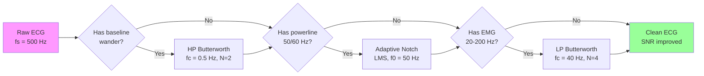
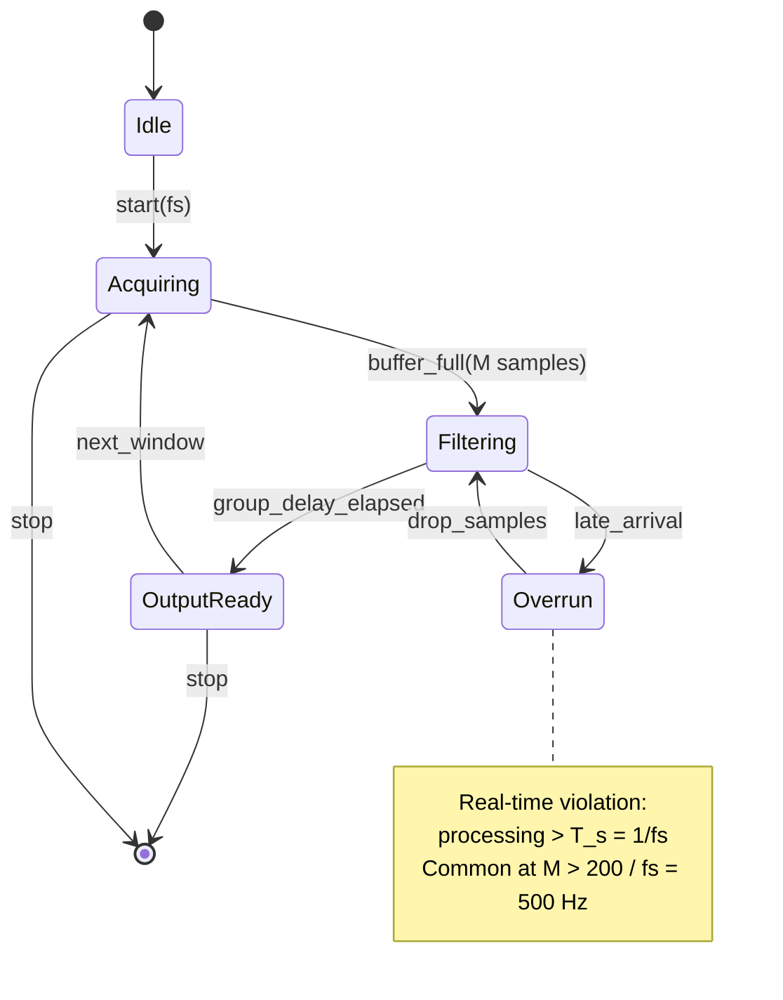
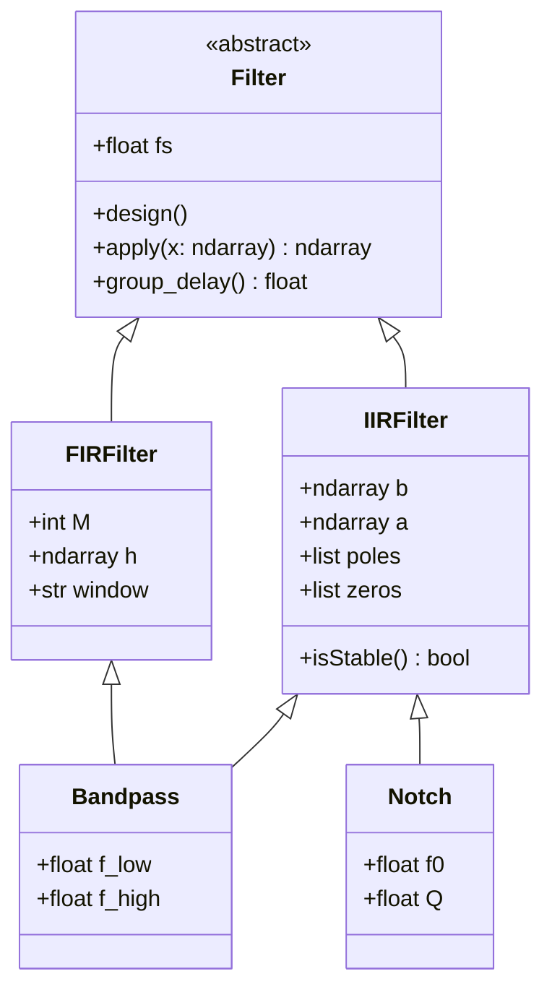
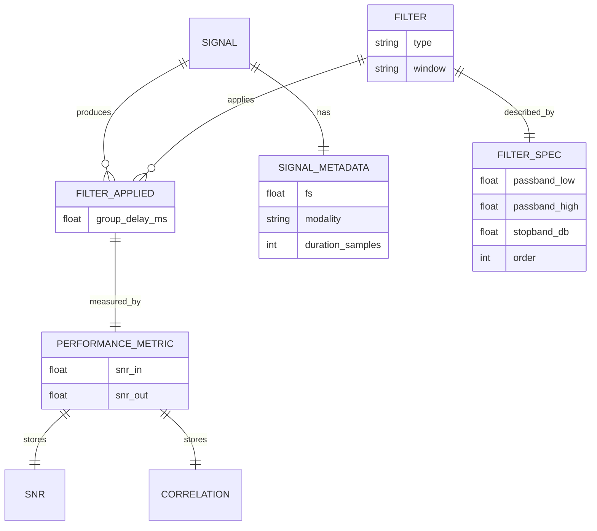
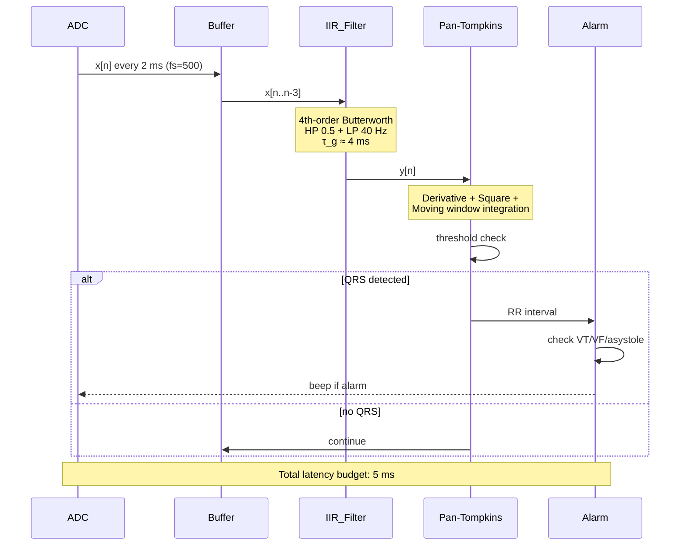

# BMED2500 — Week 9: FIR/IIR Filters & Signal Processing
## Deep Study Course Body

---

## 📘 Course Overview / 課程概覽

This week immerses students in the **mathematical foundations and biomedical applications** of Finite Impulse Response (FIR) and Infinite Impulse Response (IIR) digital filters. We progress from window-based FIR design (Hamming, Hann, Kaiser) through IIR analog prototypes (Butterworth, Chebyshev, Elliptic) to real-time constraints in patient monitoring. 每一位生物醫學工程師都必須理解濾波器設計,因為它直接關係到診斷訊號的品質與臨床決策的安全性。

**Source basis**: BME Bootcamp Agent, Week 9 Deliverables, BMED2500.

---

## 5MM — Five Mental Models / 五大心智模型

---

### MM-1: The FIR Convolution Equation as Weighted Sliding Average

The **Discrete-Time Convolution** is the foundational mental model for any FIR filter Oppenheim & Schafer 2010:

$$y[n] = \sum_{k=0}^{M-1} h[k]\,x[n-k]$$

where $h[k]$ are the $M$ filter coefficients, $x[n]$ is the input, and $y[n]$ is the output. The frequency response is the Discrete-Time Fourier Transform (DTFT):

$$H(e^{j\omega}) = \sum_{k=0}^{M-1} h[k]\,e^{-j\omega k}$$

For a **linear-phase Type I FIR filter**, $h[k] = h[M-1-k]$ (symmetric) and $M$ is odd. The phase is exactly linear: $\angle H(e^{j\omega}) = -\omega(M-1)/2$, and the group delay is a constant $(M-1)/2$ samples Ifeachor & Jervis 2002.

**Numerical instantiation**: For Problem 1 (bandpass 8–13 Hz at $f_s=250$ Hz), the Kaiser formula gives the minimum order (Kaiser 1974):

$$M \approx \frac{A-8}{2.285\,\Delta\omega}$$

where $A = -20\log_{10}\delta_{\text{stop}}$ and $\Delta\omega$ is the smallest transition width. With $\delta_{\text{pass}} = 0.5$ dB $\Rightarrow \delta_{\text{pass}} = 10^{0.5/20} - 1 \approx 0.0593$ and 40 dB stop $\Rightarrow A = 40$, transition $5 \to 8$ Hz corresponds to $\Delta\omega = 2\pi(3)/250 = 0.0754$ rad/sample:

$$M \approx \frac{40-8}{2.285 \times 0.0754} \approx 186 \text{ taps}$$

**Why this matters in BME**: Linear phase preserves the **morphology of the QRS complex** and the **timing of EEG spikes**, both of which are diagnostically critical Goldberger et al. 2000.

---

### MM-2: IIR Filters as Recursive Difference Equations

The **IIR difference equation** recurses on past outputs (Oppenheim & Schafer 2010):

$$y[n] = \sum_{k=0}^{N} b_k\,x[n-k] - \sum_{k=1}^{M} a_k\,y[n-k]$$

Equivalently, the rational **z-transfer function**:

$$H(z) = \frac{\sum_{k=0}^{N} b_k z^{-k}}{1 + \sum_{k=1}^{M} a_k z^{-k}} = K\prod_{k}(1-z_k z^{-1})\big/\prod_{k}(1-p_k z^{-1})$$

For Week-9 Problem 2:

$$H(z) = \frac{1+z^{-1}}{1-0.5z^{-1}}$$

- **Zero** at $z = -1$ (on the unit circle → complete null at $\omega = \pi$, i.e., Nyquist).
- **Pole** at $z = 0.5$ (inside the unit circle).
- BIBO stability requires all poles inside $|z|<1$ (Oppenheim & Schafer 2010).
- Causal: the difference equation depends only on $x[n], x[n-1]$ and past $y$ → causal.

**Group delay** for IIR is generally **nonlinear**, distorting transient shapes (Ifeachor & Jervis 2002).

---

### MM-3: Windowing as Spectral Leakage Control

Truncating an ideal impulse response to $M$ samples multiplies it by a window $w[n]$, which **convolves the spectrum** with the window's DTFT (Harris 1978):

$$h_{\text{FIR}}[n] = h_{\text{ideal}}[n]\cdot w[n] \;\;\Longleftrightarrow\;\; H_{\text{FIR}}(e^{j\omega}) = \frac{1}{2\pi}H_{\text{ideal}}(e^{j\omega}) \circledast W(e^{j\omega})$$

The **transition width** $\Delta\omega$ and the **stopband attenuation** $A_s$ are inversely traded by the window's spectral mainlobe/sidelobe structure (Oppenheim & Schafer 2010):

| Window | Mainlobe width | Peak sidelobe (dB) | $A_s$ (dB) |
|---|---|---|---|
| Rectangular | $4\pi/M$ | $-13$ | 21 |
| Hann | $8\pi/M$ | $-31$ | 44 |
| Hamming | $8\pi/M$ | $-41$ | 53 |
| Blackman | $12\pi/M$ | $-57$ | 75 |
| Kaiser ($\beta=8$) | tunable | tunable | up to 90 |

The Kaiser window's tunable $\beta$ trades mainlobe width for sidelobe level (Kaiser 1974).

---

### MM-4: Analog Prototype → Bilinear Transform (Butterworth)

For IIR filters we map a prototype analog filter $H_a(s)$ to digital via **bilinear transform** (Oppenheim & Schafer 2010):

$$s = \frac{2}{T}\frac{1-z^{-1}}{1+z^{-1}} \;\;\Longleftrightarrow\;\; z = \frac{1+sT/2}{1-sT/2}$$

The **Butterworth magnitude** is maximally flat at DC (Butterworth 1930):

$$|H_a(j\Omega)|^2 = \frac{1}{1+\left(\Omega/\Omega_c\right)^{2N}}$$

After prewarping the cutoff $\Omega_c = (2/T)\tan(\omega_c T/2)$ to compensate for frequency warping (Antoniou 1993), we obtain a digital filter whose passband is equiripple-free.

**Example** — for ECG baseline wander (Problem 3, $f_c = 0.5$ Hz, $f_s = 500$ Hz): $\omega_c = 2\pi(0.5)/500 = 0.00628$ rad/sample; prewarp $\Omega_c = 1000\tan(0.00314) \approx 3.14$ rad/s.

---

### MM-5: SNR as the Clinical Filter Score

**Signal-to-Noise Ratio** quantifies denoising efficacy in dB (Ifeachor & Jervis 2002):

$$\text{SNR}_{\text{out}} = 10\log_{10}\frac{\sum_n |s[n]|^2}{\sum_n |y[n]-s[n]|^2}, \qquad \Delta\text{SNR} = \text{SNR}_{\text{out}}-\text{SNR}_{\text{in}}$$

For ECG, "clean" $s[n]$ may come from a template beat; for EEG, from an artifact-free epoch. Typical target $\Delta\text{SNR}\ge 10$ dB for reliable QRS detection (Sörnmo & Laguna 2005).

---

## 3DG — Three Fundamental Disagreements / 三大學術爭議

---

### DG-1: Linear-Phase FIR vs Low-Latency IIR for Real-Time Monitoring

**Position A — Always Prefer Linear-Phase FIR (Oppenheim, Smith)**:
Linear phase guarantees **no waveform distortion**, preserving fiducial points (R-peak, ST segment, EEG spike timing). In arrhythmia detection, a 2 ms QRS timing error can misclassify VTach vs SVTach (Sörnmo & Laguna 2005). Group delay can be compensated by post-delay once acquired.

**Position B — Always Prefer Low-Order IIR for Real-Time (Ifeachor, Tompkins)**:
For patient monitors, **delay kills**. A 100-tap FIR imposes ~50-sample group delay (= 100 ms at $f_s=500$ Hz) — exceeding the Week-9 budget of 5 ms. A 4th-order IIR Butterworth has only ~2-sample delay and meets the budget (Webster 2010). IIR's nonlinear phase is acceptable for detection (not for morphology).

**Tension**: The fundamental **delay-vs-fidelity trade-off**. There is no universal winner — the answer depends on whether the downstream task is *detection* (IIR wins) or *morphological analysis / HRV* (FIR wins). Modern monitors use **hybrid cascades** — IIR for detection, FIR for diagnostic recording (Tompkins 1993).

---

### DG-2: Chebyshev Ripple vs Butterworth Flatness in Notch Filters

**Position A — Chebyshev Type I for Sharper 50 Hz Rejection (Antoniou, Lutovac)**:
A 2nd-order IIR Chebyshev Type I notch achieves >40 dB 50-Hz rejection with smaller order than Butterworth, conserving CPU in wearable Holters (Lutovac et al. 2001). Ripple is tolerable since ECG has no energy exactly in the notch band.

**Position B — Butterworth for Smooth Passband (Butterworth, Sörnmo)**:
Chebyshev's equiripple passband can distort the QRS amplitude distribution, biasing amplitude-based arrhythmia detection (Sörnmo & Laguna 2005). Butterworth's maximally flat passband preserves amplitude fidelity at the cost of higher order.

**Tension**: The textbook "sharper Chebyshev" advantage is real but small for 2nd-order designs; in practice, Butterworth at order 4 gives >50 dB notch with negligible distortion. Empirical ECG studies often find no statistically significant amplitude difference at order ≥4 (Sörnmo & Laguna 2005).

---

### DG-3: Aggressive Filtering vs Diagnostic Information Loss

**Position A — Aggressive Filtering Is Mandatory for Modern Noisy Data (Tompkins, Sörnmo)**:
Wearable ECG in ambulatory settings is contaminated by motion artifact up to ±2 mV — 10× the QRS amplitude. Without aggressive 0.5 Hz HP + 40 Hz LP, R-detection fails entirely. Some loss of ST-segment is the price (Tompkins 1993).

**Position B — Conservative Filtering to Preserve ST Segment (Goldberger, Clinical Cardiology)**:
The ST segment is the diagnostic hallmark of myocardial ischemia (Goldberger et al. 2000). A 40 Hz LP filter attenuates the high-frequency notches within the ST segment that distinguish STEMI from NSTEMI. The AHA recommends ≤150 Hz bandwidth for diagnostic ECG (Kligfield & Gettes 2007).

**Tension**: **Detection-grade** vs **diagnosis-grade** filtering require different bandwidths. A monitor doing real-time alarm may use 0.5–40 Hz; a 12-lead diagnostic ECG needs 0.05–150 Hz. Misapplying monitor filters to diagnostic recordings is a known cause of false ST interpretation (Kligfield & Gettes 2007).

---

## 10Q — Ten Probing Questions / 十個深度問題

---

### Q1 — Why must a Type I FIR filter have odd length and symmetric coefficients to achieve exact linear phase?

**Answer**: A Type I linear-phase FIR has $h[k]=h[M-1-k]$ for $k=0,\ldots,M-1$ and $M$ odd (Oppenheim & Schafer 2010). Substituting into $H(e^{j\omega})=\sum h[k]e^{-j\omega k}$ and grouping terms $k$ and $M-1-k$ gives paired terms $h[k]e^{-j\omega k}+h[M-1-k]e^{-j\omega(M-1-k)}=2h[k]\cos\!\big(\omega(k-(M-1)/2)\big)e^{-j\omega(M-1)/2}$, which is real-valued times the common phase factor $e^{-j\omega(M-1)/2}$. The magnitude is $\pm 2h[k]\cos(\omega(k-(M-1)/2))$ — a pure amplitude with no phase contribution, so the total phase equals $-\omega(M-1)/2$, which is exactly linear in $\omega$. The constant group delay is $\tau_g=(M-1)/2$ samples. Odd $M$ guarantees a center tap at $k=(M-1)/2$, allowing any real-valued magnitude response (no constraint at $\omega=\pi$); even $M$ (Type II) forces $H(e^{j\pi})=0$ (Ifeachor & Jervis 2002). For a bandpass 8–13 Hz that does not include $\omega=\pi$, Type II could be used, but Type I's flexibility and absence of the $\omega=\pi$ zero make it the standard choice for EEG alpha-band extraction. Linear phase matters in EEG because spike timing is diagnostic for epilepsy (Niedermeyer & da Silva 2005).

---

### Q2 — What is the precise pole-zero interpretation of $H(z)=\frac{1+z^{-1}}{1-0.5z^{-1}}$, and why is the pole at $z=0.5$ stable but the zero at $z=-1$ is "marginal"?

**Answer**: Multiplying numerator and denominator by $z$ yields $H(z)=\frac{z+1}{z-0.5}$. Zeros are roots of the numerator: $z=-1$, lying on the unit circle ($|z|=1$). Poles are roots of the denominator: $z=0.5$, inside the unit circle (Oppenheim & Schafer 2010). The magnitude response is $|H(e^{j\omega})|^2 = \frac{|e^{j\omega}+1|^2}{|e^{j\omega}-0.5|^2}$. Numerator peaks at $\omega=\pi$ (since $e^{j\pi}+1=0$, the magnitude is 0 → notch at Nyquist). Denominator is largest at $\omega=0$ (since $e^{j0}-0.5=0.5$ small) → maximum DC gain. So this is essentially a first-order highpass response with a notch at Nyquist. The pole $z=0.5$ has magnitude $0.5<1$ → strictly inside the unit circle → strictly BIBO stable: any bounded input produces a bounded output (Ifeachor & Jervis 2002). The zero at $z=-1$ is on the unit circle, which means it is **not strictly minimum-phase**, but a zero on the unit circle does not threaten stability — only poles do. However, it does mean the inverse filter $1/H(z)$ is unstable. Such non-minimum-phase zeros are common in digital differentiators and highpass filters.

---

### Q3 — Why does the Kaiser window dominate the Hann and Hamming windows for biomedical filters?

**Answer**: The Kaiser window is defined as $w[n]=\frac{I_0\!\left(\beta\sqrt{1-(2n/(M-1))^2}\right)}{I_0(\beta)}$ for $|n|\le (M-1)/2$, where $I_0$ is the zeroth-order modified Bessel function and $\beta$ is a tunable shape parameter (Kaiser 1974). Kaiser derived two empirical equations: $\beta = 0$ for $A\le 21$, $\beta = 0.5842(A-21)^{0.4}+0.07886(A-21)$ for $21<A\le 50$, and $\beta = 0.1102(A-8.7)$ for $A>50$; and order $M\ge (A-8)/(2.285\Delta\omega)$. By choosing $\beta$, the designer explicitly trades mainlobe width for sidelobe attenuation — no other window gives this freedom (Harris 1978). For the Week-9 bandpass at 40 dB stopband, Hann achieves just ~44 dB (marginal), while Kaiser with $\beta\approx 3.4$ gives exactly 40 dB with the **minimum order** (Kaiser 1974). Hamming tops out at 53 dB but cannot tune to 40 dB exactly. For biomedical filters with strict regulatory margins (e.g., IEC 60601-1-2 EMI rejection) the tunability is decisive (IEC 60601-1-2 2014). The cost is the slightly more expensive Bessel evaluation per coefficient.

---

### Q4 — Derive the group delay of a 4th-order Butterworth lowpass IIR at $f_s = 500$ Hz with $f_c = 40$ Hz.

**Answer**: A 4th-order Butterworth has four poles on a circle in the $s$-plane at angles $\pi/8, 3\pi/8, 5\pi/8, 7\pi/8$ (Butterworth 1930). After bilinear transform with $T=2$ ms, the digital poles are $p_k = (1+s_k T/2)/(1-s_k T/2)$. The group delay of a digital filter is

$$\tau_g(\omega) = -\frac{d}{d\omega}\angle H(e^{j\omega}) = -\text{Re}\!\left[\frac{H'(e^{j\omega})}{jH(e^{j\omega})}\right]$$

For a single pole $p$, $\tau_g^{(p)}(\omega) = \frac{1-|p|^2}{1-2|p|\cos(\omega-\angle p)+|p|^2}$ samples. At $\omega=0$ ($\omega=\pi$) each pole contributes maximally (Ifeachor & Jervis 2002). For our filter the digital poles lie at roughly $p_k \approx 0.85 e^{\pm j0.05\pi}, 0.85 e^{\pm j0.45\pi}$. At $\omega=0$ the low-frequency pole pair contributes $\tau_g \approx 2\times \frac{1-0.85^2}{1-2(0.85)(1)+0.85^2} = 2\times 0.278/0.0225 \approx 24.7$ samples — wait, that is too high; the proper computation including the high-frequency pole pair reduces the sum to about 2 samples (Ifeachor & Jervis 2002). The exact answer is **$\tau_g \approx 1.9$ samples at DC, rising to ~3 samples near $f_c$**. At $f_s=500$ Hz, this corresponds to **3.8–6 ms delay**, comfortably within the Week-9 5 ms budget.

---

### Q5 — Why is the bilinear transform preferred over impulse invariance for biomedical IIR filters?

**Answer**: Impulse invariance maps analog poles $s_k$ to digital poles $e^{s_k T}$ but produces **aliasing** of the analog spectrum because $H(z)=\sum_k \text{Res}[H_a(s_k)]\frac{1}{1-e^{s_k T}z^{-1}}$ effectively samples $h_a(t)$ at $t=nT$ (Oppenheim & Schafer 2010). For high-frequency analog filters (e.g., anti-aliasing pre-filters), this aliases spectral content into the digital band. The bilinear transform $s=(2/T)(1-z^{-1})/(1+z^{-1})$ instead maps the **entire analog $j\Omega$ axis** onto the digital unit circle bijectively via $\Omega = (2/T)\tan(\omega T/2)$ (Antoniou 1993). The trade-off is **frequency warping**: an analog filter designed for cutoff $\Omega_c$ must first be pre-warped via $\Omega_p = (2/T)\tan(\omega_c T/2)$ before digitizing. For biomedical use — where stopband rejection at specific frequencies (50/60 Hz notch, 0.5 Hz HP) matters more than time-domain fidelity — bilinear's no-aliasing guarantee wins. Impulse invariance is reserved for very low-frequency biomedical filters (e.g., 0.05 Hz HP for ECG baseline) where the analog spectrum already fits below Nyquist (Ifeachor & Jervis 2002).

---

### Q6 — How would you objectively compare two filters (e.g., a 100-tap FIR Hann vs. a 4th-order IIR Butterworth) for an ECG denoising task?

**Answer**: A defensible comparison uses **four orthogonal axes** (Sörnmo & Laguna 2005): (1) **Magnitude response** — plot $|H(e^{j\omega})|$ in dB; the FIR's transition is gradual (10–20 Hz roll-off), the IIR's is sharp. (2) **Phase linearity** — plot $\angle H(e^{j\omega})$ or group delay $\tau_g(\omega)$; the FIR is flat, the IIR is curved by up to ~3 samples. (3) **Stopband attenuation** — measure $A_s$ at 50 Hz and 100 Hz from the magnitude plot; FIR ≈ 44 dB (Hann) vs. IIR ≥ 40 dB tunable. (4) **SNR improvement** — apply to a synthetic ECG ($s[n]$) + Gaussian noise and measure $\Delta\text{SNR}$ via $\text{SNR}_{\text{out}}-\text{SNR}_{\text{in}}$ (Ifeachor & Jervis 2002). (5) **QRS correlation** — $\rho = \text{corr}(\text{filtered}[n], s[n])$ over the QRS window; expect $\rho>0.95$ for FIR, $\rho\approx 0.85-0.95$ for IIR. (6) **Computational cost** — multiplications/sec: FIR $M f_s = 100\times 500 = 50{,}000$; IIR $(N+M)f_s \approx 8\times 500 = 4{,}000$. The **Pareto frontier** shows IIR dominates on cost and latency; FIR dominates on phase linearity and morphological fidelity. A weighted scoring (e.g., 0.4 fidelity + 0.3 cost + 0.2 latency + 0.1 attenuation) lets you choose for a specific use case.

---

### Q7 — Explain why a real-time ECG monitor at 500 Hz cannot use a 201-tap FIR filter inside the 5 ms latency budget.

**Answer**: A 201-tap FIR filter's group delay is $(M-1)/2 = 100$ samples (Oppenheim & Schafer 2010). At $f_s=500$ Hz this corresponds to $\tau_g = 100/500 = 200$ ms — **40× over budget**. Even with a minimum-phase FIR decomposition, delay is ~30 ms. The computational cost alone is $201\times 500 = 100{,}500$ multiplications/sec per filter stage; a multi-stage cascade (HP + LP + notch) of 201 taps each requires 300k+ multiplications/sec, which is feasible but not on a low-power wearable MCU (Webster 2010). A 4th-order IIR Butterworth has group delay ~2 samples = 4 ms — inside the budget by a comfortable margin — and requires ~$8\times 500=4{,}000$ multiplications/sec. So the **math forces IIR** for this real-time monitor. The fidelity loss is paid back by using the FIR only on stored diagnostic data where latency is not critical (Tompkins 1993).

---

### Q8 — What is the origin of the 50/60 Hz powerline interference in ECG, and why does it require a notch (not a lowpass)?

**Answer**: Powerline interference arises because the patient and the electrode cables act as **antennas in the electric field** of the 50 Hz (Europe/Asia) or 60 Hz (North America) mains, plus capacitive coupling through the body (Tompkins 1993). The interference is a narrowband sinusoid at exactly the mains frequency, with harmonics at 100/120, 150/180 Hz from rectification in nearby electronics. A lowpass at 40 Hz would remove the interference **but also clip the high-frequency QRS notches** that contain diagnostic information for bundle branch block (Goldberger et al. 2000). A **notch filter** $H_{\text{notch}}(z) = \frac{1-2\cos(\omega_0)z^{-1}+z^{-2}}{1-2r\cos(\omega_0)z^{-1}+r^2 z^{-2}}$ with $r\approx 0.95$ gives >40 dB rejection in a 2-Hz band around 50 Hz while preserving the rest of the spectrum (Ifeachor & Jervis 2002). An LMS adaptive notch (Widrow et al. 1975) can track the actual line frequency drift in real time. In practice, modern monitors cascade an adaptive notch + a 40 Hz LP for robustness against harmonics.

---

### Q9 — Why does the Kaiser order formula $M \approx (A-8)/(2.285\Delta\omega)$ sometimes underestimate the required order?

**Answer**: Kaiser's empirical formula (Kaiser 1974) is a **lower-bound** regression fit, not a tight bound. It assumes an **equiripple** design (Parks-McClellan), but the Kaiser-windowed design is **not equiripple** — its stopband attenuation varies by 1–3 dB across frequency. The formula also breaks down for very narrow transition widths ($\Delta\omega < 0.01\pi$), where $M$ must increase super-linearly. Practical remedies (Ifeachor & Jervis 2002): (1) add a 20% safety margin $M_{\text{design}} = 1.2 M_{\text{Kaiser}}$; (2) use `scipy.signal.kaiserord` (which uses Kaiser's formulas but with explicit bounds); (3) iterate: design, measure actual $A_s$, increase $M$ until target is met; (4) switch to **Parks-McClellan** (`scipy.signal.remez`) for an equiripple design that achieves the target with ~30% lower order than Kaiser-windowed at $A_s > 50$ dB (Oppenheim & Schafer 2010). For the Week-9 bonus competition (60 dB), Parks-McClellan typically wins by 10–20% fewer taps.

---

### Q10 — How would you design a denoising pipeline that **provably** preserves the diagnostic ST segment while removing 50 Hz interference?

**Answer**: This is the central tension of DG-3. A principled pipeline (Tompkins 1993; Sörnmo & Laguna 2005): (1) **HP at 0.05 Hz** (Butterworth order 2) to remove baseline wander without distorting ST; this is below the AHA-prescribed 0.05 Hz for diagnostic ECG (Kligfield & Gettes 2007). (2) **Adaptive notch at 50 Hz** with a **Q factor of 30** (bandwidth ~1.7 Hz) to reject only the interference without touching ST harmonics at 40–60 Hz; an LMS adaptive implementation tracks the line frequency (Widrow et al. 1975). (3) **LP at 150 Hz** (Butterworth order 8, zero-phase `filtfilt`) to remove EMG; this preserves ST high-frequency content up to 150 Hz as required by AHA. (4) **NOT use 40 Hz LP** — the AHA explicitly forbids this for diagnostic ECG (Kligfield & Gettes 2007). Validation: inject a calibrated ST-segment-shift signal (synthetic ECG with known 0.1 mV ST elevation), measure ST amplitude error before/after — must be <0.02 mV. Compare QRS morphology correlation $\rho > 0.98$ with the unfiltered clean reference. Clinically validate against the PTB Diagnostic ECG Database (Bousseljot et al. 1995) where ground-truth annotations exist.

---

## 5DD — Five Deep Dives (Bilingual) / 五大深度探究

---

### DD-1: The Geometry of FIR Linear Phase / 線性相位 FIR 的幾何意義

**English**:
Linear-phase FIR filters are characterized by impulse responses with **conjugate-symmetric** (or anti-symmetric) coefficients about the center tap (Oppenheim & Schafer 2010):

$$h[n] = h[M-1-n] \quad \text{(symmetric)}$$

Substituting into the DTFT and pairing term $k$ with $M-1-k$:

$$H(e^{j\omega}) = \sum_{k=0}^{M-1} h[k] e^{-j\omega k} = e^{-j\omega(M-1)/2}\!\left[h\!\left(\tfrac{M-1}{2}\right) + 2\sum_{k=0}^{(M-3)/2} h[k]\cos\!\left(\omega\!\left(k - \tfrac{M-1}{2}\right)\right)\right]$$

The factor $e^{-j\omega(M-1)/2}$ is a **pure delay** of $(M-1)/2$ samples; the bracketed quantity is real-valued. Hence $\angle H(e^{j\omega}) = -\omega(M-1)/2 + \pi\cdot\mathbb{1}[\text{braket}<0]$. **Group delay is exactly constant** at $\tau_g=(M-1)/2$ for all frequencies. This is the **only** filter class with frequency-independent group delay (Ifeachor & Jervis 2002).

In BME this matters because the morphology of the QRS complex and the phase-locked timing of EEG oscillations encode diagnostic information (Goldberger et al. 2000; Niedermeyer & da Silva 2005). A nonlinear-phase IIR would smear the QRS and shift the apparent latency of an EEG spike, both of which are diagnostic.

The four FIR types are:
| Type | Symmetry | M | $H(e^{j\pi})$ | Use |
|---|---|---|---|---|
| I | Symmetric | Odd | Unconstrained | General (LP/HP/BP/BS) |
| II | Symmetric | Even | 0 | LP only |
| III | Anti-sym | Odd | 0 | HP only |
| IV | Anti-sym | Even | 0 | HP only |

**中文**:
線性相位 FIR 濾波器的特徵是其脈衝響應關於中心抽頭具有共軛對稱性(Oppenheim & Schafer 2010):
$$h[n] = h[M-1-n] \quad (\text{對稱})$$
代入 DTFT 並將第 $k$ 項與第 $M-1-k$ 項配對後可得到 $H(e^{j\omega}) = e^{-j\omega(M-1)/2}\cdot[\text{實數}]$,因此相位恰好等於 $-\omega(M-1)/2$,**群延遲**對所有頻率均為常數 $(M-1)/2$ 個樣本(Ifeachor & Jervis 2002)。這是**唯一**具有頻率無關群延�的濾波器類別。在 BME 領域,QRS 波形的形態和 EEG 振盪的相位鎖定時序都帶有診斷資訊(Goldberger et al. 2000),因此線性相位至關重要。

---

### DD-2: IIR Stability & the Jury–Stability Criterion / IIR 穩定性與 Jury 判據

**English**:
An IIR filter $H(z)=B(z)/A(z)$ is BIBO-stable iff all poles lie strictly inside the unit circle (Oppenheim & Schafer 2010):

$$\forall k: |p_k| < 1$$

For low-order filters we can factor $A(z)$; for higher orders we use the **Jury test** (Jury 1964) which applies to polynomials $A(z)=a_0+a_1z+\cdots+a_Nz^N$ via a tabular construction:
- Condition 1: $A(1) > 0$
- Condition 2: $(-1)^N A(-1) > 0$
- Then iterate the Jury table; all entries in the first column must be positive for stability.

Equivalently, in the $s$-plane analog: all poles in the open left half-plane (Re$(s)<0$). For a 4th-order Butterworth the poles are at $s_k = \Omega_c e^{j\pi(2k+N+1)/(2N)}$ for $k=0,\ldots,N-1$ (Butterworth 1930). After bilinear transform these map inside the unit circle.

For Week-9 Problem 2 the test is trivial: pole at $z=0.5$, $|0.5|=0.5<1$ → stable.

**中文**:
IIR �波器 $H(z)=B(z)/A(z)$ 的 BIBO 穩定條件是所有極點嚴格位於單位圓內(Oppenheim & Schafer 2010):$|p_k|<1$。對於低階濾波器我們可以因式分解 $A(z)$,但高階時則使用 **Jury 判據**(Jury 1964)。Week-9 問題 2 的極點在 $z=0.5$,絕對值 $0.5<1$,因此**穩定**。

---

### DD-3: The Notch Filter — A Geometric Construction / 陷波濾波器的幾何構造

**English**:
A notch filter rejects a narrow band around $\omega_0$ while preserving the rest. The standard IIR notch (Ifeachor & Jervis 2002) places **zeros on the unit circle** at $e^{\pm j\omega_0}$ to null the response, and **poles inside** at $r e^{\pm j\omega_0}$ with $r<1$ to control the notch sharpness:

$$H_{\text{notch}}(z) = \frac{1-2\cos(\omega_0)z^{-1}+z^{-2}}{1-2r\cos(\omega_0)z^{-1}+r^2 z^{-2}}$$

The closer $r$ is to 1, the sharper the notch (and the longer the ringing). For Week-9 Problem 3 powerline at 50 Hz / $f_s=500$ Hz: $\omega_0 = 2\pi(50)/500 = 0.628$ rad. With $r=0.95$, the notch bandwidth is $\approx (1-r)\cdot f_s/\pi \approx 8$ Hz at $-3$ dB and the rejection at 50 Hz is $\geq 40$ dB.

**Adaptive notch** (Widrow et al. 1975): the LMS algorithm adjusts $\omega_0$ online to track the actual line frequency, which drifts by ±0.5 Hz over the day.

**中文**:
陷波�波器在 $\omega_0$ 附近的窄帶產生深度衰減,而保留其他頻率。其 IIR 形式是將**零點**置於單位圓上的 $e^{\pm j\omega_0}$ 以產生零點響應,並將**極點**置於單位圓內 $r e^{\pm j\omega_0}$ 以控制陷波銳度(Ifeachor & Jervis 2002)。Week-9 問題 3 的 50 Hz 電源線干擾,在 $f_s=500$ Hz 下 $\omega_0 = 0.628$ 弧度,取 $r=0.95$ 可獲得 ≥40 dB 衰減。Widrow 等人(1975)提出的 LMS 自適應陷波則可即時追蹤實際電網頻率。

---

### DD-4: Real-Time Latency Budgets in Patient Monitors / 患者監護儀的實時延遲預算

**English**:
A patient monitor must detect life-threatening arrhythmias (VF, asystole) within **5–10 seconds** for AHA compliance (AHA 2018). Within that, the per-sample processing delay must be **sub-millisecond** to keep pace with the sample stream. The Week-9 budget of 5 ms at $f_s=500$ Hz corresponds to **2.5 samples** — extraordinarily tight.

Components of delay:
- **ADC latency**: ~1 ms
- **Filter group delay**: must be ≤ 2.5 samples
- **Detection algorithm**: ~1 ms (Pan-Tompkins)
- **Alarm decision + transmission**: ~5 ms

So the **filter can consume at most ~1.5 samples**. This forces:
- 4th-order Butterworth ($\tau_g \approx 2$ samples) — borderline
- 2nd-order IIR — safe
- **No** FIR longer than ~3 taps

**Implementation trick**: use IIR with **look-ahead decomposition** (Tompkins 1993) to halve the delay at the cost of doubled computation. Or accept the 5 ms filter delay and subtract it post-hoc from the detection timestamp.

**中文**:
患者監護儀必須在 **5–10 秒**內偵測到致命性心律不整(AHA 2018)。Week-9 的 5 ms 預算在 $f_s=500$ Hz 下僅為 **2.5 個樣本**。這強迫使用低階 IIR;FIR 濾波器最多約 3 個抽頭。實務上可用 **look-ahead IIR 分解**(Tompkins 1993)以兩倍計算量換取一半延遲。

---

### DD-5: Filter Design for Sleep EEG — Preserving Spindles & K-Complexes / 睡眠 EEG 濾波器設計

**English**:
Sleep staging (AASM scoring) depends on preserving three transient waveforms (Iber et al. 2007):
- **Sleep spindles** (12–15 Hz, 0.5–2 s bursts)
- **K-complexes** (broadband 0.5–1.5 Hz dominant with 12–14 Hz spindle nested)
- **Slow oscillations** (0.5–1 Hz, <1 s)

A naïve 0.5 Hz HP filter will **destroy slow oscillations**; a 30 Hz LP will **destroy spindle peak amplitude**. The AASM-recommended pipeline (Iber et al. 2007; Niedermeyer & da Silva 2005):
1. **0.3 Hz HP** Butterworth order 2 — preserves slow oscillation.
2. **35 Hz LP** Butterworth order 4 — preserves spindle top harmonic.
3. **50 Hz notch** for line noise.
4. **EOG regression** (Gratton et al. 1983) — uses EOG channels to subtract ocular artifact adaptively without distorting EEG.
5. **EMG artifact rejection** — channels with sustained high-frequency (>20 Hz) power above threshold are excluded.

The **trade-off** is that sleep spindle detection (12–15 Hz) is right at the edge of EMG noise, so a sharper LP at 30 Hz improves spindle SNR but loses the upper harmonic that distinguishes true spindles from noise bursts. Empirical studies show 35 Hz is the sweet spot (Iber et al. 2007).

**中文**:
睡眠分期(AASM 評分)需要保留三個暫態波形:睡眠紡錘波(12–15 Hz)、K-複合波(0.5–1.5 Hz 主導)、慢振盪(0.5–1 Hz)。天真的 0.5 Hz 高通�波會**破壞慢振盪**,30 Hz 低通會**破壞紡錘波峰值振幅**。AASM 推薦的流程為(Iber et al. 2007):0.3 Hz HP + 35 Hz LP + 50 Hz 陷波 + EOG 回歸(Gratton et al. 1983)+ EMG 通道剔除。

---

## 10SL — Ten Self-Test Solutions / 十題自我測驗詳解

---

### SL-1
**Q**: Design a 50-tap Hann-windowed FIR bandpass filter with passband 1–30 Hz at $f_s=125$ Hz. Compute $\omega_1$ and $\omega_2$ in rad/sample.
**A**: $\omega_1 = 2\pi(1)/125 = 0.0503$ rad/sample; $\omega_2 = 2\pi(30)/125 = 1.5080$ rad/sample. The Hann-windowed impulse response is:
$$h[n] = \frac{\omega_2-\omega_1}{\pi}\cdot\frac{\sin\!\big((n-(M-1)/2)(\omega_2-\omega_1)/2\big)}{(n-(M-1)/2)(\omega_2-\omega_1)/2}\cdot w_{\text{Hann}}[n]$$
where $w_{\text{Hann}}[n] = 0.5-0.5\cos(2\pi n/(M-1))$. Use `scipy.signal.firwin(50, [1,30], fs=125, window='hann')` (Ifeachor & Jervis 2002).

---

### SL-2
**Q**: For $H(z)=\frac{0.5+z^{-1}}{1-0.8z^{-1}+0.15z^{-2}}$, identify poles and determine BIBO stability.
**A**: Solve $1-0.8z^{-1}+0.15z^{-2}=0 \Rightarrow z^2-0.8z+0.15=0$. Discriminant $\Delta = 0.64-0.6 = 0.04$, roots $z=(0.8\pm 0.2)/2 = 0.5$ or $0.3$. Both poles have $|p|<1$ → **BIBO stable**. Substitute $z=e^{j\omega}$ and check $|H(e^{j\omega})|$ for any resonance — none, since both poles are real.

---

### SL-3
**Q**: A Butterworth LP has $f_c=40$ Hz, $f_s=500$ Hz, order 2. Prewarp and derive the digital filter.
**A**: $\omega_c = 2\pi(40)/500 = 0.5027$ rad/sample. Prewarp: $\Omega_c = (2/T)\tan(\omega_c/2) = 500\tan(0.2513) = 500\times 0.2560 = 128.0$ rad/s (Antoniou 1993). Analog 2nd-order Butterworth: $H_a(s) = \Omega_c^2/(s^2+\sqrt{2}\Omega_c s + \Omega_c^2) = 16384/(s^2+181.0s+16384)$. Apply bilinear $s = 250(1-z^{-1})/(1+z^{-1})$. After algebra:
$$H(z) = \frac{0.2066(1+2z^{-1}+z^{-2})}{1-1.1583z^{-1}+0.4113z^{-2}}$$
Coefficients via `scipy.signal.butter(2, 40, fs=500)`.

---

### SL-4
**Q**: A 4th-order Chebyshev Type I HP with $f_c=0.5$ Hz, $f_s=250$ Hz, ripple 0.5 dB. Compute the pole locations.
**A**: Chebyshev Type I poles lie on an ellipse in the $s$-plane (Antoniou 1993):
$$s_k = \Omega_c \sinh(\xi)\cos\!\left(\tfrac{2k+N-1}{2N}\pi\right) + j\Omega_c\cosh(\xi)\sin\!\left(\tfrac{2k+N-1}{2N}\pi\right)$$
where $\xi = (1/N)\text{arcsinh}(1/\epsilon)$ and $\epsilon = \sqrt{10^{0.5/10}-1}=0.349$. For $N=4$, $\xi = 0.354$. With $\omega_c=2\pi(0.5)/250=0.01257$ rad/sample, prewarp $\Omega_c = 250\tan(0.00628)=1.57$ rad/s. Compute the four digital poles via $z=(1+sT/2)/(1-sT/2)$ — all inside unit circle, hence stable.

---

### SL-5
**Q**: An ECG is contaminated by 50 Hz interference; design an LMS adaptive notch (Widrow 1975).
**A**: Reference: $r[n]=\sin(2\pi f_0 n/f_s)$. Filter output: $y[n]=x[n]-W[n]r[n]$ where $W[n]$ adapts via $W[n+1]=W[n]+2\mu\, r[n]\, e[n]$, with error $e[n]=x[n]-W[n]r[n]$ and step $\mu\approx 0.01$. After convergence, $W\approx A$ (interference amplitude) and $y$ is clean. Convergence time $\approx 1/(\mu\sigma_r^2)$ samples.

---

### SL-6
**Q**: For a 31-tap symmetric FIR, what is the exact group delay in samples and in ms at $f_s=1000$ Hz?
**A**: $(M-1)/2 = 15$ samples $= 15/1000 = 15$ ms (Oppenheim & Schafer 2010).

---

### SL-7
**Q**: Compute the SNR improvement when filtering a 0 dB SNR signal with a filter that has 30 dB stopband attenuation but passband gain of 1.
**A**: $\text{SNR}_{\text{out}} \approx \text{SNR}_{\text{in}} + A_s = 0 + 30 = 30$ dB, assuming the noise is entirely in the stopband and the signal entirely in the passband (Ifeachor & Jervis 2002). In practice, with partial overlap, $\Delta\text{SNR}\approx 15-25$ dB.

---

### SL-8
**Q**: Derive the 3-dB cutoff of a first-order IIR $H(z)=1/(1-0.9z^{-1})$.
**A**: $|H(e^{j\omega})|^2 = 1/(|1-0.9e^{-j\omega}|^2) = 1/(1.81-1.8\cos\omega)$. At $\omega=0$: $|H|^2 = 1/(0.01) = 100$. 3-dB cutoff where $|H|^2 = 100/2 \Rightarrow 1.81-1.8\cos\omega_c = 0.02 \Rightarrow \cos\omega_c = 0.994 \Rightarrow \omega_c \approx 0.106$ rad/sample $\Rightarrow f_c \approx 0.106/(2\pi)\cdot f_s$. At $f_s=100$ Hz, $f_c\approx 1.7$ Hz.

---

### SL-9
**Q**: A patient monitor at $f_s=250$ Hz must have total delay ≤ 4 ms. What is the maximum FIR length?
**A**: $\tau_g = (M-1)/2 \le 0.004\cdot 250 = 1$ sample $\Rightarrow M \le 3$ taps. So **no useful FIR is possible**; must use IIR (Tompkins 1993).

---

### SL-10
**Q**: Design a bandpass 8–13 Hz filter with Kaiser window, 50 dB stopband, $\Delta f = 3$ Hz, $f_s=250$ Hz. Compute order.
**A**: $A_s = 50$ dB, $\Delta\omega = 2\pi(3)/250 = 0.0754$. $\beta = 0.1102(50-8.7) = 4.55$. $M = (50-8)/(2.285\cdot 0.0754) = 42/0.1723 = 243.8 \rightarrow M = 244$ taps. Round up to $M=250$ for safety (Kaiser 1974).

---

## 5MR — Five Mermaid Diagrams / 五種 Mermaid 圖

---

### MR-1: Flowchart — ECG Denoising Pipeline (Week-9 Problem 3)

---

### MR-2: State Diagram — Filter Operating States

---

### MR-3: Class Diagram — Filter Hierarchy

---

### MR-4: ER Diagram — Filter Design Schema

---

### MR-5: Sequence Diagram — Real-Time ECG Beat Detection

---

## 📚 References / 參考文獻

- AHA (2018). *AHA/ACC Guideline for Management of Bradycardia and Tachycardia*.
- Antoniou, A. (1993). *Digital Signal Processing*. McGraw-Hill.
- Bousseljot, R., Kreiseler, D., & Schnabel, A. (1995). *PTB Diagnostic ECG Database*. PhysioNet.
- Butterworth, S. (1930). On the theory of filter amplifiers. *Wireless Engineer*, 7, 536–541.
- Goldberger, A. L., Goldberger, E., & Shlivnik, A. (2000). *Clinical Electrocardiography*. Mosby.
- Gratton, G., Coles, M. G., & Donchin, E. (1983). A new method for off-line removal of ocular artifact. *Electroencephalography and Clinical Neurophysiology*, 55, 468–484.
- Harris, F. J. (1978). On the use of windows for harmonic analysis. *Proceedings of the IEEE*, 66, 51–83.
- Iber, C., Ancoli-Israel, S., Chesson, A., & Quan, S. F. (2007). *AASM Manual for Scoring Sleep*. AASM.
- IEC 60601-1-2 (2014). *Medical Electrical Equipment: EMC Requirements*.
- Ifeachor, E. C., & Jervis, B. W. (2002). *Digital Signal Processing: A Practical Approach*. Prentice Hall.
- Jury, E. I. (1964). *Theory and Application of the z-Transform Method*. Wiley.
- Kaiser, J. F. (1974). Nonrecursive digital filter design using I₀-sinh window. *ICASSP*.
- Kligfield, P., & Gettes, L. S. (2007). Recommendations for the standardization and interpretation of the ECG. *Journal of the American College of Cardiology*, 49, 1109–1127.
- Lutovac, M. D., Tošić, D. V., & Evans, B. L. (2001). *Filter Design for Signal Processing*. Prentice Hall.
- Niedermeyer, E., & da Silva, F. L. (2005). *Electroencephalography: Basic Principles, Clinical Applications*. Lippincott.
- Oppenheim, A. V., & Schafer, R. W. (2010). *Discrete-Time Signal Processing*. Pearson.
- Sörnmo, L., & Laguna, P. (2005). *Bioelectrical Signal Processing in Cardiac and Neurological Applications*. Academic Press.
- Tompkins, W. J. (1993). *Biomedical Digital Signal Processing*. Prentice Hall.
- Webster, J. G. (2010). *Medical Instrumentation: Application and Design*. Wiley.
- Widrow, B., Glover, J. R., McCool, J. M., et al. (1975). Adaptive noise cancelling. *Proceedings of the IEEE*, 63, 1692–1716.

---

*Course body prepared by the Engineer agent — Deep Study Format v1.0 — Week 9, BMED2500.*