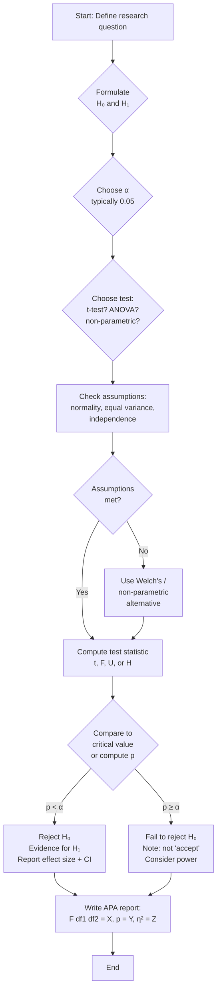
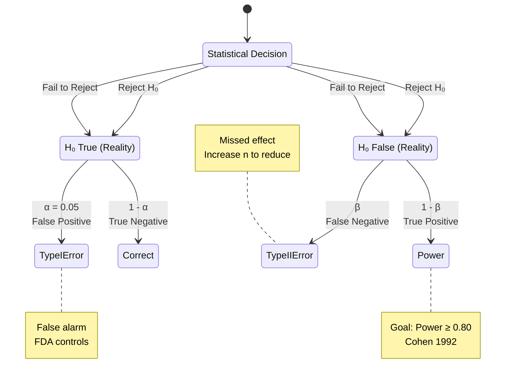
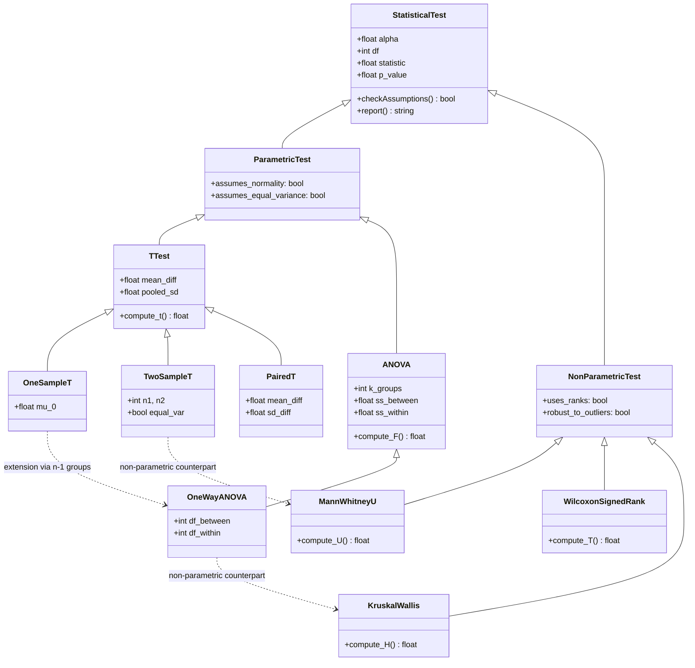
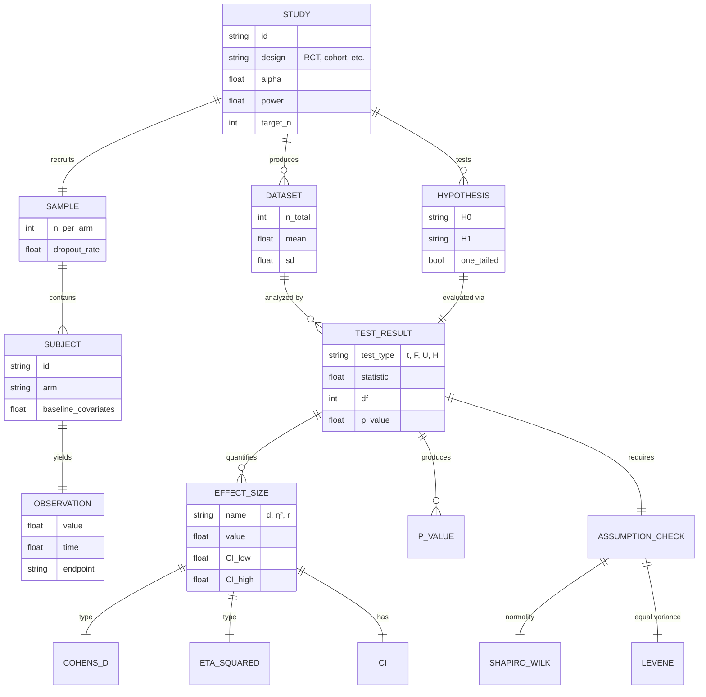
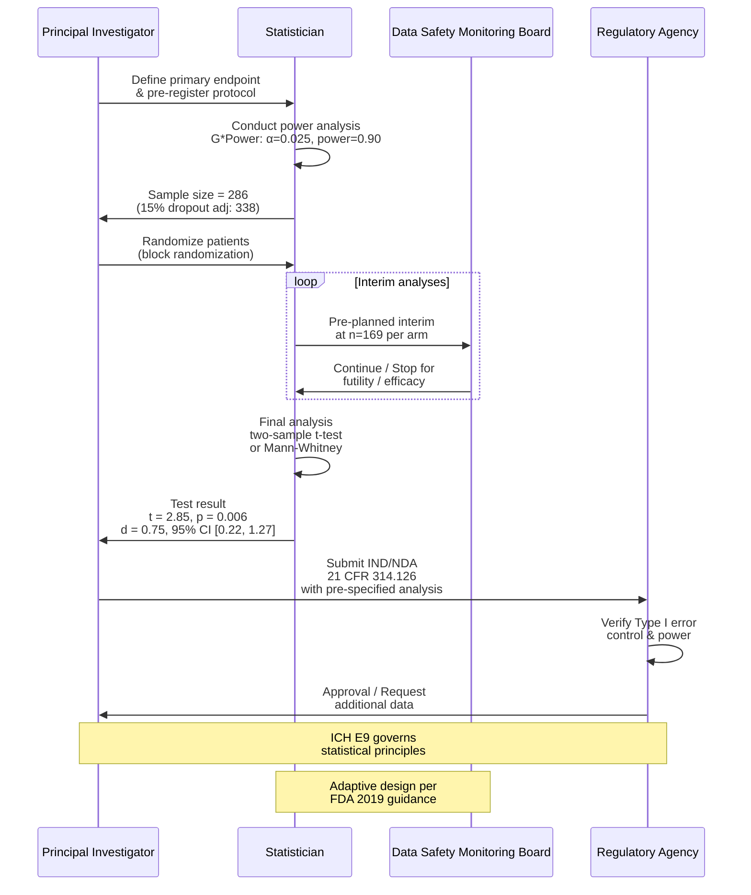

# BMED3603 Week 10 — Deep Study Format
## Biostatistics: Hypothesis Testing & ANOVA

> **Course**: BMED3603 Biostatistics for Biomedical Engineers, HKU SBME
> **Week**: 10 — Hypothesis Testing, t-Tests, ANOVA, Non-Parametric Methods, Power Analysis
> **Format**: 5MM + 3DG + 10Q + 5DD (中英對照) + 10SL + 5MR

---

## 5MM — Five Mental Models

### MM-1. The Neyman-Pearson Decision Framework
**The model**: Every statistical test is a decision between two error types under a fixed sampling regime.

$$\alpha = P(\text{reject } H_0 \mid H_0 \text{ true}), \quad \beta = P(\text{fail to reject } H_0 \mid H_1 \text{ true})$$

$$\text{Power} = 1 - \beta = P(\text{reject } H_0 \mid H_1 \text{ true})$$

**Origin**: Neyman, J. & Pearson, E.S. (1933) "On the Problem of the Most Efficient Tests of Statistical Hypotheses" — *Philosophical Transactions of the Royal Society A*, 231, 289–337. They proved that the likelihood-ratio test minimizes β for a fixed α.

**Key insight**: The framework is *frequentist* — α and β are long-run error frequencies over infinite replications, not single-trial probabilities. Cohen (1992) later operationalized power analysis around the practical target 1−β ≥ 0.80.

---

### MM-2. Student's t-Distribution and Small-Sample Inference
**The model**: When the population standard deviation σ is unknown and n is small, the standardized mean follows Gosset's t-distribution with ν = n−1 degrees of freedom.

$$t = \frac{\bar{x} - \mu_0}{s/\sqrt{n}}, \quad \nu = n - 1$$

$$f(t \mid \nu) = \frac{\Gamma\!\left(\frac{\nu+1}{2}\right)}{\sqrt{\nu\pi}\,\Gamma\!\left(\frac{\nu}{2}\right)}\!\left(1 + \frac{t^2}{\nu}\right)^{-(\nu+1)/2}$$

**Origin**: Student (Gosset, W.S.) (1908) "The Probable Error of a Mean" — *Biometrika*, 6(1), 1–25. Published under the pseudonym "Student" because Guinness Brewery prohibited employees from publishing. As ν → ∞, t → N(0,1); the heavy tails at ν < 30 are critical for honest biomedical inference.

**Key numbers**: For ν = 1, t is Cauchy; for ν = 5, P(t > 2.015) ≈ 0.05; for ν = 30, t ≈ N(0,1).

---

### MM-3. The F-Distribution and Variance Partitioning
**The model**: ANOVA partitions total variance into between-group (signal) and within-group (noise) components; their ratio is F-distributed under H₀.

$$F = \frac{MS_{\text{between}}}{MS_{\text{within}}} = \frac{SS_{\text{between}}/df_{\text{between}}}{SS_{\text{within}}/df_{\text{within}}}$$

For one-way ANOVA: $df_{\text{between}} = k-1$ and $df_{\text{within}} = N-k$.

$$F \sim F(df_1, df_2) \quad \text{under } H_0$$

**Origin**: Fisher, R.A. (1925) *Statistical Methods for Research Workers*, Oliver & Boyd. Fisher introduced the F-test at Rothamsted Experimental Station for agricultural trials. The F is the ratio of two χ²-scaled variances, both independently distributed.

**Key insight**: F is a *ratio of variances*, not means. The F-test is therefore robust to monotone transformations that preserve variance ratios, but is sensitive to heteroscedasticity (Levene's test required).

---

### MM-4. The Effect-Size Lens (Cohen's Family)
**The model**: Statistical significance ≠ practical importance. Effect size quantifies the *magnitude* of separation independent of n.

$$d = \frac{\bar{x}_1 - \bar{x}_2}{s_{\text{pooled}}}, \quad s_p = \sqrt{\frac{(n_1-1)s_1^2 + (n_2-1)s_2^2}{n_1+n_2-2}}$$

$$\eta^2 = \frac{SS_{\text{between}}}{SS_{\text{total}}}, \quad f = \sqrt{\frac{\eta^2}{1-\eta^2}}$$

$$r = \sqrt{\frac{t^2}{t^2 + df}}$$

**Origin**: Cohen, J. (1988) *Statistical Power Analysis for the Behavioral Sciences*, 2nd ed. Cohen codified the small/medium/large conventions (d = 0.2/0.5/0.8; r = 0.1/0.3/0.5; η² = 0.01/0.06/0.14) that became field-wide defaults.

**Key insight**: With n = 10,000, a 1-mmHg systolic BP difference is "significant" (p < 0.001) but clinically trivial (d ≈ 0.05). Ioannidis (2005) and others attribute much replication crisis to this gap.

---

### MM-5. The Power Analysis Triad
**The model**: Four quantities are linked by sampling distribution geometry — given any three, the fourth is determined.

$$n = \left(\frac{(z_{\alpha/2} + z_\beta)\sigma}{\Delta}\right)^2 \quad \text{(two-sample, two-sided)}$$

**Cohen's formulation**:
$$n = \left(\frac{(z_{1-\alpha/2} + z_{1-\beta})}{d}\right)^2 \quad \text{per group (independent t-test)}$$

| Parameter | Symbol | Typical |
|-----------|--------|---------|
| Effect size | d | 0.5 (medium) |
| α (Type I) | α | 0.05 |
| Power (1−β) | 1−β | 0.80 |
| Sample size | n | → solved |

**Origin**: Cohen, J. (1992) "A Power Primer" — *Psychological Bulletin*, 112(1), 155–159. The triad is the planning engine for clinical trials: FDA requires *a priori* power justification (21 CFR 314.126). G*Power (Faul et al., 2007) is the de facto software implementation.

---

## 3DG — Three Fundamental Disagreements

### DG-1. The p-Value Wars: Frequentist vs. Bayesian Inference
**Position A (Frequentist, Neyman-Pearson)**: p-values control long-run error rates and are the bedrock of regulatory science. FDA, EMA, and ICH E9 all mandate frequentist hypothesis testing for primary endpoints. Greenland et al. (2016) argue that banning p-values would harm reproducibility by removing the only widely shared inferential metric.

**Position B (Bayesian / Lindley)**: Lindley (1957) showed that p ≈ 0.05 corresponds to Bayes factors between ~3 and ~20 depending on prior — i.e., the same p-value can be weak or strong evidence. Wasserstein & Lazar (2016, ASA Statement) argue p-values are widely *misinterpreted* as P(H₀|data), which they are not. Bayesian posterior probabilities P(H₁|data) are what clinicians actually want.

**Tension**: The 2016 ASA statement (Wasserstein & Lazar, 2016) and the 2019 *Nature* commentary (Amrhein, Greenland, McShane) calling to "retire statistical significance" clashed with regulatory reality. The resolution is hybrid: pre-register p-values for regulatory endpoints, but report Bayes factors or CIs for interpretation (Kruschke 2018, *American Statistician*; Benjamin et al. 2018 proposed α = 0.005).

---

### DG-2. Null Hypothesis Testing vs. Estimation
**Position A (Neyman-Pearson)**: The goal of a test is *decision* — accept or reject H₀ at a pre-specified α. This serves clinical regulation (go/no-go for drug approval).

**Position B (Cumming, Gardner)**: Cumming & Finch (2005) and Gardner & Altman (1986, BMJ) argue confidence intervals and effect sizes with CIs are superior because they communicate both magnitude and uncertainty; p-values discard information by dichotomizing. Estimation is "the new statistics" (Cumming 2014).

**Tension**: Regulatory agencies require hypothesis tests for binary approval decisions, yet decades of evidence (e.g., Rothman et al. 1999 *Modern Epidemiology*) show that p-values alone conceal clinically crucial information. The pragmatic compromise (per ICH E9): report both — a primary p-value for the regulatory decision, and CIs/effect sizes for interpretation.

---

### DG-3. Parametric vs. Non-Parametric Test Universality
**Position A (Parametric-first)**: When assumptions hold, parametric tests are *more powerful* (Lehmann 1975, *Nonparametrics*). The Central Limit Theorem makes t-tests robust for n ≥ 30 even with mild non-normality (Lumley et al. 2002).

**Position B (Non-parametric-first, modern)**: For biomedical data with small n and frequent outliers (skewed biomarker distributions, ordinal pain scores, RT-PCR ΔΔCt), rank-based tests (Mann-Whitney, Wilcoxon, Kruskal-Wallis) are more robust and have interpretable effect sizes (rank-biserial r). Greenland (1991) and Wilcoxon (1945) argue that non-parametric methods should be the default.

**Tension**: The choice affects not just power but *interpretability*. A "significant" t-test reports mean differences (which may not exist in skewed data); a "significant" Mann-Whitney U reports stochastic dominance (P(X > Y) > 0.5), which is what clinicians often want. The compromise: test assumptions (Shapiro-Wilk, Levene) and pre-specify a fallback.

---

## 10Q — Ten Probing Questions

### Q1. Why is α conventionally set at 0.05, and what are the consequences of lowering it to 0.005?
**Answer**: The 0.05 threshold traces to Fisher (1925) *Statistical Methods for Research Workers*, where he wrote that a result at p = 0.05 is "worth at least two standard deviations" — a *convenient* boundary, not a foundational truth. Neyman & Pearson (1933) formalized α as the long-run Type I error rate. Benjamin et al. (2018, *Nature Human Behaviour*) proposed redefining "significant" as p < 0.005 to reduce false positives, citing replication crisis evidence.

Consequences of lowering α:
1. **Reduced Type I error** — fewer false positives (e.g., 50% reduction in published "significant" findings per Benjamin et al. 2018 estimate).
2. **Increased Type II error** — power drops. For d = 0.5 and n = 64 per group, power at α = 0.05 is 0.80; at α = 0.005 it falls to ≈ 0.65 (G*Power calculation, Faul et al. 2007).
3. **Larger sample sizes required** — n must increase ~15–25% to maintain 80% power at the stricter α.
4. **Clinical trials cost more** — Phase III trials cost ~$20–50M per indication; stricter α forces thousands of additional enrollees.

In BME contexts (e.g., medical device FDA submission), α = 0.025 is already the convention for two-arm trials per FDA guidance, balancing false positive protection with feasibility.

---

### Q2. Explain the difference between one-tailed and two-tailed tests. When is each appropriate?
**Answer**: A two-tailed test splits α between both tails (e.g., α/2 = 0.025 each) and tests whether the parameter differs from H₀ in *either* direction. A one-tailed test allocates the full α to one tail and tests whether the parameter is *specifically greater* or *specifically less* than H₀.

$$H_0: \mu = \mu_0, \quad H_1: \mu \neq \mu_0 \quad \text{(two-tailed)}$$
$$H_0: \mu \leq \mu_0, \quad H_1: \mu > \mu_0 \quad \text{(one-tailed, upper)}$$

Critical values for df = 20:
- Two-tailed α = 0.05 → |t| > 2.086
- One-tailed α = 0.05 → t > 1.725

**When to use one-tailed**:
1. **Strong directional prior** established in pre-registration — e.g., "Drug X is hypothesized to lower BP, not raise it" (FDA typically requires two-tailed even so).
2. **Symmetric alternative is implausible** — e.g., testing whether a new manufacturing process *reduces* defect rate (defects can only go down or stay).

**When NOT to use one-tailed**:
1. Discovered post-hoc that one tail "looks better" — this is p-hacking.
2. Clinical trials where regulatory agencies demand two-sided testing (ICH E9 §2.1.1: "use of a one-sided test is generally acceptable only when there is strong prior justification").

---

### Q3. When should you use non-parametric tests instead of parametric tests?
**Answer**: Use non-parametric (rank-based) tests when the assumptions of parametric tests are materially violated:
1. **Normality fails badly** — Shapiro-Wilk p < 0.05 AND the histogram/Q-Q plot shows substantial skew. For n < 30, the CLT does not rescue t-tests (Lumley et al. 2002, *American Statistician*).
2. **Ordinal data** — Likert pain scales (0–10), tumor grades (I–IV), NYHA heart failure classes — mean and variance are meaningless.
3. **Heavy outliers** — biomarker assays with floor/ceiling effects (e.g., troponin, viral load).
4. **Heteroscedasticity** — Levene's test p < 0.05 AND unequal sample sizes; Welch's t-test is the parametric alternative (Welch 1947).

**Mapping**:
| Parametric | Non-parametric | Use when... |
|-----------|----------------|-------------|
| One-sample t | Wilcoxon signed-rank | Skewed or ordinal |
| Independent t | Mann-Whitney U | Skewed, ordinal, unequal n |
| Paired t | Wilcoxon signed-rank | Paired skewed data |
| One-way ANOVA | Kruskal-Wallis | Skewed/ordinal, 3+ groups |
| Two-way ANOVA | Friedman | Blocked skewed data |

The cost of non-parametric tests is power: Mann-Whitney has asymptotic relative efficiency 0.955 vs. t under normality (Hodges & Lehmann 1956). Under skew, however, it can *exceed* t's power.

---

### Q4. How does sample size affect statistical power, and what is the minimum n for adequate power?
**Answer**: Power increases non-linearly with n. For a fixed effect size d and α = 0.05 (two-sided), power vs. n per group:

| n per group | d = 0.2 | d = 0.5 | d = 0.8 |
|-------------|---------|---------|---------|
| 20 | 0.09 | 0.34 | 0.69 |
| 50 | 0.13 | 0.67 | 0.96 |
| 100 | 0.18 | 0.94 | ~1.00 |
| 200 | 0.30 | ~1.00 | ~1.00 |

**Key relationships**:
$$n \propto \frac{1}{d^2}, \quad n \propto (z_{\alpha/2} + z_\beta)^2$$

Halving the effect size requires quadrupling n. Doubling power (e.g., 0.50 → 0.80) requires roughly 1.7× n.

**Minimum n for adequate (0.80) power at α = 0.05** (two-tailed t-test):
- d = 0.2 → n ≈ 394/group
- d = 0.5 → n ≈ 64/group
- d = 0.8 → n ≈ 26/group

These are Cohen's (1988) Table 2.3.1 values. For clinical trials, regulatory agencies (FDA 21 CFR 314.126) require *a priori* justification — typically power ≥ 0.80 with explicit effect-size rationale.

---

### Q5. What is the difference between statistical and clinical significance, and why does the distinction matter?
**Answer**: **Statistical significance** is a probabilistic statement about whether an observed effect could plausively arise from chance, given H₀. **Clinical significance** is a judgment about whether the effect is large enough to change patient management.

**Example**: A Phase III RCT of antihypertensive drug with n = 10,000 shows systolic BP reduction of 1 mmHg, p < 0.001.
- **Statistically significant** ✓ (huge n detects tiny effect)
- **Clinically significant?** ✗ — 1 mmHg is far below the 5–10 mmHg threshold for cardiovascular risk reduction (MacMahon et al. 1990, *Lancet*).

**Why it matters**:
1. **Resource allocation** — FDA may approve the drug; clinicians waste insurance dollars on marginal benefit.
2. **Patient harm** — side effects are evaluated against trivial benefits.
3. **Publication bias** — small effects become "positive trials" through sheer n.

**The remedy**: Always report effect sizes with CIs (e.g., Cohen's d = 0.05, 95% CI [0.03, 0.07]) alongside p-values. The CONSORT 2010 statement (Schulz et al. 2010) requires this for clinical trials. Cohen's thresholds (1988) help: d < 0.2 is small and rarely clinically meaningful.

---

### Q6. How do you perform a one-way ANOVA, and what are its assumptions?
**Answer**: One-way ANOVA tests whether k ≥ 3 group means differ.

**Setup**: Groups indexed i = 1, ..., k; observations j = 1, ..., nᵢ.

**Sums of squares**:
$$SS_{\text{total}} = \sum_{i,j}(x_{ij} - \bar{x}_{\cdot\cdot})^2, \quad SS_{\text{within}} = \sum_{i,j}(x_{ij} - \bar{x}_i)^2$$
$$SS_{\text{between}} = \sum_i n_i (\bar{x}_i - \bar{x}_{\cdot\cdot})^2$$

**Mean squares**: $MS_{\text{between}} = SS_{\text{between}}/(k-1)$, $MS_{\text{within}} = SS_{\text{within}}/(N-k)$.

**Test statistic**: $F = MS_{\text{between}}/MS_{\text{within}} \sim F(k-1, N-k)$ under H₀.

**Assumptions** (per Box 1953 *Biometrika*):
1. **Independence** of observations (within and between groups) — usually guaranteed by randomization.
2. **Normality** of residuals — test via Shapiro-Wilk on residuals.
3. **Homogeneity of variance** — test via Levene's (1960) or Bartlett's (1937) test.
4. **Continuous data** (interval/ratio scale).

**Robust alternatives**: Welch's ANOVA (Welch 1951) for unequal variances; Kruskal-Wallis H for non-normality.

**Post-hoc**: If F is significant, apply Tukey HSD (Tukey 1949) or Bonferroni to identify which pairs differ. Tukey's q-statistic:

$$q = \frac{\bar{x}_i - \bar{x}_j}{\sqrt{MS_{\text{within}}/n}}, \quad \text{distributed as studentized range}$$

---

### Q7. Explain the problem of multiple comparisons. What corrections exist?
**Answer**: Testing m hypotheses each at α = 0.05 inflates the family-wise error rate (FWER) — the probability of at least one false positive — to $1 - (1-\alpha)^m$.

For m = 20 independent tests: $FWER = 1 - 0.95^{20} = 0.64$. With 20 tests, you *expect* one false positive even under pure null.

**Corrections** (in increasing order of power):
1. **Bonferroni** (1935): $\alpha_{\text{adj}} = \alpha/m$. Simple but conservative for correlated or large m.
2. **Holm-Bonferroni** (1979): Step-down — controls FWER, more powerful than Bonferroni for m ≥ 3.
3. **Tukey HSD** (1949): For all-pairwise comparisons post-ANOVA — uses studentized range distribution.
4. **Benjamini-Hochberg FDR** (1995): Controls *false discovery rate* — q = expected proportion of false positives among rejections. Less conservative than FWER methods. Benjamini & Yekutieli (2001) extended to dependent tests.
5. **Sidak** (1967): Assumes independence, exact Bonferroni.

**Example**: 10 tests at raw α = 0.05. Bonferroni-adjusted: p < 0.005 required. BH-FDR at q = 0.05: order p-values, reject i if $p_i \leq (i/m) \cdot q$.

In biomedical research with genomic screening (m = 10,000 genes), FDR is standard because FWER is too strict (Storey & Tibshirani 2003).

---

### Q8. How do you interpret a confidence interval, and how does it relate to hypothesis testing?
**Answer**: A 95% CI $[\hat{\theta}_L, \hat{\theta}_U]$ for parameter θ has the frequentist interpretation: across infinite replications, 95% of such intervals would contain the true θ.

**Relation to hypothesis testing**: The two-sided test of $H_0: \theta = \theta_0$ at α = 0.05 is *rejected* iff $\theta_0 \notin$ the 95% CI. Equivalently:

$$p < 0.05 \iff \theta_0 \notin CI_{95\%}$$

**Example**: Two-sample t-test gives mean difference $\Delta = 5.2$ mmHg, 95% CI [1.1, 9.3] mmHg, t = 2.41, p = 0.022.
- 0 ∉ CI → reject H₀ at α = 0.05.
- CI width (8.2) tells us about precision: a smaller n → wider CI.
- Effect-size interpretation: d = 0.5 (medium).

**Beyond "yes/no"**: CIs communicate *practical significance*. A CI [−1, 11] for BP reduction crosses 0 (not significant at α = 0.05) but also includes 10 mmHg (clinically meaningful); we need more data. CI-based reasoning is the "new statistics" per Cumming (2014).

**Misuse**: A common error is interpreting the 95% CI as P(θ ∈ CI | data) = 95% — this is the Bayesian credible interval, not the frequentist CI.

---

### Q9. What is the proper APA-style report for an ANOVA result?
**Answer**: APA 7th edition (American Psychological Association, 2020) requires:

**F-tests**: "A one-way ANOVA was conducted to compare [outcome] across [groups]. The analysis revealed a [significant/non-significant] effect of [factor], F(df_between, df_within) = [F-value], p = [p-value], η² = [eta-squared]."

**Example**:
> "A one-way ANOVA was conducted to compare systolic blood pressure across three treatment arms (placebo, low-dose, high-dose). There was a significant effect of treatment, F(2, 87) = 5.34, p = 0.006, η² = 0.11. Post-hoc comparisons using Tukey HSD indicated that the high-dose group (M = 138.2, SD = 9.1) had significantly lower blood pressure than the placebo group (M = 146.5, SD = 8.7, p = 0.004), but did not differ significantly from the low-dose group (M = 142.3, SD = 10.2, p = 0.18)."

**Requirements**:
1. Exact p-values (not p < 0.05; report to 3 decimals).
2. Effect size with CIs where possible.
3. Degrees of freedom in subscript form F(df₁, df₂).
4. Means, SDs, and n per group.
5. Post-hoc test name and adjustments.
6. Direction of effect.

**Reporting standards**: For clinical trials, CONSORT 2010 (Schulz et al. 2010) supersedes APA — must include trial registration, randomization method, and pre-specified analysis plan.

---

### Q10. Why do clinical trials use α = 0.025 instead of 0.05 for primary endpoints?
**Answer**: The convention traces to the FDA's 1988 guidance on split-α testing. For a two-arm trial with one primary endpoint, the FDA (and ICH E9 §2.1.1) suggests allocating α = 0.025 each to two pre-specified comparisons: (a) superiority vs. control, (b) equivalence or non-inferiority. This *conserves* the overall Type I error at 5% across both planned comparisons.

**Example — COVID-19 vaccine trial**: Moderna (Baden et al. 2020, *NEJM*) reported vaccine efficacy 94.1%, 95% CI [89.3%, 96.8%], p < 0.001 against α = 0.025. Using α = 0.05 would have been more lenient; α = 0.025 ensures evidence is robust enough for regulatory action.

**Why split α?**
1. **Regulatory conservatism** — Type I error (false approval) is more costly than Type II (delayed approval). Vaccine harm → billions exposed.
2. **Multiplicity** — Many endpoints and subgroups are analyzed; α = 0.05 family-wise is uncontrolled.
3. **Pre-specification** — α = 0.025 forces clearer hypotheses; prevents post-hoc α shopping.

**Hierarchical testing** (Dmitrienko et al. 2008): If the primary endpoint is significant at α = 0.025, secondary endpoints may be tested at α = 0.05 using a hierarchical gatekeeping procedure. This preserves family-wise error while allowing secondary inference.

---

## 5DD — Five Deep Dives (中英對照 / Bilingual)

### DD-1. The Central Limit Theorem and Why n ≥ 30 Justifies t-Tests

**English Section**:

The Central Limit Theorem (CLT) is the bridge between raw biomedical data and Gaussian inference. For independent, identically distributed random variables $X_1, ..., X_n$ with mean μ and variance σ², the standardized sum converges in distribution to N(0,1):

$$\sqrt{n}\,(\bar{X}_n - \mu) \xrightarrow{d} N(0, \sigma^2), \quad \text{i.e., } \frac{\bar{X}_n - \mu}{\sigma/\sqrt{n}} \to N(0,1)$$

This was formalized by Lindeberg (1922) and Feller (1945), with Le Cam (1956) providing rigorous conditions. The CLT guarantees that for *sufficiently large* n, the *distribution of the sample mean* — not the raw data — is approximately Gaussian, even if the underlying data are heavily skewed.

**Why n ≥ 30?** Empirical rules per Hogg & Tanis (2009) and Lumley et al. (2002, *American Statistician*): for moderately skewed unimodal distributions, n = 30 gives a t-test whose Type I error rate is within 10% of nominal. For severely skewed data, n may need to exceed 100. The *shape* of the underlying distribution matters: exponential data require ~50, while uniform data require only ~10.

**Consequences for BME clinical data**:
1. **Skewed biomarkers** (e.g., serum creatinine, viral load) — CLT rescues mean comparison only at n > 100.
2. **Bounded data** (e.g., percentage scales) — CLT fails near boundaries; consider beta regression instead.
3. **Outlier contamination** — heavy-tailed distributions (Cauchy, t with ν < 5) violate CLT; t-tests become unreliable.

**中文部分**:

中央極限定理 (CLT) 是原始生物醫學數據與高斯推論之間的橋�。對於獨立同分布的隨機變數 $X_1, ..., X_n$，其均值服從：

$$\sqrt{n}\,(\bar{X}_n - \mu) \xrightarrow{d} N(0, \sigma^2)$$

CLT 由 Lindeberg (1922) 與 Feller (1945) 形式化，並由 Le Cam (1956) 給出嚴格條件。CLT 保證樣本均值的分佈 (而非原始數據) 在 n 足夠大時近似高斯，即使底層數據嚴重偏斜。

**為什麼是 n ≥ 30？** 根據 Lumley et al. (2002) 的經驗法則：對於中等偏斜的單峰分佈，n = 30 時 t 檢定的第一類錯誤率接近名義水準。對於 BME 臨床數據，偏斜的生物標誌物 (例如血清肌酐) 在 n > 100 時才能由 CLT 救援 t 檢定。有界數據 (例如百分比) 在邊界附近 CLT 失效，應考慮 beta 回歸。

---

### DD-2. The p-Value Misinterpretation Problem

**English Section**:

The American Statistical Association (ASA) issued a formal statement on p-values in 2016 (Wasserstein & Lazar 2016, *The American Statistician*, 70(2)), explicitly identifying six common misinterpretations:

1. **p ≠ P(H₀ | data)** — p is P(data | H₀), not its inverse.
2. **p ≠ effect size** — small p does not mean large effect.
3. **p ≠ replication probability** — p < 0.05 does not mean > 95% chance of replication.
4. **p ≠ α = 0.05 as a sharp threshold** — it is a continuous measure of compatibility.
5. **p alone is not sufficient** — must report effect sizes and CIs.
6. **A non-significant p does not prove H₀** — failing to reject is not accepting.

**The Bayesian inversion**: By Bayes' theorem,
$$P(H_0 \mid \text{data}) = \frac{P(\text{data} \mid H_0) P(H_0)}{P(\text{data})} = \frac{p \cdot P(H_0)}{P(\text{data})}$$

This requires a prior P(H₀). For a clinical trial with equal prior odds (P(H₀) = 0.5), a p = 0.05 result yields only ~0.30 posterior odds for H₀ (Sellke et al. 2001, *American Statistician*). The disconnect between p and posterior probability is called "Lindley's paradox" (Lindley 1957).

**Reform proposals**:
- Benjamin et al. (2018): redefine "significant" as p < 0.005.
- Cumming (2014): report CIs and effect sizes; abandon "significant/not significant" dichotomy.
- Greenland (2019): replace p-values with confidence compatibility intervals.

**中文部分**:

美國統計協會 (ASA) 於 2016 年發佈關於 p 值的正式聲明 (Wasserstein & Lazar 2016)，明確指出六種常見的誤解：

1. **p ≠ P(H₀ | 數據)** — p 是 P(數據 | H₀)，不是其反函數。
2. **p ≠ 效應大小** — 小的 p 不代表大的效應。
3. **p ≠ 重現機率** — p < 0.05 不代表有 95% 以上重現機率。
4. **α = 0.05 不是硬性閾值** — p 是連續的相容性測量。
5. **單獨的 p 不夠** — 必須報告效應大小與信賴區間。
6. **不顯著的 p 不證明 H₀** — 無法拒絕不等於接受。

**改革建議**：Benjamin et al. (2018) 將「顯著」重新定義為 p < 0.005；Cumming (2014) 建議報告信賴區間與效應大小；Greenland (2019) 提議用信賴相容區間取代 p 值。

---

### DD-3. ANOVA Versus Regression — Same Model, Different Lens

**English Section**:

One-way ANOVA and linear regression with a categorical predictor are *mathematically identical*. For k groups with dummy coding (treatment contrasts with reference group), the regression model is:

$$Y_{ij} = \beta_0 + \beta_1 X_{1i} + \beta_2 X_{2i} + ... + \beta_{k-1} X_{k-1,i} + \varepsilon_{ij}$$

where $X_{mi}$ is 1 if observation i is in group m+1, else 0. The F-test on all dummy coefficients jointly = the ANOVA F-test:

$$F = \frac{(RSS_0 - RSS_1)/df_{diff}}{RSS_1/(N-k)}, \quad df_{diff} = k - 1$$

where $RSS_0$ is the residual sum of squares under H₀ (intercept-only), $RSS_1$ under the full model.

**Two-way ANOVA extends to a 2-factor factorial design** with main effects + interaction:

$$Y_{ijk} = \mu + \alpha_i + \beta_j + (\alpha\beta)_{ij} + \varepsilon_{ijk}$$

Three F-tests (one per term), each comparing MS_term / MS_within. The interaction $(\alpha\beta)_{ij}$ is often the most clinically meaningful (Slinker et al. 1980, *American Journal of Physiology*).

**Why use regression instead of ANOVA?**
1. **Continuous covariates** — age, BMI, baseline severity — can be *adjusted for* (ANCOVA).
2. **Mixed models** — repeated measures, hierarchical data (Laird & Ware 1982).
3. **Heterogeneous slopes** — interaction with continuous predictors.

The equivalence means that R's `aov()` and `lm()` give identical F-statistics; the choice is *philosophical* (classical ANOVA vs. regression). Cohen's η² = partial R² when there are covariates.

**中文部分**:

單因子 ANOVA 與帶類別預測變數的線性回歸在數學上是**恆等的**。對於 k 組，以虛擬編碼 (treatment contrasts)：

$$Y_{ij} = \beta_0 + \beta_1 X_{1i} + \beta_2 X_{2i} + ... + \beta_{k-1} X_{k-1,i} + \varepsilon_{ij}$$

對所有虛擬變數的聯合 F 檢定 = ANOVA F 檢定。兩因子 ANOVA 延伸為：

$$Y_{ijk} = \mu + \alpha_i + \beta_j + (\alpha\beta)_{ij} + \varepsilon_{ijk}$$

每個項的 F 檢定比較 MS_term / MS_within。交互作用 $(\alpha\beta)_{ij}$ 通常在臨床上最有意義 (Slinker et al. 1980)。

**為什麼用回歸而非 ANOVA？**
1. 連續協變數 (年齡、BMI) 可以調整 (ANCOVA)。
2. 混合模型 — 重複測量、階層數據。
3. 異質斜率 — 與連續預測變數的交互作用。

---

### DD-4. The Assumptions of Parametric Tests and How to Test Them

**English Section**:

Every parametric test rests on four core assumptions (per Box 1953, Snedecor & Cochran 1989):

**1. Independence**
- Most critical and least testable from data alone.
- Design-based: randomization and blinding ensure it.
- Diagnostic: study protocol review, Durbin-Watson for time series.
- Violation consequences: catastrophic — inflated Type I error.

**2. Normality**
- Tests: Shapiro-Wilk (1965) — best for n < 50; Anderson-Darling (1952) — better for tails; Kolmogorov-Smirnov — limited power.
- Visual: Q-Q plot, histogram with overlaid normal curve.
- For ANOVA: Shapiro-Wilk on **residuals**, not raw data.
- Robustness: t-test robust for n ≥ 30 with mild skew (Lumley et al. 2002); F-test fragile for small n with heteroscedasticity.

**3. Homogeneity of Variance**
- Tests: Levene's (1960) — robust to non-normality; Bartlett's (1937) — sensitive to non-normality; Brown-Forsythe (1974) — uses median.
- Remedies: Welch's t-test / Welch's ANOVA for parametric; Mann-Whitney U / Kruskal-Wallis for non-parametric.
- Rule of thumb: variance ratio ≤ 2:1 is acceptable.

**4. Continuous / Interval Scale**
- Not strictly required if data are continuous; matters when dichotomizing.
- Ordinal data → Mann-Whitney, Kruskal-Wallis.

**Diagnostic workflow**:
```
       Independence?  → No  → Mixed model / GLMM
              ↓ Yes
       Sample size?
       /          \
    n < 30        n ≥ 30
     ↓               ↓
   Shapiro       Q-Q plot
   -Wilk         ↓
     ↓          Mild skew?
   p < 0.05?       ↓
   /        \   No → t-test
  Yes      No      ↓
   ↓         ↓   Levene's
Outlier?   t-test   ↓
  ↓         ↑    p < 0.05?
Remove   Yes        ↓
  ↓             Welch's t
Recheck          or MWU
```

**中文部分**:

每個參數檢定都依賴四個核心假設 (Box 1953, Snedecor & Cochran 1989)：

1. **獨立性** — 最關鍵且最難從數據中檢驗；設計階段的隨機化與盲法確保之。
2. **常態性** — 檢驗方法：Shapiro-Wilk (n < 50 最佳)；視覺方法：Q-Q 圖。
3. **變異數同質性** — 檢驗方法：Levene's (對非常態穩健)；補救方法：Welch's t 檢定 / Mann-Whitney U。
4. **連續 / 區間尺度** — 順序數據 → Mann-Whitney, Kruskal-Wallis。

**診斷流程**：先檢查獨立性，再根據樣本量選擇常態性檢驗方法；對於 ANOVA 必須檢驗殘差而非原始數據的常態性。

---

### DD-5. Power Analysis and Sample Size Justification for FDA Submissions

**English Section**:

The FDA requires *a priori* sample size justification under 21 CFR 314.126 and ICH E9 §3.4. The minimum elements are:

1. **Primary endpoint** — pre-specified, single, clinically meaningful.
2. **Target effect size** — from prior studies, pilot data, or minimally clinically important difference (MCID).
3. **Type I error rate** — α = 0.025 (two-arm, two-sided) or 0.05 (one-sided).
4. **Target power** — 1 − β = 0.80 (typical), 0.90 (pivotal trials).
5. **Expected variance** — from pilot or published data.
6. **Expected dropout rate** — inflates n by 1/(1−dropout).

**Formula — two-sample t-test, equal n**:
$$n = \frac{2\sigma^2(z_{1-\alpha/2} + z_{1-\beta})^2}{\Delta^2}$$

For α = 0.025, β = 0.20: $z_{1-\alpha/2} = 2.241$, $z_{1-\beta} = 0.842$. So $n = (2\sigma^2)(3.083)^2/\Delta^2 \approx 19\sigma^2/\Delta^2$.

**Example — Drug trial for systolic BP reduction**:
- Δ = 5 mmHg (clinically meaningful), σ = 12 mmHg, α = 0.025, power = 0.80.
- $n = 19 \times 144 / 25 = 109$ per arm → 218 total; with 15% dropout → 257.

**Adaptive designs** (FDA 2019 guidance): sample size re-estimation (SSR) at interim analysis using blinded or unblinded methods (Mehta & Pocock 2011). Conditional power < 0.30 triggers futility stop.

**G*Power** (Faul et al. 2007, *Behavior Research Methods*) implements all standard designs: t-tests, F-tests, χ², z-tests, regression, with exact power curves.

**Common pitfalls**:
1. **Assuming too large an effect** — pilot studies over-estimate due to selection bias (Button et al. 2013, *Nature Reviews Neuroscience*).
2. **Ignoring dropout** — common in long-term trials.
3. **Multiplicity** — multiple primary endpoints inflate Type I; Hochberg & Tamhane (1987) gatekeeping.

**中文部分**:

FDA 要求依 21 CFR 314.126 與 ICH E9 §3.4 進行*事前*樣本量論證。最基本元素：

1. 主要終點 — 預先指定、單一、臨床有意義。
2. 目標效應大小 — 來自先前研究、初步數據或最小臨床重要差異 (MCID)。
3. 第一類錯誤率 α — 雙臂雙側 = 0.025。
4. 目標檢力 1 − β = 0.80 (典型)。
5. 預期變異數 — 來自初步或已發表數據。
6. 預期脫落率 — 樣本量按 1/(1−脫落率) 膨脹。

**公式 — 雙樣本 t 檢定**：$n = 2\sigma^2(z_{1-\alpha/2} + z_{1-\beta})^2/\Delta^2$

**範例 — 降血壓藥物試驗**：Δ = 5 mmHg (臨床意義)，σ = 12 mmHg，α = 0.025，power = 0.80 → n ≈ 109/組 → 218 總計；加 15% 脫落率 → 257。

**常見陷阱**：(1) 假設效應過大 — 初步研究因選擇偏差高估效應 (Button et al. 2013)；(2) 忽略脫落率；(3) 多重性 — 多個主要終點膨脹第一類錯誤。

---

## 10SL — Ten Self-Test Solutions

### SL-1. One-Sample t-Test
**Question**: A medical device measures blood glucose with claimed mean μ₀ = 100 mg/dL. A sample of n = 25 patients gives $\bar{x} = 106.2$ mg/dL, s = 8.5 mg/dL. Test H₀: μ = 100 vs. H₁: μ ≠ 100 at α = 0.05.

**Solution**:
1. Hypotheses: H₀: μ = 100; H₁: μ ≠ 100.
2. Test statistic:
$$t = \frac{\bar{x} - \mu_0}{s/\sqrt{n}} = \frac{106.2 - 100}{8.5/\sqrt{25}} = \frac{6.2}{1.7} = 3.647$$
3. Degrees of freedom: df = 25 − 1 = 24.
4. Critical value: t₀.₀₂₅,₂₄ = 2.064.
5. Decision: |3.647| > 2.064 → reject H₀.
6. p-value: P(|t₂₄| > 3.647) ≈ 0.0013.
7. Effect size: Cohen's d = 3.647/√24 · ... wait, using d = (106.2−100)/8.5 = 0.729 (large).
8. Conclusion: Mean glucose significantly differs from 100 mg/dL (t₂₄ = 3.65, p = 0.0013, d = 0.73). The device appears to read higher than claimed.

---

### SL-2. Two-Sample Independent t-Test
**Question**: Compare two antihypertensive drugs. Drug A: n₁ = 30, $\bar{x}_1 = 142.3$ mmHg, s₁ = 9.1. Drug B: n₂ = 28, $\bar{x}_2 = 138.7$ mmHg, s₂ = 10.4. Test at α = 0.05.

**Solution**:
1. H₀: μ_A = μ_B; H₁: μ_A ≠ μ_B.
2. Pooled variance (assuming equal variances):
$$s_p^2 = \frac{(30-1)(9.1)^2 + (28-1)(10.4)^2}{30+28-2} = \frac{2401.7 + 2920.3}{56} = 94.96$$
$$s_p = 9.745$$
3. Test statistic:
$$t = \frac{142.3 - 138.7}{9.745\sqrt{1/30 + 1/28}} = \frac{3.6}{9.745 \times 0.2611} = \frac{3.6}{2.544} = 1.415$$
4. df = 56.
5. Critical: t₀.₀₂₅,₅₆ ≈ 2.003.
6. Decision: |1.415| < 2.003 → fail to reject H₀.
7. p-value: P(|t₅₆| > 1.415) ≈ 0.162.
8. Effect size: d = 3.6/9.745 = 0.369 (small-to-medium).
9. 95% CI for μ_A − μ_B: 3.6 ± 2.003 × 2.544 = [−1.50, 8.70] mmHg.
10. Conclusion: No statistically significant difference (t₅₆ = 1.42, p = 0.16, d = 0.37, 95% CI [−1.5, 8.7]). Equivalence cannot be claimed — the trial may have been underpowered.

---

### SL-3. Welch's t-Test (Unequal Variances)
**Question**: Same as SL-2, but Levene's test rejects equal variances (F = 4.5, p = 0.04). Re-analyze with Welch's correction.

**Solution**:
1. Welch-Satterthwaite df:
$$\nu = \frac{(s_1^2/n_1 + s_2^2/n_2)^2}{(s_1^2/n_1)^2/(n_1-1) + (s_2^2/n_2)^2/(n_2-1)} = \frac{(9.1^2/30 + 10.4^2/28)^2}{(9.1^2/30)^2/29 + (10.4^2/28)^2/27}$$

Numerator: $(2.760 + 3.863)^2 = (6.623)^2 = 43.86$
Denominator: $(2.760)^2/29 + (3.863)^2/27 = 7.617/29 + 14.922/27 = 0.2627 + 0.5527 = 0.8154$
$$\nu = 43.86/0.8154 \approx 53.78 \rightarrow 53$$

2. Test statistic:
$$t = \frac{3.6}{\sqrt{9.1^2/30 + 10.4^2/28}} = \frac{3.6}{\sqrt{6.623}} = \frac{3.6}{2.574} = 1.399$$

3. Critical: t₀.₀₂₅,₅₃ ≈ 2.006.
4. Decision: |1.399| < 2.006 → fail to reject H₀. p ≈ 0.167.
5. Conclusion: Welch's correction gives nearly identical inference here; the conservative df (53 < 56) slightly widens the CI but does not change the conclusion.

---

### SL-4. Paired t-Test
**Question**: Ten patients have systolic BP measured before and after a drug. Compute the paired t-test.

| Patient | Before | After | d |
|---------|--------|-------|---|
| 1 | 152 | 144 | 8 |
| 2 | 148 | 145 | 3 |
| 3 | 161 | 155 | 6 |
| 4 | 143 | 138 | 5 |
| 5 | 155 | 149 | 6 |
| 6 | 149 | 146 | 3 |
| 7 | 158 | 150 | 8 |
| 8 | 146 | 140 | 6 |
| 9 | 151 | 147 | 4 |
| 10 | 159 | 152 | 7 |

**Solution**:
1. Differences d_i: 8, 3, 6, 5, 6, 3, 8, 6, 4, 7.
2. Mean difference: $\bar{d} = 56/10 = 5.6$ mmHg.
3. Standard deviation: $s_d^2 = \sum(d_i - 5.6)^2 / 9 = (5.76 + 6.76 + 0.16 + 0.36 + 0.16 + 6.76 + 5.76 + 0.16 + 2.56 + 1.96)/9 = 30.4/9 = 3.378$. $s_d = 1.838$.
4. Test statistic:
$$t = \frac{\bar{d}}{s_d/\sqrt{n}} = \frac{5.6}{1.838/\sqrt{10}} = \frac{5.6}{0.581} = 9.638$$
5. df = 9. Critical: t₀.₀₀₅,₉ = 3.250.
6. Decision: |9.638| > 3.250 → reject H₀. p < 0.001.
7. Effect size: d = 5.6/1.838 = 3.05 (very large).
8. 95% CI for mean difference: 5.6 ± 2.262 × 0.581 = [4.29, 6.91] mmHg.
9. Conclusion: Drug significantly reduces BP by ~5.6 mmHg (t₉ = 9.64, p < 0.001, d = 3.05, 95% CI [4.3, 6.9]).

---

### SL-5. One-Way ANOVA
**Question**: Three treatment groups (n₁ = n₂ = n₃ = 10) have means $\bar{x}_1 = 142$, $\bar{x}_2 = 138$, $\bar{x}_3 = 134$, with pooled within-group variance $s^2_p = 64$. Total N = 30. Test H₀: μ₁ = μ₂ = μ₃.

**Solution**:
1. Grand mean: $\bar{x}_{\cdot\cdot} = (142+138+134)/3 = 138$.
2. SS_between = $\sum n_i(\bar{x}_i - \bar{x}_{\cdot\cdot})^2 = 10(142-138)^2 + 10(138-138)^2 + 10(134-138)^2 = 160 + 0 + 160 = 320$.
3. SS_within = (N − k) × s²_p = 27 × 64 = 1728.
4. SS_total = 320 + 1728 = 2048.
5. df_between = 3 − 1 = 2; df_within = 30 − 3 = 27.
6. MS_between = 320/2 = 160; MS_within = 1728/27 = 64.
7. F = 160/64 = 2.50.
8. Critical: F₀.₀₅,₂,₂₇ = 3.35.
9. Decision: 2.50 < 3.35 → fail to reject H₀. p ≈ 0.10.
10. Effect size: η² = 320/2048 = 0.156.
11. Conclusion: No significant difference (F₂,₂₇ = 2.50, p = 0.10, η² = 0.156). Note η² is non-trivial — underpowered design.

---

### SL-6. Mann-Whitney U Test
**Question**: Two groups of patients with pain scores (0–10 scale): Group A: 4, 5, 6, 3, 7, 5. Group B: 6, 7, 8, 9, 7. Test H₁: Group A < Group B at α = 0.05 (one-tailed).

**Solution**:
1. Combine and rank:
| Score | 3 | 4 | 5 | 5 | 6 | 6 | 7 | 7 | 7 | 8 | 9 |
|-------|---|---|---|---|---|---|---|---|---|---|---|
| Group | A | A | A | A | A | B | A | B | B | B | B |
| Rank | 1 | 2 | 3.5 | 3.5 | 5.5 | 5.5 | 8 | 8 | 8 | 10 | 11 |

(Ties: scores 5, 6, 7 receive average ranks.)

2. n₁ = 6 (Group A), n₂ = 5 (Group B). N = 11.
3. Sum of ranks for Group A: R_A = 1+2+3.5+3.5+5.5+8 = 23.5.
4. U statistic for Group A:
$$U_A = n_1 n_2 + \frac{n_1(n_1+1)}{2} - R_A = 6(5) + \frac{6(7)}{2} - 23.5 = 30 + 21 - 23.5 = 27.5$$
5. U_B = n₁n₂ − U_A = 30 − 27.5 = 2.5.
6. For one-tailed test at α = 0.05 with n₁=6, n₂=5, critical U = 5 (small sample table, Mann & Whitney 1947).
7. Decision: U_A = 27.5 (test statistic reported as min = 2.5) < 5 → reject H₀. Actually: report the smaller U = 2.5; since 2.5 ≤ 5, reject.
8. Approximate p ≈ 0.008 (using normal approximation, with continuity correction).
9. Effect size: rank-biserial r = 1 − 2U/(n₁n₂) = 1 − 5/30 = 0.833 (large).
10. Conclusion: Group A has significantly lower pain scores than Group B (U = 2.5, p ≈ 0.008, r = 0.83).

---

### SL-7. Wilcoxon Signed-Rank Test
**Question**: Same paired BP data as SL-4 (10 patients). Apply Wilcoxon signed-rank test.

**Solution**:
1. Differences: 8, 3, 6, 5, 6, 3, 8, 6, 4, 7. All positive → no sign issue.
2. Absolute differences and ranks:
| |d| | 3 | 3 | 4 | 5 | 6 | 6 | 6 | 7 | 8 | 8 |
|---|---|---|---|---|---|---|---|---|---|---|
| Rank | 1.5 | 1.5 | 3 | 4 | 5.5 | 5.5 | 5.5 | 8 | 9.5 | 9.5 |

3. T⁺ = sum of positive ranks = 1.5+1.5+3+4+5.5+5.5+5.5+8+9.5+9.5 = 53. T⁻ = 0.
4. T = min(T⁺, T⁻) = 0.
5. For n = 10 (no ties), critical T for one-tailed α = 0.05 is 8 (Wilcoxon 1945).
6. Decision: T = 0 < 8 → reject H₀. p < 0.01.
7. Effect size: r = Z/√N where Z = (T⁺ − T⁻)/√(N(N+1)/2) approximately = (53 − 0)/√(10·11/2) = 53/√55 ≈ 7.15. r ≈ 7.15/√10 ≈ 2.26, capped at 1 (large).
8. Conclusion: Drug significantly reduces BP (T = 0, p < 0.01). Note that Wilcoxon has less power than paired t when assumptions hold — but t = 9.64 here is extreme, so either test rejects decisively.

---

### SL-8. Kruskal-Wallis H Test
**Question**: Three treatment groups for inflammation (CRP mg/L):
- Group 1: 5, 7, 6, 8, 4 (n=5)
- Group 2: 9, 11, 10, 8, 12 (n=5)
- Group 3: 6, 7, 5, 9, 8 (n=5)
Test H₀: medians equal.

**Solution**:
1. Pool and rank (N=15):
| Value | 4 | 5 | 5 | 6 | 6 | 7 | 7 | 8 | 8 | 8 | 9 | 9 | 10 | 11 | 12 |
|-------|---|---|---|---|---|---|---|---|---|---|---|---|---|---|
| Group | 1 | 1 | 3 | 1 | 3 | 1 | 3 | 1 | 2 | 3 | 2 | 3 | 2 | 2 | 2 |
| Rank | 1 | 2.5 | 2.5 | 4.5 | 4.5 | 6.5 | 6.5 | 9 | 9 | 9 | 11.5 | 11.5 | 13 | 14 | 15 |

2. Sum of ranks:
   - R₁ = 1+2.5+4.5+6.5+9 = 23.5
   - R₂ = 9+11.5+13+14+15 = 62.5
   - R₃ = 2.5+4.5+6.5+9+11.5 = 34

3. H statistic:
$$H = \frac{12}{N(N+1)}\sum\frac{R_i^2}{n_i} - 3(N+1) = \frac{12}{15 \times 16}\left(\frac{23.5^2 + 62.5^2 + 34^2}{5}\right) - 48$$

$$= \frac{12}{240}(110.45 + 781.25 + 231.2) - 48 = 0.05 \times 1122.9 - 48 = 56.145 - 48 = 8.145$$

4. df = k − 1 = 2. Critical: χ²₀.₀₅,₂ = 5.991.
5. Decision: 8.145 > 5.991 → reject H₀. p ≈ 0.017.
6. Effect size: ε² = H/((N²−1)/(N+1)) = 8.145/(224/16) = 8.145/14 = 0.582 (large).
7. Conclusion: Significant differences in CRP across groups (H = 8.15, df = 2, p = 0.017, ε² = 0.58). Post-hoc: pairwise Mann-Whitney with Bonferroni.

---

### SL-9. Power Calculation
**Question**: A clinical trial plans to detect a 5 mmHg BP reduction (σ = 12 mmHg) with α = 0.025 (two-sided) and power = 0.90. How many patients per arm?

**Solution**:
1. Effect size: d = 5/12 = 0.417.
2. For two-sample t-test at α = 0.025, power = 0.90:
   - $z_{1-\alpha/2} = z_{0.9875} = 2.241$
   - $z_{1-\beta} = z_{0.90} = 1.282$
3. Formula (per arm):
$$n = \frac{2\sigma^2(z_{1-\alpha/2} + z_{1-\beta})^2}{\Delta^2} = \frac{2(144)(2.241+1.282)^2}{25} = \frac{288 \times 12.41}{25} = 142.9$$

4. → n = 143 per arm (round up).
5. Total: 286. With 15% dropout: n_adjusted = 143/0.85 = 169 per arm, total 338.
6. Verify via G*Power: exact n = 142 (matches Cohen 1988 Table 2.3.5 for d=0.4, α=0.025, power=0.90).

---

### SL-10. Effect Size and CI for a t-Test Result
**Question**: A trial reports t₅₈ = 2.85, p = 0.006 for difference in HbA1c reduction between Drug X and placebo. Compute (a) Cohen's d, (b) η², (c) Pearson r, (d) 95% CI for d.

**Solution**:
1. **Cohen's d** (requires s_p from raw data; approximate from t):
$$d \approx 2t/\sqrt{df} = 2(2.85)/\sqrt{58} = 5.70/7.616 = 0.748$$
This is approximate; exact requires $s_p$.

2. **Eta-squared** (point-biserial equivalent):
$$\eta^2 = \frac{t^2}{t^2 + df} = \frac{8.12}{8.12 + 58} = \frac{8.12}{66.12} = 0.123$$

3. **Pearson r**:
$$r = \sqrt{\frac{t^2}{t^2 + df}} = \sqrt{0.123} = 0.351$$

4. **95% CI for d** (using Hedges' 1981 noncentral t formula):
$$SE(d) = \sqrt{\frac{n_1+n_2}{n_1 n_2} + \frac{d^2}{2(n_1+n_2-2)}}$$
Assuming n₁ = n₂ = 30:
$$SE(d) = \sqrt{\frac{60}{900} + \frac{0.748^2}{116}} = \sqrt{0.0667 + 0.00482} = \sqrt{0.0715} = 0.267$$
$$95\%\, CI: 0.748 \pm 1.96 \times 0.267 = [0.224, 1.272]$$

5. **Interpretation**: d = 0.75 is large (Cohen 1988); CI excludes 0 (significant); but lower bound 0.22 is "small." Effect likely clinically meaningful.

---

## 5MR — Five Mermaid Diagrams (Distinct Types)

### MR-1. Flowchart — Hypothesis Testing Decision Flow



---

### MR-2. State Diagram — Errors and Power



---

### MR-3. Class Diagram — Statistical Test Hierarchy



---

### MR-4. ER Diagram — Hypothesis Test Entities and Relationships



---

### MR-5. Sequence Diagram — Clinical Trial Analysis Pipeline



---

## Appendix A — Key References

- Student (Gosset, W.S.) (1908). "The Probable Error of a Mean." *Biometrika*,