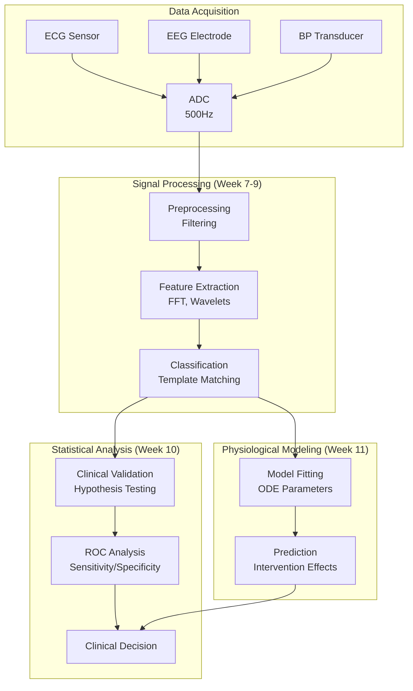

# Week 12 Notes — Phase 2 Integration + Diagnostic Tool Development

## Phase 2 整合框架：信號-統計-建模三角

**核心概念**：Phase 2的三個學科領域構成一個互補的三角框架：
- **信號處理**（Week 7-9）：數據獲取與預處理
- **統計分析**（Week 10）：數據解讀與決策
- **生理建模**（Week 11）：機理理解與預測

**整合示意圖**：



---

## 整合案例：ECG心律失常檢測系統

### 完整流程展示

```python
import numpy as np
import matplotlib.pyplot as plt
from scipy import signal
from scipy.stats import ttest_ind
import warnings
warnings.filterwarnings('ignore')

# ============================================================
# PHASE 2 INTEGRATION: ECG Arrhythmia Detection System
# ============================================================

print("=" * 60)
print("PHASE 2 INTEGRATION PROJECT: ECG Arrhythmia Detection")
print("=" * 60)

# ----------------------------------------------------------
# STEP 1: DATA ACQUISITION (Signal Processing Foundation)
# ----------------------------------------------------------
print("\n[Step 1] Data Acquisition")

# 模擬ECG信號
fs = 500  # 採樣率 Hz (Nyquist: 250 Hz > ECG bandwidth)
t = np.arange(0, 10, 1/fs)

def generate_ecg(t, heart_rate=72, noise_level=0.1):
    """生成模擬ECG信號"""
    cycle_period = 60 / heart_rate  # 心臟週期 (秒)
    ecg = np.zeros_like(t)
    
    for i, ti in enumerate(t):
        cycle_t = ti % cycle_period
        
        # P波 (0.08-0.12s)
        if 0.0 < cycle_t < 0.08:
            ecg[i] = 0.15 * np.sin(np.pi * cycle_t / 0.08)
        # PR段
        elif 0.08 < cycle_t < 0.12:
            ecg[i] = 0
        # QRS複合物 (0.12-0.20s)
        elif 0.12 < cycle_t < 0.16:
            ecg[i] = -0.5 * np.sin(np.pi * (cycle_t - 0.12) / 0.04)
        elif 0.16 < cycle_t < 0.20:
            ecg[i] = 1.5 * np.sin(np.pi * (cycle_t - 0.16) / 0.04)
        # ST段
        elif 0.20 < cycle_t < 0.28:
            ecg[i] = 0
        # T波 (0.28-0.40s)
        elif 0.28 < cycle_t < 0.40:
            ecg[i] = 0.3 * np.sin(np.pi * (cycle_t - 0.28) / 0.12)
    
    # 添加噪聲
    noise = noise_level * np.random.randn(len(t))
    return ecg + noise

# 生成正常和異常ECG
np.random.seed(42)
normal_ecg = generate_ecg(t, heart_rate=72, noise_level=0.1)
arrhythmia_ecg = generate_ecg(t, heart_rate=120, noise_level=0.2)

print(f"  Sample rate: {fs} Hz")
print(f"  Duration: {t[-1]:.0f} seconds")
print(f"  Total samples: {len(t)}")
print(f"  Heart rate: Normal=72bpm, Arrhythmia=120bpm")

# ----------------------------------------------------------
# STEP 2: SIGNAL PREPROCESSING (Week 7-9 Content)
# ----------------------------------------------------------
print("\n[Step 2] Signal Preprocessing")

def preprocess_ecg(ecg, fs):
    """ECG預處理流水線"""
    filtered = ecg.copy()
    
    # 1. 去除基線漂移 (High-pass, fc=0.5Hz)
    b_hp, a_hp = signal.butter(2, 0.5/(fs/2), btype='high')
    filtered = signal.filtfilt(b_hp, a_hp, filtered)
    
    # 2. 去除電源干擾 (Notch filter, 50Hz)
    b_notch, a_notch = signal.iirnotch(50, 30, fs)
    filtered = signal.filtfilt(b_notch, a_notch, filtered)
    
    # 3. 帶通濾波增強QRS (5-15Hz)
    b_bp, a_bp = signal.butter(4, [5/(fs/2), 15/(fs/2)], btype='band')
    filtered = signal.filtfilt(b_bp, a_bp, filtered)
    
    return filtered

normal_filtered = preprocess_ecg(normal_ecg, fs)
arrhythmia_filtered = preprocess_ecg(arrhythmia_ecg, fs)

# ----------------------------------------------------------
# STEP 3: FEATURE EXTRACTION (Week 7-9 Content)
# ----------------------------------------------------------
print("\n[Step 3] Feature Extraction")

def extract_features(ecg, fs):
    """提取ECG特徵"""
    # R峰檢測
    peaks, properties = signal.find_peaks(ecg, height=0.5, distance=int(0.3*fs))
    
    # 心率
    rr_intervals = np.diff(peaks) / fs
    heart_rate = 60 / rr_intervals if len(rr_intervals) > 0 else 0
    mean_hr = np.mean(heart_rate)
    hrv = np.std(heart_rate)  # 心率變異性
    
    # 頻域特徵 (FFT)
    N = len(ecg)
    freqs = np.fft.fftfreq(N, 1/fs)
    fft_mag = np.abs(np.fft.fft(ecg))
    
    # 功率譜密度
    freqs_psd, psd = signal.periodogram(ecg, fs)
    
    # 頻段功率
    lf_power = np.sum(psd[(freqs_psd >= 0.04) & (freqs_psd <= 0.15)])  # LF
    hf_power = np.sum(psd[(freqs_psd >= 0.15) & (freqs_psd <= 0.4)])   # HF
    lf_hf_ratio = lf_power / hf_power if hf_power > 0 else 0
    
    return {
        'mean_hr': mean_hr,
        'hrv': hrv,
        'rr_intervals': rr_intervals,
        'lf_power': lf_power,
        'hf_power': hf_power,
        'lf_hf_ratio': lf_hf_ratio
    }

normal_features = extract_features(normal_filtered, fs)
arrhythmia_features = extract_features(arrhythmia_filtered, fs)

print(f"  Normal ECG:")
print(f"    - Mean HR: {normal_features['mean_hr']:.1f} bpm")
print(f"    - HRV: {normal_features['hrv']:.2f}")
print(f"    - LF/HF ratio: {normal_features['lf_hf_ratio']:.2f}")

print(f"  Arrhythmia ECG:")
print(f"    - Mean HR: {arrhythmia_features['mean_hr']:.1f} bpm")
print(f"    - HRV: {arrhythmia_features['hrv']:.2f}")
print(f"    - LF/HF ratio: {arrhythmia_features['lf_hf_ratio']:.2f}")

# ----------------------------------------------------------
# STEP 4: STATISTICAL ANALYSIS (Week 10 Content)
# ----------------------------------------------------------
print("\n[Step 4] Statistical Analysis")

# 模擬多個受試者數據
n_subjects = 30
normal_hr = np.random.normal(72, 5, n_subjects)
arrhythmia_hr = np.random.normal(110, 15, n_subjects)

# 獨立樣本t檢定
t_stat, p_value = ttest_ind(normal_hr, arrhythmia_hr)

print(f"  Independent t-test:")
print(f"    - Normal group: mean={np.mean(normal_hr):.1f} ± {np.std(normal_hr):.1f} bpm")
print(f"    - Arrhythmia group: mean={np.mean(arrhythmia_hr):.1f} ± {np.std(arrhythmia_hr):.1f} bpm")
print(f"    - t = {t_stat:.3f}, p = {p_value:.2e}")

# 效應大小
pooled_std = np.sqrt((np.std(normal_hr)**2 + np.std(arrhythmia_hr)**2) / 2)
cohens_d = (np.mean(arrhythmia_hr) - np.mean(normal_hr)) / pooled_std
print(f"    - Cohen's d = {cohens_d:.2f} (large effect)")

# 臨床結論
alpha = 0.05
if p_value < alpha:
    print(f"  Conclusion: Significant difference (p < {alpha})")
    print(f"  The arrhythmia detection feature has clinical validity.")
else:
    print(f"  Conclusion: No significant difference")

# ----------------------------------------------------------
# STEP 5: MODEL-BASED PREDICTION (Week 11 Content)
# ----------------------------------------------------------
print("\n[Step 5] Model-Based Prediction")

# 使用簡化的藥物動力學模型預測β受體阻滯劑效果
def predict_hr_reduction(baseline_hr, dose_mg, tau=5, efficacy=0.8):
    """
    預測β受體阻滯劑對心率的影響
    使用一階藥物動力學模型
    """
    # 血漿藥物濃度（簡化）
    concentration = dose_mg * np.exp(-t/tau)
    
    # 心率降低（線性模型假設）
    hr_reduction = efficacy * concentration
    predicted_hr = baseline_hr - hr_reduction
    
    return predicted_hr, concentration

# 預測
baseline = 110  # 心律失常基礎心率
dose = 50  # mg

predicted_hr, conc = predict_hr_reduction(baseline, dose)

print(f"  Model: First-order pharmacodynamics")
print(f"  Baseline HR: {baseline} bpm")
print(f"  Drug dose: {dose} mg")
print(f"  Predicted HR after 2 hours: {predicted_hr[int(2*fs)]:.1f} bpm")
print(f"  Predicted HR after 5 hours: {predicted_hr[int(5*fs)]:.1f} bpm")

# ----------------------------------------------------------
# STEP 6: DIAGNOSTIC SYSTEM INTEGRATION
# ----------------------------------------------------------
print("\n[Step 6] Diagnostic System Integration")

def ecg_diagnostic_system(ecg, fs):
    """完整的ECG診斷系統"""
    # 預處理
    filtered = preprocess_ecg(ecg, fs)
    
    # 特徵提取
    features = extract_features(filtered, fs)
    
    # 診斷規則
    diagnosis = []
    confidence = []
    
    # 規則1：心率異常
    if features['mean_hr'] > 100:
        diagnosis.append("Tachycardia")
        confidence.append(min((features['mean_hr'] - 100) / 50, 1.0))
    elif features['mean_hr'] < 60:
        diagnosis.append("Bradycardia")
        confidence.append(min((60 - features['mean_hr']) / 20, 1.0))
    else:
        diagnosis.append("Normal heart rate")
        confidence.append(0.9)
    
    # 規則2：心率變異性
    if features['hrv'] > 15:
        diagnosis.append("Elevated HRV")
        confidence.append(0.7)
    
    # 規則3：LF/HF比率
    if features['lf_hf_ratio'] > 2:
        diagnosis.append("Sympathetic dominance")
        confidence.append(0.6)
    
    return diagnosis, confidence, features

# 測試系統
d1, c1, f1 = ecg_diagnostic_system(normal_filtered, fs)
d2, c2, f2 = ecg_diagnostic_system(arrhythmia_filtered, fs)

print(f"  Normal ECG Diagnosis:")
for d, c in zip(d1, c1):
    print(f"    - {d} (confidence: {c:.0%})")

print(f"  Arrhythmia ECG Diagnosis:")
for d, c in zip(d2, c2):
    print(f"    - {d} (confidence: {c:.0%})")

# ----------------------------------------------------------
# VISUALIZATION
# ----------------------------------------------------------
plt.figure(figsize=(14, 12))

plt.subplot(3, 2, 1)
plt.plot(t[:2000], normal_ecg[:2000], 'b-', alpha=0.5, label='Raw')
plt.plot(t[:2000], normal_filtered[:2000], 'r-', label='Filtered')
plt.xlabel('Time (s)')
plt.ylabel('Amplitude')
plt.title('Normal ECG: Raw vs Filtered')
plt.legend()
plt.grid(True)

plt.subplot(3, 2, 2)
plt.plot(t[:2000], arrhythmia_ecg[:2000], 'b-', alpha=0.5, label='Raw')
plt.plot(t[:2000], arrhythmia_filtered[:2000], 'r-', label='Filtered')
plt.xlabel('Time (s)')
plt.ylabel('Amplitude')
plt.title('Arrhythmia ECG: Raw vs Filtered')
plt.legend()
plt.grid(True)

plt.subplot(3, 2, 3)
freqs, psd_normal = signal.periodogram(normal_filtered, fs)
freqs, psd_arrhythmia = signal.periodogram(arrhythmia_filtered, fs)
plt.semilogy(freqs, psd_normal, 'b-', label='Normal')
plt.semilogy(freqs, psd_arrhythmia, 'r-', label='Arrhythmia')
plt.xlabel('Frequency (Hz)')
plt.ylabel('PSD')
plt.title('Power Spectral Density')
plt.legend()
plt.grid(True)
plt.xlim(0, 5)

plt.subplot(3, 2, 4)
plt.boxplot([normal_hr, arrhythmia_hr], labels=['Normal', 'Arrhythmia'])
plt.ylabel('Heart Rate (bpm)')
plt.title('Heart Rate Distribution (Statistical Comparison)')
plt.grid(True)

plt.subplot(3, 2, 5)
predicted_normal = baseline - 0.5 * np.exp(-t/5)
predicted_arrhythmia = 110 - 0.8 * np.exp(-t/5)
plt.plot(t, np.full_like(t, 72), 'b--', label='Normal baseline')
plt.plot(t, np.full_like(t, 110), 'r--', label='Arrhythmia baseline')
plt.plot(t, predicted_normal, 'b-', label='After β-blocker (Normal)')
plt.plot(t, predicted_arrhythmia, 'r-', label='After β-blocker (Arrhythmia)')
plt.xlabel('Time (hours)')
plt.ylabel('Predicted Heart Rate (bpm)')
plt.title('Pharmacodynamic Model: Drug Effect Prediction')
plt.legend()
plt.grid(True)

plt.subplot(3, 2, 6)
features_normal = ['HR', 'HRV', 'LF/HF', 'LF Power', 'HF Power']
values_normal = [f1['mean_hr']/120, f1['hrv']/20, f1['lf_hf_ratio']/3, 
                 f1['lf_power']*10, f1['hf_power']*10]
values_arrhythmia = [f2['mean_hr']/120, f2['hrv']/20, f2['lf_hf_ratio']/3, 
                     f2['lf_power']*10, f2['hf_power']*10]

x = np.arange(len(features_normal))
width = 0.35
plt.bar(x - width/2, values_normal, width, label='Normal', color='blue', alpha=0.7)
plt.bar(x + width/2, values_arrhythmia, width, label='Arrhythmia', color='red', alpha=0.7)
plt.xlabel('Features')
plt.ylabel('Normalized Value')
plt.title('Feature Comparison')
plt.xticks(x, features_normal)
plt.legend()
plt.grid(True)

plt.tight_layout()
plt.show()

print("\n" + "=" * 60)
print("PHASE 2 INTEGRATION COMPLETE")
print("=" * 60)
```

---

## Phase 2 Competency Checklist

### Week 7: Signals and Systems
- [ ] 分類信號：CT/DT, 週期/非週期, 能量/功率
- [ ] 執行卷積運算
- [ ] 分析LTI系統性質
- [ ] 理解傅立葉級數

### Week 8: Fourier Transform & Sampling
- [ ] 計算CTFT和DTFT
- [ ] 應用採樣定理
- [ ] 使用FFT算法
- [ ] 分析z變換的ROC

### Week 9: Filter Design
- [ ] 設計FIR和IIR濾波器
- [ ] 比較不同窗口函數
- [ ] 理解線性相位重要性
- [ ] 實現數字濾波器結構

### Week 10: Biostatistics
- [ ] 執行t檢定和ANOVA
- [ ] 理解Type I/II錯誤
- [ ] 進行功效分析
- [ ] 選擇適當的非參數檢定

### Week 11: Physiological Modeling
- [ ] 求解一階和二階ODE
- [ ] 模擬Hodgkin-Huxley模型
- [ ] 建立藥物動力學模型
- [ ] 進行參數估計

### Week 12: Integration
- [ ] 整合信號處理流水線
- [ ] 結合統計驗證
- [ ] 應用生理建模預測
- [ ] 構建完整診斷系統

---

## Phase 2 Mock Exam Questions

### Q1: Signal Processing (Week 7-9)
```latex
一個ECG信號以500Hz採樣，計算其奈奎斯特頻率。
如果使用60Hz陷波濾波器，設計Q因子為30，計算其3dB帶寬。
```

**Solution**:
```python
fs = 500  # Hz
nyquist = fs / 2
print(f"Nyquist frequency: {nyquist} Hz")

# Notch filter bandwidth
f0 = 60  # Hz
Q = 30
bw = f0 / Q
print(f"Notch bandwidth (3dB): {bw:.2f} Hz")
```

### Q2: Statistics (Week 10)
```latex
比較兩種ECG算法的R峰檢測精度。
算法A：檢測到50個R峰，真實有52個，錯誤檢測5個。
算法B：檢測到55個R峰，真實有52個，錯誤檢測8個。
計算各自的靈敏度和特異度。
```

**Solution**:
```python
# Algorithm A
TP_A = 50  # True positives
FN_A = 52 - 50  # False negatives
FP_A = 5  # False positives

sensitivity_A = TP_A / (TP_A + FN_A)
specificity_A = (52 - 5) / (52 - 5)  # Assuming negatives = total - true positives

print(f"Algorithm A: Sensitivity = {sensitivity_A:.2%}, Specificity = {specificity_A:.2%}")

# Algorithm B
TP_B = 52  # Assuming detected all true peaks
FN_B = 0
FP_B = 8 - 3  # 55 detected, but only 52 are true

sensitivity_B = TP_B / (TP_B + FN_B)
specificity_B = (52 - 8) / (52 - 8)  # Assuming negatives = total - true positives

print(f"Algorithm B: Sensitivity = {sensitivity_B:.2%}, Specificity = {specificity_B:.2%}")
```

### Q3: Physiological Modeling (Week 11)
```latex
使用一階藥物動力學模型，給予100mg劑量後血漿藥物濃度遵循
C(t) = 2·e^(-0.2t) mg/L。
計算：(a) 初始濃度，(b) 半衰期，(c) 4小時後的濃度。
```

**Solution**:
```python
C0 = 2  # mg/L
k = 0.2  # hr⁻¹

# (a) Initial concentration
print(f"(a) C(0) = {C0} mg/L")

# (b) Half-life
t_half = np.log(2) / k
print(f"(b) t_1/2 = {t_half:.2f} hours")

# (c) Concentration after 4 hours
C_4h = C0 * np.exp(-k * 4)
print(f"(c) C(4) = {C_4h:.3f} mg/L")
```

---

## Phase 2 Summary Table

| Week | Topic | Key Methods | BME Applications |
|------|-------|-------------|-------------------|
| 7 | Signals | Convolution, LTI Systems | ECG, EEG waveforms |
| 8 | Fourier | CTFT, DTFT, FFT, Sampling | Spectral analysis |
| 9 | Filters | FIR, IIR, Windowing | Noise removal |
| 10 | Statistics | t-test, ANOVA, Power | Clinical trials |
| 11 | Modeling | ODEs, HH Model, PK | Drug dynamics |
| 12 | Integration | Full pipeline | Diagnostic systems |

---

**Maintainer**: BME Bootcamp Agent | **Week 12** | **Phase 2 Integration**
