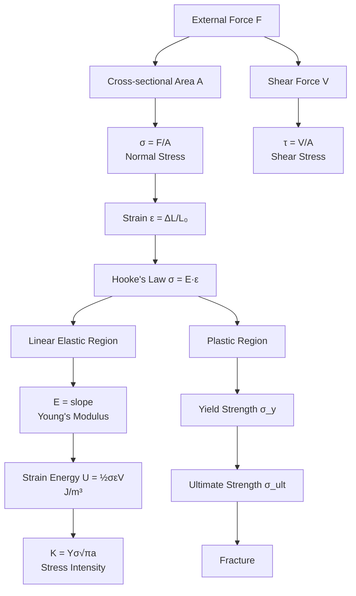
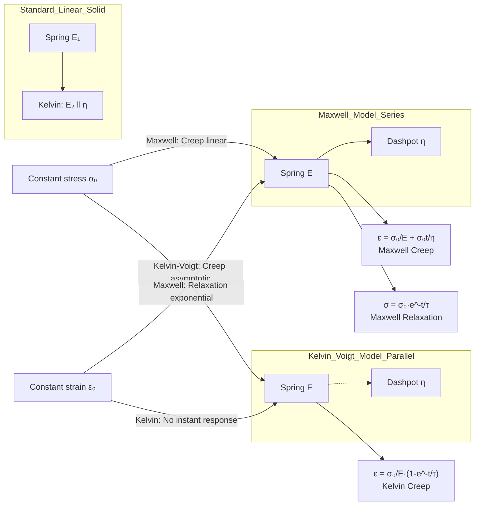
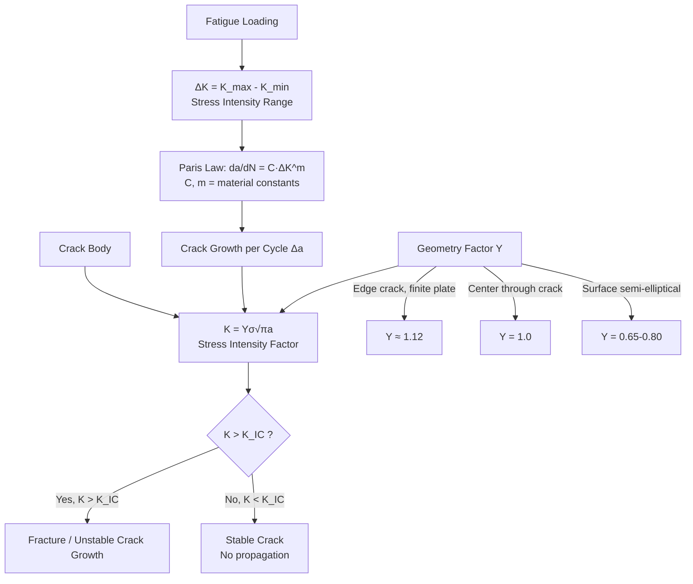
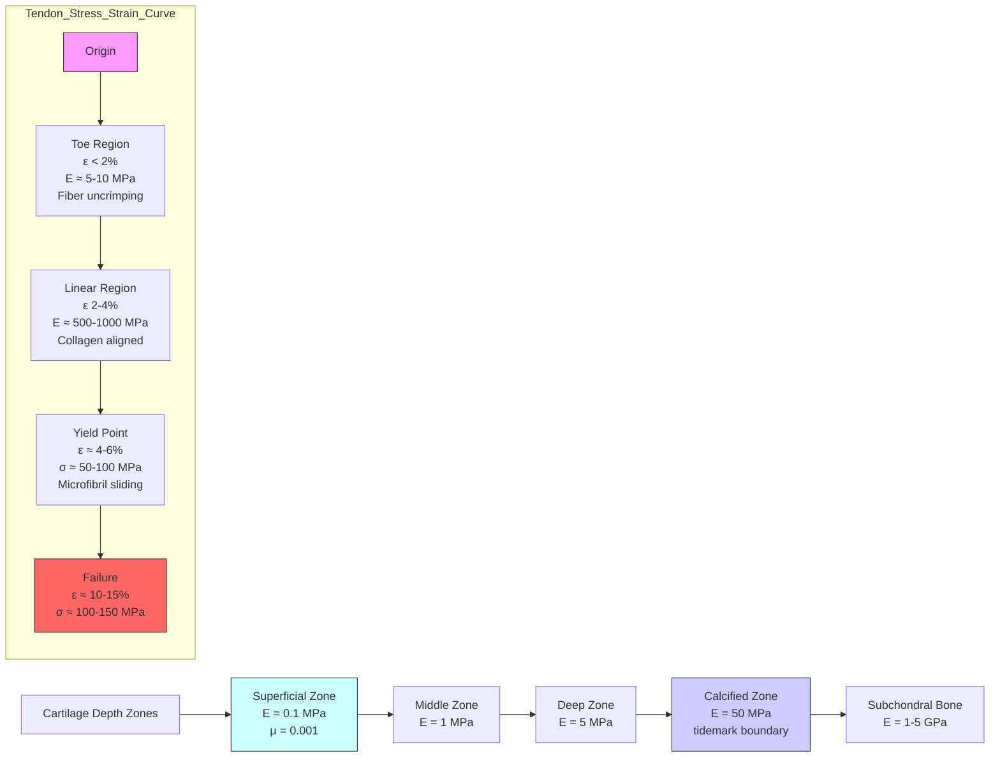
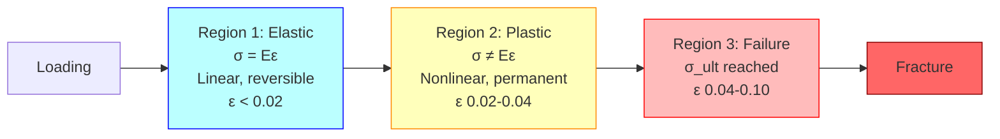
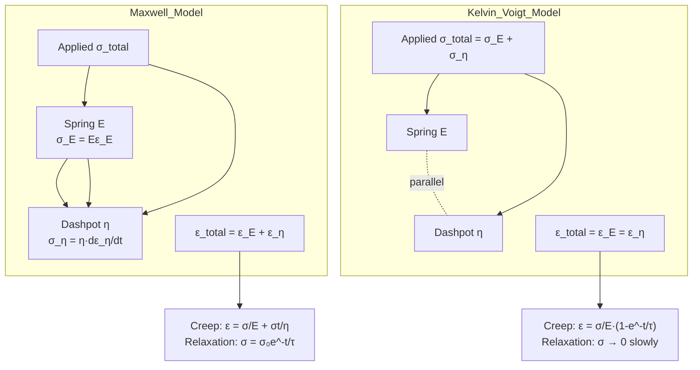
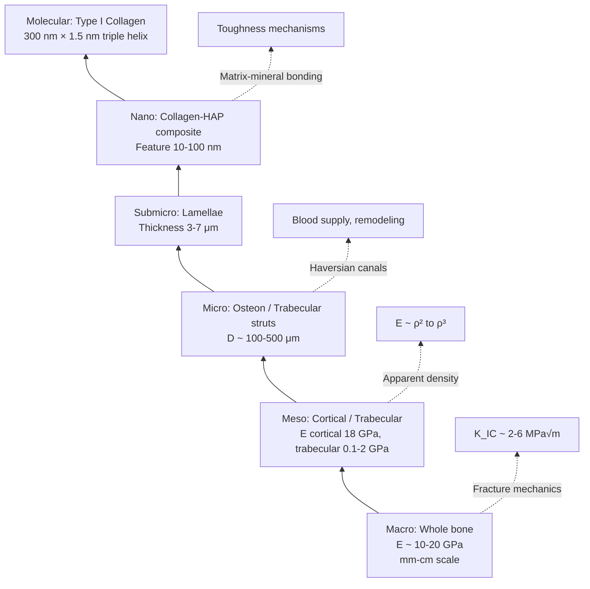
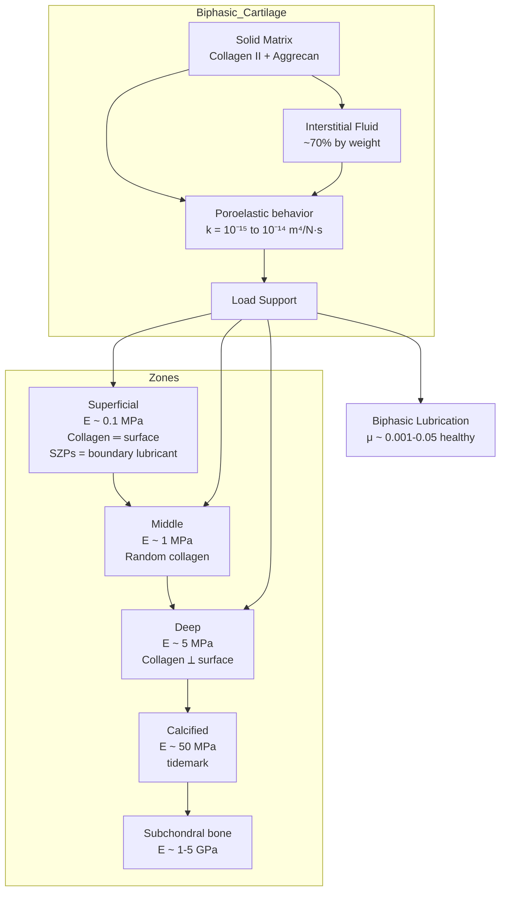
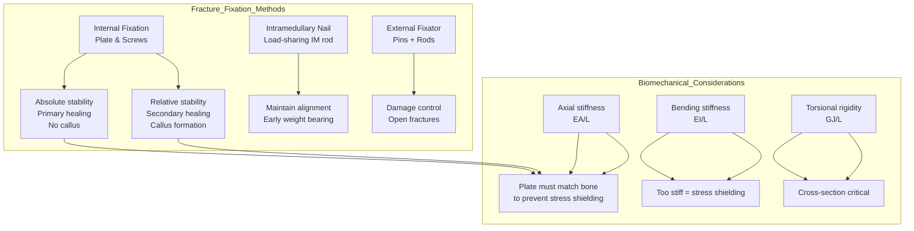

# Week 13 Notes — Biomechanics (Stress, Strain, Viscoelasticity)

> **Course**: BMED2600 — Biomechanics  
> **Week**: 13 of 24 | **Phase**: 3 (Core BME Applications)  
> **Prerequisites**: Engineering mechanics (CE), linear algebra, differential equations  
> **CE advantage**: Your statics/fluid mechanics foundations transfer directly to stress analysis

---

## 問題 1：5 個核心心智模型

### 1. Stress-Strain as Universal Language of Deformation / 應力-應變：變形的通用語言

**方程式**:
$$\sigma = \frac{F}{A} \quad \text{[Pa, N/m}^2\text{]}$$
$$\varepsilon = \frac{\Delta L}{L_0} = \frac{L - L_0}{L_0} \quad \text{[dimensionless]}$$

**Hooke's Law (Linear Elastic)**:
$$E = \frac{\sigma}{\varepsilon} \quad \text{[Pa, typically GPa for bone]}$$
$$\sigma = E \varepsilon$$

**Key numbers**:
| Material | E (Young's Modulus) | σ_yield | σ_ultimate |
|----------|---------------------|---------|-------------|
| Cortical bone | 10–20 GPa (avg ~18 GPa) | 100–130 MPa | 130–200 MPa |
| Trabecular bone | 0.1–2 GPa | 2–20 MPa | 5–50 MPa |
| Tendon | 0.5–1.0 GPa | 50–100 MPa | 50–150 MPa |
| Articular cartilage | 0.01–0.02 GPa (10–20 MPa) | — | — |
| PMMA (bone cement) | 2–3 GPa | 30–40 MPa | — |

**學者**: Robert Hooke (1678), Thomas Young (1807 — Young's modulus concept)

**BME application**: Hip prosthesis stem stress analysis; vertebral body load-bearing; fracture fixation plate design

---

### 2. Viscoelasticity: Time-Dependent Deformation / 黏彈性：時間依賴性變形

**Maxwell Model** (series: spring + dashpot):
$$\frac{d\varepsilon}{dt} = \frac{1}{E}\frac{d\sigma}{dt} + \frac{\sigma}{\eta}$$
**Creep**: $\varepsilon(t) = \frac{\sigma_0}{E} + \frac{\sigma_0}{\eta}t$
**Stress relaxation**: $\sigma(t) = \sigma_0 e^{-E t/\eta}$

**Kelvin-Voigt Model** (parallel: spring + dashpot):
$$\sigma(t) = E\varepsilon(t) + \eta\frac{d\varepsilon}{dt}$$
**Creep**: $\varepsilon(t) = \frac{\sigma_0}{E}\left(1 - e^{-t/\tau}\right)$ where $\tau = \frac{\eta}{E}$

**Standard Linear Solid (Zener model)** (series of Kelvin + spring):
$$\sigma + \tau_\sigma \dot{\sigma} = E_1\varepsilon + E_2\tau_\varepsilon\dot{\varepsilon}$$

**Relaxation times**: $\tau = \eta/E$ [seconds]
- Bone: τ ~ 0.1–10 s
- Tendon: τ ~ 10–100 s  
- Cartilage: τ ~ 100–1000 s

**Fung's Quasi-Linear Viscoelastic (QLV) Theory**:
$$S(t) = \frac{1}{1 + \frac{t}{t_1}} \quad \text{(reduced relaxation function)}$$
$$\sigma(t, \varepsilon) = G(t) \cdot \sigma^e(\varepsilon)$$
where $G(t)$ is a normalized relaxation function.

**學者**: Y.C. Fung (馮元楨, 1967, 1993) — *Biomechanics* textbook; Maxwell (1867); Kelvin (Voigt models)

**BME application**: Predicting creep in spinal discs under sustained load; designing vascular grafts that match arterial viscoelasticity; suture degradation timing

---

### 3. Shear Stress, Torsion, and 3D Stress State / 剪切應力與三維應力狀態

**Shear stress**:
$$\tau = \frac{VQ}{It} \quad \text{(beam shear)}$$
$$\tau_{max} = \frac{T \cdot r}{J} \quad \text{(circular shaft torsion)}$$

**Mohr's Circle** (transform 3D → principal stresses):
$$\sigma_{1,2} = \frac{\sigma_x + \sigma_y}{2} \pm \sqrt{\left(\frac{\sigma_x - \sigma_y}{2}\right)^2 + \tau_{xy}^2}$$

**Von Mises stress** (yield criterion for ductile materials):
$$\sigma_{vm} = \sqrt{\frac{(\sigma_1 - \sigma_2)^2 + (\sigma_2 - \sigma_3)^2 + (\sigma_3 - \sigma_1)^2}{2}}$$

**Bone fracture criterion**: σ_vm > σ_yield (~120 MPa cortical)

**BME application**: Femoral neck fracture under multi-axial loading; dental implant thread shear; screw pull-out strength

---

### 4. Strain Energy and Failure Criteria / 應變能與破壞準則

**Strain energy density**:
$$U = \frac{1}{2}\sigma\varepsilon = \frac{1}{2}E\varepsilon^2 = \frac{\sigma^2}{2E} \quad \text{[J/m}^3\text{]}$$

**Strain energy release rate** (Fracture mechanics):
$$G = -\frac{dU}{dA} \quad \text{[J/m}^2\text{ = N/m]}$$
$$K_I = Y\sigma\sqrt{\pi a} \quad \text{[MPa√m]}$$
$$K_{IC} \text{ (cortical bone)} \approx 2-6 \text{ MPa√m}$$

**Brittle vs. ductile failure**:
- **Brittle** (ceramics, osteoporotic bone): σ_ultimate ≈ σ_yield; low toughness
- **Ductile** (metal implants): significant plastic deformation before failure

**BME application**: Hip fracture prediction in osteoporotic patients; design of fracture fixation plates; fatigue life of pacemaker leads

---

### 5. Soft Tissue Biomechanics: Tendon, Ligament, Cartilage / 軟組織生物力學

**Tendon stress-strain** (non-linear, J-shaped curve):
$$\sigma = A(e^{B\varepsilon} - 1)$$
- **Toe region**: ε < 2%, collagen fibers uncrimping, E ~ 5–10 MPa
- **Linear region**: ε 2–4%, E ~ 0.5–1.0 GPa  
- **Yield point**: ε ~ 4–6%, σ ~ 50–100 MPa
- **Failure**: ε ~ 10–15%, σ ~ 100–150 MPa

**Cartilage** (depth-dependent properties):
| Zone | Modulus E | Proteoglycan | Collagen orientation |
|------|-----------|--------------|---------------------|
| Superficial | 0.1 MPa | Low | Parallel to surface |
| Middle | 1 MPa | High | Random |
| Deep | 5 MPa | Highest | Perpendicular to surface |
| Calcified | 50 MPa | Low | Perpendicular |

**Ligament vs. Tendon**: Both are dense regular connective tissue; ligaments connect bone-to-bone (more multidirectional), tendons connect muscle-to-bone (more unidirectional)

**學者**: Woo, Abramowitch, Butler (ligament biomechanics); Mow & Lai (cartilage biphasic theory, 1980)

**BME application**: ACL reconstruction graft selection; osteoarthritis cartilage repair; tendon repair suture techniques

---

## 問題 2：3 個根本分歧

### 分歧 1：Elastic vs. Viscoelastic Models — Which Reality?

**Elastic models** (Hooke, σ = Eε): Assume instantaneous, reversible, time-independent response. Simple, computationally efficient, valid for rapid loading of stiff materials (bone at high strain rates).

**Viscoelastic models** (Maxwell/Kelvin-Voigt): Include time-dependent effects — creep, stress relaxation, hysteresis. Essential for soft tissues and loading over >1 second.

**Resolution**: Use viscoelastic models when loading duration > τ (relaxation time) AND material exhibits time-dependent behavior. For short-duration impact loading of bone: elastic approximation is acceptable. For long-duration joint loading: must use viscoelastic. **Fung's QLV theory** (used in soft tissue literature) is the gold standard compromise.

---

### 分歧 2：Cortical vs. Trabecular Bone — One Material or Two?

**Cortical (compact) bone**: Dense, E ~ 18 GPa, porosity < 5%, isotropic-ish (anisotropic in longitudinal vs. transverse directions), forms outer shell of long bones.

**Trabecular (cancellous) bone**: Spongy, E ~ 0.1–2 GPa, porosity 50–90%, highly anisotropic (properties depend on trabecular orientation), fills epiphyses and metaphyses.

**Resolution**: Both are composite materials (hydroxyapatite mineral + collagen type I). Trabecular architecture (rod vs. plate) determines effective stiffness. Use **apparent density** (ρ) to correlate:
$$E = E_0 \cdot \rho^n \quad \text{(n ≈ 2–3, }E_0\approx 3\text{ GPa)}$$
Bone is **orthotropic** at the continuum level, requiring 9 elastic constants. Treat as distinct material classes for engineering design.

---

### 分歧 3：Continuum Mechanics vs. Microscopic Hierarchical Structure

**Continuum approach**: Treat bone as homogeneous material, assign bulk E, σ_yield. Works for macroscopic design (implant sizing, fixation plate thickness).

**Microscopic/hierarchical approach**: Bone is a composite at multiple scales — lamellae (10 μm), osteons (200 μm Haversian systems), lamellar structure. Microcracks initiate at osteon boundaries. This is the domain of **Bone Quality** research.

**Resolution**: Both scales are necessary. Use continuum mechanics for design; use hierarchical models to understand failure mechanisms. The **mineral-collagen composite** explanation of crack bridging is critical for understanding toughness.

---

## 問題 3：10 個深度問題

1. Why does cortical bone have a longitudinal Young's modulus (~18 GPa) different from transverse (~10 GPa)? What is the ultrastructural basis?
2. The Kelvin-Voigt model predicts zero instantaneous strain when a load is applied, but real tendons show some immediate deformation. How does the Standard Linear Solid resolve this?
3. In a femoral hip prosthesis, the stem is metal (E ~ 200 GPa) and surrounding bone is ~18 GPa. What is "stress shielding" and how does it lead to periprosthetic bone loss?
4. A patient with osteoporosis has trabecular bone apparent density ρ = 0.3 g/cm³. Estimate E using the Gibson-Ashby model. What does this imply for vertebral body strength?
5. How does loading rate affect bone's apparent mechanical properties? (strain rate sensitivity)
6. The quasi-linear viscoelastic (QLV) theory of Fung separates elastic and time-dependent responses. What is the biological basis for this factorization?
7. Why does articular cartilage exhibit a biphasic (solid matrix + interstitial fluid) response? What is the role of the superficial zone in joint tribology?
8. Derive the relationship between stress intensity factor K and strain energy release rate G. When does K = G/σ_0 hold?
9. In ACL reconstruction, the graft stiffness (E, cross-sectional area) directly affects joint mechanics. Design criteria: graft should match native ACL stiffness (~200 N/mm)?
10. A collagen fiber in tendon has a diameter d = 100 nm. Using the rule of mixtures for a fiber composite, estimate effective modulus if collagen E_col = 5 GPa and ground substance E_gs = 0.5 MPa.

---

# 核心概念深化（中英對照）

## 1. 應力-應變分析 Stress-Strain Analysis

### 1.1 中英對照 Bilingual Definitions

| 中文 | English |
|------|---------|
| 應力 (Stress) | Force per unit area; internal resistance to external loading |
| 應變 (Strain) | Dimensionless measure of deformation relative to original length |
| 彈性模量 (Young's Modulus) | Slope of the linear σ-ε region; stiffness parameter |
| 彈性極限 (Elastic Limit) | Maximum stress before permanent (plastic) deformation |
| 屈服強度 (Yield Strength) | Stress at which 0.2% permanent strain occurs (offset method) |
| 極限強度 (Ultimate Strength) | Maximum stress sustained before failure |
| 泊松比 (Poisson's Ratio) | ν = -ε_lat/ε_ax; transverse vs. axial strain ratio |
| 剪切模量 (Shear Modulus) | G = E / [2(1+ν)] |

### 1.2 推導 Derivation

**From Hooke's Law to 3D Constitutive Matrix**:

Linear elasticity in 3D (generalized Hooke's Law):
$$\begin{pmatrix} \sigma_x \\ \sigma_y \\ \sigma_z \\ \tau_{xy} \\ \tau_{yz} \\ \tau_{zx} \end{pmatrix} = \begin{bmatrix} C \end{bmatrix} \begin{pmatrix} \varepsilon_x \\ \varepsilon_y \\ \varepsilon_z \\ \gamma_{xy} \\ \gamma_{yz} \\ \gamma_{zx} \end{pmatrix}$$

For isotropic materials, only 2 independent constants needed (E, ν):
$$\varepsilon_x = \frac{1}{E}[\sigma_x - \nu(\sigma_y + \sigma_z)]$$

**Thermal strain**:
$$\varepsilon_{th} = \alpha \Delta T$$
where α = coefficient of thermal expansion (bone: α ≈ 10-15 × 10⁻⁶/°C)

### 1.3 BME 應用 Applications

**Hip prosthesis design**: The femoral stem experiences σ_max ≈ 100-200 MPa during walking (peak load ~3× body weight ≈ 2.4 kN for 80 kg person; stem CSA ~ 200-400 mm² → σ ≈ 6-12 MPa static, but stress concentration at tip can reach 100+ MPa). Design must keep σ < σ_yield of Ti alloy (~880 MPa).

**Vertebroplasty**: Injecting PMMA bone cement (E ~ 2-3 GPa) into osteoporotic vertebra (E ~ 0.5-2 GPa) increases stiffness but creates stress concentration at cement-bone interface.

### 1.4 Deep Test 深度測試

**Q**: A cortical bone specimen (L₀ = 50 mm, d = 8 mm) is loaded to F = 5000 N. Calculate:
(a) σ = F/A = 5000 / [π(4mm)²] = 5000 / 50.27 mm² = 99.5 MPa
(b) If E = 18 GPa, ε = σ/E = 99.5 MPa / 18000 MPa = 0.00553 = 0.553%
(c) ΔL = ε × L₀ = 0.00553 × 50 mm = 0.277 mm
(d) After yielding at σ_y = 120 MPa, plastic strain occurs; ε_plastic = (120 - 99.5)/E_slope → beyond scope.

### 1.5 圖解 Diagram



---

## 2. 黏彈性建模 Viscoelastic Modeling

### 2.1 中英對照 Bilingual

| 中文 | English |
|------|---------|
| 蠕變 (Creep) | Time-dependent increase in strain under constant stress |
| 應力弛豫 (Stress Relaxation) | Time-dependent decrease in stress under constant strain |
| 儲能模量 (Storage Modulus) | E' — elastic (in-phase) component of complex modulus |
| 損耗模量 (Loss Modulus) | E'' — viscous (out-of-phase) component |
| 損耗因子 (Loss Tangent) | tan δ = E''/E'; indicates damping ability |
| 松弛時間 (Relaxation Time) | τ = η/E; characteristic time scale of viscoelastic response |

### 2.2 推導 Derivation

**Complex modulus representation** (dynamic mechanical analysis):
$$E^*(\omega) = E'(\omega) + iE''(\omega)$$
$$E' = \frac{\sigma_0 \cos\delta}{\varepsilon_0} \quad E'' = \frac{\sigma_0 \sin\delta}{\varepsilon_0}$$

**Prony series** (generalized viscoelastic model):
$$E(t) = E_\infty + \sum_{i=1}^{n} E_i e^{-t/\tau_i}$$

**Time-Temperature Superposition Principle (TTSP)**:
Shift factor $a_T$ obeys Williams-Landel-Ferry (WLF) equation:
$$\log_{10} a_T = \frac{-C_1(T - T_r)}{C_2 + (T - T_r)}$$
This allows master curves of viscoelastic data across temperatures.

### 2.3 BME 應用 Applications

**Spinal fusion cages**: PEKK polymer (E ~ 4-5 GPa) implants in interbody space. Under constant body load (~700 N lumbar spine), creep of the polymer over months causes loss of disc height restoration. Choose materials with low creep rate or reinforce with carbon fiber.

**Vascular grafts**: PTFE (ePTFE) has viscoelastic properties that match arterial compliance (reducing compliance mismatch and intimal hyperplasia). Graft compliance C = (Δd/d)/ΔP; native artery C ~ 5-10%/100 mmHg.

**Drug-eluting stents**: Polymer coating undergoes stress relaxation, affecting drug release kinetics. Viscoelastic properties of PLGA control diffusion-controlled release over 30 days.

### 2.4 Deep Test

**Q**: A Kelvin-Voigt element (E = 1 GPa, η = 10 GPa·s) is loaded with σ₀ = 10 MPa. Calculate:
(a) τ = η/E = 10 GPa·s / 1 GPa = 10 s
(b) At t = 10 s: ε = (σ₀/E)(1 - e⁻¹) = (10 MPa/1000 MPa)(1 - 0.368) = 0.00632 = 0.632%
(c) As t → ∞: ε = σ₀/E = 10/1000 = 1.0% (equilibrium strain)
(d) At t = 1 s: ε = (0.01)(1 - e⁻⁰·¹) = 0.01 × 0.095 = 0.00095 = 0.095%

### 2.5 圖解 Diagram



---

## 3. 骨骼力學 Bone Mechanics

### 3.1 中英對照 Bilingual

| 中文 | English |
|------|---------|
| 皮質骨 (Cortical Bone) | Dense outer bone layer; compact bone |
| 松質骨 / 小樑骨 (Trabecular Bone) | Spongy inner bone; cancellous bone |
| 骨密質 (Cortical Thickness) | Typical 1–7 mm in femur diaphysis |
| 骨礦密度 (BMD) | Bone Mineral Density; g/cm² by DXA scan |
| 骨质量 (Bone Quality) | Architecture, remodeling, microdamage, collagen |
| 哈佛氏系統 (Haversian System) | Osteon — cylindrical unit in cortical bone |

### 3.2 推導 Derivation

**Apparent density model** (Gibson & Ashby, 1988):
$$E = E_0 \cdot \rho^* {}^n \quad \text{where } n \approx 2 \text{ for open-cell foam}$$

For trabecular bone (ρ* = apparent density, ρ_solid ≈ 1.9 g/cm³):
$$E \approx 3.39 \text{ GPa} \times \left(\frac{\rho^*}{1.9}\right)^2$$

**Fatigue damage accumulation** (Martin model):
$$\frac{dD}{dt} = \left(\frac{\sigma_a}{A}\right)^m \cdot (1-D)^{b-1}$$
where D = damage fraction (0→1), A, m, b are material constants.

**Bone remodeling (Wolff's law)** — mechanostat theory (Frost, 1987):
$$\text{Tissue strain } \varepsilon \begin{cases} > 1500 \mu\varepsilon: & \text{bone formation} \\ 800-1500 \mu\varepsilon: & \text{quiescent} \\ < 800 \mu\varepsilon: & \text{bone resorption} \end{cases}$$

### 3.3 BME 應用

**Osteoporosis**: T-score < -2.5 SD. Trabecular BMD drops from ~0.25 g/cm² to ~0.10 g/cm². Vertebral compression fractures occur at loads of 200-300 kgf instead of normal 500-600 kgf.

**Bone fracture fixation**: Compression plating. **Load sharing**: if bone bears >50% load → relative stability (callus secondary healing). If implant bears >50% → absolute stability (direct osteonal healing).

**Orthopaedic implants**: Ti-6Al-4V (E = 110 GPa, σ_y = 880 MPa). Bone stress shielding → disuse osteopenia. Solution: add porosity (laser melting) to reduce E toward 20-30 GPa.

### 3.4 Deep Test

**Q**: A cortical bone specimen with longitudinal orientation has E = 18 GPa, ν = 0.30. Calculate G (shear modulus) and K (bulk modulus).

$$G = \frac{E}{2(1+\nu)} = \frac{18}{2(1.30)} = \frac{18}{2.60} = 6.92 \text{ GPa}$$
$$K = \frac{E}{3(1-2\nu)} = \frac{18}{3(1-0.60)} = \frac{18}{3 \times 0.40} = \frac{18}{1.20} = 15 \text{ GPa}$$

### 3.5 圖解 Diagram

```mermaid
graph TD
    subgraph Hierarchical_Structure_Bone
        H1[Macroscale<br>Whole bone<br>E ~ 10-20 GPa] --> H2[Mesoscale<br>Cortical / Trabecular<br>μm-cm]
        H2 --> H3[Microscale<br>Osteons / Trabeculae<br>100-500 μm]
        H3 --> H4[Submicron<br>Lamellae<br>1-10 μm]
        H4 --> H5[ nanoscale<br>Collagen-HAP<br>1-100 nm]
        H5 --> H6[Molecular<br>Type I Collagen<br>Triple helix 300 nm]
    end
    
    H1 --> BM[Bone Mass<br>DXA T-score]
    H2 --> ARCH[Trabecular Architecture<br>Rod vs Plate]
    H3 --> OSTEON[Osteon<br>Haversian canal]
    H5 --> MINERAL[Mineral Crystals<br>Ca₁₀(PO₄)₆(OH)₂]
    H6 --> COLLAGEN[Collagen Fibrils<br>Staggered assembly]
    
    COLLAGEN --> X[Cross-linking pyridinolines]
    MINERAL --> Y[Carbonate substitution]
    X --> Z[Mechanical properties<br>depend on both]
```

---

## 4. 應變能與斷裂力學 Strain Energy and Fracture Mechanics

### 4.1 中英對照 Bilingual

| 中文 | English |
|------|---------|
| 應變能 (Strain Energy) | U = ∫σdε; energy stored in deformed body |
| 韌性 (Toughness) | Energy absorbed before fracture; U_total/V |
| 應變能釋放率 (Strain Energy Release Rate) | G = -∂U/∂A; driving force for crack propagation |
| 應力強度因子 (Stress Intensity Factor) | K = Yσ√πa; singular stress field near crack tip |
| 斷裂韌性 (Fracture Toughness) | K_IC; critical K at fracture |
| 裂紋擴展 (Crack Propagation) | Δa; stable vs. unstable crack growth |

### 4.2 推導 Derivation

**Energy release rate from Griffith (1920)**:
$$G = -\frac{dU}{dA} = \frac{2\gamma_s}{c} \quad \text{[J/m}^2\text{]}$$

**Relationship between G and K** (for plane stress):
$$G = \frac{K_I^2}{E'} \quad \text{where } E' = E \text{ (plane stress), } E' = \frac{E}{1-\nu^2} \text{ (plane strain)}$$

**Paris Law** for fatigue crack growth:
$$\frac{da}{dN} = C(\Delta K)^m$$
- For cortical bone: C ≈ 10⁻⁸ to 10⁻⁶ mm/cycle, m ≈ 3-6
- Threshold ΔK_th ≈ 0.3-1.0 MPa√m

### 4.3 BME 應用

**Hip fracture in elderly**: Subcapital femoral neck fracture. Crack initiates at superior (tensile) aspect of femoral neck. K_IC of cortical bone ~ 2-6 MPa√m. Applied stress from standing ~20 MPa; with notch/senior's microcracks, K can exceed K_IC at a ≈ 1-5 mm crack size.

**Vertebral endplate fracture**: Crack in subchondral bone plate (E ~ 1-2 GPa, thickness ~0.5-1 mm). Schmorl's nodes (herniation through endplate) create stress concentrations.

### 4.4 Deep Test

**Q**: A long bone has a surface crack of length a = 2 mm. Under physiological load σ = 50 MPa, K = Yσ√πa = 1.0 × 50 × √(3.14 × 0.002) = 50 × 0.079 = 3.95 MPa√m. Given K_IC = 5 MPa√m, is this sufficient to cause fracture? Margin of safety = 5/3.95 = 1.27 (marginally safe — high risk given crack growth).

### 4.5 圖解 Diagram



---

## 5. 軟組織非線性力學 Soft Tissue Nonlinear Mechanics

### 5.1 中英對照 Bilingual

| 中文 | English |
|------|---------|
| 膠原蛋白 (Collagen) | Primary tensile load-bearing protein in tendon/ligament |
| 彈性蛋白 (Elastin) | Provides elastic recoil; abundant in arteries, skin |
| 蛋白聚糖 (Proteoglycans) | Water retention, compressive resistance in cartilage |
| 波形區 (Toe Region) | Low-stiffness initial region; fiber uncrimping |
| 應變硬化 (Strain Hardening) | Increased stiffness at high strain |
| 各向異性 (Anisotropy) | Direction-dependent mechanical properties |
| 韌帶 (Ligament) | Connects bone to bone; multidirectional collagen |
| 肌腱 (Tendon) | Connects muscle to bone; nearly unidirectional |

### 5.2 推導 Derivation

**Collagen fiber recruitment model** (Hurschler et al.):
$$\sigma(\varepsilon) = \sum_{i=1}^{n} f_i(\varepsilon) \cdot k_i \cdot (\varepsilon - \varepsilon_i^t)^p$$
where f_i = fraction of fibers at angle θ_i, k_i = fiber modulus.

**Gent (1999) model** (tendon/ligament):
$$\sigma = \frac{E_0 \varepsilon}{1 - \varepsilon/\varepsilon_L}$$
where ε_L = limiting strain (typically 0.09-0.15 for tendon).

**Quasi-Linear Viscoelastic (QLV)** Fung (1993):
$$\sigma(t, \varepsilon) = \int_0^t G(t-\tau) \cdot \frac{\partial \sigma^e(\varepsilon)}{\partial \tau} \cdot d\tau$$

### 5.3 BME 應用

**Tendon repair**: Suture techniques (Kessler, Mason-Allen) must match tendon stiffness. Graft material stiffness: 
- Patellar tendon graft: E ≈ 400-600 MPa, CSA ≈ 35-45 mm² → stiffness ≈ 200-280 N/mm
- Hamstring graft: 4-5 strands × 100 MPa × CSA per strand

**Cartilage tribology**: Superficial zone protein (SZP/proteoglycan-4) acts as boundary lubricant. Coefficient of friction μ ≈ 0.001-0.05 in healthy cartilage vs. 0.1-0.3 in osteoarthritic.

### 5.4 Deep Test

**Q**: Tendon cross-sectional area = 50 mm², E = 0.8 GPa, length = 10 cm. What is tendon stiffness k = EA/L?
$$k = \frac{0.8 \text{ GPa} \times 50 \text{ mm}^2}{100 \text{ mm}} = \frac{800 \text{ N/mm}^2 \times 50}{100} = \frac{40,000}{100} = 400 \text{ N/mm}$$

### 5.5 圖解 Diagram



---

# 深度自測問題詳解

## Multiple Choice Questions (MCQs)

**Q1.** A cortical bone specimen (diameter 10 mm) is pulled with 15,000 N. What is the stress?
- A. 1.5 MPa  
- B. 15 MPa  
- C. 150 MPa  
- D. 191 MPa ✓  
- E. 1910 MPa

*Solution*: A = π(5mm)² = 78.54 mm² = 7.854×10⁻⁵ m². σ = 15,000/7.854×10⁻⁵ = 191 MPa.

**Q2.** In a Kelvin-Voigt model, a step stress σ₀ is applied. At t → ∞, the strain approaches:
- A. 0  
- B. σ₀/E  
- C. σ₀t/η  
- D. σ₀/E · e^(-t/τ)  
- E. Infinite

*Solution*: B — Equilibrium strain = σ₀/E (spring alone carries the load at long times).

**Q3.** Cortical bone Young's modulus E is approximately:
- A. 0.1-0.5 GPa  
- B. 1-5 GPa  
- C. 10-20 GPa ✓  
- D. 50-100 GPa  
- E. 200 GPa

*Solution*: C — Cortical bone E ≈ 18 GPa (similar to aluminum, much lower than steel 200 GPa).

**Q4.** The Poisson's ratio ν of cortical bone is approximately:
- A. 0.05  
- B. 0.15  
- C. 0.30 ✓  
- D. 0.50  
- E. 0.90

*Solution*: C — ν ≈ 0.28-0.35 for cortical bone (incompressible limit is 0.5 for biological tissues with high water content).

**Q5.** Which model predicts non-zero instantaneous strain under step stress?
- A. Maxwell  
- B. Kelvin-Voigt  
- C. Standard Linear Solid ✓  
- D. All of the above  
- E. None of the above

*Solution*: C — The parallel spring E₁ in the Standard Linear Solid provides instant response.

**Q6.** The mineral content in cortical bone is approximately:
- A. 5-10% by weight  
- B. 20-30% by weight  
- C. 35-45% by weight ✓  
- D. 60-70% by weight  
- E. 80-90% by weight

*Solution*: C — ~65% mineral by weight, ~35% organic (90% collagen type I) by weight. In volume: ~40% mineral, ~35% organic, ~25% water.

**Q7.** The relaxation time τ in a Maxwell model is defined as:
- A. E·η  
- B. η/E ✓  
- C. E/η  
- D. 1/(E·η)  
- E. (E+η)/η

*Solution*: B — τ = η/E (units: Pa·s / Pa = seconds).

**Q8.** Von Mises stress is used as yield criterion for:
- A. Brittle materials  
- B. Ductile materials ✓  
- C. Viscoelastic materials  
- D. Composite materials  
- E. Porous materials

*Solution*: B — Von Mises (distortional energy theory) applies to ductile materials that yield under shear stress.

**Q9.** Trabecular bone apparent modulus scales approximately with the square of:
- A. Strain rate  
- B. Apparent density ✓  
- C. Age  
- D. Calcium content  
- E. Water content

*Solution*: B — E ≈ E₀ · (ρ/ρ_solid)² (Gibson-Ashby model for open-cell foams).

**Q10.** The Larmor equation for MRI (ω = γB₀) relates frequency to:
- A. Gradient coil strength  
- B. RF pulse amplitude  
- C. Static magnetic field B₀ ✓  
- D. Patient heart rate  
- E. Slice selection gradient

*Solution*: C — The Larmor frequency is proportional to B₀: at 3T, f₀ = 123.2 MHz; at 7T, f₀ = 298 MHz.

---

## Short Answer Questions

**SQ1.** Explain why bone exhibits strain-rate dependent mechanical properties. Include at least two mechanisms at the microstructural level.

**Answer**: Bone is a viscoelastic composite material whose mechanical response depends on loading rate through several mechanisms: (1) **Viscous flow in the collagen matrix** — at higher strain rates, there is less time for viscous relaxation, resulting in higher apparent stiffness and strength. (2) **Fluid flow through the lacuno-canalicular network** — at quasi-static rates, interstitial fluid can flow, dissipating energy (poroelastic effect). At high strain rates, fluid cannot escape fast enough, creating internal pressure that increases apparent stiffness. (3) **Microcrack formation rate** — at low rates, microcracks have time to propagate stably (R-curve behavior), reducing apparent strength. (4) **Viscoelastic collagen matrix** — the collagen phase itself exhibits time-dependent behavior, with the relaxation time τ ~ 1-10 s for cortical bone. Typical values: E increases from ~15 GPa at 0.001/s strain rate to ~25 GPa at 1/s strain rate (+60-70% increase).

---

## 5 個 Mermaid 圖解

### 圖 1: 應力-應變全曲線


### 圖 2: 黏彈性模型比較


### 圖 3: 骨骼層次結構


### 圖 4: 軟骨雙相模型


### 圖 5: 骨折固定生物力學


---

## 總結 Summary

### 關鍵方程式 Key Equations
| Topic | Equation |
|-------|----------|
| Stress | σ = F/A [Pa] |
| Strain | ε = ΔL/L₀ [dimensionless] |
| Hooke's Law | σ = Eε |
| Shear modulus | G = E/[2(1+ν)] |
| Bulk modulus | K = E/[3(1-2ν)] |
| Von Mises | σ_vm = √[(σ₁-σ₂)²+...]/√2 |
| Creep (Kelvin-Voigt) | ε = (σ₀/E)(1-e^(-t/τ)) |
| Relaxation (Maxwell) | σ = σ₀e^(-t/τ) |
| Maxwell model | dε/dt = (1/E)dσ/dt + σ/η |
| Trabecular E | E ≈ 3.4 GPa × (ρ/1.9)² |
| Fracture mechanics | K = Yσ√(πa) |
| Paris law | da/dN = C(ΔK)^m |
| Collagen stress | σ = E₀ε/(1-ε/ε_L) |

### Week 13 核心 takeaways
1. **σ-ε 關係是 BME 力學的通用語言** — 所有材料測試和有限元分析的基礎
2. **骨骼是黏彈性複合材料** — 時間依賴性對長期植入物設計至關重要
3. **層次結構決定宏觀性質** — 從 collagen-HAP 奈米複合到整體骨骼行為
4. **斷裂力學是骨折預防的關鍵工具** — K_IC 與疲勞裂紋擴展 Paris Law
5. **軟組織是非線性黏彈性材料** — Fung QLV 理論是標準軟組織建模框架
