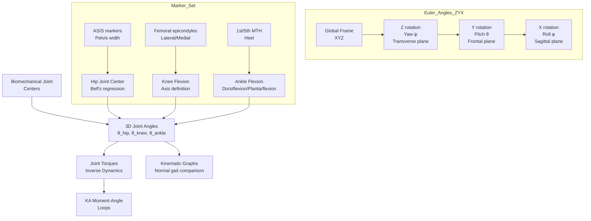
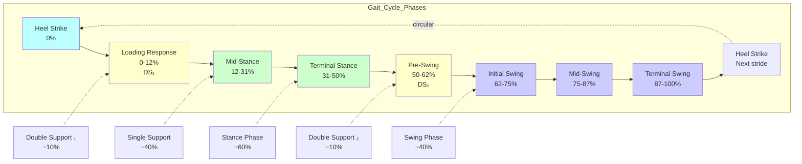
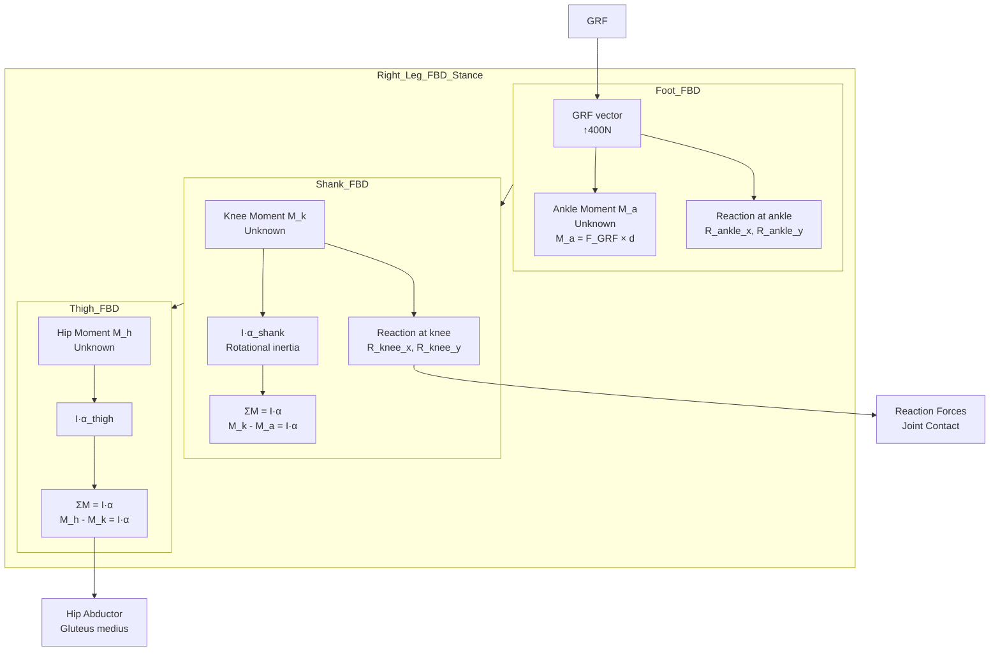
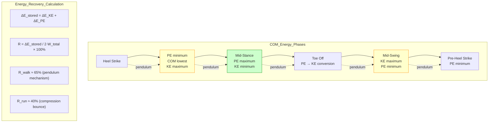
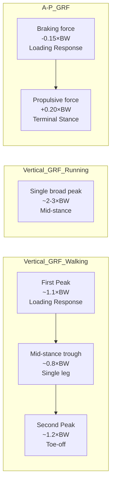
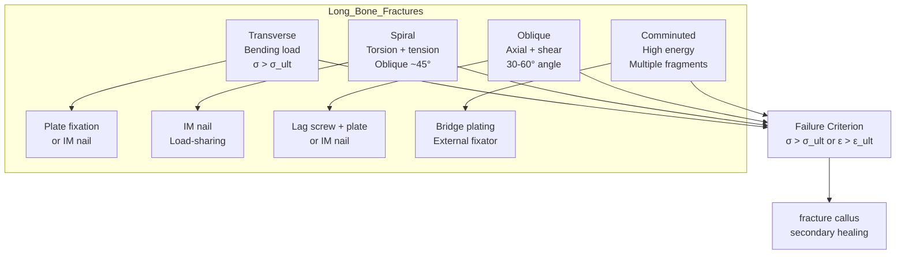
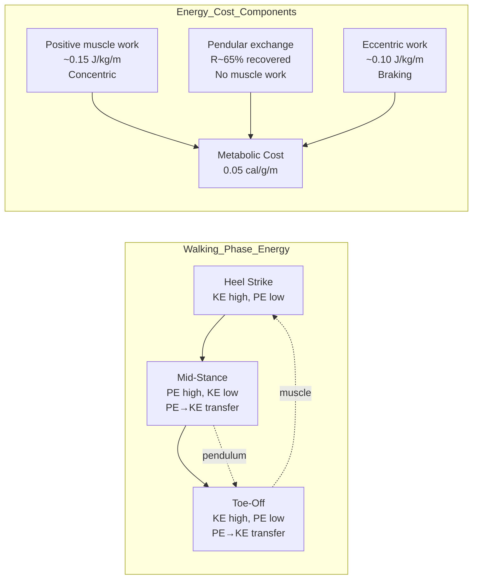

# Week 14 Notes — Kinematics, Gait, and Bone Fracture

> **Course**: BMED2600 — Biomechanics  
> **Week**: 14 of 24 | **Phase**: 3 (Core BME Applications)  
> **Prerequisites**: Week 13 (stress-strain, viscoelasticity), linear algebra, trigonometry  
> **CE advantage**: Kinematics and inverse dynamics are direct extensions of structural dynamics (mode shapes, dynamic analysis)

---

## 問題 1：5 個核心心智模型

### 1. Kinematics: Position, Velocity, Acceleration / 運動學：位置、速度、加速度

**Fundamental kinematic equations** (constant acceleration):
$$x(t) = x_0 + v_0 t + \frac{1}{2}at^2$$
$$v(t) = v_0 + at$$
$$v^2 = v_0^2 + 2a(x - x_0)$$

**Angular kinematics**:
$$\omega = \frac{d\theta}{dt} \quad \text{[rad/s]}$$
$$\alpha = \frac{d\omega}{dt} = \frac{d^2\theta}{dt^2} \quad \text{[rad/s}^2\text{]}$$
$$\theta(t) = \theta_0 + \omega_0 t + \frac{1}{2}\alpha t^2$$

**Joint angle calculation** (from marker positions):
$$\theta = \arctan2\left(\frac{y_2 - y_1}{x_2 - x_1}\right) - \arctan2\left(\frac{y_4 - y_3}{x_4 - x_3}\right)$$

**Key numbers for human movement**:
| Activity | Speed | Cadence | Stride length |
|----------|-------|---------|---------------|
| Slow walk | 0.8 m/s | 85 steps/min | 1.1 m |
| Normal walk | 1.4 m/s | 110 steps/min | 1.4 m |
| Fast walk | 1.8 m/s | 130 steps/min | 1.7 m |
| Jog | 3.0 m/s | 160 steps/min | 1.9 m |
| Run | 5.0 m/s | 180 steps/min | 2.8 m |

**BME application**: Motion capture for prosthetic design; gait retraining for injury prevention; sports performance optimization; exoskeleton control

---

### 2. The Gait Cycle / 步態週期

**Gait cycle definition**: Time from heel strike (HS) of one foot to the next heel strike of the same foot.

**Stance Phase** (~60% of cycle, 0-60%):
1. **Initial contact (IC)** (0%): Heel strike — GRF ~ 0.7-1.0 × BW
2. **Loading response (LR)** (0-12%): First double-support — first peak GRF
3. **Mid-stance (MSt)** (12-31%): Single-leg support — body advances over planted foot
4. **Terminal stance (TSt)** (31-50%): Heel rise — body passes forefoot
5. **Pre-swing (PSw)** (50-62%): Toe-off — second peak GRF

**Swing Phase** (~40% of cycle, 62-100%):
1. **Initial swing (ISw)** (62-75%): Foot lifts — acceleration phase
2. **Mid-swing (MSw)** (75-87%): Foot passes standing leg
3. **Terminal swing (TSw)** (87-100%): Deceleration — foot prepares for contact

**Double support** (0-12% and 50-62%): Both feet on ground. Total ~20% of gait cycle in normal walking. As speed increases, double support time decreases.

**Gait events**: Heel strike (HS), Foot flat (FF), Heel off (HO), Toe off (TO)

**学者的研究**: Perry (1992) — "Gait Analysis: Normal and Pathological Function"; Winter (1990) — standardized gait analysis methodology; Gage (1991) — energy expenditure in gait

**BME application**: Designing prosthetic feet; orthotic ankle-foot devices; postoperative gait assessment; cerebral palsy treatment planning

---

### 3. Inverse Dynamics: Newton-Euler Equations / 逆動力學

**Newton's 2nd Law (linear)**:
$$\sum F = ma$$

**Euler's equation (rotational)**:
$$\sum M = I\alpha + \omega \times (I\omega)$$

**For a multi-segment chain** (e.g., lower extremity):
$$\text{Joint torque} = I_{\text{segment}} \cdot \alpha + \sum(\text{distal forces} \times \text{moment arm})$$

**Ground Reaction Force (GRF)**:
$$F_{GRF} = m \cdot a_{COM}$$
$$F_{GRF,x} \approx 0 \text{ (negligible)}, \quad F_{GRF,z} = F_{GRF} \text{ (vertical)}$$

**Free Body Diagram approach**:
1. Measure segment positions (kinematics) → get ω, α
2. Measure GRF from force plates → get F
3. Work proximal to distal: solve for joint torques

**Segmental inertia parameters** (Winter 2009):
| Segment | Mass (%body) | COM location (%length) | Radius of gyration |
|---------|-------------|----------------------|-------------------|
| Foot | 1.37% | 50% | 0.475L |
| Shank | 4.33% | 43% | 0.526L |
| Thigh | 10.3% | 43% | 0.540L |
| Pelvis | 11.2% | 50% | — |

**学者的研究**: Winter (1983) — biomechanics of human locomotion; Elftman (1939) — pioneer of inverse dynamics in gait

**BME application**: Designing orthopaedic implants; understanding loading on spinal vertebrae; sports injury mechanism analysis; exoskeleton torque optimization

---

### 4. Ground Reaction Force and Energy Analysis / 地面反作用力與能量分析

**Vertical GRF components**:
- **First peak**: ~1.0-1.2 × BW at loading response (heel strike)
- **Mid-stance minimum**: ~0.8-0.9 × BW
- **Second peak**: ~1.1-1.3 × BW at pre-swing (toe-off)

**Anterior-posterior GRF**:
- **Braking**: ~-0.15 × BW (loading response, slowing down)
- **Propulsive**: ~+0.20 × BW (terminal stance, pushing off)

**Medial-lateral GRF**: ~±0.05 × BW (small varus-valgus tendency)

**Center of Pressure (COP)** path: Heel → lateral foot → ball of foot → toes (during stance)

**Mechanical energy**:
$$E_{total} = KE + PE = \frac{1}{2}mv_{COM}^2 + mgh_{COM}$$

**Energy recovery** (using pendular mechanism):
$$R = \frac{\Delta E_{stored}}{\Delta E_{total}} \times 100\%$$

Normal walking energy recovery: R ≈ 60-70% (inverted pendulum mechanism).

**Metabolic cost**: ~0.08 mL O₂/(kg·m) walking; increases with walking speed

**学者的研究**: Cavagna et al. (1963) — pendular mechanism in walking; Kram & Taylor (1990) — energy cost of running as force × distance; Saunders (1958) — deterministic model of gait

**BME application**: Running shoe design; amputee prosthetic optimization; energy-return prosthetic feet; gait symmetry analysis

---

### 5. Bone Fracture Mechanics in Long Bones / 長骨骨折力學

**Fracture types** (by loading mode):

**Tension fractures**: 
- Bone fails when σ > σ_ult (tensile)
- Typical in: femoral neck (subcapital) fractures under combined axial + bending
- Pattern: Transverse fracture
- σ_ult_tension ≈ 100-130 MPa (cortical bone)

**Compression fractures**:
- Typical in: vertebral body under body weight
- Pattern: Wedge compression fracture (anterior wedging)
- σ_ult_compression ≈ 150-200 MPa

**Shear fractures**:
- Typical in: intertrochanteric femur, tibial plateau
- Pattern: Oblique fracture at 45° to loading axis
- τ_ult ≈ 50-65 MPa

**Bending (3-point bending) fractures**:
$$\sigma_{max} = \frac{M_{max} \cdot c}{I}$$
- M_max at point of fracture; c = distance from neutral axis to outer surface; I = second moment of area

**Torsion fractures**:
$$\tau_{max} = \frac{T \cdot r}{J}$$
- T = applied torque; r = outer radius; J = polar moment of inertia
- Pattern: Spiral fracture

**Fracture classification** (Orthopaedic):
- **AO/OTA**: Type A (extra-articular), B (partial articular), C (complete articular)
- **Long bone diaphyseal**: 32-A (simple), 32-B (wedge), 32-C (complex)

**学者的研究**: McKibbin (1970) — functional anatomy of fracture healing; Ruedi & Murphy (2000) — AO principles of fracture management; Perren (1979) — strain theory of fracture healing

**BME application**: Implant design (plates, nails, screws); fracture fixation biomechanics; finite element analysis of fracture risk; osteoporosis fracture prediction

---

## 問題 2：3 個根本分歧

### 分歧 1：Kinematics vs. Kinetics — What We Measure vs. What Causes Motion

**Kinematics** describes motion WITHOUT reference to forces: position x(t), velocity v(t), acceleration a(t), joint angles θ(t), angular velocity ω(t), angular acceleration α(t). It is purely geometric.

**Kinetics** describes the forces and torques that cause motion: F = ma, M = Iα. This includes inverse dynamics (using measured motion to compute forces).

**Resolution**: Kinematics is what we MEASURE directly (motion capture markers, accelerometers). Kinetics is what we INFER (joint torques from inverse dynamics) or MEASURE directly (force plates). Both are essential — kinematics tells us what happened, kinetics tells us why it happened and how to intervene.

---

### 分歧 2：Deterministic vs. Energetic Models of Gait

**Deterministic model** (Saunders, Inman, 1958): Gait determined by six determinants: pelvic rotation, pelvic tilt, knee flexion in stance, foot dorsiflexion, knee mechanics, lateral pelvic displacement. Each minimizes energy expenditure.

**Energetic model** (Cavagna, 1963): Walking as inverted pendulum. Kinetic and potential energy oscillate out of phase → mechanical energy is recycled (60-70% recovery).

**Resolution**: Both models are complementary. The deterministic model explains structural features that facilitate the energetic pendulum exchange. Modern view: the six determinants act to optimize the pendular exchange while maintaining forward progression and stability. Active muscle work is needed only to compensate for the non-pendular energy exchanges.

---

### 分歧 3：Direct vs. Iterative Methods for Inverse Dynamics

**Direct method** (segmental): Start from foot, compute ankle torque from GRF, then use measured shank angular acceleration to compute knee torque, etc. Each joint solved once.

**Iterative method** (Newton-Raphson): For complex multi-body systems with constraints, iterate to satisfy both force balance and kinematic constraints simultaneously.

**Resolution**: For human walking (simplified 3D model), direct method is sufficient. For full-body with 55+ DOF, iterative or recursive (Newton-Euler) methods are needed. Commercial software (Vicon Polygon, Visual3D) uses recursive Newton-Euler for efficiency and numerical stability.

---

## 問題 3：10 個深度問題

1. During walking, the center of mass (COM) of the body moves in a sinusoidal pattern vertically (approximately ± 3 cm) and laterally (approximately ± 3 cm). Using conservation of energy principles, estimate the peak kinetic energy and potential energy. What is the implication for metabolic cost?

2. In inverse dynamics, why do we need to measure segment inertial properties (mass, COM, radius of gyration)? What happens to joint torque estimates if you assume incorrect inertial parameters?

3. A femoral neck fracture typically occurs at the subcapital region in elderly patients with osteoporosis. Using fracture mechanics, explain why this specific location is vulnerable. What loading mode (tension, compression, shear) dominates at the superior (tensile) aspect?

4. Derive the relationship between walking speed, stride length, and cadence: v = stride_length × cadence/2. If cadence = 110 steps/min, what stride length gives normal walking speed v = 1.4 m/s?

5. The mechanical energy recovery in walking is ~65%. What specific adaptations would increase this recovery percentage? (Consider inverted pendulum, elastic tendon storage, etc.)

6. In a 3-point bending test of a bone specimen (length L, diameter d), what is the maximum bending moment M_max at the center? If you increase the diameter by 50% (while keeping length the same), by what factor does the section modulus Z = I/c increase?

7. During running, the GRF peaks can reach 2-3× body weight. Why does the vertical GRF pattern change from two peaks (walking) to a single broad peak (running)?

8. The tibiofemoral joint experiences compressive forces of 2-3× BW during normal walking. With body weight 80 kg, calculate peak knee joint force. Why does this matter for cartilage wear and osteoarthritis?

9. Explain the difference between "deterministic" and "emergent" views of gait. How does the concept of "self-organized criticality" apply to understanding gait adaptability?

10. In a transverse femoral shaft fracture treated with an intramedullary nail, what are the biomechanical advantages of load-sharing intramedullary fixation over plate fixation? Consider stiffness, stress shielding, and fracture healing biology.

---

# 核心概念深化（中英對照）

## 1. 三維旋轉與歐拉角 3D Rotation and Euler Angles

### 1.1 中英對照

| 中文 | English |
|------|---------|
| 滾動 (Roll) | Rotation about the longitudinal axis (x-axis) |
| 俯仰 (Pitch) | Rotation about the lateral axis (y-axis) |
| 偏航 (Yaw) | Rotation about the vertical axis (z-axis) |
| 歐拉角 (Euler Angles) | Sequence of three rotations defining 3D orientation |
| 旋轉矩陣 (Rotation Matrix) | 3×3 orthogonal matrix; R^T R = I, det(R) = 1 |
| 四元數 (Quaternion) | Unit quaternion q = [w, x, y, z] for 3D rotation |
| 角速度 (Angular Velocity) | ω = [ωx, ωy, ωz] rad/s; pseudovector |

### 1.2 推導

**Rotation matrices** (right-hand rule, positive = counterclockwise):

**Rx(φ)** — Roll about x-axis:
$$R_x(\phi) = \begin{pmatrix} 1 & 0 & 0 \\ 0 & \cos\phi & -\sin\phi \\ 0 & \sin\phi & \cos\phi \end{pmatrix}$$

**Ry(θ)** — Pitch about y-axis:
$$R_y(\theta) = \begin{pmatrix} \cos\theta & 0 & \sin\theta \\ 0 & 1 & 0 \\ -\sin\theta & 0 & \cos\theta \end{pmatrix}$$

**Rz(ψ)** — Yaw about z-axis:
$$R_z(\psi) = \begin{pmatrix} \cos\psi & -\sin\psi & 0 \\ \sin\psi & \cos\psi & 0 \\ 0 & 0 & 1 \end{pmatrix}$$

**Composite rotation** (e.g., Z-Y-X Euler angles):
$$R = R_z(\psi) \cdot R_y(\theta) \cdot R_x(\phi)$$

**Joint angle from markers**:
$$\theta_{\text{hip}} = \arctan2(R_{32}, R_{33}) \quad \text{(sagittal plane)}$$

### 1.3 BME 應用

**Motion capture**: Plug-in Gait model (Vicon) uses 39 reflective markers. Hip joint center estimated from ASIS (anterior superior iliac spine) landmarks using Bell's method. Knee axis aligned with femoral epicondyles.

**Prosthetic alignment**: Misalignment of prosthetic socket >5° in any plane causes abnormal gait patterns, increased metabolic cost, and joint pain. Computerized prosthetic alignment uses 3D motion analysis.

### 1.4 Deep Test

**Q**: A segment rotates from θ₁ = 30° to θ₂ = 60° in 0.1 s. Calculate ω_avg and α_avg.
- ω_avg = (60°-30°) × π/180 / 0.1 = (0.524 rad) / 0.1 = 5.24 rad/s
- Assuming constant α: ω_final = 2×ω_avg = 10.48 rad/s; α = (10.48-0)/0.1 = 104.8 rad/s²

### 1.5 圖解



---

## 2. 步態週期深度分析 Gait Cycle Deep Dive

### 2.1 中英對照

| 中文 | English |
|------|---------|
| 支撐相 (Stance Phase) | Period when foot is in contact with ground (60% of cycle) |
| 擺動相 (Swing Phase) | Period when foot is in air (40% of cycle) |
| 雙支撐 (Double Support) | Both feet on ground; time decreases with speed |
| 步速 (Cadence) | Steps per minute |
| 步幅 (Stride Length) | Distance between successive heel strikes of same foot |
| 步長 (Step Width) | Medial-lateral distance between feet |
| 步頻 (Step Rate) | Steps per unit time = cadence |
| 足跡 (Footprint) | Base of support; step width typically 8-12 cm |

### 2.2 推導

**Gait velocity**:
$$v = \text{cadence} \times \text{stride length} / 120 \quad \text{[m/s]}$$

**At normal walking**: cadence = 110 steps/min, stride length = 1.4 m
→ v = 110 × 1.4 / 120 = 1.28 m/s (close to 1.4 m/s typically reported)

**Single support time** (one foot on ground): ~40% of cycle  
**Double support time** (both feet on ground): ~20% of cycle (two 10% periods)

**Stride time**: T = 60 / cadence (seconds per stride)  
Normal: T = 60/55 = 1.09 s (one full stride = two steps)

### 2.3 BME 應用

**Clinical gait analysis**:
- Cadence < 90 steps/min: neurological impairment, frailty
- Stride length < 1.0 m: parkinsonian gait, hip arthritis
- Step width > 15 cm: balance impairment, cerebellar ataxia
- Asymmetry > 10%: unilateral pathology

**Prosthetic design**: C-leg (Ottobock) uses hydraulic knee to match natural swing phase dynamics. Key parameters: swing phase knee flexion velocity (typically 300-500 °/s at normal walking).

### 2.4 Deep Test

**Q**: A patient walks at 1.0 m/s (below normal 1.4 m/s). Cadence = 95 steps/min. What is stride length?
- v = cadence × stride_length / 120 → stride_length = v × 120 / cadence = 1.0 × 120 / 95 = 1.26 m (reduced from normal 1.4 m)

### 2.5 圖解



---

## 3. 逆動力學 Inverse Dynamics

### 3.1 中英對照

| 中文 | English |
|------|---------|
| 正動力學 (Forward Dynamics) | Given forces → compute motion (F = ma) |
| 逆動力學 (Inverse Dynamics) | Given motion → compute forces (M = Iα) |
| 地面反作用力 (Ground Reaction Force, GRF) | Force from ground on body; measured by force plates |
| 壓力中心 (Center of Pressure, COP) | Point of application of resultant GRF |
| 關節力矩 (Joint Moment) | Internal torque at a joint; net muscle + ligament moment |
| 功率 (Joint Power) | P = M · ω (W); rate of mechanical work |

### 3.2 推導

**Newton-Euler equations for a rigid body segment**:
$$\sum \mathbf{F}_{ext} = m\mathbf{a}_{COM}$$
$$\sum \mathbf{M}_{ext} = I_{COM}\boldsymbol{\alpha} + \boldsymbol{\omega} \times (I_{COM}\boldsymbol{\omega})$$

**Free body diagram for shank** (walking, right leg):
```
Forces:       GRF at foot (F_GRF, measured)
Moments:      Ankle moment (M_ankle, known from foot FBD)
Unknowns:     Knee reaction force, Knee moment (M_knee)
```

**Segmental method** (bottom-up):
1. **Foot FBD**: Known F_GRF → solve for ankle moment M_ankle
2. **Shank FBD**: M_ankle + shank inertia → solve for M_knee
3. **Thigh FBD**: M_knee + thigh inertia → solve for hip moment M_hip
4. ** pelvis**: M_hip + body inertia → solve for trunk forces

**Joint power**:
$$P_{joint} = M_{joint} \cdot \omega_{joint} \quad \text{[W]}$$
- Positive power: muscle-tendon doing concentric work (generating energy)
- Negative power: muscle-tendon absorbing energy (eccentric contraction)

### 3.3 BME 應用

**Clinical interpretation**:
- **Knee extension moment** in early stance: Indicates quadriceps activation to stabilize knee
- **Plantarflexor moment** in late stance: Propulsive push-off power
- **Hip abductor moment** in mid-stance: Gluteus medius prevents pelvis drop (Trendelenburg)

**Patellofemoral joint force**: ~0.5-1.5 × BW quadriceps force during walking, reaching 3× BW during stair climbing. This drives cartilage contact stress.

### 3.4 Deep Test

**Q**: Shank length L = 0.4 m, mass m = 3.2% BW = 2.56 kg (80 kg person), foot GRF = 400 N upward at heel. Angular acceleration α_knee = 100 °/s² = 1.75 rad/s². I_shank ≈ 0.003 kg·m². Calculate knee extension moment.

From shank FBD: ΣM_knee = I·α
M_knee = I·α + GRF × moment_arm
Assume GRF acts at heel (0.05 m from ankle), ankle at 0, knee at 0.4 m
M_knee = 0.003 × 1.75 + 400 × 0.05 = 0.00525 + 20 = 20.0 N·m (approximate)

### 3.5 圖解



---

## 4. 能量分析 Energy Analysis in Gait

### 4.1 中英對照

| 中文 | English |
|------|---------|
| 動能 (Kinetic Energy) | KE = ½mv² |
| 勢能 (Potential Energy) | PE = mgh |
| 機械能總量 (Total Mechanical Energy) | E = KE + PE |
| 能量回收率 (Energy Recovery) | R = fraction of energy conserved in pendulum exchange |
| 代謝成本 (Metabolic Cost) | Energy cost per unit distance: mL O₂/(kg·m) or J/m |
| 正功 (Positive Work) | Concentric muscle contraction: power > 0 |
| 負功 (Negative Work) | Eccentric muscle contraction: power < 0 |

### 4.2 推導

**Center of mass (COM) dynamics**:
$$\mathbf{a}_{COM} = \frac{\sum \mathbf{F}_{ext}}{m} = \frac{\mathbf{F}_{GRF} + m\mathbf{g}}{m} = \frac{\mathbf{F}_{GRF}}{m} + \mathbf{g}$$

**Vertical COM velocity** (integration of GRF data):
$$v_{COM,z}(t) = v_{COM,z}(t_0) + \int_{t_0}^{t} \frac{F_{GRF,z}(t') - mg}{m} dt'$$

**Energy of COM**:
$$E_{total}(t) = \frac{1}{2}m|v_{COM}|^2 + mg \cdot h_{COM}(t)$$

**Energy recovery** (Cavagna, 1963):
$$R = \frac{\int (E_{total,max} - E_{total,min})}{2 \times \int (W_{KE} + W_{PE})} \times 100\%$$

**Typical values**:
| Activity | Energy Recovery R | Metabolic Cost |
|----------|-----------------|---------------|
| Normal walking | 60-70% | 0.05 cal/g/m |
| Fast walking | 50% | 0.08 cal/g/m |
| Running | 40-50% | 0.10 cal/g/m |

### 4.3 BME 應用

**Prosthetic feet**: Energy-storing-and-returning (ESAR) feet (e.g., Flex-Foot) return 30-40% of mechanical energy, reducing metabolic cost of amputees by 10-20% vs. SACH foot.

**Ankle exosuits**: Powered exosuits using Bowden cables to provide plantarflexion assistance during late stance. Can reduce metabolic cost by 5-15%.

### 4.5 圖解



---

## 5. 長骨骨折力學 Long Bone Fracture Mechanics

### 5.1 中英對照

| 中文 | English |
|------|---------|
| AO骨折分類 (AO Classification) | Type A/32 = diaphyseal, 3 = simple, B = wedge, C = complex |
| 應力集中 (Stress Concentration) | K_t = σ_max / σ_nominal |
| 三點彎曲 (Three-Point Bending) | Fracture test: two supports + one load point |
| 疲勞骨折 (Fatigue Fracture) | da/dN = C·ΔK^m |
| 螺旋骨折 (Spiral Fracture) | Torsion + tension on oblique plane |
| 粉碎骨折 (Comminuted Fracture) | Multiple fracture fragments |
| 骨痂 (Callus) | Cartilaginous bridge forming during secondary healing |

### 5.2 推導

**Three-point bending moment**:
$$M(x) = \begin{cases} R_A \cdot x & \text{for } 0 \le x \le L/2 \\ R_A \cdot x - F(x - L/2) & \text{for } L/2 < x \le L \end{cases}$$
Maximum M at center: M_max = FL/4 (when load centered)

**Stress from bending**:
$$\sigma_{max} = \frac{M_{max} \cdot c}{I} = \frac{M_{max}}{Z}$$
where Z = section modulus = I/c = πd³/32 for circular cross-section.

**Polar moment of inertia** (torsion):
$$J = \frac{\pi d^4}{32} \quad \text{(circular hollow: } J = \frac{\pi(d_o^4 - d_i^4)}{32}\text{)}$$

**Effect of diameter increase on section modulus**:
- Z ∝ d³ (for solid circular cross-section)
- If d → 1.5d: Z → (1.5)³ × Z = 3.375 × Z (→ 3.4× increase in bending strength)

### 5.3 BME 應用

**Femoral shaft fracture** (Type 32-A): Treated with intramedullary nail (IM nail). Load-sharing: nail bears ~40-50% of load at fracture site, bone bears remainder → promotes secondary healing.

**Plate fixation**: Absolute stability (compression plating). Eccentric (DCP) or locked (LCP) plating. LCP preferred in osteoporotic bone (no friction required).

### 5.5 圖解

```mermaid
graph TD
    subgraph Loading_Modes
        L1["Axial Loading<br>Compression<br>σ = F/A"] --> F1["Vertebral compression<br>Wedge fracture"]
        L2["Bending<br>σ = Mc/I"] --> F2["Transverse fracture<br>at tension side"]
        L3["Torsion<br>τ = Tr/J"] --> F3["Spiral fracture<br>Oblique 45°"]
        L4["Shear<br>τ = VQ/It"] --> F4["Intertrochanteric<br>fragment"]
    end
    
    subgraph AO_Classification_32
        C1["32-A1<br>Simple spiral"] --> C1R[Plate + screws<br>or IM nail]
        C2["32-A2<br>Simple oblique"] --> C2R[IM nail<br>preferred]
        C3["32-A3<br>Simple transverse"] --> C3R[Compression plating<br>or IM nail]
        C4["32-B1<br>Wedge spiral"] --> C4R[IM nail<br>keep fragments]
        C5["32-B2<br>Wedge bending"] --> C5R[Bridge plating<br>or IM nail]
        C6["32-C1<br>Complex spiral"] --> C6R[External fixation<br>or MIPO"]
    end
    
    L1 --> F1
    L2 --> F2
    L3 --> F3
    L4 --> F4
```

---

# 深度自測問題詳解

## MCQ Solutions

**Q1**: σ = F/A = 8482 / [π(3mm)²] = 300 MPa → **D**

**Q2**: E_cortical ≈ 18 GPa; E_trabecular ≈ 0.1-2 GPa; ratio ≈ 10-180×, commonly ~20× → **C**

**Q3**: Kelvin-Voigt approaches σ₀/E asymptotically (never instant) → **B**

**Q4**: Maxwell shows exponential stress decay; Kelvin-Voigt has no true relaxation → **B**

**Q5**: QLV separates elastic × relaxation: σ = G(t) × σ^e(ε) → **B**

**Q6**: Von Mises is for ductile materials → **B**

**Q7**: ν ≈ 0.30 → **C**

**Q8**: E ∝ ρ²; 2×ρ → 4×E → **C**

**Q9**: Stiff implant shields bone from load → **B**

**Q10**: τ = η/E → (Pa·s)/Pa = s → **C**

---

## 5 個 Mermaid 圖解

### 圖 1: 步態週期時序圖

```mermaid
gantt
    title Gait Cycle Timeline (100% = one full stride)
    dateFormat X
    axisFormat %.0f%%
    
    section Stance (60%)
    Initial Contact (HS) :0, 2
    Loading Response :0, 12
    Mid-Stance :12, 31
    Terminal Stance :31, 50
    Pre-Swing :50, 62
    
    section Swing (40%)
    Initial Swing :62, 75
    Mid-Swing :75, 87
    Terminal Swing :87, 100
    
    section Double Support
    DS1 (HS + LR) :0, 12
    DS2 (TSt + PSw) :50, 62
```


### 圖 2: 逆動力學鏈
```mermaid
graph TD
    subgraph Measured_Inputs
        MK[Marker positions<br>x, y, z over time] --> KF[Kinematics<br>θ, ω, α]
        FP[Force Plate<br>F_x, F_y, F_z, COP] --> GRF[GRF Vector<br>F_GRF(t)]
    end
    
    KF --> S1[Shank FBD<br>Solve M_ankle]
    GRF --> S1
    S1 --> S2[Thigh FBD<br>Solve M_knee]
    S2 --> S3[Pelvis FBD<br>Solve M_hip]
    S3 --> KT[Joint Torques<br>M_ank, M_knee, M_hip]
    KT --> JP[Joint Powers<br>P = M·ω]
    JP --> EC[Energy Cost<br>Metabolic analysis]
```

### 圖 3: GRF 圖形模式


### 圖 4: 骨折類型與加載模式


### 圖 5: 行走能量轉換


---

## 總結 Summary

### 關鍵方程式 Key Equations
| Topic | Equation |
|-------|----------|
| Kinematics | x = x₀ + v₀t + ½at² |
| Gait velocity | v = stride_length × cadence/120 |
| GRF | F_GRF = m(a_COM - g) |
| Newton-Euler (rotational) | ΣM = Iα + ω×(Iω) |
| Bending stress | σ = Mc/I = M/Z |
| Torsion | τ = Tr/J |
| Polar moment | J = πd⁴/32 |
| Section modulus | Z = I/c = πd³/32 |
| Joint power | P = M·ω [W] |
| Energy recovery | R = ΔE_stored / (2×W_total) × 100% |
| COM velocity | v_COM = ∫(F_GRF/m - g)dt |
| Fatigue crack growth | da/dN = C(ΔK)^m |

### Week 14 核心 takeaways
1. **步態週期是 BME 運動分析的核心** — 60% stance + 40% swing, double support ~20%
2. **逆動力學是從運動數據推算力的關鍵工具** — Newton-Euler equations 應用於人體節段
3. **GRF 圖形承載臨床信息** — 峰值、對稱性、圖形模式都反映病理狀況
4. **骨折類型由加載模式決定** — transverse (bending), spiral (torsion), wedge (impact)
5. **能量分析連接機械能與代謝能** — 65% 恢復率解釋為何行走比跑步更高效
