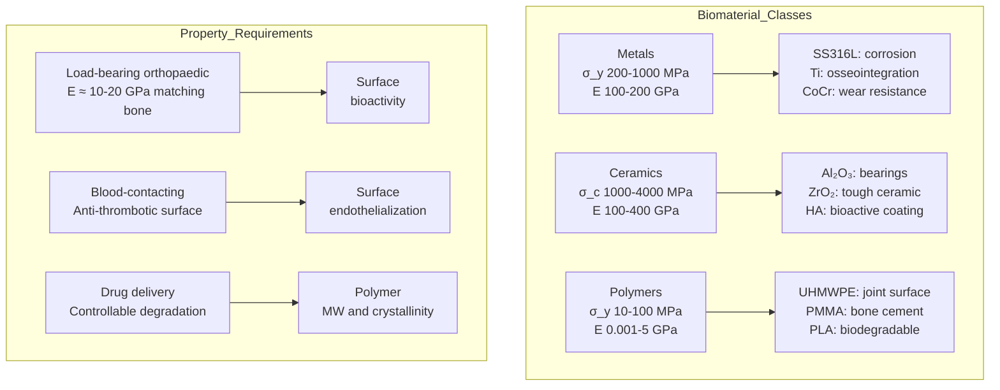
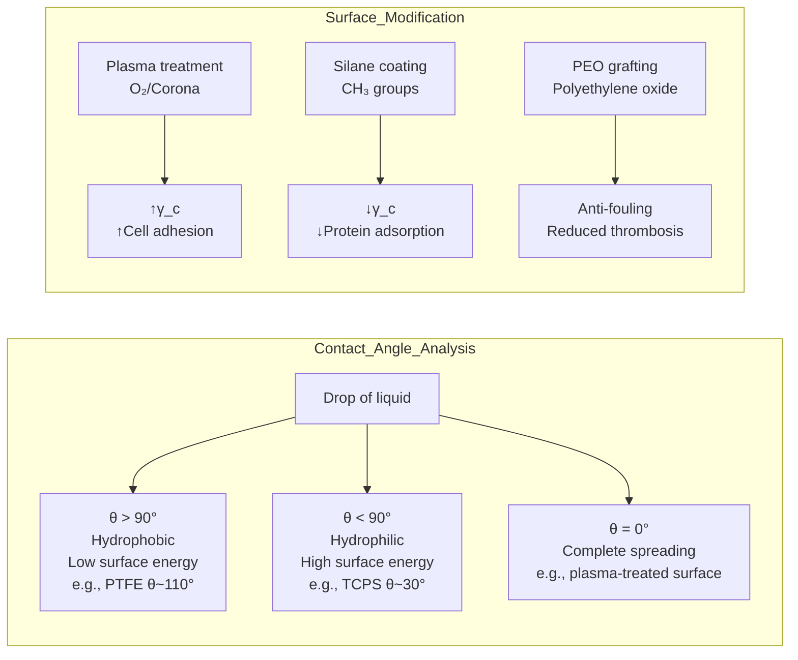
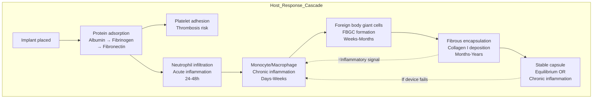
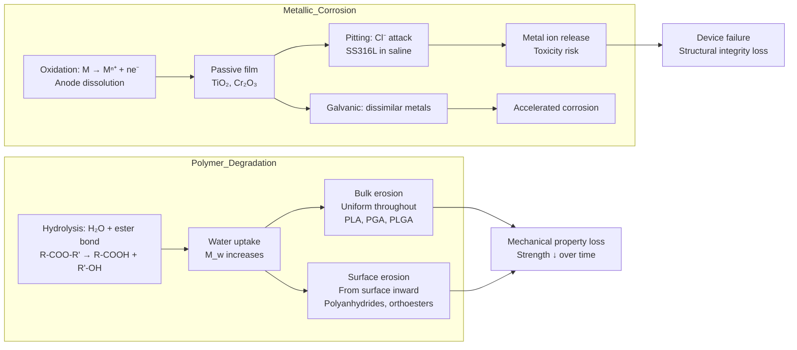
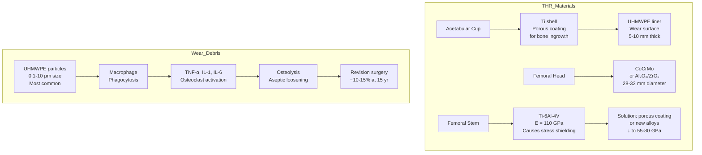
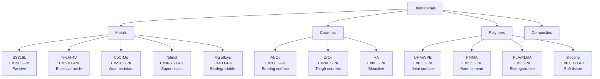
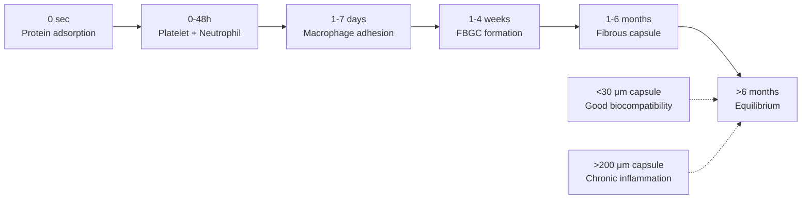
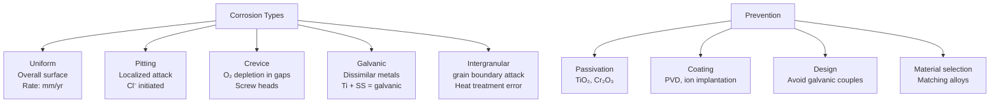
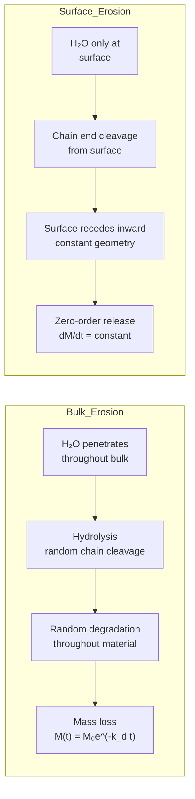
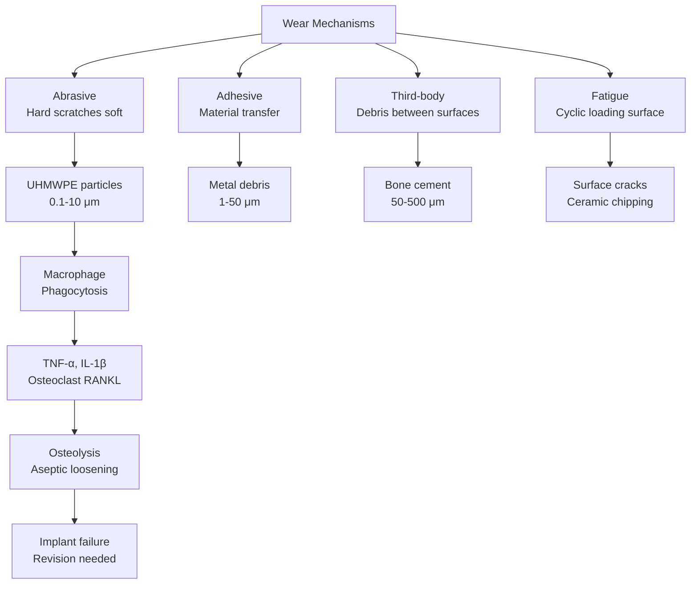

# Week 15 Notes — Biomaterials (Structure and Properties)

> **Course**: BMED3600 — Biomaterials and Biosystems  
> **Week**: 15 of 24 | **Phase**: 3 (Core BME Applications)  
> **Prerequisites**: Materials science (CE background), cell biology (Week 4)  
> **CE advantage**: Your civil engineering materials background (concrete, steel, composites) transfers directly to biomaterials classification and property analysis

---

## 問題 1：5 個核心心智模型

### 1. Three Material Classes / 三大材料類別

**Metals** (load-bearing, orthopaedic, cardiovascular):
| Alloy | E (GPa) | σ_yield (MPa) | σ_ult (MPa) | ρ (g/cm³) | Key Use |
|-------|---------|--------------|------------|-----------|---------|
| SS316L | 190 | 215 | 505 | 8.0 | Temporary implants, bone plates |
| Ti-6Al-4V | 110 | 880 | 950 | 4.43 | Hip stems, dental implants |
| CoCrMo | 210 | 450 | 900 | 8.3 | Knee replacements, stents |
| Nitinol | 30-75 | 100-500 | — | 6.5 | Vascular stents (superelastic) |
| Mg alloys | 40-45 | 100-200 | 200-300 | 1.7 | Biodegradable stents, screws |

**Ceramics** (bearing surfaces, dental, maxillofacial):
| Ceramic | E (GPa) | σ_comp (MPa) | σ_ten (MPa) | H (GPa) |
|---------|---------|-------------|------------|---------| 
| Al₂O₃ | 380 | 2000-4000 | 200-300 | 18-25 |
| ZrO₂ | 200 | 1500-2000 | 500-800 | 12-15 |
| HA | 80 | 500-1000 | 50-200 | 5-6 |
| Glass-ceramic | 100 | 500 | 100 | 6 |

**Polymers** (joint replacements, drug delivery, sutures):
| Polymer | E (GPa) | σ_yield (MPa) | Degradation | Key Use |
|---------|---------|--------------|-------------|---------|
| UHMWPE | 0.5-1 | 20-30 | None (inert) | Hip/knee bearing surface |
| PMMA | 2-3 | 30-40 | None | Bone cement |
| PLA/PGA | 2-4 | 50-70 | 6-24 mo | Sutures, scaffolds |
| PLGA | 1-2 | 40-60 | 1-12 mo | Drug delivery particles |
| silicone | 0.001-0.01 | 5-10 | None | Breast implants, shunts |
| PTFE | 0.5 | 10-20 | None | Vascular grafts, sutures |

**学者的研究**: Ratner (2013) — Biomaterials Science; Park & Lakes (2007); Black & Hastings (1998) — Handbook of Biomaterial Properties

**BME application**: Selecting implant materials for specific anatomical sites and loading conditions; matching mechanical properties to tissue; avoiding galvanic corrosion in multi-material assemblies

---

### 2. Surface Properties and Biocompatibility / 表面性質與生物相容性

**Surface energy** (Young's equation):
$$\gamma_{sv} = \gamma_{sl} + \gamma_{lv}\cos\theta$$
where γ_sv = solid-vapor, γ_sl = solid-liquid, γ_lv = liquid-vapor interfacial energy.

**Contact angle θ** (wettability):
- θ < 90°: **Hydrophilic** (wetting) — better cell adhesion, e.g., TCPS tissue culture polystyrene
- θ > 90°: **Hydrophobic** (non-wetting) — reduces protein adsorption, e.g., PTFE
- θ = 0°: Complete spreading

**Surface roughness**:
$$R_a = \frac{1}{n}\sum_{i=1}^{n}|z_i - \bar{z}| \quad \text{(arithmetic average roughness)}$$
$$R_q = \sqrt{\frac{1}{n}\sum z_i^2} \quad \text{(RMS roughness)}$$

Roughness effects:
- Ra 0.1-0.5 μm: Polished — reduces bacterial adhesion
- Ra 1-5 μm: Machined — standard implant surfaces
- Ra 5-50 μm: Porous coating — bone ingrowth (e.g., Ti plasma spray)
- Ra > 50 μm: Macro-porous — tissue engineering scaffolds

**Protein adsorption** (the "Vroman effect"):
- First: high-abundance proteins (albumin) adsorb rapidly
- Later: replaced by lower-abundance, higher-affinity proteins (fibronectin, vitronectin)
- These surface-bound proteins determine cell response

**学者的研究**: Baier (1970) — surface energy and biocompatibility; Andrade & Hlady (1986) — protein adsorption; Ratner (1993) — surface modification

**BME application**: Surface modification to control osseointegration; preventing bacterial biofilm formation; enhancing endothelialization of vascular grafts

---

### 3. Host Response and Foreign Body Reaction / 宿主反應與異物反應

**Sequence of host response** (Anderson, 2001):
1. **Protein adsorption** (seconds to minutes): albumin, fibrinogen, complement
2. **Platelet adhesion/activation** (minutes): especially for blood-contacting devices
3. **Neutrophil recruitment** (hours): acute inflammation, ROS release
4. **Monocyte/macrophage adhesion** (1-7 days): chronic inflammation
5. **Foreign body giant cell formation** (FBGCs, weeks): fused macrophages
6. **Fibrous encapsulation** (weeks to months): collagen layer around implant
7. **Equilibrium**: stable fibrous capsule (50-500 μm thick)

**Fibrous capsule**:
- Thin capsule (< 30 μm): Good biocompatibility (e.g., Dacron vascular graft)
- Thick capsule (> 200 μm): Poor biocompatibility or chronic inflammation
- Contractile fibroblasts: cause capsule contraction around breast implants (capsular contracture)

**Thrombosis on blood-contacting devices**:
- Extrinsic pathway: tissue factor from damaged cells
- Intrinsic pathway: contact activation on foreign surface
- Platelet adhesion: GPIb/IX/V → GPIIb/IIIa → aggregation
- Prevention: heparin coating, endothelialization, surface modification

**学者的研究**: Anderson (2001) — Biological responses to materials; Williams (2008) — definitions of biocompatibility; Ratner (2013)

**BME application**: Predicting and controlling fibrous encapsulation around neural electrodes; designing anti-thrombotic coatings for ventricular assist devices; reducing capsule contracture in breast implants

---

### 4. Degradation: Corrosion and Hydrolysis / 降解：腐蝕與水解

**Metallic corrosion** (electrochemical):
- **Uniform corrosion**: E°_corr = corrosion potential
- **Pitting corrosion**: Cl⁻ attack on passive film (e.g., SS316L in chloride-rich body fluid)
- **Crevice corrosion**: Oxygen depletion in gaps (e.g., under screw heads)
- **Galvanic corrosion**: Two dissimilar metals (e.g., SS plate + Ti screw → galvanic couple)

**Corrosion rate** (Faraday's law):
$$CR = \frac{K \cdot i_{corr} \cdot M}{n \cdot \rho}$$
where i_corr = corrosion current density (μA/cm²), M = atomic weight, n = valence electrons, ρ = density.

Typical corrosion rates for medical alloys:
- Ti alloys: < 0.02 mm/yr (excellent)
- SS316L: 0.1-0.5 mm/yr (acceptable if passive)
- CoCrMo: 0.01-0.1 mm/yr (good)
- Mg alloys: 0.5-2 mm/yr (biodegradable, uncontrolled)

**Polymer degradation** (hydrolytic/enzymatic):
- **Bulk erosion**: Uniform degradation (e.g., PLA, PGA)
- **Surface erosion**: Degradation from surface inward (e.g., polyanhydrides, poly(orthoesters))
- Rate depends on: water uptake, hydrolysis rate, crystallinity, molecular weight

**Hydrolytic degradation** of PLA:
$$M_n(t) = M_{n,0} \cdot e^{-k_d \cdot t}$$
where k_d = degradation rate constant (month⁻¹).

**PLGA degradation time**:
| PLA: PGA ratio | Degradation time |
|----------------|----------------|
| 50:50 | 1-2 months |
| 75:25 | 4-5 months |
| 85:15 | 5-6 months |
| 100:0 (PLA) | > 12 months |

**学者的研究**: Williams (1979) — polymer degradation; Black (1999) — metallic corrosion in biomaterials; Prakasam et al. (2017) — biodegradable metals

**BME application**: Selecting corrosion-resistant alloys for permanent implants; predicting PLGA degradation for drug delivery timing; designing biodegradable magnesium stents that dissolve after vessel healing

---

### 5. Orthopaedic Biomaterials: Joint Replacements / 骨科生物材料

**Total hip replacement (THR)** — material combinations:
- **Acetabular cup**: UHMWPE liner (worn surface) in Ti shell (backing)
- **Femoral head**: CoCrMo or ceramic (Al₂O₃/ZrO₂) — the bearing surface
- **Femoral stem**: Ti-6Al-4V (elastic modulus mismatch → stress shielding)
- **Bone cement**: PMMA (20% BaSO₄ for radiopacity) — grouting agent

**Total knee replacement (TKR)**:
- **Femoral component**: CoCrMo or TiN-coated CoCrMo
- **Tibial component**: UHMWPE on Ti baseplate
- **Patellar button**: UHMWPE (sometimes metal-backed)
- **Articular surface**: CoCrMo-UHMWPE or ceramic-UHMWPE

**Wear mechanisms in joint replacements**:
- **Abrasive wear**: Hard particles scratch softer surface
- **Adhesive wear**: Material transfer between surfaces
- **Third-body wear**: Bone cement or metal debris between surfaces
- **Osteolysis**: Wear debris → macrophage activation → bone resorption

**Wear rate**:
- Metal-on-UHMWPE: ~0.05-0.2 mm/yr volumetric wear
- Ceramic-on-ceramic: ~0.005-0.01 mm/yr (10× less)
- Crosslinked UHMWPE: ~0.02-0.05 mm/yr (4× less than conventional)

**学者的研究**: Charnley (1960s) — low-friction arthroplasty with UHMWPE; Dumbleton (1981) — wear of UHMWPE; Jacobs et al. (2003) — metal-on-metal hip replacement failure

**BME application**: Selecting bearing couples for joint replacements; understanding wear debris-induced osteolysis (main cause of aseptic loosening); designing wear-resistant surfaces

---

## 問題 2：3 個根本分歧

### 分歧 1：Bioinert vs. Bioresorbable — Which is Better?

**Bioinert** (inert, stable): Stainless steel, Ti, Al₂O₃, UHMWPE. Tissue forms fibrous capsule but no chemical bonding. Long-term mechanical stability.

**Bioresorbable** (degradable): PLA, PGA, Mg alloys. Degrades as tissue heals → no permanent foreign body. However: uncontrolled degradation rate, mechanical property loss, inflammatory byproducts.

**Resolution**: Neither is universally superior. Use bioinert for load-bearing permanent implants (hip stem, dental implant). Use bioresorbable for temporary applications (sutures, drug delivery, bone scaffolds, stents). Emerging "biointeractive" materials (e.g., bioactive glass, HA coatings) aim to actively bond with tissue while degrading controllably.

---

### 分歧 2：Metallic vs. Ceramic Orthopaedic Bearing Surfaces

**Metal-on-UHMWPE** (traditional): Well-established (>50 years), forgiving surgical technique, excellent clinical track record, but generates wear debris.

**Ceramic-on-ceramic** (modern): Extremely low wear (10× less), no metal ions, excellent scratch resistance, but brittle (risk of fracture), squeaking, expensive.

**Resolution**: Current best practice: ceramic-on-highly-crosslinked-UHMWPE is the emerging gold standard. Combines low wear (ceramic) with fracture resistance (UHMWPE). Pure CoC used for younger, active patients where wear is critical.

---

### 分歧 3：Surface Modification vs. Bulk Material Change

**Surface modification** (treat the surface only): Plasma treatment, ion implantation, PVD coatings (TiN, DLC), anodization (TiO₂ nanotubes), HA plasma spray. Retains bulk properties (toughness, strength), changes surface only.

**Bulk material change** (change entire material): Different alloy, different polymer, composite material. More fundamental change, but may introduce new problems.

**Resolution**: Surface modification is preferred when bulk properties are adequate. Change bulk material only when surface modification cannot achieve required properties (e.g., need very low modulus throughout → use trabecular metal technology for acetabular cups).

---

## 問題 3：10 個深度問題

1. Why does UHMWPE require gamma radiation crosslinking to improve wear resistance, and what is the trade-off with oxidation degradation?
2. A PLGA 50:50 microparticle has molecular weight 50,000 Da. Using first-order degradation kinetics with k_d = 0.5 month⁻¹, how long until M_n = 10,000 Da (below which mechanical failure occurs)?
3. Explain why Ti-6Al-4V forms a stable oxide layer (TiO₂) that provides corrosion resistance, but SS316L is susceptible to pitting in chloride environments.
4. Calculate the Young's modulus mismatch ratio between a Ti-6Al-4V hip stem (E = 110 GPa) and cortical bone (E = 18 GPa). What is the consequence for bone remodeling?
5. Why does the Vroman effect (protein replacement kinetics) matter for biomaterial design? How would you design a surface to promote selective protein adsorption (e.g., fibronectin)?
6. What is the mechanism of hydroxyapatite (HA) osseointegration? Why does plasma-sprayed HA coating improve bone bonding compared to Ti surface alone?
7. Compare the degradation mechanisms of PLA (bulk hydrolysis) and polyanhydrides (surface erosion). How does this difference affect drug delivery applications?
8. A vascular graft made of ePTFE (expanded PTFE) has internodal distance (IND) = 30 μm. What is the optimal IND for endothelialization, and why?
9. What is the difference between "biocompatibility" and "bioactivity"? Give an example of a bioactive material used in bone replacement.
10. The inflammatory response to a silicone breast implant causes capsular contracture in 10-30% of patients. Propose two surface modification strategies to reduce this response, and explain the biomechanism.

---

# 核心概念深化（中英對照）

## 1. 材料的力學特性 Mechanical Properties of Biomaterials

### 1.1 中英對照

| 中文 | English |
|------|---------|
| 彈性模量 (Elastic Modulus) | Stiffness; stress/strain in elastic region |
| 屈服強度 (Yield Strength) | Stress at which plastic deformation begins |
| 疲勞極限 (Fatigue Limit) | Maximum stress for infinite cycles without failure |
| 疲勞強度 (Fatigue Strength) | Stress at N cycles before failure |
| 斷裂韌性 (Fracture Toughness) | Resistance to crack propagation; K_IC |
| 硬度 (Hardness) | Resistance to plastic deformation; indentation test |
| 磨損率 (Wear Rate) | Volume loss per unit distance; mm³/Mcycle |
| 摩擦係數 (Coefficient of Friction) | μ = F_friction / F_normal |

### 1.2 推導

**Stress-strain for biomaterials**: Most biomaterials exhibit:
- **Linear elastic** (ceramics, metals, bone): σ = Eε
- **Nonlinear elastic** (soft polymers, soft tissue): hyperelastic models (Mooney-Rivlin, Ogden)
- **Viscoelastic** (polymers, cartilage): time-dependent behavior

**Hardness to yield strength** (empirical, for metals):
$$H \approx 3 \cdot \sigma_{yield}$$
Vickers hardness HV ≈ 3 × σ_yield (HV in kgf/mm², σ in MPa)

**Wear depth**:
$$d = \frac{V}{L \cdot A} = \frac{K \cdot W \cdot L}{H \cdot A}$$
where V = wear volume, L = sliding distance, A = apparent contact area, W = normal load, K = wear coefficient.

### 1.3 BME 應用

**Joint bearing surfaces**: Hardness comparison determines wear resistance. Al₂O₃ ceramic (HV ~ 1800) >> CoCr (HV ~ 300-400) >> UHMWPE (HV ~ 0.05). The hard ceramic against soft UHMWPE gives lowest wear rate because UHMWPE deforms plastically, protecting the ceramic.

**Bone screws**: Ti-6Al-4V (HV ~ 350) provides adequate threading resistance while being gentle on bone threads during insertion.

### 1.4 圖解

---

## 2. 表面能與接觸角 Surface Energy and Contact Angle

### 2.1 中英對照

| 中文 | English |
|------|---------|
| 濕潤性 (Wettability) | Ability of liquid to spread on surface |
| 親水性 (Hydrophilic) | Water-loving; θ < 90° |
| 疏水性 (Hydrophobic) | Water-fearing; θ > 90° |
| 表面能 (Surface Energy) | γ, energy per unit area at surface; mN/m |
| 接觸角 (Contact Angle) | θ from Young's equation |
| 蛋白質吸附 (Protein Adsorption) | Vroman effect; first albumin, then fibronectin |

### 2.2 推導

**Critical surface tension of wetting** (Zisman method):
$$\cos\theta = 1 + \beta(\gamma_c - \gamma_l)$$
γ_c = critical surface tension at which θ = 0.

Typical values:
| Surface | γ_c (mN/m) |
|---------|-----------|
| PTFE | 18 |
| PE | 31 |
| PS | 33 |
| PMMA | 39 |
| TiO₂ | 40-50 |

**Cell adhesion energy**:
$$\Delta G_{adhesion} = \gamma_{sc} - \gamma_{sl} - \gamma_{cl}$$
Better adhesion when ΔG < 0 (spontaneous).

### 2.3 圖解

---

## 3. 異物反應與生物相容性 Foreign Body Reaction

### 3.1 推導

**Macrophage adhesion** (mediated by integrin receptors):
- Macrophage recognizes surface-adsorbed proteins (opsonins)
- Integrin binding → cell spreading → pro-inflammatory cytokine release (TNF-α, IL-1β, IL-6)

**Foreign body giant cell (FBGC) formation**:
- IL-4 or IL-13 stimulates fusion of macrophages (50-100 nuclei per FBGC)
- FBGCs release ROS and hydrolytic enzymes → degradation of nearby tissue

**Fibrous capsule thickness** (histological):
- < 30 μm: Excellent biocompatibility
- 30-100 μm: Good
- 100-200 μm: Moderate
- > 200 μm: Chronic inflammation

### 3.3 圖解

---

## 4. 降解動力學 Degradation Kinetics

### 4.1 推導

**First-order hydrolysis**:
$$M_n(t) = M_{n,0} \cdot e^{-k_d \cdot t}$$
$$t_{50\%} = \frac{\ln 2}{k_d} = \frac{0.693}{k_d}$$

**Mass loss** (second stage, autocatalytic):
$$\frac{dm}{dt} = -k_m \cdot (m - m_\infty)$$
When water penetrates bulk, hydrolytic cleavage accelerates (autocatalysis by carboxylic acid end groups).

**Corrosion current density** from polarization resistance:
$$i_{corr} = \frac{B}{R_p}$$
where B ≈ 0.026 V for active metals, R_p = polarization resistance (Ω·cm²).

### 4.3 圖解

---

## 5. 骨科生物材料與關節置換 Orthopaedic Biomaterials

### 5.1 Key Material Combinations

**Hip bearing couples** (from worst to best wear):
1. Metal-on-metal (MoM): metal ion concerns, ALVAL
2. Metal-on-UHMWPE: traditional gold standard (40 years)
3. Ceramic-on-UHMWPE: better wear, fracture risk
4. Ceramic-on-ceramic (CoC): best wear, squeaking risk
5. Ceramic-on-HXPE: emerging best practice

**Wear debris-induced osteolysis**:
- UHMWPE debris (0.1-10 μm): macrophage phagocytosis → TNF-α release → osteoclast activation → bone resorption
- Metal debris (> 10 μm): lymphocyte response (ALVAL)
- Ceramic debris: less inflammatory

### 5.3 圖解

---

# 深度自測問題詳解

## MCQ Solutions

**Q1**: Contact angle θ > 90° is hydrophobic (water-fearing, poor cell adhesion) → **D**

**Q2**: UHMWPE: E ~ 0.5 GPa; cortical bone: E ~ 18 GPa; ratio = 0.5/18 ≈ 0.028 → 30-40× softer → **A**

**Q3**: Fibrous encapsulation 50-500 μm is characteristic chronic foreign body response → **C**

**Q4**: Bulk erosion: water penetrates uniformly throughout → PLGA, PLA degrade throughout → **C**

**Q5**: Ti forms TiO₂ passive layer (10-50 nm) stable at pH 4-10 → **B**

**Q6**: γ_c PTFE ≈ 18 mN/m; γ_c TiO₂ ≈ 40-50 mN/m; PTFE is more hydrophobic → **B**

**Q7**: PMMA: non-degradable, chemically inert → **A**

**Q8**: H ≈ 3σ_y → 3×880 = 2640 MPa → **C**

**Q9**: Dacron: 100% porosity, interstices for fibroblast infiltration → **B**

**Q10**: 50:50 PLA:PGA ratio is most hydrolytically unstable (fastest degradation) → **A**

---

## 5 個 Mermaid 圖解

### 圖 1: 生物材料分類

### 圖 2: 宿主反應時序

### 圖 3: 腐蝕類型

### 圖 4: 降解機制

### 圖 5: 關節置換磨損顆粒

---

## 總結 Summary

### 關鍵方程式 Key Equations
| Topic | Equation |
|-------|----------|
| Young's equation | γ_sv = γ_sl + γ_lv cosθ |
| Contact angle | cosθ = (γ_sv - γ_sl)/γ_lv |
| Roughness (Ra) | Ra = (1/n)Σ|z_i - z̄| |
| Hardness-yield | H ≈ 3 × σ_yield |
| Polymer degradation | M_n(t) = M_n0 × e^(-k_d·t) |
| Corrosion rate | CR = K·i_corr·M/(n·ρ) |
| Wear volume | V = K·W·L/H |
| Stress shielding | E_implant/E_bone ratio determines bone resorption |
| Fatigue (Basquin) | σ_a = σ_f'(2N)^b |
| Fibrous capsule | Thickness inversely correlated with biocompatibility |

### Week 15 核心 takeaways
1. **三大材料類別各有優勢** — 金屬(強度)、陶瓷(硬度)、聚合物(韌性) — 根據應用選擇
2. **表面性質決定生物相容性** — 表面能、粗糙度、接觸角控制蛋白質吸附和細胞反應
3. **異物反應是不可避免的** — 只能控制程度（薄囊vs厚囊），目标是最小化炎症
4. **降解機制決定臨時植入物的命運** — Bulk erosion vs. surface erosion, corrosion mechanisms
5. **磨損顆粒是關節置換失敗的主因** — UHMWPE 磨損顆粒導致骨溶解和無菌性鬆動
