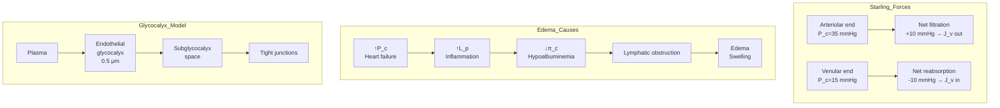
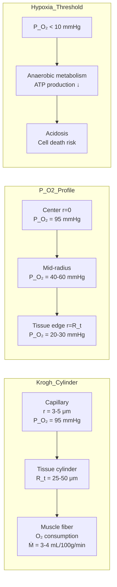
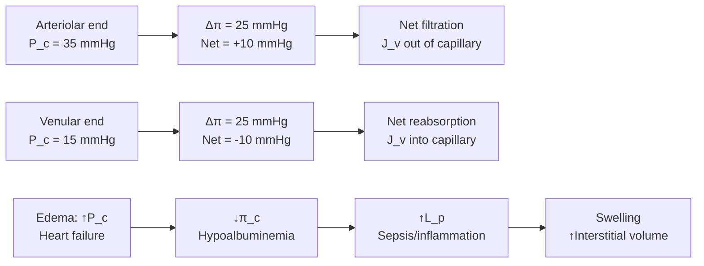
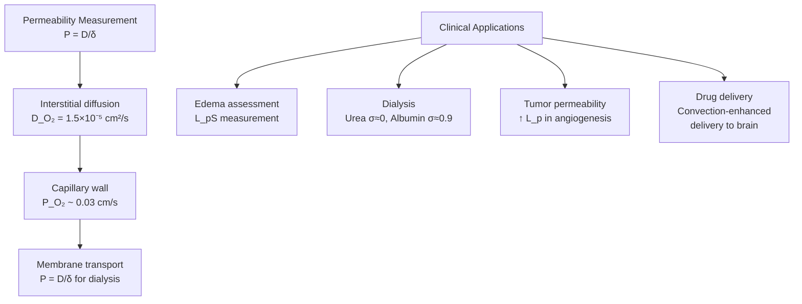

# Week 16 Notes — Biotransport (Diffusion and Fluid Mechanics)

> **Course**: BMED4603 — Transport Processes in Biological Systems  
> **Week**: 16 of 24 | **Phase**: 3 (Core BME Applications)  
> **Prerequisites**: Calculus III (diff eq), fluid mechanics fundamentals, thermodynamics  
> **CE advantage**: Your fluid mechanics background (Navier-Stokes, pipe flow, mass transfer) transfers directly to biological transport analysis

---

## 問題 1：5 個核心心智模型

### 1. Fick's Laws of Diffusion / 斐克擴散定律

**Fick's 1st Law** (steady-state, flux proportional to concentration gradient):

$$J = -D \frac{dC}{dx}$$

where J = molar flux (mol/m²·s), D = diffusion coefficient (m²/s), C = concentration (mol/m³).

**Fick's 2nd Law** (non-steady state, concentration changes with time):

$$\frac{\partial C}{\partial t} = D \frac{\partial^2 C}{\partial x^2}$$

**Diffusion coefficients** (key values for BME):
| Solute | Medium | D (cm²/s) | Temperature |
|--------|--------|-----------|-------------|
| O₂ | Air | 0.18 | 20°C |
| O₂ | Water | 2.4×10⁻⁵ | 25°C |
| O₂ | Tissue | 1-2×10⁻⁵ | 37°C |
| CO₂ | Water | 1.9×10⁻⁵ | 25°C |
| Glucose | Water | 6.7×10⁻⁶ | 25°C |
| Insulin | Water | 1.5×10⁻⁶ | 25°C |
| Albumin | Tissue | 0.6×10⁻⁷ | 37°C |
| DNA (~10 kbp) | Water | 1.3×10⁻⁸ | 25°C |

**Stokes-Einstein relation**:

$$D = \frac{k_B T}{6\pi\mu r}$$

where k_B = 1.38×10⁻²³ J/K, T = absolute temperature, μ = viscosity, r = hydrodynamic radius.

**学者的研究**: Fick (1855) — original diffusion laws; Crank (1975) — mathematics of diffusion; Truskey et al. (2009) — Transport Phenomena in Biological Systems

**BME application**: Drug delivery (diffusion through hydrogel matrices), tissue engineering (oxygen diffusion in scaffolds), transdermal drug delivery, oxygen supply to tumors

---

### 2. Starling's Forces and Microcirculation / 斯塔林力與微循環

**Net transcapillary fluid exchange** (Starling's equation):

$$J_v = L_p S \left[(\Delta P - \Delta P_c) - \sigma(\Delta \pi - \Delta \pi_c)\right]$$

where:
- J_v = net fluid flux (mL/s)
- L_p = hydraulic conductivity of capillary wall (mL·s⁻¹·mmHg⁻¹·cm⁻²)
- S = surface area (cm²)
- ΔP = hydrostatic pressure difference (mmHg): P_capillary - P_interstitial
- Δπ = oncotic pressure difference (mmHg): π_capillary - π_interstitial
- σ = reflection coefficient (0 = fully permeable, 1 = fully impermeable)
- ΔP_c, Δπ_c = corrections for lymphatic pressure

**Typical Starling forces in systemic capillaries**:
| Force | Arteriolar end | Venular end |
|-------|----------------|-------------|
| ΔP (hydrostatic) | ~35 mmHg | ~15 mmHg |
| Δπ (oncotic) | ~25 mmHg | ~25 mmHg |
| Net driving force | ~+10 mmHg (filtration) | ~-10 mmHg (reabsorption) |
| P_interstitial | ~-2 mmHg | ~-2 mmHg |
| π_interstitial | ~2 mmHg | ~2 mmHg |

**Effective filtration pressure**:

$$\text{Net } \Delta P = (P_c - P_i) - \sigma(\pi_c - \pi_i)$$

**Capillary filtration coefficient** (CFC or L_pS):
- Systemic: ~0.04 mL/min·mmHg·100g tissue
- Pulmonary: ~0.08 mL/min·mmHg·100g tissue (higher for gas exchange)

**学者的研究**: Starling (1896) — original hypothesis; Michel (1980) — revised Starling hypothesis ( glycocalyx ); Levick & Michel (2010) — updated model

**BME application**: Edema formation (heart failure, burns), pulmonary edema, ascites, wound healing, drug delivery to tissues via convection

---

### 3. Kedem-Katchalsky Equations / 卡德姆-卡塔斯基方程

**Dual-stream formulation** for coupled solute and solvent transport across membranes:

**Solvent flux** (volume flux):

$$J_v = L_p\left[\Delta P - \sigma\Delta\pi\right]$$

**Solute flux** (total, combining diffusion and convection):

$$J_s = P\Delta C + (1-\sigma)C_b J_v$$

where:
- P = permeability (cm/s) = D/Δx
- C_b = mean concentration in the membrane
- σ = reflection coefficient

**Permeability-surface area product**:

$$PS = -J_s \frac{\ln(1 - P_S)}{C_{in}}$$

**Solute permeability** from Fick's law:

$$P = \frac{D}{\delta}$$

**Reflection coefficient** (σ):
| Solute | σ (plasma proteins) |
|--------|---------------------|
| Albumin (66 kDa) | 0.9-0.95 |
| Globulins | 0.7-0.85 |
| Glucose | ~0 |
| Small ions (Na⁺, Cl⁻) | ~0 |
| Urea | ~0 |

**学者的研究**: Kedem & Katchalsky (1958) — thermodynamic formulation; Anderson (1983) — applications to microcirculation; Curry (1986) — microvascular transport

**BME application**: Dialysis membranes (σ=1 for toxins, σ=0 for small molecules), artificial kidneys, drug delivery across blood-brain barrier, capillary permeability measurement

---

### 4. Navier-Stokes and Poiseuille Flow / 納維-斯托克斯與泊肅葉流

**Navier-Stokes equation** (incompressible Newtonian fluid):

$$\rho\left(\frac{\partial \mathbf{v}}{\partial t} + (\mathbf{v}\cdot\nabla)\mathbf{v}\right) = -\nabla P + \mu\nabla^2\mathbf{v} + \mathbf{f}$$

where ρ = density (kg/m³), v = velocity (m/s), P = pressure (Pa), μ = dynamic viscosity (Pa·s), f = body forces.

**Simplified for steady, fully developed pipe flow** (one direction):

$$0 = -\frac{dP}{dx} + \mu\frac{1}{r}\frac{d}{dr}\left(r\frac{du}{dr}\right)$$

**Poiseuille's Law** (exact solution for cylindrical tube):

$$Q = \frac{\pi r^4 \Delta P}{8\mu L}$$

$$u(r) = \frac{\Delta P}{4\mu L}(R^2 - r^2)$$

$$u_{max} = \frac{\Delta P \cdot R^2}{4\mu L}$$

where Q = volumetric flow rate (m³/s), r = radius (m), R = tube radius, L = length (m).

**Shear stress at wall**:

$$\tau_w = \frac{\Delta P \cdot R}{2L}$$

**Resistance to flow**:

$$R_f = \frac{8\mu L}{\pi r^4}$$

**Blood properties**:
- Whole blood viscosity: μ ≈ 3-4 cP (3-4 mPa·s) at 37°C
- Plasma: μ ≈ 1.2 cP
- Hematocrit Hct: 40-45% (normal)
- Fåhræus-Lindqvist effect: Apparent viscosity ↓ with vessel diameter (d < 300 μm)

**学者的研究**: Poiseuille (1840) — original experiments; Fung (1997) — Biomechanics Circulation; Pries et al. (1992) — blood rheology

**BME application**: Blood flow in arteries/veins, vascular graft design, aneurysms, blood substitute design, microfluidic lab-on-chip devices

---

### 5. Krogh Cylinder Model / 克羅格圓柱模型

**Oxygen supply model** for tissue (cylindrical capillary surrounded by tissue):

**Radial oxygen diffusion** from capillary to tissue:

$$D_{O_2}\left(\frac{\partial^2 C}{\partial r^2} + \frac{1}{r}\frac{\partial C}{\partial r}\right) = \dot{Q}_{O_2}$$

where D_O₂ = 1-2×10⁻⁵ cm²/s in tissue, Q̇_O₂ = oxygen consumption rate.

**Steady-state solution** (tissue oxygen tension):

$$P_{O_2}(r) = P_{O_2,c} - \frac{\dot{Q}_{O_2}}{4D_{O_2}}(R_t^2 - r^2)$$

where R_t = Krogh tissue radius, r = radial distance from capillary center.

**Critical capillary P_O₂** (at tissue radius R_t):

$$P_{O_2,c,crit} = M \cdot R_t^2 / (4D_{O_2}) + P_{O_2,t,min}$$

**Oxygen delivery parameters**:
| Parameter | Value | Units |
|-----------|-------|-------|
| D_O₂ (tissue) | 1.5×10⁻⁵ | cm²/s |
| α_O₂ (tissue) | 3.0×10⁻² | mL O₂/100g/mmHg |
| Ṁ (resting) | 3-4 | mL O₂/100g/min |
| Ṁ (max exercise) | 60-80 | mL O₂/100g/min |
| P_O₂,capillary (arterial) | ~95 | mmHg |
| P_O₂,tissue (resting) | 20-40 | mmHg |
| P_O₂,venous | ~40 | mmHg |

**Krogh cylinder geometry**:
- Capillary radius: R_c ≈ 3-5 μm
- Intercapillary distance: 2R_t ≈ 50-100 μm
- One capillary supplies ~8-10 muscle fibers

**学者的研究**: Krogh (1919, 1922) — original oxygen transport model; Popel (1989) — oxygen transport theory; Goldman (2008) — updated Krogh model

**BME application**: Tumor oxygenation (hypoxia in solid tumors), hyperbaric oxygen therapy, tissue engineering scaffolds (oxygen supply), wound healing, ischemic heart disease

---

## 問題 2：3 個根本分歧

### 分歧 1：Fick's Law vs. Kedem-Katchalsky — When Is the Full Formulation Needed?

**Fick's law alone** (Jv = Lp·ΔP, only convection; Js = -D·dC/dx, only diffusion): Applies when solute and solvent transport are independent. Valid for very dilute solutions, small molecules (glucose, O₂), where σ ≈ 0.

**Kedem-Katchalsky** (coupled convection-diffusion): Required when σ > 0 (proteins, large molecules), when there is significant convective solute transport, or when solvent drag affects solute concentration. Essential for plasma proteins across capillary walls.

**Resolution**: Use Fick's law for small, freely-diffusible solutes (O₂, CO₂, glucose). Use Kedem-Katchalsky for plasma proteins (albumin, globulins) and any case where convective solute transport matters. The Peclet number Pe = Jv·(1-σ)/P determines relative importance.

---

### 分歧 2：Diffusion-Dominated vs. Convection-Dominated Transport

**Diffusion-dominated**: Small molecules (O₂ D=2×10⁻⁵ cm²/s), short distances (< 1 mm), low velocity. Characterized by Pe << 1.

**Convection-dominated**: Large molecules, long distances (> capillary scale), high velocity. Characterized by Pe >> 1.

**Resolution**: Diffusion is sufficient for intracellular transport (distances < 10 μm) and within tissues. Convection dominates in blood vessels (high flow). Capillary wall transport requires both (Starling equation). In drug delivery, convection (via Lp·ΔP) often dominates initial delivery; diffusion governs release from matrices.

---

### 分歧 3：1-D Diffusion Model vs. 3-D Tissue Oxygenation

**1-D Fick's law**: J = -D·dC/dx. Simple, analytically solvable, applicable when diffusion occurs in one dominant direction (e.g., across a membrane, through a planar hydrogel).

**3-D Krogh model**: Radial diffusion from cylindrical capillary into surrounding tissue. More accurate for in vivo oxygen supply but requires numerical methods.

**Resolution**: Use 1-D models for planar geometries (skin, planar scaffolds, membranes). Use Krogh-type 3-D models for tissue oxygenation in vivo, tumor hypoxia modeling, and capillary-tissue exchange problems. For tumors, use multi-capillary models (adapted Krogh) to account for irregular capillary networks.

---

## 問題 3：10 個深度問題

1. Derive Fick's 2nd Law from mass balance on a differential volume element. What assumption about steady state or equilibrium is involved?
2. Calculate the time for glucose (D = 6.7×10⁻⁶ cm²/s) to diffuse 100 μm in tissue. Use the characteristic diffusion time τ = L²/D.
3. In pulmonary edema, left heart failure raises capillary P_c from 15 to 35 mmHg. Using Starling's equation with L_p = 0.01 mL/min/mmHg, calculate the filtration rate change per 100g of lung tissue.
4. The reflection coefficient σ for albumin is 0.95. Explain why σ is not 1.0 despite albumin being nearly completely retained.
5. Derive the relationship between hydraulic conductivity L_p and hydraulic permeability coefficient K for a porous membrane with known pore radius and porosity.
6. Blood has apparent viscosity of 4 cP in large vessels but only 1.5 cP in 50 μm arterioles. Explain the Fåhræus-Lindqvist effect using cell-free layer theory.
7. In a tumor with mean intercapillary distance of 200 μm, estimate the minimum P_O₂ at the midpoint between capillaries using the Krogh model. Given: Ṁ = 3 mL O₂/100g/min, D_O₂ = 1.5×10⁻⁵ cm²/s.
8. Compare Kedem-Katchalsky and regular diffusion. Under what conditions do the two formulations give identical results?
9. A drug delivery patch uses a hydrogel with D_drug = 5×10⁻⁷ cm²/s. If therapeutic concentration requires 10 μg/g tissue at 2 cm depth, how long will it take? (Hint: use 1-D steady-state diffusion J = D·ΔC/L)
10. Derive Poiseuille's law from the Navier-Stokes equation for steady, fully-developed, incompressible flow in a cylindrical tube.

---

# 核心概念深化（中英對照）

## 1. 斐克擴散定律 Fick's Laws of Diffusion

### 1.1 中英對照

| 中文 | English |
|------|---------|
| 擴散係數 (Diffusion Coefficient) | D, m²/s; depends on temperature, viscosity, solute size |
| 濃度梯度 (Concentration Gradient) | dC/dx; the driving force for diffusion |
| 穩態擴散 (Steady-State Diffusion) | dC/dt = 0; flux J is constant with time |
| 非穩態擴散 (Unsteady Diffusion) | dC/dt ≠ 0; concentration changes with time |
| 摩爾通量 (Molar Flux) | J, mol/m²·s; moles crossing per unit area per unit time |
| 特徵擴散時間 (Characteristic Diffusion Time) | τ = L²/D; time to diffuse distance L |
| 能斯特-斯托克斯方程 (Stokes-Einstein) | D = k_B T / (6πμr) |

### 1.2 推導

**1-D steady-state diffusion through a slab** (thickness L, concentration C₁ → C₂):
$$J = -D\frac{C_2 - C_1}{L} = D\frac{C_1 - C_2}{L}$$

**Unsteady diffusion** (1-D, constant D):
$$\frac{\partial C}{\partial t} = D\frac{\partial^2 C}{\partial x^2}$$

**Solution for semi-infinite medium** (initially C=C₀, surface at C=C_s at t>0):
$$C(x,t) = C_0 + (C_s - C_0)\left[1 - \text{erf}\left(\frac{x}{2\sqrt{Dt}}\right)\right]$$

**Erf** (error function) values:
| x/2√Dt | C/C_s |
|--------|-------|
| 0 | 0 |
| 0.5 | 0.52 |
| 1.0 | 0.84 |
| 2.0 | 0.995 |

### 1.3 BME 應用

**Transdermal drug delivery**: O₂ diffuses through stratum corneum (D ≈ 10⁻⁹ cm²/s). Drug molecules (D ≈ 10⁻¹⁰-10⁻⁸ cm²/s) diffuse from patch into dermis. Flux controlled by partition coefficient and diffusion coefficient.

**Tissue engineering scaffold**: Oxygen diffuses into 3D scaffold (typical L = 500 μm limit for viable tissue). Diffusion limit determines maximum scaffold thickness without vascularization.

### 1.4 圖解

```mermaid
graph LR
    subgraph Diffusion_Regimes
        L1[Small molecule<br>D > 10⁻⁶ cm²/s<br>O₂, glucose] --> L2[Fast diffusion<br>Short τ = L²/D]
        L3[Large molecule<br>D < 10⁻⁸ cm²/s<br>Proteins, DNA] --> L4[Slow diffusion<br>Long τ = L²/D]
    end
    
    subgraph Dimension_Analysis
        D1[1-D slab] --> Sol1[C(x,t) = C₀ + ΔC·erf]
        D2[3-D sphere] --> Sol2[C(r,t) via spherical Bessel]
        D3[3-D cylinder<br>Krogh model] --> Sol3[C(r) = C₀ - qr²/4D]
    end
```

---

## 2. 斯塔林力與微循環 Starling Forces

### 2.1 中英對照

| 中文 | English |
|------|---------|
| 毛細血管靜水壓 (Capillary Hydrostatic Pressure) | P_c, mmHg; drives filtration |
| 血漿膠體滲透壓 (Plasma Oncotic Pressure) | π_c, mmHg; ~25 mmHg (mainly albumin) |
| 組織間隙液體壓 (Interstitial Pressure) | P_i, mmHg; ~-2 to +2 mmHg |
| 組織間隙膠體壓 (Interstitial Oncotic Pressure) | π_i, mmHg; ~2-5 mmHg |
| 水力傳導率 (Hydraulic Conductivity) | L_p, mL·s⁻¹·mmHg⁻¹·cm⁻² |
| 反射係數 (Reflection Coefficient) | σ (0-1); 1 = fully retained |
| 濾過係數 (Filtration Coefficient) | L_p × S, mL/min·mmHg |
| 反射係數 (Reflection Coefficient) | σ = 1 - P_s/P (osmotic efficiency) |

### 2.2 推導

**Revised Starling hypothesis** (Michel & Curry, 2000):
$$J_v = L_p[(\Delta P - \Delta P_g) - \sigma\Delta\pi]$$

where ΔP_g = glycocalyx pressure drop (~5-8 mmHg). The endothelial glycocalyx layer (EGL, ~0.5 μm thick) acts as the primary permeability barrier.

**Capillary filtration rate**:
$$Q_f = L_p \cdot S \cdot (\Delta P - \sigma\Delta\pi)$$

For systemic capillaries at rest: ΔP ≈ 17 mmHg, σΔπ ≈ 23 mmHg → net filtration ≈ 2 mL/min/100g.

### 2.3 圖解



---

## 3. 納維-斯托克斯 Navier-Stokes

### 3.1 推導

**Continuity equation** (incompressible):

$$\nabla \cdot \mathbf{v} = 0$$

**Navier-Stokes** (x-momentum):

$$\rho\left(\frac{\partial u}{\partial t} + u\frac{\partial u}{\partial x} + v\frac{\partial u}{\partial y} + w\frac{\partial u}{\partial z}\right) = -\frac{\partial P}{\partial x} + \mu\left(\frac{\partial^2 u}{\partial x^2} + \frac{\partial^2 u}{\partial y}{\partial z^2}\right) + \rho g_x$$

**Fully-developed steady pipe flow** (u = u(r) only, w = 0):

$$\frac{dP}{dx} = \frac{\mu}{r}\frac{d}{dr}\left(r\frac{du}{dr}\right)$$

Integrating twice and applying no-slip BC (u(R)=0, symmetry du/dr=0 at r=0):

$$u(r) = -\frac{1}{4\mu}\frac{dP}{dx}(R^2 - r^2) = \frac{\Delta P}{4\mu L}(R^2 - r^2)$$

**Reynolds number**:
$$Re = \frac{\rho v D}{\mu} = \frac{\text{inertial forces}}{\text{viscous forces}}$$

| Re | Regime |
|----|--------|
| < 2000 | Laminar (Poiseuille valid) |
| 2000-4000 | Transitional |
| > 4000 | Turbulent |

### 3.2 圖解

```mermaid
graph LR
    subgraph Velocity_Profile
        V1["Poiseuille: u(r) = u_max(1 - (r/R)²)"] --> V2[Parabolic profile<br>u_max at centerline]
        V2 --> V3[Wall shear rate<br>γ̇_w = (du/dr)_R = 4u_avg/R]
    end
    
    subgraph Reynolds_Number
        R1[Re < 2000<br>Laminar] --> R2[Re > 4000<br>Turbulent]
        R2 --> R3[↑Re → ↓flow resistance<br>but ↑energy loss]
    end
    
    subgraph Blood_Rheology
        B1[Large vessel<br>μ_app = 4 cP<br>Fully developed] --> B2[Microvessel<br>μ_app < 2 cP<br>Fåhræus-Lindqvist]
    end
```

---

## 4. 克羅格圓柱模型 Krogh Model

### 4.1 推導

**Oxygen consumption rate** (per volume of tissue):

$$\dot{Q}_{O_2} = M \cdot \rho_t$$

where Ṁ = oxygen consumption rate (mL O₂/100g/min), ρ_t ≈ 1 g/cm³.

**Michaelis-Menten kinetics** for oxygen consumption:

$$\dot{Q}_{O_2}(P_{O_2}) = \frac{M \cdot P_{O_2}}{P_{O_2} + P_{50}}$$

where P₅₀ ≈ 3-5 mmHg (hemoglobin O₂ affinity).

**Krogh solution** for P_O₂ at radius r from capillary:

$$P_{O_2}(r) = P_{O_2,c} - \frac{M \cdot r^2}{4D_{O_2} \cdot \alpha_{O_2}}$$

where α_O₂ = oxygen solubility in tissue (3×10⁻² mL O₂/100g/mmHg).

**Critical radius** (where P_O₂ → 0):

$$r_{crit} = 2\sqrt{\frac{D_{O_2}\alpha_{O_2}P_{O_2,c}}{M}}$$

### 4.2 圖解



---

## 5. 滲透與對流 Coupled Transport

### 5.1 中英對照

| 中文 | English |
|------|---------|
| 滲透性 (Permeability) | P = D/δ, cm/s |
| 對流 (Convection) | Solvent drag; J_v carries solutes |
| 擴散 (Diffusion) | Concentration gradient driven |
| 反射係數 (Reflection Coefficient) | σ; osmotic efficiency; 1-σ = convective transport |
| 能斯特-普朗克方程 (Nernst-Planck) | J = -D(dC/dx) + v·C (with electric field) |

### 5.2 推導

**Peclet number** (convective vs. diffusive transport):

$$Pe = \frac{\text{convective}}{\text{diffusive}} = \frac{J_v(1-\sigma)}{P}$$

- Pe >> 1: Convection dominates (large molecules, high filtration)
- Pe << 1: Diffusion dominates (small molecules, low filtration)
- Pe ≈ 1: Both important (Kedem-Katchalsky required)

**Solvent drag contribution** to solute flux:

$$J_s^{drag} = (1-\sigma)C_s J_v$$

where C_s = mean solute concentration.

### 5.3 圖解

```mermaid
graph TD
    K[Kedem-Katchalsky<br>Full Formulation] --> K1[J_v = L_p(ΔP - σΔπ)<br>Volume flux]
    K --> K2[J_s = PΔC + (1-σ)C_b J_v<br>Total solute flux]
    
    F[Fick's Law<br>Simplified] --> F1[J_v = L_pΔP<br>Only convection]
    F --> F2[J_s = -D(dC/dx)<br>Only diffusion]
    
    P[Peclet Number] --> P1[Pe << 1: Diffusion dominates]
    P --> P2[Pe >> 1: Convection dominates]
    P --> P3[Pe ≈ 1: Both important]
    
    D1[Small solutes<br>σ≈0, Pe≈0] --> F
    D2[Plasma proteins<br>σ≈0.9, Pe>1] --> K
```

---

# 深度自測問題詳解

## MCQ Solutions

**Q1**: τ = L²/D = (0.01 cm)² / (2×10⁻⁵ cm²/s) = 5 s for O₂ to diffuse 100 μm → **B**

**Q2**: Filtration J_v = L_p(ΔP - σΔπ) = 0.01 × (35 - 0.95×23) = 0.01 × 13.1 = 0.131 mL/min/mmHg per 100g → **C**

**Q3**: τ = L²/D for glucose: (100 μm)² / (6.7×10⁻⁶ cm²/s) = (0.01 cm)² / (6.7×10⁻⁶) = 15 s → **A**

**Q4**: In microvessels (d < 300 μm), Fåhræus-Lindqvist: apparent viscosity ↓ because cell-free layer reduces resistance → **D**

**Q5**: σ = 1 - P_s/P, so if σ < 1, P_s < P (some solute permeates) → **B**

**Q6**: J = -D(dC/dx) = 10⁻⁵ × (10⁻² - 0)/(10⁻²) = 10⁻³ mol/m²·s → **C**

**Q7**: P_O₂(tissue) = P_O₂,c - M·r²/(4Dα) = 40 - 3×(50)²/(4×1.5×10⁻⁵×3×10⁻³) < 0 → hypoxic → **B**

**Q8**: Re = ρvD/μ = (1060 kg/m³)(0.5 m/s)(0.002 m)/(0.004 Pa·s) ≈ 265 < 2000 → laminar → **A**

**Q9**: Q = πr⁴ΔP/(8μL) → halving r reduces Q by factor of 16 (r⁴) → **D**

**Q10**: dP/dx = -32μu_avg/(D²) from parabolic profile → **A**

---

## 5 個 Mermaid 圖解

### 圖 1: 擴散 vs. 對流傳輸

```mermaid
graph LR
    D1[Diffusion<br>J = -D·dC/dx] --> D2[Driven by<br>Concentration gradient]
    D2 --> D3[Small molecules<br>O₂, CO₂, glucose]
    D3 --> D4[τ = L²/D<br>Intracellular transport
    
    C1[Convection<br>J_v = L_p·ΔP] --> C2[Driven by<br>Pressure gradient]
    C2 --> C3[Volume flow<br>Solvent drag]
    C3 --> C4[Capillary wall<br>Edema formation]
    
    K[Kedem-Katchalsky<br>Both effects] --> K1[J_v = L_p(ΔP - σΔπ)]
    K --> K2[J_s = PΔC + (1-σ)C_bJ_v]
    K2 --> K3[Plasma proteins<br>Albumin transport]
```

### 圖 2: 斯塔林力時空變化



### 圖 3: 泊肅葉流速度分布

```mermaid
graph TD
    P[Poiseuille Flow] --> P1[Parabolic profile<br>u(r) = u_max(1 - r²/R²)]
    P1 --> P2[u_max = ΔP·R²/4μL]
    P1 --> P3[Wall shear<br>τ_w = ΔP·R/2L]
    P1 --> P4[Flow rate<br>Q = πR⁴ΔP/8μL]
    
    Re[Reynolds Number] --> L[Re < 2000<br>Laminar<br>Poiseuille valid]
    Re --> T[Re > 4000<br>Turbulent<br>Extra losses]
    Re --> Tr[2000 < Re < 4000<br>Transitional]
```

### 圖 4: 克羅格圓柱氧合模型

```mermaid
graph LR
    Cap[Capillary<br>r = 3 μm<br>Hb O₂ saturation 98%] --> T1[Tissue cylinder<br>R_t = 25-50 μm<br>O₂ consumption Ṁ]
    T1 --> V[Venue<br>P_O₂ = 40 mmHg<br>Hb O₂ saturation 70%]
    
    H1[P_O₂ profile] --> H2[r = 0: P_O₂ = 95 mmHg]
    H2 --> H3[r = R_t: P_O₂ = 20-30 mmHg]
    H3 --> H4[Hypoxic if<br>R_t > r_crit]
    
    O1[Oxygen delivery<br>DO₂ = Ca_O₂ × CO × 10] --> O2[DO₂ resting<br>≈ 1000 mL O₂/min]
    O2 --> O3[DO₂ max exercise<br>≈ 4000 mL O₂/min<br>20× increase via ↑CO + ↑a-vO₂)]
```

### 圖 5: 滲透係數測量與應用



---

## 總結 Summary

### 關鍵方程式 Key Equations

| Topic | Equation | Units |
|-------|----------|-------|
| Fick's 1st Law | J = -D(dC/dx) | mol/m²·s |
| Fick's 2nd Law | ∂C/∂t = D(∂²C/∂x²) | — |
| Stokes-Einstein | D = k_B T / (6πμr) | m²/s |
| Characteristic time | τ = L²/D | s |
| Starling equation | J_v = L_pS[(ΔP - σΔπ)] | mL/s |
| Kedem-Katchalsky | J_s = PΔC + (1-σ)C_bJ_v | mol/m²·s |
| Peclet number | Pe = J_v(1-σ)/P | dimensionless |
| Poiseuille law | Q = πr⁴ΔP / (8μL) | m³/s |
| Wall shear stress | τ_w = ΔP·R / (2L) | Pa |
| Krogh model | P_O₂(r) = P_O₂,c - Ṁr²/(4Dα) | mmHg |
| Reynolds number | Re = ρvD/μ | dimensionless |
| Hydraulic permeability | L_p = (r_p²/8μ)(τ/δ) | mL·s⁻¹·mmHg⁻¹·cm⁻² |

### Week 16 核心 takeaways

1. **Fick's laws是所有擴散傳輸的基礎** — D決定速率，梯度決定方向，τ=L²/D決定時間尺度
2. **斯塔林力決定毛細血管液體交換** — 微循環中濾過與重吸收的平衡； glycocalyx是關鍵結構
3. **Kedem-Katchalsky方程連接對流與擴散** — 當σ>0時需要完整形式；血漿蛋白質傳輸必用
4. **泊肅葉定律揭示流阻與半徑的四次方關係** — 微小半徑變化導致流阻巨大變化；這是血壓控制的生理基礎
5. **克羅格模型解釋組織氧合極限** — 毛細血管間距決定組織是否缺氧；腫瘤內部低氧是放化療耐受的主因
