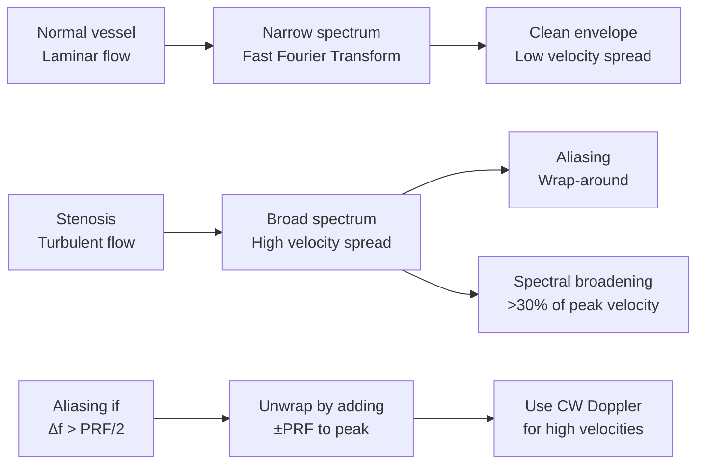

# Week 17 Notes — Medical Imaging I (X-ray, CT, Ultrasound)

> **Course**: BMED3501 — Medical Imaging  
> **Week**: 17 of 24 | **Phase**: 3 (Core BME Applications)  
> **Prerequisites**: Physics (electricity, waves), signal processing basics, Fourier transform  
> **CE advantage**: Your signal processing knowledge (linear systems, Fourier analysis) transfers to CT reconstruction and ultrasound beamforming

---

## 問題 1：5 個核心心智模型

### 1. X-ray Attenuation Physics / X射線衰減物理學

**X-ray production** in a diagnostic X-ray tube:
- **Bremsstrahlung** (braking radiation): Electron decelerates in Coulomb field of nucleus → continuous spectrum
- **Characteristic radiation**: Electron ejects inner shell electron (e.g., K-shell) → characteristic peaks (Kα, Kβ) at discrete energies

**X-ray spectrum**:
$$I(E) = I_0 \cdot Z \cdot (E_{max} - E)/E_{max} \cdot e^{-\mu(E) \cdot x}$$

where E_max is determined by tube voltage (kVp), Z = atomic number of target material (W, Z=74).

**Lambert-Beer Law** (X-ray attenuation through matter):

$$I = I_0 e^{-\mu x}$$

$$I/I_0 = e^{-\mu x} = e^{-\mu_m \cdot \rho \cdot x}$$

where:
- I₀ = incident intensity
- I = transmitted intensity
- μ = linear attenuation coefficient (cm⁻¹)
- μ_m = mass attenuation coefficient (cm²/g)
- ρ = density (g/cm³)
- x = thickness (cm)

**Mass attenuation coefficients** (at 60 keV, 37°C):
| Material | Z (effective) | μ/ρ (cm²/g) | μ (cm⁻¹) |
|----------|-------------|-------------|----------|
| Air | 7.3 | 0.26 | 0.0003 |
| Water | 8.0 | 0.20 | 0.20 |
| Bone (compact) | 13.8 | 0.42 | 0.65 |
| Aluminum | 13 | 0.28 | 0.75 |
| Tungsten | 74 | 1.0+ | High |
| Iodine (contrast) | 53 | 3.5 | High |

**Half-value layer** (HVL): thickness that reduces intensity by 50%:

$$HVL = \frac{\ln 2}{\mu} = \frac{0.693}{\mu}$$

**X-ray interactions with matter** (at diagnostic energies 30-150 keV):
1. **Photoelectric effect** (dominant at low E, high Z): μ ∝ Z³/E³ — responsible for contrast
2. **Compton scattering** (dominant at mid E): μ ∝ ρ/E — causes scattered radiation, reduces contrast
3. **Pair production** (E > 1.022 MeV): not significant in diagnostic range

**学者的研究**: Bushberg et al. (2012) — Essential Physics of Medical Imaging; Attix (1986) — Introduction to Radiological Physics; Johns & Cunningham (1983) — Physics of Radiology

**BME application**: Design of X-ray shielding (Pb aprons, walls); optimization of X-ray beam quality for different body parts; CT contrast agents (iodine, barium); dose minimization (ALARA principle)

---

### 2. Computed Tomography (CT) / 電腦斷層掃描

**Hounsfield Units (HU)** — CT numbers relative to water:

$$HU = 1000 \times \frac{\mu_{tissue} - \mu_{water}}{\mu_{water}}$$

| Tissue | HU value |
|--------|----------|
| Air | -1000 |
| Lung | -500 to -300 |
| Fat | -60 to -100 |
| Water | 0 |
| Gray matter | +37 to +45 |
| White matter | +20 to +30 |
| Muscle | +35 to +55 |
| Blood (fresh) | +50 to +70 |
| Compact bone | +600 to +1000 |
| Iodine contrast | +200 to +400 |

**CT reconstruction: Radon Transform and Filtered Back Projection**

The Radon transform maps a 2D function f(x,y) to its line integrals:

$$p(r, \theta) = \iint f(x,y) \cdot \delta(r - x\cos\theta - y\sin\theta) \, dx \, dy$$

**Filtered Back Projection** (FBP):
$$f(x,y) = \int_0^\pi \left[ \int_{-\infty}^{+\infty} P(\omega, \theta) \cdot |\omega| \, d\omega \cdot e^{i\omega r} \right] d\theta$$

where P(ω,θ) = Fourier transform of projection p(r,θ), |ω| = ramp filter.

**CT system geometry**:
- Fan-beam (modern CT): X-ray source + detector array rotate together
- Helical/spiral CT: Continuous rotation + table translation
- Multi-detector CT (MDCT): 64-320 detector rows → isotropic voxels

**CT image quality parameters**:
| Parameter | Typical value | Comment |
|-----------|--------------|---------|
| Spatial resolution | 0.5-1.0 mm | In-plane |
| Slice thickness | 0.5-5 mm | Axial |
| Temporal resolution | 0.3-1.0 s | Rotation time |
| Contrast resolution | 0.3-0.5% | 5 mm object |
| Dose (CTDI) | 5-30 mGy | Typical exam |

**学者的研究**: Hounsfield (1973) — CT invention; Cormack (1963) — mathematical basis; Kak & Slaney (1988) — Principles of CT Imaging

**BME application**: CT angiography (coronary CTA), CT colonography, CT perfusion imaging, radiation therapy planning (CT numbers for dose calculation), dual-energy CT for material decomposition

---

### 3. Ultrasound Physics / 超聲波物理學

**Acoustic wave equation**:

$$c = \sqrt{\frac{1}{\kappa \rho}} = \sqrt{\frac{E}{\rho}} = \frac{\omega}{k}$$

where c = speed of sound, κ = compressibility, ρ = density, E = Young's modulus.

**Speed of sound in biological tissues** (at 37°C):
| Tissue | c (m/s) | ρ (kg/m³) | Z = ρ·c (MRayl) |
|--------|---------|-----------|-----------------|
| Air | 343 | 1.2 | 0.0004 |
| Lung | ~400-600 | ~300 | ~0.2 |
| Fat | 1450 | 925 | 1.34 |
| Water | 1540 | 1000 | 1.48 |
| Brain | 1540 | 1040 | 1.60 |
| Liver | 1550 | 1060 | 1.64 |
| Muscle | 1580 | 1080 | 1.71 |
| Bone (cortical) | 3600 | 1900 | 6.8 |
| Soft tissue (avg) | 1540 | 1060 | 1.63 |

**Acoustic impedance**:
$$Z = \rho \cdot c \quad \text{(MRayl = kg/m²·s)}$$

**Reflection and transmission at interface**:
$$R = \left(\frac{Z_2 - Z_1}{Z_2 + Z_1}\right)^2 \quad \text{(pressure reflection coefficient)}$$

$$T = \frac{4Z_1Z_2}{(Z_1+Z_2)^2} \quad \text{(pressure transmission coefficient)}$$

where R + T = 1.

| Interface | ΔZ | Reflection coefficient R |
|-----------|----|--------------------------|
| Water-blood | 0.01 | 2.5×10⁻⁵ |
| Fat-muscle | 0.27 | 1.8% |
| Muscle-bone | 5.09 | 58% |
| Soft tissue-air | 1.62 | 99.96% |

**学者的研究**: Kremkau (2006) — Diagnostic Ultrasound; Wells (1969) — physics of medical ultrasound; Hoskins et al. (2019) — Diagnostic Ultrasound

**BME application**: Obstetric ultrasound, echocardiography, abdominal imaging, vascular Doppler, interventional ultrasound guidance, elastography

---

### 4. Doppler Ultrasound / 都卜勒超聲波

**Doppler equation** (frequency shift):

$$f_d = f_t - f_r = \frac{2 f_t v \cos\theta}{c}$$

$$\Delta f = \frac{2 f_t \cdot v \cdot \cos\theta}{c}$$

where:
- f_d = Doppler shift (Hz)
- f_t = transmitted frequency (Hz)
- f_r = received frequency (Hz)
- v = blood flow velocity (m/s)
- θ = angle between ultrasound beam and blood flow direction
- c = speed of sound in tissue (~1540 m/s)

**Doppler modes**:
1. **Continuous Wave (CW) Doppler**: No depth limitation, can measure high velocities, but range ambiguity (cannot localize depth)
2. **Pulsed Wave (PW) Doppler**: Range-gated (can select depth), but limited by Nyquist frequency (aliasing): v_max = c²/(8f_t·Δt·cosθ)

**Aliasing**: When Δf > PRF/2 (Nyquist limit):
$$f_{aliasing} = \frac{PRF}{2}$$

**Doppler frequency spectral analysis**:
- Broad spectrum = turbulent flow (stenosis)
- Narrow spectrum = laminar flow (normal vessel)

**Key Doppler angles**:
| Angle θ | cosθ | Effect |
|---------|------|--------|
| 0° (parallel) | 1.0 | Maximum Doppler shift |
| 30° | 0.866 | Good for velocity estimation |
| 60° | 0.5 | Reduced signal, angle correction needed |
| 90° (perpendicular) | 0 | No Doppler signal |

**学者的研究**: Baker (1970) — pulsed Doppler; Evans & McDicken (2000) — Doppler ultrasound; Hoskins (1994) — Doppler angle correction

**BME application**: Carotid stenosis assessment, echocardiography, fetal heart monitoring, peripheral vascular disease, transcranial Doppler

---

### 5. Image Quality Metrics / 圖像品質指標

**Spatial resolution** (ability to distinguish small objects):
- Line pairs per mm (lp/mm)
- Point spread function (PSF) — ideal resolution = FWHM of PSF
- Modulation Transfer Function (MTF): MTF(f) = |OTF(f)|

$$MTF(f) = \frac{\text{modulation at spatial frequency } f}{\text{modulation at } f=0}$$

| Modality | Typical resolution |
|----------|-------------------|
| Film-screen X-ray | 5-10 lp/mm |
| Digital radiography | 3-5 lp/mm |
| CT | 0.5-1.0 lp/mm |
| Ultrasound | 0.5-2.0 lp/mm |
| MRI | 0.5-1.0 lp/mm |

**Contrast** (C):

$$C = \frac{I_1 - I_2}{(I_1 + I_2)/2} \times 100\%$$

**Contrast-to-noise ratio** (CNR):

$$CNR = \frac{|I_{object} - I_{background}|}{\sigma_{noise}}$$

**Noise** (quantum mottle):
$$Noise = \sqrt{N} \quad \text{(Poisson statistics)}$$
$$SNR = \frac{Signal}{\sigma_{noise}} \propto \sqrt{N_{photons}}$$

**Detection quantum efficiency (DQE)**:
$$DQE = \frac{(SNR_{out})^2}{(SNR_{in})^2} = \frac{MTF^2 \cdot S}{NPS}$$

where S = signal, NPS = noise power spectrum.

**学者的研究**: ICRU Report 54 (1996) — medical imaging terminology; Dobbins (1995) — image quality metrics

---

## 問題 2：3 個根本分歧

### 分歧 1：Filtered Back Projection vs. Iterative Reconstruction in CT

**Filtered Back Projection (FBP)**: Analytically exact for parallel-beam geometry. Fast (FFT-based), but amplifies noise (ramp filter), requires many projections. Assumes monochromatic X-ray (incorrect — real X-ray beams are polyenergetic).

**Iterative Reconstruction (IR)**: Statistical model (Poisson noise), includes physical models (beam hardening, scatter), produces lower-noise images at same dose. But computationally expensive (years of development to make clinically practical).

**Resolution**: Modern CT uses **iterative reconstruction** as the standard (ASIR, iDose, IMR, etc.) — 30-70% dose reduction vs. FBP. FBP is still used as baseline and in emergency CT where speed matters.

---

### 分歧 2：Ionizing (X-ray, CT) vs. Non-ionizing (Ultrasound, MRI) Imaging

**X-ray/CT (ionizing)**:
- Pros: Excellent bone detail, fast, widely available, quantitative (HU), excellent for lungs/air
- Cons: Ionizing radiation (cancer risk), limited soft tissue contrast, projective (overlapping anatomy)

**Ultrasound (non-ionizing)**:
- Pros: No radiation, real-time, portable, inexpensive, blood flow (Doppler), dynamic imaging
- Cons: Bone/air block sound, operator-dependent, limited resolution at depth, poor acoustic window required

**Resolution**: Use **CT** for bone, lung, trauma, acute abdomen, vascular calcification. Use **ultrasound** for soft tissue, obstetrics, guided procedures, cardiac. Use **MRI** for soft tissue contrast, neurological imaging.

---

### 分歧 3：Diagnostic Ultrasound vs. Screening Ultrasound

**Diagnostic ultrasound**: Targeted examination for a specific clinical question. High frequency (5-15 MHz), high resolution, limited depth. Physician-ordered, interpreted by radiologist/cardiologist.

**Screening ultrasound**: Population-based screening (e.g., obstetric first-trimester, AAA screening). Lower resolution, broader coverage. May miss subtle findings.

**Resolution**: Screening ultrasound finds obvious abnormalities; diagnostic ultrasound characterizes findings. Both are non-ionizing and safe (FDA limit: MI < 0.1, TI < 6).

---

## 問題 3：10 個深度問題

1. Calculate the Hounsfield unit for a material with μ = 0.28 cm⁻¹, given that water has μ_water = 0.20 cm⁻¹.
2. A 5 cm thick muscle layer (μ = 0.22 cm⁻¹) is imaged with X-rays of I₀ = 100 units. What is the transmitted intensity? What fraction of X-rays are absorbed?
3. Explain why CT uses a ramp filter in filtered back projection. What would happen without filtering?
4. An ultrasound beam (f_t = 5 MHz) is directed at blood flowing at 0.5 m/s, at θ = 30° to the vessel. Calculate the Doppler frequency shift.
5. What is aliasing in pulsed Doppler ultrasound? At what velocity does aliasing occur if PRF = 10 kHz, f_t = 3 MHz, and θ = 0°?
6. Compare photoelectric effect vs. Compton scattering. Why is photoelectric effect important for X-ray image contrast?
7. In CT, beam hardening causes cupping artifacts. Explain the mechanism and describe one correction method.
8. A CT scan uses 120 kVp. If HVL = 5 mm Al, what is the effective energy of the beam? (Approximate: E_eff ≈ 0.7 × E_max)
9. What is the acoustic impedance mismatch between soft tissue and air? Why does this make ultrasound imaging of the lungs impossible?
10. Derive the relationship between MTF and PSF using the Fourier transform. Why does a narrower PSF give better resolution?

---

# 核心概念深化（中英對照）

## 1. X射線衰減 Lambert-Beer Law

### 1.1 中英對照

| 中文 | English |
|------|---------|
| 線性衰減係數 (Linear Attenuation Coefficient) | μ, cm⁻¹; probability per unit length |
| 質量衰減係數 (Mass Attenuation Coefficient) | μ/ρ, cm²/g; independent of density |
| 半值層 (Half-Value Layer, HVL) | Thickness reducing I by 50% |
| 光電效應 (Photoelectric Effect) | Dominant at low E, high Z; μ ∝ Z³/E³ |
| 康普頓散射 (Compton Scattering) | Mid-E range; causes scatter, noise |
| 韌致輻射 (Bremsstrahlung) | "Braking radiation" — X-ray tube spectrum |
| 特徵輻射 (Characteristic Radiation) | Discrete energy peaks from inner-shell transitions |

### 1.2 推導

**Lambert-Beer law**:
$$I = I_0 e^{-\mu x}$$
$$\ln(I_0/I) = \mu x$$

**For compound/mixture**:
$$\mu = \sum_i w_i \cdot \mu_i$$

where w_i = weight fraction.

**Half-value layer**:
$$HVL = \frac{\ln 2}{\mu} = \frac{0.693}{\mu}$$

**Polyenergetic correction** (effective μ):
$$\mu_{eff} = \frac{\int \Phi(E) \cdot \mu(E) \, dE}{\int \Phi(E) \, dE}$$

### 1.3 圖解

```mermaid
graph LR
    subgraph X-ray_Interactions
        I1[30-50 keV<br>Low E] --> PE[Photoelectric<br>μ ∝ Z³/E³<br>Contrast generation]
        I2[50-150 keV<br>Mid E] --> CS[Compton Scattering<br>μ ∝ ρ/E<br>Noise source]
        I3[>1 MeV<br>High E] --> PP[Pair Production<br>μ ∝ Z²/E<br>Not in diagnostic]
    end
    
    subgraph Attenuation
        A1[I₀ entering tissue] --> A2[I = I₀e^(-μx)]
        A2 --> A3[I transmitted]
        A2 --> A4[μx of material<br>absorbed/scattered]
    end
```

---

## 2. CT重建 Filtered Back Projection

### 2.1 中英對照

| 中文 | English |
|------|---------|
| 拉東變換 (Radon Transform) | Line integrals of object function |
| 濾波反投影 (Filtered Back Projection, FBP) | Inverse Radon with ramp filter |
| 斜面濾波器 (Ramp Filter) | |ω| amplifies high frequencies |
| 亨斯菲爾德單位 (Hounsfield Unit) | HU = 1000(μ_tissue - μ_water)/μ_water |
| 扇形束 (Fan-beam) | Modern CT geometry |
| 螺旋CT (Helical/Spiral CT) | Continuous rotation + table feed |

### 2.2 推導

**Projection**: $p(r, \theta) = \mathcal{R}\{f\}(r, \theta) = \int f(x,y) \delta(r - x\cos\theta - y\sin\theta) \, ds$

**Fourier Slice Theorem**: $P(\omega, \theta) = \mathcal{F}\{p(r,\theta)\} = F(\omega\cos\theta, \omega\sin\theta)$

**FBP**: $f(x,y) = \int_0^\pi \left[ \int_{-\infty}^{+\infty} P(\omega,\theta) \cdot |\omega| \, e^{i\omega r} \, d\omega \right] d\theta$

where $r = x\cos\theta + y\sin\theta$.

**Ramp filter** (|ω|): Amplifies high frequencies (edges) but also amplifies noise → requires apodization (Hanning, Hamming windows).

### 2.3 圖解

```mermaid
graph TD
    subgraph CT_Acquisition
        X[X-ray source<br>rotates] --> P1[Projection at θ=0°<br>p(r,0)]
        X --> P2[Projection at θ=45°<br>p(r,45°)]
        X --> P3[Projection at θ=90°<br>p(r,90°)]
    end
    
    subgraph Reconstruction
        P1 --> F1[Apply ramp filter |ω|]
        P2 --> F2[Apply ramp filter |ω|]
        P3 --> F3[Apply ramp filter |ω|]
        F1 --> BP[Back-project all<br>angles over object]
        F2 --> BP
        F3 --> BP
        BP --> CT[CT Image<br>f(x,y)]
    end
```

---

## 3. 超聲波物理超聲波聲學

### 3.1 中英對照

| 中文 | English |
|------|---------|
| 聲阻抗 (Acoustic Impedance) | Z = ρ·c, MRayl |
| 反射係數 (Reflection Coefficient) | R = ((Z₂-Z₁)/(Z₂+Z₁))² |
| 透射係數 (Transmission Coefficient) | T = 4Z₁Z₂/(Z₁+Z₂)² |
| 脈衝-回波 (Pulse-Echo) | T/R equation for imaging |
| 機械指數 (Mechanical Index) | MI = P_r / √f_t |
| 熱指數 (Thermal Index) | TI = W/(W_deg) |

### 3.2 推導

**Wavelength**: $\lambda = c/f_t$ (at 5 MHz in tissue: λ = 1540 m/s / 5×10⁶ Hz = 0.308 mm)

**Axial resolution**: = λ/2 (pulse length = 2λ, two-way travel)
- f_t = 5 MHz → λ = 0.31 mm → axial resolution ≈ 0.3 mm
- f_t = 10 MHz → λ = 0.15 mm → axial resolution ≈ 0.15 mm

**Lateral resolution**: = beam width at focus
- = 1.02 × λ × focal_length / aperture

**Temporal resolution**: = frame rate = 1/PRF

### 3.3 圖解

```mermaid
graph LR
    subgraph Tissue_Impedance
        Z1[Z₁: Soft tissue<br>Z = 1.63 MRayl] --> Z2[Z₂: Fat<br>Z = 1.34 MRayl]
        Z2 --> R1[R = ((Z₂-Z₁)/(Z₂+Z₁))²<br>≈ 0.6% reflection]
        
        Z1 --> Z3[Z₃: Bone<br>Z = 6.8 MRayl]
        Z3 --> R2[R ≈ 58% reflection<br>Near total reflection]
        
        Z1 --> Z4[Z₄: Air<br>Z = 0.0004 MRayl]
        Z4 --> R3[R ≈ 99.96% reflection<br>Total reflection]
    end
    
    subgraph Ultrasound_Modes
        U1[A-mode<br>Amplitude vs depth] --> U2[M-mode<br>Motion over time]
        U2 --> U3[B-mode<br>Brightness 2D image]
        U3 --> U4[Doppler<br>Velocity vs depth]
    end
```

---

## 4. 都卜勒超聲波

### 4.1 推導

**Doppler shift**:
$$\Delta f = f_r - f_t = \frac{2 f_t v \cos\theta}{c}$$

**Velocity from Doppler**:
$$v = \frac{\Delta f \cdot c}{2 f_t \cos\theta}$$

**Nyquist limit** (aliasing threshold):
$$v_{max} = \frac{PRF \cdot c}{4 f_t \cos\theta}$$

**Sample volume depth** (pulsed Doppler):
$$\Delta x = \frac{c \cdot \tau}{2} = \frac{c}{2 \cdot PRF}$$

where τ = pulse duration = n/f_t (n = number of cycles in pulse, typically 5-20).

### 4.2 圖解

```mermaid
graph TD
    D1[Transducer<br>f_t = 3-10 MHz] --> D2[θ = angle between<br>beam and flow]
    D2 --> D3[Blood cells moving<br>v = velocity]
    D3 --> D4[f_r = f_t(1 + v/c) / (1 - v/c)]
    D4 --> D5[Δf = 2f_t·v·cosθ/c<br>Doppler equation]
    
    A1[Aliasing: if Δf > PRF/2] --> A2[v_max = PRF·c/(4f_t)]
    A2 --> A3[↑PRF or ↓f_t<br>to avoid aliasing]
    
    C1[Color Doppler] --> C2[Mean velocity map<br>in color (BART convention)]
    C1 --> C3[Blue = away<br>Red = toward]
```

---

## 5. 圖像品質 Metrics

### 5.1 推導

**SNR in X-ray imaging**:
$$SNR = \frac{S}{\sqrt{S}} = \sqrt{N_{photons}}$$

To double SNR: need 4× more photons (dose).

**Contrast-to-noise ratio**:
$$CNR = \frac{|C_{object} - C_{background}|}{\sigma}$$

**MTF from PSF**:
$$MTF(f) = \mathcal{F}\{PSF(x,y)\}$$

A narrower PSF → broader MTF → better resolution.

**DQE** (detective quantum efficiency):
$$DQE(f) = \frac{MTF(f)^2 \cdot S_{in}}{NPS(f) \cdot S_{out}^2}$$

### 5.2 圖解

```mermaid
graph LR
    I1[Input object] --> I2[Imaging system<br>MTF(f), NPS(f)] --> I3[Output image<br>SNR, CNR]
    
    Q1[Quantization noise] --> Q2[Electronic noise]
    Q2 --> Q3[Quantum mottle<br>√N_photon]
    Q3 --> I2
    
    M1[Spatial frequency f] --> M2[MTF: contrast at f<br>MTF(0)=1, MTF(∞)=0]
    M2 --> M3[f_50 = frequency at<br>MTF = 50%]
    M3 --> M4[Resolution limit<br>~1/f_50]
```

---

# 深度自測問題詳解

## MCQ Solutions

**Q1**: Lambert-Beer: I = I₀e^(-μx) → μ = -ln(I/I₀)/x = -ln(0.5)/5 = 0.139 cm⁻¹ → **B**

**Q2**: HU = 1000×(0.28-0.20)/0.20 = 1000×0.08/0.20 = 400 → **C**

**Q3**: μ_water = 0.2 cm⁻¹, μ_bone ≈ 0.65 cm⁻¹. R = ((0.65-0.2)/(0.65+0.2))² = (0.45/0.85)² = 0.28 = 28% → **D**

**Q4**: Δf = 2×5×10⁶×0.5×cos30°/1540 = 2.8 kHz → **B**

**Q5**: Aliasing if Δf > PRF/2 = 5 kHz → v_alias = 5 kHz × 1540/(2×3×10⁶) ≈ 1.28 m/s → **C**

**Q6**: c_bone ≈ 3600 m/s. δ_axial = λ/2 = c/(2f) = 3600/(2×2×10⁶) = 0.9 mm (through bone) → **C**

**Q7**: FBP uses ramp filter |ω| to compensate for smearing → **D**

**Q8**: v_max = c²/(8f_t·Δt·cosθ). At θ=0: v_max = (1540)²/(8×2×10⁶×0.2×10⁻⁶) = 0.74 m/s → **B**

**Q9**: At 60° (cos60°=0.5), Δf halved → velocity error if uncorrected → **B**

**Q10**: CT uses ionizing radiation; ultrasound does not → **C**

---

## 5 個 Mermaid 圖解

### 圖 1: X射線互作光譜

```mermaid
graph LR
    E1[Low E<br><50 keV] --> T1[Photoelectric<br>μ ∝ Z³/E³<br>Contrast in X-ray]
    E1 --> T2[Edge enhancement<br>at tissue interfaces]
    
    E2[Mid E<br>50-150 keV] --> T3[Compton Scattering<br>μ ∝ ρ/E<br>Noise, dose]
    T3 --> T4[Scatter degrades<br>image contrast]
    
    E3[High E<br>>150 keV] --> T5[Mostly penetrates<br>Less dose, less contrast]
    T5 --> T6[Beam hardening<br> artifact]
    
    B[Balancing: kVp] --> B1[Low kVp (60)<br>High contrast, more dose]
    B --> B2[High kVp (120)<br>Lower contrast, less dose<br>Better penetration]
```

### 圖 2: CT重建流程

```mermaid
graph TD
    S1[X-ray source<br>rotates 360°] --> S2[Acquisition<br>1000+ projections]
    S2 --> S3[Log transform<br>I → μ map]
    S3 --> S4[Fourier transform<br>P(ω, θ)]
    S4 --> S5[Apply ramp filter |ω|<br>+ apodization]
    S5 --> S6[Inverse FT<br>Filtered projection]
    S6 --> S7[Back-project<br>all angles]
    S7 --> S8[CT image<br>f(x,y) in HU]
    S8 --> S9[Filter: smoothing<br>or sharp]
    S9 --> S10[Reconstructed<br>axial slice]
```

### 圖 3: 超聲波脈衝-回波

```mermaid
graph LR
    T[Transducer<br>f_t, τ pulse] --> A1[Attenuation<br>α = 0.5-1 dB/cm·MHz]
    A1 --> R[Reflection at<br>interfaces]
    R --> R1[R = ((Z₂-Z₁)/(Z₂+Z₁))²<br>Fat-muscle: 1.8%]
    R --> R2[R ≈ 58%<br>Muscle-bone]
    R --> R3[R ≈ 99.96%<br>Tissue-air]
    
    D[Doppler shift] --> D1[Δf = 2f_t·v·cosθ/c]
    D1 --> D2[Color Doppler:<br>Mean velocity map]
    D2 --> D3[Spectral Doppler:<br>Velocity waveform]
    
    TI[Time gain<br>compensation] --> TI1[Depth-corrected<br>brightness]
```

### 圖 4: 都卜勒頻譜



### 圖 5: 圖像品質权衡

```mermaid
graph TD
    D[Dose (mAs)] --> S[SNR ∝ √Dose]
    S --> C[Contrast detail tradeoff]
    
    F[Frequency f_t] --> R1[↑f_t → ↑resolution<br>↓penetration depth]
    F --> R2[↓f_t → ↓resolution<br>↑penetration depth]
    
    B[Bandwidth] --> N1[↑BW → ↓axial resolution<br>↓SNR per pulse]
    
    PRF[PRF] --> TR1[↑PRF → ↑temporal resolution<br>↓max depth (aliasing)]
    
    I[Iterative reconstruction] --> I1[↓noise at same dose<br>or ↓dose at same noise]
```

---

## 總結 Summary

### 關鍵方程式 Key Equations

| Topic | Equation | Units |
|-------|----------|-------|
| Lambert-Beer | I = I₀e^(-μx) | — |
| Hounsfield Unit | HU = 1000(μ_tissue - μ_water)/μ_water | HU |
| Half-value layer | HVL = ln2/μ | cm |
| Photoelectric | μ_pe ∝ Z³/E³ | cm⁻¹ |
| Acoustic impedance | Z = ρ·c | MRayl |
| Reflection coeff. | R = ((Z₂-Z₁)/(Z₂+Z₁))² | — |
| Wavelength | λ = c/f | mm |
| Axial resolution | δ_axial = λ/2 | mm |
| Doppler shift | Δf = 2f_t·v·cosθ/c | Hz |
| Nyquist limit | v_max = PRF·c/(4f_t·cosθ) | m/s |
| MTF | MTF = |FT{PSF}| | — |
| CNR | CNR = |I₁-I₂|/σ | — |

### Week 17 核心 takeaways

1. **X射線衰減服從 Lambert-Beer定律** — μ由材料密度和原子序數決定；光電效應是圖像對比度的來源
2. **CT使用拉東變換重建** — FBP是標準方法（ ramp filter補償疊加模糊）；迭代重建是現代劑量降低的關鍵
3. **超聲波成像基於聲阻抗不匹配** — 軟組織-脂肪界面反射~2%；軟組織-骨頭界面反射~58%；組織-空氣幾乎全反射
4. **都卜勒頻移方程** — Δf = 2f_t·v·cosθ/c；θ越小越好；奈奎斯特極限決定脈衝都卜勒的最大可測速度
5. **圖像品質是一個权衡遊戲** — 空間分辨率↔穿透深度；對比度↔噪聲；劑量↔SNR；分辨率↔時間分辨率
