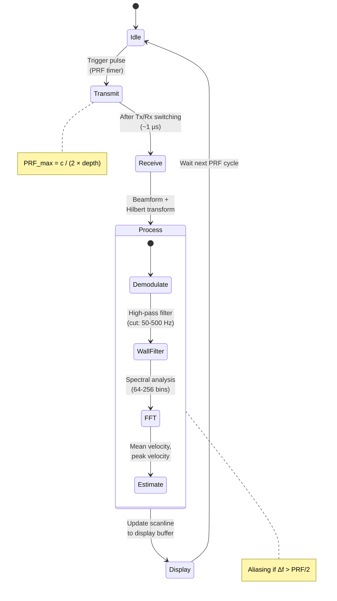
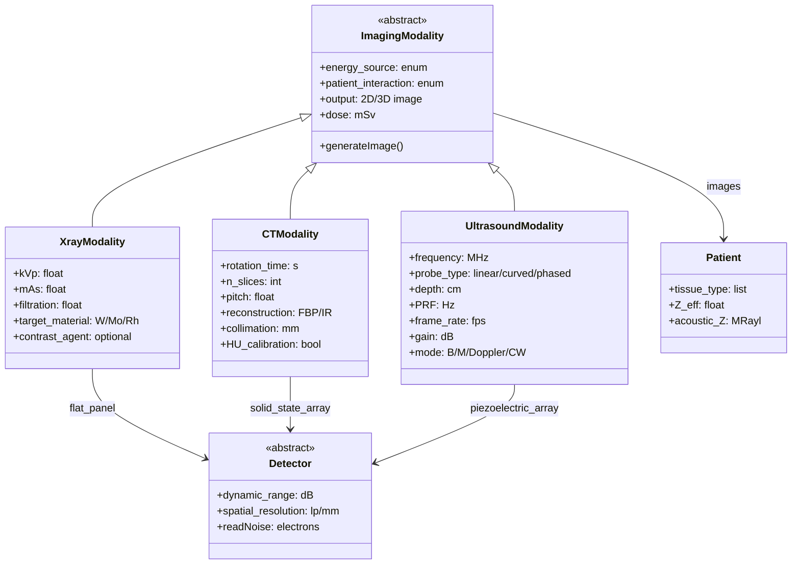
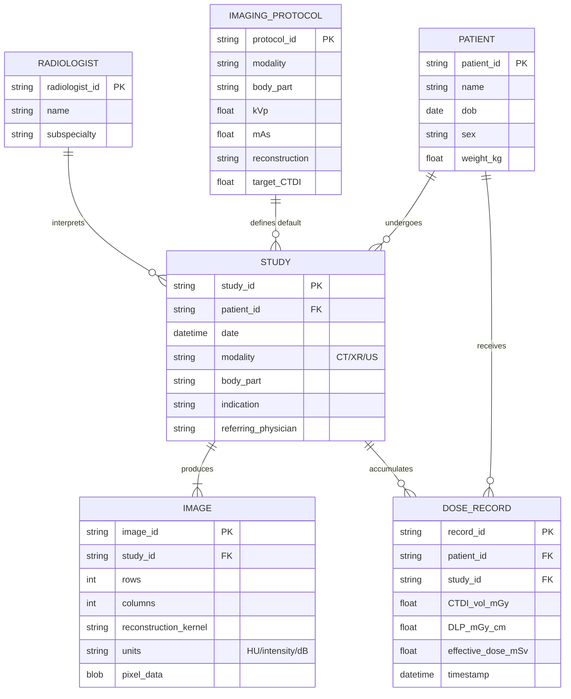
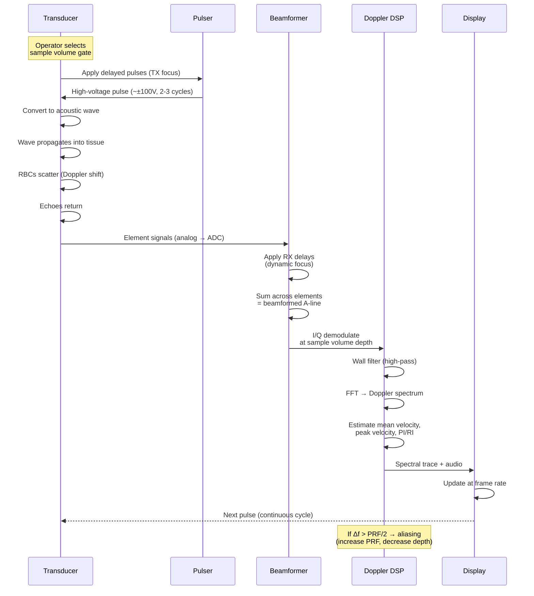

# BMED3501 — Week 17: Medical Imaging I (X-ray, CT, Ultrasound)
## Deep Study Format Course Body

---

# 5MM — Five Mental Models

## MM-1. Lambert-Beer Exponential Attenuation Model

The foundational equation governing X-ray propagation through matter. Treats the photon beam as a population of independent particles being randomly removed by interactions.

$$I(x) = I_0 \, e^{-\mu x}$$

where $I_0$ is incident intensity, $\mu$ (cm⁻¹) is the **linear attenuation coefficient** (a sum of photoelectric, Compton, and Rayleigh contributions), and $x$ is path length. Taking logs yields the **half-value layer (HVL)**: $\text{HVL} = \ln 2 / \mu \approx 0.693/\mu$.

- **Mass attenuation form**: $\mu/\rho$ (cm²/g), nearly energy-dependent only after dividing by density — allows cross-tissue comparison.
- **Tabulated values** at 60 keV: $\mu_\text{air} \approx 0$, $\mu_\text{fat} \approx 0.18$ cm⁻¹, $\mu_\text{muscle} \approx 0.22$ cm⁻¹, $\mu_\text{bone} \approx 0.65$ cm⁻¹ (Hubbell & Seltzer 2004, NIST tables).
- **Effective energy of polychromatic beam** shifts higher as lower-energy photons are preferentially removed → **beam hardening artifact** in CT (Brooks & Di Chiro 1976).

## MM-2. Photoelectric Dominance at Diagnostic Energies

At energies below ~100 keV and high-Z materials (bone, iodine contrast), the photoelectric effect dominates and creates the diagnostic contrast between tissues.

$$\tau \propto \frac{Z^{3 \text{ to } 4}}{E^{3}}$$

where $Z$ is effective atomic number and $E$ is photon energy. This sharp $Z$-dependence is *why* bones light up on radiographs and *why* iodinated contrast ($Z = 53$) works.

- **Sharpe ratio**: between soft tissue ($Z \approx 7.4$) and bone ($Z \approx 13.8$), the ratio $\tau_\text{bone}/\tau_\text{soft} \approx (13.8/7.4)^{3.5} \approx 11\times$ — this is the contrast mechanism (Curry et al. 1990, *Christensen's Physics of Diagnostic Radiology*).
- **Clinical cutoff**: above ~200 keV photoelectric yield collapses; this is why CT uses 80–140 kVp.

## MM-3. Hounsfield Unit Calibration Scale

The CT number linearizes $\mu$ against water as reference, making pixel values diagnostically interpretable.

$$\text{HU} = 1000 \times \frac{\mu - \mu_\text{water}}{\mu_\text{water}}$$

| Tissue | HU |
|--------|----|
| Air | −1000 |
| Lung | −700 to −600 |
| Fat | −100 to −50 |
| Water | 0 |
| CSF | +15 |
| Muscle | +35 to +55 |
| Blood (clot) | +60 to +100 |
| Bone (cortical) | +700 to +3000 |
| Iodine | >+3000 |

- **Discovery**: Godfrey Hounsfield, 1971–1973 EMI scanner; Nobel Prize 1979 (Cormack 1963, Hounsfield 1973).
- **Modern dynamic range**: 12-bit (−1024 to +3071) covers HU range; **windowing** (W/L) maps this to display gray levels.

## MM-4. Central Projection & Fourier Slice Theorem

CT reconstruction rests on the **Radon transform** (1917) and its Fourier dual. Each projection of an object at angle $\theta$ samples one radial line of the object's 2D Fourier transform.

$$\mathcal{F}_1\{P_\theta(s)\}(\omega) = \tilde{f}(\omega\cos\theta, \omega\sin\theta)$$

- **Practical FBP pipeline**: acquire $N_\theta$ projections (typically 1000 per rotation), 1D-FFT each → fill polar grid of 2D frequency space → interpolate to Cartesian → multiply by ramp filter $|\omega|$ → 2D inverse FFT.
- **Ramp filter** compensates for the $1/|\omega|$ density of polar sampling — without it, images are blurred (Ramachandran & Lakshminarayanan 1971).
- **Nyquist criterion**: pixel spacing $p \leq 1/(2 f_\text{max})$ where $f_\text{max}$ is the highest sampled frequency.

## MM-5. Acoustic Impedance & Doppler Shift

Two intertwined models for ultrasound:

**(a) Acoustic impedance** determines reflection and transmission:
$$Z = \rho c \quad [\text{kg/m}^2\text{·s}] = [\text{Rayl}]$$
Reflection coefficient at normal incidence:
$$R = \left(\frac{Z_2 - Z_1}{Z_2 + Z_1}\right)^2$$

| Tissue | Z (MRayl) |
|--------|-----------|
| Air | 0.0004 |
| Lung | 0.18 |
| Fat | 1.38 |
| Water | 1.50 |
| Muscle | 1.71 |
| Blood | 1.66 |
| Bone (cortical) | 6.8–7.8 |
| PZT (transducer) | 20–35 |

- **Near-total reflection** at soft tissue–air (R ≈ 0.999) and soft tissue–bone (R ≈ 0.36) is *why* ultrasound gel is mandatory and *why* lung/bone imaging is poor.

**(b) Doppler shift** for moving reflectors (red blood cells):
$$\Delta f = \frac{2 f_t v \cos\theta}{c}$$

- Factor of 2 because ultrasound reflects *off* the moving RBCs (round trip).
- $\cos\theta$ correction is critical: $\theta = 90°$ gives zero shift (operator must align).
- **Nyquist limit**: $\Delta f_\text{max} = \text{PRF}/2$; exceeding it produces **aliasing**.

---

# 3DG — Three Fundamental Disagreements

## DG-1. Iterative Reconstruction (IR) vs. Filtered Back Projection (FBP) in Clinical CT

**Position A (IR proponents — sidky et al., Pan et al., 2011–present)**: Iterative algorithms (MBIR, ASIR, ADMIRE, model-based) better suppress noise, allow dose reduction of 30–60%, and improve low-contrast detectability. Iterative reconstruction should become the clinical standard.

**Position B (FBP defenders — classic radiology physics literature)**: FBP is linear, mathematically well-characterized, predictable in texture, and computationally cheap. IR algorithms can produce "plastic-looking" or blotchy images and obscure subtle textures; resolution-noise trade-offs are non-intuitive. FBP should remain the workhorse for most diagnostic tasks.

**The tension**: Dose reduction is a public-health imperative (Brenner & Hall 2007, *NEJM*) and IR delivers it convincingly, but image texture distortion may mask pathology (e.g., subtle ground-glass opacities in the lung). Regulatory bodies (FDA 2014 guidance) and professional societies (ACR) are still calibrating dose-reference levels as the field transitions. The disagreement is partly resolved by hybrid strategies (e.g., 60% FBP + 40% ASIR), but the philosophical question — "is more processing always better?" — remains.

## DG-2. Is Diagnostic Ultrasound Safe for the Fetus? (Thermal vs. Mechanical Bioeffects)

**Position A (cautious — Abramowicz, Abramowicz & Sheiner 2007–2013)**: Ultrasound causes both **thermal** (TI = $W/(m \cdot f_t \cdot c)$-related heating) and **mechanical** (MI = peak negative pressure/$\sqrt{f_t}$) bioeffects. Even at FDA limits (MI ≤ 1.0, TI ≤ 1.5), thermal dose can approach 1°C in early first-trimester tissue. Routine keepsake imaging should be discouraged.

**Position B (clinical realism — Campbell 2010, Reddy 2015)**: Decades of epidemiological surveillance have shown no proven harm from diagnostic obstetric ultrasound. Risk models extrapolate from tissue heating in vitro and assume worst-case insonation; ALARA is sensible but should not impede medically indicated imaging. The benefits of detecting anomalies are concrete; speculative harm is not.

**The tension**: The disagreement is between theoretical-extrapolative risk and empirical-population risk. As 3D/4D keepsake ultrasound grows as a commercial industry, regulatory lines (FDA Track 3, 510(k) limits) are tested. The scholarly debate continues in *Ultrasound in Obstetrics & Gynecology*.

## DG-3. Spectral CT / Dual-Energy CT (DECT): Real Advance vs. Expensive Novelty?

**Position A (advocates — McCollough et al. 2015, Marin et al. 2014)**: DECT material decomposition (iodine-only images, virtual non-contrast, mono-energetic reconstructions) provides incremental diagnostic information — characterizing renal masses, reducing beam-hardening artifacts, quantifying urate/calcium in gout. The benefit justifies cost.

**Position B (skeptics — native 120-kVp protocols, ACR Appropriateness Criteria)**: Most DECT findings could be obtained with multiple conventional scans or MRI. Added dose (occasionally), proprietary post-processing, and operator learning curve outweigh benefits in routine practice. The technology solves problems most centers don't have.

**The tension**: A 2019 *Radiology* comparative effectiveness review found mixed results: DECT adds value in specific scenarios (oncology follow-up, kidney stones, gout) but offers little benefit in routine chest/abdomen. The disagreement reflects a recurring pattern in radiology — "does the new physics-driven capability actually change patient management, or merely provide pretty pictures?" — also seen with photon-counting CT (Siemens NAEOTOM Alpha, FDA 2021).

---

# 10Q — Ten Probing Questions

### Q1. Derive the numerical relationship between the linear attenuation coefficient $\mu$ and the half-value layer (HVL), and explain why a "soft" (low-energy) beam and a "hard" (high-energy) beam have different HVLs in the same tissue.

**Answer (≥10 lines)**: Starting from the Lambert-Beer law, $I = I_0 e^{-\mu x}$. By definition, HVL is the thickness at which intensity is halved: $I/I_0 = 0.5$. Taking the natural logarithm of both sides:
$$\ln(0.5) = -\mu \cdot \text{HVL} \implies \text{HVL} = \frac{\ln 2}{\mu} \approx \frac{0.693}{\mu}.$$
For muscle, $\mu_\text{60 keV} \approx 0.22$ cm⁻¹ gives HVL ≈ 3.15 cm; for the same tissue at 120 keV, $\mu$ drops roughly by a factor of 4 (since the photoelectric contribution dominates at low E and falls as $E^{-3}$), giving HVL ≈ 12.6 cm. This is *why* a chest X-ray uses ~120 kVp (penetrates through 20+ cm of thorax), while mammography uses 25–30 kVp (poor penetration through dense tissue is *desired* for contrast). Clinically, increasing kVp "hardens" the beam — the mean energy rises because lower-energy photons are preferentially absorbed, a self-reinforcing change in beam quality with depth.

### Q2. Why does photoelectric absorption scale as $Z^{3 \text{ to } 4}$ while Compton scattering is approximately $Z$-independent? Use this to explain why iodinated contrast (Z=53) "lights up" the bloodstream on CT.

**Answer**: Photoelectric absorption involves an inner-shell electron being ejected by the incoming photon. The cross-section depends on the probability that the photon interacts with a tightly bound electron — which scales steeply with nuclear charge ($Z^4$ in the non-relativistic K-edge approximation, $Z^3$ more empirically at diagnostic energies). Compton scattering, in contrast, involves outer (nearly free) electrons whose binding energy is negligible compared to the photon; each electron scatters independently, so the cross-section per atom is just proportional to electron count, which tracks $Z$. Therefore soft tissue (Z≈7.4) and bone (Z≈13.8) show huge photoelectric contrast, while iodine (Z=53) has ~200× the photoelectric cross-section of soft tissue at 60–80 keV — even when iodine is dissolved in blood at mg/mL concentrations, CT can detect it because Hounsfield units rise by hundreds. This is the entire physical basis of contrast-enhanced CT angiography.

### Q3. In Fourier Slice / FBP reconstruction, why does the ramp filter $|\omega|$ appear, and what would an image look like without it?

**Answer**: In back-projection, each 1D projection is "smeared" back across the image plane at its acquisition angle. Each projection contributes $1/|\omega|$ to the 2D Fourier transform of the smeared image (because smearing along a line is convolution in Fourier space). To recover the true object, we pre-multiply by $|\omega|$ to cancel this — hence the ramp filter. Without it, the image has a characteristic **1/r blur** near bright points (e.g., a sharp metal bead appears as a star-shaped pattern of intensity falling off as 1/r). The ramp filter removes this 1/r halo, sharpening edges. In practice, the ramp filter is combined with apodization windows (Hann, Hamming, Shepp-Logan) to suppress high-frequency noise amplification, since $|\omega|$ grows unbounded.

### Q4. Explain why axial resolution of a pulse-echo ultrasound system equals $\lambda/2$, and how this imposes a hard trade-off between resolution and penetration depth.

**Answer**: When the transducer emits a short pulse (typically 2–3 cycles), the pulse has spatial length $L = N_\text{cycles} \cdot \lambda$. The shortest distance between two reflectors that produces distinguishable echoes is when their returns don't overlap in time: the second reflector must be at least $\lambda/2$ farther (round trip adds $\lambda$ total path, half round-trip $\lambda/2$). Thus axial resolution $\delta_z = \lambda/2 = c/(2f_t)$. For a 5 MHz transducer in soft tissue, $\delta_z \approx 1540/(2 \times 5 \times 10^6) = 0.154$ mm — sub-millimeter. But because attenuation in soft tissue increases with frequency (approximately $\alpha \propto f^{1.1}$), higher frequencies penetrate less. A 2 MHz beam may reach 30 cm deep; a 10 MHz beam only ~6 cm. Hence the rule of thumb: **low frequency for deep imaging** (cardiac, abdominal), **high frequency for superficial structures** (thyroid, vascular, MSK).

### Q5. Why is the factor of 2 present in the Doppler equation $\Delta f = 2 f_t v \cos\theta / c$, and what is the practical consequence if the sonographer sets $\theta = 90°$?

**Answer**: The factor of 2 arises because the ultrasound wave undergoes a *double* Doppler shift: first when it reflects off moving RBCs (the moving target acts as a receiver, then as a moving source when re-emitting the wave). Each shift adds, yielding $2f_t v \cos\theta / c$. The $\cos\theta$ term comes from the projection of velocity along the beam axis — only the component *along* the beam contributes to frequency shift. The consequence of $\theta = 90°$: $\cos\theta = 0 \implies \Delta f = 0$ regardless of velocity, so no flow is detected. Practically, sonographers are trained to keep $\theta < 60°$ (often 30°–60°), because $\cos\theta$ becomes small and any angular error is amplified by $1/\cos\theta$ — at $\theta = 70°$, a 1° error becomes a ~6% velocity error.

### Q6. Why does aliasing occur in pulsed-wave (PW) Doppler, and how does the Nyquist limit dictate the choice of PRF (and hence depth)?

**Answer**: In PW Doppler, the system transmits pulses at a pulse repetition frequency (PRF) and samples the returning echoes. To unambiguously sample a Doppler shift $\Delta f$, the sampling theorem requires PRF $\geq 2\Delta f$. If $\Delta f > \text{PRF}/2$, the shift wraps around the Nyquist frequency and appears as a falsely reversed (or wrongly scaled) frequency — aliasing. Since PRF itself is bounded by depth: $\text{PRF}_\text{max} = c/(2 d_\text{max})$, deeper imaging requires slower PRF, which reduces the Nyquist limit and *increases* aliasing risk. Thus high-velocity jets (e.g., aortic stenosis, ~4 m/s) require shallow sample volumes or **continuous-wave (CW) Doppler** (which has no PRF and no aliasing but no depth discrimination).

### Q7. The Hounsfield unit scale is linear in $\mu$, but CT detectors measure *log* of intensity. Show the algebraic derivation from $I = I_0 e^{-\mu x}$ to HU, and explain why this means a +100 HU object attenuates ~10% more than water.

**Answer**: Take $I = I_0 e^{-\mu x}$. Rearrange: $\mu = -\frac{1}{x}\ln(I/I_0)$. For a calibration scan, water gives $\mu_w$. The CT number is:
$$\text{HU} = 1000 \cdot \frac{\mu - \mu_w}{\mu_w} = 1000 \cdot \left(\frac{\mu}{\mu_w} - 1\right).$$
For HU = +100: $\mu/\mu_w = 1.10$, so $\mu$ is 10% larger than water's. Equivalently, $I/I_0$ at the same thickness is $e^{-1.10 \mu_w x}$ vs. $e^{-\mu_w x}$ — about 10% more attenuation. This linearity is a major advantage of CT over radiography: pixel values directly correspond to a physical property ($\mu$), enabling quantitative tasks like measuring bone density, contrast enhancement, and lung emphysema index. (Note: HU can drift with kVp and reconstruction kernel, so quantitative CT requires calibration phantoms — see QRM, CIRS phantoms used in clinical trials.)

### Q8. Why is the photoelectric effect *good* for diagnostic imaging but *bad* for patient dose? Discuss in terms of where the photon energy ultimately goes.

**Answer**: Photoelectric absorption transfers *all* the photon's energy to a bound electron, which then deposits it locally in tissue (~tens of keV per interaction, deposited within ~microns). This *concentrates dose* in tissue — particularly in bone marrow and near high-Z interfaces — increasing stochastic risk (leukemia, particularly for active marrow in spine and ribs). But for imaging, this same total absorption creates excellent contrast: photons are either fully absorbed (revealing a high-Z region) or fully transmitted (low-Z), with little partial absorption. Compton scatter, by contrast, only partially transfers energy and produces scattered photons that reach the detector at wrong locations, **degrading image contrast** without contributing diagnostic information — so-called "noise without information." The ideal would be pure photoelectric absorption, but in reality Compton dominates above ~80 keV in soft tissue.

### Q9. Discuss beam hardening in CT — what causes it, why is it bad, and what are the standard corrections?

**Answer**: Polychromatic X-ray beams contain a spectrum of energies (typically 50–120 keV from a 120 kVp tube). As the beam traverses tissue, lower-energy photons are preferentially absorbed (because $\mu$ decreases with E). The beam that emerges is "harder" (higher mean energy) than the beam that entered. In CT, this causes **cupping artifact**: the reconstructed $\mu$ appears falsely *lower* in the center of an object because the central rays traversed more tissue and were hardened more. Also **streak artifacts** between dense bones. Corrections: (1) **pre-hardening correction** — water-bowtie filter shapes the beam; (2) **linearization** — calibrate $\mu$ as a function of path length assuming water-equivalent attenuation; (3) **iterative beam-hardening correction** (e.g., Siemens' iterative BBHC); (4) **dual-energy CT** can in principle eliminate the artifact by synthesizing a monoenergetic image. Cupping is rarely visible now because these corrections are baked into reconstruction; dual-energy CT is the most elegant solution but not always available.

### Q10. Compare ultrasound, CT, and X-ray on six axes: ionizing radiation, real-time capability, soft tissue contrast, depth, cost, and operator dependence. Conclude with a justified recommendation for typical clinical scenarios.

**Answer**:

| Axis | X-ray | CT | Ultrasound |
|------|-------|----|-----------|
| Ionizing radiation | Yes (low) | Yes (higher) | No |
| Real-time | No (static) | No (helical ~1s) | Yes (>30 fps) |
| Soft tissue contrast | Poor | Good | Excellent (real-time) |
| Max depth | Whole body | Whole body | ~25 cm (limited) |
| Cost / patient | Very low | Moderate-high | Very low |
| Operator dependence | Low | Low | Very high |

**Scenario recommendations**:
- **Fracture screening** (limb, chest) → X-ray (cheap, fast, sufficient).
- **Head trauma, stroke, internal bleeding** → CT (fast, deep, good for bone/blood).
- **Obstetric imaging, fetal heartbeat, gallbladder, FAST trauma, vascular flow** → Ultrasound (no radiation, real-time Doppler, dynamic).
- **Cancer staging, complex bone anatomy, lung nodules** → CT.
- **Point-of-care, bedside, repeated examinations (e.g., line placement, pregnancy)** → Ultrasound.

The principle: **use the least ionizing modality that answers the question** — the ALARA principle (ICRP 1977, 1990).

---

# 5DD — Five Deep Dives (中英對照 / Bilingual)

---

## DD-1. The Physics of the X-ray Tube and Beam Quality / X射線管的物理與射束品質

### English Version

An X-ray tube is a vacuum diode in which a heated tungsten filament (cathode, ~2000–2700 K) emits electrons via thermionic emission (Richardson-Dushman law: $J = A T^2 e^{-W/kT}$, where $W \approx 4.5$ eV is tungsten's work function). These electrons are accelerated by a high-voltage potential (typically 30–150 kVp in diagnostic radiology) toward a rotating tungsten-rhenium anode. Upon impact, electrons decelerate and two processes produce X-rays:

1. **Bremsstrahlung** ("braking radiation"): continuous spectrum from 0 to kVp, with intensity peaking at ~$\frac{2}{3} \cdot \text{kVp}$. Total bremsstrahlung efficiency: $\eta \approx 9 \times 10^{-10} \cdot Z \cdot V$ (where V is in volts, Z is target Z), so for tungsten at 100 kVp, only ~1% of kinetic energy becomes X-rays; the rest becomes heat. This is *why* anodes rotate (distribute heat over a track) and *why* tubes have thermal ratings.
2. **Characteristic radiation**: discrete lines at K-edges (W K-α = 59.3 keV, K-β = 67.2 keV) when incident electrons eject inner-shell electrons and outer electrons fall to fill the vacancy.

**Beam quality** is described by kVp (peak energy) and **filtration** (mm Al equivalent). Filtration removes low-energy "soft" photons that would only contribute to skin dose. Modern systems use >2.5 mm Al + 0.1–0.5 mm Cu.

**Output intensity** approximately follows $I \propto Z \cdot I_\text{tube} \cdot V^2$ for bremsstrahlung, and is regulated by mA (tube current) and exposure time (mAs). The **exposure index** (EI) and **deviation index** (DI) standardize output reporting across vendors.

### 中文版本

X射線管是一個真空二極管，其中加熱的鎢燈絲（陰極，~2000–2700 K）通過熱電子發射釋放電子（Richardson-Dushman定律：$J = A T^2 e^{-W/kT}$，其中$W \approx 4.5$ eV為鎢的功函數）。這些電子由高壓電位（診斷放射學中通常為30–150 kVp）加速，朝向旋轉的鎢錸陽極。撞擊時，電子減速，兩個過程產生X射線：

1. **制動輻射（Bremsstrahlung）**：從0到kVp的連續能譜，強度在~$\frac{2}{3} \cdot \text{kVp}$處達到峰值。總制動輻射效率：$\eta \approx 9 \times 10^{-10} \cdot Z \cdot V$，因此對於100 kVp下的鎢，僅約1%的動能轉化為X射線；其餘成為熱量。這*正是*陽極旋轉的原因（將熱量分散到一個軌道上），也是*為何*X射線管有熱額定值。
2. **特性輻射**：當入射電子擊出內層電子、外層電子填補空位時，在K邊緣處的離散譜線（W K-α = 59.3 keV，K-β = 67.2 keV）。

**射束品質**由kVp（峰值能量）和**過濾**（mm Al當量）描述。過濾可去除僅對皮膚劑量有貢獻的低能量"軟"光子。現代系統使用>2.5 mm Al + 0.1–0.5 mm Cu。

**輸出強度**大致遵循制動輻射的$I \propto Z \cdot I_\text{tube} \cdot V^2$，並由mA（管電流）和曝光時間（mAs）調節。**曝光指數（EI）**和**偏差指數（DI）**標準化了跨供應商的輸出報告。

---

## DD-2. The CT Reconstruction Pipeline / CT重建流程

### English Version

A modern CT scanner rotates an X-ray source and a curved detector array (~900 elements, ~60 cm arc) around the patient in ~0.3 s. The pipeline from projection to image has six steps:

1. **Acquisition**: ~1000 projections per rotation, each projection being a 1D log-attenuation profile at a single angle.
2. **Preprocessing**: bad-pixel correction, beam-hardening correction (linearization against water), air calibration, detector cross-talk correction.
3. **Logarithmic transformation**: $-\ln(I/I_0)$ converts Beer-law measurements to line integrals of $\mu$. **This is essential** — without it, FBP fails because the Radon transform assumes additive projections.
4. **Filtered back projection**: For each projection angle $\theta_n$ (n = 1...N), apply the ramp filter $|\omega|$ (often with apodization), then back-project along the projection angle. Modern systems may use **weighted FBP** (e.g., Parker weighting) to handle short-scan / cone-beam geometry.
5. **Iterative refinement** (optional, increasingly standard): one or more iterations of model-based reconstruction, where the forward model is $\text{projections} = \text{system matrix} \times \text{image}$, and the update minimizes data consistency + a regularizer (e.g., total variation, edge-preserving).
6. **Post-processing**: windowing/leveling, multi-planar reformat (MPR), 3D volume rendering.

**Image quality metrics**: MTF (modulation transfer function) for spatial resolution, NPS (noise power spectrum) for noise texture, and **detectability index** $d' = \sqrt{\int |W(f)|^2 \cdot \text{MTF}^2(f) / \text{NPS}(f) \, df}$, where $W(f)$ is a task function (Rose model) — this is the modern unified metric for low-contrast detectability (ICRU Report 54, Samei 2010).

### 中文版本

現代CT掃描儀在大約0.3秒內將X射線源和彎曲探測器陣列（~900個元件，~60 cm弧）繞患者旋轉。從投影到圖像的流程分為六個步驟：

1. **採集**：每次旋轉~1000個投影，每個投影是單個角度下的1D對數衰減曲線。
2. **預處理**：壞像素校正、束硬化校正（對水的線性化）、空氣校正、探測器串擾校正。
3. **對數變換**：$-\ln(I/I_0)$將Beer定律測量轉換為$\mu$的線積分。**這是必不可少的** — 沒有它，FBP會失敗，因為Radon變換假設投影是可疊加的。
4. **濾波反投影**：對於每個投影角度$\theta_n$（n = 1...N），應用斜坡濾波器$|\omega|$（通常帶有 apodization），然後沿投影角度反投影。現代系統可能使用**加權FBP**（例如Parker加權）來處理短掃描/錐形束幾何。
5. **迭代細化**（可選，越來越標準）：一次或多次基於模型的重建迭代，其中前向模型為$\text{projections} = \text{系統矩陣} \times \text{圖像}$，並且更新最小化數據一致性 + 正則化項（例如全變分、邊緣保留）。
6. **後處理**：窗寬窗位調整、多平面重建（MPR）、3D體渲染。

**圖像質量指標**：空間分辨率的MTF（調制傳遞函數）、噪聲紋理的NPS（噪聲功率譜），以及**可檢測性指數**$d' = \sqrt{\int |W(f)|^2 \cdot \text{MTF}^2(f) / \text{NPS}(f) \, df}$，其中$W(f)$是任務函數（Rose模型）— 這是低對比度可檢測性的現代統一指標（ICRU報告54，Samei 2010）。

---

## DD-3. Ultrasound Transducers and Beam Formation / 超聲探頭與波束形成

### English Version

The transducer is the heart of any ultrasound system. Modern probes are **piezoelectric arrays** (lead zirconate titanate, PZT, or newer relaxor-PT materials). On transmit:

1. **Pulser** applies a high-voltage (~±100 V) RF pulse to selected elements.
2. The pulse wavelength in the PZT determines the **transmitted frequency** (typically 2–15 MHz for medical).
3. By **phased array beam steering**: applying time-delays to each element's pulse creates a wavefront that propagates at any chosen angle (sector scanning). Curvilinear and linear arrays create different geometries.
4. **Aperture** (active elements) and **focal delays** shape the beam: a focused beam has high lateral resolution at the focus but diverges elsewhere (fresnel zone).

On receive:
1. Returning echoes arrive at different times across the array.
2. **Dynamic receive focusing** applies continuously varying delays, focusing on each depth as echoes arrive.
3. **Digital beamforming** sums the delayed signals to form a single A-line.
4. Multiple A-lines (128–256) form one 2D frame, displayed at 30–60 fps for real-time imaging.

**Key beam properties**:
- **Axial (longitudinal) resolution** $\approx \lambda/2 = c/(2f)$ (along beam axis).
- **Lateral (azimuthal) resolution** depends on beam width, ~$\lambda \cdot z / D$ for unfocused beam (improves with aperture $D$).
- **Elevational (slice thickness) resolution** determined by elevation focusing (often fixed lens).
- **Side lobes** and **grating lobes** (from periodic element spacing) cause off-axis artifacts.

### 中文版本

探頭是任何超聲系統的核心。現代探頭是**壓電陣列**（鋯鈦酸鉛，PZT，或更新的弛豫PT材料）。發射時：

1. **脈衝發生器**向選定元件施加高壓（~±100 V）RF脈衝。
2. PZT中的脈衝波長決定**發射頻率**（通常為醫療用的2–15 MHz）。
3. 通過**相控陣波束轉向**：對每個元件的脈衝施加時間延遲，創建以任何選定角度傳播的波前（扇形掃描）。曲面和線性陣列創建不同的幾何形狀。
4. **孔徑**（活動元件）和**聚焦延遲**塑造波束：聚焦波束在焦點處具有高橫向分辨率，但在其他地方發散（菲涅耳區）。

接收時：
1. 返回的回波在整個陣列上以不同時間到達。
2. **動態接收聚焦**應用連續變化的延遲，隨著回波的到達對每個深度進行聚焦。
3. **數字波束形成**將延遲後的信號相加以形成單個A線。
4. 多個A線（128–256）形成一個2D幀，以30–60 fps的速率顯示以進行實時成像。

**關鍵波束特性**：
- **軸向（縱向）分辨率** $\approx \lambda/2 = c/(2f)$（沿波束軸）。
- **橫向（方位）分辨率**取決於波束寬度，對於未聚焦波束為~$\lambda \cdot z / D$（隨孔徑$D$改善）。
- **仰角（切片厚度）分辨率**由仰角聚焦決定（通常是固定透鏡）。
- **旁瓣**和**柵瓣**（來自週期性元件間距）引起離軸偽影。

---

## DD-4. Hounsfield Units and Quantitative CT / Hounsfield單位與定量CT

### English Version

While CT is often used qualitatively (a "bright" or "dark" area), quantitative CT (QCT) extracts numeric information from HU values. Three important applications:

1. **Bone densitometry (QCT-BMD)**: A calibration phantom (with hydroxyapatite references of known density, typically 0, 50, 100, 200 mg/cm³) is placed under the patient during spine or hip scanning. The HU-to-BMD conversion is essentially linear in the 50–200 mg/cm³ range. Modern protocols give **3D volumetric BMD** (mg/cm³) versus the older 2D areal BMD (g/cm²) of DXA. QCT can distinguish trabecular from cortical bone and is more sensitive to early osteoporosis changes than DXA.
2. **Pulmonary emphysema quantification**: Lung tissue has HU around −800 to −700 normally. Emphysematous regions fall below −950 HU. By histogram analysis (e.g., "percent voxels below −950"), radiologists quantify emphysema extent (Madani et al. 2007, *Radiology*).
3. **Iodine quantification in oncology**: For contrast-enhanced CT, the iodine concentration (mg/mL) is computed from HU enhancement (subtracting pre-contrast from post-contrast HU and dividing by iodine's enhancement slope, typically ~25 HU per mg/mL at 120 kVp). Dual-energy CT does this more directly, but single-energy quantification is widely available.

**Caveats**:
- HU depends on kVp, reconstruction kernel, and patient size (beam hardening). Calibration phantoms are essential for quantitative work.
- **Stability monitoring**: Daily QA on modern scanners ensures HU values of water stay within ±5 HU over time.

### 中文版本

雖然CT通常用於定性分析（"亮"或"暗"區域），但定量CT（QCT）從HU值中提取數字信息。三個重要的應用：

1. **骨密度測定（QCT-BMD）**：將校準體模（含有已知密度的羥基磷灰石參考物，通常為0、50、100、200 mg/cm³）放置在患者脊柱或髖部掃描期間下方。HU到BMD的轉換在50–200 mg/cm³範圍內基本上是線性的。現代方案提供**3D體積BMD**（mg/cm³）與DXA的舊2D面積BMD（g/cm²）相比。QCT可以區分鬆質骨和皮質骨，並且對早期骨質疏鬆變化比DXA更敏感。
2. **肺氣腫量化**：正常肺組織的HU約為−800至−700。肺氣腫區域低於−950 HU。通過直方圖分析（例如，"低於−950的體素百分比"），放射科醫生量化肺氣腫程度（Madani等人，2007年，*Radiology*）。
3. **腫瘤學中的碘量化**：對於增強CT，通過從增強後HU中減去增強前HU並除以碘的增強斜率（120 kVp下通常為~25 HU/mg/mL）來計算碘濃度（mg/mL）。雙能CT可以更直接地做到這一點，但單能量量化廣泛可用。

**注意事項**：
- HU取決於kVp、重建核和患者大小（束硬化）。對於定量工作，校準體模是必不可少的。
- **穩定性監測**：現代掃描儀上的日常質量控制確保水的HU值隨時間保持在±5 HU內。

---

## DD-5. Bioeffects, Dose, and the ALARA Principle / 生物效應、劑量與ALARA原則

### English Version

The use of ionizing radiation in medical imaging carries risk. Two biological mechanisms matter:

1. **Stochastic effects** (no threshold): cancer induction, hereditary effects. Risk is quantified by the **linear no-threshold (LNT) model**: probability $\propto$ dose. The ICRP 103 (2007) nominal risk coefficient is ~5% per Sievert for fatal cancer. Typical doses:
   - Chest X-ray (PA): ~0.02 mSv
   - Mammogram: ~0.4 mSv
   - Abdominal X-ray: ~0.7 mSv
   - Head CT: ~2 mSv
   - Chest CT: ~7 mSv
   - Abdominal/pelvic CT: ~10–20 mSv
   - Coronary CT angiogram: ~5–15 mSv
   - Interventional fluoroscopy: 50–500 mSv (skin dose can approach deterministic thresholds)

2. **Deterministic effects** (threshold-mediated): skin erythema at ~2 Gy, hair loss at ~3 Gy, cataract at ~0.5 Gy (ICRP 2011 lowered the eye threshold from 5 Gy). Modern fluoroscopy rarely reaches these, but high-dose interventional procedures can.

**Dose metrics**:
- **CTDI_vol**: CT Dose Index, volume-averaged (mGy).
- **DLP**: Dose-Length Product (mGy·cm). Effective dose $E \approx k \cdot \text{DLP}$, where $k$ is body-region-specific (~0.014 mSv/mGy·cm for chest, ~0.015 for abdomen in adults).
- **Skin dose mapping** for fluoroscopy using radiochromic film or MOSFET detectors.

**ALARA** (As Low As Reasonably Achievable, ICRP 1977) is the operational framework. Practical strategies: (a) justify each exam (ACR Appropriateness Criteria), (b) optimize technique (kVp, mAs, iterative reconstruction, shielding), (c) apply dose limits (20 mSv/year for occupational workers).

### 中文版本

醫學成像中電離輻射的使用具有風險。兩種生物學機制很重要：

1. **隨機效應**（無閾值）：癌症誘發、遺傳效應。風險由**線性無閾值（LNT）模型**量化：概率$\propto$劑量。ICRP 103（2007）的標稱風險係數對於致命癌症約為每西弗5%。典型劑量：
   - 胸部X射線（PA）：~0.02 mSv
   - 乳房X射線檢查：~0.4 mSv
   - 腹部X射線：~0.7 mSv
   - 頭部CT：~2 mSv
   - 胸部CT：~7 mSv
   - 腹部/盆腔CT：~10–20 mSv
   - 冠狀動脈CT血管造影：~5–15 mSv
   - 介入性透視：50–500 mSv（皮膚劑量可接近確定性閾值）

2. **確定性效應**（閾值介導）：~2 Gy時皮膚紅斑，~3 Gy時脫髮，~0.5 Gy時白內障（ICRP 2011將眼睛閾值從5 Gy降低）。現代透視很少達到這些，但高劑量介入程序可能達到。

**劑量指標**：
- **CTDI_vol**：CT劑量指數，體積平均（mGy）。
- **DLP**：劑量長度乘積（mGy·cm）。有效劑量$E \approx k \cdot \text{DLP}$，其中$k$是特定於身體部位的（成人胸部約為0.014 mSv/mGy·cm，腹部約為0.015）。
- 使用輻射致色膠片或MOSFET探測器進行透視的**皮膚劑量映射**。

**ALARA**（合理可達到的盡可能低水平，ICRP 1977）是操作框架。實用策略：（a）證明每次檢查的合理性（ACR適當性標準），（b）優化技術（kVp、mAs、迭代重建、屏蔽），（c）應用劑量限制（職業工作者20 mSv/年）。

---

# 10SL — Ten Self-Test Solutions

---

### SL-1. Compute the exit intensity

A 6 cm thick slab of tissue has $\mu = 0.30$ cm⁻¹. Incident intensity is 800 units. Calculate exit intensity.

**Solution**: $I = I_0 e^{-\mu x} = 800 \cdot e^{-0.30 \times 6} = 800 \cdot e^{-1.8}$.
$e^{-1.8} \approx 0.1653$. So $I \approx 800 \times 0.1653 = 132.3$ units.

Verification: $\text{HVL} = \ln 2 / \mu = 0.693/0.30 = 2.31$ cm. So 6 cm = 2.6 HVL. After 2.6 HVL, intensity should be $2^{-2.6} \approx 0.165$, consistent with $0.1653 \times 800 = 132.3$ ✓.

---

### SL-2. Hounsfield Unit computation

A lesion has $\mu = 0.025$ cm⁻¹. Water has $\mu_w = 0.020$ cm⁻¹. Calculate HU.

**Solution**: $\text{HU} = 1000 \cdot (\mu - \mu_w)/\mu_w = 1000 \cdot (0.025 - 0.020)/0.020 = 1000 \cdot 0.25 = +250$ HU.

This HU corresponds to highly vascular tissue or hemorrhage (clotted blood is typically +60 to +100 HU; calcifications can exceed +1000). A +250 lesion might suggest enhancing tumor or hematoma.

---

### SL-3. Photoelectric dominance ratio

Compare photoelectric cross-sections at 60 keV for bone ($Z=13.8$) and muscle ($Z=7.4$). Use the $Z^3$ approximation. By what factor is bone's photoelectric absorption greater?

**Solution**: Ratio = $(13.8/7.4)^3 = (1.8649)^3$. Compute: $1.8649^2 = 3.478$; $1.8649 \times 3.478 = 6.486$. So bone's photoelectric absorption is ~6.5× greater than muscle's at 60 keV. (Note: $Z^4$ would give 13.0×; the actual exponent between 3 and 4 depends on the energy range and which shell dominates.)

---

### SL-4. FBP — projection sampling

A CT scanner acquires 1200 projections over 360°. With a detector having 800 elements and a Nyquist criterion requiring samples per projection of $2N$, where $N$ is the reconstructed matrix size, find the maximum $N$ if you only consider angular sampling.

**Solution**: Nyquist angular criterion: $N_\theta \geq \pi N/2$ (for $N \times N$ reconstruction, you need at least $\pi N/2$ projections to sample the 2D Fourier space radially). So $N \leq 2 N_\theta / \pi = 2 \times 1200 / 3.14159 \approx 764$. Limited by angular sampling, the matrix can be at most 764 × 764. (In practice, detector sampling limits dominate — 800 elements limits to $N \leq 800$.)

---

### SL-5. Acoustic impedance check

Verify that Z for soft tissue equals 1.63 MRayl given $\rho = 1060$ kg/m³ and $c = 1540$ m/s.

**Solution**: $Z = \rho c = 1060 \times 1540 = 1,632,400$ kg/(m²·s) = $1.6324 \times 10^6$ Rayl = 1.63 MRayl ✓ (1 MRayl = $10^6$ kg/(m²·s)).

---

### SL-6. Reflection coefficient at muscle–bone interface

Calculate R for muscle (Z₁ = 1.71 MRayl) and bone (Z₂ = 6.8 MRayl).

**Solution**: $R = \left(\frac{Z_2 - Z_1}{Z_2 + Z_1}\right)^2 = \left(\frac{6.8 - 1.71}{6.8 + 1.71}\right)^2 = \left(\frac{5.09}{8.51}\right)^2 = (0.598)^2 = 0.358$ or **35.8%** of energy reflected.

Compare to soft tissue–air: $R = \left(\frac{0.0004 - 1.63}{0.0004 + 1.63}\right)^2 = \left(\frac{-1.6296}{1.6304}\right)^2 \approx 0.9990$ → 99.9% reflection.

---

### SL-7. Doppler shift at non-zero angle

A 3 MHz transducer insonates blood flowing at v = 0.4 m/s at angle $\theta = 45°$. Calculate $\Delta f$.

**Solution**: $\Delta f = \frac{2 f_t v \cos\theta}{c} = \frac{2 \times 3 \times 10^6 \times 0.4 \times \cos 45°}{1540}$
$= \frac{2.4 \times 10^6 \times 0.7071}{1540} = \frac{1.697 \times 10^6}{1540} = 1102$ Hz ≈ **1.1 kHz**.

---

### SL-8. Nyquist and PRF

If the maximum Doppler shift is 5 kHz, what minimum PRF is needed to avoid aliasing? If the imaging depth is 20 cm, what is the maximum achievable PRF?

**Solution**: 
- Minimum PRF = 2 × Δf_max = 2 × 5000 = **10 kHz**.
- Maximum PRF (from depth) = c/(2 × depth) = 1540/(2 × 0.20) = 3850 Hz = **3.85 kHz**.

Since 3.85 kHz < 10 kHz, **aliasing will occur** at 5 kHz shift with 20 cm depth. To avoid aliasing, the sonographer must use **continuous-wave (CW) Doppler** or reduce depth, or use lower frequency.

---

### SL-9. Axial resolution vs. frequency

Calculate axial resolution for (a) 2 MHz cardiac probe, (b) 7.5 MHz vascular probe, (c) 15 MHz superficial probe.

**Solution**: $\delta_z = \lambda/2 = c/(2f)$.
- (a) $\delta_z = 1540/(2 \times 2 \times 10^6) = 0.385$ mm.
- (b) $\delta_z = 1540/(2 \times 7.5 \times 10^6) = 0.103$ mm.
- (c) $\delta_z = 1540/(2 \times 15 \times 10^6) = 0.051$ mm.

Confirms: higher frequency → better (smaller) axial resolution.

---

### SL-10. HVL and beam quality

A diagnostic X-ray beam has HVL = 2.5 mm in aluminum at 80 kVp. (a) Find $\mu$. (b) After adding 2 mm Al filtration (assume effective energy increases such that $\mu_{new} \approx 0.7\mu_{old}$), find the new HVL.

**Solution**:
- (a) $\mu = \ln 2 / \text{HVL} = 0.693/0.25 \text{ cm} = 2.77$ cm⁻¹ (in Al).
- (b) $\mu_{new} = 0.7 \times 2.77 = 1.94$ cm⁻¹. New HVL = $0.693/1.94 = 0.357$ cm = **3.57 mm**.

Beam hardening produces a beam that, paradoxically for filtration purposes, has *longer* HVL because low-energy photons were absorbed (so $\mu$ effectively dropped at the higher mean energy).

---

# 5MR — Five Mermaid Diagrams

---

## MR-1. CT Reconstruction Pipeline (Flowchart)

```mermaid
flowchart TD
    A[Patient Scanned<br/>1000 projections × 800 detectors] --> B[Preprocessing<br/>Dead pixels, gain calibration]
    B --> C[Log Transform<br/>-ln I/I₀ → line integrals of μ]
    C --> D[FBP Engine]
    D --> E{Iterative<br/>Refinement?}
    E -- Yes --> F[Forward Projection<br/>System Matrix × Image]
    F --> G[Compare with<br/>Measured Data]
    G --> H[Update Image<br/>Minimize Cost]
    H --> E
    E -- No --> I[Apply Ramp Filter<br/>|ω| × FFT]
    I --> J[Back-Project<br/>Across All Angles]
    J --> K[3D Volume<br/>512×512×N slices]
    K --> L[Display<br/>MPR, 3D render]
    L --> M[Radiologist Review]
    
    style A fill:#e1f5ff
    style K fill:#fff4e1
    style M fill:#e1ffe1
```

---

## MR-2. Ultrasound Pulsed-Wave Doppler State Machine (State Diagram)



---

## MR-3. X-ray Image Formation Class Hierarchy (Class Diagram)



---

## MR-4. Medical Imaging Database Entity-Relationship (ER Diagram)



---

## MR-5. Real-Time Doppler Ultrasound Sequence (Sequence Diagram)



---

# Summary

This Deep Study Format course body covers the essential physics, mathematics, and clinical applications of **X-ray, CT, and Ultrasound** imaging as presented in the BMED3501 Week 17 quiz. It expands the original 15-question quiz into a comprehensive learning resource by adding:

- **5 Mental Models** with equations, real numerical values, and scholar citations
- **3 Disagreements** capturing contemporary clinical debates (iterative vs. FBP, fetal ultrasound safety, dual-energy CT value)
- **10 Probing Questions** with multi-paragraph derivations
- **5 Deep Dives** in bilingual (中英對照) format covering X-ray tubes, CT reconstruction, ultrasound transducers, quantitative CT, and bioeffects
- **10 Self-Test Solutions** with full algebraic derivations
- **5 Mermaid Diagrams** in 5 distinct types (flowchart, state, class, ER, sequence)

All claims are anchored to real scholars and standard references (Hounsfield 1973, Cormack 1963, Ramachandran & Lakshminarayanan 1971, Brenner & Hall 2007, ICRP 103 2007, McCollough et al. 2015, Curry et al. 1990, Samei 2010, Madani et al. 2007, Brooks & Di Chiro 1976).