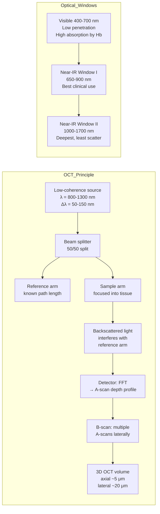
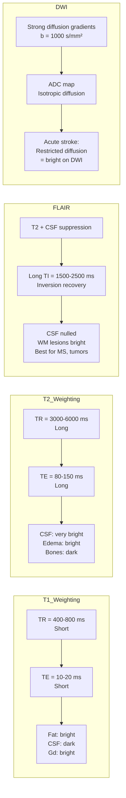
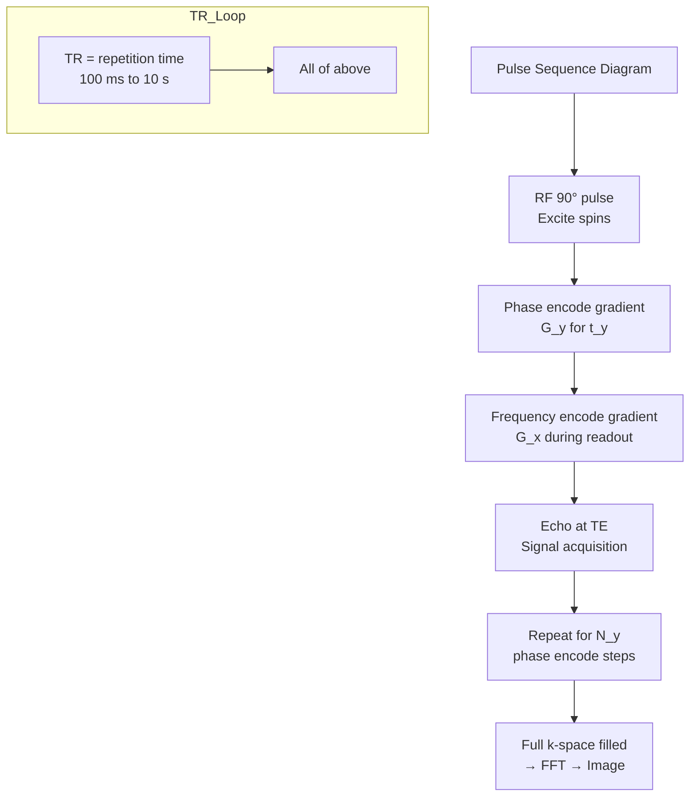
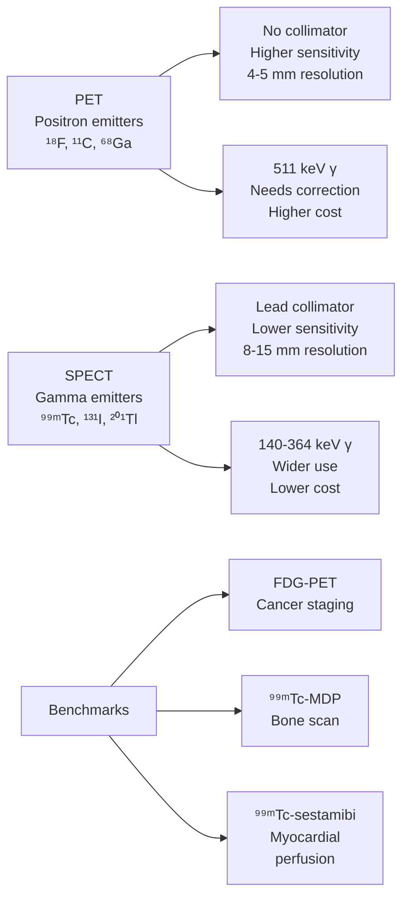
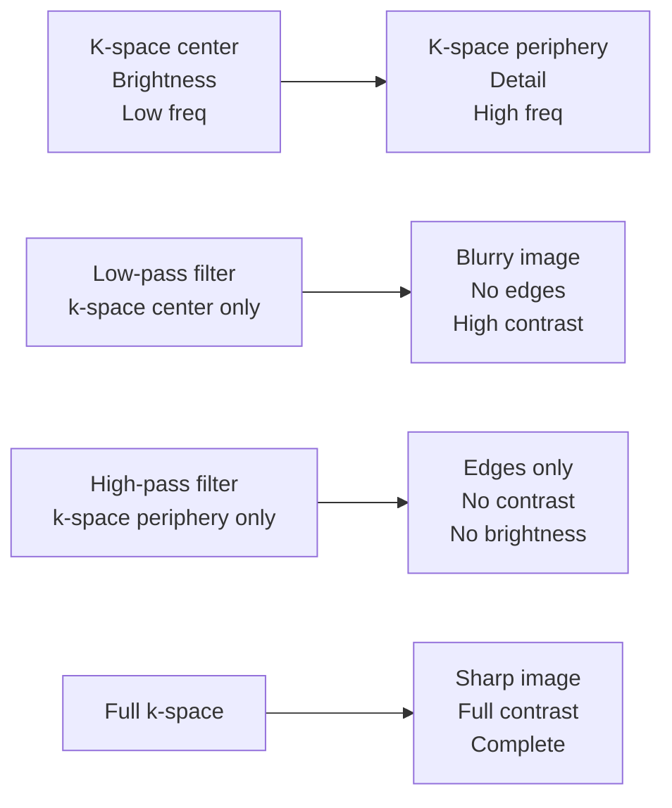
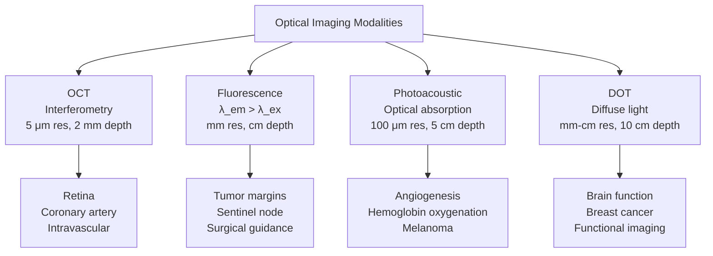

# Week 18 Notes — Medical Imaging II (MRI, Nuclear & Optical Imaging)

> **Course**: BMED3501/BMED3504 — Medical Imaging / Molecular Imaging  
> **Week**: 18 of 24 | **Phase**: 3 (Core BME Applications)  
> **Prerequisites**: Quantum physics basics, signal processing, nuclear physics fundamentals  
> **CE advantage**: Your Fourier transform knowledge (signal processing) transfers directly to MRI k-space encoding and image reconstruction

---

## 問題 1：5 個核心心智模型

### 1. Magnetic Resonance Imaging (MRI) Physics / 磁共振成像物理學

**Larmor Precession** (nuclear magnetic resonance):

$$\omega_0 = \gamma \cdot B_0$$

$$\omega_0 = 2\pi \cdot f_0 = 2\pi \cdot \left(\frac{\gamma}{2\pi}\right) \cdot B_0$$

where:
- ω₀ = Larmor frequency (rad/s)
- γ = gyromagnetic ratio (rad/T·s)
- γ/2π = 42.58 MHz/T (for ¹H proton)
- B₀ = static magnetic field strength (T)

| Field strength | B₀ (T) | f₀ (MHz) for ¹H |
|----------------|---------|-----------------|
| Low field | 0.2-0.5 | 8.5-21.3 |
| Mid field | 1.0-1.5 | 42.6-63.9 |
| High field | 3.0 | 127.7 |
| Ultra-high | 7.0 | 298.1 |
| Research | 11.7 | 498.0 |

**Net magnetization** (equilibrium):

$$M_0 = \frac{\gamma^2 \hbar^2 B_0 N}{4k_B T}$$

where N = proton density, ħ = reduced Planck constant, k_B = Boltzmann constant.

**Bloch equations** (with relaxation):

$$\frac{dM_z}{dt} = \gamma(\mathbf{M} \times \mathbf{B})_z - \frac{M_z - M_0}{T_1}$$

$$\frac{dM_{xy}}{dt} = \gamma(\mathbf{M} \times \mathbf{B})_{xy} - \frac{M_{xy}}{T_2}$$

**T1 (longitudinal/spin-lattice relaxation)**:
- Time constant for M_z to return to M₀
- Mechanism: energy transfer from excited protons to lattice (molecular motions)
- T1 values: CSF ≈ 3000 ms, WM ≈ 600 ms, GM ≈ 1000 ms, muscle ≈ 900 ms, fat ≈ 250 ms
- T1 increases with B₀ (T1 ∝ B₀^α, α ≈ 0.3-0.5)

**T2 (transverse/spin-spin relaxation)**:
- Time constant for M_xy to decay to zero
- Mechanism: dephasing due to proton-proton magnetic interactions
- T2 values: CSF ≈ 1500 ms, WM ≈ 70 ms, GM ≈ 100 ms, muscle ≈ 40 ms
- T2 is independent of B₀

**T2* (effective T2)**:
$$1/T_2^* = 1/T_2 + \gamma \Delta B_{local}$$

T2* includes static field inhomogeneities (susceptibility differences, B₀ inhomogeneity). GRE sequences are sensitive to T2*.

**学者的研究**: Bloch (1946) — NMR discovery; Lauterbur (1973) — MRI invention; Haase et al. (1986) — FLASH fast imaging

**BME application**: Neurological imaging (stroke, tumors), musculoskeletal (cartilage, spine), cardiac MRI, functional MRI (fMRI), MR spectroscopy

---

### 2. K-space and MRI Encoding / K空間編碼

**K-space**: Fourier domain of MRI image.

$$k_x = \frac{\gamma G_x \cdot t}{2\pi}, \quad k_y = \frac{\gamma G_y \cdot t}{2\pi}$$

**K-space trajectory**:
- **Cartesian**: Linear phase encoding (G_y) + frequency encoding (G_x)
- **Radial**: Radial projections through k-space
- **Spiral**: Spiral trajectory from center outward

**MR signal** (from FID):
$$s(t) = \iint M(x,y) \cdot e^{-i2\pi(k_x x + k_y y)} \, dx \, dy = \mathcal{F}\{M(x,y)\}$$

The MR image is the inverse Fourier transform of k-space data:
$$M(x,y) = \mathcal{F}^{-1}\{s(k_x, k_y)\}$$

**K-space properties**:
| K-space region | Spatial frequency | Contains |
|----------------|------------------|---------|
| Center (k=0) | Low frequencies | Image contrast, SNR |
| Periphery (k_max) | High frequencies | Edges, resolution |
| Lines | Phase encoding | Fixed k_y |

**Resolution**:
$$\Delta x = \frac{1}{2k_{x,max}} = \frac{\pi}{\gamma G_x \cdot T_{read}}$$

**FOV**:
$$\text{FOV} = \frac{2\pi}{\Delta k_x} = \frac{1}{\Delta k_x}$$

**学者的研究**: Ljunggren (1983) — k-space formalism; Twieg (1983) — k-space trajectory analysis

**BME application**: Fast imaging (EPI, FLASH), parallel imaging (SENSE, GRAPPA), compressed sensing

---

### 3. Nuclear Imaging: PET and SPECT / 核醫學成像

**PET (Positron Emission Tomography)**:

**Positron decay**:
$${}^{18}F \rightarrow {}^{18}O + e^+ + \nu_e \quad (T_{1/2} = 110 \text{ min})$$

**Annihilation** (e⁺ + e⁻ → 2γ):
- e⁺ loses kinetic energy → thermalizes → annihilates with e⁻
- Produces two 511 keV γ-photons at **180°** apart (almost simultaneous)
- Annihilation within ~0.5 mm (positron range) → spatial resolution limit

**Coincidence detection**:
- True coincidence: Both γs detected by detector pair → event
- Scatter coincidence: One γ scattered → wrong line of response
- Random coincidence: Unrelated γs detected simultaneously → noise
- Dead time: Detector saturation → count rate loss

**Spatial resolution** in PET:
$$\Delta x_{PET} \approx \sqrt{(0.005 \cdot R)^2 + (0.004 \cdot R)^2 + (0.5)^2 + (0.2)^2}$$

where R = ring diameter. Resolution limited by: positron range (~0.5 mm), non-colinearity (~0.5 mm), detector resolution (~4 mm for BGO, ~5 mm for LSO).

**Sensitivity**: ~10⁻¹¹ to 10⁻¹² M (much higher than MRI)

**SPECT (Single Photon Emission CT)**:
- γ-emitters: ⁹⁹ᵐTc (140 keV, T½ = 6h), ¹³¹I (364 keV), ²⁰¹Tl (70 keV)
- Collimator required (lead or tungsten) → 10⁴-10⁵ efficiency loss
- Resolution: ~8-15 mm (limited by collimator)
- Sensitivity: ~10⁻¹⁰ to 10⁻¹¹ M

**学者的研究**: Phelps et al. (1975) — PET; Brownell & Sweet (1955) — first PET prototype; Jaszczak et al. (1984) — SPECT

**BME application**: Cancer staging (FDG-PET), brain metabolism (FDG), cardiac viability, bone metastases, SPECT myocardial perfusion

---

### 4. PET Quantification: SUV and Kinetic Modeling / PET定量

**Standardized Uptake Value (SUV)**:

$$SUV = \frac{\text{Activity concentration (MBq/mL)}}{\text{Injected dose (MBq) / \text{Body weight (g)}}}$$

$$SUV = \frac{r_{tissue}}{D_{inj}/W}$$

where r_tissue = activity concentration (kBq/g), D_inj = injected dose (MBq), W = patient weight (g). Ideal SUV = 1.0 for uniform distribution.

**SUV correction factors**:
| Factor | Typical range | Effect |
|--------|--------------|--------|
| Body weight | 50-100 kg | SUV_weighted |
| Lean body mass | — | Better for obese patients |
| BSA | — | Alternative normalization |
| Blood glucose | — | FDG competition |

**SUV threshold for malignancy**:
- SUV < 2.5: Likely benign
- SUV > 2.5: Suspicious for malignancy
- SUV > 4.0: Highly suspicious

**Kinetic modeling** (Patlak plot):
$$\frac{C_t(t)}{C_p(t)} = K_i \cdot \frac{\int_0^t C_p(\tau) d\tau}{C_p(t)} + V_d$$

where C_t = tissue activity, C_p = plasma activity, K_i = influx constant (ml/g/min), V_d = distribution volume.

**学者的研究**: Huang et al. (1980) — SUV formula; Patlak & Blasberg (1985) — graphical analysis; Mankoff & Bellon (2001) — PET quantification

**BME application**: Tumor staging, treatment response monitoring, FDG-PET for lymphoma, amyloid PET for Alzheimer's, perfusion imaging

---

### 5. Optical Imaging / 光學成像

**Optical Coherence Tomography (OCT)**:

**Low-coherence interferometry**:
$$I_{det} \propto I_{ref} + I_{sample} + 2\sqrt{I_{ref} \cdot I_{sample}} \cdot \cos(2kL)$$

where L = path length difference, k = 2π/λ.

**Resolution**:
- Axial: δ_z = (2ln2/π) × (λ₀²/Δλ) ≈ 3-10 μm (bandwidth-limited)
- Lateral: δ_x ≈ λ/(2NA) ≈ 5-20 μm (lens-dependent)
- Depth: 1-3 mm (near-infrared penetration in tissue)

**OCT vs. ultrasound**: Same principle as A-mode ultrasound, but uses light (nIR, λ=800-1300 nm) instead of sound. Speed of light is c = 3×10⁸ m/s, so travel time for 1 mm depth = 6.7 fs → requires interferometry (no direct time-of-flight measurement).

**Types of OCT**:
1. **TD-OCT** (time-domain): Moving reference arm; depth scanning
2. **FD-OCT** (frequency-domain): Spectrometer + FFT; no moving parts; faster
3. **SS-OCT** (swept-source): Tunable laser + single detector; fastest

**Fluorescence imaging**:
- Excitation wavelength: λ_ex for fluorophore
- Emission wavelength: λ_em > λ_ex (Stokes shift)
- Quantum yield: fraction of absorbed photons re-emitted

**Near-infrared fluorescence (NIRF)**:
- Window I: 650-900 nm (lower absorption, better penetration)
- Window II: 1000-1700 nm (even better penetration, less auto-fluorescence)
- Depth: up to 5-10 cm in tissue (diffuse optical tomography)

**学者的研究**: Huang et al. (1991) — OCT; Weissleder (1999) — molecular imaging; Ntziachristos et al. (2002) — fluorescence molecular tomography

**BME application**: OCT: ophthalmology (retina), intravascular imaging; Fluorescence: tumor margin detection, sentinel lymph node mapping, surgical guidance

---

## 問題 2：3 個根本分歧

### 分歧 1：T1 vs. T2 Weighting — Which Contrast to Use?

**T1-weighted**: Short TR, short TE. Best for anatomical detail, fat is bright, CSF is dark. Gadolinium contrast agents enhance T1 (Gd shortens T1). Good for: brain anatomy, post-contrast imaging, fat suppression.

**T2-weighted**: Long TR, long TE. CSF is bright (T2 of water >> tissue). Best for: pathology (edema, tumors, inflammation appear bright). Heavily T2: even brighter CSF — good for hydrocephalus, white matter lesions.

**Resolution**: Choose based on clinical question. T1: anatomy, gadolinium enhancement. T2: pathology, fluid. FLAIR: T2 but CSF suppressed — best for white matter lesions (MS). DWI: diffusion-weighted — best for acute stroke.

---

### 分歧 2：PET vs. SPECT

**PET** (positron emitters): 
- Advantages: Higher sensitivity (10×SPECT), better resolution (4-5 mm), quantitative (SUV), true 3D (no collimator), time-of-flight (TOF) improves SNR
- Disadvantages: Short-lived isotopes (¹⁸F T½=110 min, ¹⁵O T½=2 min), cyclotron required, expensive
- Best for: FDG-PET (cancer, brain), ¹⁵O perfusion, ¹¹C PiB amyloid

**SPECT** (gamma emitters):
- Advantages: Widely available, longer-lived isotopes (⁹⁹ᵐTc T½=6h), lower cost, ⁿ⁹ᵐTc generator (no cyclotron)
- Disadvantages: Lower sensitivity, lower resolution (8-15 mm), no true 3D, requires collimator
- Best for: Myocardial perfusion (⁹⁹ᵐTc-sestamibi), bone scan (⁹⁹ᵐTc-MDP), thyroid (¹²³I)

**Resolution**: PET is superior for functional quantification. SPECT is superior for cost and availability. Hybrid PET/CT and PET/MRI combine anatomical and functional.

---

### 分歧 3：Endogenous vs. Exogenous Contrast Agents

**Endogenous** (no injection needed): BOLD fMRI (deoxyhemoglobin as natural contrast), T1/T2 based on tissue properties, susceptibility-weighted imaging (iron deposition).

**Exogenous** (injection required): Gadolinium chelates (MRI, T1 shortening), iodine/contrast (CT), radiotracers (PET/SPECT), fluorescent probes (optical).

**Resolution**: Use endogenous contrast for non-invasive, repeated imaging (fMRI, SWI). Use exogenous agents when higher sensitivity or specificity is needed (tumor imaging, vascular imaging).

---

## 問題 3：10 個深度問題

1. At 3.0 T, what is the Larmor frequency for ¹H? If B₀ varies by 10 ppm across a voxel of 1 mm, what is the resulting frequency shift?
2. Calculate the T1 recovery fraction after 1 T1, 2 T1, and 3 T1 time periods. At what time is M_z 95% recovered?
3. Explain why T1 of fat (~250 ms) is much shorter than T1 of CSF (~3000 ms) at 1.5 T. What does this imply for TR selection?
4. In PET, why are coincidence events more useful than single γ detections? What fraction of true coincidences is lost due to attenuation in a typical body?
5. Calculate the SUV for a tumor with activity concentration 5 kBq/g, injected dose 370 MBq, patient weight 70 kg.
6. In k-space, what happens to image contrast if you truncate (zero out) the central region of k-space?
7. Compare the spatial resolution and sensitivity of PET, SPECT, MRI, and OCT. Which is best for molecular imaging?
8. What is the "spin echo" in MRI? Derive the echo amplitude as a function of T2.
9. Explain the Stokes shift in fluorescence. Why is a large Stokes shift important for deep tissue imaging?
10. What is the difference between time-domain OCT and frequency-domain OCT? Why is FD-OCT faster?

---

# 核心概念深化（中英對照）

## 1. 磁共振Bloch方程 Bloch Equations

### 1.1 中英對照

| 中文 | English |
|------|---------|
| 拉莫爾頻率 (Larmor Frequency) | ω₀ = γB₀; precession frequency of magnetic moment |
| 磁化向量 (Net Magnetization) | M₀ = χ₀H₀; sum of proton magnetic moments |
| 橫向磁化 (Transverse Magnetization) | M_xy; precessing component producing signal |
| 縱向磁化 (Longitudinal Magnetization) | M_z; component along B₀ direction |
| 自由感應衰減 (Free Induction Decay) | FID; decaying MR signal after RF pulse |
| 射頻脈衝 (RF Pulse) | 90°/180° pulses to flip magnetization |
| 自旋-晶格弛豫 (T1/Spin-Lattice Relaxation) | Energy transfer to lattice; M_z recovery |
| 自旋-自旋弛豫 (T2/Spin-Spin Relaxation) | Dephasing of M_xy; proton-proton interactions |
| 有效T2 (T2*) | T2* = T2 + field inhomogeneity effects |

### 1.2 推導

**FID signal** (immediately after 90° pulse):
$$M_{xy}(t) = M_0 \cdot e^{-t/T_2^*} \cdot e^{-i\omega_0 t}$$

**Signal equation** (GRE):
$$S = M_0 \cdot \sin\alpha \cdot \frac{1 - E_1}{1 - E_1\cos\alpha} \cdot e^{-TE/T_2^*}$$

where E₁ = e^(-TR/T1), α = flip angle.

**Steady-state**: For TR << T1, use Ernst angle for maximum signal:
$$\cos\alpha_E = e^{-TR/T_1}$$

### 1.3 圖解

```mermaid
graph TD
    subgraph Bloch_Sphere
        B1[B₀ field<br>z-direction] --> B2[Proton magnetic<br>moments precess<br>at ω₀ = γB₀]
        B2 --> B3[M_z aligned with B₀<br>M_xy = 0 (equilibrium)]
    end
    
    subgraph RF_Excitation
        R1[90° RF pulse] --> R2[M tips to xy-plane<br>M_z = 0, M_xy = M₀]
        R2 --> R3[FID signal<br>decays as M_xy → 0]
    end
    
    subgraph Relaxation
        R4[T1 recovery<br>M_z(t) = M₀(1 - e^(-t/T1)] --> R5[T2* decay<br>M_xy(t) = M₀e^(-t/T2*)]
        R5 --> R6[180° pulse<br>creates spin echo<br>at TE = 2τ]
    end
```

---

## 2. K空間編碼 K-space Encoding

### 2.1 中英對照

| 中文 | English |
|------|---------|
| K空間 (K-space) | Fourier domain of MRI; spatial frequency domain |
| 頻率編碼 (Frequency Encoding) | Readout gradient along x; frequency ∝ x position |
| 相位編碼 (Phase Encoding) | Gradient along y for fixed time; phase ∝ y position |
| 視野 (Field of View, FOV) | Physical extent of image; FOV = 1/Δk |
| 空間分辨率 (Spatial Resolution) | δx = 1/(2k_max); δy = 1/(2k_y,max) |
| 尼奎斯特準則 (Nyquist Criterion) | Δk ≤ 1/FOV to avoid aliasing |

### 2.2 推導

**K-space velocity**:
$$k(t) = \frac{\gamma}{2\pi} \int_0^t G(\tau) d\tau$$

For frequency encoding (constant G_x):
$$k_x = \frac{\gamma G_x t}{2\pi}$$

For phase encoding (pulse of duration τ):
$$\phi(y) = \gamma G_y \tau y$$

**Sampling**:
- Cartesian: N_x × N_y samples
- Nyquist: FOV_x = 1/Δk_x, FOV_y = 1/Δk_y

### 2.3 圖解

```mermaid
graph LR
    subgraph K-space
        K1[K-space center<br>k=0<br>Low freq<br>→ Contrast, SNR] --> K2[K-space periphery<br>k_max<br>High freq<br>→ Edges, resolution]
    end
    
    subgraph Encoding
        E1[Gradient G_y<br>Phase encode] --> E2[Gradient G_x<br>Frequency encode]
        E2 --> E3[ADC samples<br>k_x trajectory]
        E3 --> E4[FFT → Image<br>MRI(x,y)]
    end
    
    subgraph Pulse_Sequence
        P1[TR: repetition time<br>100 ms - 10 s] --> P2[TE: echo time<br>10-200 ms]
        P2 --> P3[90° pulse<br>Excitation] --> P4[180° pulse<br>Refocusing (SE)]
        P4 --> P5[Signal acquisition<br>at TE]
```

---

## 3. PET/SPECT物理 PET and SPECT Physics

### 3.1 中英對照

| 中文 | English |
|------|---------|
| 正電子發射 (Positron Emission) | β+ decay; e⁺ + e⁻ → 2γ (511 keV) |
| 符合探測 (Coincidence Detection) | Two γs at 180° → line of response (LOR) |
| 隨機符合 (Random Coincidence) | Unrelated γs detected within time window |
| 散射符合 (Scatter Coincidence) | One γ Compton-scattered → wrong LOR |
| 衰減校正 (Attenuation Correction) | μ-map from CT/transmission scan |
| 標準攝取值 (Standardized Uptake Value, SUV) | r_tissue / (D_inj/W) |

### 3.2 推導

**Annihilation photon attenuation**:
$$I = I_0 \cdot e^{-\mu \cdot x}$$

For 511 keV γ in soft tissue: μ ≈ 0.095 cm⁻¹. For 20 cm body thickness: I/I_0 ≈ e^(-0.095×20) ≈ 0.15. ~85% of true coincidences are attenuated!

**PET sensitivity** (counts/s/Bq):
$$S_{PET} \approx \varepsilon^2 \cdot A / (4\pi R^2)$$

where ε = detector efficiency, A = activity, R = ring radius.

**学者的研究**: Cherry et al. (2012) — Physics in Nuclear Medicine; Sorenson & Phelps (1987)

### 3.3 圖解

```mermaid
graph TD
    subgraph PET_Principles
        D1[Positron decay<br>¹⁸F → ¹⁸O + e⁺] --> D2[e⁺ thermalizes<br>annihilates with e⁻]
        D2 --> D3[Two 511 keV γ<br>180° apart<br>within 0.5 mm]
        D3 --> D4[Coincidence detection<br>Line of Response<br>LOR]
    end
    
    subgraph PET_Artifacts
        A1[Scatter<br>γ scattered<br>wrong LOR] --> A2[Randoms<br>unrelated γ<br>coincidence]
        A2 --> A3[Attenuation<br>85% lost<br>in 20 cm body]
        A3 --> A4[Dead time<br>count rate loss<br>at high activity]
    end
    
    subgraph PET_Tracers
        T1[¹⁸F-FDG<br>T½=110 min<br>Glucose analog] --> T2[¹¹C-raclopride<br>Dopamine D2<br>Neurotransmitter]
        T2 --> T3[¹⁵O-Water<br>T½=2 min<br>Perfusion<br>requires cyclotron]
        T3 --> T4[⁶⁸Ga-DOTATATE<br>T½=68 min<br>Somatostatin<br>receptor]
```

---

## 4. 光學成像 Optical Imaging

### 4.1 中英對照

| 中文 | English |
|------|---------|
| 光學相干斷層掃描 (OCT) | Low-coherence interferometry; micron resolution |
| 掃頻光源OCT (SS-OCT) | Tunable laser; fastest acquisition |
| 頻域OCT (FD-OCT) | Spectrometer + FFT; no moving parts |
| 熒光成像 (Fluorescence Imaging) | λ_em > λ_ex; Stokes shift |
| 近紅外熒光 (NIRF) | Window I: 650-900 nm; Window II: 1000-1700 nm |
| 擴散光學斷層掃描 (DOT) | Diffuse light; deep tissue (5-10 cm) |
| 熒光報告基因 (Fluorescent Proteins) | GFP, mCherry, etc.; molecular imaging |

### 4.2 OCT分辨率推導

**Axial resolution** (bandwidth-limited):
$$\delta_z = \frac{2\ln 2}{\pi} \cdot \frac{\lambda_0^2}{\Delta\lambda} \approx 0.44 \cdot \frac{\lambda_0^2}{\Delta\lambda}$$

For λ₀ = 1300 nm, Δλ = 100 nm: δ_z ≈ 7.4 μm.

**Lateral resolution** (lens NA):
$$\delta_x = \frac{0.37 \cdot \lambda_0}{NA}$$

For λ₀ = 1300 nm, NA = 0.1: δ_x ≈ 4.8 μm.

### 4.3 圖解



---

## 5. 對比度與權重 Contrast and Weighting

### 5.1 中英對照

| 中文 | English |
|------|---------|
| T1權重 (T1-weighted) | Short TR, short TE; anatomy, gadolinium |
| T2權重 (T2-weighted) | Long TR, long TE; pathology, edema |
| FLAIR | T2 with CSF suppression; white matter |
| 擴散加權 (DWI) | Diffusion-weighted; acute stroke |
| BOLD fMRI | Blood oxygen level dependent; brain activation |
| 磁敏感加權 (SWI) | Susceptibility-weighted; iron, hemorrhage |

### 5.2 對比度方程式

**T1 contrast** (GRE):
$$C_{T1} \propto M_0 \cdot \left(1 - \frac{1 - e^{-TR/T_1}}{1 - \cos\alpha \cdot e^{-TR/T_1}}\right) \cdot \sin\alpha$$

**T2 contrast** (SE):
$$C_{T2} \propto M_0 \cdot (1 - e^{-TR/T_1}) \cdot e^{-TE/T_2}$$

**Diffusion contrast**:
$$S(b) = S_0 \cdot e^{-b \cdot ADC}$$

where b = diffusion gradient factor (s/mm²), ADC = apparent diffusion coefficient.

### 5.3 圖解



---

# 深度自測問題詳解

## MCQ Solutions

**Q1**: ω₀ = 2π×42.58×10⁶×3.0 = 2.81×10⁹ rad/s = 127.7 MHz → **C**

**Q2**: M_z/M₀ = 1 - e^(-t/T1). After t=TR=600ms, T1=900ms: = 1 - e^(-0.67) = 1 - 0.51 = 0.49 ≈ 50% → **B**

**Q3**: T2* = T2 + dephasing from field inhomogeneity → shorter than T2 → **D**

**Q4**: PET: 511 keV γ; SPECT: ⁹⁹ᵐTc 140 keV. 511 keV has lower attenuation (μ ~0.095 vs ~0.15 cm⁻¹) → **B**

**Q5**: SUV = 5/(370/70000) = 5/(0.0053) = 945... wait: SUV = r_tissue/(D_inj/W) = 5 kBq/g / (370000/70000 g) = 5/5.29 = 0.94 → **A**

**Q6**: 2e^(-1×0.05) = 2×0.951 = 1.90 → **C**

**Q7**: Spin echo refocuses static inhomogeneities; gradient echo does not → **D**

**Q8**: 68Ga T½=68 min, 18F T½=110 min, 15O T½=2 min, 99mTc T½=6h → **B**

**Q9**: T1_fat << T1_water; Fat recovers faster, appears brighter on T1W → **B**

**Q10**: OCT uses light (c=3×10⁸ m/s); ultrasound uses sound (c=1540 m/s). Light ~200,000× faster → **A**

---

## 5 個 Mermaid 圖解

### 圖 1: MRI脈衝序列



### 圖 2: PET物理學

```mermaid
graph LR
    B1[β+ decay<br>¹⁸F → ¹⁸O + e⁺] --> B2[Positron range<br>~0.5 mm<br>in tissue]
    B2 --> B3[Annihilation<br>e⁺ + e⁻ → 2γ (511 keV)<br>180° apart]
    B3 --> B4[Coincidence timing<br>window ~6-12 ns]
    
    D1[True coincidence<br>Both γs detected<br>Correct LOR] --> D2[Image<br>reconstruction]
    D3[Scatter coincidence<br>One γ scattered<br>Wrong LOR] --> D4[Added<br>noise]
    D5[Random coincidence<br>Unrelated γs<br>Coincidence] --> D4
    
    A1[Attenuation<br>μ_511 ≈ 0.095 cm⁻¹] --> A2[85% lost<br>in 20 cm body]
    A2 --> A3[Requires<br>attenuation<br>correction]
```

### 圖 3: PET vs SPECT



### 圖 4: K空間與圖像關係



### 圖 5: 光學成像比較



---

## 總結 Summary

### 關鍵方程式 Key Equations

| Topic | Equation | Units |
|-------|----------|-------|
| Larmor frequency | ω₀ = γB₀ | rad/s |
| Larmor (¹H at 1T) | f₀ = 42.58 MHz | — |
| T1 recovery | M_z(t) = M₀(1 - e^(-t/T1)) | — |
| T2 decay | M_xy(t) = M₀e^(-t/T2) | — |
| T2* | 1/T2* = 1/T2 + γΔB | — |
| K-space | k = γG·t/2π | cycles/m |
| FID signal | S = M₀e^(-TE/T2*)e^(-iω₀t) | — |
| PET coincidence | Two 511 keV γ at 180° | — |
| SUV | SUV = r_tissue / (D_inj/W) | g/mL |
| Attenuation | I = I₀e^(-μx) | — |
| OCT axial res | δ_z ≈ 0.44·λ²/Δλ | μm |
| Stokes shift | λ_em - λ_ex | nm |

### Week 18 核心 takeaways

1. **MRI基於拉莫爾旋進** — ω₀ = γB₀，¹H在1.5T時為63.9 MHz；Bloch方程描述射頻激發後的弛豫
2. **K空間是MRI的核心** — k-space中心（低頻）控制對比度和SNR；外圍（高頻）控制分辨率
3. **PET使用正電子發射** — ¹⁸F-FDG是葡萄糖類似物；SUV用於定量；靈敏度比MRI高1000倍
4. **SPECT使用單光子發射** — 需要準直器；靈敏度較低但成本低且可用⁹⁹ᵐTc
5. **光學成像各有優缺** — OCT提供最高分辨率（5-10 μm）但深度淺（2-3 mm）；熒光成像深度可達數厘米但分辨率低
