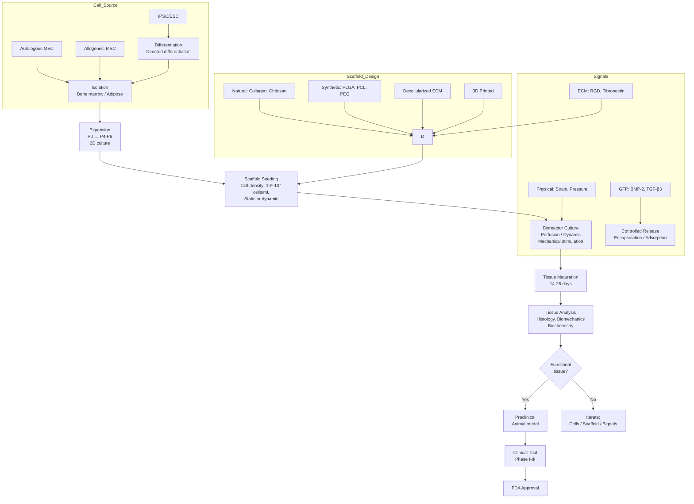
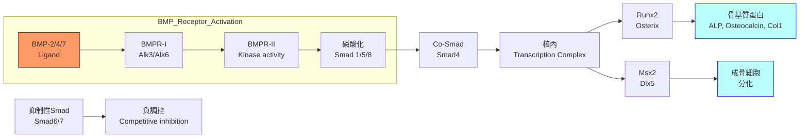
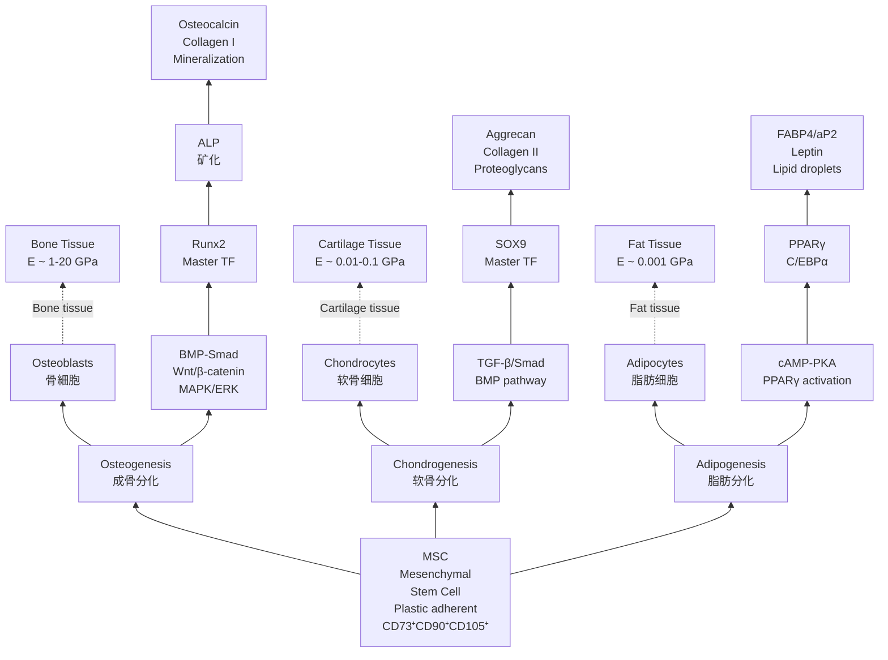
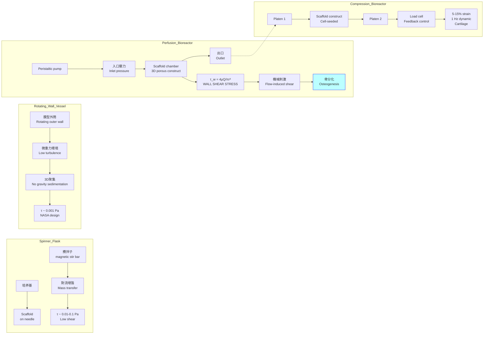

# Week 19 Notes — Tissue Engineering (BMED4604)

> **Course**: BMED4604 — Tissue Engineering  
> **Week**: 19 of 24 | **Phase**: 4 (Advanced Research)  
> **Prerequisites**: Cell biology, biomaterials, transport phenomena, developmental biology  
> **CE advantage**: Your transport/structural knowledge directly transfers to scaffold design and bioreactor engineering

---

## 問題 1：5 個核心心智模型

### 1. The Tissue Engineering Triad / 組織工程三元組

**The Three Pillars**:
- **Cells**: The living component — stem cells, progenitor cells, differentiated cells
- **Scaffolds (Matrices)**: The structural template — ECM mimetics, decellularized organs
- **Signaling Molecules**: The informational component — growth factors, cytokines, mechanical cues

**The "Golden Triangle" equation**:
$$\text{Tissue} = f(\text{Cells} \times \text{Scaffold} \times \text{Signals})^n$$

**Langer & Vacanti (1993) Science** identified this as the foundational framework. The key insight: all three must be optimized simultaneously — improvement in one is wasted without complementary advances in the others.

**學者**: Robert Langer (MIT) — pioneering work on polymer drug delivery and tissue engineering scaffolds; Joseph Vacanti (Harvard/MGH) — organ printing and liver tissue engineering.

**Key numbers**:
| Component | Scale | Key Parameter |
|-----------|-------|----------------|
| Cell | 10-100 μm | Viability > 80% post-seeding |
| Scaffold pore | 100-500 μm | Porosity > 70% for tissue ingrowth |
| Growth factor | kDa | Loading efficiency 60-80% |
| Vascular capillary | 5-10 μm diameter | O₂ diffusion limit ~200 μm |

---

### 2. Scaffold Design Principles / 支架設計原理

**The Scaffold as Artificial ECM**: The scaffold must recapitulate key functions of native ECM:
1. Structural support (mechanical load-bearing)
2. Cell adhesion sites (RGD sequences, integrins α5β1, αvβ3)
3. Degradability (enzymatic or hydrolytic)
4. Permeability (nutrient/waste transport)

**Key Scaffold Parameters**:

**Porosity**: ε = 1 - (ρ_scaffold / ρ_material)
- Optimal range: > 70% for tissue ingrowth
- < 30%: cells cannot penetrate; surface-only growth
- 30-70%: partial infiltration, fibrous tissue at surface
- > 90%: mechanically weak, poor handling

**Pore Size Requirements** (tissue-specific):
| Tissue | Minimum Pore Size | Optimal Range |
|--------|-------------------|---------------|
| Bone | 100 μm | 200-500 μm |
| Cartilage | 20 μm | 20-100 μm (chondrogenesis prefers smaller) |
| Skin/Dermis | 20 μm | 20-125 μm |
| Nerve | 10 μm | 10-50 μm |
| Blood vessels | 50 μm | 50-500 μm |

**Mechanical Properties** (matching native tissue):
$$E_{scaffold} \approx E_{native} \times (1 - \varepsilon)$$
where ε is porosity. This is critical — scaffolds must be strong enough for handling AND match target tissue stiffness.

**Scaffold Degradation**: Scaffold must degrade as new tissue forms, ideally matched to tissue regeneration rate.
$$\text{Degradation rate} \approx \frac{\text{Initial strength}}{\text{Tissue maturation time}}$$

For bone: 6-12 months for complete scaffold degradation (matching lamellar bone formation cycle).

**Material Classes**:
- **Natural polymers**: Collagen, gelatin, fibrin, chitosan, alginate (bioactive, but batch variability)
- **Synthetic polymers**: PLGA, PLA, PCL, PEG (consistent, tunable, no bioactivity)
- **Ceramics**: HA, TCP, biphasic calcium phosphate (osteoconductive)
- **Decellularized ECM**: Allogeneic or xenogeneic organ ECM (complex, native architecture)

**學者**: Peter Ma (Michigan) — 3D scaffold fabrication; Jeffrey Hubbell (ETH Zurich/Tokyo) — synthetic ECM mimetics.

---

### 3. Stem Cell Trilineage Differentiation / 幹細胞三系分化

**Mesenchymal Stem Cells (MSCs)**: The workhorse of tissue engineering. Source: bone marrow, adipose tissue, umbilical cord.

**Trilineage Potential**:

**Osteogenesis** (bone formation):
- **Inducers**: Dexamethasone (10 nM), β-glycerophosphate (10 mM), ascorbic acid (50 μg/mL)
- **Key markers**: ALP (alkaline phosphatase), Runx2, Osterix, Osteocalcin, Collagen I
- **Signaling pathways**: BMP-Smad, Wnt/β-catenin, MAPK
- **Culture duration**: 14-21 days for mineralization
- **Readout**: Alizarin Red S staining (calcium), von Kossa staining (phosphate)

**Chondrogenesis** (cartilage formation):
- **Inducers**: TGF-β1/β3 (10 ng/mL), BMP-6 (50 ng/mL), dexamethasone
- **Key markers**: SOX9, Aggrecan, Collagen II, COMP
- **Signaling pathways**: TGF-β/Smad, BMP, FGF
- **Culture format**: High-density pellet or micromass (critical for cell-cell contact)
- **Readout**: Alcian Blue staining (proteoglycans), Collagen II immunohistochemistry

**Adipogenesis** (fat formation):
- **Inducers**: IBMX (0.5 mM), dexamethasone (1 μM), insulin (10 μg/mL), indomethacin (50 μM)
- **Key markers**: PPARγ, C/EBPα, FABP4/aP2, Leptin
- **Signaling pathways**: cAMP-PKA, PPARγ activation
- **Readout**: Oil Red O staining (lipid droplets)

**MSC Key Numbers**:
| Parameter | Value |
|-----------|-------|
| MSC diameter | 15-30 μm |
| MSC doubling time | 24-48 hours |
| Passage number limit | P4-P6 (genomic stability) |
| Confluence density | ~10⁶ cells/cm² |
| Cryopreservation | 10% DMSO, -196°C LN2 |

**學者**: Arnold Caplan (Case Western) — MSC biology; Darwin Prockop (Tulane) — MSC isolation.

---

### 4. Growth Factor Signaling & Release Kinetics / 生長因子信號與釋放動力學

**Major Growth Factors in Tissue Engineering**:

| Factor | Target Tissue | Typical Dose | Key Mechanism |
|--------|--------------|-------------|---------------|
| BMP-2 | Bone | 1-50 μg/mL | Smad 1/5/8 activation |
| BMP-7 | Bone/cartilage | 1-10 μg/mL | Osteochondral interface |
| TGF-β1/β3 | Cartilage | 5-10 ng/mL | SMAD2/3 signaling |
| VEGF | Vascular | 50-500 ng/mL | Angiogenesis |
| PDGF | Connective tissue | 10-50 ng/mL | Cell proliferation |
| FGF-2 | Broad (MSC) | 5-20 ng/mL | MAPK/ERK pathway |
| EGF | Epithelial | 10-100 ng/mL | Receptor tyrosine kinase |

**Release Kinetics Models**:

**Zero-order release** (ideal, constant rate):
$$M_t = M_0 + k_0 t$$
where k₀ is constant. Achieved by: reservoir systems, osmotically-driven pumps.

**First-order release** (exponential decay):
$$M_t = M_0 e^{-k_1 t}$$
where k₁ is first-order rate constant. Typical of matrix diffusion-controlled release.

**Higuchi model** (square-root-of-time, matrix diffusion):
$$M_t = k_H \sqrt{t}$$
where k_H = √(D·C₀·A/2). Valid when A >> C₀ (sink conditions). Observed in: monolithic polymer matrices.

**Korsmeyer-Peppas** (anomalous or non-Fickian):
$$M_t / M_\infty = k_K t^n$$
where n = release exponent:
- n = 0.5: Fickian (diffusion-controlled)
- n = 1.0: Case II (relaxation-controlled)
- 0.5 < n < 1.0: Anomalous (both mechanisms)

**Mathematical expression for release from PLGA**:
$$\frac{dM}{dt} = -k_d M - k_r M$$
where k_d = hydrolytic degradation rate, k_r = diffusion rate constant.

**学者の insight**: Hubbell (2005) showed that temporal presentation matters more than total dose. Sequential BMP-2 then TGF-β3 delivery outperforms simultaneous delivery for osteochondral tissue.

---

### 5. Bioreactor Mechanics & Mechanical Stimulation / 生物反應器力學與機械刺激

**Why Bioreactors?** Tissue thickness > 200-400 μm requires active perfusion because:
$$C(x) = C_0 \exp\left(-\frac{x}{\delta}\right), \quad \delta = \sqrt{\frac{D \cdot h}{u}}$$
where δ = penetration depth, D = diffusion coefficient (~10⁻⁹ m²/s for O₂ in tissue), u = flow velocity.

**Bioreactor Types**:

**Spinner Flask**: Simple, enhances mass transfer by agitation.
- Shear stress: τ = 6μQ/(bh²) (flow between parallel plates)
- Typical values: τ = 0.01-0.1 Pa

**Rotating Wall Vessel (NASA bioreactor)**: Simulates microgravity, low shear.
- Provides 3D tissue assembly without scaffold settling
- Achieves 5-10× improvement in cell density vs. static

**Perfusion Bioreactor**: Flow through scaffold pores.
- Wall shear stress: τ_w = (6μQ)/(w·h·d) for rectangular channels
- Critical for bone: τ_w ~ 0.01-0.1 Pa (10-100 dyn/cm²)
- Promotes osteogenic differentiation via mechanotransduction

**Mechanical Stimulation Effects**:

**Tensile strain** (tendon/ligament engineering):
- Cyclic strain: 5-10%, 1 Hz, 1 hr/day
- Activates: MAPK/ERK → tenogenic markers (Scx, TNMD)
- ↑Collagen I, III synthesis

**Compressive strain** (bone/cartilage):
- Dynamic compression: 10-15% strain, 1 Hz, 3 hr/day
- Bone: ↑ALP, Runx2, mineralization (10-50× vs. static)
- Cartilage: ↑GAG content, ↑Collagen II

**Hydrostatic pressure** (cartilage):
- 5-10 MPa, 1 Hz, 4 hr/day
- ↑Aggrecan, Collagen II expression
- Mimics joint loading environment

**学者の work**: Gordana Vunjak-Novakovic (Columbia) — pioneered bioreactor design for functional tissue engineering.

---

## 問題 2：3 個根本分歧

### 分歧 1：Decellularized Organs vs. Synthetic Scaffolds — Which Paradigm Wins?

**Decellularized scaffolds**: Remove cells from native tissue/organ, leaving ECM scaffold. Preserve native architecture (vascular channels, tissue microstructure).

*Advantages*:
- Native ECM composition (collagen types, GAGs, growth factors)
- Pre-existing vascular network for perfusion
- Optimal pore architecture and mechanical properties
- Already proven in clinical use (small intestine submucosa — SIS, porcine dermal collagen)

*Disadvantages*:
- Limited supply (donor organ scarcity)
- Batch variability
- Potential immune rejection (residual antigens, especially xenogeneic)
- Not tunable — can't easily adjust mechanical properties or degradation rate
- Regulatory hurdles for xenogeneic materials

**Synthetic scaffolds**: Fabricate from scratch using polymers, ceramics, or composites.

*Advantages*:
- Fully tunable (composition, porosity, pore size, mechanical properties, degradation rate)
- Scalable manufacturing (3D printing, electrospinning)
- Defined, reproducible chemistry
- No disease transmission risk
- GMP-compliant production

*Disadvantages*:
- Lack biological cues (require functionalization with RGD, BMP-2, etc.)
- May cause foreign body response if not designed carefully
- No native vascular architecture

**Resolution**: The field is moving toward **hybrid approaches**: synthetic scaffolds functionalized with decellularized ECM fragments, or decellularized scaffolds reinforced with synthetic components. The "best" choice depends on tissue type and clinical context.

---

### 分歧 2：Embryonic Stem Cells (ESCs) vs. Induced Pluripotent Stem Cells (iPSCs)

**ESC advantages**: True pluripotency (all three germ layers), established protocols, FDA-approved lines (hESC lines). No reprogramming needed.

**ESC disadvantages**: Ethical concerns (blastocyst destruction), immunogenic potential (allogeneic), limited expansion capacity, tumorigenic risk.

**iPSC advantages**: Patient-specific (autologous, no immune rejection), no ethical controversy, can be derived from any somatic tissue, patient-specific disease models possible.

**iPSC disadvantages**: 
- **Epigenetic memory**: partially reprogrammed cells retain tissue-of-origin bias
- **Genomic instability**: reprogramming can introduce mutations (p53 pathway suppression)
- **Tumorigenicity**: residual undifferentiated iPSCs can form teratomas
- **Cost and time**: 2-4 months to generate patient-specific iPSC line
- **Standardization**: variable protocols between labs

**Resolution**: For clinical translation, iPSCs hold more promise (autologous therapy potential). However, **MSC-based approaches** remain dominant in near-term tissue engineering due to established safety profile. Use ESCs for fundamental research and disease modeling. The key challenge: **purification** — removing residual undifferentiated cells before transplantation.

---

### 分歧 3：In Vivo vs. In Vitro Tissue Engineering — Where to Grow Tissue?

**In vivo approach** (in the body): Place scaffold + cells directly into patient, let the body provide the bioreactor conditions.

*Examples*:
- **In situ tissue engineering**: Use body's own cells + biomaterial to regenerate tissue (no cell isolation needed)
- **Cell encapsulation** (e.g., pancreatic islet encapsulation): Cells in semipermeable membrane, implanted
- **Meniscectomy repair**: Scaffold + marrow stimulation (cells recruited from subchondral bone)

*Advantages*: No ex vivo bioreactor needed, no cell expansion lab, reduces contamination risk, body provides natural signaling environment.

*Disadvantages*: Less control over tissue formation environment, limited by patient's age/health, unpredictable cell recruitment.

**In vitro approach** (in bioreactor): Grow tissue in controlled lab environment, then implant.

*Advantages*: Full control over mechanical, chemical, biological environment; can monitor and adjust; higher cell density; functional tissue before implantation.

*Disadvantages*: 
- **Vascularization limit**: tissues > 200 μm thick require pre-vascularization
- **Scale-up challenge**: matching bioreactor size to tissue size needed
- **Cost**: bioreactor infrastructure, GMP facilities
- **Regulatory**: more complex (cell expansion + scaffold = combination product)

**Resolution**: The future is **hybrid** — pre-vascularized tissue constructs grown in vitro, then implanted and connected to host vasculature. Current consensus: use in vivo for simple tissues (skin, bone filler), in vitro for complex organs (heart, liver, kidney).

---

## 問題 3：10 個深度問題

1. Why is the minimum pore size for bone tissue engineering scaffolds ~100 μm? What is the biological mechanism that sets this threshold?
2. The diffusion limit for oxygen in tissue is ~200 μm. How does this constrain the maximum thickness of engineered tissue? What strategies have been developed to overcome this?
3. In MSC osteogenesis, dexamethasone is required at nM concentrations but is toxic at μM. What is the molecular mechanism of dexamethasone's pro-osteogenic effect?
4. Design a sequential delivery system for BMP-2 (fast release) and TGF-β3 (slow release) for osteochondral interface engineering. What polymer system would you use and why?
5. In a perfusion bioreactor with flow rate Q = 1 mL/min through a cylindrical scaffold (diameter = 5 mm, length = 10 mm), calculate the wall shear stress. What is the biological significance of this shear stress?
6. Compare the degradation mechanisms of PLGA (hydrolytic ester cleavage) vs. collagenase-mediated degradation of collagen scaffolds. How do these different mechanisms affect the release profile of encapsulated cells?
7. What is the "foreign body response" to tissue engineering scaffolds? How do you design a scaffold to minimize fibrous encapsulation?
8. The field has been predicting "organ printing will replace transplants in 10 years" since 2000. What are the fundamental barriers that have prevented this from happening? Be specific about cellular, vascular, and regulatory challenges.
9. How does the mechanical stiffness of a hydrogel scaffold (E ~ 0.1-100 kPa) influence MSC fate decisions? What are the proposed molecular mechanisms (YAP/TAZ, Rho/ROCK)?
10. Design a tissue engineering strategy for a critical-sized bone defect in a diabetic patient (impaired wound healing, reduced angiogenic capacity). How would your approach differ from a healthy patient?

---

# 核心概念深化（中英對照）

## 1. 支架設計 Scaffold Design

### 1.1 中英對照 Bilingual Definitions

| 中文 | English |
|------|---------|
| 支架 (Scaffold) | 3D porous structure that supports cell attachment, growth, and tissue formation |
| 多孔性 (Porosity) | Fraction of void space in scaffold; ε = 1 - ρ/ρ_solid |
| 孔徑 (Pore Size) | Diameter of interconnected pores; critical for cell infiltration and tissue ingrowth |
| 降解速率 (Degradation Rate) | Rate at which scaffold loses mechanical integrity; should match tissue regeneration rate |
| 生物活性 (Bioactivity) | Ability to promote specific cellular responses (adhesion, proliferation, differentiation) |
| 可調諧性 (Tunability) | Ability to systematically vary scaffold properties (mechanical, chemical, structural) |

### 1.2 推導 Derivation

**Diffusion-limited tissue thickness**: From Fick's Law for oxygen diffusion:
$$J = -D \frac{\partial C}{\partial x}$$
Setting J = 0 (consumption = supply), the maximum thickness L_max ≈ 200 μm for static culture.

**For perfusion culture**, penetration depth increases:
$$\delta = \sqrt{\frac{D \cdot h}{u}}$$
where h = channel height, u = average flow velocity.

**Scaffold stiffness matching**:
$$E_{scaffold} = E_{tissue} \cdot (1 - \varepsilon)^{n}$$
where n ≈ 1-2 for cellular materials.

### 1.3 BME 應用 Applications

**Bone tissue engineering**: HA/TCP biphasic ceramics with 60-70% porosity, 300-500 μm pores. Mechanical properties: E = 1-5 GPa, σ_comp = 5-20 MPa (matching trabecular bone).

**Cartilage tissue engineering**: PEG-based hydrogels with 5-15% polymer, E = 0.1-1 MPa (matching cartilage). Pore size 20-100 μm (smaller is better for chondrogenesis).

**Vascular tissue engineering**: Electrospun PCL/collagen nanofibers with fiber diameter 200-500 nm, E = 1-10 MPa (matching native vessels). Pore size 5-50 μm for endothelial cell coverage.

---

## 2. 幹細胞分化 Stem Cell Differentiation

### 2.1 中英對照 Bilingual

| 中文 | English |
|------|---------|
| 間質幹細胞 (MSC) | Mesenchymal Stem Cell — multipotent adult stem cell from bone marrow/adipose tissue |
| 三系分化 (Trilineage) | Ability to differentiate into osteoblasts, chondrocytes, and adipocytes |
| 成骨分化 (Osteogenesis) | Differentiation toward bone-forming osteoblasts |
| 软骨分化 (Chondrogenesis) | Differentiation toward cartilage-producing chondrocytes |
| 脂肪分化 (Adipogenesis) | Differentiation toward lipid-laden adipocytes |
| 轉錄因子 (Transcription Factor) | Protein that binds DNA and controls gene expression (e.g., Runx2, Sox9, PPARγ) |
| 生長因子 (Growth Factor) | Signaling molecule that regulates cell behavior (e.g., BMP, TGF-β, VEGF) |

### 2.2 推導 Derivation

**MSC expansion kinetics**:
Doubling time: T_d = ln(2)/μ ≈ 24-48 hours
Cell yield: N_f = N_0 × 2^(p)
where p = passage number.

**Critical cell density for chondrogenesis**:
Minimum: 1 × 10⁵ cells/pellet (0.5 mL pellet)
Recommended: 2-5 × 10⁵ cells/pellet for robust pellet culture.

### 2.3 BME 應用

**Bone defect repair**: Autologous bone marrow MSC + HA/TCP scaffold. Clinical studies show 85-95% union rates for critical-sized defects.

**Cartilage repair**: Autologous MSC + PGA/PLA scaffold + TGF-β3. Phase III trials ongoing (Vericel/Cartistem).

**Clinical MSC numbers**: 1-2 × 10⁶ cells/kg body weight for IV administration; 10-50 × 10⁶ cells for local injection.

---

## 3. 生長因子動力學 Growth Factor Kinetics

### 3.1 中英對照 Bilingual

| 中文 | English |
|------|---------|
| 零級動力學 (Zero-order Kinetics) | Constant release rate: dM/dt = k₀ |
| 一級動力學 (First-order Kinetics) | Exponential decay: dM/dt = k₁·M |
| Higuchi 模型 (Higuchi Model) | Square-root-of-time release: M_t = k_H·√t |
| 爆發釋放 (Burst Release) | Initial rapid release of surface-loaded drug/factor |
| 持續釋放 (Sustained Release) | Controlled release over extended period (days to months) |
| 封裝效率 (Encapsulation Efficiency) | Fraction of drug loaded that is retained: EE = M_encapsulated / M_initial × 100% |

### 3.2 推導 Derivation

**First-order release from polymer matrix**:
$$\frac{dM}{dt} = -k_1 M$$
$$M(t) = M_0 e^{-k_1 t}$$

**Higuchi diffusion model** (for planar matrix):
$$M_t = \sqrt{D \cdot C_0 \cdot A \cdot t}$$
where D = diffusion coefficient in polymer, C₀ = initial drug concentration, A = cross-sectional area.

**Korsmeyer-Peppas** (for cylindrical geometry):
$$\frac{M_t}{M_\infty} = k \cdot t^n$$
n < 0.45: Fickian; 0.45 < n < 0.89: anomalous; n > 0.89: Case II transport.

---

## 4. 生物反應器 Bioreactors

### 4.1 中英對照 Bilingual

| 中文 | English |
|------|---------|
| 生物反應器 (Bioreactor) | Device for controlled tissue culture under defined mechanical/chemical conditions |
| 灌注 (Perfusion) | Continuous fluid flow through scaffold to enhance mass transfer |
| 剪切應力 (Shear Stress) | Frictional force from fluid flow; τ = μ·(du/dy) |
| 機械刺激 (Mechanical Stimulation) | Application of strain/pressure/flow to promote tissue-specific differentiation |
| 傳質 (Mass Transfer) | Movement of nutrients, O₂, waste through tissue/scaffold |
| 組織特異性 (Tissue-specific) | Properties appropriate for specific tissue type |

### 4.2 推導 Derivation

**Wall shear stress in cylindrical pore**:
$$\tau_w = \frac{4 \mu Q}{\pi r^3}$$
where μ = viscosity, Q = volumetric flow rate, r = pore radius.

**Perfusion velocity for target shear**:
$$u_{target} = \frac{\tau_w \cdot 2r}{4\mu}$$

---

## 5. 臨床轉化 Clinical Translation

### 5.1 中英對照 Bilingual

| 中文 | English |
|------|---------|
| 臨床翻譯 (Clinical Translation) | Moving from lab research to human clinical use |
| FDA 批准 (FDA Approval) | Regulatory approval from US Food and Drug Administration |
| IND (Investigational New Drug) | Application to begin clinical trials |
| 組合產品 (Combination Product) | Product combining device + biologic (e.g., cell-seeded scaffold) |
| 異基因 (Allogeneic) | From different individual of same species |
| 自體 (Autologous) | From the same individual |
| 臨界大小缺損 (Critical-sized Defect) | Defect that will not heal without intervention |

### 5.2 Clinical Examples

| Product | Company | Cell Source | Scaffold | Status |
|---------|---------|------------|----------|--------|
| Carticel | Vericel | Autologous chondrocytes | Periosteal flap | FDA approved 1997 |
| MACI | Vericel | Autologous chondrocytes | Collagen membrane | FDA approved 2016 |
| Cartistem | Medipost | Allogeneic UC-MSC | HA/TCP | FDA approved 2011 (Korea) |
| Trinity | Orthofix | Allogeneic MSC | Cortical bone chips | FDA approved 2009 |

---

## 5 個 Mermaid 圖解

### 圖 1: 組織工程工作流

### 圖 2: BMP 信號通路

### 圖 3: 生長因子釋放動力學

```mermaid
graph TD
    subgraph Reservoir_System
        A1[核心藥物] --> A2[聚合物膜<br>PVA, EVA]
        A2 --> A3["零級釋放<br>dM/dt = k₀<br>Constant rate"]
    end
    
    subgraph Matrix_Diffusion
        B1[均勻分散藥物] --> B2[聚合物矩陣<br>PLGA, PCL]
        B2 --> B3["Higuchi: M ∝ √t<br>First-order decay"]
    end
    
    subgraph Osmotic_Pump
        C1[藥物室] --> C2[滲透層<br>NaCl]
        C2 --> C3["零級釋放<br>Water influx drives"]
    end
    
    subgraph Nanoparticle_Degradation
        D1[PLGA NPs] --> D2["水解降解<br>ESTER BOND CLEAVAGE"]
        D2 --> D3["持續釋放<br>Days to months"]
    end
    
    subgraph Burst_Effect
        E1[表面藥物] --> E2["突發釋放<br>20-80% in first 24h"]
        E2 --> E3["然後持續釋放"]
    end
    
    style A3 fill:#f9f,stroke:#909
    style B3 fill:#bff,stroke:#00f
    style C3 fill:#cfc,stroke:#090
    style D3 fill:#ff9,stroke:#990
```

### 圖 4: MSC 三系分化

### 圖 5: 生物反應器設計

---

## 總結 Summary

### 關鍵方程式 Key Equations

| Topic | Equation |
|-------|----------|
| Scaffold porosity | ε = 1 - (ρ_scaffold / ρ_material) |
| Pore size (bone) | Optimal 200-500 μm |
| Zero-order release | M_t = M_0 + k_0·t |
| First-order release | M_t = M_0·e^(-k_1·t) |
| Higuchi model | M_t = k_H·√t |
| Shear stress (cylinder) | τ_w = 4μQ/πr³ |
| MSC expansion | N_f = N_0 × 2^p |
| Chondrogenesis cell density | ≥ 1 × 10⁵ cells/pellet |

### Week 19 核心 takeaways

1. **組織工程三元組是核心框架** — Cells × Scaffold × Signals，三者缺一不可
2. **支架孔徑決定組織類型** — 骨需要 > 200 μm，軟骨可以 < 100 μm
3. **MSC 三系分化由特定因子控制** — BMP/Wnt → 成骨；TGF-β → 软骨；PPARγ → 脂肪
4. **生長因子釋放動力學决定組織形成時機** — 順序釋放比同時釋放更有效
5. **傳質是工程組織厚度的瓶頸** — 需要灌注生物反應器克服 200 μm 限制
