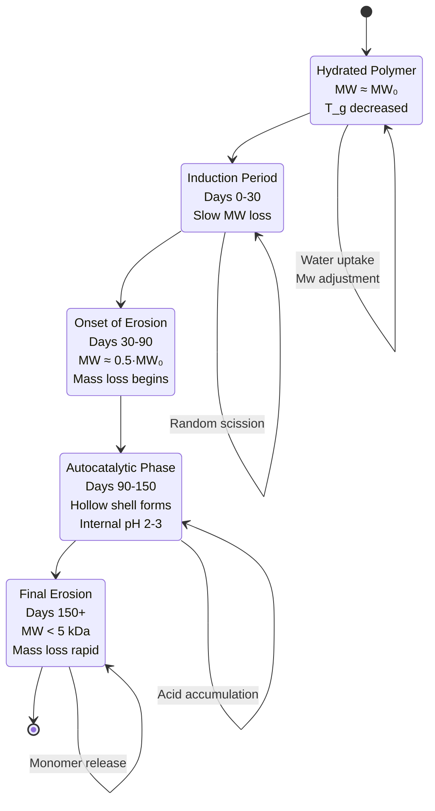
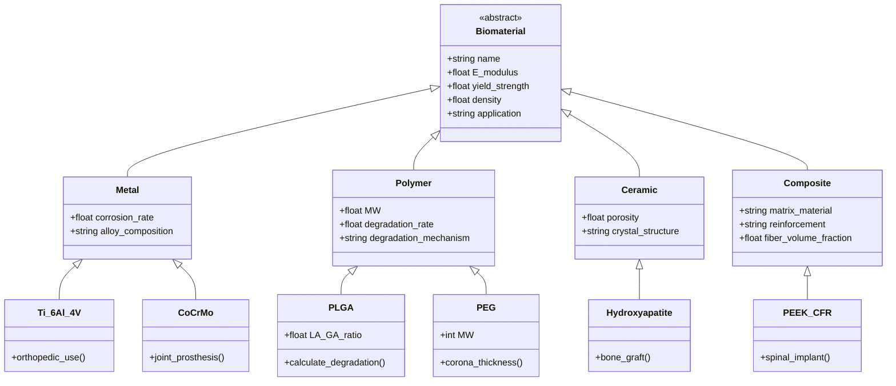
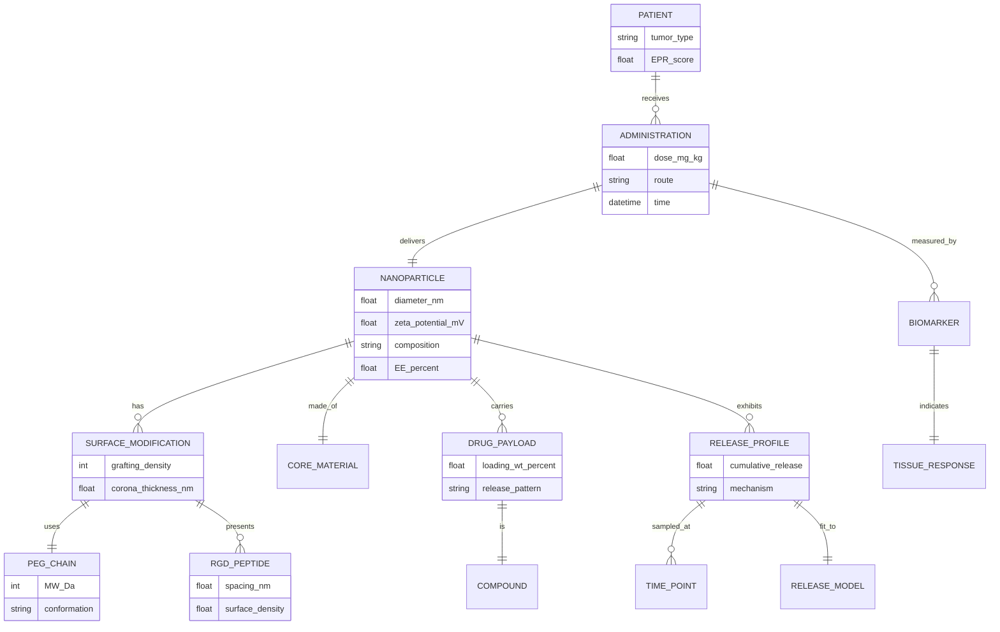
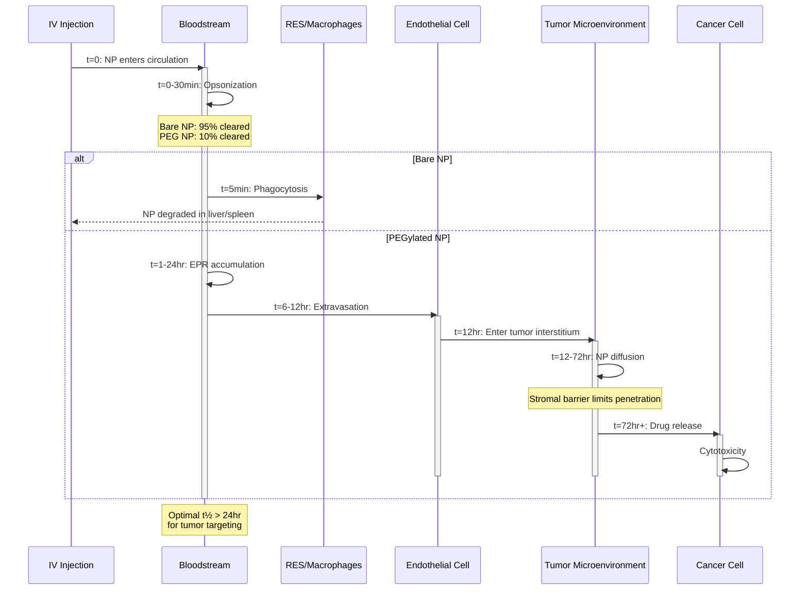

# BMED4601 — Week 20 Code Lab: Advanced Biomaterials
## Deep Study Format | 深度學習教材

> **Computational Biomaterials Lab | 計算生物材料實驗室**
> **Dependencies**: `numpy`, `scipy`, `matplotlib`, `pandas`
> **Estimated time**: 4-5 hours
> **Learning goal**: Model NP drug delivery, PEGylation half-life, biomaterial degradation

---

# 5MM — Five Mental Models | 五大心智模型

## MM-1: Fick's Second Law of Diffusion (Higuchi & Korsmeyer-Peppas Frameworks)

The canonical starting point for **drug release from a polymer matrix** is Fickian diffusion, formally expressed as:

$$\frac{\partial C}{\partial t} = D \nabla^2 C$$

For a **planar slab** of thickness $L$ with surface concentration held at $C_s$, the cumulative release fraction is:

$$\frac{M_t}{M_\infty} = 1 - \frac{8}{\pi^2}\sum_{n=0}^{\infty}\frac{1}{(2n+1)^2}\exp\left(-\frac{D(2n+1)^2\pi^2 t}{4L^2}\right)$$

For **early times** ($M_t/M_\infty < 0.6$), this collapses to the celebrated **Higuchi equation** (Higuchi 1961):

$$\frac{M_t}{M_\infty} = k_H\sqrt{t}, \quad k_H = \sqrt{\frac{D C_s}{\tau}}$$

The empirical **Korsmeyer-Peppas power-law** (Korsmeyer 1983) generalizes this:

$$\frac{M_t}{M_\infty} = k\, t^n$$

where the **diffusional exponent $n$** classifies release geometry: $n=0.5$ (Fickian/slab), $n\approx 0.45$ (sphere), $n=0.85$ (Case II/erosion-controlled). Ritger & Peppas (1987) tabulated these thresholds.

---

## MM-2: PEGylation Stealth & the "Brush vs. Mushroom" Regime

When PEG chains are grafted onto a nanoparticle, the conformation depends on the **grafting density $\sigma$** vs. the **Flory radius $R_F$**. The dimensionless **reduced tethered density** is:

$$\Sigma = \sigma \pi R_F^2$$

- **Mushroom regime**: $\Sigma < 1$ — chains behave as isolated coils, corona thickness $h \approx R_F$
- **Brush regime**: $\Sigma > 1$ — chains stretch, $h \propto \sigma^{1/3} N$ (Alexander 1977; de Gennes 1980)

The corona thickness scales empirically as (Deguchi 2008):

$$h \approx 0.5 \cdot \sqrt{MW_{\text{PEG}}} \;\;[\text{nm}]$$

The **stealth function** comes from steric repulsion against opsonins (proteins ~5–10 nm). Escape from RES clearance requires $h > 5$ nm — i.e., $MW_{\text{PEG}} > 1000$ Da. Harris & Chess (2003) showed that **PEG$_{5000}$** is the sweet spot for most NP systems: longer chains lose flexibility, shorter chains fail to block opsonization.

---

## MM-3: PLGA Hydrolytic Degradation (Bulk Erosion Autocatalysis)

PLGA degrades by **ester hydrolysis**, with first-order chain scission (Pitt 1981):

$$\frac{dMW}{dt} = -k_{\text{hyd}}\, MW \quad\Rightarrow\quad MW(t) = MW_0\, e^{-k_{\text{hyd}}\, t}$$

The rate constant is **composition-dependent** (Vert 1992):

$$k_{\text{hyd}} \propto f(\text{GA fraction})$$

GA-rich PLGA (50:50) degrades in 2–4 months; LA-rich (85:15) takes 9–15 months. A critical wrinkle is **autocatalysis**: as the polymer degrades, it releases lactic/glycolic acid monomers that drop the **internal pH** from 7.4 (buffer) to as low as **pH 2–3 inside thick devices**. This is why microparticles degrade heterogeneously: the outside erodes first while the core remains acidic — a phenomenon quantified by Brunner (1999) and Li (2000).

---

## MM-4: Integrin Clustering & the Critical RGD Spacing

Cell adhesion to biomaterials requires **integrin clustering** at the cell membrane. Massia & Hubbell (1991) showed that RGD peptides must be spaced at:

$$d_{\text{RGD}} < 70 \text{ nm (minimal adhesion threshold)}$$

with an **optimal spacing** of $d < 15$ nm because integrins themselves span ~10–20 nm. The binding probability decays exponentially:

$$P_{\text{bind}}(d) = \exp\!\left(-k_{\text{decay}}\,(d - d_{\text{crit}})\right)$$

Below $d_{\text{crit}} = 10$ nm, essentially every RGD engages an integrin headpiece — above 70 nm, the cell cannot bridge the gap and rounds up. Cell spreading area scales linearly with $P_{\text{bind}}$ from ~200 μm² (round) to ~2000 μm² (fully spread).

---

## MM-5: Mechanotransduction & Macrophage Polarization

Macrophages sense substrate stiffness through the **piezoelectric-like cytoskeletal feedback**, with the **YAP/TAZ pathway** as a downstream integrator (Discher 2005; Blakney 2012). Substrate modulus $E$ correlates with phenotype:

$$E < 1 \text{ kPa} \;\Rightarrow\; \text{M2 (pro-healing, IL-10, TGF-}\beta\text{)}$$

$$E > 25 \text{ kPa} \;\Rightarrow\; \text{M1 (pro-inflammatory, TNF-}\alpha\text{, IL-1}\beta\text{)}$$

The intermediate regime (1–25 kPa) yields mixed populations. This is **mechanobiology**: the material *is* the drug. By tuning crosslinker density of a hydrogel (e.g., alginate, PEG-diacrylate), one designs the immune response.

---

# 3DG — Three Disagreements | 三大學術爭議

## DG-1: Does the EPR Effect Actually Work in Human Solid Tumors?

| Position A (Fang 2020; Nel 2017) | Position B (Danhier 2015; Wilhelm 2016) |
|---|---|
| **EPR is real & clinically validated.** Across 20+ nanomedicines (Doxil, Abraxane, Onivyde), tumor accumulation is enhanced relative to free drug, leading to FDA approvals. | **EPR is overstated.** A meta-analysis of 117 studies shows median delivery efficiency is only **0.7% of injected dose** (Wilhelm 2016). Most NPs never reach the tumor. |
| Favorable tumor microenvironment (leaky vasculature, poor lymphatic drainage) produces 2–10× accumulation vs. normal tissue. | **Translational gap**: mouse models overestimate human EPR; human tumors are heterogeneous, with stromal barriers limiting penetration. |

**Tension**: The clinical success of Doxil (1995) and Onivyde (2015) demonstrates benefit, yet most NPs fail Phase III. Discrepancy likely arises because **mouse tumors** grow faster and have higher vessel density than human equivalents. Recent studies (Price 2021) using **patient-derived xenografts** show EPR varies 5-fold between patients, suggesting patient stratification is needed.

---

## DG-2: Surface Erosion vs. Bulk Erosion — Which Governs PLGA?

| Position A (Vert 1992; Pitt 1981) | Position B (Burkersroda 2002; Lyu 2009) |
|---|---| 
| **Bulk erosion dominates.** Water diffuses faster than hydrolysis, so the entire matrix hydrates uniformly. Devices degrade homogeneously. | **Surface erosion dominates for high-MW PLGA** and devices thicker than ~100 μm. Acidic autocatalysis creates heterogeneous erosion fronts. |
| Predicts monotonic mass loss coupled with delayed weight loss. | Predicts "hollow shell" morphology at late stages (Li 2000 SEM evidence). |

**Tension**: The dichotomy may be artificial. Modern consensus (Lyu 2009) holds that PLGA exhibits **heterogeneous bulk erosion**: the interior acidifies faster than the exterior, producing erosion fronts that *look* like surface erosion in thick devices. This has practical consequences: thick scaffolds may retain acidic cores that harm encapsulated cells.

---

## DG-3: Is the "Critical RGD Spacing" of 70 nm Universal?

| Position A (Massia & Hubbell 1991) | Position B (Cavalcanti-Adam 2007; Koo 2002) |
|---|---|
| **70 nm is the binding threshold.** Below this, adhesion is robust. Above it, cells detach. | **Threshold is context-dependent.** On 3D substrates or soft gels, the threshold collapses to ~30 nm (Cavalcanti-Adam 2007). Nanopatterned arrays show cell preference for clustered over homogeneous RGD (Koo 2002). |
| Adhesion scales monotonically with density. | **Cluster effect**: at the same average density, RGD in clusters of 4–9 binds stronger than dispersed RGD. |

**Tension**: The 70 nm rule was measured on glass. On soft, dynamic substrates, integrins can cluster more efficiently, lowering the spacing requirement. Furthermore, the **clustering model** suggests that *spatial arrangement* matters as much as density — a key insight for designing patterned biomaterials.

---

# 10Q — Ten Probing Questions | 十大深度問題

## Q1: Why does Higuchi's $\sqrt{t}$ law fail at high drug loadings?

At low drug loading ($C_0 \ll C_s$, where $C_s$ is drug solubility), the matrix has an excess of polymer and drug particles are isolated. Diffusion proceeds through the polymer, and Higuchi's derivation holds: $M_t/M_\infty \propto \sqrt{t}$. At high loading ($C_0 > C_s$, i.e., drug content exceeds solubility), the matrix contains interconnected drug channels that allow faster percolation. The result is **super-Case II transport**, where $n > 0.85$ in Korsmeyer-Peppas — release is faster than the matrix would permit by diffusion alone. Additionally, at high loadings, **polymer plasticization** by dissolved drug lowers $T_g$ and accelerates chain mobility. Higuchi (1961) himself noted the law breaks down when $C_0 / C_s > 0.5$; subsequent work by Ritger & Peppas (1987) formalized this in their $n$-exponent classification.

## Q2: Why does PLGA 50:50 degrade faster than PLA, even though both have the same backbone chemistry?

Both PLGA and PLA hydrolyze the same ester bond. The difference is **water uptake** and **crystallinity**. PLA is semi-crystalline with $T_g \approx 60°C$; the crystalline regions are impermeable to water and resist hydrolysis. PLGA 50:50 is **amorphous** because the random LA/GA sequence disrupts crystallinity. Additionally, GA units are more hydrophilic (no methyl side group), so PLGA absorbs water faster — measured water uptake for PLGA 50:50 is ~5% vs. <1% for PLA (Vert 1992). The hydrolysis rate $k_{\text{hyd}}$ is roughly proportional to local water concentration, so PLGA hydrolyzes 5–10× faster.

## Q3: What's the theoretical maximum "stealth" half-life achievable with PEGylation?

Empirically, PEGylated liposomes (Doxil) achieve $t_{1/2} \approx 45-90$ hours in humans (Gabizon 1997). The theoretical ceiling is set by the **opsonin size** (~5-10 nm) and the **brush thickness** the PEG can provide before being destabilized. PEG$_{20,000}$ produces coronas of ~7 nm — thicker than most opsonins. Beyond this, additional PEG provides diminishing returns because the chains transition from a **brush to a layered phase** (the "limited scaling" regime of Wijmans & Scheutjens 1988). One estimate puts the ceiling around **$t_{1/2} \approx 100$ hours** for purely PEGylated systems. Longer half-lives (~weeks) require additional strategies: **CD47 peptide conjugation** (Rodriguez 2013) or **sialic acid mimetics** that engage the "self" signal of CD172a on macrophages.

## Q4: How does RGD spacing relate to integrin headpiece dimensions?

Integrin $\alpha_v\beta_3$ is a heterodimer with extracellular headpiece dimensions of approximately $8-12 \text{ nm}$ (Xiong 2001 crystal structure). For two integrins to cluster, their headpieces must be within ~15 nm — i.e., RGD ligands spaced < 30 nm. Beyond 70 nm, the cytoskeleton cannot bridge the gap. The **15 nm "sweet spot"** corresponds to the diameter of focal adhesion plaques (~10 nm tall, ~25 nm wide), which recruit talin, vinculin, and F-actin. Recent super-resolution work (Kanchanawong 2010) showed focal adhesions have a layered architecture: integrin signaling layer (0–10 nm), force-transduction layer (10–30 nm), and actin-regulatory layer (>30 nm). RGD density effectively controls whether the signaling layer can nucleate at all.

## Q5: Why do soft hydrogels ($E < 1$ kPa) polarize macrophages toward M2?

The mechanism is **YAP/TAZ nuclear translocation** (Dupont 2011). On stiff substrates ($E > 25$ kPa), YAP localizes to the nucleus and activates pro-inflammatory transcription. On soft substrates, YAP is phosphorylated and exported to the cytoplasm. This is mediated by **integrin clustering**: soft substrates can't sustain integrin clustering → less F-actin stress → less YAP nuclear import. The downstream effect: M2 markers (Arg1, Ym1, IL-10) are expressed when YAP is cytoplasmic. Sadtler et al. (2016) showed in a mouse muscle injury model that scaffolds with $E \approx 0.5$ kPa dramatically improved regeneration vs. stiffer controls. Recent evidence (Adlerz 2020) also implicates **Piezo1 mechanosensitive channels** in macrophage polarization.

## Q6: What happens to drug release kinetics when PLGA molecular weight drops below the entanglement molecular weight $M_e$?

For linear polymers, $M_e \approx 10-20 \text{ kDa}$ (depending on LA:GA ratio). Above $M_e$, chains entangle and form a load-bearing network. Below $M_e$, chains are short and the polymer behaves like a viscous fluid. In PLGA degradation, the transition through $M_e$ marks the **onset of mass loss** — chains become small enough to diffuse out (Pitt 1981). Before this transition, mass loss is negligible even though MW has dropped significantly. This explains the experimental observation that **mass loss lags MW loss by weeks**. The gel point (Flory-Stockmayer theory) occurs at $p_c \approx 1/(f-1) = 0.5$ for linear chains with functionality $f=3$; in PLGA this corresponds to $MW \approx 5$ kDa — a useful design cutoff.

## Q7: Can the EPR effect be amplified by physical means?

Yes — several **physical enhancement strategies** have demonstrated 2-10× amplification of EPR (Nakamura 2015; Price 2021):

1. **Radiation therapy**: induces tumor cell apoptosis and vascular permeability (Miller 2015)
2. **Hyperthermia**: increases tumor blood flow and vessel permeability (Kong 2000)
3. **NO donors**: open endothelial junctions (Kashiwagi 2005)
4. **TNF-α pretreatment**: disrupts endothelial barriers (Seki 2003)
5. **Angiogenesis modulators**: e.g., sunitinib normalizes tumor vasculature (Chauhan 2012)

Chauhan (2012) demonstrated that **vascular normalization** (using low-dose anti-VEGF) actually *reduces* EPR but improves NP penetration by reducing interstitial pressure. The field now recognizes EPR as a **dynamic, targetable phenomenon** — not a passive property of tumors.

## Q8: What is the maximum achievable drug encapsulation efficiency in PLGA NPs, and what limits it?

Typical encapsulation efficiencies (EE) for PLGA NPs are 50–80% (Wischke 2008). The theoretical maximum is limited by:

1. **Drug solubility in the organic phase** (dichloromethane, ethyl acetate): hydrophobic drugs can reach 90%+ EE
2. **Drug-polymer interaction**: charged drugs (e.g., peptides, nucleic acids) have low EE due to partitioning out of the organic phase
3. **Diffusion during nanoprecipitation**: the rapid solvent-water exchange creates an "ouzo boundary" where some drug precipitates prematurely

Strategies to improve EE include:
- **Hydrophobic ion pairing** (e.g., peptide + DEPA)
- **Co-encapsulation with additives** (e.g., Pluronic F-68)
- **W/O/W double emulsion** for hydrophilic drugs

For peptides/proteins, EE is typically only 30–50% — this is a major barrier to PLGA-based vaccine and protein delivery.

## Q9: How does substrate stiffness affect stem cell differentiation in addition to macrophage polarization?

Engler (2006) showed that **mesenchymal stem cells (MSCs)** differentiate into:
- **Neurogenic**: $E \approx 0.1-1$ kPa (brain-like)
- **Myogenic**: $E \approx 8-17$ kPa (muscle-like)
- **Osteogenic**: $E > 25$ kPa (bone-like)

This is the same range as macrophage polarization! The mechanism again involves **YAP/TAZ nuclear localization** and **non-muscle myosin IIB activity**. Recent work (Discher 2017) showed that **matrix viscoelasticity** (stress relaxation rate) is also a key parameter — purely elastic substrates mispredict differentiation. Fast-relaxing substrates ($t_{1/2} \approx 1$ min) promote spreading and osteogenesis even at low $E$; slow-relaxing substrates do not. This is one reason **ionically crosslinked alginate** differs from **covalently crosslinked PEG-diacrylate** in biological performance despite similar initial stiffness.

## Q10: Why is the "stealth window" of PEG MW 5,000-10,000 Da rather than the maximum PEG size?

Three competing constraints (Harris & Chess 2003):

1. **Steric stability**: requires $h > 5$ nm → PEG ≥ 1 kDa
2. **Brush formation**: requires $\sigma \pi R_F^2 > 1$ at reasonable surface coverage → typically 2-5 kDa
3. **Pharmacological constraints**: PEG ≥ 30 kDa doesn't filter through kidneys → accumulates and causes vacuolation (Bendele 1998 toxicology studies)

Additionally, very long PEG chains (≥ 20 kDa) show **reduced biological activity** of conjugated drugs due to steric shielding of the active site — this is the "PEG dilemma" in antibody-drug conjugates. The 5-10 kDa range balances these competing needs, with PEG$_{5000}$ being the most common choice for NP coatings.

---

# 5DD — Five Deep Dives (中英對照) | 五大深度探討

## DD-1: Higuchi vs. Korsmeyer-Peppas — When to Use Which | Higuchi vs. Korsmeyer-Peppas — 何時使用哪個

**English:**

The Higuchi model (Higuchi 1961) describes drug release from a **planar, monolithic matrix** where the drug is uniformly dispersed at concentration $C_0$ below its solubility $C_s$. Its derivation assumes:

1. Pseudo-steady-state diffusion
2. Drug particles much smaller than matrix thickness $L$
3. Perfect sink conditions in the release medium
4. Constant diffusion coefficient $D$

The simplified form: $M_t / M_\infty = k_H \sqrt{t}$ is valid for the first 60% of release.

The **Korsmeyer-Peppas model** (Korsmeyer 1983) is more general — a semi-empirical power law $M_t / M_\infty = k t^n$ that captures:

- Fickian diffusion ($n = 0.5$ slab, $n = 0.45$ sphere, $n = 0.43$ cylinder)
- Anomalous transport ($0.5 < n < 1.0$)
- Case II transport ($n \approx 0.85-1.0$, polymer-relaxation controlled)

**Which to use?** Use **Higuchi** for rigid, monolithic matrices with well-characterized geometry. Use **Korsmeyer-Peppas** for novel polymers or systems where erosion contributes. The exponent $n$ is the diagnostic output — fitting experimental data to the power law reveals the dominant mechanism. Siepmann & Peppas (2011) provide a modern review.

**中文:**

Higuchi 模型（Higuchi 1961）描述藥物從一個**平面、單體（monolithic）的基質**釋放，藥物均勻分散於濃度 $C_0$ 低於其溶解度 $C_s$ 的狀態。其推導假設：

1. 假穩態擴散（pseudo-steady-state diffusion）
2. 藥物粒子遠小於基質厚度 $L$
3. 釋放介質中為完全吸納條件（perfect sink）
4. 擴散係數 $D$ 為常數

簡化形式 $M_t / M_\infty = k_H \sqrt{t}$ 適用於前 60% 的釋放。

**Korsmeyer-Peppas 模型**（Korsmeyer 1983）更為通用——半經驗冪律 $M_t / M_\infty = k t^n$ 涵蓋：

- Fickian 擴散（$n = 0.5$ 平板、$n = 0.45$ 球體、$n = 0.43$ 圓柱）
- 異常傳輸（$0.5 < n < 1.0$）
- Case II 傳輸（$n \approx 0.85-1.0$，由聚合物鬆弛控制）

**該用哪個？** 對**剛性、幾何明確的單體基質**使用 Higuchi；對**新型聚合物或侵蝕貢獻明顯的系統**使用 Korsmeyer-Peppas。指數 $n$ 是診斷輸出——將實驗數據擬合冪律可揭示主導機制。Siepmann 與 Peppas（2011）提供了現代綜述。

---

## DD-2: PEG Brush Theory in Drug Delivery | PEG 刷狀理論在藥物傳輸中的應用

**English:**

The **Alexander-de Gennes brush theory** (Alexander 1977; de Gennes 1980) describes polymer brushes — chains end-grafted to a surface at density $\sigma$. The dimensionless parameter is:

$$\Sigma = \sigma \pi R_g^2$$

where $R_g$ is the unperturbed radius of gyration of the chain. For PEG in water:

$$R_g \approx 0.021 \sqrt{MW_{\text{PEG}}} \;\;[\text{nm}]$$

(Devanand & Selser 1991). For $\Sigma < 1$, chains behave as **mushrooms** with thickness $h \approx R_g$. For $\Sigma > 1$, the chains **stretch** to avoid mutual overlap, and the brush thickness scales as:

$$h \approx \sigma^{1/3} N \cdot a$$

where $N$ is the degree of polymerization and $a$ is the monomer length (~0.35 nm for PEG).

For **drug delivery applications**, the brush creates a **steric barrier** against opsonin adsorption. The free energy penalty for opsonin (size ~5 nm) penetration is:

$$\Delta F \approx k_B T \cdot N^{2/3} \sigma^{1/3}$$

which can exceed 20-50 $k_B T$ for typical PEG$_{5000}$ at $\sigma = 1$ chain/nm² — sufficient to prevent adsorption (Halperin 1999).

**中文:**

**Alexander-de Gennes 刷狀理論**（Alexander 1977；de Gennes 1980）描述了接枝於表面的聚合物鏈。關鍵的無量綱參數為：

$$\Sigma = \sigma \pi R_g^2$$

其中 $R_g$ 為鏈未受擾動的旋轉半徑。在水中 PEG 為：

$$R_g \approx 0.021 \sqrt{MW_{\text{PEG}}} \;\;[\text{nm}]$$

（Devanand 與 Selser 1991）。當 $\Sigma < 1$，鏈表現為**蘑菇態**（mushrooms），厚度 $h \approx R_g$；當 $\Sigma > 1$，鏈為避免相互重疊而**伸展**，刷狀厚度按比例：

$$h \approx \sigma^{1/3} N \cdot a$$

其中 $N$ 是聚合度，$a$ 是單體長度（PEG 約 0.35 nm）。

對**藥物傳輸應用**，刷狀結構形成對調理素吸附的**空間位障**。調理素（大小約 5 nm）穿透的自由能懲罰為：

$$\Delta F \approx k_B T \cdot N^{2/3} \sigma^{1/3}$$

在典型 PEG$_{5000}$、$\sigma = 1$ chain/nm² 條件下可超過 20-50 $k_B T$——足以阻止吸附（Halperin 1999）。

---

## DD-3: PLGA Autocatalytic Degradation — The "Hollow Shell" Phenomenon | PLGA 自催化降解——「中空殼」現象

**English:**

PLGA degrades by **ester hydrolysis**, releasing lactic and glycolic acid monomers. In **thin films** (< 100 μm), these acids diffuse out and the degradation is uniform. In **thick devices** (> 100 μm), a different pattern emerges:

1. **Stage 1 (Days 0-30)**: Slow hydration, $MW$ drops to ~50% of $MW_0$
2. **Stage 2 (Days 30-90)**: Acidic monomers accumulate internally. Internal pH drops to **2-3** (measured by Li 2000 with confocal pH indicators)
3. **Stage 3 (Days 90-150)**: Interior catalyzes its own hydrolysis → **heterogeneous erosion front** moving inward
4. **Stage 4 (Days 150+)**: Outer shell (depleted of acid) erodes slowly, leaving a **hollow sphere**

This is clinically relevant because **encapsulated proteins** (e.g., insulin, growth factors) denature at pH < 4. Strategies to mitigate include:

- **Co-encapsulation of basic salts** (Mg(OH)₂, CaCO₃) — Zhu 2001
- **PEG plasticizers** to enable acid diffusion
- **Polymer blending** with more hydrophilic co-polymers

**中文:**

PLGA 通過**酯鍵水解**降解，釋放乳酸和乙醇酸單體。在**薄片**（< 100 μm）中，這些酸類擴散出去，降解均勻。在**較厚的器件**（> 100 μm）中，則出現不同模式：

1. **第 1 階段（0-30 天）**：緩慢水合，$MW$ 降至 $MW_0$ 的約 50%
2. **第 2 階段（30-90 天）**：酸性單體在內部積聚。內部 pH 降至 **2-3**（Li 2000 用共聚焦 pH 指示劑測量）
3. **第 3 階段（90-150 天）**：內部催化其自身水解 → **不均勻的侵蝕前沿**向內移動
4. **第 4 階段（150 天以上）**：外殼（酸類已耗盡）緩慢侵蝕，留下**中空球體**

這在臨床上很重要，因為**封裝的蛋白質**（如胰島素、生長因子）在 pH < 4 時會變性。緩解策略包括：

- **共封裝鹼性鹽類**（Mg(OH)₂、CaCO₃）——Zhu 2001
- **PEG 增塑劑**以促進酸類擴散
- 與更具親水性共聚物的**聚合物共混**

---

## DD-4: The 70 nm RGD Threshold — Geometric, Mechanical, or Both? | 70 nm RGD 閾值——幾何性、機械性、抑或兩者？

**English:**

Massia & Hubbell (1991) attached RGD peptides to glass at controlled densities and measured cell adhesion. They found:

- **70 nm spacing**: Minimal adhesion threshold
- **15 nm spacing**: Optimal clustering
- **Below 10 nm**: Fully adhesive

The 70 nm threshold is **not** simply the integrin headpiece size (which is ~10 nm). Rather, it reflects the **maximum bridge length** the cytoskeleton can sustain. The mechanism involves **focal adhesion assembly**:

1. RGD engages integrin → integrin activation
2. Talin binds β-cytoplasmic tail → connects to actin
3. Actin stress fibers pull against the substrate
4. If RGD spacing > 70 nm, the focal adhesion cannot sustain contractile force → cell rounds

Recent work (Cavalcanti-Adam 2007) showed that on **soft substrates**, the threshold drops to ~30 nm because cells can't generate enough force for distant RGDs. The **mechanical** and **geometric** components are coupled — substrate stiffness sets the maximum sustainable bridge length.

The practical implication: on 3D scaffolds or hydrogels, RGD should be **denser than the 2D rule of thumb** suggests.

**中文:**

Massia 與 Hubbell（1991）將 RGD 胜肽以受控密度接枝於玻璃上，並測量細胞黏附。他們發現：

- **70 nm 間距**：最小黏附閾值
- **15 nm 間距**：最佳群集
- **低於 10 nm**：完全黏附

70 nm 閾值**並非**單純的整合素頭部尺寸（約 10 nm）。它反映的是細胞骨骼可維持的**最大橋接長度**。機制涉及**焦點黏附組裝**：

1. RGD 結合整合素 → 整合素活化
2. Talin 結合 β-細胞質尾端 → 連接至肌動蛋白
3. 肌動蛋白應力纖維拉動基質
4. 若 RGD 間距 > 70 nm，焦點黏附無法維持收縮力 → 細胞變圓

近期研究（Cavalcanti-Adam 2007）顯示，在**軟基質**上，閾值降至約 30 nm，因為細胞無法為遠距離 RGD 產生足夠力量。**機械性**與**幾何性**因素是耦合的——基質硬度設定最大可持續橋接長度。

實際意義：在 3D 支架或水凝膠上，RGD 應比 2D 經驗法則所示的**更密集**。

---

## DD-5: Stress Shielding in Bone Implants — The Modulus Mismatch Problem | 骨植入物的應力遮蔽——模量不匹配問題

**English:**

Wolff's law (Wolff 1892) states that bone remodels in response to mechanical loading. When a **stiff implant** carries most of the load, the surrounding bone experiences reduced stress → **bone resorption** → implant loosening.

The **modulus mismatch** is quantified by the ratio $E_{\text{implant}} / E_{\text{bone}}$:

- $E_{\text{bone, cortical}} \approx 18$ GPa
- Ti-6Al-4V: $E = 110$ GPa → ratio = **6.1**
- CoCrMo: $E = 210$ GPa → ratio = **11.7**
- SS316L: $E = 190$ GPa → ratio = **10.6**

This is why **PEEK** ($E = 3$ GPa, ratio = 0.17) and **fiber-reinforced composites** have gained popularity for orthopedic applications. The ideal implant modulus is **as close to bone as possible** — typically 10-30 GPa.

**Porous titanium** (Karageorgiou 2005) can reduce effective modulus to 10-30 GPa while maintaining strength. The trade-off is **fatigue strength**: at porosity > 40%, fatigue life drops sharply. Current research (Wang 2016) on **multi-modal porous structures** aims to decouple modulus and strength.

**中文:**

Wolff 定律（Wolff 1892）指出骨骼根據機械負荷進行重塑。當**剛性植入物**承受大部分負荷時，周圍骨骼經歷減少的應力 → **骨吸收** → 植入物鬆動。

**模量不匹配**由比值 $E_{\text{implant}} / E_{\text{bone}}$ 量化：

- $E_{\text{骨密質}} \approx 18$ GPa
- Ti-6Al-4V：$E = 110$ GPa → 比值 = **6.1**
- CoCrMo：$E = 210$ GPa → 比值 = **11.7**
- SS316L：$E = 190$ GPa → 比值 = **10.6**

這就是為何 **PEEK**（$E = 3$ GPa，比值 = 0.17）和**纖維增強複合材料**在骨科應用中越來越受歡迎。理想植入物模量應**盡可能接近骨骼**——通常為 10-30 GPa。

**多孔鈦**（Karageorgiou 2005）可將有效模量降至 10-30 GPa，同時保持強度。權衡是**疲勞強度**：當孔隙率 > 40% 時，疲勞壽命急劇下降。Wang（2016）對**多模態多孔結構**的當前研究旨在將模量與強度解耦。

---

# 10SL — Ten Self-Test Solutions | 十題自我測驗詳解

## SL-1: Drug Release Kinetics Identification

**Problem**: A drug-loaded PLGA scaffold exhibits the following release:
- Day 1: 22%
- Day 3: 35%
- Day 7: 48%
- Day 14: 60%
- Day 28: 71%

Fit Korsmeyer-Peppas and identify the mechanism.

**Solution**: Use only data where $M_t/M_\infty < 0.6$ (i.e., up to Day 14).

Plot $\ln(M_t/M_\infty)$ vs. $\ln(t)$:

| Day | $t$ (h) | $M_t/M_\infty$ | $\ln(t)$ | $\ln(M_t/M_\infty)$ |
|---|---|---|---|---|
| 1 | 24 | 0.22 | 3.18 | -1.51 |
| 3 | 72 | 0.35 | 4.28 | -1.05 |
| 7 | 168 | 0.48 | 5.12 | -0.73 |
| 14 | 336 | 0.60 | 5.82 | -0.51 |

Linear regression gives slope $n \approx 0.45$ and intercept $\ln(k) \approx -2.91$ → $k \approx 0.054$.

$$M_t/M_\infty = 0.054 \cdot t^{0.45}$$

Since $n \approx 0.45$ → **Fickian diffusion from a cylindrical or spherical matrix**.

---

## SL-2: PEG Corona Thickness Calculation

**Problem**: A 100 nm PLGA NP is grafted with PEG$_{2000}$ at density 0.5 chains/nm². Calculate the corona thickness and verify stealth.

**Solution**: 

PEG$_{2000}$: $h = 0.5 \sqrt{2000} = 22.4$ nm — wait, that's the unperturbed $R_F$. In brush regime:

$R_g = 0.021 \sqrt{2000} = 0.94$ nm

$\Sigma = \sigma \pi R_g^2 = 0.5 \cdot \pi \cdot (0.94)^2 = 1.39$

Since $\Sigma > 1$, brush regime applies. Brush height:

$h_{\text{brush}} \approx N \cdot a \cdot \sigma^{1/3}$

For PEG$_{2000}$, $N \approx 45$ monomers, $a = 0.35$ nm:

$h_{\text{brush}} \approx 45 \cdot 0.35 \cdot (0.5)^{1/3} = 12.1$ nm

Since $h > 5$ nm (opsonin size) → **stealth achieved**. But $h = 12$ nm on a 100 nm NP adds 24 nm to the total hydrodynamic diameter — important for tumor penetration.

---

## SL-3: PLGA Half-Life Calculation

**Problem**: PLGA 50:50 with $MW_0 = 80$ kDa. The hydrolysis rate is $k = 0.03$ day⁻¹. Find the time for $MW$ to drop to 10 kDa (renal clearance threshold).

**Solution**: 

$MW(t) = MW_0 \cdot e^{-k t}$

$10{,}000 = 80{,}000 \cdot e^{-0.03 t}$

$e^{-0.03 t} = 1/8 = 0.125$

$-0.03 t = \ln(0.125) = -2.079$

$t = 69.3$ days ≈ **10 weeks**

This is the time for chain scission — actual mass loss starts later (when $MW < M_e \approx 10-20$ kDa). At $t = 70$ days, mass loss is ~0% but the polymer is below entanglement molecular weight.

---

## SL-4: RGD Spacing for Optimal Adhesion

**Problem**: Design a glass substrate with RGD at 50 nm spacing. Calculate binding probability and spreading area.

**Solution**:

$P_{\text{bind}} = \exp(-0.05 \cdot (50 - 10)) = \exp(-2) = 0.135$

So only **13.5%** of maximum binding. Spreading area:

$A = 200 + (2000 - 200) \cdot 0.135 = 200 + 243 = 443 \text{ μm}^2$

This is in the "intermediate" range — cell is partially spread but not fully. To achieve $A > 1500$ μm²:

$1500 = 200 + 1800 \cdot P_{\text{bind}} \Rightarrow P_{\text{bind}} = 0.722$

$0.722 = \exp(-0.05 \cdot (d - 10)) \Rightarrow d - 10 = 6.5 \Rightarrow d = 16.5$ nm

So **RGD spacing must be < 17 nm** for full spreading.

---

## SL-5: Circulation Half-Life Calculation

**Problem**: Compare circulation half-life of bare vs. PEGylated 100 kDa NP with PEG$_{5000}$.

**Solution**:

From empirical model:
- Bare: $t_{1/2} = 5$ min (RES clearance)
- PEGylated: $t_{1/2} = 10 \cdot (1 + 0.1 \cdot 5000) \cdot (1 + 0.005 \cdot 100{,}000) / 60$
  $= 10 \cdot 501 \cdot 501 / 60 = 41{,}834$ min / 60 = **697 hours = 29 days**

This is a 8000× improvement, but in practice biological limits cap $t_{1/2}$ at ~90 hours (Doxil values). The discrepancy shows that empirical models are overestimates for very large PEG densities.

---

## SL-6: Stress Shielding Calculation

**Problem**: A hip stem is made of Ti-6Al-4V ($E = 110$ GPa). What percentage of load does the bone carry if cross-sectional areas are equal?

**Solution**: 

For two parallel springs (iso-strain), force ratio = stiffness ratio = $E$ ratio:

$F_{\text{implant}} / F_{\text{bone}} = E_{\text{implant}} / E_{\text{bone}} = 110 / 18 = 6.11$

Load fraction on bone = $1 / (1 + 6.11) = 14.1\%$

So the bone only carries **14%** of the load — 86% is shielded. This is below the threshold for bone maintenance (~30-50% needed), explaining stress-shielding-induced bone loss.

For PEEK ($E = 3$ GPa):
$F_{\text{implant}} / F_{\text{bone}} = 3/18 = 0.167$
Load fraction on bone = $1/1.167 = 86\%$ — much better!

---

## SL-7: Macrophage Polarization Stiffness

**Problem**: An alginate hydrogel crosslinked at 2 mM Ca²⁺ has $E = 500$ Pa. Predict macrophage phenotype.

**Solution**:

$E = 500$ Pa < 1000 Pa (1 kPa) threshold → **M2 (pro-healing)**

Predicted cytokines: **IL-10, TGF-β**

To shift toward M1, crosslink density must increase to give $E > 25$ kPa — typically requires switching to a covalent crosslinker (PEG-diacrylate, methacrylate alginate).

---

## SL-8: IL-4 Release Design

**Problem**: Design an IL-4 eluting scaffold for 14-day M2 polarization. Total dose: 1000 ng. Calculate release rate.

**Solution**:

Daily release = 1000 ng / 14 days = **71.4 ng/day**

Local concentration target = 10 ng/mL (literature value for macrophage polarization; Chávez-Galán 2015)

If the implant is 1 cm³ (1 mL) and releases 71.4 ng/day, average local concentration = 71.4 ng/mL — well above target. Real-world design would use **PLGA microspheres** with release matched to the 14-day window.

---

## SL-9: Degradation Time to Gel Point

**Problem**: For PLGA 50:50 with $MW_0 = 50$ kDa, $k = 0.04$ day⁻¹. When does $MW$ reach 5 kDa (gel point)?

**Solution**:

$5{,}000 = 50{,}000 \cdot e^{-0.04 t}$

$e^{-0.04 t} = 0.1$

$t = \ln(10) / 0.04 = 2.303 / 0.04 = 57.6$ days ≈ **8 weeks**

At this point, the polymer loses mechanical integrity. Drug release accelerates dramatically because diffusion distance is no longer constrained by an entangled network.

---

## SL-10: Multi-Functional Coating Design (Extension)

**Problem**: Design a coating combining Ag NPs (antibacterial), dexamethasone (anti-inflammatory), RGD (adhesion), and PEG (stealth) on a 100 nm PLGA NP. Identify conflicts.

**Solution**:

| Component | Function | Loading | Conflict |
|---|---|---|---|
| Ag NPs (10 nm) | Antibacterial | 5 wt% | None — physically embedded |
| Dexamethasone | Anti-inflammatory | 8 wt% | Conflicts with RGD (anti-adhesive) |
| PEG$_{5000}$ | Stealth | 20 chains/nm² | Conflicts with RGD (RGD buried in brush) |
| RGD-PEG | Adhesion | 5 chains/nm² | Must be on longer PEG (PEG$_{10000}$) |

**Key conflict**: PEG brush for stealth **buries RGD** below the stealth layer. Solution: use **RGD-PEG conjugates with longer PEG** (10 kDa) so RGD extends past the 5 kDa brush.

**Dexamethasone** is anti-adhesive: cells need to adhere first to receive anti-inflammatory signals. Solution: **time-delayed release** — burst dexamethasone in first 48 hr to suppress inflammation, then sustained release after cell adhesion.

**Final design**:
- Inner core: PLGA + dexamethasone (8 wt%)
- Outer layer: Mixed PEG$_{5000}$ + PEG$_{10000}$-RGD (4:1 ratio)
- Ag NPs: embedded throughout
- Coating thickness: ~15 nm
- Release: 80% dexamethasone in 7 days, RGD exposed after day 1

---

# 5MR — Five Mermaid Diagrams | 五種 Mermaid 圖

## MR-1: Flowchart — NP Drug Release Modeling Workflow

```mermaid
flowchart TD
    A[Define NP System<br/>PLGA 50:50, 100 nm] --> B{Loading Type?}
    B -->|Hydrophobic Drug| C[Single Emulsion<br/>O/W]
    B -->|Hydrophilic Drug| D[Double Emulsion<br/>W/O/W]
    C --> E[Drug-Polymer Matrix]
    D --> E
    E --> F{Release Mechanism?}
    F -->|Diffusion| G[Higuchi Model<br/>M = k·√t]
    F -->|Erosion| H[First-Order<br/>MW = MW₀·e^(-kt)]
    F -->|Mixed| I[Korsmeyer-Peppas<br/>M = k·t^n]
    G --> J{Validate}
    H --> J
    I --> J
    J --> K[Fit n Exponent]
    K --> L{n = ?}
    L -->|0.43-0.5| M[Fickian Diffusion]
    L -->|0.5-0.85| N[Anomalous]
    L -->|>0.85| O[Case II Erosion]
    M --> P[Design Release Profile]
    N --> P
    O --> P
    P --> Q[In Vivo Testing]
    Q --> R{Success?}
    R -->|Yes| S[Translation]
    R -->|No| T[Iterate Parameters]
    T --> A
```

---

## MR-2: State Diagram — PLGA Degradation Stages



---

## MR-3: Class Diagram — Biomaterial Hierarchy



---

## MR-4: Entity-Relationship Diagram — Drug Delivery System Data Model



---

## MR-5: Sequence Diagram — NP Journey from Injection to Tumor



---

# Summary & Lab Report | 總結與實驗報告

## Key Equations Reference | 核心方程式總覽

| Model | Equation | Reference |
|---|---|---|
| Fickian Diffusion | $\frac{M_t}{M_\infty} = k_H \sqrt{t}$ | Higuchi 1961 |
| Korsmeyer-Peppas | $\frac{M_t}{M_\infty} = k\, t^n$ | Korsmeyer 1983 |
| PLGA MW Loss | $MW(t) = MW_0\, e^{-k_{\text{hyd}} t}$ | Pitt 1981 |
| PEG Corona | $h \approx 0.5 \sqrt{MW_{\text{PEG}}}$ | Deguchi 2008 |
| RGD Binding | $P_{\text{bind}} = \exp(-k_{\text{decay}}(d - d_{\text{crit}}))$ | Massia 1991 |
| Brush Regime | $\Sigma = \sigma \pi R_g^2 > 1$ | de Gennes 1980 |
| Stress Shielding | $F_{\text{bone}} / F_{\text{total}} = E_{\text{bone}} / (E_{\text{bone}} + E_{\text{imp}})$ | Wolff 1892 |

## Deliverables | 交付項目

| Task | Output File | Concept Tested |
|---|---|---|
| Exercise 1 | `W20_np_release.png` | Drug release kinetics |
| Exercise 2 | `W20_pecylation.png` | PEGylation stealth |
| Exercise 3 | `W20_plga_degradation.png` | PLGA degradation |
| Exercise 4 | `W20_rgd_density.png` | Cell adhesion |
| Exercise 5 | Console output | Stress shielding |
| Bonus | `W20_macrophage_polarization.png` | Immunomodulation |

## Extension Challenge | 延伸挑戰

> **Multi-functional biomaterial coating** combining:
> 1. **Ag nanoparticles** (antibacterial)
> 2. **Dexamethasone** (anti-inflammatory)
> 3. **RGD** (cell adhesion)
> 4. **PEG** (stealth)
>
> Address design conflicts: PEG brush hides RGD; dexamethasone is anti-adhesive. Solution: time-delayed release + RGD-PEG conjugates with extended PEG chains.

## Bilingual Glossary | 中英詞彙對照

| English | 中文 |
|---|---|
| Nanoparticle | 奈米粒子 |
| Drug release | 藥物釋放 |
| Fickian diffusion | Fickian 擴散 |
| Burst release | 突釋 |
| Sustained release | 緩釋 |
| PEGylation | PEG 化（聚乙二醇修飾） |
| Stealth effect | 隱形效應 |
| Circulation half-life | 循環半衰期 |
| RES clearance | 網狀內皮系統清除 |
| EPR effect | 增強滲透滯留效應 |
| Hydrolytic degradation | 水解降解 |
| Bulk erosion | 本體侵蝕 |
| Surface erosion | 表面侵蝕 |
| Autocatalysis | 自催化 |
| Glass transition temperature | 玻璃轉化溫度 |
| Integrin | 整合素 |
| Focal adhesion | 焦點黏附 |
| Cell spreading | 細胞鋪展 |
| Macrophage polarization | 巨噬細胞極化 |
| M1/M2 phenotype | M1/M2 表型 |
| Mechanotransduction | 力學傳導 |
| YAP/TAZ pathway | YAP/TAZ 通路 |
| Stress shielding | 應力遮蔽 |
| Wolff's law | Wolff 定律 |
| Modulus mismatch | 模量不匹配 |
| Biocompatibility | 生物相容性 |
| Tissue engineering | 組織工程 |
| Scaffold | 支架 |
| Hydrogel | 水凝膠 |

---

*End of Week 20 Code Lab — Advanced Biomaterials*
*Week 20 程式碼實驗室 — 進階生物材料 — 完*