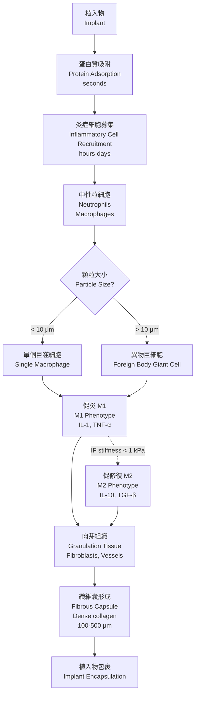
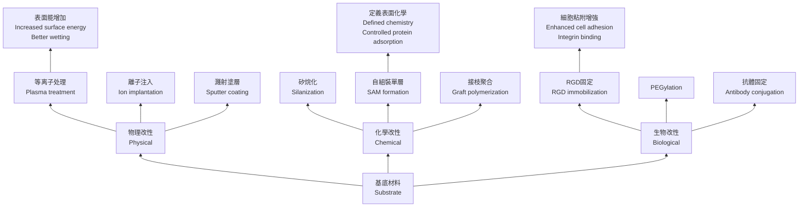

# Week 20 Notes — Advanced Biomaterials (BMED4601)

> **Course**: BMED4601 — Advanced Biomaterials  
> **Week**: 20 of 24 | **Phase**: 4 (Advanced Research)  
> **Prerequisites**: Materials science, biomaterials fundamentals, cell-biomaterial interactions  
> **CE advantage**: Your materials engineering knowledge (polymers, metals, ceramics) transfers directly to implant design

---

## 問題 1：5 個核心心智模型

### 1. Smart Materials & Responsive Polymers / 智能材料與響應性聚合物

**Definition**: Smart (stimuli-responsive) materials change their properties in response to environmental triggers.

**Key Trigger Types**:

| Trigger | Mechanism | Examples |
|---------|-----------|----------|
| Temperature | LCST/UCST transition | PNIPAAm (LCST ~32°C) |
| pH | Ionization of functional groups | PAA (pH-responsive) |
| Enzyme | MMP-sensitive peptide cleavage | PLGLAG peptide linker |
| Light | Photothermal or photocleavable | Azobenzene |
| Glucose | Concanavalin A binding | Boronic acid polymers |
| Magnetic field | Superparamagnetic NP heating | Fe₃O₄ in hydrogel |

**PNIPAAm (Poly-N-isopropylacrylamide)**:
- LCST (Lower Critical Solution Temperature) = 32°C (body temperature)
- Below 32°C: hydrophilic, swollen (hydrated)
- Above 32°C: hydrophobic, collapsed (dehydrated)
- Applications: thermoresponsive cell sheet detachment, drug release

**Mathematical description**:
$$\Delta G = \Delta H - T\Delta S$$

When |ΔH| < |TΔS|, dissolution occurs. For PNIPAAm: ΔH ≈ 5-10 kJ/mol (hydrogen bonding), ΔS ≈ entropy of water release.

**學者**: Teruo Okano (Tokyo Women's Medical University) — pioneered PNIPAAm cell sheet engineering.

---

### 2. Drug Delivery Nanoparticles / 藥物傳遞納米粒子

**EPR Effect (Enhanced Permeability and Retention)**:
Tumors and inflamed tissues have:
- **Enhanced permeability**: "Leaky" vasculature with 200-2000 nm fenestrations
- **Impaired lymphatic drainage**: Nanoparticles accumulate and are retained

**Optimal Nanoparticle Size**:
| Size Range | Behavior |
|------------|----------|
| < 5 nm | Rapid renal clearance (MWCO ~ 30-50 kDa) |
| 5-10 nm | Liver sequestration |
| 10-50 nm | Tumor accumulation via EPR; spleen/lymph node |
| 50-200 nm | Optimal EPR (main accumulation window) |
| 200-500 nm | Marginal EPR; RES clearance |
| > 500 nm | Trapped in capillary beds |

**Key Numbers for NP Drug Delivery**:
| Parameter | Value |
|-----------|-------|
| Optimal size for EPR | 50-200 nm |
| Optimal surface charge | Near-neutral (-10 to +10 mV) |
| PEG layer thickness | 5-10 nm |
| Circulation half-life (PEGylated) | 6-24 hours |
| Doxil (PEG-liposome) size | ~100 nm |
| Abraxane (albumin NP) size | ~130 nm |

**NP Material Classes**:

**Polymeric nanoparticles** (PLGA, PLA, PCL):
- Biodegradable, tunable degradation
- Encapsulation efficiency: 20-80%
- Drug loading: 1-10% w/w typical

**Liposomes** (phospholipid bilayer):
- Doxil, Ambisome, Visudyne
- Hydrophilic core + hydrophobic shell
- Can encapsulate both water-soluble and lipid-soluble drugs

**Dendrimers** (branched polymer architecture):
- Precise molecular weight, monodisperse
- Generations 1-10 (G1-G10)
- PAMAM dendrimers: surface amine groups for drug conjugation

**Gold nanoparticles** (AuNP):
- Surface plasmon resonance (SPR)
- Photothermal therapy (NIR light → heat)
- Size: 5-200 nm

**學者**: Robert Langer — pioneered polymeric drug delivery; Randy Mrsny — established EPR concept; Kazunori Kataoka (Tokyo) — polyplex micelles for gene delivery.

---

### 3. Immunomodulation in Biomaterials / 生物材料的免疫調節

**The Foreign Body Response (FBR)**:
1. **Protein adsorption** (seconds): Albumin, fibrinogen, complement proteins adsorb to surface
2. **Inflammation** (days): Neutrophils, macrophages arrive
3. **Granulation tissue formation** (weeks): Fibroblasts, new blood vessels
4. **Fibrosis/Fibrous encapsulation** (months): Dense collagen capsule around implant

**Fibrotic Capsule Thickness**:
| Material | Response |
|----------|----------|
| Biodegradable polymers | Thinner capsule, degrades with material |
| Smooth metals | 100-500 μm fibrous capsule |
| Rough/porous materials | Minimal capsule, tissue integration |
| PEG hydrogels | Ultra-thin or no capsule |

**Immunomodulatory Strategies**:

**Anti-inflammatory biomaterials**:
- Surface immobilization of anti-inflammatory drugs (dexamethasone)
- Cytokine neutralization (TNF-α, IL-1)
- NO-releasing materials (nitric oxide donors)

**"Invisible" surfaces**:
- PEGylation: PEG chains create steric barrier against protein adsorption
- Zwitterionic surfaces (phosphorylcholine, sulfobetaine): superhydrophilic, resists protein
- CD47 mimetics: "don't eat me" signal

**"M2 polarization" strategies**:
- Promote M2 (pro-healing) over M1 (pro-inflammatory) macrophage phenotype
- Alginate with tunable stiffness: soft (E < 1 kPa) → M2; stiff (E > 25 kPa) → M1
- IL-4/IL-13 release from biomaterial surface

**學者**: Jeffrey Hubbell — immunomodulatory biomaterials; Michael Sefton (Toronto) — PEG-based materials.

---

### 4. 3D Printing of Biomaterials / 生物材料3D打印

**3D Printing Technologies for Biomaterials**:

| Technology | Materials | Resolution | Applications |
|------------|-----------|------------|-------------|
| Extrusion-based (FDM) | Thermoplastics (PCL, PLA, PLGA) | 100-500 μm | Scaffolds |
| SLA/DLP (photopolymerization) | Photocurable resins (PEGDA, GelMA) | 10-100 μm | Tissue constructs |
| Inkjet | Low-viscosity bioinks | 20-50 μm | Cell printing |
| Laser-assisted (LIFT) | Photo-crosslinkable | 10-50 μm | High-resolution |
| SLS | Polymer powders | 100-200 μm | Porous scaffolds |

**Bioink Requirements**:
- **Rheological properties**: Shear-thinning (viscosity ↓ under stress)
- **Gelation**: Fast (UV or ion-crosslinking)
- **Biocompatibility**: Non-cytotoxic
- **Printability**: High shape fidelity
- **Post-printing mechanics**: Match target tissue

**Bioink Material Classes**:

| Material | Mechanism | Applications |
|----------|-----------|--------------|
| GelMA (gelatin methacrylate) | Photo-crosslinkable | Broad (vascular, cartilage, bone) |
| Alginate | Ionic (Ca²⁺) crosslinking | Broad |
| Collagen | Thermal gelation + enzymatic | Tissue-specific |
| dECM | Self-assembly | Organ-specific |
| Cell-laden hydrogels | Encapsulated cells | All tissue types |

**Key Numbers**:
| Parameter | Value |
|-----------|-------|
| Optimal bioink viscosity | 0.03-0.3 Pa·s (shear-thinning) |
| Crosslinking time | 10-60 seconds |
| Post-printing stiffness | Match target tissue E |
| Cell viability post-print | > 80% (ideally > 90%) |
| Nozzle diameter | 100-400 μm |
| Print speed | 1-50 mm/s |

**學者**: Jennifer Lewis (Harvard) — 3D bioprinting of vascularized tissue constructs; Ibrahim Ozbolat (Penn State) — extrusion bioprinting.

---

### 5. Surface Modification & Functionalization / 表面改性與功能化

**Surface Properties vs. Bulk Properties**:

| Property | Relevance |
|----------|-----------|
| Surface energy | Protein adsorption, cell adhesion |
| Surface charge | Protein orientation, cell attachment |
| Topography | Cell morphology, contact guidance |
| Chemistry | Specific molecular interactions |

**Surface Modification Methods**:

**Physical methods**:
- Plasma treatment (increase surface energy, introduce functional groups)
- UV/ozone treatment
- Corona discharge
- Ion beam implantation

**Chemical methods**:
- Silanization (glass/silicon surfaces)
- Self-assembled monolayers (SAMs)
- Wet chemical etching
- Graft polymerization

**Biological methods**:
- Immobilization of RGD peptide (Arg-Gly-Asp)
- Enzyme-mediated coupling
- Streptavidin-biotin interaction

**RGD Density**:
| RGD spacing | Cell response |
|-------------|---------------|
| < 10 nm | Strong adhesion, spreading |
| 10-20 nm | Optimal for most cells |
| > 30 nm | Reduced adhesion |
| > 70 nm | Minimal adhesion |

**Titanium Surface Modification**:
- **Machined**: Minimal surface roughness (Ra ~ 0.5 μm)
- **Acid-etched**: Microrough (Ra ~ 1-2 μm) — better osseointegration
- **Anodized**: Nanotube arrays (TiO₂, 20-100 nm diameter)
- **Sandblasted + acid-etched (SLA)**: Standard for dental implants

**學者**: Buddy Ratner — surface modification and biomaterials science; Warren Olanof — pioneer of PEGylation technology.

---

## 問題 2：3 個根本分歧

### 分歧 1：Biodegradable vs. Permanent Implants — Which is Better?

**Biodegradable implants**: Degrade over time, eventually replaced by native tissue.

*Advantages*:
- No long-term foreign body response
- No need for removal surgery
- Match tissue healing timeline
- Natural stress transfer to regenerating tissue

*Disadvantages*:
- Less precise mechanical properties (property changes with degradation)
- Inflammatory response to degradation products (acidic for PLGA)
- Cannot be used for load-bearing permanent applications
- Less predictable long-term behavior

**Permanent implants**: Designed to last indefinitely.

*Advantages*:
- Precise, stable mechanical properties
- Well-characterized long-term performance
- Extensive clinical history
- Suitable for load-bearing structural applications

*Disadvantages*:
- Stress shielding (bone resorption from mismatch)
- Corrosion (metals) or wear particles (joints)
- Need for removal in growing patients
- Long-term regulatory concerns

**Resolution**: Choose based on clinical need:
- **Bone defect filler**: Biodegradable (bone replaces scaffold)
- **Joint prosthesis**: Permanent (permanent joint needed)
- **Vascular stent**: Partially biodegradable (biodegradable magnesium stents under development)
- **Growing children**: Eventually biodegradable (no lifelong foreign body)

---

### 分歧 2：Local vs. Systemic Delivery — Targeting Strategy

**Local delivery**: Administer drug/biologic directly at site of action.

*Advantages*:
- High local concentration (100-1000× systemic)
- Reduced systemic side effects
- Lower total dose needed
- Bypasses first-pass metabolism

*Disadvantages*:
- Invasive administration
- Limited distribution (single site)
- Drug may leak to systemic circulation

**Systemic delivery**: Administer throughout the body.

*Advantages*:
- Non-invasive (oral, IV injection)
- Treats distributed disease (metastases, infections)
- Well-established administration routes

*Disadvantages*:
- Low target accumulation (typically < 1% of injected dose reaches tumor)
- Systemic toxicity
- Requires targeting ligand for specificity

**Resolution**: Use local for localized disease (bone defects, solid tumors), systemic for disseminated disease (leukemia, metastases, infections). Nanoparticles offer intermediate: localized accumulation via EPR (tumor targeting) while distributing systemically.

---

### 分歧 3：Synthetic vs. Natural Materials — Bioactivity vs. Tunability

**Synthetic materials** (PLGA, PCL, PEG):
*Advantages*: Defined chemistry, reproducible, tunable properties, no disease transmission, scalable GMP production.
*Disadvantages*: Lacks bioactivity, requires functionalization, no intrinsic cell recognition motifs.

**Natural materials** (collagen, chitosan, alginate, hyaluronic acid):
*Advantages*: Intrinsic bioactivity, cell recognition sites, natural degradation products, supports cell adhesion.
*Disadvantages*: Batch variability, potential immune response (xenogeneic), limited tunability, disease transmission risk.

**Resolution**: **Hybrid materials** combining synthetic backbone with natural fragments:
- GelMA (synthetic methacrylate + natural gelatin)
- RGD-functionalized PEG (synthetic PEG + natural RGD peptide)
- PCL/collagen composite scaffolds
- Hybrid "decellularized + synthetic" approaches

---

## 10 個深度問題

1. Calculate the theoretical PEGylation corona thickness for a 5 kDa PEG chain grafted onto a 100 nm nanoparticle. What is the physical mechanism by which this provides "stealth" properties?
2. A PLGA 50:50 implant degrades in the body. Write the degradation reactions and explain why acidic degradation products accumulate in the bulk (autocatalysis).
3. The EPR effect is size-dependent. Design an experiment to determine the optimal nanoparticle size for tumor accumulation. What controls would you include?
4. Compare the mechanical properties of Ti-6Al-4V (E = 110 GPa) vs. cortical bone (E = 18 GPa). What is "stress shielding" and how does this mismatch lead to periprosthetic bone loss?
5. Design a thermoresponsive hydrogel that releases drug at 37°C but not at 25°C. What polymer would you use and why?
6. Explain how surface roughness affects osseointegration of titanium dental implants. What is the role of nanolevel vs. microlevel topography?
7. A drug-eluting stent releases sirolimus (molecular weight = 914 g/mol) from a polymer coating. If the coating is 10 μm thick and the drug loading is 5 μg/mg polymer, how long will the drug last? What release mechanism dominates?
8. Macrophage phenotype is sensitive to hydrogel stiffness. What is the mechanism linking material mechanics to cell phenotype? How would you design a biomaterial to promote M2 (pro-healing) macrophages?
9. Compare SLA (sandblasted + acid-etched) vs. machined titanium surface treatments for dental implants. What is the molecular mechanism by which rough surfaces promote osseointegration?
10. Bioprinting currently struggles to produce functional thick tissues (>1 cm) due to diffusion limitations. Propose a strategy to overcome this using 3D printing technology.

---

# 核心概念深化（中英對照）

## 1. 智能材料 Smart Materials

### 1.1 中英對照 Bilingual

| 中文 | English |
|------|---------|
| 智能材料 (Smart Material) | Material that changes properties in response to environmental stimulus |
| 溫度響應 (Thermo-responsive) | Property changes with temperature |
| LCST (下臨界溶液溫度) | Lower Critical Solution Temperature — below this, polymer is soluble |
| 相變 (Phase Transition) | Polymer solubility state change |
| 熱敏 (Thermosensitive) | Sensitive to temperature changes |
| 刺激響應 (Stimuli-responsive) | Responds to external triggers (pH, light, enzyme) |

### 1.2 推導 Derivation

**PNIPAAm phase transition**:
$$\Delta G = \Delta H - T\Delta S = 0 \text{ at } T_{LCST}$$

Below LCST: ΔG < 0, polymer is hydrated (swollen).
Above LCST: ΔG > 0, polymer collapses (dehydrated).

ΔH = -5.6 kJ/mol (hydrogen bonding with water)
ΔS ≈ 20 J/mol·K (entropy gain from water release)

T_LCST = ΔH/ΔS ≈ 280 K ≈ 7°C (predicted)
Observed: 32°C (difference due to polymer-water interaction complexity)

---

## 2. 納米粒子藥物傳遞 Nanoparticle Drug Delivery

### 2.1 中英對照 Bilingual

| 中文 | English |
|------|---------|
| 增強滲透保留效應 (EPR) | Enhanced Permeability and Retention — tumor accumulation |
| PEGylation | Covalent attachment of polyethylene glycol |
| 隱形粒子 (Stealth Particle) | Particle that evades immune recognition |
| 腫瘤靶向 (Tumor Targeting) | Selective accumulation in tumor |
| 藥物封裝 (Drug Encapsulation) | Loading drug inside particle |
| 藥物釋放 (Drug Release) | Controlled delivery of drug from particle |

### 2.2 Key Numbers

| Particle Type | Size | Circulation Half-life |
|---------------|------|---------------------|
| PLGA NP | 100-300 nm | 2-6 hours |
| Liposome (unPEGylated) | 100 nm | 0.5-2 hours |
| PEG-liposome (Doxil) | 100 nm | 24-72 hours |
| Polymeric micelle | 20-100 nm | 6-24 hours |
| Gold NP | 5-200 nm | 1-24 hours |

---

## 3. 免疫調節 Immunomodulation

### 3.1 中英對照 Bilingual

| 中文 | English |
|------|---------|
| 異物反應 (Foreign Body Response) | Host immune response to implanted material |
| 纖維囊 (Fibrous Capsule) | Dense collagen layer around implant |
| 巨噬細胞 (Macrophage) | Phagocytic immune cell that mediates FBR |
| 異物巨細胞 (Foreign Body Giant Cell) | Fused macrophage response to large particles |
| M1 巨噬細胞 (M1 Macrophage) | Pro-inflammatory phenotype |
| M2 巨噬細胞 (M2 Macrophage) | Pro-healing, anti-inflammatory phenotype |
| 蛋白質吸附 (Protein Adsorption) | Spontaneous protein binding to surface |
| 補體激活 (Complement Activation) | Immune cascade triggered by material surface |

### 3.2 Mechanisms

**M1 → M2 Transition**:
- Stiffness: E < 1 kPa → M2; E > 25 kPa → M1
- Surface chemistry: Zwitterionic → M2; Anionic → variable
- IL-4/IL-13 release → M2 polarization
- TGF-β release → Fibroblast activation

---

## 4. 3D 生物打印 3D Bioprinting

### 4.1 中英對照 Bilingual

| 中文 | English |
|------|---------|
| 擠出打印 (Extrusion Printing) | Pressure-based filament deposition |
| 光固化 (Photopolymerization) | Light-induced crosslinking |
| 生物墨水 (Bioink) | Cell-laden printable hydrogel |
| 交聯 (Crosslinking) | Formation of covalent or physical bonds |
| 剪切變稀 (Shear-thinning) | Viscosity decreases under shear stress |
| 打印解析度 (Print Resolution) | Minimum feature size achievable |

### 4.2 Bioink Properties

**Rheological requirements**:
- Viscosity at rest: 0.01-1 Pa·s (extrudable)
- Shear-thinning ratio: > 10× viscosity drop under printing shear
- Recovery time after extrusion: < 1 second

---

## 5. 表面改性 Surface Modification

### 5.1 中英對照 Bilingual

| 中文 | English |
|------|---------|
| 表面能 (Surface Energy) | Energy at material surface, drives adsorption |
| 濕潤性 (Wettability) | Ability of liquid to spread on surface |
| 粗糙度 (Roughness) | Surface texture at micro/nanoscale |
| RGD 肽 (RGD Peptide) | Arg-Gly-Asp — cell adhesion motif |
| 自組裝單層 (SAM) | Self-assembled monolayer |
| 等離子處理 (Plasma Treatment) | Surface activation via ionized gas |

---

## 5 個 Mermaid 圖解

### 圖 1: 異物反應序列



### 圖 2: 納米粒子EPR效應

```mermaid
graph LR
    subgraph 正常組織<br>Normal Tissue
        N1[毛細血管<br>Normal] --> N2[緻密基底膜<br>Basement membrane]
        N2 --> N3[正常間質<br>Tight interstitium]
        N3 --> N4[淋巴引流<br>Lymphatic drainage]
        N4 -.-> N5[NP快速清除<br>NP cleared<br>No accumulation]
    end
    
    subgraph 腫瘤組織<br>Tumor Tissue
        T1[腫瘤血管<br>Leaky endothelium<br>200-2000 nm fenestrae] --> T2[稀疏基底膜<br>Degraded BM]
        T2 --> T3[疏鬆間質<br>Loose interstitium]
        T3 --> T4[受損淋巴<br>Impaired lymphatics]
        T4 -.-> T5[NP滯留<br>NP accumulates<br>EPR Effect]
    end
    
    NP[100 nm NP] --> T1
    NP -.->|Too small| N5
    NP -.->|Too large| T6[被截留<br>Trapped in capillary]
    
    style N5 fill:#f99,stroke:#f00
    style T5 fill:#9f9,stroke:#0a0
    style T6 fill:#ff9,stroke:#f80
```

### 圖 3: PEGylation 隱形效應

```mermaid
graph TD
    subgraph 未PEG化<br>Naked NP
        A1[NP核心<br>100 nm] --> A2[表面蛋白質<br>Surface Proteins]
        A2 --> A3[補體沉積<br>Complement deposition]
        A3 --> A4[RES識別<br>RES recognition<br>Liver, Spleen]
        A4 --> A5[快速清除<br>Rapid clearance<br>t½ < 1 hour]
    end
    
    subgraph PEGylated NP<br>Pegylated NP
        B1[NP核心<br>100 nm] --> B2[PEG刷層<br>PEG chains<br>5-10 nm each]
        B2 --> B3[空間位阻<br>Steric repulsion]
        B3 --> B4[蛋白質屏蔽<br>Protein resistance]
        B4 --> B5[隱形效應<br>Stealth effect<br>t½ 6-24 hours]
    end
    
    style A5 fill:#f99,stroke:#f00
    style B5 fill:#9f9,stroke:#0a0
```

### 圖 4: 溫度響應聚合物

```mermaid
graph TD
    subgraph 低於LCST<br>T < T_LCST
        L1[PNIPAAm鏈<br>Hydrophilic] --> L2[水合溶劑殼<br>Hydration shell]
        L2 --> L3[溶脹狀態<br>SWOLLEN<br>Extended chains<br>Viscosity low]
        L3 --> L4[藥物釋放<br>Drug release possible]
    end
    
    subgraph 高於LCST<br>T > T_LCST
        H1[PNIPAAm鏈<br>Hydrophobic] --> H2[脫水塌縮<br>Dehydration]
        H2 --> H3[塌縮狀態<br>COLLAPSED<br>Globular chains<br>Viscosity high]
        H3 --> H4[藥物保留<br>Drug retained]
    end
    
    T[溫度 Trigger] -->|32°C| L1
    T -->|38°C| H1
    
    style L3 fill:#bdf,stroke:#00f
    style H3 fill:#fbd,stroke:#f80
```

### 圖 5: 表面改性策略



---

## 總結 Summary

### 關鍵方程式 Key Equations

| Topic | Equation |
|-------|----------|
| PEG corona thickness | h ≈ 0.5 × (MW_PEG)^0.5 nm |
| EPR optimal size | 50-200 nm |
| Surface energy | γ = F/A |
| PLGA degradation | Random chain scission, autocatalysis |
| RGD spacing | Optimal < 20 nm |
| Nanoparticle clearance | t½ ∝ r³ (larger = longer) |

### Week 20 核心 takeaways

1. **智能材料響應外部刺激** — PNIPAAm 等溫度響應聚合物在 LCST 發生相變
2. **EPR 效應使 50-200 nm 納米粒子優先在腫瘤/炎症組織積累**
3. **PEGylation 提供"隱形"效應** — 空間位阻減少蛋白質吸附和RES清除
4. **M2 巨噬細胞促進組織修復** — 材料硬度 < 1 kPa 傾向 M2 表型
5. **3D生物打印需要剪切變稀生物墨水** — 平衡列印性與細胞活性
