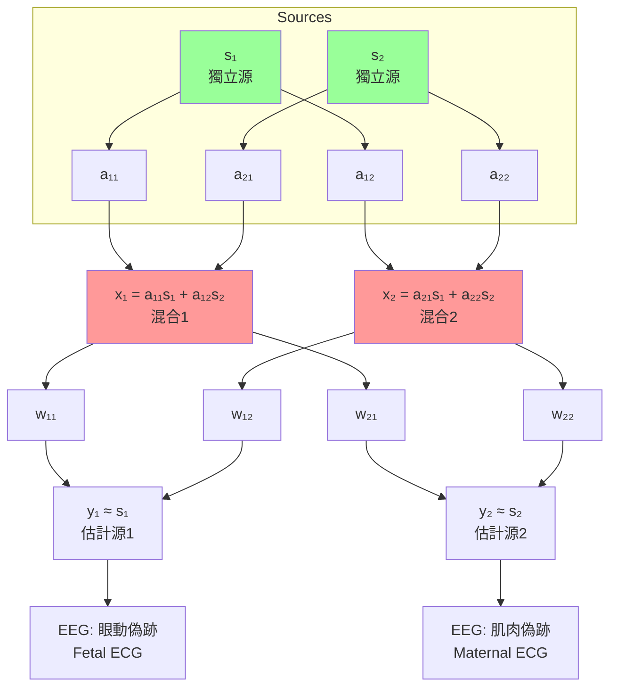
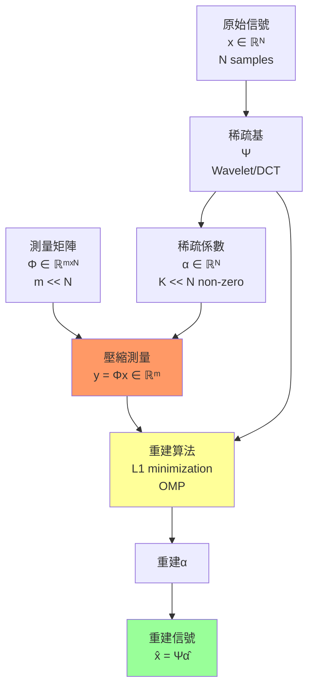
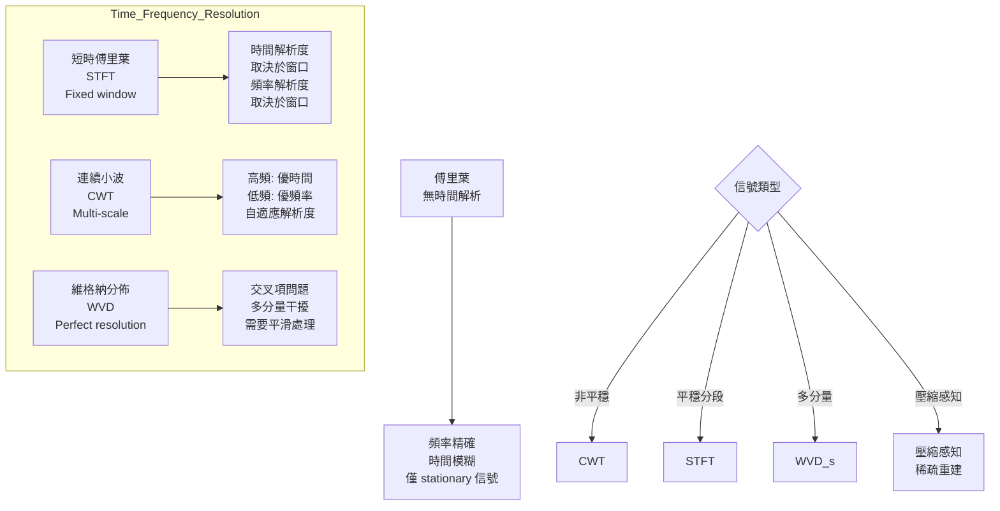

# Week 21 Notes — Advanced Biomedical Signals (BMED4504)

> **Course**: BMED4504 — Advanced Biomedical Signal Processing  
> **Week**: 21 of 24 | **Phase**: 4 (Advanced Research)  
> **Prerequisites**: Linear algebra, signals and systems, probability, Fourier analysis  
> **CE advantage**: Your signal processing knowledge (from structural health monitoring) transfers to biomedical signal analysis

---

## 問題 1：5 個核心心智模型

### 1. Wavelet Time-Frequency Analysis / 小波時頻分析

**Why Wavelets?** Fourier transform gives frequency content but loses time information. For non-stationary signals (like EEG seizures, EMG bursts), we need joint time-frequency representation.

**Continuous Wavelet Transform (CWT)**:
$$W_f(a, b) = \int_{-\infty}^{\infty} f(t) \psi_{a,b}^*(t) \, dt$$
where the wavelet is scaled and translated:
$$\psi_{a,b}(t) = \frac{1}{\sqrt{|a|}} \psi\left(\frac{t-b}{a}\right)$$

**Key Wavelets**:

| Wavelet | Notation | Application |
|---------|---------|-------------|
| Haar | — | Sharp transitions, computational simplicity |
| Daubechies | dbN (N = 2, 4, 6...) | General purpose, most popular |
| Symlet | symN | Near-symmetric version of db |
| Coiflet | coifN | Near-linear phase |
| Morlet | morl | Time-frequency analysis |

**Daubechies Wavelet Properties**:
- db2, db4, db6 — increasing smoothness
- Support length: 2N - 1
- Number of vanishing moments: N

**學者**: Ingrid Daubechies (Princeton) — pioneering wavelet theory; Stéphane Mallat (NYU) — multiresolution analysis.

---

### 2. ICA — Independent Component Analysis / 獨立成分分析

**Goal**: Given mixed signals X = AS, find unmixing matrix W = A⁻¹ to recover independent sources S.

**The Cocktail Party Problem**: Separate individual voices from multiple microphone recordings.

**ICA Model**:
$$x_i = \sum_{j=1}^{n} a_{ij} s_j + n_i$$
$$s_j = \sum_{i=1}^{n} w_{ji} x_i$$

**Assumptions**:
1. Sources are statistically independent (key assumption)
2. At most one source is Gaussian
3. Number of observations ≥ number of sources

**Objective Functions**:

**Infomax** (Bell & Sejnowski, 1995):
$$\max_W \sum_{t} \log p_y(y(t))$$
where y = Wx, maximize mutual information.

**FastICA** (Hyvärinen, 1999):
Minimize negentropy (measure of non-Gaussianity):
$$J(y) = H(y_{gaussian}) - H(y)$$
where H is differential entropy.

**Kurtosis** (4th-order cumulant):
$$\kappa_4(y) = E[y^4] - 3(E[y^2])^2$$
- Sub-Gaussian: κ < 0
- Super-Gaussian: κ > 0 (e.g., speech)
- Gaussian: κ = 0

**Applications in BME**:
| Signal | Artifacts Removed |
|--------|------------------|
| EEG | Eye blinks, muscle activity, line noise |
| ECG | Baseline wander, electrode movement |
| EMG | Cardiac interference |
| fMRI | Cardiac/respiratory noise |

**學者**: Aapo Hyvärinen (Helsinki) — FastICA; Tony Bell (Salk) — Infomax ICA.

---

### 3. Adaptive Filtering — LMS & RLS / 自適應濾波

**Goal**: Adaptively filter signals where noise characteristics are unknown or changing.

**LMS (Least Mean Squares)** Algorithm:

$$e(n) = d(n) - y(n)$$
$$y(n) = \mathbf{w}^T(n) \mathbf{x}(n)$$
$$\mathbf{w}(n+1) = \mathbf{w}(n) + \mu \cdot e(n) \cdot \mathbf{x}(n)$$

where μ = step size (0.001-0.1 typically).

**Stability condition**:
$$0 < \mu < \frac{2}{\lambda_{max}}$$
where λ_max = largest eigenvalue of autocorrelation matrix R = E[xx^T].

**Misalignment** (steady-state):
$$\text{MSE}_{min} \approx \frac{\mu \cdot \sigma_x^2 \cdot M}{4}$$
where M = filter length.

**RLS (Recursive Least Squares)**:
$$\mathbf{w}(n+1) = \mathbf{w}(n) + \mathbf{P}(n) \mathbf{x}(n) e(n)$$
where P(n) = inverse correlation matrix (exponentially windowed).

**LMS vs. RLS**:
| Property | LMS | RLS |
|----------|-----|-----|
| Complexity | O(M) | O(M²) |
| Convergence | Slow (μ-dependent) | Fast (order M iterations) |
| Stability | More stable | Sensitive to numerical errors |
| Tracking | Good | Excellent |

**Applications**:
- Adaptive noise cancellation (ANC)
- System identification
- Channel equalization
- Biomedical: fetal ECG extraction, cochlear implants

**學者**: Bernard Widrow (Stanford) — LMS adaptive filtering pioneer.

---

### 4. Compressive Sensing / 壓縮感知

**Core Idea**: If a signal is sparse in some basis, we can reconstruct it from far fewer measurements than Nyquist requires.

**Nyquist Rate Problem**: f_s ≥ 2f_max requires too many samples for:
- MRI: hours of scanning
- EEG: high-density arrays
- Wireless biosensors: power constraints

**Sparsity**: A signal x is K-sparse if only K coefficients are non-zero in basis Ψ:
$$\mathbf{x} = \mathbf{\Psi} \mathbf{\alpha}, \quad \|\mathbf{\alpha}\|_0 = K << N$$

**RIP (Restricted Isometry Property)**: Random matrices satisfy RIP with high probability if:
$$m \geq c \cdot K \cdot \log(N/K)$$
where m = measurements.

**Reconstruction Algorithms**:

**L1 minimization (Basis Pursuit)**:
$$\min \|\mathbf{\alpha}\|_1 \quad \text{s.t.} \quad \|\mathbf{y} - \mathbf{\Phi\Psi\alpha}\|_2 < \epsilon$$

**OMP (Orthogonal Matching Pursuit)** — greedy:
- Select atom most correlated with residual
- Update residual, repeat until convergence

**Applications in BME**:
| Application | Sparsity Basis | Compression |
|-------------|---------------|-------------|
| MRI | Wavelet + finite differences | 5-10× acceleration |
| EEG | Temporal/spatial sparse | 10-50× compression |
| CT | Wavelet | 4-6× dose reduction |
| fMRI | Temporal wavelet | Real-time imaging |

**學者**: Emmanuel Candès (Caltech) & Terence Tao (UCLA) — compressed sensing theory; Richard Baraniuk (Rice) — CS applications.

---

### 5. Time-Frequency Uncertainty Principle / 時頻不確定性原理

**The Fundamental Limit**:
$$\sigma_t \cdot \sigma_\omega \geq \frac{1}{2}$$

You cannot arbitrarily localize a signal in both time and frequency simultaneously.

**Resolution Trade-offs**:
| Transform | Time Res | Freq Res | Non-stationary |
|-----------|----------|----------|----------------|
| Fourier | None | Excellent | No |
| STFT | Good | Good | Limited |
| CWT | Excellent | Good | Yes |
| WVD | Excellent | Excellent | Yes (artifacts) |

**Wigner-Ville Distribution (WVD)**:
$$W_x(t, \omega) = \int x(t+\tau/2)x^*(t-\tau/2) e^{-j\omega\tau} d\tau$$
- Perfect time-frequency resolution
- Suffers from cross-term interference for multi-component signals

**Short-Time Fourier Transform (STFT)**:
$$STFT_x(t, \omega) = \int x(\tau) w(t-\tau) e^{-j\omega\tau} d\tau$$
- Resolution set by window length
- Short window → good time, poor frequency
- Long window → poor time, good frequency

**Choice of transform**:
- EEG (seizures): CWT with Morlet wavelet
- EMG (bursts): STFT with short window
- Heart rate variability: Fourier (stationary segments)

---

## 問題 2：3 個根本分歧

### 分歧 1：DWT vs. CWT — When to Use Which?

**Discrete Wavelet Transform (DWT)**:
- Downsampling at each level (dyadic)
- Fast, O(N) algorithm (Mallat's algorithm)
- Perfect reconstruction possible
- Fixed dyadic scales (a = 2^j)
- Best for: denoising, compression, feature extraction

**Continuous Wavelet Transform (CWT)**:
- No downsampling, redundant representation
- Continuous scale/translation parameters
- Allows arbitrary scale selection
- More interpretable for time-frequency visualization
- Best for: time-frequency analysis, singularity detection

**Resolution**: Use DWT for computational efficiency and signal processing applications; use CWT for exploratory time-frequency analysis. In practice, CWT is often used first to understand signal characteristics, then DWT is implemented for deployment.

---

### 分歧 2：ICA vs. PCA — What's the Difference?

**PCA (Principal Component Analysis)**:
- Finds orthogonal directions of maximum variance
- Reduces dimensionality
- Sources may be Gaussian and uncorrelated
- Does NOT guarantee statistical independence
- Linear transformation only

**ICA (Independent Component Analysis)**:
- Finds statistically independent (non-Gaussian) sources
- Does NOT require orthogonality
- Solves blind source separation
- More general than PCA
- PCA is a subset of ICA (first step in many ICA algorithms)

**Resolution**: Use PCA when you need dimensionality reduction or data compression. Use ICA when you need to separate physically distinct sources. ICA can be seen as PCA + rotation that maximizes non-Gaussianity.

---

### 分歧 3：LMS vs. RLS — Which Adaptive Filter?

**LMS**:
- Simple, computationally efficient
- Slow convergence (requires μ << 1)
- Good tracking of slow changes
- Robust to noise
- Requires 100-1000× filter length iterations to converge

**RLS**:
- Fast convergence (order M iterations)
- Higher computational cost O(M²)
- Sensitive to numerical precision
- Excellent for rapidly changing systems
- Requires careful regularization

**Resolution**: Use LMS for:
- Simple noise cancellation
- Real-time embedded systems (computational constraints)
- Slowly changing environments

Use RLS for:
- Rapidly changing systems
- When fast convergence is critical
- When computational resources are available

Hybrid approaches exist (LMS initialization → RLS fine-tuning).

---

## 10 個深度問題

1. Derive the Mallat algorithm for the DWT. Show how the low-pass and high-pass filters decompose a signal into approximation and detail coefficients.

2. Explain why ICA requires non-Gaussian sources. What happens if all sources are Gaussian?

3. In LMS adaptive filtering, derive the condition for stability and explain the trade-off between convergence speed and steady-state error.

4. A 128-channel EEG is sampled at 1000 Hz for 10 minutes. How much data is this? If we use compressive sensing with 10× compression, how many measurements are needed?

5. Compare the time-frequency resolution of STFT vs. CWT. When would you choose one over the other for EEG analysis?

6. Explain the concept of "matching pursuits" for signal decomposition. How does it differ from wavelet decomposition?

7. In the Wigner-Ville distribution, what are "cross-terms" and why do they occur? How can they be suppressed?

8. Design an adaptive noise cancellation system for extracting fetal ECG from maternal abdominal recordings. What are the challenges?

9. What is the restricted isometry property (RIP) and why is it important for compressive sensing? Give an example of a matrix that satisfies RIP.

10. For a biomedical signal with 60 Hz power line interference, design a notch filter using adaptive filtering. Compare with a fixed FIR notch filter.

---

# 核心概念深化（中英對照）

## 1. 小波變換 Wavelet Transform

### 1.1 中英對照

| 中文 | English |
|------|---------|
| 小波 (Wavelet) | Small wave — basis function localized in time and frequency |
| 尺度 (Scale) | Wavelet stretching/compression parameter |
| 平移 (Translation) | Wavelet position parameter |
| 近似係數 (Approximation Coefficients) | Low-frequency components |
| 細節係數 (Detail Coefficients) | High-frequency components |

### 1.2 Mallat 算法

**Decomposition**:
$$c_{j+1} = \downarrow 2 [h * c_j] \quad \text{(approximation)}$$
$$d_{j+1} = \downarrow 2 [g * c_j] \quad \text{(detail)}$$

**Reconstruction**:
$$c_j = \uparrow 2 [h^{\text{rev}} * c_{j+1}] + \uparrow 2 [g^{\text{rev}} * d_{j+1}]$$

---

## 2. ICA 獨立成分分析

### 2.1 中英對照

| 中文 | English |
|------|---------|
| 盲源分離 (Blind Source Separation) | Separating sources without knowing mixing |
| 非高斯性 (Non-Gaussianity) | Measure of deviation from Gaussian |
| 峰度 (Kurtosis) | 4th-order cumulant |
| 負熵 (Negentropy) | H(gaussian) - H(signal) |
| 峭度 (Kurtosis) | E[x⁴] - 3(E[x²])² |

---

## 3. 自適應濾波 Adaptive Filtering

### 3.1 中英對照

| 中文 | English |
|------|---------|
| 自適應濾波 (Adaptive Filter) | Filter that adjusts coefficients automatically |
| LMS | Least Mean Squares algorithm |
| RLS | Recursive Least Squares algorithm |
| 步長 (Step Size) | μ — controls convergence speed |
| 穩態誤差 (Steady-state Error) | Residual error after convergence |

---

## 4. 壓縮感知 Compressed Sensing

### 4.1 中英對照

| 中文 | English |
|------|---------|
| 稀疏 (Sparsity) | Most coefficients are zero |
| 測量矩陣 (Measurement Matrix) | Φ — projects signal to compressed domain |
| 基追蹤 (Basis Pursuit) | L1 minimization reconstruction |
| RIP | Restricted Isometry Property |
| 零空間 (Null Space) | Set of vectors mapped to zero |

---

## 5. 時頻分析 Time-Frequency

### 5.1 中英對照

| 中文 | English |
|------|---------|
| 短時傅里葉變換 (STFT) | Short-time Fourier transform |
| 維格納分佈 (WVD) | Wigner-Ville distribution |
| 交叉項 (Cross Terms) | Interference in WVD from multiple components |
| 不確定性原理 (Uncertainty Principle) | Cannot simultaneously localize time and frequency |

---

## 5 個 Mermaid 圖解

### 圖 1: DWT 多尺度分解

```mermaid
graph LR
    subgraph Level_0
        S0[原始信號<br>x[n]<br>N samples]
    end
    
    S0 --> L0[c₀<br>Approx Coeff<br>N/2]
    S0 --> H0[d₀<br>Detail Coeff<br>N/2]
    
    L0 --> L1[c₁<br>Approx Coeff<br>N/4]
    H0 --> H1[d₁<br>Detail Coeff<br>N/4]
    
    L1 --> L2[c₂<br>Approx Coeff<br>N/8]
    H1 --> H2[d₂<br>Detail Coeff<br>N/8]
    
    L2 --> L3[c₃<br>Approx Coeff<br>N/16]
    H2 --> H3[d₃<br>Detail Coeff<br>N/16]
    
    L3 --> L4[最終近似<br>cJ<br>Low freq]
    
    H3 --> D[細節層次<br>High freq details]
    
    style S0 fill:#f9f
    style L4 fill:#bff,stroke:#00f
    style D fill:#ffb,stroke:#f80
```

### 圖 2: ICA 盲源分離



### 圖 3: LMS 自適應濾波

```mermaid
graph LR
    S[Signal<br>d(n)] --> E[減法器<br>Σ]
    X[x(n)] --> F[自適應濾波器<br>w(n)]
    F --> Y[y(n)<br>估計噪聲]
    Y --> E
    E --> N[e(n)<br>誤差]
    N --> UW[更新權重<br>μ·e(n)·x(n)]
    UW --> F
    
    E --> OUT[e(n)<br>clean signal]
    
    style F fill:#bff
    style E fill:#fbb
    style OUT fill:#9f9
```

### 圖 4: 壓縮感知



### 圖 5: 時頻解析度



---

## 總結 Summary

### 關鍵方程式

| Topic | Equation |
|-------|----------|
| CWT | W_f(a,b) = ∫ f(t)ψ*((t-b)/a)/√a dt |
| LMS update | w(n+1) = w(n) + μ·e(n)·x(n) |
| RLS | P(n) = (P(n-1) - ...)/λ |
| Sparsity | x = Ψα, ||α||₀ = K << N |
| CS measurement | y = Φx, m ≥ c·K·log(N/K) |
| Uncertainty | σ_t·σ_ω ≥ 1/2 |

### Week 21 核心 takeaways

1. **小波變換提供時頻分析** — CWT用於探索,DWT用於計算
2. **ICA解決盲源分離** — 最大化非高斯性來分離獨立源
3. **LMS簡單穩健,RLS快速收斂** — 根據應用選擇
4. **壓縮感知利用稀疏性** — 從遠少於奈奎斯特的測量重建信號
5. **時頻不確定性原理** — 任何變換都有時間和頻率解析度的 trade-off
