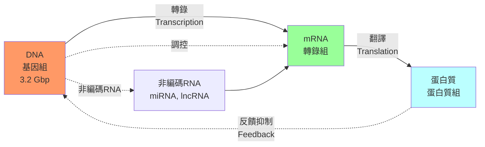
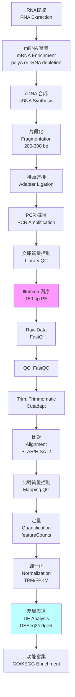
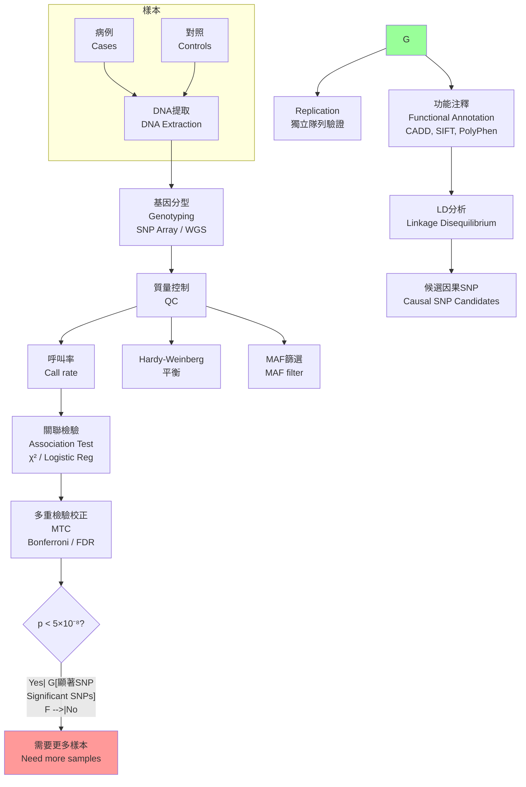
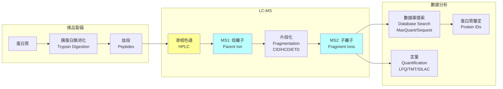
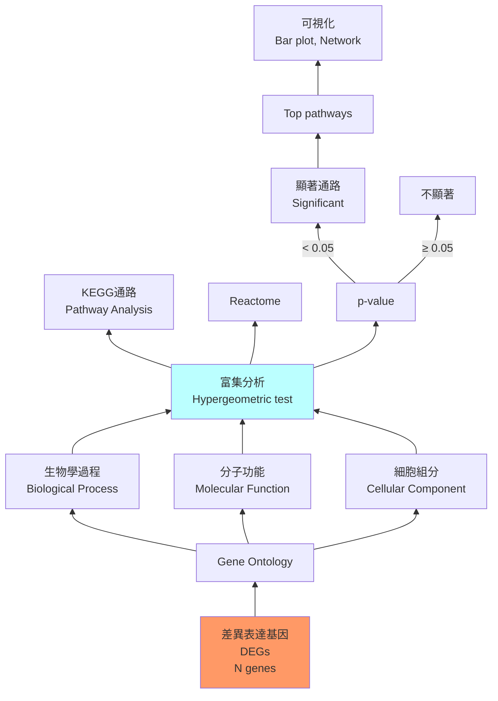

# Week 22 Notes — Omics: Genomics, Proteomics, and Bioinformatics (BIOC3605)

> **Course**: BIOC3605 — Omics and Systems Biology  
> **Week**: 22 of 24 | **Phase**: 4 (Advanced Research)  
> **Prerequisites**: Molecular biology, genetics, statistics, linear algebra  
> **CE advantage**: Your quantitative/statistical skills transfer directly to bioinformatics analysis

---

## 問題 1：5 個核心心智模型

### 1. The Central Dogma: DNA → RNA → Protein / 中心法則

**The Flow of Genetic Information**:

```
DNA ( genome ) ──transcription──→ mRNA ( transcriptome )
                                       │
                                  translation
                                       │
                    Protein ( proteome ) ←──────────
                         
                         Epigenome ────→ Regulates transcription
```

**Key Numbers**:
| Genome | Size |
|--------|------|
| Human genome | 3.2 billion bp (3.2 Gbp) |
| Protein-coding genes | ~20,000-21,000 |
| Non-coding DNA | ~98.5% |
| Average gene length | ~27,000 bp |
| Average protein length | ~480 amino acids |

**The Genome**:
- Chromosomes: 22 autosomes + X + Y
- ~3.2 × 10⁹ base pairs
- ~20,000 protein-coding genes
- Gene density: ~1 gene per 100,000 bp

**The Transcriptome**:
- Total RNA: ~1% of DNA
- mRNA: ~1-5% of total RNA
- Alternative splicing: average human gene produces ~3-5 isoforms
- RNA-seq depth: 10-50 million reads per sample

**The Proteome**:
- ~20,000-21,000 proteins (1:1 with genes, approximately)
- Post-translational modifications (PTMs): phosphorylation, glycosylation, ubiquitination
- Mass spec sensitivity: fmol (10⁻¹⁵ mol) level

**學者**: Francis Crick (DNA structure, 1953); James Watson (DNA structure); Frederick Sanger (DNA sequencing).

---

### 2. Sequence Alignment / 序列比對

**Why Alignment?** Compare DNA/protein sequences to find evolutionary relationships, functional homology, or mutations.

**Types of Alignment**:

| Type | Description |
|------|-------------|
| Global | Align entire sequences (Needleman-Wunsch) |
| Local | Align best-matching subsequences (Smith-Waterman) |
| Pairwise | Two sequences |
| Multiple | Three or more sequences |

**Scoring System**:
- Match: +1
- Mismatch: -1
- Gap opening: -10
- Gap extension: -1

**BLAST (Basic Local Alignment Search Tool)**:
Altschul et al. (1990) — the most widely used bioinformatics tool.

$$E\text{-value} = K \cdot m \cdot n \cdot e^{-\lambda S}$$

where m = query length, n = database size, S = alignment score.

**BLAST Output**:
- Query coverage
- Percent identity
- E-value (expected matches by chance)
- Bit score

**Key thresholds**:
| E-value | Interpretation |
|---------|----------------|
| < 10⁻¹⁰⁰ | Identical sequences |
| < 10⁻⁵⁰ | Highly similar |
| < 10⁻⁵ | Similar (possible homology) |
| < 0.01 | Weakly similar |
| > 1 | Not significant |

**學者**: Stephen Altschul (NCBI); Margaret Dayhoff (PAM matrices); Henikoff & Henikoff (BLOSUM matrices).

---

### 3. RNA-seq and Differential Expression / RNA測序與差異表達

**RNA-seq Workflow**:

```
RNA extraction → mRNA enrichment → cDNA synthesis → Library prep → Sequencing
     ↓
Cluster generation → Illumina sequencing (150 bp paired-end)
     ↓
Quality control (FastQC) → Trimming → Alignment (STAR/HISAT2)
     ↓
Quantification → Normalization → Differential expression (DESeq2/edgeR)
```

**Expression Quantification**:

**RPKM** (Reads Per Kilobase per Million mapped reads):
$$RPKM = \frac{10^6 \cdot R}{N \cdot L}$$
where R = reads mapping to gene, N = total mapped reads (millions), L = gene length (kb).

**FPKM** (Fragments Per Kilobase per Million): Same as RPKM but for paired-end reads (1 fragment = 2 reads).

**TPM** (Transcripts Per Million):
$$TPM_i = \frac{R_i / L_i}{\sum_j (R_j / L_j)} \times 10^6$$

TPM is preferred because it normalizes for both gene length AND sequencing depth.

**Differential Expression Analysis**:

**DESeq2** method (Love et al., 2014):
- Uses negative binomial distribution
- Models variance as function of mean
- Includes shrinkage for dispersion estimation

**Fold Change**:
$$\text{FC} = \frac{\text{Expression}_{treatment}}{\text{Expression}_{control}}$$
$$\log_2\text{FC} = \log_2\left(\frac{\text{Expr}_T}{\text{Expr}_C}\right)$$

**Significance**:
- p-value < 0.05 (or adjusted p < 0.05 after FDR correction)
- |log2FC| > 1 (2-fold change)

**學者**: Simon Anders (DESeq2); Michael Love (DESeq2); Rafael Irizarry (R/Bioconductor).

---

### 4. GWAS — Genome-Wide Association Studies / 全基因組關聯研究

**The GWAS Revolution**: From candidate gene studies to unbiased genome-wide screening.

**GWAS Workflow**:

```
Cases (disease) vs. Controls (healthy)
         ↓
DNA extraction → Genotyping (SNP arrays) or Sequencing
         ↓
QC: call rate, HWE, MAF > 5%
         ↓
Association test: χ² or logistic regression per SNP
         ↓
Multiple testing correction (Bonferroni: p < 5×10⁻⁸)
         ↓
Manhattan plot → QQ plot → Functional annotation
```

**Key Numbers**:
| Parameter | Value |
|-----------|-------|
| Human SNPs | ~10 million known |
| GWAS SNP array | ~500K - 5M variants |
| Whole genome sequencing | ~3 billion bp |
| Significant threshold | p < 5 × 10⁻⁸ |
| Typical sample size | 1,000 - 1,000,000+ |

**Population Stratification**:
- Systematic differences in ancestry between cases/controls
- Confounds association tests
- Solution: PCA-based correction, linear mixed models

**Heritability**:
- SNP-based heritability (h²SNP): ~0.2-0.5 for common diseases
- Missing heritability: many variants have small effects

**GWAS Limitations**:
1. Linkage disequilibrium (LD) — associated SNP may not be causal
2. Non-coding variants — function often unclear
3. Effect sizes — typically OR < 1.5
4. Sample size — need 10,000s for rare variants

**學者**: David Altshuler (Broad Institute); Eric Lander (Broad); Robert Plenge (DEX, Inc).

---

### 5. Proteomics and Mass Spectrometry / 蛋白質組學與質譜

**Mass Spectrometry Workflow**:

```
Protein extraction → Digestion (trypsin) → LC-MS/MS → Database search → Quantification
                                    ↓
                              Peptide fragmentation
                                    ↓
                              MS/MS spectra
```

**MS Instrument Types**:

| Instrument | Resolution | Accuracy | Application |
|------------|------------|----------|-------------|
| MALDI-TOF | Medium | ~100 ppm | Peptide mass fingerprinting |
| Q-TOF | High | < 10 ppm | Proteomics |
| Orbitrap | Very high | < 2 ppm | Deep proteomics |
| FT-ICR | Ultra-high | < 1 ppm | Highest accuracy |

**Quantification Methods**:

**Label-free quantification (LFQ)**:
- Spectral counting
- Peak intensity
- Software: MaxQuant, Proteome Discoverer

**Isobaric labeling**:
- TMT (Tandem Mass Tags): 6-plex, 10-plex, 16-plex
- iTRAQ: 4-plex, 8-plex
- Method: Reporter ion intensities at m/z 126-131

**SILAC** (Stable Isotope Labeling by Amino acids in Cell culture):
- Light: ¹²C₆¹⁴N₂-lysine
- Medium: ²H₄-lysine
- Heavy: ¹³C₆¹⁵N₂-lysine

**Key Sensitivity Numbers**:
| Method | Sensitivity |
|--------|------------|
| MS/MS identification | fmol (10⁻¹⁵ mol) |
| Targeted (SRM/MRM) | attomol (10⁻¹⁸ mol) |
| DIA/SWATH | ~50% of proteome |

**學者**: Matthias Mann (Max Planck); John Yates (Scripps); Ruedi Aebersold (ETH Zurich).

---

## 問題 2：3 個根本分歧

### 分歧 1：GWAS vs. Candidate Gene Studies — Which Approach?

**Candidate gene studies**:
- Test specific, hypothesis-driven genes
- Small sample sizes (100-1000)
- Higher false positive rate
- Limited to known biology

**GWAS**:
- Unbiased, genome-wide screening
- Large sample sizes (10,000-1,000,000+)
- Stringent multiple testing correction
- Discovers novel associations

**Resolution**: GWAS has revolutionized discovery; candidate gene studies are now mostly used for replication and functional follow-up. Use GWAS for discovery, candidate studies for validation.

---

### 分歧 2：RNA-seq vs. Microarrays — Which Technology?

**Microarrays**:
- Hybridization-based
- Pre-specified probes
- Lower cost per sample
- Cross-hybridization issues
- Limited dynamic range (~10³-10⁴)

**RNA-seq**:
- Sequencing-based
- No probes needed (de novo)
- Wider dynamic range (>10⁵)
- Detects novel transcripts, splice variants
- Higher cost, more complex analysis

**Resolution**: RNA-seq is now standard for most applications. Use microarrays only for large epidemiological studies with many samples where cost is critical.

---

### 分歧 3：Protein vs. mRNA Expression — Which Matters More?

**mRNA advantages**:
- Technically easier to measure
- Larger dynamic range
- cheaper

**Protein advantages**:
- Functional read-out
- Post-translational modifications
- mRNA/protein correlation often < 0.5

**Resolution**: Both matter. mRNA is a proxy for protein, but translation efficiency, protein stability, and PTMs create divergence. For mechanistic studies, measure both.

---

## 10 個深度問題

1. The human genome is ~3.2 Gbp but contains only ~20,000 protein-coding genes. What does the remaining ~98.5% of the genome do?

2. Calculate the E-value for a BLAST alignment with score S = 50, λ = 0.3, K = 0.1, m = 1000 (query), n = 10⁹ (database). Is this significant?

3. In RNA-seq, why is TPM preferred over RPKM for comparing expression across samples?

4. A GWAS identifies a SNP with p = 10⁻⁶. Is this genome-wide significant? What correction would you apply?

5. Explain why SNP-based heritability (h²SNP) is typically lower than narrow-sense heritability (H²) from twin studies.

6. In mass spectrometry, explain the difference between MS (mass-to-charge ratio) and MS/MS (tandem mass spectrometry). What does each provide?

7. Design an experiment to identify protein-protein interactions using mass spectrometry. What controls would you include?

8. What is linkage disequilibrium (LD)? How does it affect the interpretation of GWAS results?

9. Compare TMT labeling vs. label-free quantification for proteomics. What are the advantages and disadvantages of each?

10. In the central dogma, information flows from DNA to RNA to protein. What additional layers of regulation exist at each step?

---

# 核心概念深化（中英對照）

## 1. 基因組學 Genomics

### 1.1 中英對照

| 中文 | English |
|------|---------|
| 基因組 (Genome) | Complete set of DNA in an organism |
| 染色體 (Chromosome) | Linear DNA + proteins |
| 單核苷酸多態性 (SNP) | Single nucleotide polymorphism |
| 測序 (Sequencing) | Determining nucleotide order |

---

## 2. 轉錄組學 Transcriptomics

### 2.1 中英對照

| 中文 | English |
|------|---------|
| 轉錄組 (Transcriptome) | Complete set of RNA in a cell |
| 差異表達 (Differential Expression) | Genes with different expression between conditions |
| RPKM/FPKM | Reads/Fragments Per Kilobase per Million |
| TPM | Transcripts Per Million |
| RNA-seq | RNA sequencing |

---

## 3. 蛋白質組學 Proteomics

### 3.1 中英對照

| 中文 | English |
|------|---------|
| 蛋白質組 (Proteome) | Complete set of proteins |
| 質譜 (Mass Spectrometry) | MS technique for protein identification |
| 翻譯後修飾 (PTM) | Post-translational modification |
| 翻譯 (Translation) | mRNA → protein |

---

## 5 個 Mermaid 圖解

### 圖 1: 中心法則



### 圖 2: RNA-seq 工作流



### 圖 3: GWAS 工作流



### 圖 4: 質譜蛋白質組學



### 圖 5: 基因富集分析



---

## 總結 Summary

### 關鍵數字

| Parameter | Value |
|-----------|-------|
| Human genome | 3.2 Gbp |
| Protein-coding genes | ~20,000 |
| RNA-seq depth | 10-50 M reads |
| GWAS significance | p < 5 × 10⁻⁸ |
| Mass spec sensitivity | fmol level |

### Week 22 核心 takeaways

1. **中心法则是基础** — DNA→RNA→蛋白質的信息流，加上表觀遺傳調控
2. **BLAST 是序列比對的基礎工具** — E-value 判斷顯著性
3. **RNA-seq 需要 TPM 歸一化** — 比較跨樣本表達
4. **GWAS 發現疾病相關變異** — 需要多重檢驗校正
5. **質譜是蛋白質組學的核心** — 從 MS1 到 MS/MS 的肽段鑒定
